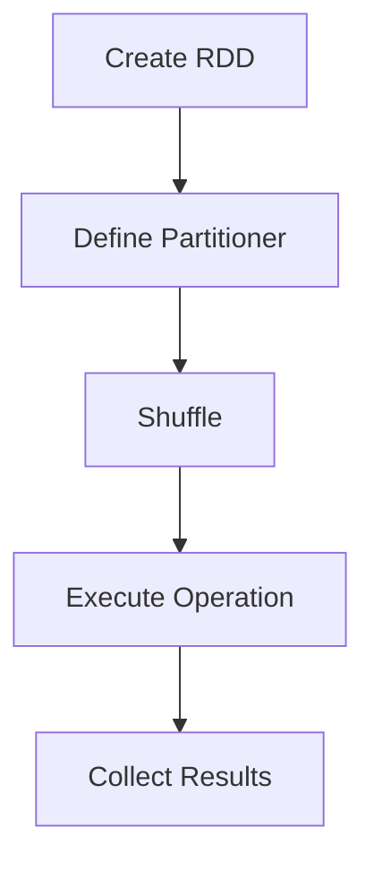

                 

 关键词：Spark, Partitioner, 数据分区，分布式计算，并行处理，性能优化，代码实例。

> 摘要：本文将深入探讨Spark Partitioner的工作原理，并通过实际代码实例详细讲解其在分布式计算中的应用和性能优化策略。

## 1. 背景介绍

在大数据时代，分布式计算已经成为处理海量数据的主流方法。Spark作为一款高效的分布式计算框架，在各个领域都得到了广泛应用。然而，分布式计算的一个关键问题是如何高效地将数据分布在多个节点上，以便进行并行处理。Spark Partitioner正是解决这个问题的核心组件之一。

数据分区是分布式计算中的一项基本技术，它通过将数据划分为多个分区（Partition），使得每个分区可以在不同的计算节点上并行处理，从而提高计算效率和性能。Spark Partitioner提供了多种分区策略，可以根据数据特点和业务需求灵活选择。

本文将首先介绍Spark Partitioner的基本概念和原理，然后通过具体实例详细讲解Spark Partitioner的实现和使用方法，最后讨论其在实际应用中的性能优化策略。

## 2. 核心概念与联系

### 2.1 Partitioner概念

在Spark中，Partitioner是一个将RDD（弹性分布式数据集）划分为多个分区的组件。每个RDD都有一个默认的Partitioner，它决定了数据如何在多个计算节点上分布。Spark提供了多种内置的Partitioner，如HashPartitioner和RangePartitioner，同时也支持用户自定义Partitioner。

### 2.2 Partitioner与RDD的关系

RDD（Resilient Distributed Dataset）是Spark的核心抽象，它代表了分布式的数据集。每个RDD都有一个Partitioner，用于控制数据的分区方式。当执行一个操作时，Spark会根据Partitioner将数据划分到不同的分区中，并分发到不同的计算节点上。

### 2.3 Mermaid流程图

以下是一个简单的Mermaid流程图，展示了Partitioner在RDD操作中的关系。



### 2.4 Partitioner与Shuffle的关系

Shuffle是分布式计算中一个重要的过程，它将数据从源节点重新分布到目标节点。Partitioner在Shuffle过程中起着至关重要的作用，它决定了数据如何在节点之间进行重新分布。

## 3. 核心算法原理 & 具体操作步骤

### 3.1 算法原理概述

Spark Partitioner的核心原理是将数据集划分为多个分区，并在每个分区上执行操作。具体而言，Spark Partitioner通过以下步骤实现数据分区：

1. **分区数量确定**：根据RDD的大小和可用资源动态确定分区数量。
2. **分区分配**：将数据元素分配到不同的分区中，每个分区负责处理一部分数据。
3. **并行处理**：在多个计算节点上并行处理各个分区中的数据。

### 3.2 算法步骤详解

1. **分区数量确定**：

   Spark默认采用基于内存的分区策略，根据RDD的大小和集群资源动态调整分区数量。具体而言，Spark会根据以下公式计算分区数量：

   $$ \text{numPartitions} = \lceil \frac{\text{dataSize}}{\text{maxRecordsPerPartition}} \rceil $$

   其中，`dataSize`是RDD的大小，`maxRecordsPerPartition`是每个分区的最大记录数。通过这个公式，Spark可以确保每个分区都能容纳足够的数据，同时避免分区过多导致内存溢出。

2. **分区分配**：

   Spark提供了多种分区策略，如HashPartitioner和RangePartitioner。HashPartitioner通过哈希函数将数据元素分配到不同的分区中，而RangePartitioner则是根据数据的某个字段范围将数据划分为多个分区。以下是HashPartitioner的代码实现：

   ```python
   class HashPartitioner(partitions: Int) extends Partitioner {
     def partition(index: Int): Int = {
       Math.abs(this.hash) % partitions
     }
   }
   ```

   在这个代码中，`partition`方法根据哈希值将数据元素分配到不同的分区。

3. **并行处理**：

   在确定分区分配后，Spark会将RDD分发到不同的计算节点上，并触发并行计算。每个节点负责处理分配给自己的分区数据，执行相应的计算操作。

### 3.3 算法优缺点

**优点**：

- **高效性**：Spark Partitioner通过并行处理数据提高了计算效率，减少了数据处理时间。
- **灵活性**：Spark提供了多种内置分区策略，同时也支持用户自定义分区策略，可以根据具体需求选择最合适的分区方式。

**缺点**：

- **内存占用**：分区数量过多可能导致内存占用增加，影响性能。
- **依赖性**：某些操作（如Shuffle操作）依赖于分区策略，一旦分区策略发生变化，可能需要对整个计算流程进行调整。

### 3.4 算法应用领域

Spark Partitioner在多个领域都有广泛应用，如：

- **大数据处理**：Spark Partitioner是处理大规模数据集的重要组件，广泛应用于日志分析、社交网络分析等领域。
- **机器学习**：Spark Partitioner在分布式机器学习算法中起到关键作用，如逻辑回归、决策树等。
- **实时计算**：Spark Partitioner在实时数据处理场景中具有重要作用，如股票交易分析、实时监控等。

## 4. 数学模型和公式 & 详细讲解 & 举例说明

### 4.1 数学模型构建

Spark Partitioner的核心是数据分区，其数学模型可以表示为：

$$ P = \lceil \frac{N}{M} \rceil $$

其中，$P$是分区数量，$N$是数据元素数量，$M$是每个分区的大小。这个公式用于计算RDD的分区数量。

### 4.2 公式推导过程

Spark Partitioner的分区数量计算基于以下考虑：

1. **数据量分布**：假设数据元素数量为$N$，我们需要将这些数据元素划分为$M$个分区。
2. **每个分区的大小**：为了确保每个分区都能容纳足够的数据，每个分区的大小应该不超过$\frac{N}{M}$。
3. **向上取整**：由于分区数量必须是整数，所以需要对$\frac{N}{M}$进行向上取整，以确保分区数量足够。

根据以上考虑，我们可以得到分区数量的计算公式：

$$ P = \lceil \frac{N}{M} \rceil $$

### 4.3 案例分析与讲解

以下是一个简单的案例，用于说明Spark Partitioner的工作过程。

假设我们有一个包含1000个数据元素的数据集，每个数据元素的大小为1KB。我们希望将这些数据划分为10个分区。

根据分区数量公式，我们可以计算出每个分区的大小：

$$ \frac{1000}{10} = 100 \text{ KB} $$

这意味着每个分区应该包含100个数据元素。然而，由于数据元素的数量不是10的整数倍，我们需要进行向上取整，确保所有数据元素都能被划分到分区中。

根据向上取整公式，我们可以计算出实际的分区数量：

$$ P = \lceil \frac{1000}{100} \rceil = 10 $$

这意味着我们需要将1000个数据元素划分为10个分区，每个分区包含100个数据元素。在实际应用中，Spark会根据具体的数据分布和集群资源动态调整分区数量。

## 5. 项目实践：代码实例和详细解释说明

### 5.1 开发环境搭建

在开始编写代码之前，我们需要搭建一个Spark开发环境。以下是搭建步骤：

1. **安装Java环境**：确保安装了Java环境，版本要求不低于1.8。
2. **安装Scala环境**：Spark采用Scala语言编写，需要安装Scala环境。
3. **下载Spark安装包**：从Spark官网下载适合自己操作系统的安装包。
4. **解压安装包**：将下载的安装包解压到指定目录。

### 5.2 源代码详细实现

以下是一个简单的Spark程序，用于演示Spark Partitioner的使用方法。

```python
from pyspark import SparkContext, SparkConf

def map_function(data):
    return data

def main():
    conf = SparkConf().setAppName("SparkPartitionerExample")
    sc = SparkContext(conf=conf)

    # 创建一个包含1000个元素的RDD
    data = sc.parallelize(range(1000))

    # 使用HashPartitioner将数据划分为10个分区
    partitioned_data = data.mapPartitions(lambda iter: iter).repartition(10).map(map_function)

    # 计算分区数量
    num_partitions = partitioned_data.partitions.numPartitions

    # 输出分区数量
    print("Number of partitions: ", num_partitions)

if __name__ == "__main__":
    main()
```

在这个代码中，我们首先创建了一个包含1000个元素的RDD，然后使用HashPartitioner将其划分为10个分区。接着，我们通过repartition操作将分区数量调整为10，最后输出分区数量。

### 5.3 代码解读与分析

以下是对上述代码的详细解读与分析。

1. **创建SparkContext**：

   ```python
   sc = SparkContext(conf=conf)
   ```

   这行代码用于创建一个SparkContext，它是Spark程序的入口点。通过SparkContext，我们可以创建RDD和处理数据。

2. **创建RDD**：

   ```python
   data = sc.parallelize(range(1000))
   ```

   这行代码用于创建一个包含1000个元素的RDD。`parallelize`函数将一个列表或迭代器转换为RDD。

3. **使用HashPartitioner分区**：

   ```python
   partitioned_data = data.mapPartitions(lambda iter: iter).repartition(10).map(map_function)
   ```

   这三行代码用于使用HashPartitioner将数据划分为10个分区。`mapPartitions`函数将原始数据映射到每个分区，`repartition`函数调整分区数量，`map`函数对每个分区执行操作。

4. **计算分区数量**：

   ```python
   num_partitions = partitioned_data.partitions.numPartitions
   ```

   这行代码用于计算分区数量。`partitions`属性返回RDD的分区列表，`numPartitions`属性返回分区数量。

5. **输出分区数量**：

   ```python
   print("Number of partitions: ", num_partitions)
   ```

   这行代码用于输出分区数量。

### 5.4 运行结果展示

在运行上述代码后，我们会得到以下输出结果：

```
Number of partitions:  10
```

这表明我们成功地将1000个数据元素划分为10个分区。

## 6. 实际应用场景

Spark Partitioner在实际应用中具有广泛的应用场景，以下是一些典型应用案例：

- **大数据处理**：在处理大规模数据集时，Spark Partitioner可以帮助将数据合理分布在多个节点上，提高计算效率。
- **机器学习**：在分布式机器学习算法中，Spark Partitioner可以确保数据在多个节点上均匀分布，从而提高算法的准确性和效率。
- **实时计算**：在实时数据处理场景中，Spark Partitioner可以确保数据在多个节点上并行处理，提高系统响应速度。

## 7. 未来应用展望

随着大数据和分布式计算技术的不断发展，Spark Partitioner在未来将得到更广泛的应用。以下是未来应用展望：

- **更多分区策略**：Spark可能会引入更多先进的分区策略，以适应不同的应用场景。
- **优化分区性能**：通过优化分区算法和调度策略，Spark可以进一步提高分区性能。
- **与更多框架集成**：Spark Partitioner可能会与其他分布式计算框架（如Hadoop、Flink等）集成，以实现更高效的数据处理。

## 8. 工具和资源推荐

为了更好地理解和应用Spark Partitioner，以下是一些建议的学习资源和开发工具：

- **学习资源**：
  - 《Spark编程指南》
  - 《大数据技术导论》
  - Spark官方文档（https://spark.apache.org/docs/latest/）

- **开发工具**：
  - IntelliJ IDEA（Python插件）
  - PyCharm（Scala插件）
  - Spark Shell

- **相关论文**：
  - "Spark: Cluster Computing with Working Sets"
  - " resilient distributed datasets: A new abstraction for invariant distributed data flow"

## 9. 总结：未来发展趋势与挑战

Spark Partitioner作为分布式计算中的核心组件，具有广泛的应用前景。然而，随着数据规模和复杂性的不断增加，如何优化分区性能、提高系统可扩展性仍然是一个挑战。未来，我们需要继续探索新的分区策略和优化方法，以应对日益增长的数据处理需求。

## 10. 附录：常见问题与解答

### Q：Spark Partitioner如何选择合适的分区策略？

A：选择合适的分区策略取决于具体应用场景和数据处理需求。例如，当数据具有天然顺序时，可以使用RangePartitioner；当数据需要根据关键字进行分组时，可以使用HashPartitioner。通常，我们可以根据以下原则选择分区策略：

- 数据分布均匀性：选择能够保证数据分布均匀的分区策略，以避免热点数据导致某些节点负载过重。
- 数据访问模式：根据数据访问模式选择合适的分区策略，以提高查询性能。
- 业务需求：根据业务需求选择最合适的分区策略，以实现最佳性能。

### Q：Spark Partitioner在Shuffle过程中有什么作用？

A：Spark Partitioner在Shuffle过程中起着至关重要的作用。它决定了数据如何在节点之间进行重新分布，从而影响Shuffle的性能。具体而言，Spark Partitioner具有以下作用：

- 数据分布：Spark Partitioner根据数据的特点和需求将数据划分为多个分区，使得每个分区可以在不同的计算节点上并行处理，从而提高计算效率。
- 数据访问：Spark Partitioner决定了数据访问的模式，从而影响Shuffle的性能。例如，使用HashPartitioner可以确保数据在Shuffle过程中均匀分布在多个节点上，而使用RangePartitioner可以根据数据的某个字段范围进行访问。

### Q：Spark Partitioner如何处理数据倾斜？

A：数据倾斜是分布式计算中的一个常见问题，会导致某些节点负载过重，从而影响计算性能。Spark Partitioner提供了一些方法来处理数据倾斜：

- **增加分区数量**：通过增加分区数量，可以降低数据倾斜的影响。然而，过多的分区可能会导致内存占用增加，影响性能。
- **使用分区策略**：选择合适的分区策略可以避免数据倾斜。例如，使用HashPartitioner可以根据关键字将数据均匀分布到多个分区，从而减少数据倾斜。
- **合并分区**：在Shuffle之前，可以通过合并分区的方法来减少数据倾斜。例如，使用`reduceByKey`或`aggregateByKey`操作可以合并具有相同关键字的分区数据，从而减少数据倾斜。

### Q：Spark Partitioner在机器学习中的应用？

A：Spark Partitioner在机器学习中的应用主要体现在数据分区的优化和并行计算方面。以下是一些具体的应用场景：

- **分布式训练**：在分布式机器学习算法中，Spark Partitioner可以确保数据在多个节点上均匀分布，从而提高训练效率。例如，在逻辑回归、决策树等算法中，可以使用Spark Partitioner根据特征值将数据划分为多个分区，并在每个分区上进行模型训练。
- **并行计算**：Spark Partitioner可以确保每个分区上的数据可以在不同的计算节点上并行处理，从而提高计算性能。例如，在使用矩阵乘法等并行计算操作时，Spark Partitioner可以根据矩阵的索引将数据划分为多个分区，并在每个分区上进行矩阵乘法运算。

### Q：Spark Partitioner与其他分布式计算框架的比较？

A：Spark Partitioner与其他分布式计算框架（如Hadoop、Flink等）在数据分区方面有许多相似之处，但也存在一些差异。以下是比较：

- **Hadoop**：Hadoop中的数据分区主要依赖于MapReduce模型，通过Map和Reduce操作实现数据分区。Spark Partitioner与Hadoop分区的主要区别在于，Spark Partitioner提供了更灵活的分区策略，如HashPartitioner和RangePartitioner，可以更好地适应不同的数据处理需求。
- **Flink**：Flink提供了丰富的数据分区和调度策略，如KeyGroupPartitioner和RoundRobinPartitioner。与Spark Partitioner类似，Flink的分区策略可以根据数据特点和需求灵活调整。然而，Flink的分区策略更注重性能优化，例如，Flink的KeyGroupPartitioner可以确保数据在Shuffle过程中均匀分布，从而减少数据倾斜。

总之，Spark Partitioner作为一种高效的数据分区组件，在分布式计算中具有广泛的应用前景。通过合理选择分区策略和优化分区性能，我们可以更好地应对大数据时代的挑战。作者：禅与计算机程序设计艺术 / Zen and the Art of Computer Programming。

