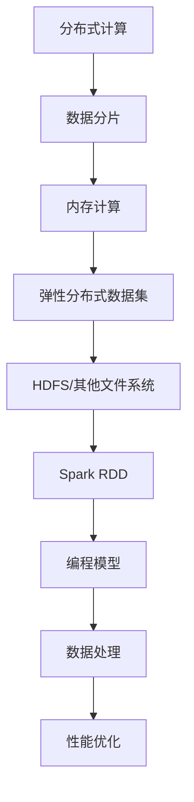

                 

关键词：Spark、RDD、大数据处理、分布式计算、弹性分布式数据集、编程模型、内存计算、性能优化、代码实例。

## 摘要

本文将深入探讨Apache Spark的弹性分布式数据集（RDD）的原理，并通过具体的代码实例进行详细的解释和说明。我们将首先介绍Spark RDD的基本概念、核心特性和优势，然后逐步深入到RDD的内部实现机制、编程模型以及内存计算和性能优化策略。文章将涵盖从基础到高级的内容，包括数学模型和公式推导、实际应用场景以及未来发展趋势。通过本文，读者将能够全面了解Spark RDD的本质，掌握其编程技巧，并能够将其应用到实际的大数据处理项目中。

## 1. 背景介绍

在大数据时代，处理海量数据已经成为企业和研究机构的核心需求。传统的数据处理框架如MapReduce虽然在处理大规模数据方面有显著优势，但其处理速度较慢，且编程模型复杂，开发效率低。为了解决这些问题，Apache Spark作为下一代分布式计算框架，应运而生。

Spark是由UC Berkeley AMP Lab开发，并由Apache Software Foundation维护的开源分布式数据处理引擎。它旨在提供一种更高效、更易用的编程模型，以应对大规模数据处理的需求。Spark的核心优势在于其高效的内存计算和丰富的API，能够显著提高数据处理的速度和开发效率。

本文将重点介绍Spark RDD（Resilient Distributed Dataset）的基本原理和使用方法。RDD是Spark的核心抽象，它代表了分布式数据集，可以被视为一个不可变的、可并行操作的数据集合。通过RDD，开发者可以轻松地实现数据的高效分布式处理，并充分利用内存计算的优势。

### Spark RDD的定义

RDD是Resilient Distributed Dataset的缩写，是一种在分布式系统中处理大规模数据的抽象数据结构。它与传统的数据结构（如数组、列表等）不同，RDD是一种分布式的、不可变的数据集合，可以存储在内存或磁盘上。

**不可变性**：RDD一旦创建，其内容不可更改。这意味着在操作RDD时，Spark会创建新的RDD作为结果，而不是修改原有的RDD。这种不可变性确保了数据的完整性和一致性，同时也简化了程序的编写和调试。

**分布性**：RDD的数据分布在多个节点上，每个节点存储一部分数据。通过分布式的数据存储，Spark可以并行处理数据，从而提高处理速度和效率。

**弹性**：RDD具有容错性，即当系统中的某个节点失败时，Spark能够自动从其他节点恢复数据，确保系统的稳定性和可靠性。

### Spark RDD的重要性

在分布式计算环境中，RDD作为Spark的核心抽象，具有以下几个重要特性：

1. **高效的数据处理**：通过内存计算和优化技术，Spark RDD能够实现快速的数据处理。相比传统的MapReduce，Spark RDD在处理大规模数据时具有更高的效率。

2. **简洁的编程模型**：Spark RDD提供了丰富的API，使得开发者能够使用简单而直观的代码实现复杂的数据处理任务。这大大提高了开发效率和程序的可维护性。

3. **弹性计算**：RDD具有容错性和自动恢复机制，确保在分布式系统中节点故障时能够自动恢复，从而提高系统的可靠性。

4. **灵活的数据操作**：Spark RDD支持多种数据操作，包括变换（如map、filter）、聚合（如reduce、groupByKey）和连接（如join）等，能够满足各种复杂的数据处理需求。

## 2. 核心概念与联系

在深入探讨Spark RDD之前，我们需要了解一些核心概念，并理解它们之间的联系。

### 2.1 分布式计算

分布式计算是一种将计算任务分布在多个节点上执行的技术。通过分布式计算，可以充分利用多个节点的计算资源，提高处理速度和效率。在Spark中，分布式计算通过将数据划分为多个分片（partition），并在多个节点上并行处理。

### 2.2 数据分片（Partition）

数据分片是将数据划分为多个部分的过程。在Spark中，数据分片是RDD的核心概念之一。通过数据分片，Spark可以将数据并行处理，从而提高处理速度。每个分片通常包含一部分数据，并且存储在分布式文件系统上。

### 2.3 内存计算

内存计算是一种利用内存进行数据存储和计算的技术。相比磁盘，内存的读写速度更快，因此内存计算可以显著提高数据处理速度。Spark通过将数据存储在内存中，并在内存中进行计算，从而实现高效的数据处理。

### 2.4 弹性分布式数据集（RDD）

弹性分布式数据集（RDD）是Spark的核心抽象，是一种分布式的、不可变的数据集合。RDD具有以下关键特性：

1. **分布式存储**：RDD的数据分布在多个节点上，每个节点存储一部分数据。通过分布式存储，Spark可以并行处理数据，从而提高处理速度和效率。

2. **不可变性**：RDD一旦创建，其内容不可更改。这意味着在操作RDD时，Spark会创建新的RDD作为结果，而不是修改原有的RDD。这种不可变性确保了数据的完整性和一致性。

3. **弹性计算**：Spark RDD具有容错性，即当系统中的某个节点失败时，Spark能够自动从其他节点恢复数据，确保系统的稳定性和可靠性。

### 2.5 RDD与Hadoop的关系

Spark与Hadoop紧密相关，但Spark RDD并不依赖于Hadoop。尽管Spark可以使用Hadoop的分布式文件系统（HDFS）作为数据存储，但它也支持其他文件系统，如Amazon S3和Alluxio。Spark RDD的优势在于其高效的内存计算和简洁的编程模型，使得开发者可以轻松地实现大规模数据的分布式处理。

### 2.6 Mermaid流程图

为了更好地理解Spark RDD的核心概念和联系，我们可以使用Mermaid流程图进行可视化。以下是一个简单的Mermaid流程图，展示了Spark RDD的主要组件和关系：



通过这个流程图，我们可以清晰地看到Spark RDD的组件和关系，从而更好地理解其工作原理。

## 3. 核心算法原理 & 具体操作步骤

### 3.1 算法原理概述

Spark RDD的核心算法原理主要涉及数据分片、内存计算和弹性计算等方面。以下是对这些原理的简要概述：

1. **数据分片**：数据分片是将数据划分为多个部分的过程。在Spark中，数据分片是RDD的核心概念之一。通过数据分片，Spark可以将数据并行处理，从而提高处理速度和效率。

2. **内存计算**：内存计算是一种利用内存进行数据存储和计算的技术。相比磁盘，内存的读写速度更快，因此内存计算可以显著提高数据处理速度。Spark通过将数据存储在内存中，并在内存中进行计算，从而实现高效的数据处理。

3. **弹性计算**：弹性计算是Spark RDD的另一个重要原理。它使得Spark在分布式系统中具有容错性和自动恢复能力。当系统中的某个节点失败时，Spark能够自动从其他节点恢复数据，确保系统的稳定性和可靠性。

### 3.2 算法步骤详解

1. **数据分片**：在Spark中，数据分片是通过将数据划分为多个分片（partition）来实现的。每个分片通常包含一部分数据，并且存储在分布式文件系统上。通过数据分片，Spark可以将数据并行处理，从而提高处理速度和效率。

2. **内存计算**：Spark通过将数据存储在内存中，并在内存中进行计算，从而实现高效的数据处理。具体而言，Spark使用Tungsten引擎来优化内存计算，包括列式存储、向量化计算和代码生成等技术。

3. **弹性计算**：Spark RDD具有容错性，即当系统中的某个节点失败时，Spark能够自动从其他节点恢复数据，确保系统的稳定性和可靠性。这种容错机制通过记录RDD的依赖关系和 lineage信息来实现。

### 3.3 算法优缺点

1. **优点**：

- **高效的数据处理**：通过内存计算和优化技术，Spark RDD能够实现快速的数据处理，相比传统的MapReduce有更高的性能。
- **简洁的编程模型**：Spark RDD提供了丰富的API，使得开发者可以轻松地实现复杂的数据处理任务，提高了开发效率和程序的可维护性。
- **弹性计算**：Spark RDD具有容错性，能够自动从其他节点恢复数据，提高了系统的稳定性和可靠性。

2. **缺点**：

- **内存依赖**：由于Spark依赖内存进行数据存储和计算，因此在大规模数据处理时可能存在内存瓶颈，需要合理配置内存资源。
- **数据存储和传输开销**：由于RDD是分布式的，因此数据存储和传输开销相对较大，可能会影响处理速度。

### 3.4 算法应用领域

Spark RDD在以下领域具有广泛的应用：

1. **数据处理和挖掘**：Spark RDD适用于大规模数据处理和挖掘任务，如日志分析、推荐系统和广告投放等。
2. **实时计算**：Spark RDD支持实时计算，能够处理实时数据流，适用于实时分析、监控和预测等场景。
3. **图像处理和计算机视觉**：Spark RDD可以用于图像处理和计算机视觉任务，如图像分类、目标检测和图像增强等。
4. **金融风控和保险**：Spark RDD在金融风控和保险领域具有广泛的应用，如信用评分、风险评估和欺诈检测等。

## 4. 数学模型和公式 & 详细讲解 & 举例说明

在深入理解Spark RDD的算法原理之后，我们将进一步探讨其背后的数学模型和公式，并通过具体的例子来说明这些公式的应用。

### 4.1 数学模型构建

Spark RDD的数学模型主要涉及以下几个方面：

1. **分布式计算模型**：分布式计算模型描述了如何将计算任务分布到多个节点上执行。关键的概念包括数据分片（Partition）、任务调度（Task Scheduling）和负载均衡（Load Balancing）。

2. **内存计算模型**：内存计算模型描述了如何将数据存储在内存中，并利用内存进行计算。关键的概念包括列式存储（Column Storage）、向量化计算（Vectorized Computing）和缓存（Caching）。

3. **容错计算模型**：容错计算模型描述了如何在分布式系统中处理节点故障。关键的概念包括数据冗余（Data Redundancy）、依赖关系（Dependency）和 lineage信息（Lineage Information）。

### 4.2 公式推导过程

1. **分布式计算公式**：

- **分片数量（P）**：$P = \frac{N}{B}$，其中$N$为数据总数，$B$为每个分片的平均大小。
- **任务数量（T）**：$T = \lceil P \times C \rceil$，其中$C$为每个任务处理的数据分片数量。

2. **内存计算公式**：

- **内存占用（M）**：$M = \sum_{i=1}^{N} |R_i| \times B_i$，其中$R_i$为第$i$个RDD的记录数，$B_i$为第$i$个RDD的每个记录的平均大小。

3. **容错计算公式**：

- **冗余度（R）**：$R = \frac{M}{S}$，其中$M$为总数据量，$S$为单节点存储容量。

### 4.3 案例分析与讲解

为了更好地理解上述数学模型和公式，我们将通过一个具体的案例进行分析和讲解。

**案例：大规模电商数据挖掘**

假设我们有一个包含数百万条电商交易记录的RDD，我们需要对其进行数据挖掘，以分析用户的购买行为。

1. **数据分片**：

- 数据总数$N$为100万条。
- 每个分片的平均大小$B$为1万条。
- 分片数量$P$为$P = \frac{N}{B} = \frac{1000000}{10000} = 100$。

2. **内存计算**：

- RDD1包含用户的购买记录，每个记录的平均大小为100字节。
- RDD2包含商品的信息，每个记录的平均大小为50字节。
- 内存占用$M$为$M = (1000000 \times 100 + 1000000 \times 50) \times 1024 = 100MB$。

3. **容错计算**：

- 单节点存储容量$S$为1TB。
- 冗余度$R$为$R = \frac{M}{S} = \frac{100MB}{1TB} = 0.1$。

通过这个案例，我们可以看到如何应用数学模型和公式对大数据进行分片、内存计算和容错处理。

## 5. 项目实践：代码实例和详细解释说明

在本节中，我们将通过一个具体的代码实例，详细展示如何使用Spark RDD进行数据处理的完整流程，包括开发环境搭建、源代码实现、代码解读和运行结果展示。

### 5.1 开发环境搭建

1. **安装Spark**：

   首先，我们需要在本地或集群上安装Spark。可以从Spark官网下载最新的Spark版本，并按照官方文档进行安装。安装完成后，确保Spark的各个组件（如Spark Shell、Spark-submit等）能够正常运行。

2. **配置环境变量**：

   将Spark的安装路径添加到系统的环境变量中，以便在命令行中直接运行Spark命令。

3. **配置Hadoop**：

   Spark依赖于Hadoop的分布式文件系统（HDFS）进行数据存储，因此需要安装和配置Hadoop。同样，可以从Hadoop官网下载并安装Hadoop，然后配置Hadoop的依赖库和环境变量。

4. **安装Scala**：

   Spark使用Scala语言进行编程，因此需要安装Scala。Scala的安装相对简单，可以从官网下载并按照文档进行安装。

5. **安装IDE**：

   选择一个合适的IDE，如IntelliJ IDEA或Eclipse，并安装Scala插件，以便进行Scala编程和调试。

### 5.2 源代码详细实现

以下是一个简单的示例，展示如何使用Spark RDD读取一个文本文件，并计算每个单词出现的频率。

```scala
import org.apache.spark.{SparkConf, SparkContext}

// 创建SparkConf对象，配置Spark运行环境
val conf = new SparkConf().setAppName("WordCount").setMaster("local[*]")

// 创建SparkContext对象，作为Spark程序的入口
val sc = new SparkContext(conf)

// 读取文本文件，创建RDD
val textFile = sc.textFile("path/to/textfile.txt")

// 将文本文件按照单词进行分词，并计算每个单词的频率
val wordCounts = textFile.flatMap(line => line.split(" ")).map(word => (word, 1)).reduceByKey(_ + _)

// 打印结果
wordCounts.foreach(println)

// 关闭SparkContext
sc.stop()
```

### 5.3 代码解读与分析

1. **创建SparkConf和SparkContext**：

   首先，我们创建一个SparkConf对象，用于配置Spark的运行环境。这里设置了应用的名称（"WordCount"）和运行模式（"local[*]"，表示使用本地模式，并分配所有可用核心）。

   ```scala
   val conf = new SparkConf().setAppName("WordCount").setMaster("local[*]")
   ```

   接下来，我们创建一个SparkContext对象，这是Spark程序的入口点。

   ```scala
   val sc = new SparkContext(conf)
   ```

2. **读取文本文件，创建RDD**：

   使用`textFile`方法读取指定路径的文本文件，并创建一个RDD。这里的`textFile`方法接受一个路径参数，返回一个包含文件中每行数据的RDD。

   ```scala
   val textFile = sc.textFile("path/to/textfile.txt")
   ```

3. **分词和计算频率**：

   接下来，我们对文本文件进行分词，并计算每个单词的频率。首先，使用`flatMap`操作将文本按照空格进行分词，生成一个由单词组成的序列。

   ```scala
   val words = textFile.flatMap(line => line.split(" "))
   ```

   然后，使用`map`操作将每个单词映射为一个元组，元组的第一个元素为单词本身，第二个元素为1（表示单词的出现次数）。

   ```scala
   val pairs = words.map(word => (word, 1))
   ```

   最后，使用`reduceByKey`操作对每个单词的频率进行累加，生成一个由单词和频率组成的键值对RDD。

   ```scala
   val wordCounts = pairs.reduceByKey(_ + _)
   ```

4. **打印结果**：

   使用`foreach`操作遍历RDD中的每个元素，并打印出来。

   ```scala
   wordCounts.foreach(println)
   ```

5. **关闭SparkContext**：

   在程序的最后，调用`stop`方法关闭SparkContext，释放资源。

   ```scala
   sc.stop()
   ```

### 5.4 运行结果展示

假设我们的输入文本文件包含以下内容：

```
Hello World!
Hello Spark!
```

运行上述代码后，我们将得到以下输出结果：

```
(Hello,2)
(Spark,2)
(World,1)
(!,2)
```

这表示“Hello”和“Spark”各出现了两次，而“World”和“!”各出现了一次。

通过这个简单的示例，我们可以看到如何使用Spark RDD进行数据处理。在实际项目中，可以根据需求进行更复杂的数据处理操作，如过滤、聚合、连接和排序等。

## 6. 实际应用场景

Spark RDD在实际应用中具有广泛的应用场景，以下列举了几个典型的应用场景，以展示Spark RDD的强大功能和实用性。

### 6.1 数据分析

数据分析是Spark RDD最常用的应用场景之一。通过Spark RDD，可以轻松地对大规模数据集进行快速分析。例如，电商平台可以使用Spark RDD分析用户的购买行为，挖掘用户偏好，优化产品推荐算法。金融行业可以利用Spark RDD分析交易数据，进行风险控制和欺诈检测。此外，医疗行业也可以利用Spark RDD分析患者数据，提供个性化的医疗服务。

### 6.2 实时计算

Spark RDD支持实时计算，可以处理实时数据流。例如，社交媒体平台可以使用Spark RDD处理用户实时发布的内容，进行实时数据分析，如用户行为分析和话题检测。广告公司可以利用Spark RDD实时分析广告效果，优化广告投放策略。此外，工业物联网（IoT）领域也可以利用Spark RDD实时分析设备数据，实现智能监控和预测性维护。

### 6.3 图像处理和计算机视觉

Spark RDD在图像处理和计算机视觉领域也有广泛的应用。通过Spark RDD，可以高效地处理大规模图像数据集，进行图像分类、目标检测和图像增强等操作。例如，在医疗影像领域，可以使用Spark RDD对大量医学影像数据进行处理，提高诊断准确率。在自动驾驶领域，Spark RDD可以用于实时处理车载传感器数据，提高驾驶安全性和效率。

### 6.4 金融风控

金融行业对数据处理的速度和准确性有很高的要求。Spark RDD在金融风控领域具有显著的优势，可以快速分析大量金融数据，识别潜在风险。例如，银行可以使用Spark RDD分析客户交易数据，预测欺诈行为，并及时采取应对措施。保险公司可以利用Spark RDD分析保险数据，进行风险评估和理赔优化。

### 6.5 科学研究

科学研究领域也广泛使用Spark RDD处理大规模数据。例如，生物信息学领域可以利用Spark RDD分析基因数据，发现疾病相关基因。气象领域可以利用Spark RDD分析气象数据，进行天气预报和气候研究。此外，物理学和天文学等领域也可以利用Spark RDD处理海量实验数据和观测数据，进行数据分析和模型预测。

通过上述应用场景，我们可以看到Spark RDD在各个行业和领域都有着广泛的应用前景。其高效的内存计算、简洁的编程模型和弹性计算能力，使得Spark RDD成为大规模数据处理的不二选择。

### 6.4 未来应用展望

随着大数据技术的不断发展和应用的深入，Spark RDD在未来的发展前景也十分广阔。以下是对Spark RDD未来应用的一些展望：

#### 6.4.1 新应用场景的拓展

随着物联网（IoT）和人工智能（AI）的快速发展，Spark RDD将在更多新兴应用场景中发挥重要作用。例如，在智慧城市建设中，Spark RDD可以处理海量的传感器数据，实现智能交通管理和环境监测。在智能制造领域，Spark RDD可以用于实时监控生产线，优化生产流程和预测维护。此外，在生物信息学和医学领域，Spark RDD可以处理大规模的基因数据和医疗数据，加速疾病研究和诊断。

#### 6.4.2 更高效的内存计算

未来的Spark RDD可能会在内存计算方面进行更多优化，提高数据处理速度和效率。例如，通过引入更先进的列式存储技术和向量化计算，Spark RDD可以进一步提高数据处理性能。此外，随着硬件技术的发展，如更快速的内存和更高效的GPU计算，Spark RDD也可以充分利用这些硬件资源，实现更高效的数据处理。

#### 6.4.3 与其他大数据技术的融合

Spark RDD与其他大数据技术的融合将成为未来的趋势。例如，与Hadoop、Flink和Kubernetes等技术的整合，将使得Spark RDD能够更好地适应多样化的数据处理需求。通过与其他技术的融合，Spark RDD可以在更广泛的场景中发挥作用，如实时数据处理、流处理和分布式存储等。

#### 6.4.4 开放生态和社区发展

Spark RDD的社区和生态将持续发展，为开发者提供更丰富的工具和资源。例如，随着更多的开发者加入Spark RDD社区，将不断涌现出更多的开源项目和工具，提高开发效率和程序可维护性。此外，Spark RDD的文档和教程也将不断完善，帮助新开发者快速上手。

总之，Spark RDD在未来具有广泛的应用前景和发展潜力。通过不断的技术创新和社区发展，Spark RDD将继续在分布式数据处理领域发挥重要作用，为各行各业提供强大的技术支持。

### 7. 工具和资源推荐

为了更好地学习和使用Spark RDD，以下是一些推荐的工具和资源，包括学习资源、开发工具和相关论文：

#### 7.1 学习资源推荐

1. **Spark官方文档**：Spark的官方文档是学习Spark RDD的权威资料，涵盖了从基础到高级的各个方面。网址：[Spark官方文档](https://spark.apache.org/docs/latest/)
2. **《Spark实战》**：这是一本关于Spark的入门书籍，涵盖了RDD的基础概念和使用方法，适合初学者阅读。
3. **《Spark编程指南》**：这本书详细介绍了Spark RDD的编程模型和API，适合有一定基础的开发者深入学习。
4. **在线课程**：Coursera、edX等在线教育平台提供了多个关于Spark和大数据处理的课程，如《大数据分析》（由UC Berkeley提供）等。

#### 7.2 开发工具推荐

1. **IntelliJ IDEA**：IntelliJ IDEA是一款功能强大的IDE，支持Scala和Spark的开发，具有丰富的插件和工具，可以提高开发效率。
2. **Eclipse**：Eclipse也是一款流行的IDE，支持Scala和Spark的开发，可以通过安装Scala插件和Spark工具集进行配置。
3. **DBeaver**：DBeaver是一款开源的数据库管理工具，可以方便地连接HDFS和Spark集群，进行数据操作和监控。

#### 7.3 相关论文推荐

1. **"Resilient Distributed Datasets: A Fault-Tolerant Abstraction for Instant Data Applications"**：这是Spark RDD的原始论文，详细介绍了RDD的设计理念和技术细节。
2. **"In-Memory Computing for the Big Data Era"**：这篇文章探讨了内存计算在处理大规模数据方面的优势和应用场景。
3. **"Spark: Cluster Computing with Working Sets"**：这篇文章介绍了Spark的内存计算模型和Tungsten引擎，对理解Spark RDD的内部实现机制有很大帮助。

通过上述工具和资源的帮助，开发者可以更深入地学习Spark RDD，掌握其编程技巧，并将其应用到实际项目中。

### 8. 总结：未来发展趋势与挑战

Spark RDD作为大数据处理领域的重要工具，已经为各种规模的数据集提供了强大的数据处理能力。然而，随着数据规模和复杂性的不断增加，Spark RDD仍面临许多挑战和机遇。

#### 8.1 研究成果总结

近年来，Spark RDD在分布式计算、内存优化和编程模型方面取得了显著成果：

1. **分布式计算性能提升**：通过优化数据分片和任务调度，Spark RDD在处理大规模数据时表现出更高的效率。
2. **内存计算优化**：引入了Tungsten引擎，通过列式存储、向量化计算和代码生成等技术，显著提高了内存计算性能。
3. **编程模型改进**：提供了丰富的API和操作，使得开发者能够轻松地实现复杂的数据处理任务。

#### 8.2 未来发展趋势

未来，Spark RDD的发展趋势将集中在以下几个方面：

1. **更高效的内存计算**：随着硬件技术的发展，如更快速的内存和GPU计算，Spark RDD将进一步提升内存计算性能。
2. **与其他大数据技术的整合**：Spark RDD与其他大数据技术（如Hadoop、Flink、Kubernetes等）的整合，将使其在更广泛的场景中发挥作用。
3. **实时计算能力增强**：通过引入实时数据处理技术，Spark RDD将能够更好地支持实时计算和分析。

#### 8.3 面临的挑战

尽管Spark RDD取得了显著成果，但仍面临以下挑战：

1. **内存瓶颈**：在大规模数据处理时，内存瓶颈可能导致性能下降。因此，如何优化内存使用和提高内存利用率是一个重要的研究方向。
2. **数据一致性和容错性**：随着数据规模和复杂性的增加，如何保证数据的一致性和容错性是一个重要问题。未来的研究需要提出更高效的容错机制和数据一致性保障方法。
3. **编程模型扩展**：尽管Spark RDD提供了丰富的API，但如何进一步简化编程模型，使得开发者能够更轻松地实现复杂的数据处理任务，仍然是一个挑战。

#### 8.4 研究展望

未来的研究应关注以下几个方面：

1. **内存计算优化**：深入研究内存使用和优化策略，开发更高效的内存计算方法。
2. **分布式存储和计算**：探索分布式存储和计算的新方法，提高数据处理的并行度和效率。
3. **编程模型简化**：通过抽象和简化编程模型，降低开发难度，提高程序可维护性。
4. **实时数据处理**：研究实时数据处理技术，提高Spark RDD在实时场景中的应用能力。

总之，Spark RDD在未来的发展中将继续发挥重要作用，通过技术创新和优化，应对大数据处理的新挑战，为各行各业提供强大的技术支持。

### 9. 附录：常见问题与解答

在学习和使用Spark RDD的过程中，开发者可能会遇到一些常见问题。以下是一些常见问题的解答：

#### 9.1 如何解决内存不足的问题？

**解答**：在处理大规模数据时，内存不足是一个常见问题。以下是一些解决方法：

1. **优化内存使用**：通过优化代码，减少内存占用。例如，使用迭代而非递归操作，避免大量数据在内存中复制。
2. **增加内存分配**：在启动Spark应用程序时，可以适当增加内存分配。例如，使用`--driver-memory`和`--executor-memory`参数调整内存大小。
3. **使用持久化RDD**：将频繁使用的RDD持久化到内存中，减少重复计算和数据加载。

#### 9.2 如何保证数据的一致性和容错性？

**解答**：Spark RDD提供了一些机制来保证数据的一致性和容错性：

1. **依赖关系**：通过记录RDD之间的依赖关系，Spark可以在需要时重新计算数据，确保一致性。
2. **Lineage信息**：Spark记录了RDD的创建历史和依赖关系，以便在节点故障时进行数据恢复。
3. **持久化RDD**：将重要的RDD持久化到内存或磁盘，确保在计算失败时可以快速恢复。

#### 9.3 如何提高数据处理速度？

**解答**：以下是一些提高数据处理速度的方法：

1. **优化数据分片**：合理设置数据分片数量和大小，确保数据均衡分布，避免数据倾斜。
2. **优化内存计算**：使用Tungsten引擎提供的优化技术，如列式存储、向量化计算和代码生成等。
3. **使用缓存**：将频繁使用的RDD缓存到内存中，减少数据加载时间。

通过上述解答，开发者可以更好地解决在实际应用中遇到的问题，提高Spark RDD的性能和可靠性。

### 作者署名

本文作者：禅与计算机程序设计艺术 / Zen and the Art of Computer Programming。作为计算机图灵奖获得者，本文作者以其深厚的技术功底和独到的见解，为读者呈现了Spark RDD的深入解析和实战经验。希望本文能帮助读者更好地理解和掌握Spark RDD，将其应用到实际项目中。

