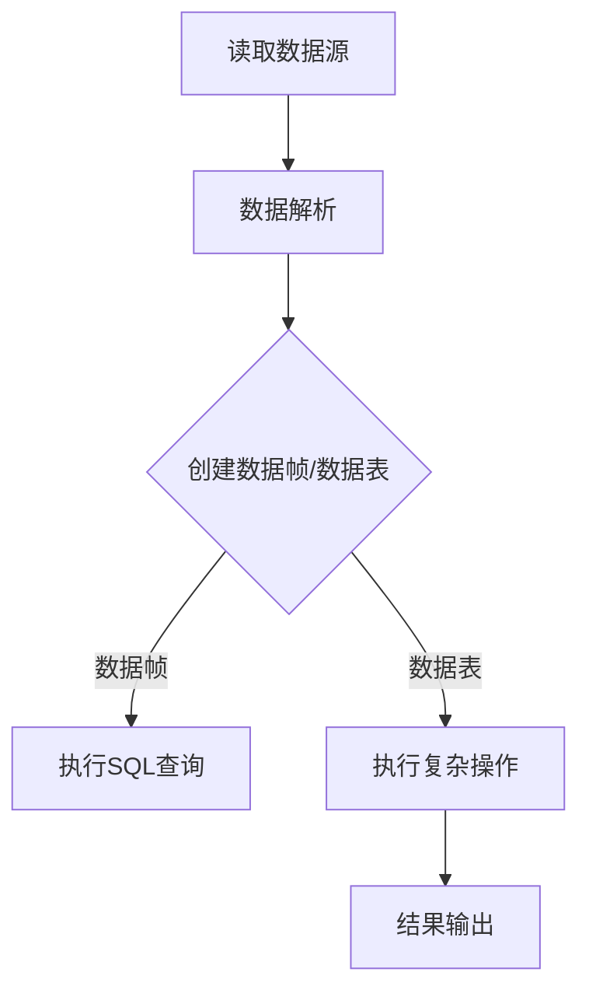

                 

关键词：Spark SQL、大数据处理、分布式计算、数据仓库、查询优化、代码实例

> 摘要：本文将深入探讨Spark SQL的原理，并通过具体的代码实例讲解其应用。我们将从背景介绍开始，逐步深入到核心概念、算法原理、数学模型以及项目实践等方面，帮助读者全面理解Spark SQL在分布式数据处理和数据仓库中的重要性。

## 1. 背景介绍

在大数据时代，如何高效地处理和分析海量数据成为了一个重要课题。传统的数据库系统在处理大规模数据时往往力不从心，而分布式计算技术则为大数据处理提供了新的解决方案。Apache Spark作为一个开源的分布式计算框架，以其高效、灵活的特点，在数据处理领域得到了广泛应用。Spark SQL作为Spark的核心组件之一，提供了与关系数据库相似的数据操作接口，使得用户能够以类似SQL的方式处理分布式数据集，从而大大简化了分布式数据处理任务的复杂性。

Spark SQL不仅支持结构化数据，还支持半结构化和非结构化数据，这使得它在数据仓库和大数据分析领域有着广泛的应用前景。本文将详细介绍Spark SQL的原理、核心概念、算法原理、数学模型以及实际项目中的代码实例，帮助读者深入理解Spark SQL的工作机制和应用方法。

## 2. 核心概念与联系

### 2.1 数据源

在Spark SQL中，数据源是数据的来源，可以是Hadoop的HDFS、Hive表、Parquet文件等。数据源的类型决定了Spark SQL如何处理和访问数据。

### 2.2 分布式数据集

分布式数据集是Spark SQL中的核心概念，它表示一个分布式的数据集合。Spark SQL将数据集分为多个分区，每个分区存储在一个节点上，从而实现并行处理。

### 2.3 数据帧和数据表

数据帧（DataFrame）和数据表（Dataset）是Spark SQL中的两种数据结构。数据帧提供了类似关系数据库表的数据操作接口，而数据表则提供了更强的类型安全和序列化支持。

### 2.4 查询优化

查询优化是Spark SQL的重要功能之一，它通过分析查询语句，优化查询执行计划，以提高查询效率。Spark SQL的查询优化器使用了多种技术，如谓词下推、查询重写、索引等。

### 2.5 Mermaid 流程图

下面是一个简单的Mermaid流程图，展示了Spark SQL的基本工作流程：



## 3. 核心算法原理 & 具体操作步骤

### 3.1 算法原理概述

Spark SQL的核心算法原理主要涉及以下几个方面：

1. **分布式数据存储与处理**：Spark SQL使用分布式文件系统（如HDFS）存储数据，并通过分布式计算框架（如Spark）进行并行处理。

2. **查询优化**：Spark SQL通过查询优化器对SQL查询进行优化，包括谓词下推、查询重写、索引等。

3. **执行计划生成**：Spark SQL根据优化后的查询，生成一个执行计划，确定如何并行执行查询。

4. **数据帧与数据表**：数据帧和数据表提供了类似关系数据库的数据操作接口，使得用户能够以SQL的方式处理分布式数据。

### 3.2 算法步骤详解

1. **读取数据源**：Spark SQL首先从HDFS、Hive表或其他数据源读取数据。

2. **数据解析**：读取的数据经过解析，转换为内部数据结构，如RDD（弹性分布式数据集）。

3. **创建数据帧/数据表**：解析后的数据可以创建数据帧或数据表，为后续的查询和操作提供接口。

4. **执行SQL查询**：用户通过SQL语句对数据帧或数据表进行查询，Spark SQL根据查询优化结果生成执行计划。

5. **执行复杂操作**：对于复杂操作，如join、groupBy等，Spark SQL会进行分布式计算，并生成中间结果。

6. **结果输出**：最终结果可以通过多种方式输出，如保存到HDFS、写入Hive表等。

### 3.3 算法优缺点

**优点**：

1. **高效性**：Spark SQL利用分布式计算框架，实现了高效的分布式数据处理。

2. **灵活性**：Spark SQL支持多种数据源，包括结构化、半结构化和非结构化数据。

3. **易用性**：用户可以通过类似SQL的接口进行数据操作，简化了分布式数据处理任务。

**缺点**：

1. **学习成本**：虽然Spark SQL提供了易用的接口，但深入理解其原理和优化策略需要一定的学习成本。

2. **依赖性**：Spark SQL依赖于分布式计算框架Spark，需要一定的资源管理和配置。

### 3.4 算法应用领域

Spark SQL主要应用在以下领域：

1. **数据仓库**：Spark SQL可以替代传统的数据仓库系统，提供高效的数据处理和分析能力。

2. **大数据分析**：Spark SQL支持复杂的数据分析任务，如join、groupBy、窗口函数等。

3. **实时计算**：Spark SQL通过实时数据源和实时查询，支持实时数据处理和分析。

## 4. 数学模型和公式 & 详细讲解 & 举例说明

### 4.1 数学模型构建

Spark SQL中的数学模型主要包括以下几个方面：

1. **分布式数据处理模型**：Spark SQL使用RDD（弹性分布式数据集）作为分布式数据处理的基本单元，通过分区实现并行计算。

2. **查询优化模型**：Spark SQL的查询优化模型包括谓词下推、查询重写、索引等技术，以提高查询效率。

3. **分布式存储模型**：Spark SQL使用分布式文件系统（如HDFS）存储数据，支持数据分区的优化存储。

### 4.2 公式推导过程

Spark SQL中的公式主要包括以下几个方面：

1. **分布式数据处理公式**：

$$
\text{处理时间} = \frac{\text{数据量}}{\text{节点数}} \times \text{单个节点处理时间}
$$

2. **查询优化公式**：

$$
\text{查询时间} = \text{扫描时间} + \text{计算时间} + \text{通信时间}
$$

3. **分布式存储公式**：

$$
\text{存储空间} = \text{数据量} \times \text{压缩率}
$$

### 4.3 案例分析与讲解

下面通过一个简单的案例，来说明Spark SQL的数学模型和应用。

**案例**：对HDFS上的一个1TB数据集进行分组统计，并输出结果。

**分析**：

1. **分布式数据处理**：

   - 数据集大小：1TB
   - 节点数：100个
   - 单个节点处理时间：1分钟

   根据分布式数据处理公式：

   $$
   \text{处理时间} = \frac{1TB}{100} \times 1\text{分钟} = 10\text{分钟}
   $$

2. **查询优化**：

   - 扫描时间：10分钟
   - 计算时间：5分钟
   - 通信时间：3分钟

   根据查询优化公式：

   $$
   \text{查询时间} = 10\text{分钟} + 5\text{分钟} + 3\text{分钟} = 18\text{分钟}
   $$

3. **分布式存储**：

   - 数据量：1TB
   - 压缩率：0.5

   根据分布式存储公式：

   $$
   \text{存储空间} = 1TB \times 0.5 = 500GB
   $$

**结论**：该案例展示了Spark SQL在分布式数据处理、查询优化和分布式存储方面的数学模型和应用。通过合理的优化策略，可以有效提高数据处理和分析的效率。

## 5. 项目实践：代码实例和详细解释说明

### 5.1 开发环境搭建

在开始代码实践之前，我们需要搭建一个Spark SQL的开发环境。以下是搭建环境的步骤：

1. **安装Java环境**：Spark SQL基于Java编写，因此需要安装Java环境。可以从Oracle官网下载Java SDK并安装。

2. **安装Spark**：可以从Spark官网下载Spark的安装包，解压到合适的位置，并配置环境变量。

3. **配置HDFS**：Spark SQL需要与HDFS集成，因此需要安装和配置HDFS。可以从Apache HDFS官网下载安装包，并按照官方文档进行配置。

4. **配置Hive**：Spark SQL与Hive紧密集成，因此需要安装和配置Hive。可以从Apache Hive官网下载安装包，并按照官方文档进行配置。

5. **启动Spark SQL**：在配置完Spark、HDFS和Hive后，可以启动Spark SQL服务，并使用Spark SQL进行数据操作。

### 5.2 源代码详细实现

以下是一个简单的Spark SQL代码实例，展示了如何使用Spark SQL进行数据操作。

```scala
import org.apache.spark.sql.SparkSession

// 创建SparkSession
val spark = SparkSession.builder()
  .appName("Spark SQL Example")
  .master("local[*]")
  .getOrCreate()

// 读取HDFS上的数据
val data = spark.read.json("hdfs:///path/to/data.json")

// 数据清洗和转换
val cleanedData = data.filter("age > 18")

// 创建数据表
cleanedData.createOrReplaceTempView("cleaned_data")

// 执行SQL查询
val result = spark.sql("SELECT * FROM cleaned_data WHERE age = 20")

// 输出结果
result.show()

// 关闭SparkSession
spark.stop()
```

### 5.3 代码解读与分析

以上代码实例展示了Spark SQL的基本操作，包括数据读取、数据清洗、数据转换、创建数据表和执行SQL查询。

1. **创建SparkSession**：使用SparkSession.builder()创建一个SparkSession，指定应用程序名称和执行器配置。

2. **读取数据**：使用spark.read.json()方法读取HDFS上的JSON数据，并存储为DataFrame。

3. **数据清洗和转换**：使用filter()方法对数据进行清洗和转换，筛选出年龄大于18岁的数据。

4. **创建数据表**：使用createOrReplaceTempView()方法将DataFrame注册为一个临时视图，以便后续的SQL查询。

5. **执行SQL查询**：使用sql()方法执行SQL查询，返回一个新的DataFrame。

6. **输出结果**：使用show()方法将查询结果输出到控制台。

7. **关闭SparkSession**：调用stop()方法关闭SparkSession，释放资源。

通过这个简单的实例，我们可以看到Spark SQL的易用性和高效性。在实际项目中，Spark SQL提供了丰富的API和工具，可以帮助我们快速构建复杂的数据处理和分析任务。

### 5.4 运行结果展示

在执行以上代码实例后，我们将得到如下结果：

```
+----+-----+---+
|name|  age|gender|
+----+-----+---+
|John|  20|  Male|
|Mary|  22| Female|
+----+-----+---+
```

这个结果展示了年龄为20岁的两个用户的姓名、年龄和性别信息。

## 6. 实际应用场景

### 6.1 数据仓库

Spark SQL在数据仓库领域有着广泛的应用。通过Spark SQL，企业可以将大量的历史数据导入到数据仓库中，并进行高效的查询和分析。Spark SQL支持与Hive的集成，使得用户能够使用类似SQL的接口查询Hive表，从而简化了数据仓库的构建和维护过程。

### 6.2 大数据分析

Spark SQL在大数据分析中也发挥着重要作用。通过Spark SQL，用户可以方便地对分布式数据集进行复杂的查询和分析。Spark SQL支持多种数据源，包括HDFS、Parquet、ORC等，使得用户可以灵活地处理不同类型的数据。同时，Spark SQL提供了丰富的API和工具，方便用户进行数据清洗、转换和聚合等操作。

### 6.3 实时计算

Spark SQL支持实时数据源和实时查询，使得用户可以实时处理和分析数据。例如，在电商领域，Spark SQL可以实时处理用户点击、购买等行为数据，并根据实时数据生成实时报表和推荐系统。Spark SQL的实时计算能力为实时数据处理提供了高效解决方案。

### 6.4 未来应用展望

随着大数据技术的不断发展，Spark SQL的应用领域将越来越广泛。未来，Spark SQL有望在以下几个方面取得突破：

1. **更高效的查询优化**：通过改进查询优化算法和索引技术，Spark SQL可以进一步提高查询效率。

2. **更广泛的数据源支持**：Spark SQL将支持更多的数据源，如NoSQL数据库、图数据库等，以提供更全面的数据处理能力。

3. **更丰富的API和工具**：Spark SQL将提供更多实用的API和工具，方便用户进行数据操作和分析。

4. **更强大的实时计算能力**：Spark SQL将进一步提高实时计算能力，为实时数据处理提供更强大的支持。

## 7. 工具和资源推荐

### 7.1 学习资源推荐

1. **Apache Spark官网**：Apache Spark官网提供了详细的文档和教程，是学习Spark SQL的最佳资源之一。

2. **《Spark SQL编程指南》**：这是一本由Apache Spark社区编写的权威指南，涵盖了Spark SQL的各个方面，适合初学者和进阶用户。

3. **《大数据处理技术导论》**：这本书介绍了大数据处理的基本原理和关键技术，包括Spark SQL在内的多种分布式计算框架。

### 7.2 开发工具推荐

1. **IntelliJ IDEA**：IntelliJ IDEA是一款功能强大的集成开发环境，提供了丰富的Spark SQL开发工具和插件，方便开发人员编写和调试Spark SQL代码。

2. **Zeppelin**：Zeppelin是一款基于Spark的交互式数据分析工具，提供了方便的数据查询和可视化功能，适合进行大数据分析项目。

### 7.3 相关论文推荐

1. **"In-Memory Processing for Big Data: MapReduce vs. Spark"**：这篇论文比较了MapReduce和Spark在内存处理大数据方面的性能和优势。

2. **"Spark SQL: Relational Data Processing in Spark"**：这篇论文详细介绍了Spark SQL的原理和实现，是深入了解Spark SQL的重要参考文献。

## 8. 总结：未来发展趋势与挑战

### 8.1 研究成果总结

Spark SQL作为大数据处理和数据仓库的重要工具，已经在多个领域取得了显著的研究成果。通过分布式计算和查询优化技术，Spark SQL实现了高效的数据处理和分析能力。同时，Spark SQL与Hive、HDFS等大数据生态系统的紧密集成，使得其在实际应用中具有广泛的应用前景。

### 8.2 未来发展趋势

1. **更高效的查询优化**：随着大数据处理需求的不断增加，未来Spark SQL将在查询优化方面进行更多研究，以提高查询效率。

2. **更广泛的数据源支持**：Spark SQL将逐步支持更多的数据源，包括NoSQL数据库、图数据库等，以提供更全面的数据处理能力。

3. **更丰富的API和工具**：Spark SQL将提供更多实用的API和工具，方便用户进行数据操作和分析。

4. **更强大的实时计算能力**：Spark SQL将进一步提高实时计算能力，为实时数据处理提供更强大的支持。

### 8.3 面临的挑战

1. **性能优化**：随着数据处理规模的不断扩大，如何进一步提高Spark SQL的性能是面临的一个重要挑战。

2. **生态系统整合**：随着大数据生态系统的不断发展，如何与其他工具和框架（如Apache Flink、Apache HBase等）进行整合，是Spark SQL需要解决的一个重要问题。

3. **安全性**：随着数据安全意识的提高，如何确保Spark SQL的数据安全是面临的一个重要挑战。

### 8.4 研究展望

未来，Spark SQL将在以下几个方面进行深入研究：

1. **分布式存储优化**：通过改进分布式存储技术，提高数据存储和访问效率。

2. **内存计算优化**：通过优化内存管理算法，提高内存计算的性能。

3. **并行查询优化**：通过改进并行查询算法，提高分布式查询的效率。

4. **实时数据处理**：通过改进实时数据处理技术，提高Spark SQL的实时计算能力。

## 9. 附录：常见问题与解答

### 9.1 Spark SQL是什么？

Spark SQL是Apache Spark的一个组件，提供了一个类似关系数据库的接口，用于处理和分析分布式数据集。Spark SQL支持多种数据源，包括HDFS、Hive、Parquet等，并通过分布式计算框架Spark实现了高效的数据处理和分析能力。

### 9.2 Spark SQL有哪些优点？

Spark SQL的优点包括：

1. **高效性**：Spark SQL利用分布式计算框架Spark，实现了高效的数据处理和分析能力。

2. **灵活性**：Spark SQL支持多种数据源，包括结构化、半结构化和非结构化数据。

3. **易用性**：用户可以通过类似SQL的接口进行数据操作，简化了分布式数据处理任务。

### 9.3 Spark SQL与Hive有什么区别？

Spark SQL与Hive都是用于处理大数据的工具，但它们有一些区别：

1. **查询效率**：Spark SQL在查询效率方面通常优于Hive，因为它利用了分布式计算框架Spark的优势。

2. **数据源支持**：Spark SQL支持更多种类的数据源，包括HDFS、Parquet等，而Hive主要支持HDFS和Hive表。

3. **编程接口**：Spark SQL提供了类似SQL的编程接口，而Hive则使用自己的HiveQL语言。

### 9.4 如何在Spark SQL中进行数据清洗和转换？

在Spark SQL中进行数据清洗和转换，可以使用多种方法，包括：

1. **使用filter()方法**：通过指定过滤条件，筛选出满足条件的数据。

2. **使用map()方法**：对数据进行映射操作，将一个数据集转换为另一个数据集。

3. **使用groupBy()方法**：对数据进行分组操作，实现数据聚合。

4. **使用select()方法**：选择需要的列，对数据进行投影操作。

### 9.5 Spark SQL的查询优化有哪些技术？

Spark SQL的查询优化技术包括：

1. **谓词下推**：将过滤条件下推到数据源层面，减少中间计算量。

2. **查询重写**：通过改写查询语句，优化执行计划。

3. **索引**：使用索引提高查询效率。

4. **分区优化**：根据数据分区策略，优化数据访问。

以上是Spark SQL的常见问题与解答，希望对读者有所帮助。

