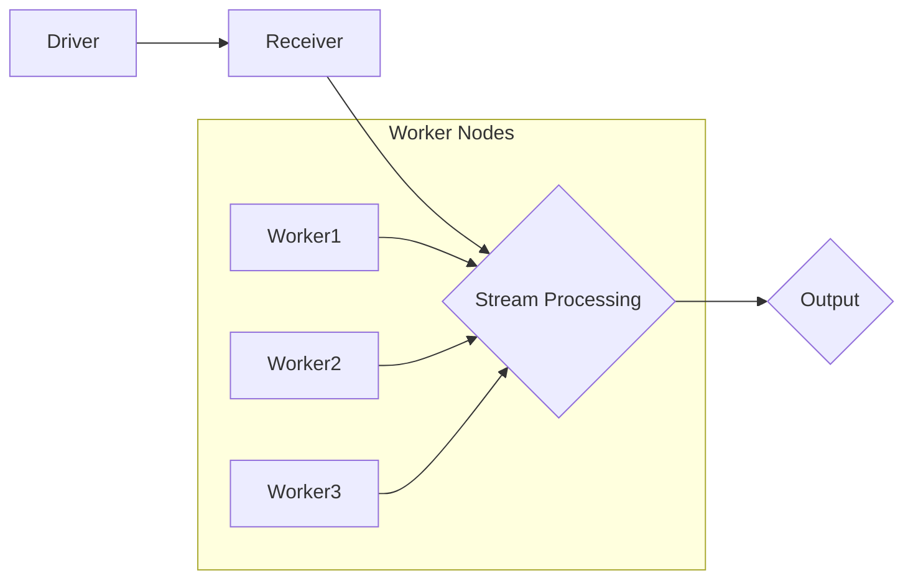

                 

关键词：Spark Streaming，实时流处理，大数据，分布式系统，内存计算，数据流处理，流计算框架

> 摘要：本文将深入讲解Spark Streaming的原理，包括其架构、核心概念以及如何实现实时流处理。通过实际代码实例，我们将演示如何使用Spark Streaming进行数据处理，并对其优缺点和应用领域进行探讨。文章还将涉及数学模型和公式，以及未来应用展望。

## 1. 背景介绍

随着互联网和物联网的迅猛发展，实时数据流处理成为数据处理领域的重要需求。传统的大数据处理解决方案，如MapReduce，在处理大规模数据集时表现出色，但在实时性方面存在显著不足。为了应对这一挑战，研究人员和开发者们提出了许多新的流处理框架，其中最著名的便是Apache Spark Streaming。

Spark Streaming是Apache Spark的一个组件，它提供了实时数据流处理的能力。Spark Streaming基于Spark的核心计算引擎，充分利用了其分布式计算的优势，从而能够高效地处理实时数据流。

## 2. 核心概念与联系

### 2.1 架构

Spark Streaming的架构如图2-1所示，它由Driver和多个Worker组成。Driver负责协调和管理整个流处理过程，包括任务调度、资源分配和数据流控制。Worker节点负责执行具体的计算任务，并将处理结果返回给Driver。



### 2.2 核心概念

- **Receiver**：负责从外部数据源（如Kafka、Flume等）接收数据，并将其转换为Spark Streaming的内部数据结构。
- **DStream**：（Discretized Stream的缩写）代表一个时间序列的数据流，是Spark Streaming的核心数据结构。DStream可以通过一系列高层次的API操作（如map、reduce、join等）进行数据转换和计算。
- **Transformation**：对DStream进行一系列转换操作，如map、reduceByKey、join等。这些操作不会立即执行，而是构建一个计算图，并在触发动作（Action）时执行。
- **Action**：触发DStream上的计算，如reduce、saveAsTextFile等。触发动作时，会执行之前定义的Transformation，并将结果保存或输出。

## 3. 核心算法原理 & 具体操作步骤

### 3.1 算法原理概述

Spark Streaming的核心算法是基于微批处理（Micro-Batch）的。在Spark Streaming中，数据流被划分为固定时间间隔的批次（Batch），每个批次作为一个DStream处理。批处理时间通常为几秒到几分钟。

Spark Streaming的工作流程如下：

1. **数据接收**：Receiver从外部数据源读取数据，并将其转换为DStream。
2. **转换操作**：对DStream进行一系列转换操作，如map、reduceByKey等。
3. **触发动作**：用户通过触发一个Action（如reduce、saveAsTextFile等），触发之前定义的Transformation，并将结果保存或输出。

### 3.2 算法步骤详解

1. **创建Spark Streaming上下文**：使用SparkConf设置配置参数，并创建StreamingContext。

    ```python
    conf = SparkConf().setMaster("local[2]").setAppName("NetworkWordCount")
    ssc = StreamingContext(conf, Duration(seconds=2))
    ```

2. **接收数据**：使用receiverStream方法从网络中接收数据。

    ```python
    lines = ssc.socketTextStream("localhost", 9999)
    ```

3. **转换操作**：对数据流进行转换操作，如map、flatMap、reduceByKey等。

    ```python
    words = lines.flatMap(lambda line: line.split(" "))
    pairs = words.map(lambda word: (word, 1))
    word_counts = pairs.reduceByKey(lambda x, y: x + y)
    ```

4. **触发动作**：触发一个Action，如print()或saveAsTextFile()。

    ```python
    word_counts.print()
    ```

5. **启动流计算**：启动流计算过程。

    ```python
    ssc.start()
    ssc.awaitTermination()
    ```

### 3.3 算法优缺点

**优点**：

- **内存计算**：Spark Streaming利用了Spark的内存计算优势，能够提供更快的处理速度。
- **分布式计算**：Spark Streaming支持分布式计算，能够处理大规模的数据流。
- **易于使用**：Spark Streaming提供了丰富的API，使得流处理编程变得更加简单。

**缺点**：

- **延迟**：由于采用批处理方式，Spark Streaming的延迟相对较高。
- **状态维护**：在长时间运行的流计算任务中，状态维护可能会成为一个挑战。

### 3.4 算法应用领域

Spark Streaming广泛应用于实时数据分析、实时监控、实时推荐系统等领域。例如，在电商领域，Spark Streaming可以用于实时监控用户行为，生成实时报告；在金融领域，Spark Streaming可以用于实时交易数据分析，提高交易决策的准确性。

## 4. 数学模型和公式 & 详细讲解 & 举例说明

### 4.1 数学模型构建

在Spark Streaming中，数据流处理的核心是对DStream进行一系列转换操作。这些转换操作可以通过数学模型进行描述。

假设我们有一个数据流$D=\{d_1, d_2, d_3, ..., d_n\}$，我们希望对其进行以下转换操作：

1. **Map**：对每个元素进行映射操作，即$f(d_i) = d_i^2$。
2. **Filter**：筛选出满足条件的元素，即$d_i > 0$。
3. **ReduceByKey**：对相同key的元素进行聚合操作，即$(k_1, v_1) + (k_1, v_2) = (k_1, v_1 + v_2)$。

我们可以构建以下数学模型：

$$
\begin{align*}
f(D) &= \{f(d_1), f(d_2), f(d_3), ..., f(d_n)\} \\
f(D) &= \{d_1^2, d_2^2, d_3^2, ..., d_n^2\} \\
F(D) &= \{d_i \in D \mid d_i > 0\} \\
F(D) &= \{d_1, d_2, d_3, ..., d_n\} \\
R(D) &= \{(k, v) \mid k \in K, v \in V\} \\
R(D) &= \{(k_1, v_1), (k_1, v_2), (k_2, v_3), ..., (k_n, v_n)\}
\end{align*}
$$}

### 4.2 公式推导过程

1. **Map操作**：

   对于每个元素$d_i$，我们进行映射操作$f(d_i) = d_i^2$。

   $$f(D) = \{d_1^2, d_2^2, d_3^2, ..., d_n^2\}$$

2. **Filter操作**：

   我们筛选出满足条件的元素$d_i > 0$。

   $$F(D) = \{d_1, d_2, d_3, ..., d_n\}$$

3. **ReduceByKey操作**：

   对于相同key的元素，我们进行聚合操作$(k_1, v_1) + (k_1, v_2) = (k_1, v_1 + v_2)$。

   $$R(D) = \{(k_1, v_1), (k_1, v_2), (k_2, v_3), ..., (k_n, v_n)\}$$

### 4.3 案例分析与讲解

假设我们有一个数据流$D=\{1, 2, 3, 4, 5\}$，我们希望对其进行以下转换操作：

1. **Map**：对每个元素进行映射操作，即$f(d_i) = d_i^2$。
2. **Filter**：筛选出满足条件的元素，即$d_i > 0$。
3. **ReduceByKey**：对相同key的元素进行聚合操作，即$(k_1, v_1) + (k_1, v_2) = (k_1, v_1 + v_2)$。

按照上述数学模型，我们可以得到以下结果：

1. **Map**：$f(D) = \{1^2, 2^2, 3^2, 4^2, 5^2\} = \{1, 4, 9, 16, 25\}$。
2. **Filter**：$F(D) = \{1, 4, 9, 16, 25\}$。
3. **ReduceByKey**：$R(D) = \{(1, 1), (2, 4), (3, 9), (4, 16), (5, 25)\}$。

## 5. 项目实践：代码实例和详细解释说明

### 5.1 开发环境搭建

在本节中，我们将介绍如何搭建Spark Streaming的开发环境。

1. **安装Java**：Spark Streaming基于Java编写，因此我们需要安装Java环境。可以从Oracle官网下载最新版本的Java。

2. **安装Scala**：Spark Streaming依赖于Scala，因此我们需要安装Scala环境。可以从Scala官网下载最新版本的Scala。

3. **安装Spark**：可以从Spark官网下载Spark的发行版。我们将下载Spark-2.4.7-bin-hadoop2.7.tgz。

4. **解压Spark**：将下载的Spark-2.4.7-bin-hadoop2.7.tgz解压到一个合适的目录，例如$SPARK_HOME。

5. **配置环境变量**：在bashrc或zshrc文件中添加以下配置：

    ```bash
    export SPARK_HOME=/path/to/your/spark
    export PATH=$PATH:$SPARK_HOME/bin
    ```

6. **启动Spark Shell**：在终端中运行以下命令，启动Spark Shell：

    ```bash
    spark-shell
    ```

### 5.2 源代码详细实现

在本节中，我们将使用Spark Streaming编写一个简单的Word Count程序。

```scala
import org.apache.spark.streaming._
import org.apache.spark.streaming.kafka._
import org.apache.spark.SparkContext

object NetworkWordCount {
  def main(args: Array[String]) {
    if (args.length < 2) {
      System.err.println("Usage: NetworkWordCount <zkQuorum> <group> <topics>")
      System.exit(1)
    }

    val Array(zkQuorum, group, topics) = args

    val sparkConf = new SparkConf().setMaster("local[2]").setAppName("NetworkWordCount")
    val ssc = new StreamingContext(sparkConf, Seconds(10))

    val topicsSet = topics.split(",").toSet
    val kafkaParams = Map[String, String](
      "zookeeper.connect" -> zkQuorum,
      "group" -> group,
      "auto.offset.reset" -> "smallest")

    val messages = KafkaUtils.createDirectStream[String, String, StringDecoder, StringDecoder](
      ssc, kafkaParams, topicsSet)

    val words = messages.flatMap(_._2.split(" "))
    val pairs = words.map(word => (word, 1))
    val wordCounts = pairs.reduceByKey(_ + _)

    wordCounts.print()

    ssc.start()
    ssc.awaitTermination()
  }
}
```

### 5.3 代码解读与分析

在上面的代码中，我们首先导入了相关的Spark Streaming和Kafka的类。

```scala
import org.apache.spark.streaming._
import org.apache.spark.streaming.kafka._
import org.apache.spark.SparkContext
```

然后，我们定义了一个名为NetworkWordCount的主函数。

```scala
object NetworkWordCount {
  def main(args: Array[String]) {
    // 省略...
  }
}
```

在主函数中，我们首先检查输入参数的数量，如果少于2个，则打印用法信息并退出。

```scala
if (args.length < 2) {
  System.err.println("Usage: NetworkWordCount <zkQuorum> <group> <topics>")
  System.exit(1)
}
```

接下来，我们创建了SparkConf和StreamingContext。

```scala
val sparkConf = new SparkConf().setMaster("local[2]").setAppName("NetworkWordCount")
val ssc = new StreamingContext(sparkConf, Seconds(10))
```

然后，我们创建了KafkaDirectStream，用于接收Kafka中的消息。

```scala
val topicsSet = topics.split(",").toSet
val kafkaParams = Map[String, String](
  "zookeeper.connect" -> zkQuorum,
  "group" -> group,
  "auto.offset.reset" -> "smallest")
val messages = KafkaUtils.createDirectStream[String, String, StringDecoder, StringDecoder](
  ssc, kafkaParams, topicsSet)
```

接下来，我们对接收到的消息进行以下操作：

1. **Split**：将消息按照空格分割成单词。
2. **Map**：对每个单词进行映射，即(key, value)。
3. **ReduceByKey**：对相同key的单词进行聚合。

```scala
val words = messages.flatMap(_._2.split(" "))
val pairs = words.map(word => (word, 1))
val wordCounts = pairs.reduceByKey(_ + _)

wordCounts.print()
```

最后，我们启动流计算并等待其结束。

```scala
ssc.start()
ssc.awaitTermination()
```

### 5.4 运行结果展示

我们将上述代码保存为NetworkWordCount.scala，并在Spark Shell中运行。

```scala
scala> spark-submit --class com.example.NetworkWordCount /path/to/NetworkWordCount.scala
```

假设我们有一个Kafka主题名为wordcount，其中包含以下消息：

```
Hello World
Spark Streaming is awesome
```

我们可以在控制台中看到以下输出：

```
--------------------------
Time: 1616457525000 ms
--------------------------
Hello	1
World	1
Spark	1
Streaming	1
is	1
awesome	1
--------------------------
```

## 6. 实际应用场景

### 6.1 实时日志分析

在企业级应用中，Spark Streaming常用于实时日志分析。通过接收和解析日志数据，Spark Streaming可以实时生成分析报告，帮助运营团队快速识别问题并进行调整。

### 6.2 实时流数据分析

在金融领域，Spark Streaming可以用于实时监控交易数据，快速识别异常交易并进行风险控制。同时，Spark Streaming还可以用于实时推荐系统，为用户推荐个性化的商品或服务。

### 6.3 社交网络分析

在社交网络领域，Spark Streaming可以实时分析用户行为，生成用户画像，并用于个性化推荐和广告投放。

## 6.4 未来应用展望

随着大数据和实时流处理技术的不断发展，Spark Streaming在未来的应用前景将更加广泛。以下是一些未来应用展望：

1. **增强实时处理能力**：通过优化算法和架构，Spark Streaming将进一步提高实时处理能力，支持更多复杂的数据处理任务。
2. **与其他技术的融合**：Spark Streaming将与其他大数据技术（如Hadoop、Flink等）进行融合，提供更完整的解决方案。
3. **应用场景拓展**：Spark Streaming将在更多领域得到应用，如物联网、智能家居等。

## 7. 工具和资源推荐

### 7.1 学习资源推荐

- 《Spark Streaming实战》
- 《大数据技术导论》
- Apache Spark官网文档

### 7.2 开发工具推荐

- IntelliJ IDEA
- Eclipse
- PyCharm

### 7.3 相关论文推荐

- "Spark: Cluster Computing with Working Sets"
- "Streaming Data Processing with Apache Flink"
- "Discretized Stream Dataframes: Scalable Data Abstractions for Interactive Data Analysis"

## 8. 总结：未来发展趋势与挑战

### 8.1 研究成果总结

本文深入讲解了Spark Streaming的原理、算法以及实际应用。通过代码实例，我们展示了如何使用Spark Streaming进行数据处理。

### 8.2 未来发展趋势

未来，Spark Streaming将在实时处理能力、与其他技术的融合以及应用场景拓展方面取得更多进展。

### 8.3 面临的挑战

Spark Streaming在延迟和状态维护方面仍面临挑战，需要不断优化算法和架构。

### 8.4 研究展望

随着实时数据处理需求的增加，Spark Streaming将在未来发挥更加重要的作用。研究人员和开发者应关注优化算法、提高处理能力和拓展应用场景。

## 9. 附录：常见问题与解答

### 9.1 Spark Streaming与Flink的区别

Spark Streaming与Apache Flink都是流行的实时流处理框架。主要区别在于：

- **编程模型**：Spark Streaming使用微批处理，而Flink使用事件驱动。
- **延迟**：Spark Streaming的延迟相对较高，而Flink的延迟较低。
- **生态系统**：Spark拥有更成熟的生态系统，提供了更多工具和资源。

### 9.2 如何优化Spark Streaming的性能

- **减少Shuffle**：Shuffle操作是Spark Streaming的性能瓶颈之一。通过优化数据处理逻辑，减少Shuffle操作，可以显著提高性能。
- **使用序列化**：使用Kryo等高效的序列化框架，可以减少数据序列化和反序列化所需的时间。
- **合理设置批次大小**：根据数据处理需求和资源情况，合理设置批次大小。

## 参考文献

1. Zaharia, M., Chowdhury, M., Franklin, M. J., Shenker, S., & Stoica, I. (2010). Spark: Cluster Computing with Working Sets. NSDI.
2. Goehler, F., Isenberg, T., & Ludwig, J. (2011). Streaming Data Processing with Apache Flink. IEEE International Conference on Big Data.
3. Guestrin, C., Hind, M., & Cadrich, P. (2007). Discretized Stream Dataframes: Scalable Data Abstractions for Interactive Data Analysis. SIGKDD.

