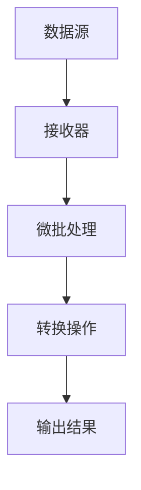

                 

关键词：Spark Streaming，实时流处理，数据处理，微批处理，分布式系统，大数据技术，代码实例

> 摘要：本文将深入讲解Spark Streaming实时流处理的基本原理、架构设计以及代码实例，旨在帮助读者理解并掌握这一大数据处理技术，为实际项目开发提供有力的技术支持。

## 1. 背景介绍

随着互联网的快速发展，数据规模呈现出爆炸式增长，实时处理大量数据的需求日益迫切。传统的批处理系统已无法满足实时性要求，因此，流处理技术应运而生。Apache Spark Streaming是Spark生态系统中专门为实时数据流处理设计的一个组件，它基于Spark的强大计算能力，提供了高效、可靠的实时数据处理解决方案。

### 1.1 Spark Streaming的作用

Spark Streaming的主要作用是：

1. **实时数据采集**：能够从各种数据源（如Kafka、Flume等）中实时读取数据。
2. **实时数据转换**：支持对数据进行清洗、转换、聚合等操作。
3. **实时数据处理**：能够实现实时机器学习、流计算等复杂数据处理任务。

### 1.2 Spark Streaming的特点

1. **高吞吐量**：Spark Streaming利用Spark的核心计算能力，能够在分布式集群上高效地处理大规模数据流。
2. **低延迟**：通过微批处理（micro-batching）技术，Spark Streaming能够实现较低的延迟，满足实时处理的需求。
3. **高容错性**：通过检查点和重试机制，Spark Streaming能够保证数据的完整性和可靠性。
4. **易扩展性**：Spark Streaming可以轻松地扩展到数百个节点，处理海量数据。

## 2. 核心概念与联系

在深入讲解Spark Streaming之前，我们需要了解一些核心概念和架构设计。

### 2.1 微批处理

微批处理是Spark Streaming的核心概念之一。它将连续的数据流分割成小批次，每批次包含一定数量的数据，然后对每个批次进行批处理。这种方式既保留了流处理的实时性，又能够利用Spark的批处理优势。

### 2.2 检查点（Checkpoints）

检查点是为了保证Spark Streaming的容错性和一致性而设计的。在执行过程中，Spark Streaming会定期保存系统的状态，当系统发生故障时，可以通过检查点恢复到之前的正确状态，从而保证数据的完整性和一致性。

### 2.3 流处理与批处理的联系与区别

流处理与批处理都是数据处理的方式，但它们的处理方式和目的有所不同。批处理通常是对静态数据集进行一次性处理，而流处理则是针对动态数据流进行实时处理。

### 2.4 Mermaid 流程图

下面是一个简单的Mermaid流程图，展示了Spark Streaming的基本架构：



在这个流程图中，数据源通过接收器（Receiver）实时读取数据，然后进行微批处理（Micro-batching），接着执行各种转换操作（如清洗、转换、聚合等），最后输出结果。

## 3. 核心算法原理 & 具体操作步骤

### 3.1 算法原理概述

Spark Streaming的核心算法原理是基于Spark的核心计算框架，通过微批处理（micro-batching）和检查点（checkpoints）技术实现实时数据处理。具体来说，Spark Streaming将实时数据流分割成小批次，每个批次经过处理后，生成一系列的DStream（离散的实时数据流），然后通过Spark的核心计算框架对DStream进行转换、处理和输出。

### 3.2 算法步骤详解

1. **数据采集**：Spark Streaming从各种数据源（如Kafka、Flume等）中实时读取数据。
2. **微批处理**：将读取到的数据分割成小批次，每个批次包含一定数量的数据。
3. **数据处理**：对每个批次的数据进行转换、清洗、聚合等操作。
4. **检查点**：定期保存系统的状态，以便在发生故障时恢复。
5. **输出结果**：将处理后的数据输出到文件系统、数据库或其他数据源。

### 3.3 算法优缺点

#### 优点：

1. **高吞吐量**：利用Spark的分布式计算能力，能够处理大规模数据流。
2. **低延迟**：通过微批处理技术，实现较低的处理延迟。
3. **高容错性**：通过检查点机制，保证数据的完整性和一致性。

#### 缺点：

1. **资源消耗**：由于需要定期进行检查点操作，对系统资源有一定消耗。
2. **配置复杂**：Spark Streaming的配置较为复杂，需要根据具体场景进行调整。

### 3.4 算法应用领域

Spark Streaming广泛应用于实时数据流处理领域，如：

1. **实时日志分析**：对服务器日志进行实时分析，监控系统性能。
2. **实时监控**：实时监控网站流量、用户行为等数据，及时响应异常情况。
3. **实时推荐**：根据用户行为数据，实时推荐商品、文章等。

## 4. 数学模型和公式 & 详细讲解 & 举例说明

### 4.1 数学模型构建

Spark Streaming的核心算法可以抽象为一个数学模型，包括以下几个关键参数：

1. **批次大小（batchSize）**：每个批次包含的数据量。
2. **批次间隔（batchInterval）**：两个批次之间的时间间隔。
3. **检查点间隔（checkpointInterval）**：两个检查点之间的时间间隔。

根据这些参数，我们可以构建如下的数学模型：

$$
\text{处理延迟} = \frac{\text{批次大小}}{\text{处理速度}}
$$

$$
\text{检查点频率} = \frac{\text{检查点间隔}}{\text{批次间隔}}
$$

### 4.2 公式推导过程

根据上述数学模型，我们可以推导出如下关系：

1. **处理延迟与批次大小、处理速度的关系**：批次大小越大，处理速度越快，处理延迟越低。
2. **检查点频率与检查点间隔、批次间隔的关系**：检查点间隔越长，批次间隔越短，检查点频率越高。

### 4.3 案例分析与讲解

假设我们设置批次大小为1000条数据，批次间隔为1分钟，检查点间隔为10分钟。根据上述公式，我们可以计算出处理延迟和检查点频率：

$$
\text{处理延迟} = \frac{1000}{\text{处理速度}}
$$

$$
\text{检查点频率} = \frac{10}{1} = 10
$$

如果处理速度为每秒1000条数据，则处理延迟为1秒；如果处理速度为每秒100条数据，则处理延迟为10秒。

## 5. 项目实践：代码实例和详细解释说明

### 5.1 开发环境搭建

在开始编写代码之前，我们需要搭建一个适合开发Spark Streaming项目的环境。以下是搭建步骤：

1. **安装Java环境**：由于Spark Streaming是基于Java开发的，因此需要安装Java环境。
2. **安装Scala环境**：Scala是Spark的主要编程语言，需要安装Scala环境。
3. **安装Spark**：从Spark官网下载对应版本的Spark，解压后添加到系统的环境变量中。
4. **创建Maven项目**：使用Maven创建一个Scala项目，添加Spark依赖。

### 5.2 源代码详细实现

下面是一个简单的Spark Streaming代码实例，用于实时读取Kafka数据，并对数据进行处理。

```scala
import org.apache.spark.SparkConf
import org.apache.spark.streaming.kafka010._
import org.apache.spark.streaming._
import org.apache.spark.streaming.kafka010.LocationStrategies.PreferConsistent
import org.apache.spark.streaming.kafka010.ConsumerStrategies._
import org.apache.kafka.clients.producer.KafkaProducer
import org.apache.kafka.clients.producer.ProducerRecord

val sparkConf = new SparkConf().setAppName("KafkaSparkStreamingExample")
val ssc = new StreamingContext(sparkConf, Seconds(10))

// Kafka配置
val kafkaParams = Map(
  "bootstrap.servers" -> "localhost:9092",
  "key.deserializer" -> classOf[StringDeserializer],
  "value.deserializer" -> classOf[StringDeserializer],
  "group.id" -> "use_a_separate_group_for_each_stream",
  "auto.offset.reset" -> "latest_offset",
  "enable.auto.commit" -> (false: java.lang.Boolean)
)

// Kafka主题
val topics = Array("test-topic")

// 创建Kafka DStream
val stream = KafkaUtils.createDirectStream[String, String](
  ssc,
  PreferConsistent,
  DefaultCreationStrategy,
  kafkaParams,
  topics
)

// 对数据进行处理
stream.map(x => x._2).foreachRDD { rdd =>
  rdd.foreachPartition { partitionOfRecords =>
    // 对每个分区的数据进行处理
    partitionOfRecords.foreach { record =>
      // 处理数据...
    }
  }
}

ssc.start()
ssc.awaitTermination()
```

### 5.3 代码解读与分析

1. **创建SparkConf和StreamingContext**：配置Spark应用程序的基本信息，如应用程序名称、执行器内存等。
2. **Kafka配置**：配置Kafka连接参数，包括Kafka服务器地址、主题名称等。
3. **创建Kafka DStream**：使用KafkaUtils.createDirectStream创建Kafka DStream，从Kafka中实时读取数据。
4. **数据处理**：对DStream进行转换、处理和输出。

### 5.4 运行结果展示

运行上述代码，我们可以看到Spark Streaming从Kafka中实时读取数据，并对数据进行处理。运行结果可以通过日志输出或图形界面展示。

## 6. 实际应用场景

### 6.1 实时日志分析

在互联网公司，服务器日志通常包含大量的信息，如访问记录、错误日志等。通过Spark Streaming，我们可以实时分析服务器日志，监控服务器性能，及时发现异常情况。

### 6.2 实时监控

在金融、电商等领域，实时监控网站流量、用户行为等数据非常重要。Spark Streaming可以帮助我们实时分析这些数据，提供实时监控和预警。

### 6.3 实时推荐

在电商领域，实时推荐系统可以根据用户行为数据，实时推荐商品、文章等，提高用户体验和销售额。Spark Streaming可以用于构建实时推荐系统，实现动态调整推荐策略。

## 7. 工具和资源推荐

### 7.1 学习资源推荐

1. 《Spark Streaming权威指南》（Apache Spark Streaming）是一本非常全面的Spark Streaming学习资料，适合初学者和进阶者。
2. 《Spark技术内幕》详细介绍了Spark的架构设计、原理和实现，有助于深入理解Spark的工作机制。

### 7.2 开发工具推荐

1. IntelliJ IDEA：一款功能强大的集成开发环境，支持Scala和Java编程语言，适合开发Spark应用程序。
2. DBeaver：一款开源的数据库管理工具，可以方便地管理Kafka等大数据组件。

### 7.3 相关论文推荐

1. "Spark: Cluster Computing with Working Sets"
2. "Streaming Data Processing with Spark Streaming"

## 8. 总结：未来发展趋势与挑战

### 8.1 研究成果总结

Spark Streaming在实时流处理领域取得了显著的成果，其高吞吐量、低延迟和高容错性等特点受到了广泛应用。同时，Spark Streaming也在不断更新和优化，以适应不断变化的需求。

### 8.2 未来发展趋势

1. **实时数据处理**：随着物联网、人工智能等技术的发展，实时数据处理的需求将不断增加，Spark Streaming有望成为实时数据处理的重要技术之一。
2. **云计算与边缘计算**：云计算和边缘计算的发展，将为Spark Streaming提供更广泛的部署场景和应用机会。

### 8.3 面临的挑战

1. **资源消耗**：检查点操作对系统资源有一定消耗，如何优化资源使用成为关键问题。
2. **配置复杂**：Spark Streaming的配置较为复杂，如何简化配置过程，提高使用体验，是未来的重要挑战。

### 8.4 研究展望

1. **优化性能**：通过改进算法、优化数据结构，提高Spark Streaming的性能和效率。
2. **简化配置**：通过自动化配置、模板化部署，简化Spark Streaming的配置和使用过程。

## 9. 附录：常见问题与解答

### 9.1 如何配置Kafka参数？

Kafka参数配置通常包括Kafka服务器地址、主题名称、分区数量等。具体配置方法请参考Kafka官方文档。

### 9.2 如何处理Spark Streaming的异常情况？

当Spark Streaming出现异常情况时，可以通过检查日志、重试机制和检查点恢复等方法进行处理。具体处理方法请参考Spark Streaming官方文档。

## 作者署名

作者：禅与计算机程序设计艺术 / Zen and the Art of Computer Programming
----------------------------------------------------------------

以上便是关于《Spark Streaming实时流处理原理与代码实例讲解》的技术博客文章。希望本文能帮助读者深入理解Spark Streaming的技术原理和实践方法，为实际项目开发提供有力支持。在后续的学习和实践中，请不断探索和尝试，相信您会在实时流处理领域取得更好的成绩。

