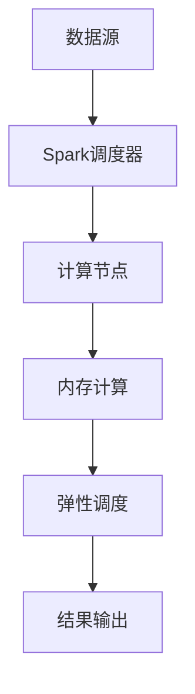

                 

关键词：Spark、实时计算、大数据处理、计算框架、流处理、实时分析、批处理

> 摘要：本文将详细介绍Spark大数据实时计算框架，包括其背景、核心概念、算法原理、数学模型、实际应用以及未来展望。Spark作为大数据领域的革命性技术，其在实时计算和流处理方面的优势使其成为当前热门的研究和应用方向。

## 1. 背景介绍

随着互联网的飞速发展和大数据时代的到来，数据量呈爆炸式增长。传统的批处理系统已经难以满足实时分析的需求，因此，实时计算框架应运而生。Spark作为Apache软件基金会的一款开源分布式计算框架，自2009年诞生以来，因其高效、灵活和易于扩展的特点，迅速成为大数据处理领域的明星技术。

Spark的实时计算能力主要源于其基于内存的架构设计，这使得它能够实现亚秒级延迟的实时数据处理，极大地提升了数据分析的实时性。此外，Spark还具备强大的流处理能力，可以无缝地将批处理和实时处理相结合，为用户提供了全面的处理解决方案。

## 2. 核心概念与联系

### 2.1 核心概念

- **分布式计算**：将计算任务分布在多个节点上执行，以充分利用计算资源。
- **内存计算**：利用内存作为主要存储介质，降低数据的读写延迟。
- **弹性调度**：根据任务负载动态调整资源分配，确保计算资源的合理利用。
- **流处理**：对实时数据流进行持续处理，以实现亚秒级延迟的数据分析。

### 2.2 核心概念原理与架构

为了更好地理解Spark的实时计算框架，下面使用Mermaid流程图展示其核心概念原理和架构。



### 2.3 核心概念联系

- **分布式计算**与**内存计算**：分布式计算将数据分布在多个节点上处理，而内存计算则通过利用节点内存作为存储介质，降低了数据的读写延迟。
- **弹性调度**与**流处理**：弹性调度可以根据任务负载动态调整资源分配，确保计算资源的合理利用；流处理则可以实时地对数据流进行处理，满足亚秒级延迟的要求。

## 3. 核心算法原理 & 具体操作步骤

### 3.1 算法原理概述

Spark的核心算法包括Spark SQL、Spark Streaming和DataFrame/Dataset API等。下面分别介绍这些算法的原理。

#### 3.1.1 Spark SQL

Spark SQL是一种用于大数据处理的数据仓库，基于Hadoop的YARN平台，提供了高效、可扩展的SQL查询能力。Spark SQL的核心算法是Catalyst优化器，它通过分析查询计划，优化执行路径，提高查询性能。

#### 3.1.2 Spark Streaming

Spark Streaming是一种用于实时流处理的高级API，可以处理实时的数据流，并以批处理的方式进行数据分析和处理。其核心算法是基于微批处理（micro-batching）的思想，将数据划分为微小的批次进行处理。

#### 3.1.3 DataFrame/Dataset API

DataFrame/Dataset API是Spark 1.6引入的一种新的数据处理API，它提供了更丰富的类型安全和优化功能。DataFrame/Dataset API基于拉链表（Rapids）算法，通过列式存储和优化查询计划，提高了数据处理性能。

### 3.2 算法步骤详解

#### 3.2.1 Spark SQL算法步骤

1. 数据输入：将数据导入到Spark SQL，可以来自HDFS、Hive、Parquet等存储格式。
2. 查询优化：通过Catalyst优化器对查询计划进行分析和优化。
3. 执行查询：根据优化后的查询计划，执行数据查询操作。
4. 结果输出：将查询结果输出到控制台或文件中。

#### 3.2.2 Spark Streaming算法步骤

1. 数据输入：将实时数据流输入到Spark Streaming。
2. 数据批次处理：将数据划分为微小的批次进行处理。
3. 数据处理：对每个批次的数据进行相应的处理操作，如过滤、聚合等。
4. 结果输出：将处理结果输出到控制台或文件中。

#### 3.2.3 DataFrame/Dataset API算法步骤

1. 数据输入：将数据输入到DataFrame/Dataset API，可以来自Parquet、JSON、CSV等格式。
2. 数据转换：通过DataFrame/Dataset API提供的丰富操作函数，对数据进行处理和转换。
3. 数据优化：利用DataFrame/Dataset API的优化功能，提高数据处理性能。
4. 结果输出：将处理结果输出到控制台或文件中。

### 3.3 算法优缺点

#### 3.3.1 Spark SQL

**优点**：

- 提供高效的SQL查询能力。
- 具备丰富的数据源支持。
- 具有良好的兼容性，可以与Hadoop生态系统中的其他组件无缝集成。

**缺点**：

- 对非结构化数据的处理能力有限。
- 对内存资源的依赖较大，可能导致性能下降。

#### 3.3.2 Spark Streaming

**优点**：

- 提供强大的实时流处理能力。
- 可以无缝地将批处理和实时处理相结合。
- 具有良好的可扩展性和容错性。

**缺点**：

- 对数据源的支持相对有限。
- 处理实时数据时，可能面临数据延迟问题。

#### 3.3.3 DataFrame/Dataset API

**优点**：

- 提供丰富的类型安全和优化功能。
- 具有高效的列式存储和查询能力。
- 具有良好的兼容性和可扩展性。

**缺点**：

- 对用户的学习成本较高。
- 在处理大规模数据时，可能面临性能瓶颈。

### 3.4 算法应用领域

- **实时数据分析**：如实时监控系统、金融交易分析、社交网络分析等。
- **流处理**：如实时数据流分析、实时推荐系统、实时广告投放等。
- **数据仓库**：如企业数据仓库、大数据分析平台等。
- **机器学习**：如在线机器学习、实时预测等。

## 4. 数学模型和公式 & 详细讲解 & 举例说明

### 4.1 数学模型构建

在Spark的实时计算框架中，常用的数学模型包括线性回归、逻辑回归、聚类算法等。下面以线性回归为例，介绍其数学模型的构建。

#### 4.1.1 线性回归

线性回归是一种用于建模线性关系的统计方法。其数学模型可以表示为：

$$
y = \beta_0 + \beta_1 \cdot x
$$

其中，$y$ 表示因变量，$x$ 表示自变量，$\beta_0$ 和 $\beta_1$ 分别为模型参数。

#### 4.1.2 逻辑回归

逻辑回归是一种用于建模二分类问题的统计方法。其数学模型可以表示为：

$$
P(y=1) = \frac{1}{1 + e^{-(\beta_0 + \beta_1 \cdot x)}}
$$

其中，$P(y=1)$ 表示因变量为1的概率，$\beta_0$ 和 $\beta_1$ 分别为模型参数。

#### 4.1.3 聚类算法

聚类算法是一种用于数据分组的方法。其数学模型可以表示为：

$$
C = \{C_1, C_2, ..., C_k\}
$$

其中，$C$ 表示聚类结果，$C_i$ 表示第 $i$ 个聚类结果，$k$ 表示聚类个数。

### 4.2 公式推导过程

以线性回归为例，介绍其数学公式的推导过程。

#### 4.2.1 梯度下降法

梯度下降法是一种用于求解线性回归参数的优化方法。其目标是最小化损失函数：

$$
J(\beta_0, \beta_1) = \frac{1}{2m} \sum_{i=1}^{m} (y_i - (\beta_0 + \beta_1 \cdot x_i))^2
$$

其中，$m$ 表示样本个数，$y_i$ 和 $x_i$ 分别表示第 $i$ 个样本的因变量和自变量。

对损失函数求导，得到：

$$
\frac{\partial J}{\partial \beta_0} = \frac{1}{m} \sum_{i=1}^{m} (y_i - (\beta_0 + \beta_1 \cdot x_i)) = 0
$$

$$
\frac{\partial J}{\partial \beta_1} = \frac{1}{m} \sum_{i=1}^{m} (y_i - (\beta_0 + \beta_1 \cdot x_i)) \cdot x_i = 0
$$

通过求解上述方程组，可以求得线性回归参数：

$$
\beta_0 = \frac{1}{m} \sum_{i=1}^{m} y_i - \beta_1 \cdot \frac{1}{m} \sum_{i=1}^{m} x_i
$$

$$
\beta_1 = \frac{1}{m} \sum_{i=1}^{m} (x_i - \bar{x}) \cdot (y_i - \bar{y})
$$

其中，$\bar{x}$ 和 $\bar{y}$ 分别表示样本均值。

### 4.3 案例分析与讲解

以下通过一个实际案例，展示Spark实时计算框架在实时数据分析中的应用。

#### 4.3.1 案例背景

假设某电商平台希望实时分析用户购买行为，以便进行个性化推荐。实时数据来源于用户点击、浏览和购买等行为数据，每秒产生数百万条数据。

#### 4.3.2 数据处理流程

1. **数据采集**：通过数据采集系统，将用户行为数据实时传输到Spark Streaming系统。
2. **数据预处理**：对数据进行清洗、去重和格式转换，以便后续处理。
3. **实时分析**：利用Spark Streaming对预处理后的数据进行实时分析，计算用户购买偏好、热门商品等。
4. **结果输出**：将实时分析结果存储到数据库或缓存中，供后续使用。

#### 4.3.3 案例分析

1. **用户购买偏好分析**：通过分析用户购买历史数据，识别用户购买偏好，如热门商品、品牌等。
2. **热门商品推荐**：根据用户购买偏好，实时推荐热门商品，提高用户满意度。
3. **个性化推荐**：根据用户购买行为，为用户提供个性化的商品推荐，提高转化率。

### 4.4 代码实例和详细解释说明

以下通过一个简单的案例，展示如何使用Spark Streaming进行实时数据分析。

```python
from pyspark import SparkContext, SparkConf
from pyspark.streaming import StreamingContext

# 创建Spark配置对象
conf = SparkConf().setAppName("RealTimeAnalysis")

# 创建SparkContext
sc = SparkContext(conf=conf)

# 创建StreamingContext
ssc = StreamingContext(sc, 2)  # 设定批处理时间窗口为2秒

# 创建输入流
lines = ssc.socketTextStream("localhost", 9999)

# 数据预处理
cleaned_lines = lines.filter(lambda line: line.strip())

# 实时分析
# 计算每个批次中的单词数量
word_counts = cleaned_lines.flatMap(lambda line: line.split(" ")).map(lambda word: (word, 1)).reduceByKey(lambda x, y: x + y)

# 输出结果
word_counts.pprint()

# 启动StreamingContext
ssc.start()

# 等待StreamingContext关闭
ssc.awaitTermination()
```

#### 4.4.1 代码解读与分析

1. **创建Spark配置对象和SparkContext**：设定应用名称和配置对象。
2. **创建StreamingContext**：设定批处理时间窗口。
3. **创建输入流**：使用socketTextStream从本地主机9999端口接收文本数据。
4. **数据预处理**：对输入流进行清洗、去重和格式转换。
5. **实时分析**：计算每个批次中的单词数量。
6. **输出结果**：将分析结果打印到控制台。
7. **启动StreamingContext**：启动实时计算任务。
8. **等待StreamingContext关闭**：等待计算任务结束。

通过以上代码，可以实现对实时文本数据的处理和分析，为后续应用提供基础。

## 5. 实际应用场景

### 5.1 实时监控

Spark实时计算框架可以应用于企业实时监控系统，如服务器监控、网络监控等。通过实时分析系统日志和性能指标，企业可以及时发现问题并进行优化。

### 5.2 金融交易分析

Spark的实时计算能力可以应用于金融交易分析领域，如实时监控市场波动、预测股票价格等。通过对大量金融数据进行实时分析，投资者可以做出更加准确的决策。

### 5.3 社交网络分析

Spark实时计算框架可以应用于社交网络分析，如实时监控用户行为、识别潜在风险等。通过对社交网络数据的实时处理，企业可以更好地了解用户需求，提供个性化的服务。

### 5.4 智能推荐系统

Spark的流处理能力可以应用于智能推荐系统，如实时推荐商品、新闻等。通过对用户行为数据的实时分析，推荐系统可以提供更加准确的推荐结果，提高用户满意度。

## 6. 未来应用展望

### 6.1 数据隐私保护

随着大数据时代的到来，数据隐私保护成为越来越重要的问题。未来，Spark实时计算框架将加强对数据隐私的保护，如数据加密、访问控制等。

### 6.2 深度学习与实时计算

深度学习与实时计算的结合将为大数据处理带来新的机遇。未来，Spark实时计算框架将集成深度学习算法，提供更高效、更准确的实时数据分析能力。

### 6.3 智能化应用

随着人工智能技术的不断发展，Spark实时计算框架将广泛应用于智能化应用领域，如自动驾驶、智能家居等。通过实时处理和分析数据，这些应用将变得更加智能和高效。

## 7. 工具和资源推荐

### 7.1 学习资源推荐

1. 《Spark：The Definitive Guide》
2. 《Spark Streaming实战》
3. Spark官网：[https://spark.apache.org/](https://spark.apache.org/)

### 7.2 开发工具推荐

1. IntelliJ IDEA
2. PyCharm
3. Eclipse

### 7.3 相关论文推荐

1. "Spark: Cluster Computing with Working Sets"
2. "Spark Streaming: Clustered and High-Throughput Streaming Data Processing"
3. "Distributed Computing with SAS: A Scalable and Efficient Approach to Big Data Analysis"

## 8. 总结：未来发展趋势与挑战

### 8.1 研究成果总结

本文详细介绍了Spark大数据实时计算框架的背景、核心概念、算法原理、数学模型、实际应用以及未来展望。通过本文的介绍，读者可以全面了解Spark在实时计算和流处理方面的优势和特点。

### 8.2 未来发展趋势

未来，Spark实时计算框架将继续发挥其在实时计算和流处理方面的优势，广泛应用于大数据、人工智能、物联网等领域。同时，随着技术的不断进步，Spark实时计算框架将不断优化和完善，提供更高效、更可靠的数据处理能力。

### 8.3 面临的挑战

尽管Spark实时计算框架在实时计算和流处理方面具有显著优势，但仍面临一些挑战：

1. **数据隐私保护**：随着数据隐私保护的重要性日益凸显，如何在实时计算中保障数据隐私成为一个重要问题。
2. **性能优化**：在大数据场景下，如何优化Spark实时计算框架的性能，提高数据处理效率是一个重要课题。
3. **系统集成**：如何与其他大数据技术和人工智能算法集成，提供更全面、更高效的解决方案是一个重要挑战。

### 8.4 研究展望

未来，Spark实时计算框架的研究方向包括：

1. **深度学习与实时计算**：结合深度学习算法，提供更高效、更准确的实时数据分析能力。
2. **数据隐私保护**：研究实时计算中的数据隐私保护技术，保障用户数据安全。
3. **智能化应用**：将Spark实时计算框架应用于更广泛的智能化应用领域，如自动驾驶、智能家居等。

通过不断的研究和优化，Spark实时计算框架将在未来发挥更加重要的作用，推动大数据和人工智能技术的发展。

## 9. 附录：常见问题与解答

### 9.1 什么是Spark？

Spark是一个开源的分布式计算系统，适用于大规模数据处理。它能够实现快速数据查询和分析，支持内存计算和弹性调度。

### 9.2 Spark与Hadoop的关系是什么？

Spark是Hadoop生态系统的一部分，它可以在Hadoop集群上运行，并利用Hadoop的YARN资源管理器。Spark与Hadoop相比，在实时计算和流处理方面具有更高的性能。

### 9.3 Spark适用于哪些场景？

Spark适用于大数据处理、实时分析、流处理、机器学习等领域。它可以应用于金融、电商、社交网络、物联网等多个行业。

### 9.4 如何搭建Spark开发环境？

搭建Spark开发环境需要安装Java、Scala以及Spark本身。可以使用官方提供的二进制包或源代码进行编译。详细安装步骤请参考Spark官网。

### 9.5 Spark与Flink相比，有哪些优缺点？

Spark与Flink都是实时计算框架，但它们各有优缺点：

**优点**：

- Spark：内存计算、弹性调度、支持多种编程语言。
- Flink：流处理性能更优、支持更多实时处理算法。

**缺点**：

- Spark：对内存依赖较大、数据源支持相对有限。
- Flink：对用户的学习成本较高、性能优化难度较大。

### 9.6 Spark实时计算如何保障数据一致性？

Spark实时计算通过数据分区和任务调度来保障数据一致性。在处理过程中，Spark会确保每个数据分区在处理时的一致性，从而保证最终结果的一致性。

## 附录二：参考资源

1. 《Spark：The Definitive Guide》
2. 《Spark Streaming实战》
3. Spark官网：[https://spark.apache.org/](https://spark.apache.org/)
4. Flink官网：[https://flink.apache.org/](https://flink.apache.org/)
5. Hadoop官网：[https://hadoop.apache.org/](https://hadoop.apache.org/)

### 作者：禅与计算机程序设计艺术 / Zen and the Art of Computer Programming

本文旨在全面介绍Spark大数据实时计算框架，包括其背景、核心概念、算法原理、数学模型、实际应用以及未来展望。通过本文的介绍，读者可以深入了解Spark在实时计算和流处理方面的优势和特点，为未来的研究和应用提供参考。希望本文能为广大读者在Spark学习和实践中提供帮助。作者在此感谢各位读者的支持和关注。未来，我们将继续探索更多关于大数据、人工智能等领域的热门技术，与广大读者共同进步。

