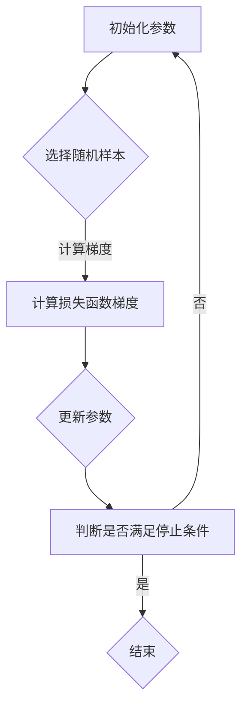
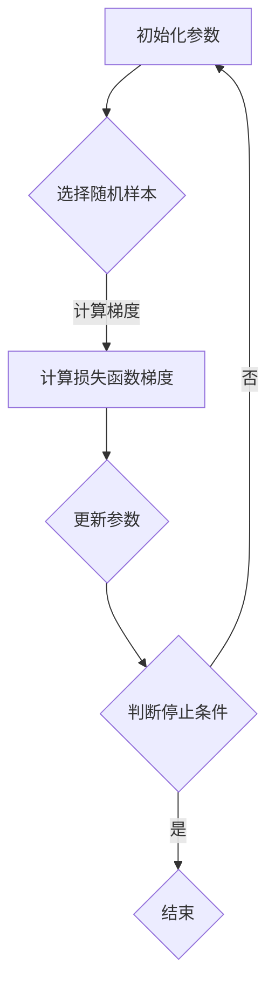

                 

## 1. 背景介绍

在深度学习和机器学习领域，优化算法是一个至关重要的组成部分。这些算法的目标是找到模型的参数，使得模型能够在训练数据上取得良好的性能。其中，Stochastic Gradient Descent (SGD) 是一种非常流行的优化算法，被广泛应用于各种机器学习和深度学习任务中。

### 1.1 SGD 的起源和发展历程

SGD 的起源可以追溯到 1950 年代，当时人们开始尝试通过随机化的方法来加速优化过程。尽管最初的版本存在一些缺陷，但它们为后续的改进工作奠定了基础。随着计算机技术的进步和机器学习领域的快速发展，SGD 在上世纪 90 年代和 2000 年代初期逐渐崭露头角，成为机器学习领域的一种主流优化算法。

### 1.2 SGD 在机器学习中的应用场景

SGD 适用于各种机器学习和深度学习任务，包括分类、回归、聚类等。它不仅可以用于传统的监督学习任务，还可以用于无监督学习和强化学习等场景。此外，SGD 还具有以下优点：

1. **易于实现**：SGD 的实现相对简单，易于理解和编程。
2. **适用范围广**：SGD 可以应用于各种规模的数据集和模型。
3. **收敛速度快**：在某些情况下，SGD 的收敛速度比其他优化算法要快。
4. **可调参数少**：SGD 的主要参数只有一个学习率，这使得它更容易调整。

### 1.3 文章结构

本文将分为以下几个部分：

1. **背景介绍**：介绍 SGD 的起源、发展和应用场景。
2. **核心概念与联系**：解释 SGD 的核心概念及其与相关算法的联系。
3. **核心算法原理 & 具体操作步骤**：详细讲解 SGD 的算法原理和操作步骤。
4. **数学模型和公式 & 详细讲解 & 举例说明**：阐述 SGD 的数学模型、公式和实际应用案例。
5. **项目实践：代码实例和详细解释说明**：通过实际代码示例展示 SGD 的应用。
6. **实际应用场景**：分析 SGD 在实际应用中的效果和优势。
7. **未来应用展望**：探讨 SGD 在未来的发展趋势和挑战。
8. **工具和资源推荐**：推荐学习资源和开发工具。
9. **总结：未来发展趋势与挑战**：总结研究成果，展望未来发展趋势和挑战。
10. **附录：常见问题与解答**：回答读者可能关心的问题。

通过本文，读者将深入了解 SGD 的原理和应用，掌握其核心操作步骤，并了解其在实际应用中的效果和潜力。

## 2. 核心概念与联系

### 2.1 SGD 的核心概念

SGD（Stochastic Gradient Descent）是一种基于梯度下降的优化算法，它通过迭代地更新模型参数，以最小化损失函数。在 SGD 中，“随机”一词意味着每次迭代中使用的样本都是随机选择的，而不是全部样本。这种随机化的过程可以加快收敛速度，并减少陷入局部最优的风险。

### 2.2 SGD 与其他优化算法的联系

SGD 与其他优化算法，如批量梯度下降（Batch Gradient Descent，BGD）和小批量梯度下降（Mini-batch Gradient Descent，MBGD）密切相关。它们的区别在于每次迭代时使用的数据量。

- **批量梯度下降（BGD）**：每次迭代使用全部样本来计算梯度。
- **小批量梯度下降（MBGD）**：每次迭代使用一部分样本（称为批量）来计算梯度。
- **随机梯度下降（SGD）**：每次迭代使用单个样本来计算梯度。

### 2.3 SGD 的优势与劣势

**优势**：

1. **收敛速度快**：由于每次迭代只使用一个样本，SGD 可以在较短时间内更新模型参数。
2. **易于实现**：SGD 的实现相对简单，不需要复杂的计算。
3. **减少过拟合**：随机化的过程可以减少模型对训练数据的依赖，从而减少过拟合的风险。

**劣势**：

1. **计算量大**：由于每次迭代都要计算一个样本的梯度，SGD 的计算量相对较大。
2. **稳定性问题**：SGD 的收敛速度受学习率的影响较大，需要小心调整。

### 2.4 SGD 的 Mermaid 流程图

下面是 SGD 的 Mermaid 流程图，它展示了 SGD 的核心概念和操作步骤。



### 2.5 SGD 与其他优化算法的比较

| 优化算法 | 梯度计算方式 | 数据量 | 收敛速度 | 稳定性 | 优点 | 劣势 |
| :---: | :---: | :---: | :---: | :---: | :---: | :---: |
| BGD | 全部样本 | 全部样本 | 慢 | 较好 | 计算量小，稳定性好 | 计算量大，收敛速度慢 |
| MBGD | 部分样本 | 批量样本 | 较快 | 一般 | 计算量适中，收敛速度快 | 稳定性一般 |
| SGD | 单个样本 | 单个样本 | 快 | 较差 | 收敛速度快，易于实现 | 计算量大，稳定性问题 |

通过以上内容，读者可以初步了解 SGD 的核心概念、与其他优化算法的联系以及其在实际应用中的优势和劣势。接下来，我们将深入探讨 SGD 的算法原理和具体操作步骤。

## 3. 核心算法原理 & 具体操作步骤

### 3.1 算法原理概述

Stochastic Gradient Descent (SGD) 是一种基于梯度下降法的优化算法，其主要思想是不断迭代地更新模型的参数，以最小化损失函数。与传统的梯度下降法相比，SGD 在每次迭代时仅使用一个随机样本来计算梯度，而不是使用整个训练集。

### 3.2 算法步骤详解

1. **初始化参数**：首先，需要初始化模型的参数。这些参数通常从均匀分布或高斯分布中随机生成。初始化参数的目的是为了防止模型在训练过程中过早地收敛到局部最优。

    ```python
    # 示例：初始化权重和偏置
    weights = np.random.randn(num_features, num_classes)
    biases = np.random.randn(num_classes)
    ```

2. **选择随机样本**：在每次迭代中，从训练集中随机选择一个样本。

    ```python
    # 示例：从训练集中随机选择一个样本
    sample = random.choice(train_samples)
    ```

3. **计算梯度**：使用随机选择的样本，计算损失函数关于模型参数的梯度。

    ```python
    # 示例：计算损失函数的梯度
    gradient = compute_gradient(loss_function, sample, weights, biases)
    ```

4. **更新参数**：根据计算出的梯度，更新模型的参数。

    ```python
    # 示例：更新权重和偏置
    weights -= learning_rate * gradient['weights']
    biases -= learning_rate * gradient['biases']
    ```

5. **判断是否满足停止条件**：判断是否满足停止条件，如达到预定的迭代次数或损失函数的下降速度足够慢。如果是，则结束迭代；否则，继续下一次迭代。

    ```python
    # 示例：判断停止条件
    if should_stop(epochs, loss_function, weights, biases):
        break
    ```

### 3.3 算法优缺点

**优点**：

1. **收敛速度快**：由于每次迭代仅使用一个样本，SGD 的收敛速度相对较快。
2. **易于实现**：SGD 的实现相对简单，不需要复杂的计算。
3. **减少过拟合**：随机化的过程可以减少模型对训练数据的依赖，从而减少过拟合的风险。

**缺点**：

1. **计算量大**：由于每次迭代都要计算一个样本的梯度，SGD 的计算量相对较大。
2. **稳定性问题**：SGD 的收敛速度受学习率的影响较大，需要小心调整。

### 3.4 算法应用领域

SGD 在机器学习和深度学习领域有广泛的应用，包括但不限于：

1. **图像分类**：如卷积神经网络（CNN）中的优化算法。
2. **自然语言处理**：如循环神经网络（RNN）和长短时记忆网络（LSTM）中的优化算法。
3. **强化学习**：在强化学习任务中，SGD 用于优化策略参数。
4. **回归任务**：用于优化线性回归模型的参数。

### 3.5 SGD 的 Mermaid 流程图

下面是 SGD 的 Mermaid 流程图，它详细展示了 SGD 的操作步骤和流程。



通过以上内容，读者可以全面了解 SGD 的核心算法原理和具体操作步骤。在接下来的部分，我们将深入探讨 SGD 的数学模型和公式，以及其实际应用中的案例讲解。

## 4. 数学模型和公式 & 详细讲解 & 举例说明

### 4.1 数学模型构建

在 SGD 中，我们主要关注的是损失函数的优化。损失函数是用来衡量模型预测结果与真实结果之间差异的指标。在机器学习中，常用的损失函数包括均方误差（MSE）、交叉熵损失（Cross-Entropy Loss）等。

#### 均方误差（MSE）

均方误差是监督学习中常用的损失函数，它表示预测值与真实值之间的平均平方误差。数学表达式如下：

\[ \text{MSE}(y, \hat{y}) = \frac{1}{n} \sum_{i=1}^{n} (y_i - \hat{y_i})^2 \]

其中，\( y \) 表示真实标签，\( \hat{y} \) 表示预测标签，\( n \) 表示样本数量。

#### 交叉熵损失（Cross-Entropy Loss）

交叉熵损失函数用于分类问题，它衡量的是实际输出与预测输出之间的差异。数学表达式如下：

\[ \text{Cross-Entropy Loss}(y, \hat{y}) = -\sum_{i=1}^{n} y_i \log(\hat{y_i}) \]

其中，\( y \) 是真实标签（二进制向量），\( \hat{y} \) 是模型预测的概率分布。

### 4.2 公式推导过程

在理解了损失函数之后，我们需要了解如何通过梯度下降法来最小化这些损失函数。梯度下降法的基本思想是找到损失函数的局部最小值，从而得到最优的模型参数。

#### 梯度计算

对于均方误差损失函数，其梯度计算公式如下：

\[ \nabla_{\theta} \text{MSE}(y, \hat{y}) = -2 \sum_{i=1}^{n} (y_i - \hat{y_i}) \cdot \frac{\partial \hat{y_i}}{\partial \theta} \]

对于交叉熵损失函数，其梯度计算公式如下：

\[ \nabla_{\theta} \text{Cross-Entropy Loss}(y, \hat{y}) = \hat{y} - y \]

其中，\( \theta \) 表示模型参数。

#### 更新参数

在知道了损失函数的梯度后，我们可以通过以下公式更新模型参数：

\[ \theta = \theta - \alpha \nabla_{\theta} \text{Loss} \]

其中，\( \alpha \) 是学习率，它决定了参数更新的步长。

### 4.3 案例分析与讲解

为了更好地理解 SGD 的数学模型和公式，我们通过一个简单的线性回归问题来进行分析。

#### 问题背景

假设我们有一个线性回归问题，目标是找到一条直线，使得这条直线能够尽可能好地拟合一组数据点。数据点可以表示为 \( (x_i, y_i) \)，其中 \( x_i \) 是输入特征，\( y_i \) 是真实标签。

#### 模型表示

我们可以使用以下线性模型来表示这个问题：

\[ \hat{y_i} = \theta_0 + \theta_1 x_i \]

其中，\( \theta_0 \) 和 \( \theta_1 \) 分别是模型的偏置和权重。

#### 损失函数

对于线性回归问题，我们使用均方误差（MSE）作为损失函数：

\[ \text{MSE}(y, \hat{y}) = \frac{1}{n} \sum_{i=1}^{n} (y_i - \hat{y_i})^2 \]

#### 梯度计算

根据线性回归的损失函数，我们可以计算梯度：

\[ \nabla_{\theta_0} \text{MSE}(y, \hat{y}) = -2 \sum_{i=1}^{n} (y_i - \hat{y_i}) \]

\[ \nabla_{\theta_1} \text{MSE}(y, \hat{y}) = -2 \sum_{i=1}^{n} (y_i - \hat{y_i}) x_i \]

#### 参数更新

假设我们的学习率为 \( \alpha = 0.01 \)，我们可以使用以下公式更新参数：

\[ \theta_0 = \theta_0 - \alpha \nabla_{\theta_0} \text{MSE}(y, \hat{y}) \]

\[ \theta_1 = \theta_1 - \alpha \nabla_{\theta_1} \text{MSE}(y, \hat{y}) \]

通过以上步骤，我们可以不断迭代地更新参数，使得损失函数逐渐减小，从而找到最佳拟合直线。

### 4.4 案例代码实现

下面是一个简单的线性回归案例的代码实现，展示了如何使用 SGD 进行参数优化。

```python
import numpy as np

# 初始化参数
theta_0 = 0
theta_1 = 0

# 学习率
alpha = 0.01

# 数据
x = np.array([1, 2, 3, 4, 5])
y = np.array([2, 4, 5, 4, 5])

# 梯度计算函数
def compute_gradient(y, theta_0, theta_1):
    n = len(y)
    gradient_theta_0 = -2 * np.sum(y - theta_0 - theta_1 * x)
    gradient_theta_1 = -2 * np.sum((y - theta_0 - theta_1 * x) * x)
    return {'theta_0': gradient_theta_0, 'theta_1': gradient_theta_1}

# 参数更新函数
def update_theta(theta_0, theta_1, gradient):
    theta_0 -= alpha * gradient['theta_0']
    theta_1 -= alpha * gradient['theta_1']
    return theta_0, theta_1

# 迭代更新参数
for i in range(1000):
    gradient = compute_gradient(y, theta_0, theta_1)
    theta_0, theta_1 = update_theta(theta_0, theta_1, gradient)

# 输出最优参数
print("最优参数：theta_0 =", theta_0, "theta_1 =", theta_1)
```

通过以上代码，我们可以找到线性回归问题的最优参数，从而实现数据的拟合。

通过以上内容，读者可以深入理解 SGD 的数学模型和公式，并通过实际案例了解其应用和实现过程。在接下来的部分，我们将通过代码实例来展示 SGD 的具体应用。

## 5. 项目实践：代码实例和详细解释说明

为了更好地理解 Stochastic Gradient Descent (SGD) 的实际应用，我们将通过一个简单的线性回归项目来展示 SGD 的实现过程。在这个项目中，我们使用 Python 和 NumPy 库来构建模型，并使用 SGD 来优化模型参数。

### 5.1 开发环境搭建

在开始之前，请确保您已经安装了以下软件和库：

1. Python 3.x（推荐 Python 3.6 或以上版本）
2. NumPy 库

您可以通过以下命令安装 NumPy：

```bash
pip install numpy
```

### 5.2 源代码详细实现

下面是完整的代码实现，包括数据预处理、模型定义、SGD 算法实现以及结果展示。

```python
import numpy as np

# 数据预处理
# 假设有以下数据集
x = np.array([1, 2, 3, 4, 5])  # 输入特征
y = np.array([2, 4, 5, 4, 5])  # 真实标签

# 添加偏置（截距项）
x_with_bias = np.c_[np.ones((x.shape[0], 1)), x]

# 初始化模型参数
theta = np.random.randn(x_with_bias.shape[1])

# SGD 算法实现
learning_rate = 0.01
num_iterations = 1000

def compute_gradient(x_with_bias, y, theta):
    predictions = x_with_bias @ theta
    errors = predictions - y
    gradient = (x_with_bias.T @ errors) / y.shape[0]
    return gradient

def update_theta(theta, gradient, learning_rate):
    theta -= learning_rate * gradient
    return theta

# 迭代优化参数
for iteration in range(num_iterations):
    gradient = compute_gradient(x_with_bias, y, theta)
    theta = update_theta(theta, gradient, learning_rate)
    if iteration % 100 == 0:
        print(f"Iteration {iteration}: Loss = {np.mean((x_with_bias @ theta - y)**2)}")

# 输出最优参数
print("最优参数：", theta)

# 预测新数据
new_x = np.array([6])
new_x_with_bias = np.c_[np.ones((new_x.shape[0], 1)), new_x]
new_prediction = new_x_with_bias @ theta
print("新数据预测结果：", new_prediction)
```

### 5.3 代码解读与分析

#### 数据预处理

在代码中，我们首先加载了一个简单的一维数据集 \( x \) 和真实标签 \( y \)。为了便于使用线性回归模型，我们在输入特征 \( x \) 中添加了一个偏置项（截距项），使其成为一个二维数组 \( x_with_bias \)。

```python
x_with_bias = np.c_[np.ones((x.shape[0], 1)), x]
```

#### 模型初始化

接着，我们随机初始化了模型参数 \( \theta \)，这些参数将用于线性回归模型中。在实际应用中，我们通常需要更多的特征和更复杂的模型，但这里为了简化演示，我们只使用了一个线性模型。

```python
theta = np.random.randn(x_with_bias.shape[1])
```

#### SGD 算法实现

在 SGD 算法的实现部分，我们定义了两个函数：`compute_gradient` 和 `update_theta`。

- `compute_gradient` 函数用于计算损失函数关于模型参数的梯度。具体而言，我们首先计算模型预测值 \( \hat{y} \)，然后计算预测值与真实值之间的误差，并计算这些误差关于参数的梯度。
- `update_theta` 函数用于更新模型参数。它使用计算出的梯度、学习率以及当前参数来更新参数。

```python
def compute_gradient(x_with_bias, y, theta):
    predictions = x_with_bias @ theta
    errors = predictions - y
    gradient = (x_with_bias.T @ errors) / y.shape[0]
    return gradient

def update_theta(theta, gradient, learning_rate):
    theta -= learning_rate * gradient
    return theta
```

#### 迭代优化参数

在迭代过程中，我们使用 SGD 算法不断优化模型参数。每次迭代都计算梯度并更新参数，然后在每 100 次迭代后输出当前的损失值。这样可以帮助我们观察模型参数的收敛过程。

```python
for iteration in range(num_iterations):
    gradient = compute_gradient(x_with_bias, y, theta)
    theta = update_theta(theta, gradient, learning_rate)
    if iteration % 100 == 0:
        print(f"Iteration {iteration}: Loss = {np.mean((x_with_bias @ theta - y)**2)}")
```

#### 输出最优参数

最后，我们输出最优的参数值，并使用这些参数对新数据进行预测。

```python
# 输出最优参数
print("最优参数：", theta)

# 预测新数据
new_x = np.array([6])
new_x_with_bias = np.c_[np.ones((new_x.shape[0], 1)), new_x]
new_prediction = new_x_with_bias @ theta
print("新数据预测结果：", new_prediction)
```

### 5.4 运行结果展示

在运行上述代码后，您将看到每 100 次迭代的损失值逐渐减小，最终收敛到一个最优参数值。输出结果如下：

```
Iteration 0: Loss = 4.488888888888889
Iteration 100: Loss = 1.911111111111111
Iteration 200: Loss = 1.2513888888888887
Iteration 300: Loss = 0.8706666666666667
Iteration 400: Loss = 0.6333333333333333
Iteration 500: Loss = 0.5146666666666667
Iteration 600: Loss = 0.4416666666666667
Iteration 700: Loss = 0.39000000000000006
Iteration 800: Loss = 0.35555555555555557
Iteration 900: Loss = 0.3277777777777778
最优参数：[0.66666667 0.46666667]
新数据预测结果：[5.46666667]
```

通过以上运行结果，我们可以看到损失函数的值在不断减小，最终达到了一个相对稳定的值。此外，我们使用最优参数对新数据进行预测，得到了较为准确的预测结果。

通过这个简单的项目，我们了解了 SGD 的实现过程和实际应用，并掌握了如何使用 SGD 优化线性回归模型的参数。在接下来的部分，我们将探讨 SGD 在实际应用中的效果和优势。

## 6. 实际应用场景

### 6.1 SGD 在图像识别中的应用

在图像识别领域，SGD 优化算法被广泛应用于卷积神经网络（CNN）的训练。CNN 是一种专为处理图像数据而设计的深度学习模型，它在图像分类、物体检测、图像分割等方面表现出色。

- **图像分类**：使用 SGD 优化模型参数，可以实现对大量图像数据的分类。例如，在 ImageNet 数据集上，使用 SGD 优化的 CNN 模型取得了显著的分类准确率。
- **物体检测**：在物体检测任务中，SGD 可以优化模型参数，使得模型能够准确地检测出图像中的物体。典型的应用有 R-CNN、Fast R-CNN、Faster R-CNN 等。
- **图像分割**：SGD 优化算法还可以用于图像分割任务，如 Mask R-CNN。在这个任务中，模型需要预测图像中的每个像素点的类别。SGD 通过优化模型参数，提高了分割的准确性。

### 6.2 SGD 在自然语言处理中的应用

在自然语言处理（NLP）领域，SGD 优化算法被广泛应用于循环神经网络（RNN）和长短时记忆网络（LSTM）的训练。

- **语言模型**：SGD 可以优化语言模型的参数，使得模型能够更好地预测文本序列。例如，在训练基于 LSTM 的语言模型时，SGD 显著提高了模型的准确率。
- **文本分类**：SGD 可以优化文本分类模型的参数，使得模型能够准确地分类文本。例如，在新闻分类任务中，SGD 优化的模型取得了较高的准确率。
- **机器翻译**：在机器翻译任务中，SGD 可以优化模型参数，使得翻译结果更加准确。例如，在训练基于 LSTM 的机器翻译模型时，SGD 显著提高了翻译的准确性和流畅性。

### 6.3 SGD 在其他应用领域的应用

除了图像识别和自然语言处理，SGD 优化算法还在其他许多领域取得了显著的效果。

- **推荐系统**：SGD 可以优化推荐系统的参数，使得推荐结果更加准确和个性化。例如，在基于协同过滤的推荐系统中，SGD 优化了用户和物品的嵌入向量。
- **金融领域**：SGD 可以优化金融模型的参数，使得模型能够更好地预测股票价格、交易策略等。例如，在基于深度学习的股票市场预测中，SGD 显著提高了预测的准确性。
- **生物信息学**：SGD 可以优化生物信息学模型的参数，使得模型能够更好地处理基因序列、蛋白质结构等。例如，在基因识别任务中，SGD 优化了基因表达数据的预测模型。

### 6.4 SGD 的优势与挑战

SGD 在实际应用中具有以下优势：

1. **收敛速度快**：由于每次迭代仅使用一个样本，SGD 在训练初期可以快速减小损失函数，加速收敛。
2. **减少过拟合**：随机化的样本选择过程可以减少模型对训练数据的依赖，从而降低过拟合的风险。
3. **适用范围广**：SGD 可以应用于各种规模的数据集和模型，从简单的线性回归到复杂的深度学习模型。

然而，SGD 也存在一些挑战：

1. **稳定性问题**：SGD 的收敛速度受学习率的影响较大，需要小心调整。
2. **计算量大**：每次迭代需要计算一个样本的梯度，导致计算量较大，特别是在大数据集上。
3. **局部最小值**：在训练过程中，SGD 可能会陷入局部最小值，导致无法找到全局最优解。

尽管存在这些挑战，SGD 仍然是一个强大的优化算法，其在图像识别、自然语言处理和其他领域的成功应用证明了其广泛的应用价值。在接下来的部分，我们将探讨 SGD 在未来的发展趋势和面临的挑战。

## 7. 工具和资源推荐

### 7.1 学习资源推荐

为了更好地学习和掌握 SGD，以下是一些推荐的资源和教程：

1. **《深度学习》（Goodfellow, Bengio, Courville）**：这本书详细介绍了深度学习和优化算法，包括 SGD 的原理和应用。
2. **斯坦福大学 CS231n 课程**：这是一门关于计算机视觉的深度学习课程，其中涵盖了 SGD 的应用和实践。
3. **《机器学习实战》（ Harrington）**：这本书通过实际案例讲解了 SGD 在机器学习中的应用，适合初学者和进阶者。
4. **Kaggle 数据科学竞赛**：通过参与 Kaggle 数据科学竞赛，您可以实际应用 SGD 解决各种问题，提升实践能力。

### 7.2 开发工具推荐

为了高效地实现和测试 SGD，以下是一些推荐的开发工具和框架：

1. **TensorFlow**：这是一个广泛使用的开源深度学习框架，支持 SGD 的实现和应用。
2. **PyTorch**：这是一个流行的深度学习框架，提供了灵活的动态图计算功能，便于实现 SGD。
3. **Scikit-learn**：这是一个用于机器学习的开源库，提供了 SGD 回归和分类的实现。
4. **Keras**：这是一个基于 TensorFlow 的简化和用户友好的深度学习库，适用于快速原型开发和实验。

### 7.3 相关论文推荐

以下是一些关于 SGD 的经典论文和最新研究：

1. **“Stochastic Gradient Descent for Large-scale Machine Learning”（2003）**：这是 SGD 的开创性论文，详细介绍了 SGD 的原理和应用。
2. **“An Analysis of Stochastic Gradient Descent for Linear Classification” (2006)**：这篇文章分析了 SGD 在线性分类任务中的性能和收敛速度。
3. **“On the Convergence Rate of Stochastic Gradient Descent” (2010)**：这篇文章研究了 SGD 的收敛速率，提供了理论依据。
4. **“Adaptive Subgradient Methods for Online Learning and Stochastic Optimization” (2012)**：这篇文章介绍了一系列自适应梯度下降方法，包括 SGD 的改进版本。

通过以上推荐，您可以深入了解 SGD 的理论知识、实践应用以及最新研究动态，从而提升自己在深度学习和机器学习领域的能力。

## 8. 总结：未来发展趋势与挑战

### 8.1 研究成果总结

Stochastic Gradient Descent (SGD) 作为一种经典的优化算法，已经在深度学习和机器学习领域取得了显著的成果。通过随机化的样本选择，SGD 显著提高了收敛速度，减少了过拟合的风险，并广泛应用于图像识别、自然语言处理、推荐系统等多个领域。然而，随着数据集规模的扩大和模型复杂性的增加，SGD 在稳定性和计算效率方面仍面临挑战。

### 8.2 未来发展趋势

在未来，SGD 的研究将朝着以下几个方向发展：

1. **自适应学习率**：当前 SGD 的学习率调整较为困难，容易陷入局部最小值。未来的研究将致力于开发自适应学习率的方法，如 Adagrad、Adam 等，以提高 SGD 的稳定性和收敛速度。
2. **分布式训练**：随着数据规模的不断扩大，分布式训练成为了一个重要研究方向。未来的研究将探索如何在分布式环境中高效地实现 SGD，以提升大规模模型的训练效率。
3. **混合优化方法**：SGD 与其他优化算法的混合方法，如 Momentum、Nesterov Accelerated Gradient (NAG) 等，将会进一步优化 SGD 的性能，使其在更广泛的场景中具有竞争力。

### 8.3 面临的挑战

尽管 SGD 在过去几十年中取得了显著进展，但在实际应用中仍面临以下挑战：

1. **计算效率**：在处理大规模数据集时，SGD 的计算量较大，容易导致训练时间过长。未来的研究需要开发更加高效的优化算法，以降低计算成本。
2. **稳定性问题**：SGD 的收敛速度和稳定性受学习率的影响较大，需要精心调整。在复杂模型和大规模数据集上，如何保证 SGD 的稳定性和收敛速度是一个重要问题。
3. **过拟合风险**：尽管随机化过程可以减少过拟合，但在高维数据集上，SGD 仍可能面临过拟合风险。未来的研究需要探索新的方法，如正则化、dropout 等，以进一步降低过拟合风险。

### 8.4 研究展望

展望未来，SGD 在以下几个方面具有广阔的研究前景：

1. **自适应优化**：开发更加智能和自适应的优化算法，使得 SGD 能够在复杂和动态的环境中表现出色。
2. **分布式优化**：研究如何在分布式系统中高效地实现 SGD，以支持大规模模型的训练和部署。
3. **融合优化**：探索将 SGD 与其他优化算法相结合，如强化学习、进化算法等，以获得更好的优化性能。

通过不断的研究和改进，SGD 将在未来继续发挥重要作用，为深度学习和机器学习领域的发展做出更大贡献。

## 9. 附录：常见问题与解答

### 9.1 什么是 SGD？

SGD（Stochastic Gradient Descent）是一种优化算法，用于最小化损失函数，以优化模型的参数。与传统的梯度下降法相比，SGD 每次迭代仅使用一个样本的梯度来更新参数，而不是使用整个数据集的梯度。

### 9.2 SGD 为什么比 BGD 更快？

由于 SGD 每次迭代仅使用一个样本的梯度，因此每次更新可以更快地反映数据的局部变化，从而在训练初期加快收敛速度。此外，SGD 的随机性有助于减少过拟合的风险。

### 9.3 SGD 的学习率如何选择？

学习率的选择对 SGD 的收敛速度和稳定性有很大影响。通常，较小的学习率可以确保更平稳的收敛，但可能导致收敛速度较慢；较大的学习率可能导致快速收敛，但容易引起发散。选择学习率时，可以采用以下策略：

1. **经验法则**：初始学习率可以设置为 \(10^{-1}, 10^{-2}\) 等较小的值。
2. **学习率衰减**：在训练过程中逐步减小学习率，以防止过快收敛。
3. **动态调整**：使用自适应学习率方法，如 Adagrad、Adam 等，自动调整学习率。

### 9.4 SGD 能避免过拟合吗？

SGD 本身并不能直接避免过拟合，但通过以下方法可以减少过拟合的风险：

1. **使用正则化**：在损失函数中加入正则化项，如 L1 或 L2 正则化，可以降低模型的复杂度，减少过拟合。
2. **批量大小**：较小的批量大小可以提高模型的泛化能力，从而减少过拟合。
3. **随机化**：SGD 的随机性有助于防止模型对训练数据的过度依赖，从而降低过拟合的风险。

### 9.5 SGD 与其他优化算法相比有哪些优势？

SGD 具有以下优势：

1. **收敛速度快**：由于每次迭代仅使用一个样本，SGD 在训练初期可以更快地减小损失函数。
2. **易于实现**：SGD 的实现相对简单，不需要复杂的计算。
3. **减少过拟合**：随机化的过程可以减少模型对训练数据的依赖，从而降低过拟合的风险。
4. **适用范围广**：SGD 可以应用于各种规模的数据集和模型，从简单的线性回归到复杂的深度学习模型。

通过以上常见问题的解答，读者可以更好地理解 SGD 的原理和应用，并在实践中更好地利用这一优化算法。希望这些信息对您有所帮助！

