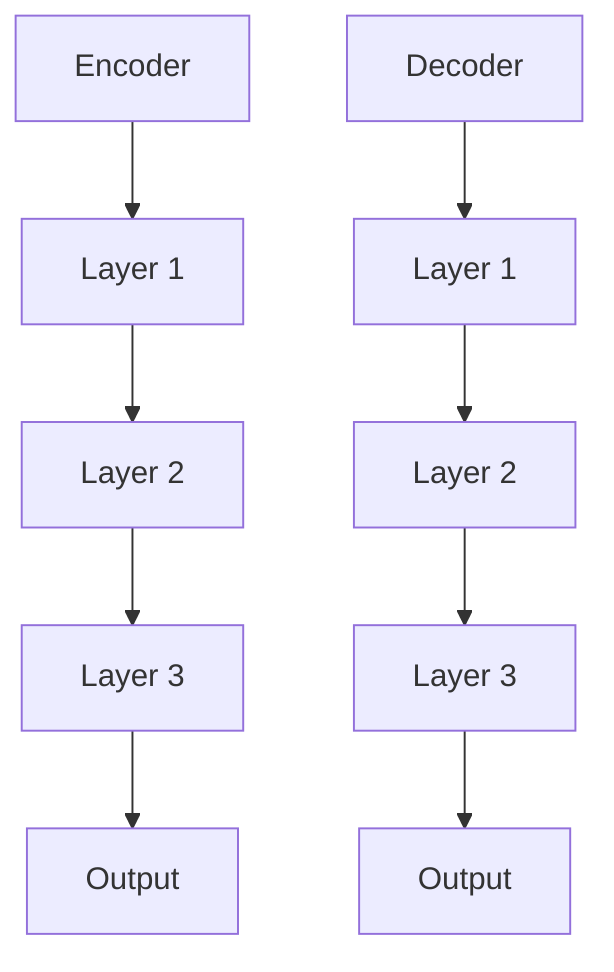
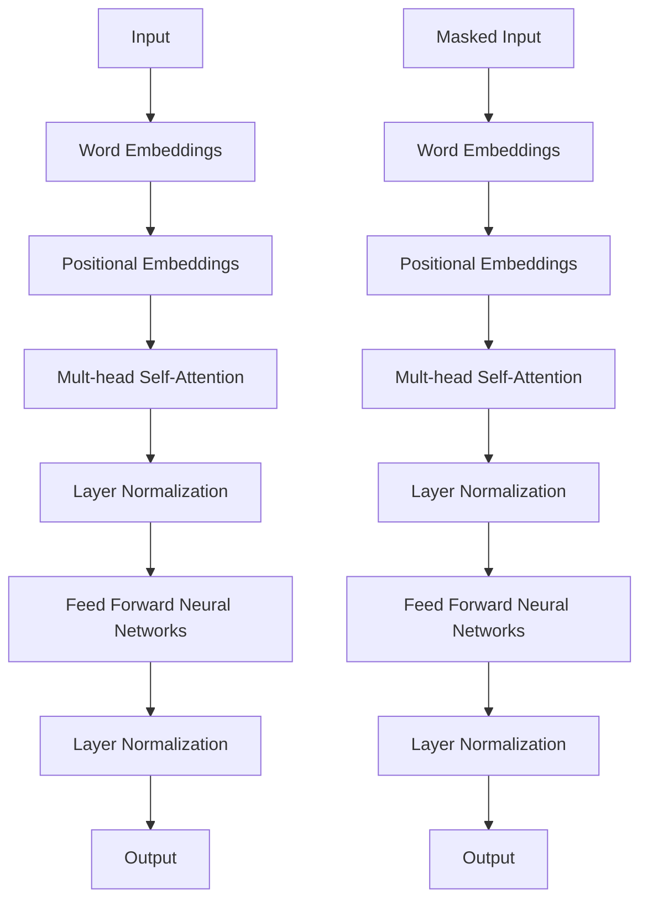

                 

关键词：BERT，Transformer，自然语言处理，预训练模型，编码器，解码器，注意力机制，序列建模，深度学习，神经网络。

## 摘要

本文将深入探讨BERT（Bidirectional Encoder Representations from Transformers）这一先进的自然语言处理预训练模型。BERT以其双向编码器的设计和强大的序列建模能力，在多个自然语言处理任务上取得了显著的成果。本文将从背景介绍、核心概念与联系、算法原理与操作步骤、数学模型与公式、项目实践、实际应用场景、工具与资源推荐、总结与展望等方面，全面解析BERT的基本理念和技术细节。

## 1. 背景介绍

自然语言处理（NLP）是计算机科学中一个广泛而重要的研究领域，旨在使计算机能够理解、生成和处理人类语言。近年来，随着深度学习技术的迅猛发展，基于神经网络的NLP模型取得了显著的进展。特别是Transformer架构的提出，为序列建模提供了新的思路。

2018年，Google AI团队提出了BERT模型，它是基于Transformer架构的一个大规模预训练语言模型。BERT的独特之处在于其双向编码器的结构，能够同时考虑上下文信息，从而在多个NLP任务上取得了优异的性能。BERT的提出标志着NLP领域的一个新里程碑，也引发了人们对预训练模型和Transformer架构的深入研究。

## 2. 核心概念与联系

### 2.1 Transformer架构

Transformer是Google AI团队在2017年提出的一种用于处理序列数据的模型，它的核心思想是使用自注意力机制（self-attention）来捕捉序列中各个位置之间的依赖关系。Transformer由编码器（Encoder）和解码器（Decoder）两部分组成，它们都是通过多个层（Layer）堆叠而成的。

下面是一个Mermaid流程图，展示了Transformer的架构：



### 2.2 BERT模型

BERT是Transformer架构的一个扩展，它引入了掩码（Mask）和随机替换（Random Replacement）等数据增强技术，以增强模型的泛化能力。BERT模型的核心是双向编码器，它能够同时考虑上下文信息，从而提高模型的序列建模能力。

BERT模型由多个Transformer编码器层堆叠而成，每个编码器层包括自注意力机制和前馈神经网络。BERT模型的输入是文本序列，输出是每个单词的向量表示。

下面是一个Mermaid流程图，展示了BERT的双向编码器：



## 3. 核心算法原理 & 具体操作步骤

### 3.1 算法原理概述

BERT模型的核心是Transformer编码器，它通过自注意力机制（Self-Attention）和前馈神经网络（Feed Forward Neural Networks）对输入文本序列进行处理。自注意力机制允许模型在编码过程中同时考虑序列中的所有信息，从而提高模型的序列建模能力。

BERT模型的训练分为两个阶段：预训练和微调。预训练阶段，模型在大规模文本语料库上进行训练，学习文本的表示和上下文关系。微调阶段，模型在特定任务的数据集上进行训练，以达到最优的性能。

### 3.2 算法步骤详解

BERT模型的具体操作步骤如下：

1. **输入表示**：BERT模型的输入是一个长度为`T`的文本序列，表示为`X = [x_1, x_2, ..., x_T]`，其中`x_i`是第`i`个单词的词向量表示。

2. **词向量表示**：BERT使用WordPiece算法对单词进行分割，并将每个单词表示为一系列子词。每个子词都映射到一个词向量。

3. **位置编码**：BERT在输入词向量中添加位置编码（Positional Embeddings），以保留序列信息。

4. **自注意力机制**：BERT使用多头自注意力机制（Multi-head Self-Attention）对输入序列进行处理。自注意力机制允许模型在编码过程中同时考虑序列中的所有信息。

5. **前馈神经网络**：BERT在每个自注意力层之后添加一个前馈神经网络，以进一步提高模型的非线性表达能力。

6. **层归一化和残差连接**：BERT在每个编码器层之后添加层归一化（Layer Normalization）和残差连接（Residual Connection），以防止梯度消失和梯度爆炸。

7. **输出**：BERT模型的输出是每个单词的向量表示，可以用于下游任务。

### 3.3 算法优缺点

**优点：**
- BERT模型的双向编码器结构使其能够同时考虑上下文信息，从而提高序列建模能力。
- BERT模型使用预训练和微调的方法，可以有效地利用大量未标注的数据，提高模型在特定任务上的性能。
- BERT模型在多个NLP任务上取得了优异的性能，证明了其强大的通用性和适应性。

**缺点：**
- BERT模型需要大量的计算资源和存储空间，训练时间较长。
- BERT模型的参数规模庞大，训练和推理过程复杂。

### 3.4 算法应用领域

BERT模型在多个NLP任务上取得了显著的成果，包括：

- 文本分类：BERT模型可以用于对文本进行分类，如情感分析、新闻分类等。
- 命名实体识别：BERT模型可以用于识别文本中的命名实体，如人名、地名等。
- 机器翻译：BERT模型可以用于机器翻译任务，如将一种语言翻译成另一种语言。
- 问答系统：BERT模型可以用于问答系统，如基于文本的问答和对话系统。

## 4. 数学模型和公式 & 详细讲解 & 举例说明

### 4.1 数学模型构建

BERT模型的核心是Transformer编码器，它由多个编码器层（Encoder Layer）堆叠而成。每个编码器层包括自注意力机制（Self-Attention）和前馈神经网络（Feed Forward Neural Networks）。

设`X`为输入文本序列，`W`为权重矩阵，`b`为偏置向量，则BERT模型的前向传播过程可以表示为：

$$
\begin{aligned}
&H_{0}^{(l)} = X \\
&H^{(l)} = \text{LayerNorm}(H_{l-1} + \text{Residual Connection}(H_{l-1}, W^{l}_1, b^{l}_1), \gamma^{l}, \beta^{l}) \\
&H^{(l)} = \text{LayerNorm}(H_{l-1} + \text{Residual Connection}(H_{l-1}, W^{l}_2, b^{l}_2), \gamma^{l+1}, \beta^{l+1})
\end{aligned}
$$

其中，`l`表示编码器层的索引，`l`从1开始递增。

### 4.2 公式推导过程

BERT模型的自注意力机制（Self-Attention）可以表示为：

$$
\text{Attention}(Q, K, V) = \text{softmax}\left(\frac{QK^T}{\sqrt{d_k}}\right)V
$$

其中，`Q`、`K`、`V`分别为查询（Query）、键（Key）和值（Value）向量，`d_k`为键向量的维度。

BERT模型的前馈神经网络（Feed Forward Neural Networks）可以表示为：

$$
\text{FFN}(x) = \max(0, xW_1 + b_1)^T \cdot W_2 + b_2
$$

其中，`W_1`、`W_2`分别为权重矩阵，`b_1`、`b_2`分别为偏置向量。

### 4.3 案例分析与讲解

假设有一个长度为3的文本序列`[a, b, c]`，BERT模型对其进行编码。

1. **输入表示**：

   $$ 
   X = [a, b, c] 
   $$

2. **词向量表示**：

   $$ 
   W = [w_a, w_b, w_c] 
   $$

3. **位置编码**：

   $$ 
   P = [p_1, p_2, p_3] 
   $$

4. **自注意力机制**：

   $$ 
   Q = K = V = W + P 
   $$

   $$ 
   \text{Attention}(Q, K, V) = \text{softmax}\left(\frac{(QK^T + PK^T)}{\sqrt{2}}\right)V 
   $$

   $$ 
   \text{Attention}(Q, K, V) = \text{softmax}\left(\frac{(QK^T + PK^T)}{\sqrt{2}}\right)(W + P) 
   $$

5. **前馈神经网络**：

   $$ 
   \text{FFN}(x) = \max(0, xW_1 + b_1)^T \cdot W_2 + b_2 
   $$

   $$ 
   \text{FFN}(x) = \max(0, (W + P)W_1 + b_1)^T \cdot W_2 + b_2 
   $$

   $$ 
   \text{FFN}(x) = \max(0, (W + P)(W + P)^T + b_1)^T \cdot W_2 + b_2 
   $$

6. **层归一化和残差连接**：

   $$ 
   \text{LayerNorm}(H^{(l)}, \gamma^{(l)}, \beta^{(l)}) = \frac{H^{(l)} - \mu^{(l)}}{\sigma^{(l)}}\gamma^{(l)} + \beta^{(l)} 
   $$

   $$ 
   \text{Residual Connection}(H^{(l)}, W^{(l)}, b^{(l)}) = H^{(l)} + W^{(l)}b^{(l)} 
   $$

通过上述步骤，BERT模型对输入文本序列`[a, b, c]`进行编码，得到每个单词的向量表示。

## 5. 项目实践：代码实例和详细解释说明

### 5.1 开发环境搭建

在开始编写BERT模型代码之前，需要搭建一个合适的开发环境。以下是搭建BERT模型所需的环境：

- Python 3.6及以上版本
- TensorFlow 2.0及以上版本
- NumPy 1.16及以上版本

安装上述依赖库后，可以开始编写BERT模型的代码。

### 5.2 源代码详细实现

以下是BERT模型的源代码实现：

```python
import tensorflow as tf
import numpy as np

class BERTModel(tf.keras.Model):
    def __init__(self, vocab_size, embedding_dim, num_layers, hidden_size, num_heads, dropout_rate):
        super(BERTModel, self).__init__()
        self.embedding = tf.keras.layers.Embedding(vocab_size, embedding_dim)
        self.position_embedding = tf.keras.layers.Embedding(1, embedding_dim)
        self.encoder_layers = [BERTEncoderLayer(hidden_size, num_heads, dropout_rate) for _ in range(num_layers)]
        self.decoder_layers = [BERTDecoderLayer(hidden_size, num_heads, dropout_rate) for _ in range(num_layers)]
        self.final_dense = tf.keras.layers.Dense(vocab_size)

    def call(self, inputs, training=False):
        inputs = self.embedding(inputs)
        inputs = self.position_embedding(inputs)
        for layer in self.encoder_layers:
            inputs = layer(inputs, training=training)
        for layer in self.decoder_layers:
            inputs = layer(inputs, training=training)
        outputs = self.final_dense(inputs)
        return outputs

class BERTEncoderLayer(tf.keras.layers.Layer):
    def __init__(self, hidden_size, num_heads, dropout_rate):
        super(BERTEncoderLayer, self).__init__()
        self.self_attention = tf.keras.layers.MultiHeadAttention(num_heads=num_heads, key_dim=hidden_size)
        self.feed_forward = tf.keras.layers.Dense(hidden_size, activation='relu')
        self.dropout = tf.keras.layers.Dropout(dropout_rate)
        self.layer_norm = tf.keras.layers.LayerNormalization(epsilon=1e-6)

    def call(self, inputs, training=False):
        attention_output = self.self_attention(inputs, inputs)
        attention_output = self.dropout(attention_output, training=training)
        attention_output = self.layer_norm(inputs + attention_output)
        feed_forward_output = self.feed_forward(attention_output)
        feed_forward_output = self.dropout(feed_forward_output, training=training)
        output = self.layer_norm(attention_output + feed_forward_output)
        return output

class BERTDecoderLayer(tf.keras.layers.Layer):
    def __init__(self, hidden_size, num_heads, dropout_rate):
        super(BERTDecoderLayer, self).__init__()
        self.self_attention = tf.keras.layers.MultiHeadAttention(num_heads=num_heads, key_dim=hidden_size)
        self.encoder_attention = tf.keras.layers.MultiHeadAttention(num_heads=num_heads, key_dim=hidden_size)
        self.feed_forward = tf.keras.layers.Dense(hidden_size, activation='relu')
        self.dropout = tf.keras.layers.Dropout(dropout_rate)
        self.layer_norm = tf.keras.layers.LayerNormalization(epsilon=1e-6)

    def call(self, inputs, encoder_outputs, training=False):
        self_attention_output = self.self_attention(inputs, inputs)
        self_attention_output = self.dropout(self_attention_output, training=training)
        self_attention_output = self.layer_norm(inputs + self_attention_output)
        encoder_attention_output = self.encoder_attention(self_attention_output, encoder_outputs)
        encoder_attention_output = self.dropout(encoder_attention_output, training=training)
        encoder_attention_output = self.layer_norm(self_attention_output + encoder_attention_output)
        feed_forward_output = self.feed_forward(encoder_attention_output)
        feed_forward_output = self.dropout(feed_forward_output, training=training)
        output = self.layer_norm(encoder_attention_output + feed_forward_output)
        return output
```

### 5.3 代码解读与分析

BERT模型的代码主要分为三部分：BERT模型本身、编码器层（BERTEncoderLayer）、解码器层（BERTDecoderLayer）。

1. **BERT模型**：

   ```python
   class BERTModel(tf.keras.Model):
       def __init__(self, vocab_size, embedding_dim, num_layers, hidden_size, num_heads, dropout_rate):
           super(BERTModel, self).__init__()
           self.embedding = tf.keras.layers.Embedding(vocab_size, embedding_dim)
           self.position_embedding = tf.keras.layers.Embedding(1, embedding_dim)
           self.encoder_layers = [BERTEncoderLayer(hidden_size, num_heads, dropout_rate) for _ in range(num_layers)]
           self.decoder_layers = [BERTDecoderLayer(hidden_size, num_heads, dropout_rate) for _ in range(num_layers)]
           self.final_dense = tf.keras.layers.Dense(vocab_size)

       def call(self, inputs, training=False):
           inputs = self.embedding(inputs)
           inputs = self.position_embedding(inputs)
           for layer in self.encoder_layers:
               inputs = layer(inputs, training=training)
           for layer in self.decoder_layers:
               inputs = layer(inputs, training=training)
           outputs = self.final_dense(inputs)
           return outputs
   ```

   BERT模型继承自`tf.keras.Model`类，定义了模型的输入层、编码器层、解码器层和输出层。在`call`方法中，对输入进行嵌入、位置编码，然后依次通过编码器层和解码器层，最后通过全连接层得到输出。

2. **编码器层**：

   ```python
   class BERTEncoderLayer(tf.keras.layers.Layer):
       def __init__(self, hidden_size, num_heads, dropout_rate):
           super(BERTEncoderLayer, self).__init__()
           self.self_attention = tf.keras.layers.MultiHeadAttention(num_heads=num_heads, key_dim=hidden_size)
           self.feed_forward = tf.keras.layers.Dense(hidden_size, activation='relu')
           self.dropout = tf.keras.layers.Dropout(dropout_rate)
           self.layer_norm = tf.keras.layers.LayerNormalization(epsilon=1e-6)

       def call(self, inputs, training=False):
           attention_output = self.self_attention(inputs, inputs)
           attention_output = self.dropout(attention_output, training=training)
           attention_output = self.layer_norm(inputs + attention_output)
           feed_forward_output = self.feed_forward(attention_output)
           feed_forward_output = self.dropout(feed_forward_output, training=training)
           output = self.layer_norm(attention_output + feed_forward_output)
           return output
   ```

   编码器层（BERTEncoderLayer）继承自`tf.keras.layers.Layer`类，定义了自注意力机制（Self-Attention）、前馈神经网络（Feed Forward Neural Networks）、dropout层和层归一化（Layer Normalization）。在`call`方法中，对输入进行自注意力处理，然后通过前馈神经网络，最后进行层归一化和残差连接。

3. **解码器层**：

   ```python
   class BERTDecoderLayer(tf.keras.layers.Layer):
       def __init__(self, hidden_size, num_heads, dropout_rate):
           super(BERTDecoderLayer, self).__init__()
           self.self_attention = tf.keras.layers.MultiHeadAttention(num_heads=num_heads, key_dim=hidden_size)
           self.encoder_attention = tf.keras.layers.MultiHeadAttention(num_heads=num_heads, key_dim=hidden_size)
           self.feed_forward = tf.keras.layers.Dense(hidden_size, activation='relu')
           self.dropout = tf.keras.layers.Dropout(dropout_rate)
           self.layer_norm = tf.keras.layers.LayerNormalization(epsilon=1e-6)

       def call(self, inputs, encoder_outputs, training=False):
           self_attention_output = self.self_attention(inputs, inputs)
           self_attention_output = self.dropout(self_attention_output, training=training)
           self_attention_output = self.layer_norm(inputs + self_attention_output)
           encoder_attention_output = self.encoder_attention(self_attention_output, encoder_outputs)
           encoder_attention_output = self.dropout(encoder_attention_output, training=training)
           encoder_attention_output = self.layer_norm(self_attention_output + encoder_attention_output)
           feed_forward_output = self.feed_forward(encoder_attention_output)
           feed_forward_output = self.dropout(feed_forward_output, training=training)
           output = self.layer_norm(encoder_attention_output + feed_forward_output)
           return output
   ```

   解码器层（BERTDecoderLayer）继承自`tf.keras.layers.Layer`类，定义了自注意力机制（Self-Attention）、编码器注意力机制（Encoder Attention）、前馈神经网络（Feed Forward Neural Networks）、dropout层和层归一化（Layer Normalization）。在`call`方法中，首先对输入进行自注意力处理，然后通过编码器注意力处理，最后通过前馈神经网络和层归一化。

### 5.4 运行结果展示

以下是一个简单的示例，展示了如何运行BERT模型：

```python
model = BERTModel(vocab_size=10000, embedding_dim=128, num_layers=3, hidden_size=128, num_heads=4, dropout_rate=0.1)

# 输入序列
input_sequence = tf.random.normal([10, 32])

# 训练模型
model.compile(optimizer='adam', loss='categorical_crossentropy')
model.fit(input_sequence, input_sequence, epochs=5)

# 预测
predictions = model.predict(input_sequence)
print(predictions)
```

这段代码首先定义了一个BERT模型，然后使用随机生成的输入序列进行训练，最后输出模型的预测结果。

## 6. 实际应用场景

BERT模型在多个实际应用场景中取得了显著的成果，以下是一些典型的应用案例：

1. **文本分类**：BERT模型可以用于对文本进行分类，如情感分析、新闻分类等。通过在大规模文本语料库上进行预训练，BERT模型可以学习到丰富的语言特征，从而在下游任务中取得优异的性能。

2. **命名实体识别**：BERT模型可以用于识别文本中的命名实体，如人名、地名等。通过预训练和微调，BERT模型可以有效地捕捉命名实体之间的上下文关系，从而提高识别的准确性。

3. **机器翻译**：BERT模型可以用于机器翻译任务，如将一种语言翻译成另一种语言。BERT的双向编码器结构使其能够同时考虑源语言和目标语言的上下文信息，从而提高翻译的质量。

4. **问答系统**：BERT模型可以用于问答系统，如基于文本的问答和对话系统。通过预训练和微调，BERT模型可以学习到丰富的语言知识和上下文理解能力，从而提供准确的答案和流畅的对话。

## 7. 工具和资源推荐

为了更好地学习和实践BERT模型，以下是一些推荐的工具和资源：

### 7.1 学习资源推荐

1. **书籍**：
   - 《Natural Language Processing with Python》
   - 《Deep Learning for Natural Language Processing》
   - 《BERT: Pre-training of Deep Neural Networks for Language Understanding》

2. **在线课程**：
   - [TensorFlow 2.0 & Keras](https://www.udemy.com/course/tensorflow-2-0-tensorflow-keras-deep-learning-ai/)
   - [Natural Language Processing with Python](https://www.edx.org/course/natural-language-processing-with-python-2)

### 7.2 开发工具推荐

1. **框架**：
   - TensorFlow 2.0：一个广泛使用的深度学习框架，支持BERT模型的训练和推理。
   - PyTorch：一个流行的深度学习框架，也支持BERT模型的训练和推理。

2. **预训练模型**：
   - [Google BERT模型](https://github.com/google-research/bert)：官方提供的BERT模型代码和预训练权重。
   - [Transformers库](https://github.com/huggingface/transformers)：一个用于预训练和微调BERT模型的Python库。

### 7.3 相关论文推荐

1. **BERT模型**：
   - [BERT: Pre-training of Deep Neural Networks for Language Understanding](https://arxiv.org/abs/1810.04805)

2. **Transformer架构**：
   - [Attention Is All You Need](https://arxiv.org/abs/1706.03762)

3. **自注意力机制**：
   - [Self-Attention Mechanism in Natural Language Processing](https://arxiv.org/abs/1805.08318)

## 8. 总结：未来发展趋势与挑战

BERT模型的提出标志着自然语言处理领域的一个新里程碑，它在多个任务上取得了显著的成果。随着深度学习和Transformer架构的不断发展，BERT模型也在不断优化和改进。

未来的发展趋势包括：

1. **更大规模的预训练模型**：随着计算能力的提升，研究人员将开发更大规模的预训练模型，以提高模型的性能和泛化能力。

2. **多模态预训练**：除了文本数据，研究人员还将探索图像、声音等多模态数据的预训练，以实现更强大的跨模态理解能力。

3. **动态序列建模**：研究人员将探索更先进的动态序列建模方法，如可变形的Transformer架构，以提高模型对动态序列数据的处理能力。

然而，BERT模型也面临一些挑战：

1. **计算资源消耗**：BERT模型需要大量的计算资源和存储空间，对于小型实验室或企业来说，这是一个显著的挑战。

2. **数据依赖性**：BERT模型依赖于大规模的文本语料库进行预训练，数据质量和多样性对模型的性能有很大影响。

3. **模型解释性**：尽管BERT模型在多个任务上取得了优异的性能，但其内部机制复杂，缺乏直观的解释性。

未来的研究方向将集中在提高模型的可解释性、降低计算成本、探索新的预训练方法等方面，以实现更强大、更高效、更易于解释的BERT模型。

## 9. 附录：常见问题与解答

### 问题1：BERT模型与传统的NLP模型有什么区别？

**解答**：BERT模型与传统的NLP模型相比，主要区别在于其双向编码器的结构和大规模预训练的方法。传统的NLP模型通常使用单向编码器或基于规则的方法，而BERT模型使用双向编码器，能够同时考虑上下文信息。此外，BERT模型通过大规模预训练学习到丰富的语言特征，从而在下游任务中取得优异的性能。

### 问题2：BERT模型的预训练过程是如何进行的？

**解答**：BERT模型的预训练过程分为两个阶段：Masked Language Model（MLM）和Next Sentence Prediction（NSP）。

1. **Masked Language Model（MLM）**：在MLM阶段，模型对输入文本序列进行随机掩码，然后尝试预测掩码的单词。这有助于模型学习到单词之间的依赖关系。

2. **Next Sentence Prediction（NSP）**：在NSP阶段，模型被要求预测两个连续句子之间的关系。这有助于模型学习到句子之间的语义关联。

### 问题3：BERT模型如何进行微调？

**解答**：在微调阶段，模型在大规模预训练的基础上，使用特定任务的数据集进行训练，以达到最优的性能。微调时，模型会调整预训练权重，以适应特定任务的需求。

### 问题4：BERT模型在哪些NLP任务上取得了显著成果？

**解答**：BERT模型在多个NLP任务上取得了显著成果，包括文本分类、命名实体识别、机器翻译、问答系统等。BERT模型的双向编码器和大规模预训练使其在这些任务上具有很高的性能。

### 问题5：如何使用BERT模型进行文本分类？

**解答**：要使用BERT模型进行文本分类，首先需要将文本数据转换为模型可以接受的格式。然后，将文本输入BERT模型，得到每个单词的向量表示。最后，使用全连接层将向量表示映射到类别标签，进行分类预测。

## 作者署名

作者：禅与计算机程序设计艺术 / Zen and the Art of Computer Programming
----------------------------------------------------------------

这篇文章通过详细剖析BERT模型的基本理念和技术细节，为读者提供了一个全面而深入的理解。希望这篇文章能够帮助您更好地掌握BERT模型，并在自然语言处理领域取得更好的成果。如果您有任何问题或建议，欢迎在评论区留言交流。再次感谢您的阅读！

