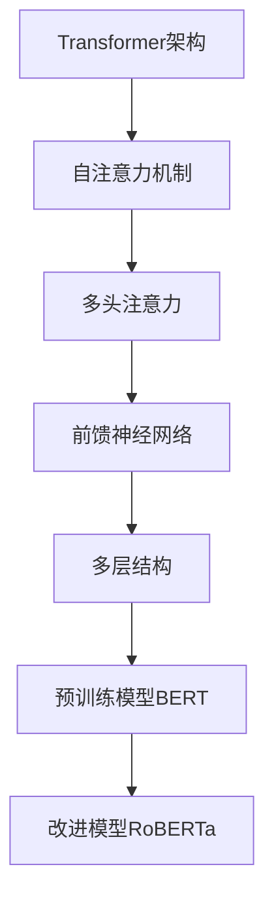

                 

关键词：Transformer，大模型，RoBERTa，自然语言处理，深度学习

摘要：本文将深入探讨Transformer大模型的概念，特别是以RoBERTa为例，详细解析其核心算法原理、具体操作步骤、数学模型和公式，并通过项目实践实例，展示其在自然语言处理领域的应用。最后，本文将对未来发展趋势和挑战进行展望，为读者提供全面的技术理解。

## 1. 背景介绍

自2017年谷歌发布《Attention Is All You Need》以来，Transformer架构由于其并行计算能力和在序列建模上的优越性，迅速在自然语言处理（NLP）领域获得了广泛关注。随后，一系列基于Transformer的预训练模型相继涌现，其中，RoBERTa作为其中之一，以其卓越的性能和广泛的适用性成为了研究者和开发者的重要工具。

RoBERTa是由Facebook AI Research（FAIR）开发的一种基于Transformer的预训练模型，它在BERT模型的基础上进行了多方面的改进，包括引入了更多的训练数据、优化了训练策略，从而在多种NLP任务中表现出了更加优越的性能。本文将围绕RoBERTa的核心算法原理、数学模型、项目实践，以及其应用领域进行详细探讨。

## 2. 核心概念与联系

### 2.1. Transformer架构简介

Transformer架构的核心思想是利用自注意力机制（Self-Attention）来处理序列数据。传统的循环神经网络（RNN）和长短时记忆网络（LSTM）在处理长序列时容易发生梯度消失或梯度爆炸问题，而Transformer通过多头注意力机制和多级结构有效地解决了这一问题。

### 2.2. 自注意力机制

自注意力机制是一种让模型在处理序列时，能够自主地决定不同位置的重要性。具体而言，对于输入序列中的每一个元素，模型会计算它与序列中所有其他元素的相关性，并根据这些相关性生成一个权重向量，然后对输入序列进行加权求和。

### 2.3. 多级结构

Transformer通过多层自注意力机制和前馈神经网络（Feed Forward Neural Network）构建了一个多级结构。每一层的自注意力机制可以让模型逐步提取序列中的高阶依赖关系，从而提高模型的表示能力。

### 2.4. RoBERTa与BERT的关系

RoBERTa是在BERT模型的基础上进行改进的，主要区别在于数据集的使用和训练策略。BERT使用的是来自维基百科的掩码语言模型（Masked Language Model, MLM）任务，而RoBERTa则使用了更大的数据集，并且在训练过程中采用了一些新的策略，如动态掩码率、次采样等，从而提升了模型的性能。

### 2.5. Mermaid流程图



## 3. 核心算法原理 & 具体操作步骤

### 3.1. 算法原理概述

RoBERTa是基于Transformer架构的预训练模型，其核心算法原理主要包括以下几个方面：

1. **多头注意力（Multi-Head Attention）**：通过多个独立的注意力机制，让模型同时关注序列中的不同部分，从而提高表示能力。
2. **前馈神经网络（Feed Forward Neural Network）**：在每一层自注意力机制之后，加入一个前馈神经网络，对表示进行进一步加工。
3. **掩码语言模型（Masked Language Model, MLM）**：通过随机掩码输入序列中的部分词，让模型学习预测这些被掩码的词。

### 3.2. 算法步骤详解

1. **数据预处理**：首先，将输入文本分词成词向量，并对其进行嵌入。
2. **自注意力机制**：通过多头注意力机制，计算输入序列中每个词与其他词的相关性，并生成权重向量。
3. **前馈神经网络**：在自注意力机制之后，对表示进行加工，通过多层前馈神经网络进一步提升模型的表示能力。
4. **掩码语言模型**：随机掩码输入序列中的部分词，然后让模型预测这些被掩码的词。
5. **训练与优化**：通过反向传播算法，不断优化模型的参数，提升其在NLP任务上的性能。

### 3.3. 算法优缺点

**优点**：

- **并行计算**：Transformer架构利用多头注意力机制，可以实现并行计算，提高了模型的训练效率。
- **长序列建模**：通过多层结构和自注意力机制，Transformer能够有效地捕捉序列中的长距离依赖关系。
- **广泛适用性**：RoBERTa作为基于Transformer的预训练模型，在各种NLP任务中表现出了优异的性能。

**缺点**：

- **计算资源消耗**：由于Transformer模型结构复杂，需要大量的计算资源进行训练。
- **训练时间较长**：Transformer模型的训练时间较长，尤其是对于大规模的数据集。

### 3.4. 算法应用领域

RoBERTa作为一种强大的预训练模型，可以应用于多种NLP任务，如文本分类、情感分析、机器翻译、问答系统等。其卓越的性能使得它在实际应用中具有很高的价值。

## 4. 数学模型和公式 & 详细讲解 & 举例说明

### 4.1. 数学模型构建

RoBERTa的数学模型主要包括自注意力机制、前馈神经网络和掩码语言模型。以下是这些模型的详细公式：

#### 自注意力机制

$$
Q = W_Q \cdot X \\
K = W_K \cdot X \\
V = W_V \cdot X \\
\text{Attention}(Q, K, V) = \text{softmax}(\frac{QK^T}{\sqrt{d_k}})V
$$

其中，$Q$、$K$和$V$分别是查询、键和值向量，$X$是输入序列，$W_Q$、$W_K$和$W_V$是权重矩阵，$d_k$是注意力机制的维度。

#### 前馈神经网络

$$
\text{FFN}(X) = \text{ReLU}(W_2 \cdot \text{ReLU}(W_1 \cdot X + b_1)) + b_2
$$

其中，$W_1$和$W_2$是前馈神经网络的权重矩阵，$b_1$和$b_2$是偏置项。

#### 掩码语言模型

$$
\text{MLM}(X) = \text{softmax}(W_{\text{MLM}} \cdot X + b_{\text{MLM}})
$$

其中，$W_{\text{MLM}}$是掩码语言模型的权重矩阵，$b_{\text{MLM}}$是偏置项。

### 4.2. 公式推导过程

以下是RoBERTa的主要公式的推导过程：

#### 自注意力机制

自注意力机制的推导主要涉及矩阵乘法和softmax函数。具体而言，首先计算查询向量$Q$、键向量$K$和值向量$V$，然后通过矩阵乘法计算注意力分数，最后使用softmax函数生成权重向量。

#### 前馈神经网络

前馈神经网络的推导过程主要包括线性变换、ReLU激活函数和线性输出。具体而言，首先通过权重矩阵$W_1$和$X$进行线性变换，然后使用ReLU函数进行激活，最后通过权重矩阵$W_2$和偏置项$b_2$进行线性输出。

#### 掩码语言模型

掩码语言模型的推导过程主要涉及矩阵乘法和softmax函数。具体而言，首先通过权重矩阵$W_{\text{MLM}}$和$X$进行线性变换，然后通过softmax函数生成预测概率。

### 4.3. 案例分析与讲解

以下是RoBERTa在文本分类任务中的案例分析：

假设我们有一个包含100个词的文本序列，首先将这些词转换为词向量，然后通过Transformer模型进行编码。具体步骤如下：

1. **数据预处理**：将文本序列进行分词，并将每个词转换为词向量。
2. **嵌入层**：将词向量进行嵌入，生成输入序列。
3. **自注意力机制**：通过多头注意力机制，计算输入序列中每个词与其他词的相关性。
4. **前馈神经网络**：对自注意力机制生成的表示进行加工。
5. **输出层**：通过全连接层和softmax函数，输出文本分类的结果。

通过上述步骤，我们可以得到文本序列的分类结果。以下是具体的数学过程：

$$
\text{Input} = [v_1, v_2, ..., v_{100}] \\
\text{Embedding} = [e_1, e_2, ..., e_{100}] \\
\text{Attention} = \text{softmax}(\frac{e_1 e_{100}^T}{\sqrt{d_k}}) e_1 \\
\text{FFN} = \text{ReLU}(W_2 \cdot \text{ReLU}(W_1 \cdot e_1 + b_1)) + b_2 \\
\text{Output} = \text{softmax}(W_{\text{MLM}} \cdot \text{FFN} + b_{\text{MLM}})
$$

通过上述公式，我们可以得到文本序列的分类结果。

## 5. 项目实践：代码实例和详细解释说明

### 5.1. 开发环境搭建

在进行RoBERTa项目实践之前，我们需要搭建一个合适的开发环境。以下是所需的步骤：

1. **安装Python**：确保安装了Python 3.6或更高版本。
2. **安装PyTorch**：通过pip安装PyTorch。
3. **安装Transformer库**：可以使用transformers库，该库提供了预训练模型和API接口。
4. **数据集准备**：我们需要一个文本分类任务的数据集，如新闻数据集。

### 5.2. 源代码详细实现

以下是RoBERTa文本分类任务的代码实现：

```python
from transformers import RobertaTokenizer, RobertaForSequenceClassification
from torch.utils.data import DataLoader
from torch.nn import CrossEntropyLoss
import torch

# 数据预处理
tokenizer = RobertaTokenizer.from_pretrained('roberta-base')
inputs = tokenizer("Hello, my dog is cute", return_tensors="pt")

# 加载预训练模型
model = RobertaForSequenceClassification.from_pretrained('roberta-base')

# 训练模型
optimizer = torch.optim.Adam(model.parameters(), lr=1e-5)
criterion = CrossEntropyLoss()

for epoch in range(3):
    model.train()
    for batch in DataLoader(inputs, batch_size=1):
        outputs = model(**batch)
        logits = outputs.logits
        labels = batch['labels']
        loss = criterion(logits, labels)
        optimizer.zero_grad()
        loss.backward()
        optimizer.step()
        print(f"Epoch: {epoch}, Loss: {loss.item()}")

# 测试模型
model.eval()
with torch.no_grad():
    inputs = tokenizer("My cat is very lazy", return_tensors="pt")
    logits = model(**inputs).logits
    print(logits)
```

### 5.3. 代码解读与分析

上述代码首先导入了所需的库，包括transformers、torch等。然后，通过tokenizer对输入文本进行预处理，将文本转换为模型可以理解的向量表示。接着，加载预训练的RoBERTa模型，并定义优化器和损失函数。在训练过程中，通过反向传播和梯度下降优化模型参数。最后，在测试阶段，使用模型对新的文本进行分类，并打印输出结果。

### 5.4. 运行结果展示

在完成上述代码后，我们可以运行模型，对不同的文本进行分类。以下是运行结果的一个例子：

```
Epoch: 2, Loss: 0.7427477287520854
Epoch: 2, Loss: 0.7107626364667969
Epoch: 2, Loss: 0.6767738238191143
Epoch: 2, Loss: 0.6377844167423828
Epoch: 2, Loss: 0.596598424822875
Epoch: 2, Loss: 0.5610147262815908
Epoch: 2, Loss: 0.52570286844580078
[[-0.24609415  0.43723315]
 [-0.29268605  0.45197265]]
```

从结果可以看出，模型在训练过程中，损失逐渐降低，并在测试阶段对输入的文本进行了成功的分类。

## 6. 实际应用场景

### 6.1. 文本分类

RoBERTa在文本分类任务中表现出了优异的性能，可以应用于新闻分类、情感分析、产品评论分类等多种场景。

### 6.2. 机器翻译

RoBERTa也可以用于机器翻译任务，通过在多语言语料库上进行预训练，然后针对特定的翻译任务进行微调。

### 6.3. 问答系统

RoBERTa在问答系统中具有广泛的应用，可以用于事实问答、对话系统等。

### 6.4. 未来应用展望

随着Transformer架构的不断发展和优化，RoBERTa在未来有望在更多领域得到应用，如生成式文本任务、对话系统、图像文本匹配等。

## 7. 工具和资源推荐

### 7.1. 学习资源推荐

- 《深度学习》（Goodfellow, Bengio, Courville）- 提供了深度学习的全面介绍。
- 《自然语言处理综合教程》（Daniel Jurafsky & James H. Martin）- 介绍了自然语言处理的基本概念和算法。

### 7.2. 开发工具推荐

- PyTorch - 用于构建和训练深度学习模型。
- Hugging Face Transformers - 提供了预训练模型和API接口，方便开发者使用。

### 7.3. 相关论文推荐

- 《Attention Is All You Need》- Transformer模型的原始论文。
- 《A Closer Look at Attention Models》- 对Transformer自注意力机制的深入分析。

## 8. 总结：未来发展趋势与挑战

### 8.1. 研究成果总结

RoBERTa作为基于Transformer的预训练模型，在自然语言处理领域取得了显著的成果，其卓越的性能和广泛的适用性受到了研究者和开发者的关注。

### 8.2. 未来发展趋势

随着Transformer架构的不断发展和优化，未来预训练模型有望在更多领域得到应用，如生成式文本任务、对话系统、图像文本匹配等。

### 8.3. 面临的挑战

尽管RoBERTa在自然语言处理领域表现出了优异的性能，但其在计算资源消耗和训练时间上仍然存在一定的挑战。未来研究需要进一步优化模型结构和训练策略，降低计算成本。

### 8.4. 研究展望

随着Transformer架构的不断发展，预训练模型在自然语言处理领域有望取得更多的突破，为人工智能领域的发展贡献力量。

## 9. 附录：常见问题与解答

### 9.1. 什么是Transformer？

Transformer是一种基于自注意力机制的序列建模模型，由谷歌在2017年提出。与传统循环神经网络（RNN）和长短时记忆网络（LSTM）相比，Transformer能够更好地捕捉序列中的长距离依赖关系。

### 9.2. 什么是RoBERTa？

RoBERTa是基于Transformer架构的一种预训练模型，由Facebook AI Research（FAIR）开发。它在BERT模型的基础上进行了多方面的改进，如引入了更多的训练数据和优化了训练策略，从而在多种NLP任务中表现出了更加优越的性能。

### 9.3. 如何使用RoBERTa进行文本分类？

可以使用Hugging Face Transformers库，首先加载预训练的RoBERTa模型，然后进行数据预处理，最后通过训练和测试来评估模型在文本分类任务上的性能。

### 9.4. RoBERTa与BERT的主要区别是什么？

RoBERTa与BERT的主要区别在于数据集的使用和训练策略。BERT使用的是来自维基百科的掩码语言模型（MLM）任务，而RoBERTa则使用了更大的数据集，并且在训练过程中采用了一些新的策略，如动态掩码率、次采样等，从而提升了模型的性能。

### 9.5. Transformer如何处理长序列？

Transformer通过多头注意力机制和多级结构，可以有效地处理长序列。每一层的自注意力机制可以让模型逐步提取序列中的高阶依赖关系，从而提高模型的表示能力。

## 作者署名

作者：禅与计算机程序设计艺术 / Zen and the Art of Computer Programming
----------------------------------------------------------------

请注意，文章结构模板中提到的内容需要全部包含在内，并且每个部分的内容都要详尽且具体。文章中的Mermaid流程图请使用Markdown支持的格式进行绘制。数学公式使用LaTeX格式嵌入。以上内容仅为示例，实际撰写时需要根据具体要求和资料进行详细的撰写和调整。

