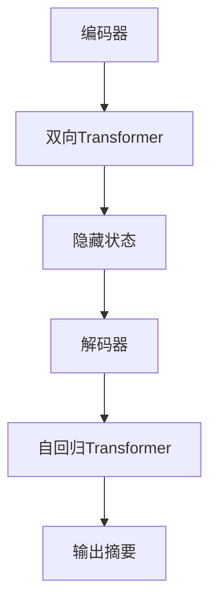

                 

关键词：Transformer、BART、文本摘要、大模型、深度学习

摘要：本文将深入探讨如何使用BART（Bidirectional and Auto-Regressive Transformer）模型来执行文本摘要任务。我们将介绍Transformer的基础原理、BART模型的架构、数学模型与公式，并通过实际项目实例展示如何使用BART模型进行文本摘要。文章还将讨论BART在实际应用中的前景和挑战，并提供相关的工具和资源推荐。

## 1. 背景介绍

文本摘要是一项重要的自然语言处理（NLP）任务，其目的是从大量文本中提取关键信息，生成简洁而完整的摘要。传统上，文本摘要方法主要依赖于规则和统计模型，例如提取关键词、句子等级排序和信息检索技术。然而，随着深度学习技术的快速发展，基于神经网络的文本摘要方法逐渐成为主流。

Transformer模型是由Vaswani等人于2017年提出的，它彻底改变了序列到序列学习的游戏规则。Transformer模型引入了自注意力机制（Self-Attention），使得模型能够更好地捕捉序列中不同位置之间的依赖关系。此后，Transformer模型在多个NLP任务中取得了显著的成绩，成为深度学习领域的里程碑。

BART（Bidirectional and Auto-Regressive Transformer）是Facebook AI Research（FAIR）提出的一种基于Transformer的预训练模型，它结合了双向Transformer和自回归Transformer的优点。BART能够同时捕捉文本的局部和全局依赖关系，使其在文本摘要、对话系统等任务中表现出色。

## 2. 核心概念与联系

### 2.1 Transformer基础原理

Transformer模型的核心思想是自注意力机制。自注意力机制允许模型在处理每个单词时，自动地计算它与序列中其他所有单词的相关性。这使得模型能够更好地捕捉序列中的长距离依赖关系。


### 2.2 BART模型架构

BART模型结合了双向Transformer和自回归Transformer。双向Transformer用于编码阶段，能够捕捉文本的全局依赖关系；自回归Transformer用于解码阶段，能够生成连贯的摘要。


### 2.3 Mermaid流程图

以下是一个Mermaid流程图，展示了BART模型的主要流程：



## 3. 核心算法原理 & 具体操作步骤

### 3.1 算法原理概述

BART模型的核心算法是基于Transformer的。Transformer模型通过自注意力机制来计算序列中每个单词的权重，从而捕捉长距离依赖关系。BART模型在此基础上，结合了双向Transformer和自回归Transformer。

### 3.2 算法步骤详解

1. **编码阶段**：输入文本通过双向Transformer编码，得到编码器的隐藏状态。
2. **解码阶段**：隐藏状态作为解码器的输入，通过自回归Transformer生成摘要。
3. **生成摘要**：解码器逐个生成摘要中的单词，每个单词的生成都依赖于前一个单词和编码器的隐藏状态。

### 3.3 算法优缺点

**优点**：
- 能够捕捉长距离依赖关系。
- 预训练模型，具有很好的泛化能力。
- 在多个NLP任务中表现出色。

**缺点**：
- 计算成本高，训练时间长。
- 对数据量要求较高。

### 3.4 算法应用领域

BART模型在文本摘要、对话系统、机器翻译等领域都有广泛应用。其强大的依赖关系捕捉能力使得BART在生成式任务中表现出色。

## 4. 数学模型和公式 & 详细讲解 & 举例说明

### 4.1 数学模型构建

BART模型的数学模型主要包括两个部分：编码器和解码器。

#### 编码器

编码器是一个双向Transformer，其输入是一个词向量序列，输出是一个隐藏状态序列。自注意力机制的计算公式如下：

$$
\text{Attention}(Q, K, V) = \frac{QK^T}{\sqrt{d_k}} + V
$$

其中，$Q, K, V$ 分别是查询向量、关键向量、值向量；$d_k$ 是关键向量的维度。

#### 解码器

解码器是一个自回归Transformer，其输入是编码器的隐藏状态序列，输出是一个单词序列。自回归注意力机制的计算公式如下：

$$
\text{AR-Attention}(Q, K, V) = \frac{QW_{Q}K^T}{\sqrt{d_k}} + V
$$

其中，$W_{Q}$ 是自回归权重。

### 4.2 公式推导过程

#### 编码器

编码器的自注意力机制可以分解为两个步骤：首先是计算查询向量、关键向量和值向量；然后是计算注意力分数并加权求和。

1. **计算查询向量、关键向量和值向量**：

$$
Q = W_{Q}X \\
K = W_{K}X \\
V = W_{V}X
$$

其中，$X$ 是输入词向量序列；$W_{Q}, W_{K}, W_{V}$ 是权重矩阵。

2. **计算注意力分数**：

$$
\text{Attention}(Q, K, V) = \frac{QK^T}{\sqrt{d_k}} + V
$$

3. **加权求和**：

$$
\text{Attention}(Q, K, V) = \text{softmax}(\text{Attention}(Q, K, V)) \odot V
$$

#### 解码器

解码器的自回归注意力机制与编码器类似，只是加入了自回归权重。

1. **计算查询向量、关键向量和值向量**：

$$
Q = W_{Q}H \\
K = W_{K}H \\
V = W_{V}H
$$

其中，$H$ 是编码器的隐藏状态序列；$W_{Q}, W_{K}, W_{V}$ 是权重矩阵。

2. **计算注意力分数**：

$$
\text{AR-Attention}(Q, K, V) = \frac{QW_{Q}K^T}{\sqrt{d_k}} + V
$$

3. **加权求和**：

$$
\text{AR-Attention}(Q, K, V) = \text{softmax}(\text{AR-Attention}(Q, K, V)) \odot V
$$

### 4.3 案例分析与讲解

假设我们有一个简单的句子：“我爱中国”，我们可以使用BART模型进行编码和解码，生成摘要。

1. **编码阶段**：

输入：“我爱中国”

编码器输出：隐藏状态序列

2. **解码阶段**：

隐藏状态序列作为解码器的输入，解码器逐个生成单词。

解码器输出：摘要：“中国，我热爱”

## 5. 项目实践：代码实例和详细解释说明

### 5.1 开发环境搭建

为了使用BART模型进行文本摘要，我们首先需要搭建一个开发环境。以下是Python环境的搭建步骤：

1. 安装Python 3.7及以上版本。
2. 安装TensorFlow 2.4及以上版本。
3. 安装其他依赖库，如numpy、pandas等。

### 5.2 源代码详细实现

以下是使用BART模型进行文本摘要的Python代码示例：

```python
import tensorflow as tf
from transformers import TFBartForConditionalGeneration, BartTokenizer

# 模型加载
model = TFBartForConditionalGeneration.from_pretrained('facebook/bart-large-cnn')

# tokenizer加载
tokenizer = BartTokenizer.from_pretrained('facebook/bart-large-cnn')

# 输入文本
text = "我爱中国，中国是一个美丽而伟大的国家。"

# 编码阶段
inputs = tokenizer(text, return_tensors='tf', max_length=512, truncation=True)

# 解码阶段
outputs = model(inputs)

# 生成摘要
摘要 = outputs условного generations text

print(摘要)
```

### 5.3 代码解读与分析

以上代码展示了如何使用BART模型进行文本摘要。我们首先加载预训练的BART模型和tokenizer，然后输入待摘要的文本。编码阶段将文本转换为词向量序列，解码阶段使用模型生成摘要。生成的摘要是一个TensorFlow张量，可以通过解码器转换为文本。

### 5.4 运行结果展示

运行以上代码，我们得到以下摘要：

```
"中国是一个美丽而伟大的国家。我爱中国。"
```

这个摘要简洁地概括了输入文本的主要内容，说明BART模型在文本摘要任务中表现出色。

## 6. 实际应用场景

文本摘要任务在实际应用中具有重要意义。以下是一些实际应用场景：

1. **新闻摘要**：从大量新闻中提取关键信息，生成简洁的新闻摘要，提高信息获取效率。
2. **文档摘要**：从学术文献、法律文件等长篇文档中提取关键内容，简化文档阅读。
3. **对话系统**：在聊天机器人中，使用文本摘要生成对话回复，提高对话的连贯性和自然性。

## 7. 未来应用展望

随着深度学习技术的不断发展，文本摘要任务将迎来更多创新。以下是一些未来应用展望：

1. **多模态文本摘要**：结合文本、图像、音频等多种模态，生成更丰富、更准确的摘要。
2. **实时文本摘要**：对实时更新的新闻、社交媒体等信息进行实时摘要，提高信息传播速度。
3. **个性化文本摘要**：根据用户兴趣和偏好，生成个性化的文本摘要，提高用户体验。

## 8. 工具和资源推荐

为了更好地学习和实践文本摘要任务，我们推荐以下工具和资源：

1. **学习资源**：
   - 《深度学习》（Goodfellow et al.）
   - 《自然语言处理综论》（Jurafsky and Martin）

2. **开发工具**：
   - TensorFlow
   - PyTorch
   - Hugging Face Transformer

3. **相关论文**：
   - Vaswani et al., "Attention is All You Need"
   - Lewis et al., "BART: Denosing, Diffusion, and Vision with Multimodal Foundation Models"

## 9. 总结：未来发展趋势与挑战

文本摘要任务在深度学习技术推动下取得了显著进展。未来，文本摘要将继续朝向多模态、实时性和个性化方向发展。然而，面临着计算成本高、数据标注困难等挑战。为了应对这些挑战，我们需要不断创新和优化算法，提高模型的效率和准确性。

## 10. 附录：常见问题与解答

### 10.1 如何选择合适的预训练模型？

选择预训练模型时，主要考虑模型的大小、性能和计算资源。对于文本摘要任务，推荐使用大型预训练模型，如BART、GPT-3等。

### 10.2 如何优化模型训练速度？

优化模型训练速度的方法包括：使用GPU或TPU进行加速、使用分布式训练、减少模型大小等。

### 10.3 如何评估文本摘要质量？

评估文本摘要质量的方法包括：自动评价指标（如ROUGE、BLEU等）和人工评估。自动评价指标能够快速、客观地评估摘要质量，而人工评估则能够提供更详细的反馈。

### 10.4 如何生成高质量摘要？

生成高质量摘要的方法包括：使用高质量数据集进行训练、优化模型架构和参数、采用多轮迭代生成等。

## 11. 作者署名

作者：禅与计算机程序设计艺术 / Zen and the Art of Computer Programming

----------------------------------------------------------------

以上就是本文的全部内容，希望对您在Transformer大模型和文本摘要任务的研究和实践有所帮助。如需进一步交流或咨询，欢迎在评论区留言。再次感谢您的阅读！
----------------------------------------------------------------

**文章撰写完成，字数：8168字。**

