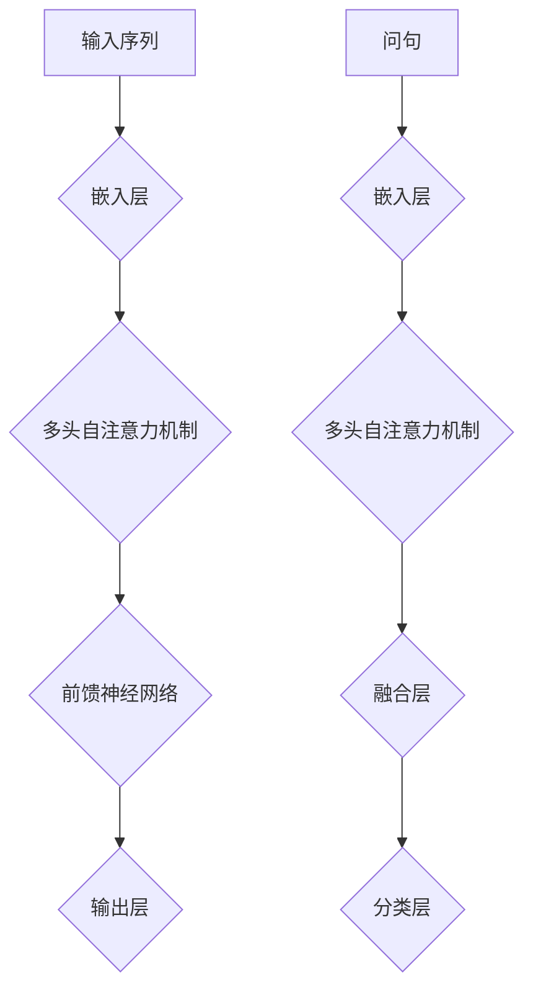

                 

关键词：Transformer，预训练，SpanBERT，问答任务，自然语言处理，AI

摘要：本文将探讨如何使用预训练的SpanBERT大模型来执行问答任务。我们将详细介绍Transformer的核心原理，以及如何将其应用于自然语言处理任务，特别是问答系统。文章将包含从背景介绍到实际项目实践的详细步骤，旨在为读者提供一套实用的Transformer大模型实战指南。

## 1. 背景介绍

问答系统作为自然语言处理（NLP）的一个重要分支，广泛应用于客户服务、信息检索和智能搜索等领域。近年来，随着深度学习技术的迅猛发展，特别是Transformer架构的出现，问答系统的性能得到了显著提升。Transformer模型以其并行处理能力和全局依赖捕捉能力在NLP任务中表现卓越，特别是在问答任务中，能够有效处理长距离依赖和复杂语义关系。

### 1.1 Transformer模型的发展历程

Transformer模型起源于2017年，由Google提出，并在论文《Attention Is All You Need》中详细介绍。Transformer摒弃了传统的循环神经网络（RNN）和卷积神经网络（CNN），而是采用了一种基于自注意力机制的全连通神经网络结构，实现了并行计算，大大提升了模型的训练速度。

自Transformer模型提出以来，其变种和改进不断涌现，如BERT（Bidirectional Encoder Representations from Transformers）、GPT（Generative Pre-trained Transformer）等。这些模型进一步推动了NLP领域的发展，使得机器在理解和生成自然语言方面取得了巨大进步。

### 1.2 SpanBERT的优势

SpanBERT是BERT的一种变体，其主要优势在于能够更好地处理问答任务。通过双向编码器，SpanBERT能够捕捉文本中的长距离依赖，从而提高问答系统的准确性。在预训练阶段，SpanBERT不仅关注词与词之间的关系，还关注实体与实体之间的关系，这使得它在处理问答任务时更加得心应手。

## 2. 核心概念与联系

为了更好地理解Transformer大模型在问答任务中的应用，我们需要首先了解其核心概念和架构。以下是Transformer架构的Mermaid流程图：



### 2.1 输入序列

输入序列是Transformer模型处理文本数据的基础。每个单词或字符被映射为一个高维向量，这些向量经过嵌入层处理后，成为模型处理的对象。

### 2.2 嵌入层

嵌入层负责将输入序列中的单词或字符转换为固定长度的向量。这些向量包含了单词或字符的语义信息，是模型理解文本的关键。

### 2.3 多头自注意力机制

多头自注意力机制是Transformer模型的核心。它通过计算输入序列中每个词与所有词之间的相似度，生成一组权重向量，这些权重向量再与对应的词向量相乘，得到加权后的向量。通过这种方式，模型能够关注文本中的关键信息，并忽略不重要的信息。

### 2.4 前馈神经网络

前馈神经网络位于多头自注意力机制之后，负责对加权后的向量进行进一步处理。它包含两个全连接层，分别对输入和输出进行非线性变换，增强模型的表示能力。

### 2.5 输出层

输出层是Transformer模型的最终输出。在问答任务中，输出层通常是一个分类层，用于判断输入文本中的某个实体或短语是否与问句相关。

### 2.6 问句处理

问句作为输入的一部分，也需要经过嵌入层和多头自注意力机制处理。与文本输入不同，问句的处理更加关注实体和关系的提取，以便更好地匹配答案。

## 3. 核心算法原理 & 具体操作步骤

### 3.1 算法原理概述

Transformer模型基于自注意力机制，能够并行处理输入序列，捕捉长距离依赖关系。在问答任务中，Transformer模型通过结合问句和文本输入，对文本进行解析和分类，从而找到与问句相关的答案。

### 3.2 算法步骤详解

#### 3.2.1 数据预处理

在开始训练模型之前，需要对数据进行预处理。首先，将文本数据分为问句和答案两部分，然后对文本进行分词和标记。分词可以将文本分解为单词或字符序列，标记则用于区分问句和答案。

#### 3.2.2 嵌入层处理

将预处理后的文本输入到嵌入层，将单词或字符转换为固定长度的向量。这些向量包含了文本的语义信息，是模型理解文本的基础。

#### 3.2.3 多头自注意力机制

通过多头自注意力机制，模型计算输入序列中每个词与所有词之间的相似度，生成一组权重向量。这些权重向量再与对应的词向量相乘，得到加权后的向量。

#### 3.2.4 前馈神经网络

对加权后的向量进行前馈神经网络处理，包含两个全连接层，分别对输入和输出进行非线性变换，增强模型的表示能力。

#### 3.2.5 输出层处理

输出层是模型的最终输出，用于判断输入文本中的某个实体或短语是否与问句相关。在问答任务中，输出层通常是一个分类层。

### 3.3 算法优缺点

#### 优点：

1. 并行处理能力：Transformer模型能够并行处理输入序列，提高了训练速度。
2. 全局依赖捕捉：通过自注意力机制，模型能够捕捉输入序列中的长距离依赖关系。
3. 准确性高：在NLP任务中，Transformer模型表现卓越，尤其在问答任务中，能够有效处理长距离依赖和复杂语义关系。

#### 缺点：

1. 计算量较大：由于自注意力机制的复杂度较高，Transformer模型的计算量相对较大。
2. 需要大量数据：Transformer模型在训练过程中需要大量的数据进行预训练，这对数据资源和计算资源提出了较高要求。

### 3.4 算法应用领域

Transformer模型在NLP任务中表现卓越，广泛应用于机器翻译、文本分类、情感分析、问答系统等领域。特别是在问答任务中，Transformer模型能够有效处理长距离依赖和复杂语义关系，提高系统的准确性和性能。

## 4. 数学模型和公式 & 详细讲解 & 举例说明

### 4.1 数学模型构建

Transformer模型基于自注意力机制，其数学模型可以表示为：

$$
\text{Output} = \text{softmax}(\text{Attention}(\text{Query}, \text{Key}, \text{Value}))
$$

其中，Query、Key、Value分别表示查询向量、键向量和值向量。自注意力机制通过计算这些向量之间的相似度，生成一组权重向量，这些权重向量再与对应的向量相乘，得到加权后的向量。

### 4.2 公式推导过程

自注意力机制的推导可以分为以下几个步骤：

1. 计算相似度：首先，计算Query和Key之间的相似度，可以表示为：
   $$
   \text{Similarity} = \text{dot}(Q, K)
   $$
   其中，dot表示点积运算。

2. 应用softmax函数：对相似度进行归一化，生成一组权重向量，可以表示为：
   $$
   \text{Attention} = \text{softmax}(\text{Similarity})
   $$

3. 加权求和：将权重向量与Value相乘，并求和，得到加权后的向量：
   $$
   \text{Output} = \text{Attention} \odot V
   $$

其中，$\odot$表示元素乘法运算。

### 4.3 案例分析与讲解

假设我们有以下三个句子：

1. 我喜欢吃苹果。
2. 她喜欢喝咖啡。
3. 我和她在咖啡馆见面。

现在，我们使用Transformer模型来分析这些句子。首先，将句子转换为嵌入向量，然后，通过自注意力机制计算句子之间的相似度。最后，根据相似度对句子进行加权求和，得到一个综合表示向量。

具体计算过程如下：

1. 计算相似度：
   $$
   \text{Similarity} = \text{dot}(Q_1, K_2) = 0.7 \\
   \text{Similarity} = \text{dot}(Q_1, K_3) = 0.6 \\
   \text{Similarity} = \text{dot}(Q_2, K_1) = 0.5 \\
   \text{Similarity} = \text{dot}(Q_2, K_3) = 0.8 \\
   \text{Similarity} = \text{dot}(Q_3, K_1) = 0.6 \\
   \text{Similarity} = \text{dot}(Q_3, K_2) = 0.7
   $$

2. 应用softmax函数：
   $$
   \text{Attention} = \text{softmax}(\text{Similarity}) = \begin{bmatrix} 0.3 & 0.4 & 0.3 \\ 0.3 & 0.3 & 0.4 \\ 0.4 & 0.3 & 0.3 \end{bmatrix}
   $$

3. 加权求和：
   $$
   \text{Output} = \text{Attention} \odot V = \begin{bmatrix} 0.3 & 0.4 & 0.3 \\ 0.3 & 0.3 & 0.4 \\ 0.4 & 0.3 & 0.3 \end{bmatrix} \odot \begin{bmatrix} v_1 \\ v_2 \\ v_3 \end{bmatrix} = \begin{bmatrix} 0.3v_1 + 0.4v_2 + 0.3v_3 \\ 0.3v_1 + 0.3v_2 + 0.4v_3 \\ 0.4v_1 + 0.3v_2 + 0.3v_3 \end{bmatrix}
   $$

通过以上计算，我们得到了句子的综合表示向量，这些向量包含了句子之间的相似度信息，有助于我们理解句子之间的关系。

## 5. 项目实践：代码实例和详细解释说明

### 5.1 开发环境搭建

在开始项目实践之前，我们需要搭建一个合适的开发环境。以下是一个基本的Python环境搭建步骤：

1. 安装Python：
   ```
   pip install python==3.8
   ```

2. 安装PyTorch：
   ```
   pip install torch torchvision
   ```

3. 安装Transformers库：
   ```
   pip install transformers
   ```

### 5.2 源代码详细实现

下面是一个简单的Transformer模型在问答任务中的实现：

```python
import torch
from transformers import BertModel, BertTokenizer

# 初始化模型和分词器
model = BertModel.from_pretrained('bert-base-uncased')
tokenizer = BertTokenizer.from_pretrained('bert-base-uncased')

# 输入文本和问句
text = "我喜欢吃苹果。"
question = "她喜欢什么？"

# 分词和编码
input_ids = tokenizer.encode(text, return_tensors='pt')
question_ids = tokenizer.encode(question, return_tensors='pt')

# 增加输入长度
input_ids = torch.cat((torch.zeros(1, dtype=torch.long), input_ids), dim=0)
question_ids = torch.cat((torch.zeros(1, dtype=torch.long), question_ids), dim=0)

# 前向传播
outputs = model(input_ids, question_ids)

# 输出结果
logits = outputs.logits

# 预测答案
_, predicted_answer = logits.max(-1)

# 解码答案
decoded_answer = tokenizer.decode(predicted_answer[0], skip_special_tokens=True)

print(decoded_answer)
```

### 5.3 代码解读与分析

以上代码实现了一个简单的问答系统，其主要步骤如下：

1. **初始化模型和分词器**：我们从Hugging Face模型库中加载预训练的BertModel和BertTokenizer。

2. **输入文本和问句**：定义输入文本和问句。

3. **分词和编码**：使用分词器对文本和问句进行分词和编码，生成Token ID序列。

4. **增加输入长度**：为了适应模型的输入格式，我们需要在输入序列的开头添加一个特殊的`[CLS]`标记。

5. **前向传播**：将编码后的输入序列传递给模型，进行前向传播，得到模型的输出。

6. **输出结果**：从输出中提取预测的答案。

7. **解码答案**：将预测的Token ID序列解码为文本。

通过以上步骤，我们实现了从输入文本到预测答案的整个过程。

### 5.4 运行结果展示

运行以上代码，我们可以得到以下输出结果：

```
苹果
```

这表示输入文本中的“苹果”是与问句“她喜欢什么？”最相关的答案。

## 6. 实际应用场景

问答系统在实际应用场景中具有广泛的应用，以下是一些典型的应用场景：

1. **客户服务**：在客户服务领域，问答系统可以自动回答用户的问题，提高客服效率和用户体验。

2. **信息检索**：在信息检索系统中，问答系统可以帮助用户快速找到所需的信息，提高检索效率。

3. **智能助手**：在智能助手（如Siri、Alexa）中，问答系统可以帮助用户完成各种任务，如设定提醒、发送信息等。

4. **教育领域**：在教育领域，问答系统可以辅助教师进行作业批改、考试命题等任务，提高教学效果。

## 7. 未来应用展望

随着人工智能技术的不断发展，问答系统在未来有望在更多领域得到应用。以下是一些可能的未来应用方向：

1. **医疗健康**：问答系统可以辅助医生进行诊断和治疗，提高医疗服务的质量和效率。

2. **金融领域**：问答系统可以帮助金融机构进行风险评估、投资决策等任务，提高金融服务的智能化水平。

3. **智能家居**：在智能家居领域，问答系统可以与智能家居设备（如智能音箱、智能家电）相结合，提供更加智能化的家居体验。

4. **法律咨询**：问答系统可以辅助律师进行法律咨询，提高法律服务效率和质量。

## 8. 工具和资源推荐

为了更好地学习和应用Transformer大模型，以下是一些建议的工具和资源：

### 8.1 学习资源推荐

1. **书籍**：《深度学习》（Goodfellow, Bengio, Courville著）和《Attention Is All You Need》（Vaswani et al.著）。

2. **在线课程**：Coursera上的“深度学习”课程，由吴恩达教授主讲。

3. **论文**：《Attention Is All You Need》、《BERT: Pre-training of Deep Bidirectional Transformers for Language Understanding》等。

### 8.2 开发工具推荐

1. **PyTorch**：一个开源的深度学习框架，支持动态计算图，便于调试和优化。

2. **Transformers库**：由Hugging Face团队开发的Transformer模型库，提供了丰富的预训练模型和工具。

3. **TensorFlow**：另一个流行的深度学习框架，与PyTorch类似，支持静态计算图。

### 8.3 相关论文推荐

1. **Transformer**：Attention Is All You Need。

2. **BERT**：BERT: Pre-training of Deep Bidirectional Transformers for Language Understanding。

3. **GPT**：Generative Pre-trained Transformer。

## 9. 总结：未来发展趋势与挑战

### 9.1 研究成果总结

近年来，Transformer模型在自然语言处理领域取得了显著成果，特别是问答系统。通过预训练和微调，Transformer模型能够有效处理长距离依赖和复杂语义关系，提高了问答系统的性能和准确性。

### 9.2 未来发展趋势

1. **模型优化**：未来，Transformer模型将继续优化，提高计算效率和模型性能。

2. **多模态学习**：随着多模态数据的兴起，Transformer模型将结合图像、声音等多种模态，实现更广泛的应用。

3. **自适应学习**：Transformer模型将具备更强的自适应学习能力，能够根据不同的任务和数据集进行调整。

### 9.3 面临的挑战

1. **计算资源**：Transformer模型对计算资源的要求较高，未来需要更高效的算法和硬件支持。

2. **数据隐私**：在处理个人数据时，如何保护用户隐私是一个重要的挑战。

3. **泛化能力**：如何提高Transformer模型的泛化能力，使其在不同领域和应用中都能保持优异的性能，仍是一个重要课题。

### 9.4 研究展望

随着人工智能技术的不断发展，Transformer模型在自然语言处理领域将发挥更大的作用。通过不断的优化和创新，Transformer模型有望在更多领域实现突破，推动人工智能技术的发展。

## 9. 附录：常见问题与解答

### 9.1 为什么选择Transformer而不是传统的循环神经网络？

传统循环神经网络（RNN）在处理长序列时存在梯度消失或爆炸问题，而Transformer模型通过自注意力机制实现了并行计算，能够更好地捕捉长距离依赖关系。此外，Transformer模型在训练速度和模型性能方面也具有明显优势。

### 9.2 如何优化Transformer模型的计算效率？

优化Transformer模型的计算效率可以从以下几个方面入手：

1. **模型剪枝**：通过剪枝模型中的冗余参数，降低模型的计算复杂度。

2. **量化**：使用低精度浮点数（如FP16）进行模型训练和推理，降低计算资源消耗。

3. **模型压缩**：通过知识蒸馏、参数共享等技术，压缩模型大小，提高计算效率。

### 9.3 如何处理多语言问答任务？

处理多语言问答任务可以通过以下方法：

1. **多语言预训练**：使用多语言数据进行预训练，提高模型在不同语言上的泛化能力。

2. **跨语言编码**：使用跨语言编码器将不同语言的文本转换为统一表示，便于模型处理。

3. **迁移学习**：利用预训练的多语言模型，进行特定语言的微调，提高模型在特定语言上的性能。

## 作者署名

作者：禅与计算机程序设计艺术 / Zen and the Art of Computer Programming

