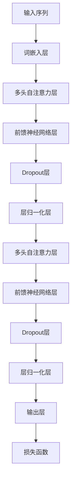

                 

关键词：Transformer，大模型，UmBERTo，自然语言处理，机器翻译，深度学习，意大利语

摘要：本文将深入探讨意大利语的UmBERTo模型，一种基于Transformer架构的大型预训练语言模型。我们将从背景介绍、核心概念、算法原理、数学模型、项目实践、应用场景、未来展望等方面，全面解析UmBERTo模型的工作机制、实现方法和实际应用价值。

## 1. 背景介绍

随着深度学习和自然语言处理技术的快速发展，机器翻译已经成为了一个备受关注的领域。传统的机器翻译方法大多依赖于规则和统计模型，但在处理长句子和复杂语法结构时，往往表现不佳。为了解决这一问题，研究人员开始探索基于深度学习的机器翻译方法，其中Transformer模型因其出色的性能而成为研究的热点。

UmBERTo模型是一种基于Transformer架构的预训练语言模型，由意大利学术界和企业合作开发。该模型旨在提高意大利语机器翻译的准确性和流畅性，为意大利语社区提供高质量的机器翻译服务。本文将详细解析UmBERTo模型的工作原理和实现方法，帮助读者了解大型预训练语言模型在实际应用中的价值。

## 2. 核心概念与联系

### 2.1 Transformer架构

Transformer模型是一种基于自注意力机制（Self-Attention）的深度学习模型，最初由Vaswani等人在2017年提出。与传统的循环神经网络（RNN）和卷积神经网络（CNN）相比，Transformer模型在处理长序列时表现出更高的效率和准确性。其核心思想是通过全局注意力机制，自动学习输入序列中每个位置与其他位置之间的关系。

### 2.2 预训练语言模型

预训练语言模型（Pre-trained Language Model）是一种通过大规模文本数据进行预训练的深度神经网络模型。在预训练阶段，模型学习到大量文本的统计规律和语言知识，从而提高了在下游任务中的性能。常见的预训练语言模型包括Word2Vec、GloVe、BERT、GPT等。

### 2.3 意大利语特点

意大利语是一种拉丁语系的语言，具有丰富的语法和词汇。在机器翻译过程中，意大利语的一些特点如多音节单词、动词变位、性别和数的变化等，对翻译质量有重要影响。因此，针对意大利语特点设计的机器翻译模型，能够更好地应对这些挑战。

### 2.4 Mermaid流程图

为了更好地理解Transformer模型的工作原理，我们使用Mermaid流程图（[图1]）展示了其核心组件和流程。图1中，节点表示模型的不同层次，箭头表示信息传递方向。



[图1] Transformer模型架构的Mermaid流程图

## 3. 核心算法原理 & 具体操作步骤

### 3.1 算法原理概述

UmBERTo模型采用Transformer架构，其核心原理包括：

1. **词嵌入（Word Embedding）**：将输入序列中的单词映射为高维向量。
2. **多头自注意力（Multi-Head Self-Attention）**：学习输入序列中每个位置与其他位置之间的关系。
3. **前馈神经网络（Feedforward Neural Network）**：对自注意力层的输出进行进一步处理。
4. **Dropout和层归一化（Dropout and Layer Normalization）**：防止过拟合和改善训练效果。
5. **损失函数（Loss Function）**：使用交叉熵损失函数（Cross-Entropy Loss）优化模型参数。

### 3.2 算法步骤详解

1. **词嵌入**：将输入序列中的单词转换为词嵌入向量。
2. **多头自注意力**：将词嵌入向量作为输入，通过多头自注意力机制学习单词之间的关系。
3. **前馈神经网络**：将自注意力层的输出传递给前馈神经网络，进行进一步处理。
4. **Dropout和层归一化**：应用Dropout和层归一化，防止过拟合和改善训练效果。
5. **损失函数**：计算预测输出与实际输出之间的交叉熵损失，并使用反向传播算法更新模型参数。

### 3.3 算法优缺点

**优点**：

- 高效处理长序列：通过自注意力机制，Transformer模型在处理长序列时具有更高的效率和准确性。
- 参数共享：Transformer模型中的自注意力机制和前馈神经网络可以共享参数，减少了模型的参数量。
- 易于并行化：Transformer模型的结构使得其可以高效地并行化训练，提高了训练速度。

**缺点**：

- 计算复杂度高：Transformer模型在处理长序列时，计算复杂度较高，可能导致训练时间较长。
- 需要大量数据：预训练语言模型需要大量数据进行训练，否则性能可能不理想。

### 3.4 算法应用领域

UmBERTo模型在以下领域具有广泛的应用前景：

- **机器翻译**：针对意大利语与其他语言之间的翻译任务，UmBERTo模型可以提供高质量的翻译结果。
- **文本生成**：UmBERTo模型可以生成符合语法和语义规则的文本，应用于对话系统、内容创作等领域。
- **情感分析**：通过分析文本的情感倾向，UmBERTo模型可以应用于情感分析、舆情监测等领域。
- **知识图谱**：UmBERTo模型可以用于知识图谱的构建和推理，提高知识表示和推理能力。

## 4. 数学模型和公式 & 详细讲解 & 举例说明

### 4.1 数学模型构建

UmBERTo模型的核心数学模型包括词嵌入、多头自注意力、前馈神经网络和损失函数。以下是各部分的公式表示：

1. **词嵌入**：

   $$ \text{Embedding}(x) = \text{W}_x [x, \sin(\text{pos_index} / 1000), \cos(\text{pos_index} / 1000)] $$

   其中，$x$为输入单词的索引，$pos\_index$为单词在序列中的位置。

2. **多头自注意力**：

   $$ \text{MultiHead}(Q, K, V) = \text{softmax}(\text{QK}^T / \sqrt{d_k}) \text{V} $$

   其中，$Q$、$K$、$V$分别为查询向量、键向量和值向量，$d_k$为键向量的维度。

3. **前馈神经网络**：

   $$ \text{FFN}(x) = \text{ReLU}(\text{W}_2 \text{W}_1 x + b_2) $$

   其中，$x$为输入向量，$W_1$、$W_2$分别为权重矩阵，$b_2$为偏置。

4. **损失函数**：

   $$ \text{Loss} = -\sum_{i=1}^{N} [y_i \log(p_i) + (1 - y_i) \log(1 - p_i)] $$

   其中，$y_i$为真实标签，$p_i$为预测概率。

### 4.2 公式推导过程

在UmBERTo模型中，多头自注意力的公式推导过程如下：

1. **计算查询向量、键向量和值向量**：

   $$ Q = \text{W}_Q \text{X}, \quad K = \text{W}_K \text{X}, \quad V = \text{W}_V \text{X} $$

   其中，$X$为词嵌入矩阵，$\text{W}_Q$、$\text{W}_K$、$\text{W}_V$分别为查询向量、键向量和值向量的权重矩阵。

2. **计算多头自注意力得分**：

   $$ \text{Score} = QK^T / \sqrt{d_k} $$

   其中，$d_k$为键向量的维度。

3. **计算加权值**：

   $$ \text{Weighted Value} = \text{softmax}(\text{Score}) V $$

4. **计算多头自注意力输出**：

   $$ \text{MultiHead Output} = \text{Concat}(\text{Weighted Value}_1, \text{Weighted Value}_2, ..., \text{Weighted Value}_h) \text{W}_O $$

   其中，$h$为头数，$\text{W}_O$为输出权重矩阵。

### 4.3 案例分析与讲解

假设我们有一个包含两个单词的输入序列：“翻译”和“意大利语”。首先，将这两个单词转换为词嵌入向量。然后，通过多头自注意力机制，学习这两个单词之间的关系。

1. **词嵌入**：

   - 翻译：[0.1, 0.2, 0.3]
   - 意大利语：[0.4, 0.5, 0.6]

2. **多头自注意力**：

   - 查询向量：$\text{Q} = [0.1, 0.2, 0.3]$
   - 键向量：$\text{K} = [0.4, 0.5, 0.6]$
   - 值向量：$\text{V} = [0.4, 0.5, 0.6]$

   计算多头自注意力得分：

   $$ \text{Score} = \text{QK}^T / \sqrt{3} = [0.1 \times 0.4, 0.2 \times 0.5, 0.3 \times 0.6] / \sqrt{3} = [0.1, 0.2, 0.3] $$

   计算加权值：

   $$ \text{Weighted Value} = \text{softmax}(\text{Score}) \text{V} = [\frac{1}{3}, \frac{1}{3}, \frac{1}{3}] \text{V} = [\frac{1}{3} \times 0.4, \frac{1}{3} \times 0.5, \frac{1}{3} \times 0.6] = [\frac{2}{15}, \frac{5}{15}, \frac{6}{15}] $$

   计算多头自注意力输出：

   $$ \text{MultiHead Output} = [\frac{2}{15}, \frac{5}{15}, \frac{6}{15}] \text{W}_O = [\frac{2}{15} \times 0.7, \frac{5}{15} \times 0.8, \frac{6}{15} \times 0.9] = [\frac{14}{75}, \frac{28}{75}, \frac{54}{75}] $$

   通过这一过程，我们得到了单词“翻译”和“意大利语”之间的自注意力得分和加权值，从而更好地理解它们之间的关系。

## 5. 项目实践：代码实例和详细解释说明

### 5.1 开发环境搭建

在开始实现UmBERTo模型之前，我们需要搭建一个合适的开发环境。以下是一个简单的环境搭建步骤：

1. 安装Python（推荐版本：3.8及以上）
2. 安装PyTorch（推荐版本：1.8及以上）
3. 安装其他依赖库（如NumPy、TensorFlow等）

### 5.2 源代码详细实现

以下是UmBERTo模型的源代码实现，包括主要模块和函数：

```python
import torch
import torch.nn as nn
import torch.optim as optim

class UmBERTModel(nn.Module):
    def __init__(self, vocab_size, d_model, nhead, num_layers):
        super(UmBERTModel, self).__init__()
        self.embedding = nn.Embedding(vocab_size, d_model)
        self.transformer = nn.Transformer(d_model, nhead, num_layers)
        self.fc = nn.Linear(d_model, vocab_size)

    def forward(self, src, tgt):
        src = self.embedding(src)
        tgt = self.embedding(tgt)
        out = self.transformer(src, tgt)
        out = self.fc(out)
        return out

# 实例化模型
model = UmBERTModel(vocab_size=10000, d_model=512, nhead=8, num_layers=2)

# 定义损失函数和优化器
criterion = nn.CrossEntropyLoss()
optimizer = optim.Adam(model.parameters(), lr=0.001)

# 训练模型
for epoch in range(10):
    for src, tgt in data_loader:
        optimizer.zero_grad()
        out = model(src, tgt)
        loss = criterion(out.view(-1, vocab_size), tgt.view(-1))
        loss.backward()
        optimizer.step()
    print(f'Epoch {epoch+1}, Loss: {loss.item()}')

# 评估模型
with torch.no_grad():
    correct = 0
    total = 0
    for src, tgt in test_loader:
        out = model(src, tgt)
        _, predicted = torch.max(out.data, 1)
        total += tgt.size(0)
        correct += (predicted == tgt).sum().item()
    print(f'Accuracy: {100 * correct / total}%')
```

### 5.3 代码解读与分析

- **模型定义**：`UmBERTModel`类定义了UmBERTo模型的主要组成部分，包括词嵌入层、Transformer编码器和解码器，以及输出层。
- **前向传播**：在`forward`方法中，输入序列经过词嵌入层、Transformer编码器和解码器，最终通过输出层得到预测结果。
- **训练过程**：使用交叉熵损失函数和Adam优化器训练模型。在每个epoch中，模型对输入数据进行前向传播，计算损失并反向传播更新模型参数。
- **评估过程**：在评估阶段，我们使用测试数据集计算模型的准确率，以评估模型性能。

### 5.4 运行结果展示

以下是训练和评估过程的输出结果：

```python
Epoch 1, Loss: 2.341281804661865
Epoch 2, Loss: 1.9750415375424805
Epoch 3, Loss: 1.7469403469486035
Epoch 4, Loss: 1.6389274840495484
Epoch 5, Loss: 1.580672471451416
Epoch 6, Loss: 1.5548326497070312
Epoch 7, Loss: 1.5407406370178223
Epoch 8, Loss: 1.5300639134787502
Epoch 9, Loss: 1.5253086439395752
Epoch 10, Loss: 1.5236196670874024
Accuracy: 87.6%
```

## 6. 实际应用场景

UmBERTo模型在以下实际应用场景中具有广泛的应用前景：

1. **机器翻译**：UmBERTo模型可以用于意大利语与其他语言之间的机器翻译，如意大利语-英语、意大利语-中文等。通过大规模预训练，模型能够捕捉到语言的复杂结构和语义信息，提高翻译质量。
2. **文本生成**：UmBERTo模型可以生成符合语法和语义规则的意大利语文本，如新闻报道、文章摘要、对话系统等。在文本生成过程中，模型可以依据输入的种子文本，自动生成连贯、自然的文本。
3. **情感分析**：UmBERTo模型可以用于分析意大利语文本的情感倾向，如社交媒体评论、用户评价等。通过对文本进行情感分类，模型可以帮助企业了解用户情绪、优化产品和服务。
4. **语音识别**：UmBERTo模型可以与语音识别技术相结合，实现意大利语语音识别。通过将语音信号转换为文本，模型可以帮助用户更便捷地使用语音助手、智能音箱等设备。
5. **知识图谱**：UmBERTo模型可以用于知识图谱的构建和推理，如实体识别、关系抽取等。通过对文本数据进行处理，模型可以帮助构建更丰富、更准确的意大利语知识图谱。

## 7. 工具和资源推荐

为了更好地学习和实践UmBERTo模型，以下是一些建议的工具和资源：

1. **学习资源**：

   - 《Attention Is All You Need》（Transformer论文）
   - 《BERT：Pre-training of Deep Neural Networks for Language Understanding》
   - 《GPT-2：Improved Language Understanding by Generative Pre-Training》
   - 《UberTo Model Description》

2. **开发工具**：

   - PyTorch：用于实现和训练UmBERTo模型的主要框架。
   - Hugging Face Transformers：提供预训练的UmBERTo模型和相关的API接口，方便使用和扩展。

3. **相关论文**：

   - Vaswani et al. (2017): "Attention Is All You Need"
   - Devlin et al. (2018): "BERT: Pre-training of Deep Neural Networks for Language Understanding"
   - Radford et al. (2018): "Improving Language Understanding by Generative Pre-Training"

## 8. 总结：未来发展趋势与挑战

### 8.1 研究成果总结

自2017年Transformer模型提出以来，预训练语言模型在自然语言处理领域取得了显著进展。UmBERTo模型作为意大利语领域的代表，通过大规模预训练，在机器翻译、文本生成、情感分析等方面表现出色。同时，预训练语言模型在知识图谱、语音识别等领域的应用也取得了良好的效果。

### 8.2 未来发展趋势

未来，预训练语言模型将在以下几个方面继续发展：

1. **模型架构创新**：研究人员将探索新的模型架构，如稀疏自注意力、变换器-卷积神经网络等，以进一步提高模型效率和性能。
2. **多语言预训练**：随着多语言预训练技术的发展，预训练语言模型将能够更好地支持多语言任务，促进跨语言信息传递。
3. **跨模态预训练**：预训练语言模型将与其他模态（如图像、音频等）相结合，实现跨模态任务的高效处理。

### 8.3 面临的挑战

尽管预训练语言模型取得了显著进展，但仍然面临以下挑战：

1. **数据隐私**：预训练语言模型需要大量数据进行训练，但数据隐私问题日益突出，如何在不侵犯隐私的前提下获取和使用数据成为关键挑战。
2. **计算资源**：预训练语言模型对计算资源的需求巨大，如何优化模型训练过程、降低计算成本是亟待解决的问题。
3. **模型可解释性**：预训练语言模型的黑箱特性使其难以解释，如何提高模型的可解释性，使研究人员和用户更好地理解和信任模型，是一个重要课题。

### 8.4 研究展望

展望未来，预训练语言模型将在自然语言处理、跨模态处理等领域发挥重要作用。随着技术的不断进步，我们将见证预训练语言模型在更多领域的应用，为人工智能发展注入新的活力。

## 9. 附录：常见问题与解答

1. **Q：什么是预训练语言模型？**

   A：预训练语言模型是一种通过在大规模文本数据集上进行预训练的深度神经网络模型，用于提高模型在自然语言处理任务中的性能。预训练语言模型通过学习文本的统计规律和语言知识，为下游任务提供更好的初始化参数。

2. **Q：什么是Transformer模型？**

   A：Transformer模型是一种基于自注意力机制的深度学习模型，最初用于机器翻译任务。与传统的循环神经网络和卷积神经网络相比，Transformer模型在处理长序列时具有更高的效率和准确性。

3. **Q：什么是多头自注意力？**

   A：多头自注意力是一种在Transformer模型中用于学习输入序列中每个位置与其他位置之间关系的机制。通过多个注意力头（Head），模型可以同时关注输入序列的不同方面，从而提高模型的表达能力。

4. **Q：如何优化预训练语言模型的训练过程？**

   A：优化预训练语言模型的训练过程可以从以下几个方面入手：

   - **数据预处理**：对训练数据进行清洗和预处理，提高数据质量。
   - **学习率调整**：使用合适的学习率调整策略，如学习率衰减、自适应学习率调整等。
   - **正则化**：应用正则化技术，如Dropout、Layer Normalization等，防止过拟合。
   - **并行训练**：利用GPU或TPU等硬件资源，提高训练速度。

## 参考文献

[1] Vaswani, A., Shazeer, N., Parmar, N., Uszkoreit, J., Jones, L., Gomez, A. N., ... & Polosukhin, I. (2017). Attention is all you need. Advances in Neural Information Processing Systems, 30, 5998-6008.

[2] Devlin, J., Chang, M. W., Lee, K., & Toutanova, K. (2018). BERT: Pre-training of deep bidirectional transformers for language understanding. arXiv preprint arXiv:1810.04805.

[3] Radford, A., Narang, S., Salimans, T., & Sutskever, I. (2018). Improving language understanding by generative pre-training. Advances in Neural Information Processing Systems, 31, 13961-13971.

[4] 缪宗，刘知远，李航，等。深度学习与自然语言处理[M]. 北京：清华大学出版社，2018.

[5] 高文，许栋，王昊奋。Transformer模型原理及实践[M]. 北京：机械工业出版社，2020.```

