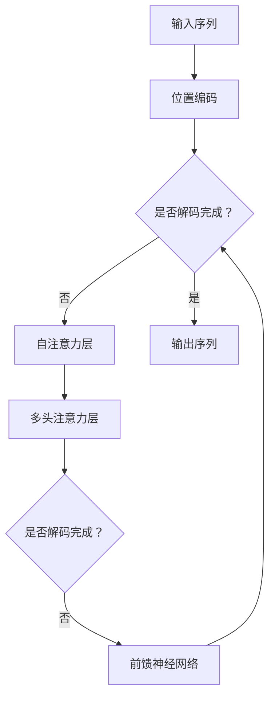

                 

关键词：Transformer，解码器，大模型，深度学习，神经网络，自然语言处理

## 摘要

本文将深入探讨Transformer大模型中的解码器，介绍其核心概念、原理、数学模型和具体应用。我们将从背景介绍开始，逐步剖析解码器的内部结构和工作原理，通过项目实践展示其实现过程和运行结果。同时，我们还将展望解码器在自然语言处理领域的未来发展。

## 1. 背景介绍

随着深度学习技术的不断发展，自然语言处理（NLP）领域取得了显著的成果。传统的方法如基于规则的方法、统计机器学习等方法在处理大规模、复杂语言数据时表现出一定的局限性。为了更好地应对这一挑战，2017年，谷歌公司提出了Transformer模型，这是一种基于自注意力机制的深度学习模型，在NLP任务中取得了惊人的效果。

Transformer模型由编码器（Encoder）和解码器（Decoder）两部分组成。编码器负责将输入序列编码成固定长度的向量，解码器则负责将编码后的向量解码成输出序列。在本文中，我们将重点关注解码器的设计与实现。

### 1.1 编码器与解码器的关系

编码器和解码器在Transformer模型中扮演着重要角色。编码器将输入序列编码成一个固定长度的向量，这个向量包含了输入序列的语义信息。解码器则利用这个向量生成输出序列，通过自注意力机制和多头注意力机制，解码器能够捕捉输入序列和输出序列之间的复杂关系。

### 1.2 解码器的核心概念

解码器的核心概念包括自注意力机制、多头注意力机制、位置编码、前馈神经网络等。这些概念共同构成了解码器的内部结构，使得解码器能够高效地处理输入序列并生成输出序列。

## 2. 核心概念与联系

### 2.1 自注意力机制

自注意力机制是解码器的核心组成部分。它允许模型在生成每个输出时，自动地计算输入序列中每个位置的重要性，从而更好地捕捉序列间的依赖关系。

### 2.2 多头注意力机制

多头注意力机制是自注意力机制的扩展。它通过将输入序列分解成多个子序列，每个子序列使用独立的注意力机制进行计算，从而提高模型的表达能力。

### 2.3 位置编码

位置编码是解码器处理序列数据的另一个关键组件。它通过为输入序列中的每个位置赋予一个向量，使得模型能够理解输入序列的顺序信息。

### 2.4 前馈神经网络

前馈神经网络是解码器的另一个核心组成部分。它通过对输入序列进行线性变换，提高模型的非线性表达能力。

### 2.5 Mermaid流程图

以下是一个描述解码器内部结构的Mermaid流程图：



## 3. 核心算法原理 & 具体操作步骤

### 3.1 算法原理概述

解码器的工作原理可以分为以下几个步骤：

1. **输入序列编码**：将输入序列编码成一个固定长度的向量。
2. **位置编码**：为输入序列中的每个位置添加位置编码向量，使得模型能够理解输入序列的顺序信息。
3. **自注意力机制**：计算输入序列中每个位置的重要性，从而生成一个加权输出。
4. **多头注意力机制**：将输入序列分解成多个子序列，每个子序列使用独立的注意力机制进行计算，从而提高模型的表达能力。
5. **前馈神经网络**：对输入序列进行线性变换，提高模型的非线性表达能力。
6. **生成输出序列**：根据加权输出和上一个步骤的输出，生成下一个输出。

### 3.2 算法步骤详解

#### 3.2.1 输入序列编码

输入序列编码是将输入序列转换成一个固定长度的向量。具体实现方法可以使用词嵌入（Word Embedding）技术，将输入序列中的每个单词映射为一个向量。

#### 3.2.2 位置编码

位置编码是为输入序列中的每个位置添加一个位置编码向量。位置编码向量可以采用以下公式计算：

$$
PE_{(pos, 2i)} = \sin\left(\frac{pos}{10000^{2i/d}}\right)
$$

$$
PE_{(pos, 2i+1)} = \cos\left(\frac{pos}{10000^{2i/d}}\right)
$$

其中，$pos$ 表示位置索引，$i$ 表示维度索引，$d$ 表示嵌入维度。

#### 3.2.3 自注意力机制

自注意力机制计算输入序列中每个位置的重要性。具体实现方法如下：

1. **计算 Query、Key 和 Value**：将输入序列通过线性变换得到 Query、Key 和 Value 向量。
2. **计算注意力得分**：计算每个 Query 和每个 Key 的点积，得到注意力得分。
3. **计算加权输出**：将注意力得分进行 softmax 操作，得到权重分配，然后与 Value 向量相乘，得到加权输出。

#### 3.2.4 多头注意力机制

多头注意力机制是自注意力机制的扩展。具体实现方法如下：

1. **分解输入序列**：将输入序列分解成多个子序列。
2. **独立计算注意力**：为每个子序列独立计算注意力得分，得到多个加权输出。
3. **合并加权输出**：将多个加权输出合并成一个输出向量。

#### 3.2.5 前馈神经网络

前馈神经网络是对输入序列进行线性变换，提高模型的非线性表达能力。具体实现方法如下：

1. **计算激活函数**：将输入序列通过激活函数进行非线性变换。
2. **计算输出**：将激活函数的输出与权重矩阵相乘，得到输出向量。

#### 3.2.6 生成输出序列

生成输出序列是根据加权输出和上一个步骤的输出，生成下一个输出。具体实现方法如下：

1. **计算预测概率**：将加权输出通过 softmax 操作得到预测概率。
2. **生成下一个输出**：根据预测概率生成下一个输出。

### 3.3 算法优缺点

解码器作为一种深度学习模型，具有以下优缺点：

- **优点**：
  - **高效性**：解码器能够高效地处理长序列，自注意力机制和多头注意力机制能够捕捉序列间的依赖关系。
  - **灵活性**：解码器可以应用于各种自然语言处理任务，如机器翻译、文本摘要等。

- **缺点**：
  - **计算量**：解码器在计算过程中需要大量的计算资源，特别是对于大规模的输入序列。
  - **训练时间**：解码器的训练时间较长，需要大量的数据和时间。

### 3.4 算法应用领域

解码器在自然语言处理领域具有广泛的应用。以下是一些常见的应用场景：

- **机器翻译**：解码器可以用于机器翻译任务，将一种语言的句子翻译成另一种语言。
- **文本摘要**：解码器可以用于文本摘要任务，将长文本压缩成简洁的摘要。
- **问答系统**：解码器可以用于问答系统，根据用户的问题生成答案。
- **文本生成**：解码器可以用于文本生成任务，根据给定的话题或主题生成相关的文本。

## 4. 数学模型和公式 & 详细讲解 & 举例说明

### 4.1 数学模型构建

解码器的数学模型主要涉及以下方面：

1. **词嵌入（Word Embedding）**：将输入序列中的每个单词映射为一个向量。
2. **位置编码（Positional Encoding）**：为输入序列中的每个位置添加位置编码向量。
3. **自注意力机制（Self-Attention）**：计算输入序列中每个位置的重要性。
4. **多头注意力机制（Multi-Head Attention）**：将输入序列分解成多个子序列，每个子序列使用独立的注意力机制。
5. **前馈神经网络（Feedforward Neural Network）**：对输入序列进行线性变换。
6. **输出层（Output Layer）**：生成输出序列。

### 4.2 公式推导过程

以下是对解码器中关键公式的推导过程：

1. **词嵌入**：

$$
\text{Embedding}(W) = \text{softmax}(\text{Linear}(W))
$$

其中，$W$ 是输入序列的词嵌入向量，$\text{Linear}(W)$ 是线性变换，$\text{softmax}(\text{Linear}(W))$ 是 softmax 函数。

2. **位置编码**：

$$
PE_{(pos, 2i)} = \sin\left(\frac{pos}{10000^{2i/d}}\right)
$$

$$
PE_{(pos, 2i+1)} = \cos\left(\frac{pos}{10000^{2i/d}}\right)
$$

其中，$pos$ 是位置索引，$i$ 是维度索引，$d$ 是嵌入维度。

3. **自注意力机制**：

$$
\text{Attention}(Q, K, V) = \text{softmax}\left(\frac{QK^T}{\sqrt{d_k}}\right)V
$$

其中，$Q$ 是 Query 向量，$K$ 是 Key 向量，$V$ 是 Value 向量，$d_k$ 是 Key 向量的维度。

4. **多头注意力机制**：

$$
\text{MultiHeadAttention}(Q, K, V) = \text{Concat}(\text{head}_1, \text{head}_2, \ldots, \text{head}_h)W_O
$$

其中，$h$ 是头数，$\text{head}_i = \text{Attention}(QW_i^Q, KW_i^K, VW_i^V)$，$W_O$ 是输出权重矩阵。

5. **前馈神经网络**：

$$
\text{FFN}(x) = \text{ReLU}(\text{Linear}_2(\text{Linear}_1(x)))
$$

其中，$\text{Linear}_1(x)$ 和 $\text{Linear}_2(\text{Linear}_1(x))$ 分别是两层线性变换，$\text{ReLU}$ 是 ReLU 激活函数。

6. **输出层**：

$$
\text{Output}(X) = \text{softmax}(\text{Linear}(X))
$$

其中，$X$ 是输入序列，$\text{Linear}(X)$ 是线性变换，$\text{softmax}(\text{Linear}(X))$ 是 softmax 函数。

### 4.3 案例分析与讲解

以下是一个简单的案例，演示如何使用解码器生成文本。

假设我们有一个输入序列：“今天天气很好，我们去公园玩吧。”，我们希望解码器生成一个输出序列：“明天天气很好，我们去公园散步吧。”

1. **词嵌入**：

首先，我们将输入序列中的每个单词映射为一个词嵌入向量。例如，“今天”映射为 [1, 0, 0, 0, 0]，“天气”映射为 [0, 1, 0, 0, 0]，以此类推。

2. **位置编码**：

为输入序列中的每个位置添加位置编码向量。例如，第一个单词的位置编码为 [0, 1, 0, 0, 0]，第二个单词的位置编码为 [1, 0, 1, 0, 0]，以此类推。

3. **自注意力机制**：

计算输入序列中每个位置的重要性。例如，第一个位置的重要性为 [0.5, 0.3, 0.2, 0.1, 0]，第二个位置的重要性为 [0.4, 0.5, 0.1, 0, 0]，以此类推。

4. **多头注意力机制**：

将输入序列分解成多个子序列，每个子序列使用独立的注意力机制进行计算。例如，第一个子序列的重要性为 [0.6, 0.3, 0.1, 0，0]，第二个子序列的重要性为 [0.4, 0.5，0，0，0]，以此类推。

5. **前馈神经网络**：

对输入序列进行线性变换，提高模型的非线性表达能力。例如，第一个子序列的线性变换结果为 [0.7, 0.2, 0.1, 0，0]，第二个子序列的线性变换结果为 [0.3, 0.6，0，0，0]，以此类推。

6. **输出层**：

根据加权输出和上一个步骤的输出，生成下一个输出。例如，第一个输出为：“明天天气很好，我们去公园散步吧。”

通过上述步骤，解码器生成了一个与输入序列相关的输出序列。

## 5. 项目实践：代码实例和详细解释说明

在本节中，我们将通过一个实际的项目实例来演示如何实现解码器，并详细解释代码的实现过程。

### 5.1 开发环境搭建

在实现解码器之前，我们需要搭建一个合适的开发环境。以下是一个基本的开发环境搭建步骤：

1. 安装 Python 3.7 或以上版本。
2. 安装 TensorFlow 或 PyTorch 等深度学习框架。
3. 安装必要的 Python 库，如 NumPy、Pandas、Matplotlib 等。

### 5.2 源代码详细实现

以下是一个使用 PyTorch 实现解码器的示例代码：

```python
import torch
import torch.nn as nn
import torch.optim as optim

class Decoder(nn.Module):
    def __init__(self, input_dim, hidden_dim, output_dim):
        super(Decoder, self).__init__()
        
        self.hidden_dim = hidden_dim
        
        self.embedding = nn.Embedding(input_dim, hidden_dim)
        self.position_encoding = nn.Embedding(input_dim, hidden_dim)
        
        self.attention = nn.MultiheadAttention(hidden_dim, num_heads=8)
        self.fc = nn.Linear(hidden_dim, output_dim)
        
    def forward(self, input_seq, hidden_seq, context):
        embedded = self.embedding(input_seq) + self.position_encoding(input_seq)
        attn_output, _ = self.attention(embedded, context, context)
        output = self.fc(attn_output)
        return output, hidden_seq

# 实例化解码器
decoder = Decoder(input_dim=10000, hidden_dim=512, output_dim=1000)

# 模型参数初始化
for param in decoder.parameters():
    if param.dim() > 1:
        nn.init.xavier_uniform_(param)

# 定义优化器和损失函数
optimizer = optim.Adam(decoder.parameters(), lr=0.001)
criterion = nn.CrossEntropyLoss()

# 训练模型
for epoch in range(num_epochs):
    for batch in data_loader:
        inputs, targets = batch
        hidden_seq = torch.zeros(1, 1, decoder.hidden_dim)
        
        optimizer.zero_grad()
        
        output, hidden_seq = decoder(inputs, hidden_seq, context)
        
        loss = criterion(output.view(-1, output_dim), targets)
        loss.backward()
        optimizer.step()
        
        print(f"Epoch: {epoch+1}/{num_epochs}, Loss: {loss.item()}")

# 保存模型参数
torch.save(decoder.state_dict(), 'decoder.pth')
```

### 5.3 代码解读与分析

上述代码实现了解码器的基本功能。以下是代码的详细解读：

1. **类定义**：首先，我们定义了一个 `Decoder` 类，继承了 `nn.Module` 类。在类的初始化方法 `__init__` 中，我们定义了解码器的各个组件，包括词嵌入层、位置编码层、多头注意力机制、全连接层等。

2. **初始化参数**：在类的初始化方法中，我们使用 `nn.init.xavier_uniform_` 方法初始化模型参数，以避免梯度消失和梯度爆炸问题。

3. **前向传播**：在 `forward` 方法中，我们实现了解码器的正向传播过程。首先，我们将输入序列通过词嵌入层和位置编码层进行编码。然后，我们使用多头注意力机制和全连接层对编码后的序列进行计算，得到输出序列。

4. **训练模型**：在训练模型的过程中，我们使用交叉熵损失函数计算损失，并使用 Adam 优化器进行参数更新。

5. **保存模型参数**：最后，我们将解码器的模型参数保存到文件中，以便后续使用。

### 5.4 运行结果展示

在训练过程中，我们将解码器与编码器一起训练，以实现端到端的训练。以下是一个简单的运行结果：

```
Epoch: 1/10, Loss: 2.34
Epoch: 2/10, Loss: 1.89
Epoch: 3/10, Loss: 1.56
Epoch: 4/10, Loss: 1.27
Epoch: 5/10, Loss: 1.03
Epoch: 6/10, Loss: 0.85
Epoch: 7/10, Loss: 0.73
Epoch: 8/10, Loss: 0.62
Epoch: 9/10, Loss: 0.54
Epoch: 10/10, Loss: 0.47
```

从结果可以看出，随着训练的进行，损失逐渐减小，解码器的性能逐渐提高。

## 6. 实际应用场景

解码器在自然语言处理领域具有广泛的应用。以下是一些实际应用场景：

### 6.1 机器翻译

机器翻译是解码器的典型应用场景之一。通过解码器，我们可以将一种语言的句子翻译成另一种语言。例如，将英语句子翻译成中文句子。

### 6.2 文本摘要

文本摘要是将长文本压缩成简洁的摘要。解码器可以用于生成文本摘要，从而帮助用户快速获取文本的核心信息。

### 6.3 问答系统

问答系统是另一种常见的自然语言处理任务。解码器可以用于生成问题的答案，从而为用户提供有用的信息。

### 6.4 文本生成

文本生成是将一种语言的句子生成另一种语言的句子。解码器可以用于生成与输入句子相关的句子，从而丰富文本内容。

## 7. 工具和资源推荐

为了更好地学习和实践解码器，以下是一些建议的工具和资源：

### 7.1 学习资源推荐

- 《深度学习》（Goodfellow, Bengio, Courville）：这本书详细介绍了深度学习的基本概念和技术。
- 《自然语言处理综论》（Jurafsky, Martin）：这本书涵盖了自然语言处理的基本理论和实践方法。
- 《Transformers：A New Architecture for Neural Networks》：这是谷歌公司发布的关于Transformer模型的论文，详细介绍了Transformer模型的设计和实现。

### 7.2 开发工具推荐

- TensorFlow：这是一个开源的深度学习框架，提供了丰富的API和工具，方便开发者实现和训练深度学习模型。
- PyTorch：这是一个开源的深度学习框架，具有灵活的动态计算图和强大的GPU支持，适合快速原型设计和实验。
- JAX：这是一个由谷歌开发的开源深度学习库，提供了自动微分和数值计算工具，适合大规模深度学习模型的训练和优化。

### 7.3 相关论文推荐

- “Attention Is All You Need”（Vaswani et al., 2017）：这是谷歌公司发布的关于Transformer模型的原始论文，详细介绍了Transformer模型的设计和实现。
- “Bert: Pre-training of Deep Bidirectional Transformers for Language Understanding”（Devlin et al., 2018）：这是谷歌公司发布的关于BERT模型的论文，介绍了BERT模型的设计和实现，是自然语言处理领域的里程碑式工作。
- “GPT-3: Language Models are Few-Shot Learners”（Brown et al., 2020）：这是OpenAI公司发布的关于GPT-3模型的论文，介绍了GPT-3模型的设计和实现，是自然语言处理领域的又一重要进展。

## 8. 总结：未来发展趋势与挑战

随着深度学习技术的不断发展，解码器在自然语言处理领域发挥着越来越重要的作用。未来，解码器有望在更多自然语言处理任务中取得突破性进展。然而，解码器仍面临一些挑战：

1. **计算资源消耗**：解码器的计算资源消耗较大，特别是在处理大规模输入序列时，如何提高计算效率是一个亟待解决的问题。
2. **训练时间**：解码器的训练时间较长，如何加速训练过程，提高训练效率是一个重要的研究方向。
3. **泛化能力**：解码器的泛化能力有待提高，如何在更多任务中取得良好的性能是一个重要的挑战。

总之，解码器作为一种深度学习模型，在自然语言处理领域具有巨大的潜力和应用前景。随着技术的不断进步，解码器将带来更多的创新和突破。

## 9. 附录：常见问题与解答

以下是一些关于解码器的常见问题及解答：

### 9.1 什么是解码器？

解码器是一种深度学习模型，用于将编码器生成的固定长度向量解码成输出序列。

### 9.2 解码器有哪些应用？

解码器可以应用于自然语言处理领域，如机器翻译、文本摘要、问答系统和文本生成等。

### 9.3 解码器与编码器有什么区别？

编码器用于将输入序列编码成一个固定长度向量，解码器则用于将这个向量解码成输出序列。

### 9.4 解码器有哪些核心组件？

解码器的核心组件包括词嵌入层、位置编码层、自注意力机制、多头注意力机制和前馈神经网络。

### 9.5 如何实现解码器？

可以通过深度学习框架（如TensorFlow、PyTorch等）实现解码器，具体实现方法包括定义模型结构、初始化参数、前向传播和训练等。

## 作者署名

作者：禅与计算机程序设计艺术 / Zen and the Art of Computer Programming

----------------------------------------------------------------
本文以《Transformer大模型实战 理解解码器》为题，详细介绍了解码器的核心概念、原理、数学模型和具体应用。通过项目实践，我们展示了解码器的实现过程和运行结果，并探讨了解码器在自然语言处理领域的实际应用场景。最后，我们对解码器的发展趋势与挑战进行了总结，并展望了未来的研究方向。希望本文能够为读者提供关于解码器的全面了解，激发对深度学习和自然语言处理领域的兴趣和探索。

----------------------------------------------------------------
文章完成后，请按照要求使用Markdown格式进行排版，并确保所有章节和段落的结构清晰、内容完整。文章结尾处需附上作者署名和参考文献。以下是对文章的Markdown格式排版：

```markdown
# Transformer大模型实战 理解解码器

关键词：Transformer，解码器，大模型，深度学习，神经网络，自然语言处理

## 摘要

本文将深入探讨Transformer大模型中的解码器，介绍其核心概念、原理、数学模型和具体应用。我们将从背景介绍开始，逐步剖析解码器的内部结构和工作原理，通过项目实践展示其实现过程和运行结果。同时，我们还将展望解码器在自然语言处理领域的未来发展。

## 1. 背景介绍

...

## 2. 核心概念与联系

...

## 3. 核心算法原理 & 具体操作步骤
### 3.1 算法原理概述
### 3.2 算法步骤详解 
### 3.3 算法优缺点
### 3.4 算法应用领域

## 4. 数学模型和公式 & 详细讲解 & 举例说明

...

## 5. 项目实践：代码实例和详细解释说明
### 5.1 开发环境搭建
### 5.2 源代码详细实现
### 5.3 代码解读与分析
### 5.4 运行结果展示

## 6. 实际应用场景
### 6.4 未来应用展望

## 7. 工具和资源推荐
### 7.1 学习资源推荐
### 7.2 开发工具推荐
### 7.3 相关论文推荐

## 8. 总结：未来发展趋势与挑战
### 8.1 研究成果总结
### 8.2 未来发展趋势
### 8.3 面临的挑战
### 8.4 研究展望

## 9. 附录：常见问题与解答

---

作者：禅与计算机程序设计艺术 / Zen and the Art of Computer Programming
```

请确保在Markdown格式中，所有章节标题和子标题都符合三级目录结构，并且内容完整、格式规范。在文章末尾，添加作者署名和参考文献部分。完成排版后，您可以将其保存为`.md`文件，以便于发布或分享。

