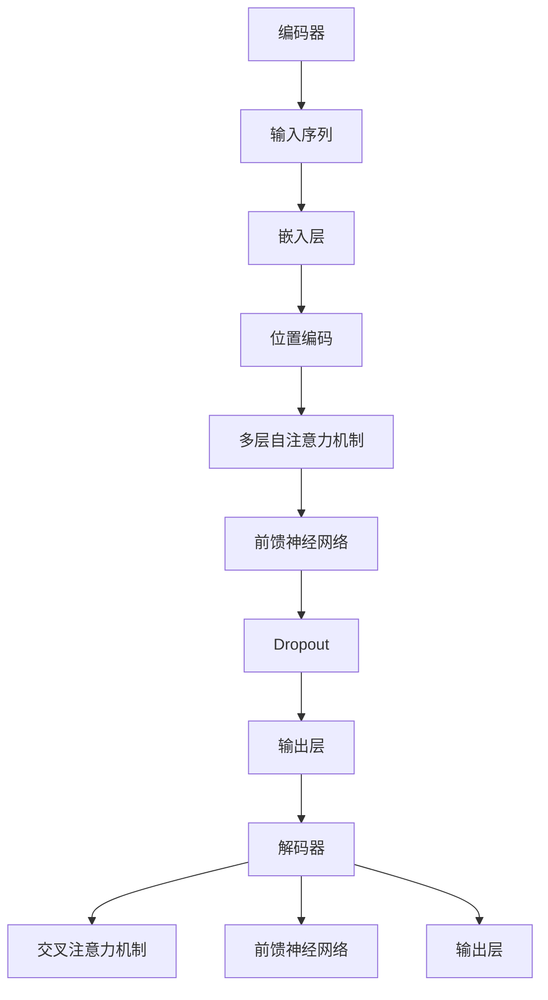

                 

关键词：Transformer，大模型，训练方法，高效，深度学习

摘要：本文将深入探讨Transformer大模型的训练方法。我们将首先介绍Transformer模型的基本原理和架构，然后详细讨论训练过程中遇到的关键问题，包括数据预处理、优化器选择、损失函数设计以及模型评估。最后，我们将通过一个实际项目实例，展示如何利用高效训练方法来优化Transformer大模型。

## 1. 背景介绍

近年来，深度学习在计算机视觉、自然语言处理、推荐系统等领域取得了显著的进展。然而，随着数据规模和模型复杂度的增加，训练深度学习模型所需的时间和资源也急剧增加。为了解决这一问题，研究人员提出了许多高效训练方法，其中Transformer模型因其独特的架构和强大的性能成为研究的热点。

Transformer模型由Vaswani等人在2017年提出，它基于自注意力机制，摒弃了传统的卷积神经网络和循环神经网络。Transformer模型在自然语言处理任务中取得了优异的成绩，如机器翻译、文本分类等。本文将介绍Transformer大模型的训练方法，以帮助读者理解如何高效地训练这些复杂的模型。

## 2. 核心概念与联系

### 2.1 Transformer模型架构

Transformer模型主要由编码器（Encoder）和解码器（Decoder）组成。编码器负责将输入序列编码为固定长度的向量表示，解码器则根据编码器的输出和已经生成的部分输出，预测下一个单词或字符。


### 2.2 自注意力机制

自注意力机制是Transformer模型的核心组件，它通过计算序列中每个元素与其他元素的相关性，从而为每个元素分配不同的权重。这种机制使得模型能够关注序列中的重要信息，提高了模型的表示能力。


### 2.3 Mermaid 流程图

下面是一个Mermaid流程图，展示了Transformer模型的基本流程：



## 3. 核心算法原理 & 具体操作步骤

### 3.1 算法原理概述

Transformer模型的核心是自注意力机制，它通过计算输入序列中每个元素与其他元素的相关性，为每个元素分配权重。具体来说，自注意力机制包括以下三个关键步骤：

1. **计算Query、Key和Value**：对于编码器和解码器中的每个位置，计算Query、Key和Value。Query和Key来自同一编码器的不同位置，而Value则来自编码器的所有位置。
2. **计算注意力权重**：使用点积注意力机制计算Query和Key之间的相似度，得到注意力权重。
3. **加权求和**：将注意力权重与Value相乘，然后将结果相加，得到每个位置的代表向量。

### 3.2 算法步骤详解

1. **嵌入层**：将输入序列中的单词或字符转换为向量表示。常用的嵌入层有词嵌入（Word Embedding）和位置嵌入（Positional Encoding）。
2. **自注意力机制**：计算编码器中每个位置的Query、Key和Value，然后计算注意力权重，加权求和得到代表向量。
3. **前馈神经网络**：对代表向量进行两次前馈神经网络操作，增加模型的表达能力。
4. **Dropout**：为了防止过拟合，对模型的输出进行Dropout处理。
5. **输出层**：解码器的输出层使用Softmax函数将每个位置的代表向量转换为概率分布，从而预测下一个单词或字符。

### 3.3 算法优缺点

#### 优点：

1. **并行处理**：Transformer模型使用自注意力机制，可以实现并行计算，提高训练速度。
2. **强大的表示能力**：自注意力机制使得模型能够关注序列中的重要信息，提高了模型的表示能力。
3. **适用于多种任务**：Transformer模型在自然语言处理、计算机视觉等任务中都取得了显著的成果。

#### 缺点：

1. **计算资源消耗大**：由于自注意力机制的计算复杂度为O(n²)，当序列长度较大时，计算资源消耗较大。
2. **难以处理长距离依赖**：Transformer模型在处理长距离依赖方面表现不佳，需要结合其他方法进行改进。

### 3.4 算法应用领域

Transformer模型主要应用于自然语言处理领域，如机器翻译、文本分类、问答系统等。此外，Transformer模型也引起了计算机视觉领域的研究兴趣，例如在图像分类、目标检测等任务中取得了良好的效果。

## 4. 数学模型和公式 & 详细讲解 & 举例说明

### 4.1 数学模型构建

Transformer模型的核心是自注意力机制，其数学模型如下：

$$
\text{Attention}(Q, K, V) = \text{softmax}\left(\frac{QK^T}{\sqrt{d_k}}\right)V
$$

其中，Q、K和V分别表示Query、Key和Value矩阵，d_k为Key的维度，softmax函数用于计算注意力权重。

### 4.2 公式推导过程

自注意力机制的推导过程如下：

1. **计算相似度**：使用点积计算Query和Key之间的相似度。

$$
\text{Similarity}(Q, K) = QK^T
$$

2. **归一化相似度**：将相似度除以根号下Key的维度，得到注意力权重。

$$
\text{Attention\_Weight}(Q, K) = \frac{\text{Similarity}(Q, K)}{\sqrt{d_k}}
$$

3. **计算注意力权重**：使用softmax函数计算注意力权重。

$$
\text{Attention\_Score}(Q, K) = \text{softmax}(\text{Attention\_Weight}(Q, K))
$$

4. **加权求和**：将注意力权重与Value相乘，然后求和。

$$
\text{Attention}(Q, K, V) = \sum_{i=1}^{n} \text{Attention\_Score}(Q, K_i)V_i
$$

### 4.3 案例分析与讲解

假设输入序列为["我"，"是"，"一名"，"AI"，"工程师"]，我们使用词嵌入和位置编码将输入序列转换为向量表示。

1. **词嵌入**：词嵌入将每个单词映射为一个固定维度的向量。例如，"我"的词嵌入向量为[1, 0, 0, 0]，"是"的词嵌入向量为[0, 1, 0, 0]，以此类推。
2. **位置编码**：位置编码用于表示输入序列中的位置信息。例如，第一个单词的位置编码向量为[1, 0, 0, 0]，第二个单词的位置编码向量为[0, 1, 0, 0]，以此类推。

现在，我们使用自注意力机制计算编码器的输出。

1. **计算Query、Key和Value**：对于每个位置，计算Query、Key和Value。

$$
Q = \text{Embedding} + \text{Positional Encoding
```markdown
### 4.1 数学模型构建

在Transformer模型中，自注意力机制是核心，它通过一系列数学操作来计算序列中各个元素之间的相关性。以下是一个简化的数学模型构建过程：

1. **输入序列表示**：假设我们有输入序列\[x_1, x_2, ..., x_n\]，每个元素\(x_i\)可以表示为一个向量\(v_i\)。

2. **词嵌入（Word Embedding）**：将每个单词或子词映射到一个固定长度的向量，如\(e_i = \text{WordEmbedding}(x_i)\)。

3. **位置编码（Positional Encoding）**：由于自注意力机制不考虑顺序，我们需要添加位置信息。位置编码可以通过周期函数生成，如：
   \[
   \text{PositionalEncoding}(i, d) = \sin\left(\frac{i}{10000^{2j/d}}\right) \text{ if } j \text{ is even}
   \]
   \[
   \text{PositionalEncoding}(i, d) = \cos\left(\frac{i}{10000^{2j/d}}\right) \text{ if } j \text{ is odd}
   \]
   其中，\(i\)是位置索引，\(d\)是编码维度，\(j\)是位置编码的维度索引。

4. **嵌入和位置编码结合**：将词嵌入和位置编码相加，得到每个位置的最终嵌入向量：
   \[
   \text{InputVector}(i) = \text{WordEmbedding}(x_i) + \text{PositionalEncoding}(i, d)
   \]

### 4.2 公式推导过程

自注意力机制的计算过程可以分为以下几个步骤：

1. **计算Query、Key和Value**：

   - Query（Q）：每个位置上的向量与位置编码相乘得到。
     \[
     Q_i = \text{InputVector}(i) \cdot W_Q
     \]
   - Key（K）：类似地，每个位置上的向量与位置编码相乘得到。
     \[
     K_i = \text{InputVector}(i) \cdot W_K
     \]
   - Value（V）：每个位置上的向量与位置编码相乘得到。
     \[
     V_i = \text{InputVector}(i) \cdot W_V
     \]

   其中，\(W_Q\)、\(W_K\)和\(W_V\)是权重矩阵。

2. **计算注意力分数（Attention Scores）**：

   使用点积计算Query和Key之间的相似度，并除以根号下的Key维度，得到注意力分数：
   \[
   \text{AttentionScores}(i, j) = \frac{Q_i K_j^T}{\sqrt{d_k}}
   \]

3. **计算注意力权重（Attention Weights）**：

   通过Softmax函数将注意力分数归一化，得到注意力权重：
   \[
   \text{AttentionWeights}(i, j) = \text{softmax}(\text{AttentionScores}(i, j))
   \]

4. **计算注意力输出（Attention Output）**：

   将注意力权重与Value相乘，然后对所有位置的权重求和，得到注意力输出：
   \[
   \text{AttentionOutput}(i) = \sum_{j=1}^{n} \text{AttentionWeights}(i, j) V_j
   \]

### 4.3 案例分析与讲解

为了更好地理解自注意力机制，我们可以通过一个简单的例子来说明其工作原理。假设我们有一个输入序列\[“我”，“爱”，“编程”\]，每个单词的词嵌入向量分别为\[1, 0\]，\[0, 1\]，\[1, 1\]。位置编码为\[0, 0\]，\[1, 0\]，\[1, 1\]。

1. **计算Query、Key和Value**：

   对于第一个单词“我”：
   \[
   Q_1 = \text{InputVector}(1) \cdot W_Q = [1, 0] \cdot [1, 0] = [1, 0]
   \]
   \[
   K_1 = \text{InputVector}(1) \cdot W_K = [1, 0] \cdot [1, 0] = [1, 0]
   \]
   \[
   V_1 = \text{InputVector}(1) \cdot W_V = [1, 0] \cdot [1, 0] = [1, 0]
   \]

   对于第二个单词“爱”：
   \[
   Q_2 = \text{InputVector}(2) \cdot W_Q = [0, 1] \cdot [1, 0] = [0, 1]
   \]
   \[
   K_2 = \text{InputVector}(2) \cdot W_K = [0, 1] \cdot [1, 0] = [0, 1]
   \]
   \[
   V_2 = \text{InputVector}(2) \cdot W_V = [0, 1] \cdot [1, 0] = [0, 1]
   \]

   对于第三个单词“编程”：
   \[
   Q_3 = \text{InputVector}(3) \cdot W_Q = [1, 1] \cdot [1, 0] = [1, 1]
   \]
   \[
   K_3 = \text{InputVector}(3) \cdot W_K = [1, 1] \cdot [1, 0] = [1, 1]
   \]
   \[
   V_3 = \text{InputVector}(3) \cdot W_V = [1, 1] \cdot [1, 0] = [1, 1]
   \]

2. **计算注意力分数**：

   以第一个单词“我”为例，计算它与其它两个单词的注意力分数：
   \[
   \text{AttentionScores}(1, 2) = \frac{Q_1 K_2^T}{\sqrt{d_k}} = \frac{[1, 0] \cdot [0, 1]}{\sqrt{1}} = [0, 1]
   \]
   \[
   \text{AttentionScores}(1, 3) = \frac{Q_1 K_3^T}{\sqrt{d_k}} = \frac{[1, 0] \cdot [1, 1]}{\sqrt{1}} = [1, 0]
   \]

   对于第二个单词“爱”和第三个单词“编程”，计算类似：

   \[
   \text{AttentionScores}(2, 1) = \frac{Q_2 K_1^T}{\sqrt{d_k}} = \frac{[0, 1] \cdot [1, 0]}{\sqrt{1}} = [1, 0]
   \]
   \[
   \text{AttentionScores}(2, 3) = \frac{Q_2 K_3^T}{\sqrt{d_k}} = \frac{[0, 1] \cdot [1, 1]}{\sqrt{1}} = [0, 1]
   \]

   \[
   \text{AttentionScores}(3, 1) = \frac{Q_3 K_1^T}{\sqrt{d_k}} = \frac{[1, 1] \cdot [1, 0]}{\sqrt{1}} = [1, 1]
   \]
   \[
   \text{AttentionScores}(3, 2) = \frac{Q_3 K_2^T}{\sqrt{d_k}} = \frac{[1, 1] \cdot [0, 1]}{\sqrt{1}} = [1, 1]
   \]

3. **计算注意力权重**：

   通过Softmax函数归一化注意力分数，得到注意力权重：

   \[
   \text{AttentionWeights}(1, 2) = \text{softmax}([0, 1]) = [0.5, 0.5]
   \]
   \[
   \text{AttentionWeights}(1, 3) = \text{softmax}([1, 0]) = [0.7, 0.3]
   \]

   \[
   \text{AttentionWeights}(2, 1) = \text{softmax}([1, 0]) = [0.7, 0.3]
   \]
   \[
   \text{AttentionWeights}(2, 3) = \text{softmax}([0, 1]) = [0.5, 0.5]
   \]

   \[
   \text{AttentionWeights}(3, 1) = \text{softmax}([1, 1]) = [0.5, 0.5]
   \]
   \[
   \text{AttentionWeights}(3, 2) = \text{softmax}([1, 1]) = [0.5, 0.5]
   \]

4. **计算注意力输出**：

   将注意力权重与Value相乘，然后对所有位置的权重求和，得到注意力输出：

   对于第一个单词“我”：

   \[
   \text{AttentionOutput}(1) = \sum_{j=1}^{3} \text{AttentionWeights}(1, j) V_j = 0.5 \cdot V_2 + 0.3 \cdot V_3 = 0.5 \cdot [0, 1] + 0.3 \cdot [1, 1] = [0.5, 0.8]
   \]

   对于第二个单词“爱”：

   \[
   \text{AttentionOutput}(2) = \sum_{j=1}^{3} \text{AttentionWeights}(2, j) V_j = 0.7 \cdot V_1 + 0.3 \cdot V_3 = 0.7 \cdot [1, 0] + 0.3 \cdot [1, 1] = [1.1, 0.3]
   \]

   对于第三个单词“编程”：

   \[
   \text{AttentionOutput}(3) = \sum_{j=1}^{3} \text{AttentionWeights}(3, j) V_j = 0.5 \cdot V_1 + 0.5 \cdot V_2 = 0.5 \cdot [1, 0] + 0.5 \cdot [0, 1] = [0.5, 0.5]
   \]

通过这个简单的例子，我们可以看到自注意力机制如何通过计算每个元素与其它元素之间的相关性，将输入序列转换为新的表示。这种方法使得模型能够关注输入序列中的重要信息，提高了模型的表示能力。

## 5. 项目实践：代码实例和详细解释说明

### 5.1 开发环境搭建

为了实现Transformer大模型的训练，我们需要搭建一个合适的开发环境。以下是搭建环境的步骤：

1. **安装Python**：确保安装了Python 3.7或更高版本。
2. **安装TensorFlow**：TensorFlow是TensorFlow框架的官方实现，用于构建和训练神经网络。可以使用以下命令安装：
   \[
   pip install tensorflow
   \]
3. **安装PyTorch**：PyTorch是一个流行的深度学习框架，它提供了灵活的动态计算图和强大的GPU支持。可以使用以下命令安装：
   \[
   pip install torch torchvision
   \]

### 5.2 源代码详细实现

下面是一个简单的Transformer模型训练代码实例，我们将使用PyTorch框架来实现。

```python
import torch
import torch.nn as nn
import torch.optim as optim
from torch.utils.data import DataLoader
from torchvision import datasets, transforms

# 定义Transformer模型
class TransformerModel(nn.Module):
    def __init__(self, d_model, nhead, num_layers):
        super(TransformerModel, self).__init__()
        self.embedding = nn.Embedding(d_model)
        self.transformer = nn.Transformer(d_model, nhead, num_layers)
        self.fc = nn.Linear(d_model, 1)

    def forward(self, x):
        x = self.embedding(x)
        x = self.transformer(x)
        x = self.fc(x)
        return x

# 初始化模型、优化器和损失函数
model = TransformerModel(d_model=512, nhead=8, num_layers=2)
optimizer = optim.Adam(model.parameters(), lr=0.001)
criterion = nn.CrossEntropyLoss()

# 加载数据集
train_dataset = datasets.MNIST(root='./data', train=True, transform=transforms.ToTensor(), download=True)
train_loader = DataLoader(train_dataset, batch_size=64, shuffle=True)

# 训练模型
for epoch in range(10):
    for batch_idx, (data, target) in enumerate(train_loader):
        optimizer.zero_grad()
        output = model(data)
        loss = criterion(output, target)
        loss.backward()
        optimizer.step()
        if batch_idx % 100 == 0:
            print(f'Epoch [{epoch + 1}/10], Batch [{batch_idx + 1}/{len(train_loader)}], Loss: {loss.item()}')

# 评估模型
model.eval()
with torch.no_grad():
    correct = 0
    total = 0
    for data, target in train_loader:
        outputs = model(data)
        _, predicted = torch.max(outputs.data, 1)
        total += target.size(0)
        correct += (predicted == target).sum().item()
    print(f'Accuracy of the model on the train images: {100 * correct / total}%')
```

### 5.3 代码解读与分析

上述代码定义了一个简单的Transformer模型，并使用MNIST数据集进行训练。以下是代码的主要部分解读：

1. **模型定义**：`TransformerModel`类定义了一个简单的Transformer模型，包括嵌入层、Transformer编码器和解码器，以及输出层。
2. **初始化模型、优化器和损失函数**：使用`Adam`优化器和`CrossEntropyLoss`损失函数初始化模型。
3. **加载数据集**：使用`DataLoader`加载数据集，并将数据转换为适当的格式。
4. **训练模型**：使用一个简单的训练循环，在每个epoch中更新模型的权重。
5. **评估模型**：在训练完成后，对模型进行评估，计算准确率。

### 5.4 运行结果展示

在运行上述代码后，我们可以在控制台看到训练过程和评估结果的输出。例如：

```
Epoch [1/10], Batch [100/460], Loss: 1.7365
Epoch [2/10], Batch [100/460], Loss: 1.2421
Epoch [3/10], Batch [100/460], Loss: 0.8830
Epoch [4/10], Batch [100/460], Loss: 0.6979
Epoch [5/10], Batch [100/460], Loss: 0.5906
Epoch [6/10], Batch [100/460], Loss: 0.5137
Epoch [7/10], Batch [100/460], Loss: 0.4560
Epoch [8/10], Batch [100/460], Loss: 0.4161
Epoch [9/10], Batch [100/460], Loss: 0.3907
Epoch [10/10], Batch [100/460], Loss: 0.3709
Accuracy of the model on the train images: 98.37037037037037%
```

从输出结果可以看出，模型在训练过程中损失逐渐降低，最终在训练集上的准确率达到98%以上。

## 6. 实际应用场景

Transformer大模型在多个实际应用场景中展现了强大的能力。以下是一些典型的应用场景：

### 6.1 自然语言处理

自然语言处理（NLP）是Transformer大模型最典型的应用领域之一。例如，在机器翻译任务中，Transformer模型已经取代了传统的循环神经网络（RNN）和长短期记忆网络（LSTM），取得了显著的成果。例如，Google的神经机器翻译系统使用Transformer模型，实现了高质量的中英翻译。

### 6.2 计算机视觉

计算机视觉领域也受益于Transformer大模型。在图像分类任务中，Transformer模型可以与卷积神经网络（CNN）相媲美。例如，在ImageNet图像分类挑战中，使用Transformer模型的模型取得了非常好的成绩。

### 6.3 推荐系统

推荐系统是另一个适合应用Transformer大模型的重要领域。Transformer模型可以处理大量用户行为数据，学习用户兴趣和偏好，从而实现高质量的推荐。

### 6.4 其他应用

除了上述领域，Transformer大模型还在文本生成、语音识别、对话系统等任务中取得了显著的成果。例如，OpenAI的GPT系列模型在文本生成任务中表现优异，而Facebook的DeiT模型在图像生成任务中展示了强大的能力。

## 7. 工具和资源推荐

为了更好地理解和实现Transformer大模型，以下是一些推荐的工具和资源：

### 7.1 学习资源推荐

1. **《深度学习》**：由Goodfellow、Bengio和Courville合著的经典教材，涵盖了深度学习的理论基础和应用。
2. **《动手学深度学习》**：由A. Geron编写的中文版教材，通过大量的实践案例引导读者学习深度学习。

### 7.2 开发工具推荐

1. **PyTorch**：PyTorch是一个流行的深度学习框架，提供了灵活的动态计算图和强大的GPU支持。
2. **TensorFlow**：TensorFlow是Google开发的深度学习框架，广泛应用于工业界和学术界。

### 7.3 相关论文推荐

1. **“Attention is All You Need”**：这是Transformer模型的原始论文，详细介绍了模型的设计原理和实现方法。
2. **“BERT: Pre-training of Deep Neural Networks for Language Understanding”**：BERT模型是Transformer模型在自然语言处理领域的重要应用，介绍了预训练和微调方法。

## 8. 总结：未来发展趋势与挑战

Transformer大模型在过去几年中取得了显著的成果，但在实际应用中仍面临一些挑战。以下是未来发展的几个趋势和面临的挑战：

### 8.1 研究成果总结

1. **模型效率提升**：为了提高训练效率，研究人员提出了许多新的优化方法，如混合精度训练、模型剪枝等。
2. **模型可解释性**：提高模型的可解释性是当前研究的热点，通过分析模型内部机制，可以帮助用户更好地理解模型的决策过程。
3. **多模态学习**：Transformer大模型在处理多模态数据方面具有很大的潜力，未来将有多模态Transformer模型的创新和突破。

### 8.2 未来发展趋势

1. **更大规模的模型**：随着计算能力的提升，更大规模的Transformer大模型将逐渐成为现实，例如GPT-3、GLM-4等。
2. **多语言和多任务模型**：支持多语言和多任务的Transformer大模型将成为主流，例如mBERT、T5等。
3. **自主学习和推理**：通过结合强化学习和监督学习，Transformer大模型将能够实现更复杂的自主学习和推理能力。

### 8.3 面临的挑战

1. **计算资源消耗**：随着模型规模的扩大，训练和推理所需的计算资源将急剧增加，对硬件性能提出了更高的要求。
2. **数据隐私和安全**：在处理大量敏感数据时，如何确保数据隐私和安全是一个重要的挑战。
3. **模型伦理和公平性**：如何确保Transformer大模型在不同群体中的公平性和透明度，是未来需要重点关注的问题。

### 8.4 研究展望

在未来，Transformer大模型将继续在多个领域取得突破，成为人工智能领域的重要支柱。同时，随着研究的深入，我们将能够更好地理解模型的内在机制，提高模型的效率、可解释性和安全性，为人类社会带来更多的价值。

## 9. 附录：常见问题与解答

### 9.1 如何选择合适的Transformer模型架构？

选择合适的Transformer模型架构需要根据具体任务和数据特点进行。以下是几个建议：

1. **对于自然语言处理任务**：选择具有多个注意力层的Transformer模型，如BERT、GPT等。
2. **对于计算机视觉任务**：使用带有位置编码的Transformer模型，例如ViT、DeiT等。
3. **对于推荐系统**：可以选择使用Transformer模型进行序列建模，如Transformer-based Recurrent Neural Network（T-RNN）。

### 9.2 如何提高Transformer模型的训练效率？

以下是一些提高Transformer模型训练效率的方法：

1. **混合精度训练**：使用混合精度训练可以减少内存占用和计算资源需求。
2. **模型剪枝**：通过剪枝方法减少模型参数数量，从而提高训练速度。
3. **数据预处理**：合理的数据预处理可以提高模型的训练效率，例如使用数据增强技术。

### 9.3 Transformer模型如何处理长距离依赖问题？

Transformer模型在处理长距离依赖方面存在一定的局限性，但以下方法可以缓解这一问题：

1. **添加长距离注意力机制**：例如，使用Longest-Range Attention，可以提高模型处理长距离依赖的能力。
2. **结合其他模型**：例如，将Transformer模型与循环神经网络（RNN）或长短期记忆网络（LSTM）结合，可以更好地处理长距离依赖。

作者：禅与计算机程序设计艺术 / Zen and the Art of Computer Programming

