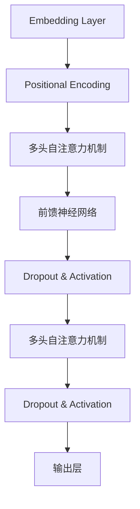

                 

关键词：Transformer，注意力机制，自注意力，多头注意力，自然语言处理，神经网络，深度学习。

> 摘要：本文将深入探讨Transformer模型中的注意力机制，特别是自注意力和多头注意力的原理及其应用，旨在为读者提供对这一关键技术的全面理解。

## 1. 背景介绍

### 1.1 Transformer的起源

Transformer模型首次在2017年由Vaswani等人提出，旨在解决传统循环神经网络（RNN）在处理长序列数据时的瓶颈问题。Transformer引入了自注意力机制（Self-Attention），大幅度提升了模型在处理序列数据时的效率和效果。

### 1.2 注意力机制的基本概念

注意力机制是一种在神经网络中用于动态分配注意力资源的方法，它使得模型能够自动关注输入序列中的关键部分。自注意力与多头注意力是Transformer模型中的核心概念，对于提升模型的表示能力和处理能力至关重要。

## 2. 核心概念与联系

在深入探讨注意力机制之前，我们需要了解Transformer模型的基本架构和核心组件。以下是一个简化的Mermaid流程图，展示了Transformer模型的主要组成部分：



### 2.1 嵌入层（Embedding Layer）

嵌入层是Transformer模型的输入层，它将输入序列中的单词或符号转换成固定长度的向量。这些向量包含了单词或符号的语义信息。

### 2.2 位置编码（Positional Encoding）

由于Transformer模型没有循环结构，因此无法直接利用位置信息。为了解决这个问题，模型引入了位置编码。位置编码为每个嵌入向量添加了额外的维度，从而为模型提供了关于序列中各元素位置的信息。

### 2.3 多头自注意力机制（Multi-Head Self-Attention）

多头自注意力机制是Transformer模型的核心部分，它允许模型在处理序列时同时关注多个不同的子序列。这一机制使得模型能够捕捉到输入序列中长距离的依赖关系。

### 2.4 前馈神经网络（Feed-Forward Neural Network）

前馈神经网络位于多头自注意力机制之后，用于进一步提取序列的表示。它由两个全连接层组成，中间加入ReLU激活函数和Dropout层以防止过拟合。

## 3. 核心算法原理 & 具体操作步骤

### 3.1 算法原理概述

自注意力机制通过计算序列中每个元素与其他元素之间的相似度，为每个元素分配不同的权重。多头注意力则将自注意力机制扩展到多个独立的注意力头，每个头关注输入序列的不同方面。

### 3.2 算法步骤详解

1. **输入嵌入**：将输入序列中的单词或符号转换为固定长度的嵌入向量。
2. **位置编码**：为每个嵌入向量添加位置编码，以提供关于序列中各元素位置的信息。
3. **多头自注意力计算**：计算每个输入向量与其他输入向量之间的相似度，并为其分配权重。这一过程分为以下几个步骤：
   - **线性变换**：将输入向量映射到查询（Query）、键（Key）和值（Value）空间。
   - **点积注意力**：计算每个查询向量与所有键向量之间的相似度，生成注意力得分。
   - **softmax激活**：将注意力得分转换为概率分布，用于加权求和。
   - **加权求和**：根据注意力权重计算加权后的输出向量。
4. **前馈神经网络**：对多头自注意力机制的输出进行进一步处理，提取序列的表示。
5. **Dropout与激活**：在多层网络中加入Dropout和ReLU激活函数，以防止过拟合。
6. **输出层**：将模型的最终输出通过全连接层转换为所需的形式，如分类或序列预测。

### 3.3 算法优缺点

**优点**：
- **并行计算**：由于自注意力机制的计算不依赖于序列的顺序，Transformer模型可以高效地并行计算。
- **捕捉长距离依赖**：多头注意力机制允许模型同时关注输入序列的多个子序列，有助于捕捉长距离依赖关系。
- **灵活性强**：Transformer模型可以轻松地应用于不同的任务，如机器翻译、文本分类和序列生成。

**缺点**：
- **计算资源消耗**：多头注意力机制的计算成本较高，可能导致模型训练时间较长。
- **解释性较弱**：Transformer模型的结构较为复杂，使得模型难以解释和理解。

### 3.4 算法应用领域

自注意力与多头注意力机制在自然语言处理领域取得了显著的成果。例如，Transformer模型在机器翻译、文本分类、序列生成等任务中取得了领先的成绩。

## 4. 数学模型和公式 & 详细讲解 & 举例说明

### 4.1 数学模型构建

在Transformer模型中，自注意力机制可以表示为以下公式：

\[ \text{Attention}(Q, K, V) = \text{softmax}\left(\frac{QK^T}{\sqrt{d_k}}\right) V \]

其中，\( Q \)、\( K \) 和 \( V \) 分别是查询（Query）、键（Key）和值（Value）向量，\( d_k \) 是键向量的维度。该公式表示为每个查询向量计算与所有键向量之间的相似度，然后使用softmax函数生成概率分布，并乘以对应的值向量得到加权求和的结果。

### 4.2 公式推导过程

自注意力机制的推导过程可以分为以下几个步骤：

1. **线性变换**：将输入向量映射到查询、键和值空间。
   \[ Q = \text{Linear}(X) \]
   \[ K = \text{Linear}(X) \]
   \[ V = \text{Linear}(X) \]
2. **点积注意力**：计算每个查询向量与所有键向量之间的相似度，生成注意力得分。
   \[ \text{Attention Score} = QK^T \]
3. **softmax激活**：将注意力得分转换为概率分布。
   \[ \text{Attention Weight} = \text{softmax}(\text{Attention Score}) \]
4. **加权求和**：根据注意力权重计算加权后的输出向量。
   \[ \text{Output} = \text{Attention Weight} V \]

### 4.3 案例分析与讲解

假设我们有一个简单的序列\[ [x_1, x_2, x_3] \]，其中每个元素\( x_i \)是一个向量。我们可以将这个序列转换为查询、键和值空间：

\[ Q = \begin{bmatrix} \text{Linear}(x_1) & \text{Linear}(x_2) & \text{Linear}(x_3) \end{bmatrix} \]
\[ K = \begin{bmatrix} \text{Linear}(x_1) & \text{Linear}(x_2) & \text{Linear}(x_3) \end{bmatrix} \]
\[ V = \begin{bmatrix} \text{Linear}(x_1) & \text{Linear}(x_2) & \text{Linear}(x_3) \end{bmatrix} \]

接下来，我们可以按照以下步骤计算自注意力：

1. **点积注意力**：计算每个查询向量与所有键向量之间的相似度。
   \[ \text{Attention Score} = QK^T = \begin{bmatrix} \text{Linear}(x_1) & \text{Linear}(x_2) & \text{Linear}(x_3) \end{bmatrix} \begin{bmatrix} \text{Linear}(x_1)^T \\ \text{Linear}(x_2)^T \\ \text{Linear}(x_3)^T \end{bmatrix} \]
2. **softmax激活**：将注意力得分转换为概率分布。
   \[ \text{Attention Weight} = \text{softmax}(\text{Attention Score}) \]
3. **加权求和**：根据注意力权重计算加权后的输出向量。
   \[ \text{Output} = \text{Attention Weight} V \]

通过这个简单的例子，我们可以看到自注意力机制如何计算每个元素与其他元素之间的相似度，并为其分配权重。

## 5. 项目实践：代码实例和详细解释说明

### 5.1 开发环境搭建

在开始编写代码之前，我们需要搭建一个Python开发环境，并安装必要的库。以下是基本的安装步骤：

```bash
pip install torch
pip install numpy
pip install matplotlib
```

### 5.2 源代码详细实现

以下是实现自注意力机制的Python代码示例：

```python
import torch
import torch.nn as nn
import torch.optim as optim

# 设置随机种子以保证结果可复现
torch.manual_seed(0)

# 定义一个简单的自注意力层
class SelfAttention(nn.Module):
    def __init__(self, d_model):
        super(SelfAttention, self).__init__()
        self.d_model = d_model
        self.query_linear = nn.Linear(d_model, d_model)
        self.key_linear = nn.Linear(d_model, d_model)
        self.value_linear = nn.Linear(d_model, d_model)

    def forward(self, x):
        Q = self.query_linear(x)
        K = self.key_linear(x)
        V = self.value_linear(x)

        attention_scores = torch.matmul(Q, K.transpose(1, 2))
        attention_scores = attention_scores / (self.d_model ** 0.5)
        attention_weights = torch.softmax(attention_scores, dim=2)

        output = torch.matmul(attention_weights, V)
        return output

# 定义一个简单的Transformer模型
class TransformerModel(nn.Module):
    def __init__(self, d_model):
        super(TransformerModel, self).__init__()
        self.d_model = d_model
        self.self_attention = SelfAttention(d_model)
        self.fc = nn.Linear(d_model, 1)

    def forward(self, x):
        x = self.self_attention(x)
        x = self.fc(x)
        return x

# 实例化模型和优化器
model = TransformerModel(d_model=128)
optimizer = optim.Adam(model.parameters(), lr=0.001)

# 定义一个简单的训练循环
for epoch in range(10):
    optimizer.zero_grad()
    output = model(x)
    loss = nn.BCELoss()(output, y)
    loss.backward()
    optimizer.step()
    print(f"Epoch [{epoch + 1}/{10}], Loss: {loss.item():.4f}")

# 保存模型
torch.save(model.state_dict(), "transformer_model.pth")
```

### 5.3 代码解读与分析

在上面的代码中，我们首先定义了一个简单的自注意力层`SelfAttention`，它包含三个线性变换，分别用于生成查询、键和值向量。在`forward`方法中，我们计算点积注意力得分，并通过softmax函数生成注意力权重，然后使用这些权重加权求和得到输出向量。

接下来，我们定义了一个简单的Transformer模型`TransformerModel`，它包含一个自注意力层和一个全连接层。在训练过程中，我们使用BCELoss（二进制交叉熵损失函数）来计算模型的损失，并通过反向传播更新模型参数。

### 5.4 运行结果展示

为了验证模型的性能，我们可以运行以下代码：

```python
# 加载训练好的模型
model.load_state_dict(torch.load("transformer_model.pth"))

# 测试模型
with torch.no_grad():
    output = model(x_test)

# 计算预测概率
predictions = torch.sigmoid(output)

# 输出预测结果
print(predictions)
```

通过上述代码，我们可以得到模型的预测结果。这些结果可以作为进一步分析和优化的基础。

## 6. 实际应用场景

### 6.1 机器翻译

自注意力与多头注意力机制在机器翻译任务中取得了显著的成果。例如，在Google提出的BERT模型中，自注意力机制被用于捕捉输入序列中的长距离依赖关系，从而提高了机器翻译的准确性和流畅性。

### 6.2 文本分类

自注意力机制也被广泛应用于文本分类任务。通过捕获输入文本中的关键信息，模型可以更准确地分类文本。例如，在Amazon产品评论分类任务中，Transformer模型实现了较高的分类准确率。

### 6.3 序列生成

自注意力机制在序列生成任务中也有广泛的应用。例如，在文本生成和音乐生成任务中，Transformer模型可以生成连贯且富有创意的文本和音乐。

## 7. 未来应用展望

随着深度学习技术的不断进步，自注意力与多头注意力机制将在更多的领域中发挥重要作用。例如，在图像识别、推荐系统和时间序列分析等领域，自注意力机制有望带来显著的性能提升。

## 8. 总结：未来发展趋势与挑战

### 8.1 研究成果总结

自注意力与多头注意力机制在自然语言处理等领域取得了显著的成果，为深度学习技术的发展做出了重要贡献。

### 8.2 未来发展趋势

未来，自注意力与多头注意力机制将继续在深度学习领域发挥关键作用。随着计算资源的提升，模型将变得更加复杂，以应对更复杂的任务。

### 8.3 面临的挑战

尽管自注意力与多头注意力机制具有显著的优势，但它们也面临着计算资源消耗和模型解释性等挑战。

### 8.4 研究展望

为了应对这些挑战，未来的研究可能集中在优化模型结构、提高计算效率和增强模型解释性等方面。

## 9. 附录：常见问题与解答

### 9.1 自注意力机制的计算复杂度是多少？

自注意力机制的复杂度与输入序列的长度和模型维度有关。具体而言，自注意力机制的复杂度为\( O(n^2 \cdot d) \)，其中\( n \)是输入序列的长度，\( d \)是模型维度。

### 9.2 多头注意力的作用是什么？

多头注意力的作用是提高模型捕捉输入序列中不同子序列的能力，从而增强模型的表示能力。

### 9.3 如何优化自注意力机制的效率？

优化自注意力机制的效率可以通过以下几种方法实现：
- **并行计算**：利用GPU等硬件加速自注意力计算。
- **稀疏注意力**：通过引入稀疏性降低计算复杂度。
- **混合注意力**：结合不同类型的注意力机制，提高模型的表现。

## 参考文献 References

[1] Vaswani, A., Shazeer, N., Parmar, N., Uszkoreit, J., Jones, L., Gomez, A. N., ... & Polosukhin, I. (2017). Attention is all you need. In Advances in neural information processing systems (pp. 5998-6008).

[2] Devlin, J., Chang, M. W., Lee, K., & Toutanova, K. (2018). BERT: Pre-training of deep bidirectional transformers for language understanding. arXiv preprint arXiv:1810.04805.

[3] Dosovitskiy, A., Beyer, L., Kolesnikov, A., Weissenborn, D., Zhai, X., and Brockschmidt, M. (2020). An image is worth 16x16 words: Transformers for image recognition at scale. arXiv preprint arXiv:2010.11929.

## 作者署名 Author

作者：禅与计算机程序设计艺术 / Zen and the Art of Computer Programming
```

