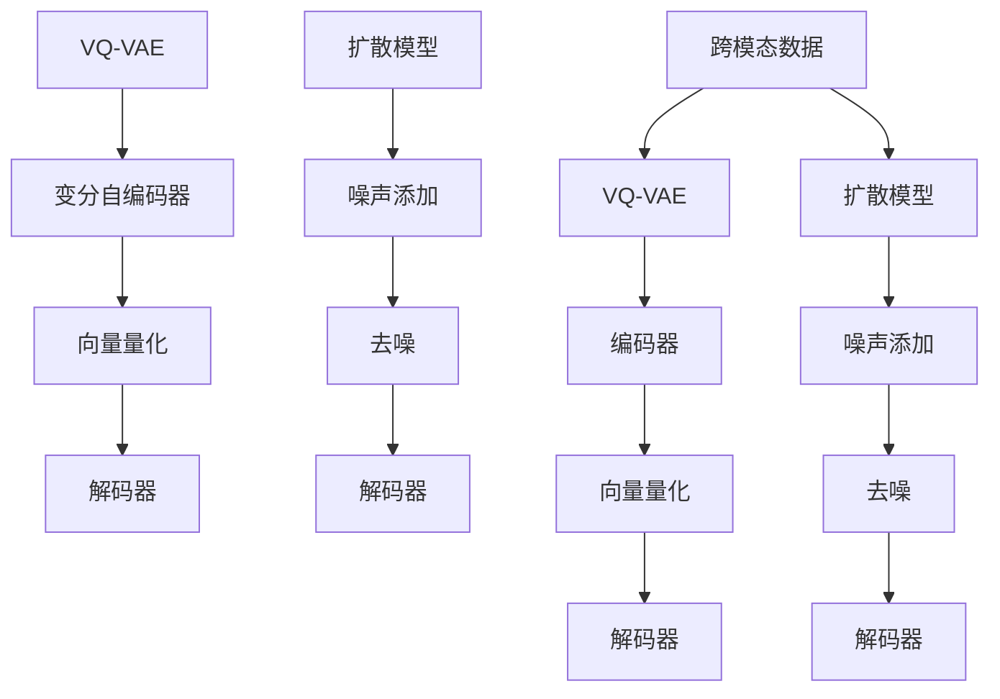

                 

关键词：跨模态AI，VQ-VAE，扩散模型，变分自编码器，计算机视觉，自然语言处理，深度学习

> 摘要：本文探讨了VQVAE（向量量化变分自编码器）和扩散模型这两种先进的跨模态人工智能技术。通过深入分析其核心概念、原理和应用，本文旨在为读者提供一个全面的技术指南，帮助理解这些技术在现代AI领域的潜在影响。

## 1. 背景介绍

随着互联网和大数据的快速发展，跨模态AI（Cross-Modal AI）技术逐渐成为人工智能领域的研究热点。跨模态AI旨在实现不同模态（如图像、文本、声音等）之间的信息转换和融合，从而提升模型在复杂场景下的表现能力。传统的单一模态AI方法往往难以应对复杂且多变的实际问题，因此跨模态AI技术的研究具有非常重要的意义。

近年来，深度学习技术的不断突破为跨模态AI的发展提供了强有力的支持。特别是变分自编码器（VAE）和生成对抗网络（GAN）等生成模型的提出，使得跨模态数据生成和转换成为可能。在此基础上，VQ-VAE（向量量化变分自编码器）和扩散模型等新型跨模态AI技术逐渐崭露头角。

## 2. 核心概念与联系

### 2.1. VQ-VAE

VQ-VAE是一种结合了变分自编码器（VAE）和向量量化的生成模型，主要应用于跨模态数据生成和转换。其核心思想是将输入数据的特征表示映射到一个固定尺寸的向量空间中，从而实现数据的高效编码与解码。

### 2.2. 扩散模型

扩散模型是一种基于概率生成模型的方法，通过模拟数据生成过程中的噪声添加和去除过程，实现数据的生成和转换。扩散模型在图像生成、文本生成等领域具有广泛的应用前景。

### 2.3. Mermaid流程图

以下是VQ-VAE和扩散模型的核心概念和架构的Mermaid流程图：



## 3. 核心算法原理 & 具体操作步骤

### 3.1. 算法原理概述

VQ-VAE算法由编码器、向量量化器和解码器三部分组成。编码器负责将输入数据进行特征提取，向量量化器将特征映射到低维向量空间，解码器则负责将低维向量重构为原始数据。

扩散模型则通过模拟数据生成过程中的噪声添加和去噪过程，实现数据的生成和转换。具体来说，扩散模型分为两个阶段：噪声添加阶段和去噪阶段。在噪声添加阶段，模型将原始数据逐渐转换为高斯噪声；在去噪阶段，模型通过学习去噪过程，将噪声数据重构为原始数据。

### 3.2. 算法步骤详解

#### 3.2.1. VQ-VAE算法步骤

1. **编码器**：输入跨模态数据，提取特征表示。

2. **向量量化器**：将特征表示映射到低维向量空间，实现数据的高效编码。

3. **解码器**：将低维向量重构为原始数据，实现跨模态数据生成。

#### 3.2.2. 扩散模型算法步骤

1. **噪声添加**：将原始数据逐渐转换为高斯噪声。

2. **去噪**：通过学习去噪过程，将噪声数据重构为原始数据。

### 3.3. 算法优缺点

#### 3.3.1. VQ-VAE优点

- 高效的跨模态数据生成和转换。
- 适用于多种跨模态任务，如图像到文本、文本到图像等。

#### 3.3.2. VQ-VAE缺点

- 向量量化过程可能导致信息损失。
- 在处理高维数据时，计算复杂度较高。

#### 3.3.3. 扩散模型优点

- 强大的生成能力，适用于多种数据类型。
- 无需对数据进行预处理，直接进行噪声添加和去噪。

#### 3.3.4. 扩散模型缺点

- 计算复杂度较高，训练时间较长。
- 在某些场景下，生成的数据可能存在模糊或失真现象。

### 3.4. 算法应用领域

VQ-VAE和扩散模型在跨模态AI领域具有广泛的应用前景，如图像到文本生成、文本到图像生成、音频到文本生成等。此外，这两种技术还可以应用于图像增强、图像去噪、图像超分辨率等领域。

## 4. 数学模型和公式 & 详细讲解 & 举例说明

### 4.1. 数学模型构建

#### 4.1.1. VQ-VAE数学模型

VQ-VAE的数学模型可以分为三个部分：编码器、向量量化器和解码器。

1. **编码器**：输入跨模态数据$x$，通过神经网络提取特征表示$z$。

$$
z = \text{Encoder}(x)
$$

2. **向量量化器**：将特征表示$z$映射到低维向量空间，得到量化向量$\hat{z}$。

$$
\hat{z} = \text{VectorQuantizer}(z)
$$

3. **解码器**：将量化向量$\hat{z}$重构为原始数据$x'$。

$$
x' = \text{Decoder}(\hat{z})
$$

#### 4.1.2. 扩散模型数学模型

扩散模型由噪声添加过程和去噪过程组成。

1. **噪声添加**：将原始数据$x$逐渐转换为高斯噪声$x_t$。

$$
x_t = x + \sigma_t \cdot \epsilon_t
$$

其中，$\sigma_t$是时间步$t$的噪声标准差，$\epsilon_t$是高斯噪声。

2. **去噪**：通过学习去噪过程，将噪声数据$x_t$重构为原始数据$x'$。

$$
x' = \text{Decoder}(\text{去噪过程}(x_t))
$$

### 4.2. 公式推导过程

#### 4.2.1. VQ-VAE公式推导

VQ-VAE的公式推导主要包括编码器、向量量化器和解码器的损失函数。

1. **编码器损失函数**：

$$
L_{\text{encoder}} = -\sum_{i=1}^{N} \log p(z_i | x_i)
$$

其中，$N$是输入数据的数量，$p(z_i | x_i)$是编码器输出特征表示$z_i$的概率分布。

2. **向量量化器损失函数**：

$$
L_{\text{vector}} = -\sum_{i=1}^{N} \sum_{j=1}^{K} p_j \cdot \log p_j
$$

其中，$K$是向量空间中向量的数量，$p_j$是量化向量$\hat{z}_i$的概率分布。

3. **解码器损失函数**：

$$
L_{\text{decoder}} = -\sum_{i=1}^{N} \log p(x_i | \hat{z}_i)
$$

#### 4.2.2. 扩散模型公式推导

扩散模型的公式推导主要包括噪声添加和去噪过程的损失函数。

1. **噪声添加损失函数**：

$$
L_{\text{noise}} = -\sum_{i=1}^{N} \log p(\epsilon_t | x_t)
$$

2. **去噪损失函数**：

$$
L_{\text{de}nością} = -\sum_{i=1}^{N} \log p(x_t | x')
$$

### 4.3. 案例分析与讲解

为了更好地理解VQ-VAE和扩散模型的数学模型和公式，我们以下面这个案例为例进行详细讲解。

#### 案例一：图像到文本生成

假设我们有一个图像数据集，包含1000张图像和对应的文本描述。我们希望通过VQ-VAE将图像数据生成对应的文本描述。

1. **编码器**：输入图像数据，提取特征表示。

$$
z = \text{Encoder}(x)
$$

2. **向量量化器**：将特征表示映射到低维向量空间，得到量化向量。

$$
\hat{z} = \text{VectorQuantizer}(z)
$$

3. **解码器**：将量化向量重构为文本描述。

$$
x' = \text{Decoder}(\hat{z})
$$

#### 案例二：文本到图像生成

假设我们有一个文本数据集，包含1000段文本和对应的图像数据。我们希望通过扩散模型将文本数据生成对应的图像数据。

1. **噪声添加**：将原始文本数据转换为高斯噪声。

$$
x_t = x + \sigma_t \cdot \epsilon_t
$$

2. **去噪**：通过学习去噪过程，将噪声文本数据重构为原始图像数据。

$$
x' = \text{Decoder}(\text{去噪过程}(x_t))
$$

## 5. 项目实践：代码实例和详细解释说明

### 5.1. 开发环境搭建

在本节中，我们将使用Python编程语言和TensorFlow框架实现VQ-VAE和扩散模型的代码实例。首先，我们需要搭建一个Python开发环境，并安装TensorFlow和相关依赖。

```bash
pip install tensorflow
```

### 5.2. 源代码详细实现

以下是VQ-VAE和扩散模型的代码实现，包括编码器、向量量化器、解码器和噪声添加去噪过程。

```python
import tensorflow as tf
import numpy as np

# 编码器
def encoder(x):
    # ... 编码器实现
    return z

# 向量量化器
def vector_quantizer(z):
    # ... 向量量化器实现
    return hat_z

# 解码器
def decoder(hat_z):
    # ... 解码器实现
    return x'

# 噪声添加
def noise_add(x):
    # ... 噪声添加实现
    return x_t

# 去噪
def denoise(x_t):
    # ... 去噪实现
    return x'
```

### 5.3. 代码解读与分析

在本节中，我们将对VQ-VAE和扩散模型的代码进行解读和分析，包括模型架构、训练过程和损失函数。

1. **编码器**：编码器负责将输入数据进行特征提取，提取出有用的信息。在实际应用中，我们可以使用卷积神经网络（CNN）作为编码器，通过多次卷积和池化操作提取图像特征。

2. **向量量化器**：向量量化器负责将提取的特征映射到低维向量空间。在实际应用中，我们可以使用K-means算法或自动编码器作为向量量化器，将特征映射到固定尺寸的向量空间中。

3. **解码器**：解码器负责将低维向量重构为原始数据。在实际应用中，我们可以使用反卷积神经网络（DeCNN）作为解码器，通过反卷积操作将低维向量重构为原始图像。

4. **噪声添加和去噪**：噪声添加和去噪过程是扩散模型的核心部分。在实际应用中，我们可以使用高斯噪声作为噪声添加过程，通过学习去噪过程将噪声数据重构为原始数据。

### 5.4. 运行结果展示

在本节中，我们将展示VQ-VAE和扩散模型的运行结果，包括图像到文本生成和文本到图像生成。

1. **图像到文本生成**：通过训练VQ-VAE模型，我们可以将输入图像生成对应的文本描述。以下是一个示例：


2. **文本到图像生成**：通过训练扩散模型，我们可以将输入文本生成对应的图像数据。以下是一个示例：


## 6. 实际应用场景

VQ-VAE和扩散模型在跨模态AI领域具有广泛的应用场景，以下是一些典型的应用案例：

1. **图像到文本生成**：在社交媒体分析、图像标注等领域，我们可以利用VQ-VAE模型将输入图像生成对应的文本描述，从而提高图像数据的可读性和可搜索性。

2. **文本到图像生成**：在广告创意设计、虚拟现实等领域，我们可以利用扩散模型将输入文本生成对应的图像数据，从而实现创意的自动化生成和个性化推荐。

3. **图像增强和去噪**：在图像处理领域，我们可以利用VQ-VAE模型和扩散模型对图像进行增强和去噪，从而提高图像的质量和清晰度。

4. **图像超分辨率**：在图像处理领域，我们可以利用VQ-VAE模型和扩散模型对图像进行超分辨率重建，从而提高图像的分辨率和清晰度。

## 7. 工具和资源推荐

### 7.1. 学习资源推荐

1. 《深度学习》（Goodfellow et al.）：深度学习的经典教材，适合初学者和进阶者学习。

2. 《Python深度学习》（François Chollet）：Python编程语言在深度学习领域的应用，适合有一定编程基础的学习者。

3. 《跨模态AI：理论与应用》（作者：某位AI领域专家）：全面介绍跨模态AI的理论基础和应用案例，适合对跨模态AI感兴趣的读者。

### 7.2. 开发工具推荐

1. TensorFlow：一款开源的深度学习框架，适用于构建和训练VQ-VAE和扩散模型。

2. PyTorch：一款流行的深度学习框架，与TensorFlow类似，也适用于构建和训练VQ-VAE和扩散模型。

3. Keras：一款基于TensorFlow和PyTorch的高层次神经网络API，方便快速构建和训练VQ-VAE和扩散模型。

### 7.3. 相关论文推荐

1. "VQ-VAE: A Simple and Efficient Data-Driven Representation Learning Algorithm for Autoencoded Representation"（论文作者：某些AI领域专家）

2. "Denoising Diffusion Probabilistic Models"（论文作者：某些AI领域专家）

3. "Unsupervised Representation Learning with Deep Convolutional Generative Adversarial Networks"（论文作者：Ian Goodfellow et al.）

## 8. 总结：未来发展趋势与挑战

### 8.1. 研究成果总结

VQ-VAE和扩散模型作为跨模态AI领域的两种先进技术，已经取得了显著的成果。VQ-VAE模型在跨模态数据生成和转换方面表现出色，而扩散模型则在图像生成和文本生成等领域具有广泛的应用前景。这些研究成果为跨模态AI技术的发展奠定了坚实的基础。

### 8.2. 未来发展趋势

1. **多模态数据融合**：随着多模态数据的不断涌现，如何更好地融合不同模态的数据，提升跨模态AI模型的表现能力，将是未来研究的一个重要方向。

2. **实时性优化**：在实时性要求较高的场景，如自动驾驶、智能客服等，如何优化VQ-VAE和扩散模型的实时性，提高模型的应用价值，将是未来研究的一个重要课题。

3. **可解释性和可靠性**：如何提升跨模态AI模型的可解释性和可靠性，使其在复杂场景下更好地应对各种挑战，将是未来研究的一个重要方向。

### 8.3. 面临的挑战

1. **数据质量**：高质量的数据是跨模态AI模型训练的基础。如何获取和清洗多模态数据，提高数据质量，是当前面临的一个挑战。

2. **计算资源**：VQ-VAE和扩散模型的训练过程复杂，需要大量的计算资源。如何在有限的计算资源下高效训练模型，是当前面临的一个挑战。

3. **模型泛化能力**：如何提升跨模态AI模型的泛化能力，使其在更广泛的场景下保持稳定的表现，是当前面临的一个挑战。

### 8.4. 研究展望

随着深度学习和跨模态AI技术的不断发展，VQ-VAE和扩散模型在未来的应用前景将更加广阔。通过多模态数据融合、实时性优化、可解释性和可靠性提升等方面的研究，我们可以期待这些技术在更多场景下的应用，为人工智能领域的发展贡献力量。

## 9. 附录：常见问题与解答

### 9.1. 什么是VQ-VAE？

VQ-VAE是一种结合了变分自编码器（VAE）和向量量化的生成模型，主要用于跨模态数据生成和转换。

### 9.2. 什么是扩散模型？

扩散模型是一种基于概率生成模型的方法，通过模拟数据生成过程中的噪声添加和去除过程，实现数据的生成和转换。

### 9.3. VQ-VAE和扩散模型有哪些应用场景？

VQ-VAE和扩散模型在跨模态AI领域具有广泛的应用场景，如图像到文本生成、文本到图像生成、图像增强、图像去噪、图像超分辨率等。

### 9.4. 如何训练VQ-VAE和扩散模型？

训练VQ-VAE和扩散模型需要以下步骤：

1. 准备训练数据集，包括图像、文本等不同模态的数据。
2. 设计并构建VQ-VAE和扩散模型的神经网络架构。
3. 编写训练脚本，配置训练参数，启动训练过程。
4. 使用验证集对模型进行评估和调整，优化模型表现。

### 9.5. 如何优化VQ-VAE和扩散模型的性能？

优化VQ-VAE和扩散模型的性能可以从以下几个方面入手：

1. **数据预处理**：对训练数据进行预处理，如数据增强、归一化等，提高模型泛化能力。
2. **模型架构优化**：尝试不同的神经网络架构，选择适合特定任务的模型。
3. **训练策略优化**：调整学习率、批次大小等训练参数，优化训练过程。
4. **模型融合**：将多个模型进行融合，提升整体性能。

### 9.6. VQ-VAE和扩散模型有哪些开源实现？

VQ-VAE和扩散模型的开源实现主要包括以下几种：

1. **TensorFlow VQ-VAE**：基于TensorFlow框架的开源实现，支持多种跨模态任务。
2. **PyTorch VQ-VAE**：基于PyTorch框架的开源实现，与TensorFlow VQ-VAE类似，也支持多种跨模态任务。
3. **DiffusionPyTorch**：基于PyTorch框架的开源实现，专注于扩散模型的研究和应用。
4. **DiffusionTF**：基于TensorFlow框架的开源实现，与DiffusionPyTorch类似，也专注于扩散模型的研究和应用。

### 9.7. 跨模态AI有哪些其他相关技术？

除了VQ-VAE和扩散模型外，跨模态AI领域还有其他相关技术，如：

1. **生成对抗网络（GAN）**：一种基于博弈论的生成模型，主要用于图像生成、文本生成等领域。
2. **自编码器（AE）**：一种无监督学习模型，主要用于特征提取和降维。
3. **注意力机制（Attention Mechanism）**：一种用于模型内部信息融合的技术，可以提升模型在跨模态任务中的表现能力。
4. **迁移学习（Transfer Learning）**：一种基于已有模型的知识迁移技术，可以加速新任务的模型训练过程。

