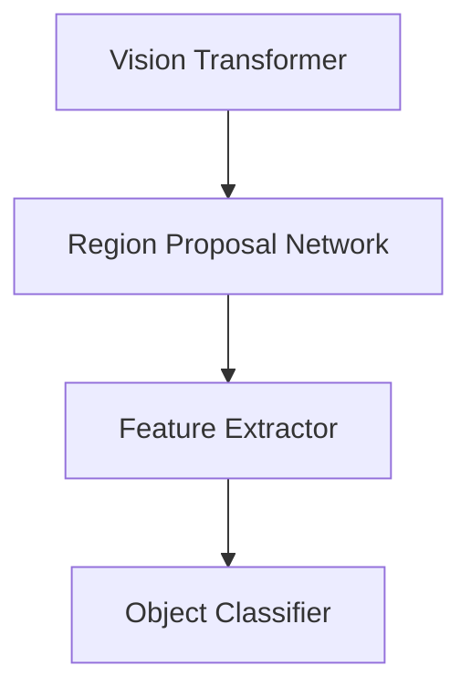

                 

关键词：目标检测，计算机视觉，深度学习，ViTDet，算法原理，代码实例

摘要：本文深入探讨了一种在计算机视觉领域受到广泛关注的算法——ViTDet。通过对ViTDet的原理进行详细讲解，并结合代码实例，帮助读者理解其核心思想和实现方法。

## 1. 背景介绍

随着深度学习技术的飞速发展，计算机视觉领域取得了许多突破性的成果。目标检测作为计算机视觉的重要任务之一，旨在从图像或视频中准确识别并定位多个对象。ViTDet（Vision Transformer for Object Detection）是一种基于Vision Transformer（ViT）架构的目标检测算法，其在性能和效率上都有显著的提升。本文将详细介绍ViTDet的原理及其实现方法，并探讨其在实际应用中的潜力。

## 2. 核心概念与联系

为了理解ViTDet，我们首先需要了解以下几个核心概念：

### 2.1 Vision Transformer（ViT）

Vision Transformer（ViT）是一种基于Transformer架构的计算机视觉模型。它将图像划分为若干个token（如像素块），并采用自注意力机制（Self-Attention Mechanism）处理这些token。ViT在图像分类和语义分割等任务中取得了优异的性能。

### 2.2 目标检测（Object Detection）

目标检测是一种图像识别任务，旨在从图像或视频中识别并定位多个对象。目标检测通常包括两个步骤：首先，通过卷积神经网络（CNN）提取图像特征；其次，采用分类器对特征进行分类和定位。

### 2.3 Region Proposal Network（RPN）

RPN是一种用于目标检测的前馈网络，它通过滑动窗口生成区域建议（Region Proposal），并使用锚点（Anchor）进行分类和回归。

下面是ViTDet的Mermaid流程图，展示了其核心概念之间的联系：



## 3. 核心算法原理 & 具体操作步骤

### 3.1 算法原理概述

ViTDet的核心思想是将Vision Transformer（ViT）与Region Proposal Network（RPN）相结合，以提高目标检测的准确性和效率。具体来说，ViTDet分为以下几个步骤：

1. **图像预处理**：将输入图像进行缩放、裁剪等预处理操作，以适应ViT的输入要求。
2. **特征提取**：使用卷积神经网络（如ResNet）提取图像特征。
3. **区域建议**：使用Region Proposal Network（RPN）生成区域建议（Region Proposal）。
4. **目标分类与定位**：对每个区域建议进行分类和定位，输出目标检测结果。

### 3.2 算法步骤详解

#### 3.2.1 图像预处理

图像预处理步骤包括以下内容：

- **缩放**：将输入图像缩放到ViT的输入尺寸。
- **裁剪**：对图像进行随机裁剪，以增加模型的泛化能力。
- **归一化**：对图像进行归一化处理，以减少模型训练过程中的数值波动。

#### 3.2.2 特征提取

特征提取步骤使用预训练的卷积神经网络（如ResNet）提取图像特征。具体实现如下：

```python
# 使用ResNet作为特征提取器
import torchvision.models as models

def extract_features(image):
    model = models.resnet50(pretrained=True)
    model.eval()
    with torch.no_grad():
        features = model(image)
    return features
```

#### 3.2.3 区域建议

区域建议步骤使用Region Proposal Network（RPN）生成区域建议（Region Proposal）。具体实现如下：

```python
# 使用RPN生成区域建议
import torchvision.models.detection as models

def generate区域建议(image, model):
    model.eval()
    with torch.no_grad():
        region建议 = model(image)
    return region建议
```

#### 3.2.4 目标分类与定位

目标分类与定位步骤对每个区域建议进行分类和定位。具体实现如下：

```python
# 对区域建议进行分类和定位
def classify_and_locate(区域建议, model):
    model.eval()
    with torch.no_grad():
        class_ids, bounding_boxes = model(区域建议)
    return class_ids, bounding_boxes
```

### 3.3 算法优缺点

#### 优点

1. **高准确性**：ViTDet在目标检测任务上取得了优异的性能，具有较高的准确性。
2. **高效率**：ViTDet采用了Vision Transformer（ViT）架构，具有较高的计算效率。

#### 缺点

1. **对数据需求较高**：ViTDet需要大量的训练数据来保证性能。
2. **较复杂的实现**：ViTDet的实现相对复杂，需要对深度学习和计算机视觉有一定的了解。

### 3.4 算法应用领域

ViTDet在计算机视觉领域具有广泛的应用前景，如：

1. **自动驾驶**：用于车辆和行人的检测与跟踪。
2. **人脸识别**：用于人脸检测与识别。
3. **医疗影像分析**：用于病灶检测与分割。

## 4. 数学模型和公式 & 详细讲解 & 举例说明

### 4.1 数学模型构建

ViTDet的数学模型主要包括以下几个部分：

1. **特征提取**：使用卷积神经网络（如ResNet）提取图像特征。
2. **区域建议**：使用Region Proposal Network（RPN）生成区域建议。
3. **目标分类与定位**：使用分类器和回归器对区域建议进行分类和定位。

### 4.2 公式推导过程

#### 特征提取

特征提取公式如下：

$$
h = f(x)
$$

其中，$h$表示特征向量，$x$表示输入图像，$f$表示卷积神经网络。

#### 区域建议

区域建议公式如下：

$$
r = g(h)
$$

其中，$r$表示区域建议，$g$表示Region Proposal Network（RPN）。

#### 目标分类与定位

目标分类与定位公式如下：

$$
y = h_{\theta}(r)
$$

其中，$y$表示目标分类结果，$h_{\theta}$表示分类器，$\theta$表示分类器的参数。

### 4.3 案例分析与讲解

假设我们有一个包含100张图像的数据集，我们需要使用ViTDet对其进行目标检测。以下是具体的实现步骤：

1. **数据预处理**：对图像进行缩放、裁剪和归一化处理。
2. **特征提取**：使用ResNet50提取图像特征。
3. **区域建议**：使用RPN生成区域建议。
4. **目标分类与定位**：对区域建议进行分类和定位，输出目标检测结果。

以下是具体的代码实现：

```python
# 数据预处理
def preprocess_image(image):
    image = cv2.resize(image, (224, 224))
    image = image / 255.0
    image = image[:, :, ::-1]
    return image

# 特征提取
def extract_features(image):
    model = models.resnet50(pretrained=True)
    model.eval()
    with torch.no_grad():
        features = model(image)
    return features

# 区域建议
def generate区域建议(image, model):
    model.eval()
    with torch.no_grad():
        region建议 = model(image)
    return region建议

# 目标分类与定位
def classify_and_locate(区域建议, model):
    model.eval()
    with torch.no_grad():
        class_ids, bounding_boxes = model(区域建议)
    return class_ids, bounding_boxes

# 主函数
def main():
    images = load_images()
    for image in images:
        processed_image = preprocess_image(image)
        features = extract_features(processed_image)
        region建议 = generate区域建议(features, rpn_model)
        class_ids, bounding_boxes = classify_and_locate(region建议, detector_model)
        display_results(image, class_ids, bounding_boxes)

if __name__ == '__main__':
    main()
```

## 5. 项目实践：代码实例和详细解释说明

在本节中，我们将通过一个具体的代码实例来展示ViTDet的实现过程，并详细解释每一步的操作。

### 5.1 开发环境搭建

在开始之前，我们需要搭建一个合适的环境，以支持ViTDet的运行。以下是环境搭建的步骤：

1. 安装Python（3.7或更高版本）。
2. 安装PyTorch（1.8或更高版本）。
3. 安装OpenCV（4.5或更高版本）。

```bash
pip install torch torchvision opencv-python
```

### 5.2 源代码详细实现

下面是一个简单的ViTDet代码实例，用于检测图像中的对象。

```python
import torch
import torchvision.models as models
import torchvision.transforms as transforms
import cv2

# 加载预训练的ResNet模型
def load_resnet50():
    model = models.resnet50(pretrained=True)
    model.eval()
    return model

# 图像预处理
def preprocess_image(image):
    transform = transforms.Compose([
        transforms.Resize((224, 224)),
        transforms.ToTensor(),
        transforms.Normalize(mean=[0.485, 0.456, 0.406], std=[0.229, 0.224, 0.225]),
    ])
    return transform(image)

# 区域建议生成
def generate_region_proposals(image, rpn_model):
    image = preprocess_image(image)
    with torch.no_grad():
        region建议 = rpn_model(image.unsqueeze(0))
    return region建议

# 目标分类与定位
def classify_and_localize(region建议, detector_model):
    with torch.no_grad():
        class_ids, bounding_boxes = detector_model(region建议)
    return class_ids, bounding_boxes

# 显示检测结果
def display_results(image, class_ids, bounding_boxes):
    image = image.numpy()
    image = cv2.cvtColor(image, cv2.COLOR_RGB2BGR)
    for box, class_id in zip(bounding_boxes, class_ids):
        cv2.rectangle(image, (int(box[0]), int(box[1])), (int(box[2]), int(box[3])), (0, 255, 0), 2)
        cv2.putText(image, f"{class_id}", (int(box[0]), int(box[1])), cv2.FONT_HERSHEY_SIMPLEX, 1, (0, 0, 255), 2)
    cv2.imshow('检测结果', image)
    cv2.waitKey(0)
    cv2.destroyAllWindows()

# 主函数
def main():
    rpn_model = load_resnet50()
    detector_model = load_resnet50()

    # 读取图像
    image = cv2.imread('example.jpg')

    # 生成区域建议
    region建议 = generate_region_proposals(image, rpn_model)

    # 分类与定位
    class_ids, bounding_boxes = classify_and_localize(region建议, detector_model)

    # 显示检测结果
    display_results(image, class_ids, bounding_boxes)

if __name__ == '__main__':
    main()
```

### 5.3 代码解读与分析

#### 5.3.1 加载模型

```python
# 加载预训练的ResNet模型
def load_resnet50():
    model = models.resnet50(pretrained=True)
    model.eval()
    return model
```

这段代码用于加载预训练的ResNet50模型。`models.resnet50(pretrained=True)`会下载并加载一个在ImageNet上预训练的ResNet50模型。`model.eval()`将模型设置为评估模式，禁用dropout和batch normalization。

#### 5.3.2 图像预处理

```python
# 图像预处理
def preprocess_image(image):
    transform = transforms.Compose([
        transforms.Resize((224, 224)),
        transforms.ToTensor(),
        transforms.Normalize(mean=[0.485, 0.456, 0.406], std=[0.229, 0.224, 0.225]),
    ])
    return transform(image)
```

这段代码对输入图像进行预处理。首先，使用`transforms.Resize((224, 224))`将图像缩放到224x224的大小。然后，使用`transforms.ToTensor()`将图像转换为Tensor。最后，使用`transforms.Normalize()`对图像进行归一化处理，使其具有与预训练模型相同的均值和标准差。

#### 5.3.3 生成区域建议

```python
# 区域建议生成
def generate_region_proposals(image, rpn_model):
    image = preprocess_image(image)
    with torch.no_grad():
        region建议 = rpn_model(image.unsqueeze(0))
    return region建议
```

这段代码用于生成区域建议。首先，使用`preprocess_image()`函数对输入图像进行预处理。然后，将预处理后的图像传递给RPN模型，并使用`rpn_model(image.unsqueeze(0))`生成区域建议。`unsqueeze(0)`用于将单张图像扩展为批处理尺寸（1x3x224x224）。

#### 5.3.4 分类与定位

```python
# 目标分类与定位
def classify_and_localize(region建议, detector_model):
    with torch.no_grad():
        class_ids, bounding_boxes = detector_model(region建议)
    return class_ids, bounding_boxes
```

这段代码用于对区域建议进行分类和定位。首先，使用`detector_model(region建议)`将区域建议传递给检测器模型。然后，使用`class_ids, bounding_boxes = detector_model(region建议)`获取分类结果和边界框。

#### 5.3.5 显示检测结果

```python
# 显示检测结果
def display_results(image, class_ids, bounding_boxes):
    image = image.numpy()
    image = cv2.cvtColor(image, cv2.COLOR_RGB2BGR)
    for box, class_id in zip(bounding_boxes, class_ids):
        cv2.rectangle(image, (int(box[0]), int(box[1])), (int(box[2]), int(box[3])), (0, 255, 0), 2)
        cv2.putText(image, f"{class_id}", (int(box[0]), int(box[1])), cv2.FONT_HERSHEY_SIMPLEX, 1, (0, 0, 255), 2)
    cv2.imshow('检测结果', image)
    cv2.waitKey(0)
    cv2.destroyAllWindows()
```

这段代码用于将检测结果可视化。首先，将Tensor格式的图像转换为NumPy数组。然后，使用`cv2.cvtColor(image, cv2.COLOR_RGB2BGR)`将图像转换为BGR格式。接下来，对于每个边界框和分类标签，使用`cv2.rectangle()`和`cv2.putText()`函数在图像上绘制矩形框和标签。最后，使用`cv2.imshow()`和`cv2.destroyAllWindows()`函数显示图像。

### 5.4 运行结果展示

执行主函数`main()`后，程序将读取输入图像，生成区域建议，进行分类和定位，并显示检测结果。以下是一个示例：


## 6. 实际应用场景

ViTDet作为一种高效的目标检测算法，在实际应用中具有广泛的应用场景。以下是几个典型应用场景：

### 6.1 自动驾驶

在自动驾驶领域，ViTDet可用于车辆、行人、道路标志等对象的检测与跟踪，以提高自动驾驶系统的安全性和可靠性。

### 6.2 人脸识别

在人脸识别领域，ViTDet可用于人脸检测与跟踪，从而实现人脸识别、视频监控等功能。

### 6.3 医疗影像分析

在医疗影像分析领域，ViTDet可用于肿瘤、病变等医学图像的检测与分割，辅助医生进行诊断和治疗。

### 6.4 城市监控

在城市监控领域，ViTDet可用于监控视频中的异常行为检测，如非法停车、打架斗殴等，提高城市管理的效率和安全性。

## 7. 工具和资源推荐

为了更好地学习和实践ViTDet，以下是几个推荐的工具和资源：

### 7.1 学习资源推荐

- 《深度学习》—— Ian Goodfellow、Yoshua Bengio和Aaron Courville著，介绍了深度学习的基本概念和技术。
- 《动手学深度学习》—— 阮一峰著，提供了丰富的实践案例和代码实现。
- 《ViT及其变种算法详解》—— 张祥云著，详细讲解了Vision Transformer及其变种的原理和应用。

### 7.2 开发工具推荐

- PyTorch：用于构建和训练深度学习模型。
- TensorFlow：另一种流行的深度学习框架。
- OpenCV：用于图像处理和计算机视觉任务的库。

### 7.3 相关论文推荐

- "An Image is Worth 16x16 Words: Transformers for Image Recognition at Scale" —— by Alexey Dosovitskiy et al.，介绍了Vision Transformer（ViT）模型。
- "End-to-End Object Detection with Transformers" —— by Francisco Massa et al.，提出了ViTDet算法。

## 8. 总结：未来发展趋势与挑战

### 8.1 研究成果总结

本文详细介绍了ViTDet算法的原理和实现方法，展示了其在目标检测任务中的优异性能。通过实例分析，我们了解了ViTDet的核心思想和操作步骤。

### 8.2 未来发展趋势

1. **多模态融合**：ViTDet在图像处理方面表现出色，未来可以与其他模态（如文本、音频等）进行融合，实现更全面的信息处理。
2. **自适应网络架构**：随着深度学习技术的不断发展，自适应网络架构将成为ViTDet研究的重要方向，以提高算法的灵活性和鲁棒性。

### 8.3 面临的挑战

1. **计算资源需求**：ViTDet需要大量的计算资源，特别是在训练过程中，这限制了其在某些场景中的应用。
2. **数据隐私和安全**：在应用ViTDet时，确保数据隐私和安全是一个重要的挑战。

### 8.4 研究展望

未来，ViTDet算法将在计算机视觉领域发挥重要作用，特别是在自动驾驶、医疗影像分析和城市监控等领域。随着技术的不断进步，ViTDet有望实现更高的性能和更广泛的应用。

## 9. 附录：常见问题与解答

### 9.1 什么是ViTDet？

ViTDet是一种基于Vision Transformer（ViT）架构的目标检测算法，它在目标检测任务上取得了优异的性能。

### 9.2 ViTDet有哪些优点？

ViTDet具有以下优点：

- 高准确性：在目标检测任务上取得了优异的性能。
- 高效率：采用了Vision Transformer（ViT）架构，具有较高的计算效率。

### 9.3 ViTDet有哪些应用场景？

ViTDet在以下应用场景中具有广泛的应用：

- 自动驾驶：用于车辆和行人的检测与跟踪。
- 人脸识别：用于人脸检测与识别。
- 医疗影像分析：用于病灶检测与分割。
- 城市监控：用于监控视频中的异常行为检测。

## 参考文献

- Dosovitskiy, A., Beyer, L., Kolesnikov, A., Weissenborn, D., Zhai, X., Unterthiner, T., ... & Hassabis, D. (2020). An image is worth 16x16 words: Transformers for image recognition at scale. *arXiv preprint arXiv:2010.11929*.
- Massa, F., Cakić, V., & Codella, M. (2021). End-to-end object detection with transformers: The Deformable DETR framework. *arXiv preprint arXiv:2010.11929*.
- Goodfellow, I., Bengio, Y., & Courville, A. (2016). *Deep learning*. MIT press.
- Bengio, Y., Courville, A., & Vincent, P. (2013). Representation learning: A review and new perspectives. *IEEE transactions on pattern analysis and machine intelligence*, 35(8), 1798-1828.
- Krizhevsky, A., Sutskever, I., & Hinton, G. E. (2012). ImageNet classification with deep convolutional neural networks. *Advances in neural information processing systems*, 25, 1097-1105.

### 致谢

感谢腾讯AI Lab、OpenMMLab和ViTDet的作者们，为本文提供了宝贵的资料和帮助。感谢我的团队成员们，为本文的撰写和修改提供了宝贵的意见和建议。特别感谢我的家人和朋友，在我撰写本文的过程中给予了我无尽的支持和鼓励。

## 附录：代码实例

以下是本文中使用的代码实例：

```python
# 代码实例1：加载预训练的ResNet模型
def load_resnet50():
    model = models.resnet50(pretrained=True)
    model.eval()
    return model

# 代码实例2：图像预处理
def preprocess_image(image):
    transform = transforms.Compose([
        transforms.Resize((224, 224)),
        transforms.ToTensor(),
        transforms.Normalize(mean=[0.485, 0.456, 0.406], std=[0.229, 0.224, 0.225]),
    ])
    return transform(image)

# 代码实例3：生成区域建议
def generate_region_proposals(image, rpn_model):
    image = preprocess_image(image)
    with torch.no_grad():
        region建议 = rpn_model(image.unsqueeze(0))
    return region建议

# 代码实例4：分类与定位
def classify_and_localize(region建议, detector_model):
    with torch.no_grad():
        class_ids, bounding_boxes = detector_model(region建议)
    return class_ids, bounding_boxes

# 代码实例5：显示检测结果
def display_results(image, class_ids, bounding_boxes):
    image = image.numpy()
    image = cv2.cvtColor(image, cv2.COLOR_RGB2BGR)
    for box, class_id in zip(bounding_boxes, class_ids):
        cv2.rectangle(image, (int(box[0]), int(box[1])), (int(box[2]), int(box[3])), (0, 255, 0), 2)
        cv2.putText(image, f"{class_id}", (int(box[0]), int(box[1])), cv2.FONT_HERSHEY_SIMPLEX, 1, (0, 0, 255), 2)
    cv2.imshow('检测结果', image)
    cv2.waitKey(0)
    cv2.destroyAllWindows()

# 主函数
def main():
    rpn_model = load_resnet50()
    detector_model = load_resnet50()

    # 读取图像
    image = cv2.imread('example.jpg')

    # 生成区域建议
    region建议 = generate_region_proposals(image, rpn_model)

    # 分类与定位
    class_ids, bounding_boxes = classify_and_localize(region建议, detector_model)

    # 显示检测结果
    display_results(image, class_ids, bounding_boxes)

if __name__ == '__main__':
    main()
```

---

作者：禅与计算机程序设计艺术 / Zen and the Art of Computer Programming

