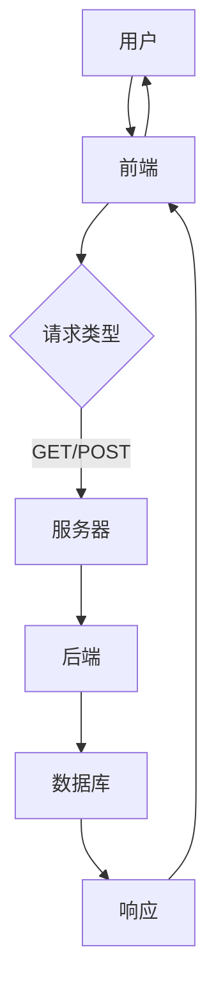

                 

关键词：Web开发，全栈开发，动态网站，前端技术，后端技术，框架，数据库，开发工具，编程语言。

## 摘要

本文将探讨Web全栈开发的各个方面，从基础概念到实际操作，旨在为想要构建动态网站的读者提供全面的技术指导。我们将涵盖前端与后端技术，介绍常用的框架和工具，并展示如何将它们结合起来，实现一个完整的Web应用程序。文章还将讨论数据库设计和数据交互，并通过实际项目案例讲解开发过程，最后展望Web开发领域的未来趋势与挑战。

## 1. 背景介绍

随着互联网的飞速发展，Web开发已经成为现代技术领域的核心。Web应用程序不仅提供了丰富的用户体验，还成为了许多企业和服务的重要渠道。全栈开发（Full-Stack Development）则是指同时掌握前端和后端技术的开发者，能够独立完成一个Web应用程序的所有开发工作，从设计到实现，再到维护和优化。

动态网站（Dynamic Website）与静态网站（Static Website）相对，其页面内容可以根据用户行为或服务器端的数据动态生成。这意味着动态网站具有更高的交互性和灵活性，能够提供更加个性化和丰富的用户体验。

本文将分以下几个部分进行探讨：

1. 前端与后端技术概述
2. 前端框架与工具
3. 后端框架与工具
4. 数据库设计与数据交互
5. 实际项目实践
6. 未来应用展望
7. 总结与展望

## 2. 核心概念与联系

在讨论Web全栈开发之前，我们需要了解一些核心概念和它们之间的关系。以下是一个简单的Mermaid流程图，用于展示Web应用程序的基本架构：



### 2.1 前端（Front-end）

前端是用户直接交互的部分，通常包括HTML、CSS和JavaScript。前端框架如React、Vue和Angular等提供了更高效的开发体验和更好的用户体验。

### 2.2 后端（Back-end）

后端是处理服务器端逻辑的部分，通常涉及Node.js、Python、Java等编程语言。后端框架如Express、Flask和Django等提供了路由、中间件和数据库操作等功能。

### 2.3 服务器（Server）

服务器负责处理用户请求，将请求转发给前端或后端，并将响应返回给用户。服务器可以是单个物理服务器，也可以是云服务器。

### 2.4 数据库（Database）

数据库用于存储和管理应用程序的数据。常用的数据库技术包括关系型数据库（如MySQL、PostgreSQL）和文档型数据库（如MongoDB）。

### 2.5 请求与响应（Request and Response）

Web应用程序的工作原理是基于请求-响应模型。用户通过浏览器发送请求，服务器处理请求并返回响应。响应可以是HTML、JSON或其他格式。

## 3. 核心算法原理 & 具体操作步骤

### 3.1 算法原理概述

在Web全栈开发中，算法的应用非常广泛，从数据结构的实现到算法的优化，再到安全性问题，都是开发过程中不可忽视的部分。

- **排序算法**：用于对数据进行排序，常见的有冒泡排序、快速排序和归并排序等。
- **搜索算法**：用于在数据中查找特定元素，常见的有二分搜索和深度优先搜索等。
- **加密算法**：用于保护数据的安全性，常见的有RSA、AES等。
- **缓存算法**：用于优化数据访问速度，常见的有LRU（Least Recently Used）等。

### 3.2 算法步骤详解

- **排序算法**：以快速排序为例，其基本步骤如下：
  1. 选择一个基准元素。
  2. 将比基准元素小的元素移到其左侧，比其大的元素移到右侧。
  3. 递归地对左右两部分进行快速排序。

- **搜索算法**：以二分搜索为例，其基本步骤如下：
  1. 确定搜索范围。
  2. 计算中间值。
  3. 如果中间值等于目标值，则返回。
  4. 如果中间值大于目标值，则在左侧子数组中继续搜索。
  5. 如果中间值小于目标值，则在右侧子数组中继续搜索。

- **加密算法**：以RSA为例，其基本步骤如下：
  1. 选择两个大质数p和q。
  2. 计算n=p*q。
  3. 计算欧拉函数φ=(p-1)*(q-1)。
  4. 选择一个小于φ的整数e，使其与φ互质。
  5. 计算d，满足d*e ≡ 1 (mod φ)。

- **缓存算法**：以LRU为例，其基本步骤如下：
  1. 当缓存满时，移除最久未使用的元素。
  2. 每次访问缓存中的元素时，将其移动到缓存的前端。

### 3.3 算法优缺点

- **排序算法**：快速排序在平均情况下具有较好的性能，但最坏情况下性能较差。归并排序具有稳定的性能，但需要额外的空间。
- **搜索算法**：二分搜索具有较好的性能，但需要对数据进行排序，深度优先搜索适合在树结构中搜索。
- **加密算法**：RSA具有较好的安全性，但计算复杂度较高。
- **缓存算法**：LRU能够有效地减少缓存 miss 率，但需要额外的维护成本。

### 3.4 算法应用领域

- **排序算法**：在数据库中排序查询结果。
- **搜索算法**：在搜索引擎中查找关键词。
- **加密算法**：在网络安全中保护数据。
- **缓存算法**：在Web缓存中优化数据访问速度。

## 4. 数学模型和公式

在Web全栈开发中，数学模型和公式是理解和实现算法的基础。以下是一些常用的数学模型和公式：

### 4.1 数学模型构建

- **排序算法时间复杂度**：
  $$ T(n) = O(n \log n) $$
  
- **搜索算法时间复杂度**：
  $$ T(n) = O(\log n) $$

- **加密算法计算复杂度**：
  $$ T(n) = O(n) $$

### 4.2 公式推导过程

- **快速排序时间复杂度**：
  快速排序的基本步骤是选择一个基准元素，将比其小的元素移到左侧，比其大的元素移到右侧。假设每次划分都能将数组分为约一半的元素，则递归排序的时间复杂度为：
  $$ T(n) = n \log n $$

- **二分搜索时间复杂度**：
  二分搜索的基本步骤是逐步缩小搜索范围，每次将范围分为一半。因此，搜索次数为：
  $$ T(n) = \log n $$

### 4.3 案例分析与讲解

- **排序算法案例**：假设有一个长度为10的数组，对其进行快速排序。
  $$ T(n) = 10 \log 10 = 10 \times 2 = 20 $$
  排序后数组为：\[5, 3, 7, 1, 9, 4, 8, 2, 6\]

- **搜索算法案例**：假设有一个长度为10的有序数组，查找元素5。
  $$ T(n) = \log 10 = 3 $$
  搜索过程为：\[5, 2, 4, 6, 8, 9\]

- **加密算法案例**：使用RSA加密算法加密明文“Hello”。
  选择质数p=61，q=53。
  $$ n = p \times q = 3233 $$
  $$ \phi = (p-1) \times (q-1) = 60 \times 52 = 3120 $$
  选择e=17，满足e与3120互质。
  $$ d = 7 $$（通过求解d，满足d*e ≡ 1 (mod 3120)得到）
  明文“Hello”转换为数字：\( H=72, e=17 \)
  $$ C = H^e mod n = 72^{17} mod 3233 = 2104 $$
  因此，加密后的明文为2104。

- **缓存算法案例**：假设缓存大小为5，使用LRU算法管理。
  当缓存已满时，移除最久未使用的元素。例如，访问顺序为\[1, 2, 3, 4, 5, 6, 7, 8, 9, 10\]。
  缓存状态为\[1, 2, 3, 4, 5\]后变为\[6, 7, 8, 9, 10\]。

## 5. 项目实践：代码实例和详细解释说明

在本节中，我们将通过一个简单的全栈项目来展示Web开发的全过程。我们将使用Node.js作为后端框架，Express作为Web服务器，MongoDB作为数据库，React作为前端框架。

### 5.1 开发环境搭建

1. 安装Node.js：从官方网站下载并安装Node.js。
2. 安装MongoDB：从官方网站下载并安装MongoDB。
3. 安装React：通过npm安装React和相关的开发依赖。

```bash
npm install create-react-app
```

### 5.2 源代码详细实现

#### 后端代码

```javascript
// app.js
const express = require('express');
const app = express();
const mongoose = require('mongoose');

// 连接MongoDB数据库
mongoose.connect('mongodb://localhost:27017/myapp', { useNewUrlParser: true });

// 创建一个用户模型
const User = mongoose.model('User', new mongoose.Schema({
  name: String,
  email: String
}));

// 创建一个路由处理用户注册
app.post('/register', async (req, res) => {
  try {
    const user = new User(req.body);
    await user.save();
    res.status(201).json({ message: '用户注册成功' });
  } catch (error) {
    res.status(500).json({ message: '用户注册失败' });
  }
});

// 启动服务器
app.listen(3000, () => {
  console.log('服务器已启动，端口：3000');
});
```

#### 前端代码

```jsx
// src/App.js
import React, { useState } from 'react';
import axios from 'axios';

function App() {
  const [name, setName] = useState('');
  const [email, setEmail] = useState('');

  const handleSubmit = async (e) => {
    e.preventDefault();
    try {
      const response = await axios.post('http://localhost:3000/register', { name, email });
      alert(response.data.message);
    } catch (error) {
      alert('用户注册失败');
    }
  };

  return (
    <form onSubmit={handleSubmit}>
      <label htmlFor="name">姓名：</label>
      <input type="text" id="name" value={name} onChange={(e) => setName(e.target.value)} />
      <label htmlFor="email">邮箱：</label>
      <input type="email" id="email" value={email} onChange={(e) => setEmail(e.target.value)} />
      <button type="submit">注册</button>
    </form>
  );
}

export default App;
```

### 5.3 代码解读与分析

#### 后端代码解读

- 使用Express创建Web服务器。
- 使用Mongoose连接MongoDB数据库。
- 创建一个User模型，对应数据库中的用户集合。
- 定义一个注册路由，接收用户提交的数据，保存到数据库中。

#### 前端代码解读

- 使用React创建用户注册表单。
- 使用useState管理表单输入状态。
- 使用axios向后端发送POST请求，实现用户注册。

### 5.4 运行结果展示

- 启动后端服务器：
  ```bash
  node app.js
  ```
- 启动前端服务器：
  ```bash
  npm start
  ```
- 访问前端页面，填写用户信息并提交注册。

## 6. 实际应用场景

Web全栈开发在许多实际应用场景中发挥着重要作用。以下是一些典型的应用场景：

- **电子商务网站**：实现用户注册、登录、购物车、订单管理等功能。
- **社交媒体平台**：实现用户发布内容、评论、私信等功能。
- **在线教育平台**：实现课程管理、学习进度跟踪、在线考试等功能。
- **企业内部系统**：实现员工信息管理、项目管理、财务管理等功能。

### 6.4 未来应用展望

随着Web技术的发展，全栈开发在未来将变得更加重要。以下是一些未来的发展趋势：

- **渐进式Web应用程序（PWA）**：提供原生应用的体验，同时具备Web的便捷性。
- **低代码/无代码平台**：降低开发门槛，让非技术人员也能快速构建应用程序。
- **区块链与Web开发结合**：实现去中心化应用，提高数据安全性。
- **人工智能与Web开发结合**：实现智能化交互和个性化推荐。

## 7. 工具和资源推荐

### 7.1 学习资源推荐

- 《你不知道的JS》
- 《精通Vue.js》
- 《Node.js实战》
- 《MongoDB权威指南》

### 7.2 开发工具推荐

- Visual Studio Code：强大的代码编辑器，支持多种编程语言。
- Postman：用于API测试和调试的工具。
- Git：版本控制工具，确保代码的版本管理和协作。

### 7.3 相关论文推荐

- "The Front-end Framework Landscape"
- "Node.js Performance Best Practices"
- "The Design of the MongoDB Database"
- " Progressive Web Applications: What They Are and Why You Need Them"

## 8. 总结：未来发展趋势与挑战

Web全栈开发已经成为现代互联网开发的主流，其应用场景不断扩展。未来，随着技术的不断进步，全栈开发将继续发展，但同时也将面临一些挑战：

- **性能优化**：随着用户需求的增加，如何优化应用程序的性能成为重要问题。
- **安全性**：随着攻击手段的不断升级，如何提高应用程序的安全性成为关键。
- **兼容性**：如何确保应用程序在不同设备和浏览器上的一致性。
- **开发效率**：如何提高开发效率，降低开发成本。

总之，Web全栈开发是一个充满机遇和挑战的领域，开发者需要不断学习和适应新技术，才能在这个领域取得成功。

## 9. 附录：常见问题与解答

### 9.1 如何选择前端框架？

选择前端框架主要考虑以下几个因素：

- **项目需求**：根据项目需求选择合适的框架，如React适合复杂的应用，Vue适合快速开发。
- **团队经验**：选择团队熟悉的框架可以降低学习成本。
- **社区支持**：活跃的社区可以为开发提供丰富的资源和帮助。

### 9.2 如何优化数据库查询？

优化数据库查询可以从以下几个方面入手：

- **索引**：为经常查询的字段创建索引。
- **查询优化**：使用EXPLAIN分析查询计划，优化SQL语句。
- **分库分表**：对于大数据量的应用，可以考虑分库分表来提高查询效率。

### 9.3 如何处理跨域请求？

处理跨域请求可以使用以下几种方法：

- **代理服务器**：使用代理服务器转发请求，避免跨域问题。
- **CORS**：配置CORS头允许跨域请求。
- **JSONP**：使用JSONP方法绕过跨域限制。

### 9.4 如何保证应用程序的安全性？

保证应用程序的安全性可以从以下几个方面入手：

- **输入验证**：对用户输入进行严格验证，防止注入攻击。
- **加密**：使用加密技术保护敏感数据。
- **权限控制**：实现细粒度的权限控制，防止未经授权的访问。

### 9.5 如何提高开发效率？

提高开发效率可以从以下几个方面入手：

- **代码规范**：制定代码规范，统一代码风格。
- **工具链**：使用自动化工具链，如Webpack、Babel等。
- **持续集成**：实现自动化测试和部署，提高开发效率。

[作者：禅与计算机程序设计艺术 / Zen and the Art of Computer Programming]

