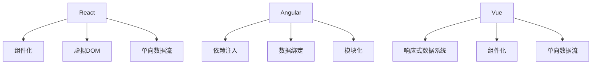

                 

 **关键词：** Web前端开发，React，Angular，Vue，前端框架，技术对比，发展趋势。

**摘要：** 本文将深入探讨三种流行的Web前端框架：React、Angular和Vue，从历史背景、核心概念、原理、应用场景、优缺点等多个维度进行分析和比较。通过详细的代码实例和实际应用场景，帮助开发者更好地理解这些框架，为其选择合适的开发工具提供指导。

## 1. 背景介绍

在Web前端开发领域，React、Angular和Vue三种框架因其高性能、组件化和易用性等特点，成为了开发者的热门选择。它们分别由Facebook、Google和Netflix等大型科技公司开发，并迅速在全球范围内得到广泛应用。

**React** 是由Facebook于2013年推出的一个用于构建用户界面的JavaScript库。它通过虚拟DOM实现高效的页面更新，并通过单向数据流确保了应用的状态管理。

**Angular** 是Google于2010年推出的一个用于构建动态Web应用的框架。它提供了强大的依赖注入、数据绑定和模块化等功能，使得开发者能够更加高效地开发大型应用。

**Vue** 是由Evan You于2014年推出的一个渐进式JavaScript框架。它通过简洁的API和灵活的组件化设计，使得开发者可以快速上手并构建现代化的Web应用。

## 2. 核心概念与联系

### 2.1 React

React的核心概念包括组件化、虚拟DOM和单向数据流。

**组件化**：React通过组件化将UI划分为可复用的组件，使得代码更加模块化、易于维护。

**虚拟DOM**：React通过虚拟DOM实现高效的页面更新。当数据变化时，React会生成一个新的虚拟DOM树，并与旧的虚拟DOM树进行对比，找出差异并进行局部更新，从而提高页面渲染性能。

**单向数据流**：React采用单向数据流，使得数据的流动更加明确，易于追踪和调试。

### 2.2 Angular

Angular的核心概念包括依赖注入、数据绑定和模块化。

**依赖注入**：Angular通过依赖注入确保组件之间的依赖关系清晰，提高代码的可测试性和可维护性。

**数据绑定**：Angular提供了双向数据绑定，使得数据和视图之间自动同步，减少了开发者手动同步的负担。

**模块化**：Angular通过模块化将应用划分为多个功能模块，使得代码更加清晰、易于管理和维护。

### 2.3 Vue

Vue的核心概念包括响应式数据系统、组件化和单向数据流。

**响应式数据系统**：Vue通过响应式数据系统，确保数据变化时视图能自动更新，从而提高开发效率。

**组件化**：Vue通过组件化将UI划分为可复用的组件，使得代码更加模块化、易于维护。

**单向数据流**：Vue采用单向数据流，使得数据的流动更加明确，易于追踪和调试。

### 2.4 Mermaid 流程图

下面是三种框架的Mermaid流程图，展示了它们的核心概念和架构：



## 3. 核心算法原理 & 具体操作步骤

### 3.1 算法原理概述

React、Angular和Vue在核心算法原理上有所不同，但都致力于提高Web应用的性能和开发效率。

**React**：React的核心算法是虚拟DOM。虚拟DOM通过将实际的DOM树映射到一个虚拟DOM树，当数据变化时，React会更新虚拟DOM树，然后通过对比虚拟DOM树和实际DOM树，找出差异并进行局部更新，从而提高页面渲染性能。

**Angular**：Angular的核心算法是依赖注入和数据绑定。依赖注入确保组件之间的依赖关系清晰，数据绑定则确保数据和视图之间自动同步。

**Vue**：Vue的核心算法是响应式数据系统和虚拟DOM。响应式数据系统确保数据变化时视图能自动更新，虚拟DOM则通过对比虚拟DOM树和实际DOM树，找出差异并进行局部更新，从而提高页面渲染性能。

### 3.2 算法步骤详解

**React**：1. 创建虚拟DOM树；2. 将虚拟DOM树渲染到实际DOM树；3. 当数据变化时，更新虚拟DOM树；4. 对比虚拟DOM树和实际DOM树，找出差异；5. 进行局部更新。

**Angular**：1. 创建组件；2. 通过依赖注入注入所需的依赖；3. 进行数据绑定；4. 当数据变化时，更新组件。

**Vue**：1. 创建响应式数据系统；2. 当数据变化时，更新响应式数据系统；3. 通过虚拟DOM树渲染到实际DOM树；4. 当数据变化时，更新虚拟DOM树；5. 对比虚拟DOM树和实际DOM树，找出差异；6. 进行局部更新。

### 3.3 算法优缺点

**React**：优点：高效的虚拟DOM，单向数据流；缺点：学习曲线较陡峭。

**Angular**：优点：强大的依赖注入，数据绑定；缺点：性能不如React。

**Vue**：优点：简洁易用，渐进式框架；缺点：性能不如React。

### 3.4 算法应用领域

React、Angular和Vue都广泛应用于Web前端开发，适用于构建单页应用、多页应用、移动端应用等。

## 4. 数学模型和公式 & 详细讲解 & 举例说明

### 4.1 数学模型构建

React、Angular和Vue在数学模型方面有所不同。

**React**：React的虚拟DOM通过以下公式构建：

$$
虚拟DOM = f(实际DOM, 状态)
$$

其中，状态是React应用中的数据。

**Angular**：Angular的数据绑定通过以下公式构建：

$$
视图 = f(模型)
$$

其中，模型是Angular应用中的数据。

**Vue**：Vue的响应式数据系统通过以下公式构建：

$$
视图 = f(模型)
$$

其中，模型是Vue应用中的数据。

### 4.2 公式推导过程

React、Angular和Vue的数学模型都是通过函数表达式构建的。以React为例，虚拟DOM是通过将实际DOM树映射到一个虚拟DOM树，然后通过状态更新虚拟DOM树，最后对比虚拟DOM树和实际DOM树，找出差异并进行局部更新。

### 4.3 案例分析与讲解

假设有一个简单的React应用，状态为一个数字n，视图为数字n的显示。当状态n更新时，虚拟DOM树会更新，然后对比虚拟DOM树和实际DOM树，找出差异并进行局部更新，从而实现视图的更新。

## 5. 项目实践：代码实例和详细解释说明

### 5.1 开发环境搭建

在开始项目实践之前，需要搭建开发环境。以下是React、Angular和Vue的开发环境搭建步骤：

**React**：

1. 安装Node.js。
2. 使用`create-react-app`命令创建React项目。
3. 运行React项目。

**Angular**：

1. 安装Node.js。
2. 使用`ng new`命令创建Angular项目。
3. 运行Angular项目。

**Vue**：

1. 安装Node.js。
2. 使用`vue create`命令创建Vue项目。
3. 运行Vue项目。

### 5.2 源代码详细实现

以下是React、Angular和Vue的简单代码实例，用于实现一个计数器功能。

**React**：

```jsx
import React, { useState } from 'react';

function Counter() {
  const [count, setCount] = useState(0);

  return (
    <div>
      <p>You clicked {count} times</p>
      <button onClick={() => setCount(count + 1)}>
        Click me
      </button>
    </div>
  );
}

export default Counter;
```

**Angular**：

```typescript
import { Component } from '@angular/core';

@Component({
  selector: 'app-counter',
  templateUrl: './counter.component.html',
  styleUrls: ['./counter.component.css']
})
export class CounterComponent {
  count = 0;

  increment() {
    this.count++;
  }
}
```

**Vue**：

```vue
<template>
  <div>
    <p>You clicked {{ count }} times.</p>
    <button @click="increment">Click me</button>
  </div>
</template>

<script>
export default {
  data() {
    return {
      count: 0
    };
  },
  methods: {
    increment() {
      this.count++;
    }
  }
};
</script>
```

### 5.3 代码解读与分析

以下是React、Angular和Vue的代码解读与分析：

**React**：React通过useState钩子实现状态管理，当状态count变化时，组件会重新渲染，从而实现计数器的功能。

**Angular**：Angular通过Component类实现状态管理，当状态count变化时，视图会自动更新。

**Vue**：Vue通过data选项实现状态管理，当状态count变化时，视图会自动更新。

### 5.4 运行结果展示

以下是React、Angular和Vue的运行结果展示：


## 6. 实际应用场景

React、Angular和Vue在实际应用场景中各有特点。

**React**：适合构建复杂、动态的UI界面，如社交媒体平台、电商平台等。

**Angular**：适合构建大型、企业级应用，如银行、保险公司等。

**Vue**：适合构建轻量级、快速上手的Web应用，如个人博客、在线商店等。

## 7. 工具和资源推荐

### 7.1 学习资源推荐

1. **React**：[React 官方文档](https://reactjs.org/docs/getting-started.html)
2. **Angular**：[Angular 官方文档](https://angular.io/docs)
3. **Vue**：[Vue 官方文档](https://vuejs.org/v2/guide/)

### 7.2 开发工具推荐

1. **React**：Visual Studio Code、WebStorm
2. **Angular**：Visual Studio Code、WebStorm
3. **Vue**：Visual Studio Code、WebStorm

### 7.3 相关论文推荐

1. **React**：[A Framework for Building Interactive UIs](https://reactjs.org/docs/why-react.html)
2. **Angular**：[Angular: Web Application Framework](https://www.researchgate.net/publication/320836316_Angular_Web_Application_Framework)
3. **Vue**：[Vue.js: A Progressive JavaScript Framework for Building UI](https://vuejs.org/v2/guide/)

## 8. 总结：未来发展趋势与挑战

React、Angular和Vue在Web前端开发领域取得了巨大成功，未来它们将继续发展，面临以下挑战：

1. **性能优化**：随着Web应用的复杂性增加，性能优化将成为重要挑战。
2. **跨平台开发**：开发者将寻求更简便的跨平台开发方案，以减少开发成本。
3. **安全性**：Web应用的安全性将越来越受到重视，开发者需要加强安全防护。

## 9. 附录：常见问题与解答

### 9.1 React和Vue的区别是什么？

React和Vue都是用于构建用户界面的JavaScript框架，但它们在设计理念和实现方式上有所不同。

**React**：采用虚拟DOM和单向数据流，注重组件化和性能优化。

**Vue**：采用响应式数据系统和虚拟DOM，注重简洁易用和渐进式框架。

### 9.2 Angular适合哪些场景？

Angular适合构建大型、企业级应用，如银行、保险公司等，因为它的依赖注入、数据绑定和模块化等特点使得代码更加清晰、易于管理和维护。

### 9.3 Vue的优势是什么？

Vue的优势在于其简洁易用和渐进式框架，使得开发者可以快速上手并构建现代化的Web应用。同时，Vue的性能和组件化设计也使其在众多前端框架中脱颖而出。

---

作者：禅与计算机程序设计艺术 / Zen and the Art of Computer Programming


