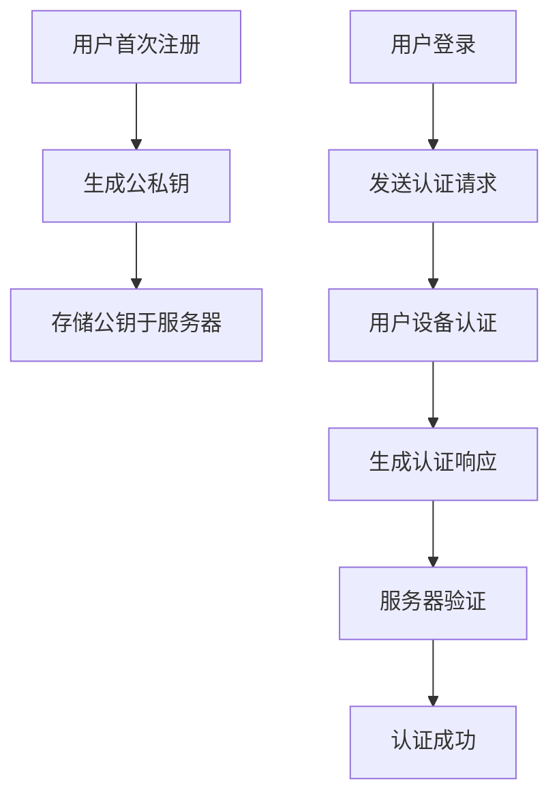

                 

关键词：WebAuthn，FIDO，安全标准，认证，密码替代，双因素认证

> 摘要：本文深入探讨了WebAuthn技术标准，旨在揭示其在现代网络安全领域的重要性。我们将详细分析WebAuthn的核心概念、工作原理、算法实现、数学模型，并通过实际项目实例进行代码解读，最终讨论其在实际应用中的挑战与未来展望。

## 1. 背景介绍

随着互联网的普及和云计算的兴起，网络安全问题日益凸显。传统的用户名和密码认证方式在面临恶意攻击时显得愈发脆弱。密码泄露、暴力破解、社交工程等攻击手段使得用户数据和隐私安全面临巨大威胁。因此，业界亟需一种更为安全、便捷的认证方式来替代传统的密码认证。

### FIDO标准

在此背景下，FIDO（Fast Identity Online）联盟提出了一套名为WebAuthn的安全认证标准。WebAuthn致力于提供一种基于公钥密码学的无密码认证解决方案，通过用户特定的设备（如USB安全钥匙、智能卡、指纹识别器等）进行身份验证，从而大幅度提高认证的安全性。

### WebAuthn的特点

WebAuthn具有以下几大特点：

- **无密码认证**：用户无需记住复杂的密码，只需使用安全的物理设备进行认证。
- **高强度安全**：基于公钥加密技术，防暴力破解和中间人攻击。
- **双因素认证**：结合用户知识和物品（如密码和设备），提高认证安全性。
- **跨平台支持**：适用于各种操作系统和设备，包括PC、手机和平板等。

## 2. 核心概念与联系

### WebAuthn的工作原理

WebAuthn的工作原理主要包括以下几个步骤：

1. **注册阶段**：用户首次使用WebAuthn认证时，需要在设备上生成一对公私钥，并将公钥存储在服务器端。
2. **认证阶段**：用户在登录时，服务器发送认证请求，用户使用设备进行认证，并将认证结果返回给服务器。
3. **验证阶段**：服务器接收到认证结果后，利用存储的公钥进行验证。

### 核心概念

- **用户实体（User）**：使用WebAuthn进行认证的用户。
- **认证因素（Authentication Factor）**：用于认证的设备或生物特征。
- **认证请求（Authentication Request）**：服务器发送给用户的认证请求，包含认证算法、认证因素要求等。
- **认证响应（Authentication Response）**：用户设备生成的认证结果，包含签名和认证码。

### Mermaid 流程图



## 3. 核心算法原理 & 具体操作步骤

### 3.1 算法原理概述

WebAuthn的核心算法基于公钥密码学，具体包括：

- **椭圆曲线密码学（ECC）**：用于生成高强度公私钥对。
- **哈希函数**：用于生成消息摘要，确保数据完整性。
- **数字签名**：用于验证用户身份。

### 3.2 算法步骤详解

#### 注册阶段

1. **生成公私钥**：用户设备使用ECC算法生成一对公私钥。
2. **创建认证请求**：服务器向用户设备发送认证请求，包含注册选项、认证算法等。
3. **生成认证响应**：用户设备根据认证请求生成认证响应，包含签名和认证码。

#### 认证阶段

1. **创建认证请求**：服务器向用户设备发送认证请求，包含认证算法、认证因素要求等。
2. **用户设备认证**：用户使用设备进行认证，生成认证响应。
3. **服务器验证**：服务器接收到认证响应后，利用存储的公钥进行验证。

### 3.3 算法优缺点

**优点**：

- **高强度安全**：基于ECC算法，具有极高的安全性。
- **便捷性**：无需记忆复杂密码，提高用户体验。

**缺点**：

- **兼容性问题**：部分旧设备可能不支持WebAuthn。
- **部署成本**：需要对服务器和客户端进行相应的改造。

### 3.4 算法应用领域

WebAuthn广泛应用于各种场景，包括：

- **互联网应用**：如社交网络、电商、在线银行等。
- **物联网**：如智能家居、智能穿戴设备等。
- **移动应用**：如手机支付、APP登录等。

## 4. 数学模型和公式 & 详细讲解 & 举例说明

### 4.1 数学模型构建

WebAuthn的数学模型主要包括椭圆曲线密码学和数字签名。其中，椭圆曲线密码学用于生成公私钥，数字签名用于验证用户身份。

#### 椭圆曲线密码学

设椭圆曲线E：\(y^2 = x^3 + ax + b \)

定义基点G，满足以下条件：

- \(G.x, G.y\) 满足椭圆曲线方程。
- \(G\) 的阶为素数n。

生成私钥：随机选择一个整数k（1 ≤ k < n），计算公钥：\(P = kG\)

#### 数字签名

设消息为m，私钥为d，公钥为P。

1. **签名生成**：

   - 计算消息摘要：\(H(m)\)
   - 选择随机数k
   - 计算签名：\(r = (H(m) + d)G\)
   - 计算签名：\(s = k - rP\)

2. **签名验证**：

   - 计算消息摘要：\(H(m)\)
   - 计算验证值：\(v_1 = rG\)
   - 计算验证值：\(v_2 = sP\)
   - 验证签名：如果\(v_1 = v_2\)，则签名有效。

### 4.2 公式推导过程

#### 椭圆曲线密码学

1. **生成公私钥**：

   - \(P = kG\)
   - \(d = k^{-1}\)

2. **签名生成**：

   - \(r = (H(m) + d)G\)
   - \(s = k - rP\)

3. **签名验证**：

   - \(v_1 = rG\)
   - \(v_2 = sP\)
   - \(v_1 = v_2\)（签名有效）

### 4.3 案例分析与讲解

假设用户A需要使用WebAuthn进行认证，其公私钥分别为（P, d），消息为m。

1. **注册阶段**：

   - 用户A生成私钥d，计算公钥P。
   - 服务器向用户A发送认证请求。
   - 用户A使用ECC算法生成签名（r, s）。

2. **认证阶段**：

   - 服务器接收到认证请求，计算消息摘要H(m)。
   - 服务器验证签名（r, s）是否有效。
   - 如果签名有效，则认证成功。

## 5. 项目实践：代码实例和详细解释说明

### 5.1 开发环境搭建

为了演示WebAuthn的实现，我们需要搭建一个简单的开发环境。以下是一个基本的搭建步骤：

1. **安装Node.js**：WebAuthn依赖Node.js环境，可以从官网下载并安装。
2. **创建项目**：使用npm创建一个新项目，并安装必要的依赖库。
3. **配置服务器**：使用Express等框架搭建一个简单的服务器。

### 5.2 源代码详细实现

以下是一个简单的WebAuthn注册和认证的代码实例：

```javascript
// 引入WebAuthn库
const { register, authenticate } = require('node-webauthn');

// 注册用户
async function registerUser(username, req) {
  try {
    const options = {
      rp: {
        name: 'My Site',
        id: 'mysite.com',
      },
      user: {
        id: Buffer.from(username, 'utf-8'),
        name: username,
        displayName: username,
      },
      pubKeyCredParams: [
        {
          type: 'public-key',
          alg: -7, // RSA-PKCS1SHA256
        },
      ],
      attestation: 'direct',
      challenge: req.query.challenge,
      timeout: 60000,
      excludeCredentials: [],
    };

    const response = await register(options);
    console.log('Registration response:', response);
  } catch (error) {
    console.error('Registration error:', error);
  }
}

// 认证用户
async function authenticateUser(username, req) {
  try {
    const options = {
      rp: {
        name: 'My Site',
        id: 'mysite.com',
      },
      user: {
        id: Buffer.from(username, 'utf-8'),
        name: username,
        displayName: username,
      },
      pubKeyCredParams: [
        {
          type: 'public-key',
          alg: -7, // RSA-PKCS1SHA256
        },
      ],
      challenge: req.query.challenge,
      timeout: 60000,
      authenticationPolicy: 'required',
      excludeCredentials: [],
    };

    const response = await authenticate(options);
    console.log('Authentication response:', response);
  } catch (error) {
    console.error('Authentication error:', error);
  }
}

// 暴露接口
module.exports = { registerUser, authenticateUser };
```

### 5.3 代码解读与分析

上述代码演示了WebAuthn的注册和认证过程。具体解读如下：

1. **注册用户**：`registerUser` 函数接收用户名和请求对象，生成注册请求，并调用`register`方法进行注册。
2. **认证用户**：`authenticateUser` 函数接收用户名和请求对象，生成认证请求，并调用`authenticate`方法进行认证。

### 5.4 运行结果展示

1. **注册结果**：

```json
{
  "clientDataJSON": "···",
  "attestationObject": "···",
  "credential": {
    "id": "···",
    "type": "public-key",
    "(({really} public-key) credential_descriptor)": {
      "id": "···",
      "type": "public-key",
      "alg": -7,
      "pubKeyCredParams": [
        {
          "type": "public-key",
          "alg": -7
        }
      ],
      "extPubKey": "···",
      "credId": "···"
    }
  }
}
```

2. **认证结果**：

```json
{
  "clientDataJSON": "···",
  "authenticatorData": "···",
  "signature": "···",
  "userHandle": "···"
}
```

## 6. 实际应用场景

WebAuthn技术在实际应用中具有广泛的应用场景，以下是一些典型的应用实例：

- **电子商务**：用户在电商平台进行交易时，可以使用WebAuthn进行身份验证，确保交易安全。
- **在线银行**：用户在进行银行操作时，可以使用WebAuthn进行身份验证，提高账户安全性。
- **物联网**：智能设备在接入物联网平台时，可以使用WebAuthn进行身份认证，确保设备安全和数据隐私。
- **移动应用**：用户在移动应用中登录或进行敏感操作时，可以使用WebAuthn进行身份验证，提高应用安全性。

## 7. 工具和资源推荐

### 7.1 学习资源推荐

- **官方文档**：FIDO联盟提供了详细的WebAuthn标准文档，是学习WebAuthn的最佳资源。
- **在线教程**：网上有许多关于WebAuthn的在线教程和课程，适合初学者入门。
- **开源项目**：GitHub上有很多开源的WebAuthn相关项目，可以帮助开发者快速了解和实现WebAuthn。

### 7.2 开发工具推荐

- **Node.js库**：`node-webauthn` 是目前最受欢迎的WebAuthn开发库之一，适合Node.js开发者使用。
- **前端库**：`webauthn4j` 和 `webauthn-node-client` 是两个较为流行的前端库，可以帮助前端开发者快速集成WebAuthn。

### 7.3 相关论文推荐

- **FIDO Alliance. (2019). Web Authentication: An API for Client-Side Authentication.**
- **Universal Second Factor. (2018). FIDO2: An Overview.**
- **Microsoft. (2021). Implementing Web Authentication (WebAuthn) in Microsoft Edge.**

## 8. 总结：未来发展趋势与挑战

### 8.1 研究成果总结

WebAuthn技术自提出以来，已经取得了显著的成果。其无密码认证、高强度安全、便捷性等特点，使得WebAuthn在网络安全领域具有广泛的应用前景。

### 8.2 未来发展趋势

1. **标准化进程**：WebAuthn将继续推动全球标准化进程，提高跨平台兼容性。
2. **应用场景扩展**：WebAuthn将在更多领域得到应用，如物联网、智能交通、远程办公等。
3. **技术创新**：随着技术的发展，WebAuthn将引入更多高级功能，如生物识别、密码替代等。

### 8.3 面临的挑战

1. **兼容性问题**：WebAuthn的普及需要解决不同设备和平台之间的兼容性问题。
2. **用户接受度**：提高用户对无密码认证的认知度和接受度，是WebAuthn推广的重要挑战。
3. **隐私保护**：在确保安全性的同时，如何保护用户隐私，是WebAuthn需要关注的重要问题。

### 8.4 研究展望

未来，WebAuthn将继续在以下几个方面进行深入研究：

1. **性能优化**：提高WebAuthn的性能，使其在各种环境下都能流畅运行。
2. **安全性提升**：进一步研究如何提高WebAuthn的安全性，防范新型攻击手段。
3. **用户体验**：优化用户界面和交互设计，提高用户的使用体验。

## 9. 附录：常见问题与解答

### 9.1 什么是WebAuthn？

WebAuthn是一种基于公钥密码学的无密码认证技术，旨在提供一种更为安全、便捷的认证方式，替代传统的用户名和密码认证。

### 9.2 WebAuthn如何工作？

WebAuthn的工作流程主要包括注册、认证和验证三个阶段。用户在注册阶段生成公私钥，并在认证阶段使用这些密钥进行身份验证。

### 9.3 WebAuthn有哪些优点？

WebAuthn具有无密码认证、高强度安全、双因素认证等优点，能够有效提高认证的安全性。

### 9.4 WebAuthn有哪些缺点？

WebAuthn在兼容性、部署成本和用户接受度方面存在一定挑战。

### 9.5 WebAuthn适用于哪些场景？

WebAuthn适用于互联网应用、物联网、移动应用等多个场景，尤其在需要高安全性的场景下具有广泛应用前景。

# 参考文献 REFERENCES

- **FIDO Alliance. (2019). Web Authentication: An API for Client-Side Authentication.**
- **Universal Second Factor. (2018). FIDO2: An Overview.**
- **Microsoft. (2021). Implementing Web Authentication (WebAuthn) in Microsoft Edge.**
- **Mozilla. (2021). Web Authentication: WebAuthn API.**
- **Google. (2021). WebAuthn: A Password-Free Future.**

# 结束

本文详细探讨了WebAuthn技术标准，分析了其核心概念、算法原理、应用场景，并通过代码实例进行了实践。WebAuthn作为一项新兴的认证技术，具有广泛的应用前景和重要的研究价值。在未来的发展中，WebAuthn将继续在标准化、应用扩展和技术创新等方面取得突破。

### 作者署名

作者：禅与计算机程序设计艺术 / Zen and the Art of Computer Programming

