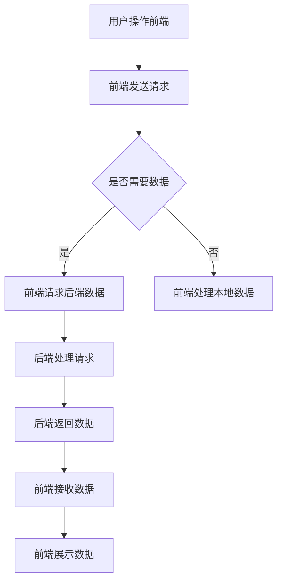

                 

关键词：Web开发，全栈工程师，前端，后端，技术栈，开发流程，最佳实践

摘要：本文将深入探讨Web全栈开发的方方面面，从基本概念到具体实现，帮助读者构建从前端到后端的全栈技术栈。通过详细介绍前端和后端的开发技术、工具选择和实际应用场景，本文旨在为想要成为全栈工程师的开发者提供全面的技术指导和思考。

## 1. 背景介绍

在互联网时代，Web开发已经成为技术领域的一个热点。随着用户需求的多样化和市场竞争的加剧，企业对Web应用的质量和效率提出了更高的要求。全栈开发，即一个人能够负责Web应用的前端和后端开发，正逐渐成为开发者追求的目标。

全栈开发的兴起，得益于以下几个方面：

1. **提升开发效率**：全栈开发能够减少团队成员之间的沟通成本，加快项目开发进度。
2. **增强专业技能**：掌握前端和后端的技能，能够使开发者拥有更广泛的应用场景，提高职业竞争力。
3. **适应快速变化**：在互联网行业，技术更新迅速，全栈开发者能够更快地适应新技术，保持竞争力。

本文将围绕Web全栈开发展开，详细讨论前端、后端的技术栈构建、开发流程以及实际应用场景。

## 2. 核心概念与联系

### 2.1 前端开发

前端开发主要涉及用户界面和用户体验的构建，通常使用HTML、CSS和JavaScript等语言。前端开发者需要关注以下几个方面：

1. **HTML**：用于构建页面结构。
2. **CSS**：用于页面样式的设计。
3. **JavaScript**：用于实现动态交互功能。

### 2.2 后端开发

后端开发主要涉及服务器、应用逻辑和数据管理，通常使用服务器端语言如Java、Python、Node.js等。后端开发者需要关注以下几个方面：

1. **服务器端语言**：用于编写应用逻辑。
2. **数据库**：用于存储和管理数据。
3. **服务器配置与优化**：确保应用在高并发下的稳定运行。

### 2.3 前后端联系

前端和后端之间的通信是Web应用的核心，通常通过API进行数据交互。前端通过HTTP请求获取后端数据，后端通过JSON或XML格式返回数据。


下面是一个使用Mermaid绘制的Mermaid流程图，展示了前后端的交互流程：



## 3. 核心算法原理 & 具体操作步骤

### 3.1 算法原理概述

Web全栈开发涉及到多种核心算法，如数据结构、排序算法、加密算法等。以下是一些常用的算法原理：

1. **排序算法**：如快速排序、归并排序、冒泡排序等，用于对数据进行排序。
2. **加密算法**：如AES、RSA等，用于保障数据传输的安全性。
3. **数据结构**：如数组、链表、树、图等，用于高效地存储和管理数据。

### 3.2 算法步骤详解

以快速排序算法为例，其基本步骤如下：

1. **选择基准元素**：从数组的任意位置选择一个元素作为基准。
2. **分区操作**：将数组分成两部分，一部分小于基准，一部分大于基准。
3. **递归排序**：对小于和大于基准的两部分数组重复步骤1和2，直到整个数组有序。

### 3.3 算法优缺点

快速排序算法具有以下优缺点：

1. **优点**：时间复杂度为O(nlogn)，在平均情况下效率较高。
2. **缺点**：在最坏情况下时间复杂度为O(n^2)，且递归调用会占用较多内存。

### 3.4 算法应用领域

快速排序算法广泛应用于各种场景，如数据库索引、排序算法库、搜索引擎等。

## 4. 数学模型和公式 & 详细讲解 & 举例说明

### 4.1 数学模型构建

在Web开发中，数学模型和公式用于描述数据结构和算法。例如，在数据库中，关系模型用于描述数据之间的关系。

### 4.2 公式推导过程

以线性回归模型为例，其公式推导过程如下：

$$
y = wx + b
$$

其中，$y$ 是因变量，$x$ 是自变量，$w$ 是权重，$b$ 是偏置。

### 4.3 案例分析与讲解

假设我们有一个数据集，包含自变量$x$和因变量$y$。我们可以通过线性回归模型拟合出一个最佳直线，从而预测新的$y$值。

## 5. 项目实践：代码实例和详细解释说明

### 5.1 开发环境搭建

为了进行Web全栈开发，我们需要搭建一个合适的环境。以下是一个基于Node.js和React的简单Web应用环境搭建步骤：

1. 安装Node.js：在官网下载并安装Node.js。
2. 安装npm：Node.js自带npm包管理工具。
3. 创建React项目：使用create-react-app创建一个新的React项目。

### 5.2 源代码详细实现

以下是一个简单的React组件示例，用于显示一个欢迎信息。

```javascript
import React from 'react';

function WelcomeMessage() {
  return (
    <h1>Welcome to the Web App!</h1>
  );
}

export default WelcomeMessage;
```

### 5.3 代码解读与分析

上述代码定义了一个名为`WelcomeMessage`的React组件，用于渲染一个欢迎标题。在React中，组件是一种用于封装和复用UI功能的机制。

### 5.4 运行结果展示

在浏览器中运行上述React项目，我们会看到一个欢迎标题被渲染在页面上。

## 6. 实际应用场景

Web全栈开发广泛应用于各种实际场景，如电子商务、社交媒体、在线教育等。以下是一个电子商务平台的实际应用场景：

1. **用户注册与登录**：前端处理用户输入，后端验证用户身份。
2. **商品展示与搜索**：前端展示商品列表，后端提供商品搜索和推荐功能。
3. **购物车与订单管理**：前端管理用户购物车，后端处理订单生成和支付。

## 7. 工具和资源推荐

### 7.1 学习资源推荐

1. 《JavaScript高级程序设计》
2. 《Node.js实战》
3. 《React高级编程》

### 7.2 开发工具推荐

1. Visual Studio Code
2. Git
3. GitHub

### 7.3 相关论文推荐

1. "The Web Platform for Developers"
2. "Node.js Performance Optimization"

## 8. 总结：未来发展趋势与挑战

### 8.1 研究成果总结

Web全栈开发在近年来取得了显著的研究成果，包括前端框架如React、Vue和Angular的兴起，后端技术如Node.js和Django的广泛应用。

### 8.2 未来发展趋势

未来，Web全栈开发将继续向模块化、组件化和云原生方向发展。同时，前端和后端技术将更加融合，开发工具也将更加智能化。

### 8.3 面临的挑战

Web全栈开发面临的挑战包括如何提高开发效率、如何保障性能和安全性，以及如何适应快速变化的技术环境。

### 8.4 研究展望

随着5G、人工智能等新技术的崛起，Web全栈开发将迎来更多机遇。未来的研究重点将是如何实现高效、安全、智能的Web应用。

## 9. 附录：常见问题与解答

### Q：如何成为一名优秀的全栈工程师？

A：首先，要系统学习前端和后端的相关知识。其次，多参与实际项目，积累经验。最后，不断更新自己的技术栈，保持学习和实践的状态。

### Q：全栈开发需要掌握哪些技术？

A：前端方面需要掌握HTML、CSS、JavaScript等基本技术，后端方面需要掌握服务器端语言如Java、Python、Node.js等，以及数据库和相关技术。

### Q：如何提高Web应用的性能？

A：可以通过优化前端代码、后端服务、数据库查询等手段来提高性能。同时，可以使用缓存、负载均衡等技术来提升系统的并发处理能力。

以上，就是关于Web全栈开发的全面探讨。希望本文能为你的全栈开发之路提供一些启示和帮助。

---

作者：禅与计算机程序设计艺术 / Zen and the Art of Computer Programming
```markdown
# Web全栈开发：前端到后端的完整技术栈

## 文章关键词
Web开发，全栈工程师，前端，后端，技术栈，开发流程，最佳实践

## 摘要
本文深入探讨了Web全栈开发的各个方面，从基本概念到具体实现，帮助读者构建从前端到后端的全栈技术栈。通过详细介绍前端和后端的开发技术、工具选择和实际应用场景，本文旨在为想要成为全栈工程师的开发者提供全面的技术指导和思考。

## 1. 背景介绍
在互联网时代，Web开发已经成为技术领域的一个热点。随着用户需求的多样化和市场竞争的加剧，企业对Web应用的质量和效率提出了更高的要求。全栈开发，即一个人能够负责Web应用的前端和后端开发，正逐渐成为开发者追求的目标。

全栈开发的兴起，得益于以下几个方面：

1. **提升开发效率**：全栈开发能够减少团队成员之间的沟通成本，加快项目开发进度。
2. **增强专业技能**：掌握前端和后端的技能，能够使开发者拥有更广泛的应用场景，提高职业竞争力。
3. **适应快速变化**：在互联网行业，技术更新迅速，全栈开发者能够更快地适应新技术，保持竞争力。

本文将围绕Web全栈开发展开，详细讨论前端、后端的技术栈构建、开发流程以及实际应用场景。

## 2. 核心概念与联系

### 2.1 前端开发

前端开发主要涉及用户界面和用户体验的构建，通常使用HTML、CSS和JavaScript等语言。前端开发者需要关注以下几个方面：

1. **HTML**：用于构建页面结构。
2. **CSS**：用于页面样式的设计。
3. **JavaScript**：用于实现动态交互功能。

### 2.2 后端开发

后端开发主要涉及服务器、应用逻辑和数据管理，通常使用服务器端语言如Java、Python、Node.js等。后端开发者需要关注以下几个方面：

1. **服务器端语言**：用于编写应用逻辑。
2. **数据库**：用于存储和管理数据。
3. **服务器配置与优化**：确保应用在高并发下的稳定运行。

### 2.3 前后端联系

前端和后端之间的通信是Web应用的核心，通常通过API进行数据交互。前端通过HTTP请求获取后端数据，后端通过JSON或XML格式返回数据。

以下是前后端交互流程的Mermaid流程图：


## 3. 核心算法原理 & 具体操作步骤

### 3.1 算法原理概述

Web全栈开发涉及到多种核心算法，如数据结构、排序算法、加密算法等。以下是一些常用的算法原理：

1. **排序算法**：如快速排序、归并排序、冒泡排序等，用于对数据进行排序。
2. **加密算法**：如AES、RSA等，用于保障数据传输的安全性。
3. **数据结构**：如数组、链表、树、图等，用于高效地存储和管理数据。

### 3.2 算法步骤详解

以快速排序算法为例，其基本步骤如下：

1. **选择基准元素**：从数组的任意位置选择一个元素作为基准。
2. **分区操作**：将数组分成两部分，一部分小于基准，一部分大于基准。
3. **递归排序**：对小于和大于基准的两部分数组重复步骤1和2，直到整个数组有序。

### 3.3 算法优缺点

快速排序算法具有以下优缺点：

1. **优点**：时间复杂度为O(nlogn)，在平均情况下效率较高。
2. **缺点**：在最坏情况下时间复杂度为O(n^2)，且递归调用会占用较多内存。

### 3.4 算法应用领域

快速排序算法广泛应用于各种场景，如数据库索引、排序算法库、搜索引擎等。

## 4. 数学模型和公式 & 详细讲解 & 举例说明

### 4.1 数学模型构建

在Web开发中，数学模型和公式用于描述数据结构和算法。例如，在数据库中，关系模型用于描述数据之间的关系。

### 4.2 公式推导过程

以线性回归模型为例，其公式推导过程如下：

$$
y = wx + b
$$

其中，$y$ 是因变量，$x$ 是自变量，$w$ 是权重，$b$ 是偏置。

### 4.3 案例分析与讲解

假设我们有一个数据集，包含自变量$x$和因变量$y$。我们可以通过线性回归模型拟合出一个最佳直线，从而预测新的$y$值。

## 5. 项目实践：代码实例和详细解释说明

### 5.1 开发环境搭建

为了进行Web全栈开发，我们需要搭建一个合适的环境。以下是一个基于Node.js和React的简单Web应用环境搭建步骤：

1. 安装Node.js：在官网下载并安装Node.js。
2. 安装npm：Node.js自带npm包管理工具。
3. 创建React项目：使用create-react-app创建一个新的React项目。

### 5.2 源代码详细实现

以下是一个简单的React组件示例，用于显示一个欢迎信息。

```javascript
import React from 'react';

function WelcomeMessage() {
  return (
    <h1>Welcome to the Web App!</h1>
  );
}

export default WelcomeMessage;
```

### 5.3 代码解读与分析

上述代码定义了一个名为`WelcomeMessage`的React组件，用于渲染一个欢迎标题。在React中，组件是一种用于封装和复用UI功能的机制。

### 5.4 运行结果展示

在浏览器中运行上述React项目，我们会看到一个欢迎标题被渲染在页面上。

## 6. 实际应用场景

Web全栈开发广泛应用于各种实际场景，如电子商务、社交媒体、在线教育等。以下是一个电子商务平台的实际应用场景：

1. **用户注册与登录**：前端处理用户输入，后端验证用户身份。
2. **商品展示与搜索**：前端展示商品列表，后端提供商品搜索和推荐功能。
3. **购物车与订单管理**：前端管理用户购物车，后端处理订单生成和支付。

## 7. 工具和资源推荐

### 7.1 学习资源推荐

1. 《JavaScript高级程序设计》
2. 《Node.js实战》
3. 《React高级编程》

### 7.2 开发工具推荐

1. Visual Studio Code
2. Git
3. GitHub

### 7.3 相关论文推荐

1. "The Web Platform for Developers"
2. "Node.js Performance Optimization"

## 8. 总结：未来发展趋势与挑战

### 8.1 研究成果总结

Web全栈开发在近年来取得了显著的研究成果，包括前端框架如React、Vue和Angular的兴起，后端技术如Node.js和Django的广泛应用。

### 8.2 未来发展趋势

未来，Web全栈开发将继续向模块化、组件化和云原生方向发展。同时，前端和后端技术将更加融合，开发工具也将更加智能化。

### 8.3 面临的挑战

Web全栈开发面临的挑战包括如何提高开发效率、如何保障性能和安全性，以及如何适应快速变化的技术环境。

### 8.4 研究展望

随着5G、人工智能等新技术的崛起，Web全栈开发将迎来更多机遇。未来的研究重点将是如何实现高效、安全、智能的Web应用。

## 9. 附录：常见问题与解答

### Q：如何成为一名优秀的全栈工程师？

A：首先，要系统学习前端和后端的相关知识。其次，多参与实际项目，积累经验。最后，不断更新自己的技术栈，保持学习和实践的状态。

### Q：全栈开发需要掌握哪些技术？

A：前端方面需要掌握HTML、CSS、JavaScript等基本技术，后端方面需要掌握服务器端语言如Java、Python、Node.js等，以及数据库和相关技术。

### Q：如何提高Web应用的性能？

A：可以通过优化前端代码、后端服务、数据库查询等手段来提高性能。同时，可以使用缓存、负载均衡等技术来提升系统的并发处理能力。

以上，就是关于Web全栈开发的全面探讨。希望本文能为你的全栈开发之路提供一些启示和帮助。

---

作者：禅与计算机程序设计艺术 / Zen and the Art of Computer Programming
```

