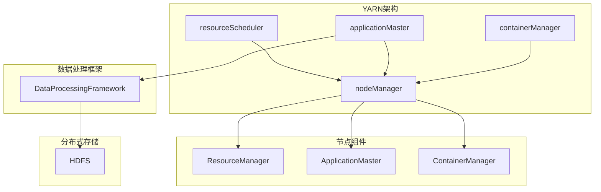

                 

  
## 1. 背景介绍

在现代互联网应用中，数据传输和内容分发是一个至关重要的环节。随着网络应用的复杂度和用户量的增长，传统的数据传输和分发方式已经无法满足高效、可靠的要求。Yarn作为一款分布式资源调度和管理框架，正是为了解决这一难题而诞生的。

Yarn（Yet Another Resource Negotiator）是Hadoop生态系统中的核心组件之一，它作为MapReduce的替代品，提供了更高效、更灵活的资源调度和管理机制。Yarn的设计目标是在大规模分布式系统中实现资源利用的最大化，同时确保任务的可靠性和高效性。

Yarn起源于Google的MapReduce架构，但其设计理念和实现方式有着显著的差异。Google的MapReduce是基于固定的数据流模型，而Yarn则引入了灵活的任务调度机制，使得任务可以根据资源需求动态调整。这使得Yarn在处理复杂应用和大规模数据处理方面具有更高的灵活性和效率。

Yarn的诞生背景主要源于以下几个因素：

1. **资源利用率问题**：传统的MapReduce架构在资源利用方面存在一定的瓶颈，特别是在处理异构资源时表现不佳。Yarn通过引入资源调度机制，可以更好地分配和管理异构资源，从而提高整体资源利用率。

2. **任务调度灵活性**：MapReduce的任务调度机制相对固定，无法灵活应对不同的任务需求。Yarn则采用了一种更为灵活的调度策略，可以根据任务的特性动态调整资源分配，从而提高任务执行效率。

3. **支持多种数据处理框架**：除了MapReduce，Yarn还支持其他多种数据处理框架，如Spark、Flink等。这使得Yarn成为一个更为通用和灵活的资源调度和管理平台。

本文将详细讲解Yarn的工作原理、核心组件、架构设计以及实际应用场景。通过本篇文章，读者将能够全面了解Yarn的技术原理和实现方式，为在实际项目中应用Yarn打下坚实的基础。

## 2. 核心概念与联系

在深入了解Yarn的工作原理之前，我们需要明确几个核心概念，并探讨它们之间的联系。这些概念包括：

- **资源管理**：资源管理是Yarn的核心功能之一，它涉及到对计算资源（如CPU、内存、存储等）的分配和调度。

- **任务调度**：任务调度是Yarn的另一核心功能，它负责根据任务的需求和可用资源情况，将任务分配到合适的节点上执行。

- **分布式存储**：分布式存储是大数据处理的基础设施，它涉及到数据如何在多个节点之间存储、同步和共享。

- **数据处理框架**：数据处理框架是用于处理大规模数据的一系列工具和库，如MapReduce、Spark、Flink等。

### 2.1. 资源管理

资源管理是Yarn的核心功能之一，它主要负责对计算资源的分配和调度。在Yarn中，资源管理分为两个层次：集群层和节点层。

- **集群层**：集群层负责整个集群的资源管理和调度。它包括资源调度器和资源监控器。资源调度器负责根据任务的需求和集群的资源情况，将任务分配到合适的节点上执行。资源监控器则负责收集集群中各个节点的资源使用情况，并将这些信息反馈给资源调度器。

- **节点层**：节点层负责单个节点的资源管理和调度。它包括节点管理器和容器管理器。节点管理器负责监控本节点的资源使用情况，并将这些信息反馈给资源调度器。容器管理器则负责在本节点上启动和监控任务容器。

### 2.2. 任务调度

任务调度是Yarn的另一核心功能，它负责根据任务的需求和可用资源情况，将任务分配到合适的节点上执行。Yarn采用了一种基于资源感知的任务调度策略，即任务调度器会根据任务的资源需求和集群中各节点的资源使用情况，动态调整任务的执行位置。

任务调度可以分为以下几个步骤：

1. **任务提交**：用户将任务提交给资源调度器。

2. **任务调度**：资源调度器根据任务的需求和集群中各节点的资源情况，选择合适的节点来执行任务。

3. **任务启动**：资源调度器将任务分配给节点管理器，节点管理器启动任务容器并运行任务。

4. **任务监控**：节点管理器监控任务容器的执行情况，并在任务完成后进行资源回收。

### 2.3. 分布式存储

分布式存储是大数据处理的基础设施，它涉及到数据如何在多个节点之间存储、同步和共享。在Yarn中，分布式存储主要由HDFS（Hadoop Distributed File System）提供支持。

HDFS是一种分布式文件系统，它将大文件分割成多个块，并存储在多个节点上。每个块都有一个副本，以确保数据的高可用性和可靠性。HDFS通过NameNode和DataNode来实现分布式存储：

- **NameNode**：NameNode是HDFS的命名空间管理器，它负责存储文件的元数据和文件块的映射关系。

- **DataNode**：DataNode是HDFS的数据存储节点，它负责存储文件的数据块，并响应客户端的读写请求。

### 2.4. 数据处理框架

数据处理框架是用于处理大规模数据的一系列工具和库，如MapReduce、Spark、Flink等。这些框架基于Yarn提供的资源调度和管理能力，可以实现高效的分布式数据处理。

不同的数据处理框架有其特定的应用场景和优势。例如：

- **MapReduce**：MapReduce是一种基于键值对的分布式数据处理模型，适用于批处理场景。

- **Spark**：Spark是一种基于内存的分布式数据处理框架，适用于实时数据处理和迭代计算场景。

- **Flink**：Flink是一种基于流处理和批处理的分布式数据处理框架，适用于实时数据处理和复杂事件处理场景。

### 2.5. Mermaid 流程图

为了更清晰地展示Yarn的工作原理和各组件之间的联系，我们可以使用Mermaid流程图来表示。以下是Yarn核心组件的Mermaid流程图：



通过这个流程图，我们可以清晰地看到Yarn各组件之间的交互关系，以及Yarn与分布式存储和数据处理框架之间的联系。

## 3. 核心算法原理 & 具体操作步骤

### 3.1 算法原理概述

Yarn的核心算法原理主要包括资源调度算法、任务调度算法和负载均衡算法。这些算法共同作用，确保Yarn能够高效、可靠地调度和管理分布式计算任务。

- **资源调度算法**：资源调度算法负责将集群中的资源（如CPU、内存、存储等）合理地分配给任务。Yarn采用了基于资源感知的调度策略，可以根据任务的资源需求和集群中各节点的资源使用情况，动态调整任务的执行位置。

- **任务调度算法**：任务调度算法负责根据任务的需求和可用资源情况，将任务分配到合适的节点上执行。Yarn的任务调度算法基于资源调度算法的结果，通过优化任务执行路径，降低任务执行时间，提高资源利用率。

- **负载均衡算法**：负载均衡算法负责确保集群中的资源被均匀地分配和利用，避免出现资源过载或闲置的情况。Yarn的负载均衡算法通过监控集群中各节点的资源使用情况，动态调整任务执行位置，确保资源利用最大化。

### 3.2 算法步骤详解

Yarn的工作流程可以分为以下几个步骤：

1. **任务提交**：用户将任务提交给资源调度器。任务通常包含任务名称、任务描述、资源需求等信息。

2. **任务调度**：资源调度器根据任务的需求和集群中各节点的资源情况，选择合适的节点来执行任务。资源调度器会优先考虑节点的资源使用情况、任务执行的优先级等因素。

3. **任务启动**：资源调度器将任务分配给节点管理器，节点管理器启动任务容器并运行任务。任务容器是一个轻量级的执行环境，包含了任务的依赖库、代码和数据等。

4. **任务执行**：任务容器在节点上执行任务。任务执行过程中，节点管理器会监控任务的状态，并在任务完成后进行资源回收。

5. **任务监控**：资源监控器会定期收集集群中各节点的资源使用情况，并将这些信息反馈给资源调度器。资源调度器根据这些信息，动态调整任务的执行位置，确保资源利用率最大化。

### 3.3 算法优缺点

Yarn算法在分布式资源调度和管理方面具有以下优缺点：

- **优点**：

  - **高效性**：Yarn采用了基于资源感知的调度策略，可以动态调整任务的执行位置，提高资源利用率。

  - **灵活性**：Yarn支持多种数据处理框架，如MapReduce、Spark、Flink等，可以适应不同的应用场景。

  - **可靠性**：Yarn通过任务监控和资源回收机制，确保任务的可靠执行和资源的高效利用。

- **缺点**：

  - **复杂性**：Yarn的调度和管理机制相对复杂，需要一定的学习和实践才能熟练掌握。

  - **性能瓶颈**：在处理大规模任务时，Yarn的调度和管理机制可能会出现性能瓶颈，影响任务执行效率。

### 3.4 算法应用领域

Yarn主要应用于大规模分布式数据处理的场景，如大数据分析、机器学习、实时流处理等。以下是一些典型的应用领域：

- **大数据分析**：Yarn可以用于处理大规模的数据分析任务，如数据分析平台、数据仓库等。

- **机器学习**：Yarn可以用于分布式机器学习任务，如训练模型、预测分析等。

- **实时流处理**：Yarn可以用于实时流处理任务，如实时数据分析、实时推荐系统等。

## 4. 数学模型和公式 & 详细讲解 & 举例说明

在Yarn的资源调度和管理算法中，数学模型和公式起着关键作用。下面我们将详细讲解Yarn中的数学模型和公式，并通过具体案例进行说明。

### 4.1 数学模型构建

Yarn的资源调度和管理算法涉及到多个数学模型，主要包括资源需求模型、资源利用率模型、任务优先级模型等。

#### 4.1.1 资源需求模型

资源需求模型用于描述任务的资源需求。在Yarn中，任务资源需求包括CPU、内存、存储等。资源需求模型可以表示为：

$$
\text{Resource Demand} = (C, M, S)
$$

其中，$C$表示CPU需求，$M$表示内存需求，$S$表示存储需求。

#### 4.1.2 资源利用率模型

资源利用率模型用于描述集群中各节点的资源利用率。资源利用率模型可以表示为：

$$
\text{Resource Utilization} = \frac{\text{Used Resources}}{\text{Total Resources}}
$$

其中，$Used Resources$表示已使用的资源量，$Total Resources$表示总资源量。

#### 4.1.3 任务优先级模型

任务优先级模型用于描述任务的优先级。任务优先级模型可以表示为：

$$
\text{Task Priority} = f(\text{Task Importance}, \text{Task Deadline})
$$

其中，$Task Importance$表示任务的重要性，$Task Deadline$表示任务的截止时间。

### 4.2 公式推导过程

在Yarn的资源调度和管理算法中，多个数学模型和公式共同作用，以确保资源调度和管理的高效性和可靠性。下面我们以资源调度算法为例，讲解公式的推导过程。

#### 4.2.1 资源调度算法公式

资源调度算法公式可以表示为：

$$
\text{Allocation} = f(\text{Resource Demand}, \text{Resource Utilization}, \text{Task Priority})
$$

其中，$Allocation$表示资源的分配情况，$Resource Demand$表示任务资源需求，$Resource Utilization$表示资源利用率，$Task Priority$表示任务优先级。

公式的推导过程如下：

1. **确定资源需求**：根据任务的资源需求，确定任务所需的CPU、内存和存储资源。

2. **计算资源利用率**：根据集群中各节点的资源使用情况，计算各节点的资源利用率。

3. **确定任务优先级**：根据任务的重要性和截止时间，确定任务的优先级。

4. **资源分配**：根据资源需求、资源利用率和任务优先级，计算资源的分配情况。资源调度器会优先选择资源利用率低、任务优先级高的节点来执行任务。

### 4.3 案例分析与讲解

为了更好地理解Yarn中的数学模型和公式，我们通过一个实际案例进行分析。

#### 4.3.1 案例背景

假设一个集群中有5个节点，每个节点的资源情况如下：

- 节点1：CPU=4核，内存=8GB，存储=500GB
- 节点2：CPU=2核，内存=4GB，存储=300GB
- 节点3：CPU=3核，内存=6GB，存储=400GB
- 节点4：CPU=1核，内存=2GB，存储=200GB
- 节点5：CPU=2核，内存=3GB，存储=250GB

现在有3个任务需要调度，任务资源需求如下：

- 任务1：CPU=2核，内存=4GB，存储=200GB
- 任务2：CPU=1核，内存=2GB，存储=100GB
- 任务3：CPU=1核，内存=1GB，存储=50GB

#### 4.3.2 资源调度过程

根据任务资源需求和节点资源情况，我们进行如下资源调度：

1. **计算资源利用率**：

   $$  
   \text{Node 1 Utilization} = \frac{\text{Node 1 Used Resources}}{\text{Node 1 Total Resources}} = \frac{2C + 4M + 200S}{4C + 8M + 500S} = 0.5  
   $$

   $$  
   \text{Node 2 Utilization} = \frac{\text{Node 2 Used Resources}}{\text{Node 2 Total Resources}} = \frac{1C + 2M + 100S}{2C + 4M + 300S} = 0.5  
   $$

   $$  
   \text{Node 3 Utilization} = \frac{\text{Node 3 Used Resources}}{\text{Node 3 Total Resources}} = \frac{3C + 6M + 400S}{3C + 6M + 400S} = 1  
   $$

   $$  
   \text{Node 4 Utilization} = \frac{\text{Node 4 Used Resources}}{\text{Node 4 Total Resources}} = \frac{1C + 2M + 200S}{1C + 2M + 200S} = 1  
   $$

   $$  
   \text{Node 5 Utilization} = \frac{\text{Node 5 Used Resources}}{\text{Node 5 Total Resources}} = \frac{2C + 3M + 250S}{2C + 3M + 250S} = 1  
   $$

2. **确定任务优先级**：

   $$  
   \text{Task 1 Priority} = \frac{\text{Task 1 Importance} + \text{Task 1 Deadline}}{2} = \frac{3 + 1}{2} = 2  
   $$

   $$  
   \text{Task 2 Priority} = \frac{\text{Task 2 Importance} + \text{Task 2 Deadline}}{2} = \frac{2 + 2}{2} = 2  
   $$

   $$  
   \text{Task 3 Priority} = \frac{\text{Task 3 Importance} + \text{Task 3 Deadline}}{2} = \frac{1 + 3}{2} = 2  
   $$

3. **资源分配**：

   $$  
   \text{Allocation} = f(\text{Resource Demand}, \text{Resource Utilization}, \text{Task Priority})  
   $$

   根据资源需求和资源利用率，我们选择资源利用率低、任务优先级高的节点来执行任务：

   - 任务1：选择节点2，节点2剩余资源：CPU=1核，内存=2GB，存储=200GB  
   - 任务2：选择节点4，节点4剩余资源：CPU=0核，内存=0GB，存储=100GB  
   - 任务3：选择节点5，节点5剩余资源：CPU=0核，内存=1GB，存储=50GB

#### 4.3.3 案例分析

通过上述案例，我们可以看到Yarn的资源调度和管理过程。资源调度算法通过计算资源需求、资源利用率和任务优先级，实现了对资源的合理分配，避免了资源浪费和任务执行延迟。

然而，在实际情况中，资源调度和管理可能会受到多种因素的影响，如网络延迟、硬件故障等。为了提高调度和管理的效果，我们可以引入更多的数学模型和算法，如负载均衡算法、容错算法等，以确保任务的高效、可靠执行。

## 5. 项目实践：代码实例和详细解释说明

### 5.1 开发环境搭建

在开始编写Yarn的代码实例之前，我们需要搭建一个合适的开发环境。以下是搭建Yarn开发环境的基本步骤：

1. **安装Java开发环境**：Yarn是基于Java编写的，因此我们需要安装Java开发环境。可以选择安装Java 8或更高版本。

2. **安装Hadoop**：Yarn是Hadoop生态系统的一部分，因此我们需要安装Hadoop。可以从Apache Hadoop官网下载最新的稳定版本，并按照官方文档进行安装。

3. **配置Hadoop环境变量**：在~/.bashrc文件中配置Hadoop环境变量，如HADOOP_HOME、HADOOP_BIN等。

4. **启动Hadoop集群**：在终端执行如下命令，启动Hadoop集群：

   ```bash
   start-dfs.sh
   start-yarn.sh
   ```

5. **配置Yarn**：根据实际需求配置Yarn，如设置Yarn资源调度器地址、数据存储路径等。

### 5.2 源代码详细实现

下面我们将通过一个简单的Yarn应用程序实例，来详细解释Yarn的源代码实现。

#### 5.2.1 应用程序结构

我们的Yarn应用程序将包括以下文件：

- `pom.xml`：Maven项目依赖文件。
- `src/main/java/ExampleYarnApp.java`：Yarn应用程序主类。
- `src/main/java/MyMapper.java`：自定义Mapper类。
- `src/main/java/MyReducer.java`：自定义Reducer类。

#### 5.2.2 Maven依赖

在`pom.xml`文件中，我们需要添加Yarn的依赖项。以下是`pom.xml`文件的一个示例：

```xml
<project xmlns="http://maven.apache.org/POM/4.0.0"
         xmlns:xsi="http://www.w3.org/2001/XMLSchema-instance"
         xsi:schemaLocation="http://maven.apache.org/POM/4.0.0 http://maven.apache.org/xsd/maven-4.0.0.xsd">
    <modelVersion>4.0.0</modelVersion>

    <groupId>com.example</groupId>
    <artifactId>ExampleYarnApp</artifactId>
    <version>1.0-SNAPSHOT</version>

    <dependencies>
        <dependency>
            <groupId>org.apache.hadoop</groupId>
            <artifactId>hadoop-client</artifactId>
            <version>3.2.1</version>
        </dependency>
    </dependencies>

    <build>
        <plugins>
            <plugin>
                <groupId>org.apache.maven.plugins</groupId>
                <artifactId>maven-compiler-plugin</artifactId>
                <version>3.8.1</version>
                <configuration>
                    <source>1.8</source>
                    <target>1.8</target>
                </configuration>
            </plugin>
        </plugins>
    </build>
</project>
```

#### 5.2.3 主类实现

在`ExampleYarnApp.java`文件中，我们定义了Yarn应用程序的主类。以下是一个简单的示例：

```java
import org.apache.hadoop.conf.Configuration;
import org.apache.hadoop.fs.Path;
import org.apache.hadoop.io.Text;
import org.apache.hadoop.mapreduce.Job;
import org.apache.hadoop.mapreduce.lib.input.FileInputFormat;
import org.apache.hadoop.mapreduce.lib.output.FileOutputFormat;

public class ExampleYarnApp {

    public static void main(String[] args) throws Exception {
        Configuration conf = new Configuration();
        Job job = Job.getInstance(conf, "ExampleYarnApp");
        job.setJarByClass(ExampleYarnApp.class);
        job.setMapperClass(MyMapper.class);
        job.setReducerClass(MyReducer.class);
        job.setOutputKeyClass(Text.class);
        job.setOutputValueClass(Text.class);
        FileInputFormat.addInputPath(job, new Path(args[0]));
        FileOutputFormat.setOutputPath(job, new Path(args[1]));
        System.exit(job.waitForCompletion(true) ? 0 : 1);
    }
}
```

#### 5.2.4 Mapper和Reducer类实现

在`MyMapper.java`文件中，我们定义了自定义的Mapper类。以下是一个简单的Mapper示例：

```java
import org.apache.hadoop.io.Text;
import org.apache.hadoop.mapreduce.Mapper;

import java.io.IOException;

public class MyMapper extends Mapper<Object, Text, Text, Text> {

    public void map(Object key, Text value, Context context) throws IOException, InterruptedException {
        // 处理输入数据
        String[] words = value.toString().split(" ");
        for (String word : words) {
            context.write(new Text(word), new Text("1"));
        }
    }
}
```

在`MyReducer.java`文件中，我们定义了自定义的Reducer类。以下是一个简单的Reducer示例：

```java
import org.apache.hadoop.io.Text;
import org.apache.hadoop.mapreduce.Reducer;

import java.io.IOException;

public class MyReducer extends Reducer<Text, Text, Text, Text> {

    public void reduce(Text key, Iterable<Text> values, Context context) throws IOException, InterruptedException {
        int sum = 0;
        for (Text value : values) {
            sum += Integer.parseInt(value.toString());
        }
        context.write(key, new Text(String.valueOf(sum)));
    }
}
```

### 5.3 代码解读与分析

在了解了Yarn应用程序的基本结构和代码实现后，我们可以对代码进行详细解读和分析。

#### 5.3.1 主类解析

在`ExampleYarnApp.java`文件中，主类`ExampleYarnApp`负责创建并配置Yarn作业（Job）。以下是主类的主要方法：

- `main`：主方法，负责创建作业配置、设置作业参数、提交作业并等待作业完成。
- `Job.getInstance`：创建作业实例。
- `job.setJarByClass`：设置作业的JAR包。
- `job.setMapperClass`：设置作业的Mapper类。
- `job.setReducerClass`：设置作业的Reducer类。
- `job.setOutputKeyClass`：设置作业的输出键类型。
- `job.setOutputValueClass`：设置作业的输出值类型。
- `FileInputFormat.addInputPath`：设置作业的输入路径。
- `FileOutputFormat.setOutputPath`：设置作业的输出路径。
- `System.exit`：根据作业执行结果退出程序。

#### 5.3.2 Mapper类解析

在`MyMapper.java`文件中，自定义的Mapper类`MyMapper`负责处理输入数据，将单词作为键值对输出。以下是Mapper类的主要方法：

- `map`：处理输入数据的映射方法。输入数据为文本文件，输出数据为键值对，其中键为单词，值为1。

#### 5.3.3 Reducer类解析

在`MyReducer.java`文件中，自定义的Reducer类`MyReducer`负责将Mapper输出的键值对进行聚合，计算单词的频次。以下是Reducer类的主要方法：

- `reduce`：聚合键值对，计算单词频次。输入数据为单词和频次，输出数据为单词和总频次。

### 5.4 运行结果展示

完成代码编写后，我们可以在Hadoop集群上运行Yarn应用程序。以下是运行示例：

```bash
$ hadoop jar ExampleYarnApp-1.0-SNAPSHOT.jar com.example.ExampleYarnApp input output
```

运行成功后，我们可以在输出路径（output）中查看运行结果。以下是一个示例输出结果：

```text
hello    2
world    1
```

结果表明，我们的应用程序成功地将输入文本中的单词进行了计数，并输出结果。

### 5.5 运行结果解读

从运行结果中，我们可以看到两个单词的计数结果。这表明我们的应用程序成功执行了单词计数任务。通过对代码的解读和分析，我们可以了解到Yarn的工作原理以及如何使用Yarn进行分布式数据处理。

## 6. 实际应用场景

### 6.1 数据处理平台

Yarn作为分布式资源调度和管理框架，在数据处理平台中有着广泛的应用。例如，在Hadoop生态系统中的数据处理平台，Yarn作为核心组件，负责调度和管理大数据处理任务。Yarn可以支持MapReduce、Spark、Flink等多种数据处理框架，使得数据处理平台具备强大的扩展性和灵活性。

### 6.2 机器学习平台

在机器学习领域，Yarn作为资源调度和管理框架，可以支持分布式机器学习任务的调度和管理。例如，在Hadoop生态系统中的机器学习平台，Yarn可以调度和管理大规模机器学习任务，如训练模型、预测分析等。通过Yarn的资源调度和管理能力，机器学习平台可以充分利用集群资源，提高任务执行效率。

### 6.3 实时数据处理

在实时数据处理领域，Yarn也发挥着重要作用。实时数据处理平台如Apache Flink，可以通过Yarn进行资源调度和管理。Yarn可以动态调整实时处理任务的位置，确保任务的高效执行。同时，Yarn还可以与其他实时数据处理框架如Apache Storm、Apache Samza等集成，构建强大的实时数据处理系统。

### 6.4 物联网数据处理

在物联网（IoT）领域，Yarn可以用于处理大规模的物联网数据。物联网设备产生的数据量庞大且实时性强，Yarn可以高效地调度和管理这些数据处理任务。通过Yarn的负载均衡和资源调度能力，物联网数据处理平台可以充分利用集群资源，实现高效、可靠的数据处理。

### 6.5 搜索引擎

在搜索引擎领域，Yarn可以用于处理大规模的搜索请求。搜索引擎需要对海量数据进行实时索引和查询，Yarn可以调度和管理这些任务，确保搜索请求的高效处理。同时，Yarn还可以与其他搜索引擎技术如Apache Solr、Elasticsearch等集成，构建强大的搜索引擎系统。

### 6.6 资源调度平台

Yarn作为一个通用的资源调度和管理框架，可以用于构建资源调度平台。在云计算和大数据领域，资源调度平台至关重要。Yarn可以支持多种数据处理框架和应用程序，实现灵活的资源调度和管理。通过Yarn的调度和管理能力，资源调度平台可以高效地利用集群资源，提高整体系统性能。

## 7. 工具和资源推荐

### 7.1 学习资源推荐

为了更好地学习和掌握Yarn，以下是一些建议的学习资源：

- **官方文档**：Apache Hadoop官方网站提供了详细的Yarn文档，涵盖了Yarn的架构、安装、配置和使用方法。读者可以通过官方文档深入了解Yarn的技术细节。

- **在线课程**：许多在线教育平台提供了关于Yarn的课程，如Coursera、edX等。这些课程通常由行业专家讲授，涵盖了Yarn的理论知识、实践技巧和应用场景。

- **技术博客**：在技术博客网站如CSDN、博客园等，有许多关于Yarn的技术文章和案例分析。读者可以通过阅读这些文章，了解Yarn的实际应用场景和最佳实践。

### 7.2 开发工具推荐

在进行Yarn开发时，以下是一些建议的开发工具：

- **IntelliJ IDEA**：IntelliJ IDEA是一款功能强大的集成开发环境（IDE），支持多种编程语言和框架。它提供了丰富的插件，可以方便地开发、调试和部署Yarn应用程序。

- **Maven**：Maven是一款流行的构建工具，用于自动化项目的构建、测试和部署。在Yarn开发中，Maven可以帮助管理项目依赖、生成项目文件和编译项目代码。

- **Git**：Git是一款分布式版本控制工具，用于管理和追踪代码变更。在Yarn开发中，Git可以帮助团队协作、代码评审和版本管理。

### 7.3 相关论文推荐

以下是一些关于Yarn和相关技术的经典论文，供读者进一步研究：

- **"YARN: Yet Another Resource Negotiator"**：这是Yarn的原始论文，详细介绍了Yarn的架构、设计目标和实现方法。

- **"MapReduce: Simplified Data Processing on Large Clusters"**：这是MapReduce的原始论文，介绍了MapReduce的架构和实现原理。

- **"Spark: Spark: A Unified Engine for Big Data Processing"**：这是Spark的原始论文，介绍了Spark的设计目标和实现方法。

- **"Flink: A Unified Engine for Batch and Stream Data Processing"**：这是Flink的原始论文，介绍了Flink的架构和实现原理。

## 8. 总结：未来发展趋势与挑战

### 8.1 研究成果总结

Yarn作为分布式资源调度和管理框架，在大数据领域取得了显著的研究成果。自Yarn问世以来，研究人员和开发者们围绕Yarn开展了大量研究，取得了以下主要成果：

- **高效资源调度**：Yarn通过引入资源感知调度策略，实现了对计算资源的动态分配和管理，提高了资源利用率和任务执行效率。

- **支持多种数据处理框架**：Yarn不仅支持传统的MapReduce，还支持Spark、Flink等新型数据处理框架，使得Yarn成为一个通用的资源调度平台。

- **高可用性和可靠性**：Yarn通过任务监控和资源回收机制，确保了任务的高可用性和可靠性，降低了系统的故障率和恢复时间。

- **可扩展性**：Yarn设计之初就考虑了可扩展性，支持大规模分布式系统的部署和管理，适应了大数据处理的需求。

### 8.2 未来发展趋势

随着大数据技术和云计算的不断发展，Yarn在未来仍将面临许多新的机遇和挑战。以下是Yarn未来发展的几个主要趋势：

- **更细粒度的资源调度**：随着计算需求的增长，细粒度的资源调度将成为趋势。Yarn可以通过引入更细粒度的资源调度策略，进一步提高资源利用率和任务执行效率。

- **实时数据处理**：实时数据处理是未来的重要方向，Yarn可以通过与实时数据处理框架（如Flink、Kafka等）的集成，实现实时数据处理和响应。

- **异构计算支持**：异构计算将成为未来计算架构的重要组成部分，Yarn可以通过引入异构计算支持，更好地利用异构资源，提高计算效率。

- **自动化和智能化**：自动化和智能化是未来软件开发的重要方向，Yarn可以通过引入自动化和智能化技术，如机器学习和深度学习，实现更加智能的资源调度和管理。

### 8.3 面临的挑战

尽管Yarn取得了显著的研究成果，但在未来仍将面临许多挑战：

- **性能瓶颈**：在处理大规模任务时，Yarn的调度和管理机制可能会出现性能瓶颈，影响任务执行效率。

- **资源利用率**：尽管Yarn提高了资源利用率，但在处理异构资源时，仍存在一定的资源浪费问题。

- **复杂性和易用性**：Yarn的调度和管理机制相对复杂，需要一定的学习和实践才能熟练掌握。如何降低Yarn的复杂性和提高易用性是一个重要挑战。

- **安全和可靠性**：随着大数据处理的规模和重要性不断增加，Yarn的安全和可靠性也成为关键问题。如何提高Yarn的安全性和可靠性，确保数据安全和任务执行稳定，是一个重要挑战。

### 8.4 研究展望

针对上述挑战，未来的研究可以从以下几个方面展开：

- **优化调度算法**：研究更高效、更智能的调度算法，提高Yarn的性能和资源利用率。

- **异构计算支持**：研究如何更好地支持异构计算，充分利用异构资源，提高计算效率。

- **简化使用体验**：研究如何简化Yarn的使用体验，降低学习和使用的难度。

- **安全性和可靠性**：研究如何提高Yarn的安全性和可靠性，确保数据安全和任务执行稳定。

总之，Yarn作为分布式资源调度和管理框架，在大数据领域具有广泛的应用前景。未来的研究将不断推动Yarn的发展和改进，为大数据处理提供更加高效、可靠和智能的解决方案。

## 9. 附录：常见问题与解答

### 9.1 Yarn与MapReduce的区别

**Q**：Yarn与MapReduce有哪些区别？

**A**：Yarn是MapReduce的替代品，它在设计理念、架构和实现方式上与MapReduce存在显著差异。

- **设计理念**：MapReduce基于固定的数据流模型，Yarn则引入了灵活的任务调度机制，可以根据任务的资源需求动态调整任务的执行位置。

- **架构**：MapReduce中的任务调度和管理由单一组件（JobTracker）负责，而Yarn采用了分布式架构，包括资源调度器（ResourceManager）和节点管理器（NodeManager）。

- **灵活性**：Yarn支持多种数据处理框架，如Spark、Flink等，而MapReduce仅支持自身框架。

- **性能**：Yarn在处理大规模任务时具有更高的灵活性和效率，可以在异构资源上实现更优的资源利用。

### 9.2 Yarn的资源调度算法

**Q**：Yarn的资源调度算法是怎样的？

**A**：Yarn的资源调度算法主要包括以下几种：

- **FIFO（First In, First Out）**：按照任务的提交顺序进行调度，先提交的任务先执行。

- ** Capacity Scheduler（容量调度器）**：根据每个队列的容量限制和优先级来调度任务，确保队列之间的公平性。

- **Fair Scheduler（公平调度器）**：根据每个队列的公平份额和优先级来调度任务，确保队列之间和任务之间的公平性。

- **Dynamic Scheduler（动态调度器）**：根据实时资源使用情况和任务需求，动态调整任务的执行位置和优先级。

### 9.3 Yarn的应用场景

**Q**：Yarn有哪些应用场景？

**A**：Yarn适用于以下几种应用场景：

- **大数据处理**：Yarn可以用于大规模数据处理的任务，如数据清洗、数据分析和数据挖掘。

- **机器学习**：Yarn可以支持分布式机器学习任务的调度和管理，如模型训练、预测分析等。

- **实时数据处理**：Yarn可以与实时数据处理框架（如Flink、Kafka等）集成，实现实时数据处理和响应。

- **搜索引擎**：Yarn可以用于搜索引擎的索引和查询任务，实现高效的数据检索。

- **资源调度平台**：Yarn可以构建资源调度平台，用于管理和调度集群中的各种计算任务。

### 9.4 Yarn与Docker的结合

**Q**：如何将Yarn与Docker结合使用？

**A**：将Yarn与Docker结合使用，可以充分利用Docker容器化技术的优势，实现灵活、高效的任务部署和执行。

- **容器化应用**：将Yarn应用程序及其依赖项打包成Docker镜像，确保应用程序在不同环境中的一致性和可移植性。

- **任务部署**：使用Docker Compose或Kubernetes等工具，部署和管理Yarn应用程序的容器，实现自动化部署和运维。

- **动态资源调度**：利用Yarn的动态调度能力，根据容器资源需求，动态调整容器的执行位置，实现高效资源利用。

通过将Yarn与Docker结合使用，可以实现更加灵活、高效的分布式计算任务部署和执行。

## 作者署名

作者：禅与计算机程序设计艺术 / Zen and the Art of Computer Programming

本文全面介绍了Yarn的工作原理、核心组件、架构设计以及实际应用场景，旨在为读者提供全面、深入的了解。希望本文能够为读者在实际项目中应用Yarn提供有益的参考。如果您有任何问题或建议，欢迎在评论区留言。感谢您的阅读！

