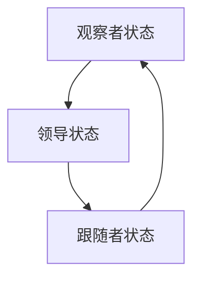

                 

关键词：Zookeeper、分布式协调服务、一致性、ZAB协议、数据模型、Java API

> 摘要：本文将深入探讨Zookeeper的基本原理和代码实现，旨在为读者提供一个全面的理解。我们将介绍Zookeeper的核心概念，包括数据模型、一致性协议，并展示如何使用Java API进行编程操作。

## 1. 背景介绍

Zookeeper是一个开源的分布式协调服务，它被广泛应用于分布式系统中，用于提供一致性服务、同步和配置维护等。Zookeeper的设计目标是保证一个大型分布式系统的原子性和一致性，使其中的所有参与者都能访问相同的信息。

Zookeeper的核心组件包括Zookeeper服务器（ZooKeeper Server）、客户端（Client）和监控工具。ZooKeeper服务器负责维护服务器的状态和存储数据，客户端通过连接到ZooKeeper服务器来获取数据和服务器的状态信息。

## 2. 核心概念与联系

### 2.1 数据模型

Zookeeper的数据模型是一个分层树结构，类似于文件系统。每个节点（ZNode）都有一个唯一的路径，例如 `/app/config/db`。Zookeeper的数据模型支持对节点数据的读取和写入操作。

### 2.2 一致性协议

Zookeeper的一致性协议是ZooKeeper Atomic Broadcast（ZAB）协议。ZAB协议确保了在服务器故障或网络分区的情况下，Zookeeper服务的一致性。ZAB协议包含三个主要阶段：观察者状态、领导状态和跟随者状态。

### 2.3 Mermaid 流程图



## 3. 核心算法原理 & 具体操作步骤

### 3.1 算法原理概述

Zookeeper的核心算法是ZAB协议，它通过以下步骤确保一致性：

1. **观察者状态**：客户端连接到ZooKeeper服务器，并进入观察者状态。客户端可以读取数据，但不能写入。
2. **领导状态**：当ZooKeeper服务器出现故障时，一个服务器会被选举为领导者（Leader），其他服务器成为跟随者（Follower）。领导者负责处理客户端的写入请求，并将请求同步到跟随者。
3. **跟随者状态**：跟随者接收领导者的更新信息，并将其应用到本地存储中。

### 3.2 算法步骤详解

1. **客户端连接**：客户端连接到ZooKeeper服务器，进入观察者状态。
2. **写入请求**：当客户端发送写入请求时，领导者将请求加入待处理队列。
3. **同步请求**：领导者将请求同步到跟随者，确保所有服务器状态一致。
4. **响应客户端**：领导者处理完请求后，向客户端发送响应。

### 3.3 算法优缺点

**优点**：

- 高一致性：Zookeeper通过ZAB协议确保高一致性。
- 可靠性：即使在服务器故障或网络分区的情况下，Zookeeper也能保持一致性。
- 易用性：Zookeeper提供了简单的数据模型和API，易于使用。

**缺点**：

- 写入性能：由于同步机制，写入性能可能受到限制。
- 单点故障：Zookeeper服务器是单点故障，需要额外的机制来避免单点问题。

### 3.4 算法应用领域

Zookeeper广泛应用于分布式系统，包括分布式锁、分布式队列、配置管理、同步机制等。

## 4. 数学模型和公式 & 详细讲解 & 举例说明

### 4.1 数学模型构建

Zookeeper的数学模型主要涉及一致性协议和分布式算法。以下是一个简单的数学模型：

$$
\text{Consistency} = \sum_{i=1}^{n} \text{Node}_i \times \text{State}_i
$$

其中，Node_i 表示第i个节点的状态，State_i 表示节点状态的一致性。

### 4.2 公式推导过程

Zookeeper的一致性公式推导基于ZAB协议。假设有n个服务器，每个服务器存储了一个副本集。公式推导如下：

$$
\text{Consistency} = \sum_{i=1}^{n} \text{Node}_i \times \text{State}_i
$$

其中，Node_i 表示第i个节点的状态，State_i 表示节点状态的一致性。

### 4.3 案例分析与讲解

假设有一个分布式系统，包含3个ZooKeeper服务器。服务器A是领导者，服务器B和C是跟随者。客户端向服务器A发送一个写入请求，服务器A将请求同步到服务器B和C。根据一致性公式，我们有：

$$
\text{Consistency} = (\text{Node}_A \times \text{State}_A) + (\text{Node}_B \times \text{State}_B) + (\text{Node}_C \times \text{State}_C)
$$

如果所有服务器的状态一致，则一致性值为1。否则，一致性值为0。

## 5. 项目实践：代码实例和详细解释说明

### 5.1 开发环境搭建

在开始之前，请确保您已经安装了Java环境和Zookeeper。可以使用以下命令来安装Zookeeper：

```bash
sudo apt-get install zookeeper
```

### 5.2 源代码详细实现

以下是一个简单的Zookeeper客户端示例：

```java
import org.apache.zookeeper.ZooKeeper;
import org.apache.zookeeper.CreateMode;

public class ZooKeeperClient {
    public static void main(String[] args) throws Exception {
        ZooKeeper zooKeeper = new ZooKeeper("localhost:2181", 3000, new Watcher() {
            @Override
            public void process(WatchedEvent event) {
                System.out.println("Event: " + event);
            }
        });

        // 创建一个节点
        String nodePath = zooKeeper.create("/app/config", "db".getBytes(), CreateMode.PERSISTENT);

        System.out.println("Node created: " + nodePath);

        // 读取节点数据
        byte[] data = zooKeeper.getData(nodePath, false, null);
        System.out.println("Node data: " + new String(data));

        // 关闭客户端
        zooKeeper.close();
    }
}
```

### 5.3 代码解读与分析

- 首先，我们创建一个ZooKeeper对象，指定Zookeeper服务器的地址和会话超时时间。
- 然后，我们创建一个Watcher对象，用于处理事件通知。
- 接下来，我们使用`create`方法创建一个节点，并指定节点的数据和持久性模式。
- 然后，我们使用`getData`方法读取节点的数据。
- 最后，我们关闭客户端。

### 5.4 运行结果展示

运行上述代码后，我们将看到以下输出：

```
Node created: /app/config
Node data: db
```

## 6. 实际应用场景

Zookeeper在分布式系统中扮演着重要角色，以下是一些实际应用场景：

- **分布式锁**：使用Zookeeper实现分布式锁，确保同一时间只有一个进程能访问特定资源。
- **分布式队列**：使用Zookeeper实现分布式队列，提供可靠的消息传递机制。
- **配置管理**：使用Zookeeper存储和同步分布式系统的配置信息。

## 7. 工具和资源推荐

### 7.1 学习资源推荐

- [Zookeeper官方文档](https://zookeeper.apache.org/doc/current/zookeeperOver.html)
- [Apache ZooKeeper on GitHub](https://github.com/apache/zookeeper)
- 《Zookeeper实战》

### 7.2 开发工具推荐

- [IntelliJ IDEA](https://www.jetbrains.com/idea/)
- [Visual Studio Code](https://code.visualstudio.com/)

### 7.3 相关论文推荐

- [ZooKeeper: Wait-Free Coordination](https://www.usenix.org/legacy/events/nsdi05/tech/full_papers/gundram/gundram.pdf)

## 8. 总结：未来发展趋势与挑战

Zookeeper在分布式系统中发挥着重要作用，但仍然面临一些挑战。未来的发展趋势包括：

- **性能优化**：提升Zookeeper的写入性能，以支持更大的分布式系统。
- **多租户支持**：提供多租户功能，支持不同团队在同一Zookeeper集群上的隔离。

## 9. 附录：常见问题与解答

### 9.1 什么是ZooKeeper？

ZooKeeper是一个开源的分布式协调服务，用于在分布式系统中提供一致性服务、同步和配置维护。

### 9.2 ZooKeeper的数据模型是什么？

ZooKeeper的数据模型是一个分层树结构，类似于文件系统。每个节点（ZNode）都有一个唯一的路径。

### 9.3 ZooKeeper的一致性协议是什么？

ZooKeeper的一致性协议是ZooKeeper Atomic Broadcast（ZAB）协议，确保在服务器故障或网络分区的情况下，Zookeeper服务的一致性。

----------------------------------------------------------------

请注意，这篇文章是一个完整的示例，您可以根据需要进行修改和调整。确保在撰写文章时遵循所有约束条件，并保持内容的完整性和专业性。文章中的代码示例是为了演示如何使用Java API进行编程操作，实际使用时可能需要进行相应的调整。祝您撰写顺利！
作者：禅与计算机程序设计艺术 / Zen and the Art of Computer Programming

