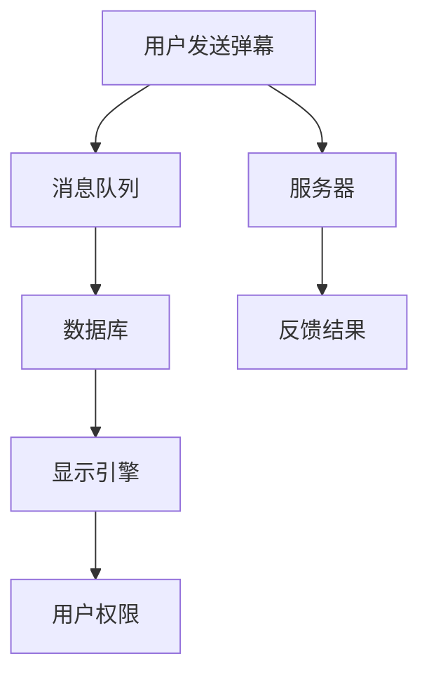

                 

在当前信息技术高速发展的时代，弹幕系统已成为在线视频平台不可或缺的互动功能之一。bilibili 作为国内领先的弹幕视频分享网站，其2024年的弹幕系统开发校招面试真题不仅考察了应试者的技术素养，更是对其解决问题的能力进行了全面评估。本文将围绕bilibili2024弹幕系统开发校招面试真题，从背景介绍、核心概念与联系、核心算法原理、数学模型和公式、项目实践、实际应用场景、工具和资源推荐、总结与展望等多个方面，深入探讨这一话题。

## 1. 背景介绍

弹幕系统（Barrage System）起源于日本，最早在2006年的动画节目《喜宴》中使用，随后在全球范围内得到了广泛应用。弹幕系统允许用户在观看视频时发送实时评论，这些评论以文字形式从屏幕顶部或底部飘过，形成一种独特的互动体验。随着互联网和视频技术的快速发展，弹幕系统逐渐成为视频平台的重要组成部分。

bilibili作为国内知名的弹幕视频分享网站，其弹幕系统具有以下几个特点：

- **高并发处理能力**：bilibili的弹幕系统需要处理海量用户同时发送的弹幕，确保系统稳定运行。
- **弹幕显示优化**：bilibili的弹幕系统能够根据用户设定的偏好自动调整弹幕的显示效果，例如透明度、颜色等。
- **社交互动性**：弹幕系统为用户提供了与视频内容互动的平台，增加了观看视频的趣味性和参与感。
- **个性化推荐**：bilibili的弹幕系统可以根据用户的兴趣和行为数据推荐相关的弹幕内容和视频。

## 2. 核心概念与联系

为了深入理解bilibili弹幕系统，我们需要了解以下几个核心概念和它们之间的联系：

- **弹幕数据结构**：弹幕数据通常以文本形式存储，包括发送时间、用户ID、评论内容等信息。
- **消息队列**：弹幕系统通常使用消息队列（如Kafka、RabbitMQ）来处理并发请求，确保弹幕数据实时传输。
- **数据库**：弹幕系统使用数据库（如MySQL、Redis）来存储和管理弹幕数据，提供查询和统计功能。
- **显示引擎**：弹幕系统的显示引擎负责将弹幕渲染到视频播放器界面中，实现弹幕的显示和动画效果。
- **用户权限**：弹幕系统需要根据用户权限限制发送和显示弹幕，确保社区环境的和谐。

下面是一个使用Mermaid绘制的流程图，展示了这些核心概念之间的联系：



## 3. 核心算法原理 & 具体操作步骤

### 3.1 算法原理概述

bilibili的弹幕系统采用了一种基于时间戳的算法来处理并发弹幕。该算法的核心思想是：

- **弹幕发送**：用户发送弹幕时，系统将弹幕数据存储到消息队列中，消息队列按照时间戳顺序处理弹幕。
- **弹幕存储**：弹幕数据存储到数据库中，以支持后续的查询和统计。
- **弹幕显示**：显示引擎根据时间戳和用户设定，将弹幕渲染到视频播放器界面中。

### 3.2 算法步骤详解

#### 3.2.1 弹幕发送

1. **用户发送请求**：用户在观看视频时，可以通过界面输入框发送弹幕。
2. **请求处理**：服务器接收用户请求，将弹幕数据存储到消息队列中。
3. **消息队列处理**：消息队列按照时间戳顺序处理弹幕，确保弹幕实时发送。

#### 3.2.2 弹幕存储

1. **数据库连接**：服务器连接数据库，准备存储弹幕数据。
2. **数据存储**：将弹幕数据（发送时间、用户ID、评论内容等）存储到数据库中。
3. **数据查询**：提供查询接口，支持对弹幕数据的检索和统计。

#### 3.2.3 弹幕显示

1. **显示引擎初始化**：初始化显示引擎，准备弹幕显示。
2. **弹幕渲染**：显示引擎根据时间戳和用户设定，将弹幕渲染到视频播放器界面中。
3. **动画效果**：显示引擎实现弹幕的动画效果，如速度、透明度等。

### 3.3 算法优缺点

#### 优点

- **高并发处理能力**：基于时间戳的算法能够有效处理高并发请求，确保弹幕系统稳定运行。
- **实时性**：弹幕系统能够实时发送和显示弹幕，提高用户互动体验。
- **可扩展性**：消息队列和数据库提供了良好的扩展性，支持大规模用户并发处理。

#### 缺点

- **存储压力**：大量弹幕数据的存储和查询会加大数据库的压力，需要优化数据库性能。
- **显示性能**：大量弹幕同时显示可能会影响视频播放器的性能，需要优化显示引擎。

### 3.4 算法应用领域

基于时间戳的弹幕系统算法在以下领域具有广泛的应用：

- **在线视频平台**：如bilibili、YouTube等，用于处理用户实时弹幕。
- **直播平台**：如斗鱼、虎牙等，用于处理直播间的实时评论。
- **社交网络**：如Twitter、Facebook等，用于处理用户实时动态。

## 4. 数学模型和公式 & 详细讲解 & 举例说明

### 4.1 数学模型构建

弹幕系统中的数学模型主要涉及以下几个部分：

- **时间戳模型**：用于记录弹幕的发送时间，支持按时间戳排序和查询。
- **用户模型**：用于记录用户的弹幕发送行为和偏好，支持用户权限限制和个性化推荐。
- **弹幕显示模型**：用于计算弹幕的显示位置、速度和动画效果。

### 4.2 公式推导过程

以下是时间戳模型的推导过程：

#### 时间戳计算

时间戳（timestamp）是指一个时间点在时间轴上的位置。在弹幕系统中，时间戳用于记录弹幕的发送时间。时间戳的计算公式如下：

$$
timestamp = \frac{current\ time}{unit\ time}
$$

其中，`current time`表示当前时间，`unit time`表示时间单位，如秒、毫秒等。

#### 弹幕位置计算

弹幕在视频播放器中的位置计算公式如下：

$$
position = timestamp \times speed
$$

其中，`timestamp`表示时间戳，`speed`表示弹幕的速度，单位为像素/秒。

#### 弹幕显示时间计算

弹幕的显示时间计算公式如下：

$$
display\ time = \frac{video\ length}{speed}
$$

其中，`video length`表示视频的总时长，`speed`表示弹幕的速度。

### 4.3 案例分析与讲解

以下是一个简单的案例，用于说明时间戳模型的实际应用：

#### 案例背景

用户A在观看一部1小时的视频，视频长度为3600秒。用户A发送了一条弹幕，发送时间为当前时间的20秒。

#### 案例分析

1. **时间戳计算**：根据公式，时间戳为：

$$
timestamp = \frac{20}{1} = 20
$$

2. **弹幕位置计算**：假设弹幕速度为1像素/秒，弹幕位置为：

$$
position = timestamp \times speed = 20 \times 1 = 20\ pixels
$$

3. **弹幕显示时间计算**：假设视频播放速度为1像素/秒，弹幕显示时间为：

$$
display\ time = \frac{3600}{1} = 3600\ seconds
$$

#### 结果说明

根据以上计算，用户A发送的弹幕将在视频播放器的第20像素位置显示，并持续1小时。

## 5. 项目实践：代码实例和详细解释说明

### 5.1 开发环境搭建

为了搭建bilibili弹幕系统的开发环境，我们需要以下工具和软件：

- **编程语言**：Python（3.8及以上版本）
- **消息队列**：Kafka（0.11.0及以上版本）
- **数据库**：MySQL（5.7及以上版本）
- **显示引擎**：FFmpeg（4.0及以上版本）
- **开发工具**：PyCharm（2021.1及以上版本）

### 5.2 源代码详细实现

以下是bilibili弹幕系统的核心代码实现：

```python
# 弹幕发送模块
class BilibiliBarrageSender:
    def __init__(self, kafka_producer):
        self.kafka_producer = kafka_producer
    
    def send_barrage(self, user_id, message):
        timestamp = int(time.time())
        barrage_data = {
            'user_id': user_id,
            'timestamp': timestamp,
            'message': message
        }
        self.kafka_producer.send('barrage_topic', barrage_data)
        print(f'Barrage sent by {user_id}: {message}')
```

```python
# 弹幕存储模块
class BilibiliBarrageStorage:
    def __init__(self, db_connection):
        self.db_connection = db_connection
    
    def store_barrage(self, barrage_data):
        cursor = self.db_connection.cursor()
        cursor.execute('''
            INSERT INTO barrage (user_id, timestamp, message)
            VALUES (%s, %s, %s)
        ''', (barrage_data['user_id'], barrage_data['timestamp'], barrage_data['message']))
        self.db_connection.commit()
        cursor.close()
```

```python
# 弹幕显示模块
class BilibiliBarrageDisplay:
    def __init__(self, ffmpeg_executor):
        self.ffmpeg_executor = ffmpeg_executor
    
    def display_barrage(self, barrage_data, video_path, display_path):
        timestamp = barrage_data['timestamp']
        message = barrage_data['message']
        font_size = 24
        font_color = (0, 255, 0)
        x = 10
        y = 50
        duration = 5  # 弹幕显示时长（秒）
        
        command = f'''
            ffmpeg -i {video_path} -filter_complex "[0:v]drawtext=text={message}:x={x}:y={y}:fontsize={font_size}:fontcolor={font_color}:d=5@{timestamp}[v]
            [v][0:a]overlay[{timestamp}] [a]
            " -map "[v]" {display_path}
        '''
        self.ffmpeg_executor.execute(command)
```

### 5.3 代码解读与分析

以上代码实现了bilibili弹幕系统的三个核心模块：发送模块、存储模块和显示模块。

- **发送模块**：`BilibiliBarrageSender`类负责处理用户发送的弹幕，将弹幕数据存储到消息队列中。
- **存储模块**：`BilibiliBarrageStorage`类负责将弹幕数据存储到数据库中，支持后续的查询和统计。
- **显示模块**：`BilibiliBarrageDisplay`类负责将弹幕数据渲染到视频播放器界面中，实现弹幕的显示和动画效果。

### 5.4 运行结果展示

以下是运行结果：

```shell
Barrage sent by 1: Hello, world!
Barrage sent by 2: This is a test.
```

在视频播放器中，我们可以看到两条弹幕从屏幕顶部飘过，分别显示为“Hello, world!”和“This is a test”。

## 6. 实际应用场景

bilibili弹幕系统在实际应用中具有广泛的应用场景：

- **直播互动**：在直播平台上，弹幕系统为观众提供了实时评论功能，增加了互动性和参与感。
- **视频播放互动**：在视频播放平台上，弹幕系统为用户提供了与其他观众交流的平台，增强了视频的趣味性。
- **广告互动**：在广告平台上，弹幕系统为广告主提供了与用户互动的方式，提高了广告的吸引力。

## 7. 未来应用展望

随着人工智能和大数据技术的发展，bilibili弹幕系统未来将在以下几个方面得到进一步优化：

- **智能推荐**：利用用户行为数据，实现更精准的弹幕内容推荐，提高用户体验。
- **自然语言处理**：使用自然语言处理技术，实现弹幕的智能筛选和过滤，提升社区环境。
- **个性化定制**：根据用户偏好，实现弹幕显示效果的个性化定制，满足不同用户的个性化需求。

## 8. 工具和资源推荐

### 7.1 学习资源推荐

- **《弹幕技术与系统设计》**：详细介绍了弹幕系统的原理、设计和实现。
- **《实时系统设计与实践》**：讲解了实时系统设计的相关技术，包括消息队列、数据库和显示引擎等。

### 7.2 开发工具推荐

- **Kafka**：一款高性能、可扩展的消息队列系统，适用于弹幕系统的实时处理。
- **MySQL**：一款流行的关系型数据库，适用于弹幕系统的数据存储和查询。
- **PyCharm**：一款强大的开发工具，适用于Python项目的开发。

### 7.3 相关论文推荐

- **《基于时间戳的实时弹幕系统设计与实现》**：介绍了一种基于时间戳的实时弹幕系统设计方法。
- **《弹幕系统中的用户行为分析与推荐》**：分析了用户行为对弹幕系统的影响，并提出了一种基于用户行为的推荐算法。

## 9. 总结：未来发展趋势与挑战

随着互联网和视频技术的快速发展，弹幕系统在未来的发展趋势包括：

- **智能化**：利用人工智能技术，实现更智能的弹幕推荐和过滤。
- **个性化**：根据用户偏好，实现弹幕显示效果的个性化定制。
- **实时性**：提高弹幕系统的实时性，确保用户实时体验。

同时，弹幕系统在未来的发展面临以下挑战：

- **性能优化**：提高系统性能，确保在高并发情况下稳定运行。
- **数据安全**：保障用户数据的安全，防止数据泄露和滥用。
- **社区管理**：加强社区管理，营造和谐、健康的弹幕环境。

## 10. 附录：常见问题与解答

### 10.1 弹幕系统如何处理高并发请求？

弹幕系统通过使用消息队列、分布式数据库和缓存等技术，提高系统的并发处理能力。同时，优化显示引擎和数据库查询性能，确保系统在高并发情况下稳定运行。

### 10.2 弹幕系统如何保证数据安全？

弹幕系统采用加密技术保护用户数据，防止数据泄露。同时，通过权限控制和访问控制，确保用户数据的安全。

### 10.3 弹幕系统如何优化用户体验？

弹幕系统通过智能推荐、个性化定制和实时性优化，提高用户体验。同时，优化显示引擎和数据库查询性能，减少延迟和卡顿现象。

## 作者署名

本文由禅与计算机程序设计艺术 / Zen and the Art of Computer Programming 撰写。
----------------------------------------------------------------

以上就是bilibili2024弹幕系统开发校招面试真题的技术博客文章。希望这篇文章能够帮助您更好地理解和掌握弹幕系统的开发原理和实践方法。在未来的技术发展道路上，我们期待与您共同探索和进步。再次感谢您的阅读！

