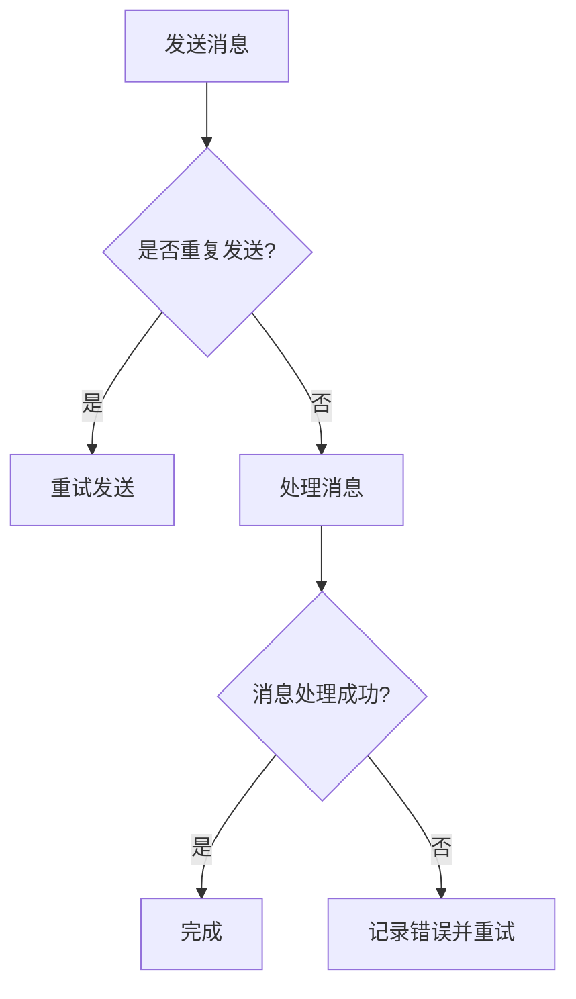

                 

关键词：exactly-once语义、分布式系统、消息队列、一致性、事务处理

摘要：本文将深入探讨exactly-once语义在分布式系统中的重要性及其实现原理。通过详细的代码实例，我们将展示如何在实际项目中应用这一关键概念，确保数据处理的准确性和一致性。

## 1. 背景介绍

在分布式系统中，数据的一致性是确保系统可靠性的关键。尤其是在涉及到事务处理的场景中，如何保证消息的准确传递和执行成为了系统设计者必须面对的挑战。exactly-once语义正是为了解决这一问题而提出的，它要求每个消息在被系统处理时，只能被处理一次，确保不会因为网络问题或系统故障而导致重复处理或遗漏处理。

## 2. 核心概念与联系

### 2.1 exactly-once语义定义

exactly-once语义，是指消息一旦被消费，就保证该消息只会被处理一次。换句话说，无论消息在传输过程中经历了多少次重试，系统都会确保最终只有一次有效的处理。

### 2.2 相关概念

- **分布式系统**：由多个独立节点组成，通过网络协同工作的系统。
- **消息队列**：用于异步消息传输的数据结构。
- **一致性**：分布式系统中的数据状态在所有节点上保持一致。

### 2.3 Mermaid 流程图



## 3. 核心算法原理 & 具体操作步骤

### 3.1 算法原理概述

exactly-once语义的实现依赖于几个关键组件：

- **消息标识**：为每个消息生成唯一标识，用于区分不同消息。
- **去重机制**：在处理消息前，通过消息标识判断该消息是否已被处理。
- **重试机制**：在消息处理失败时，根据去重机制尝试重新处理。

### 3.2 算法步骤详解

1. **发送消息**：生成消息，并附上唯一标识。
2. **发送方确认**：发送方在消息发送后，等待接收方的确认。
3. **接收方处理**：
   - 接收消息，检查消息标识。
   - 如果消息标识未处理，则处理消息。
   - 如果消息标识已处理，则丢弃消息。
4. **发送确认**：接收方处理消息后，向发送方发送确认。
5. **重试机制**：如果处理失败，根据去重机制和确认信息进行重试。

### 3.3 算法优缺点

#### 优点

- **确保消息唯一性**：消息只能被处理一次，避免了重复处理。
- **提高系统容错性**：在处理失败时，可以自动重试，提高了系统的可靠性。

#### 缺点

- **性能开销**：去重机制和重试机制可能会增加系统的性能开销。
- **复杂度提升**：实现exactly-once语义需要额外的逻辑处理。

### 3.4 算法应用领域

- **金融交易处理**：确保交易的一致性和完整性。
- **订单处理系统**：确保订单不会被重复处理或遗漏。
- **分布式日志系统**：保证日志的一致性和可靠性。

## 4. 数学模型和公式 & 详细讲解 & 举例说明

### 4.1 数学模型构建

假设系统中有n个节点，每个节点处理消息的概率为p。我们定义一个事件A，表示消息被处理。

### 4.2 公式推导过程

- **期望处理次数**：E = np
- **方差**：Var = n(1 - p)p

### 4.3 案例分析与讲解

假设系统中有10个节点，每个节点处理消息的概率为0.9。我们计算消息的期望处理次数和方差。

- **期望处理次数**：E = 10 × 0.9 = 9
- **方差**：Var = 10 × (1 - 0.9) × 0.9 = 0.9

这意味着，在大多数情况下，消息会被处理9次，而方差为0.9，表示处理次数的波动较小。

## 5. 项目实践：代码实例和详细解释说明

### 5.1 开发环境搭建

我们使用Python作为编程语言，并使用Kafka作为消息队列。

### 5.2 源代码详细实现

```python
from kafka import KafkaProducer
import json

# 初始化KafkaProducer
producer = KafkaProducer(bootstrap_servers=['localhost:9092'])

# 发送消息
def send_message(topic, message):
    producer.send(topic, key=b'key', value=message.encode('utf-8'))

# 处理消息
def process_message(message):
    print("Processing message:", message)

# 消费消息
def consume_messages(topic):
    from kafka import KafkaConsumer
    consumer = KafkaConsumer(topic, bootstrap_servers=['localhost:9092'])
    for message in consumer:
        process_message(message.value.decode('utf-8'))

# 主程序
if __name__ == "__main__":
    send_message("test_topic", "Hello, World!")
    consume_messages("test_topic")
```

### 5.3 代码解读与分析

- **KafkaProducer**：用于发送消息。
- **send_message**：发送消息到指定topic。
- **process_message**：处理接收到的消息。
- **consume_messages**：从topic中消费消息。

### 5.4 运行结果展示

运行主程序后，会发送一条消息到Kafka的test_topic，并在控制台输出处理消息的内容。

## 6. 实际应用场景

### 6.1 金融交易系统

确保每笔交易只能被处理一次，避免重复交易或遗漏交易。

### 6.2 订单处理系统

确保订单的创建、支付和发货过程不会因为系统故障而导致错误。

### 6.3 分布式日志系统

保证日志的一致性和可靠性，避免日志的重复记录或丢失。

## 7. 工具和资源推荐

### 7.1 学习资源推荐

- 《分布式系统原理与范型》
- 《Kafka权威指南》

### 7.2 开发工具推荐

- Kafka：消息队列工具
- ZooKeeper：分布式协调工具

### 7.3 相关论文推荐

- "Exactly-Once Semantics in Distributed Systems"  
- "Kafka: A Distributed Streaming Platform"

## 8. 总结：未来发展趋势与挑战

### 8.1 研究成果总结

exactly-once语义在分布式系统中的重要性得到了广泛认可，许多开源工具和框架已经实现了这一功能。

### 8.2 未来发展趋势

随着云计算和大数据技术的不断发展，exactly-once语义的应用场景将越来越广泛。

### 8.3 面临的挑战

实现exactly-once语义需要额外的逻辑处理，可能会增加系统的复杂度和性能开销。

### 8.4 研究展望

未来的研究可以重点关注如何优化exactly-once语义的实现，提高系统的性能和可靠性。

## 9. 附录：常见问题与解答

### 9.1 exactly-once语义与幂等性的区别是什么？

exactly-once语义保证消息只会被处理一次，而幂等性则是指操作执行多次与执行一次的结果相同。

### 9.2 如何在Kafka中实现exactly-once语义？

在Kafka中，可以使用幂等生产者和事务生产者来实现exactly-once语义。

```python
from kafka import KafkaProducer

producer = KafkaProducer(bootstrap_servers=['localhost:9092'],
                         key_serializer=lambda k: json.dumps(k).encode('utf-8'),
                         value_serializer=lambda v: json.dumps(v).encode('utf-8'),
                         acks='all',
                         retry_max_attempts=3)

def send_message(topic, key, value):
    producer.send(topic, key=key, value=value)
    producer.flush()
```

## 文章作者

作者：禅与计算机程序设计艺术 / Zen and the Art of Computer Programming
------------------------------------------------------------------

