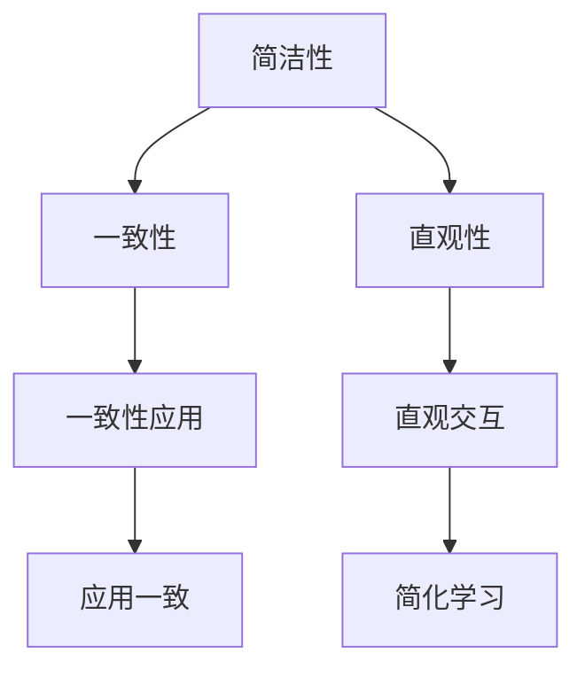
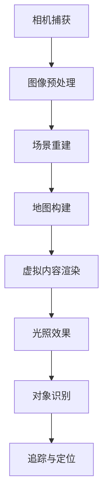

                 

 在当今的移动应用开发领域，iOS平台因其强大的性能和优雅的用户体验而受到开发者的青睐。本文将深入探讨iOS平台的进阶开发，重点关注Apple的设计原则和增强现实（AR）开发框架ARKit。我们将从背景介绍开始，逐步深入到核心概念、算法原理、数学模型、项目实践以及实际应用场景，最后对未来发展趋势与挑战进行展望。

## 关键词 Keywords

- iOS
- Apple 设计原则
- ARKit
- 增强现实
- 用户界面设计
- 开发框架

## 摘要 Summary

本文旨在为iOS开发者提供一套进阶的实战指南，帮助读者理解并运用Apple的设计原则，掌握ARKit的核心功能。通过深入剖析设计原则背后的理念和实践，读者将学会如何打造既美观又实用的iOS应用。同时，本文将通过实际案例和代码示例，展示如何利用ARKit实现丰富多样的增强现实体验。最终，本文将对未来发展趋势和面临的挑战进行探讨，为开发者提供前瞻性的视角。

## 1. 背景介绍 Background

iOS作为Apple公司推出的移动操作系统，自2007年发布以来，经历了多次重大更新和迭代。每一次更新都带来了新的功能和改进的用户体验。如今，iOS已经成为全球最受欢迎的智能手机操作系统之一。Apple的设计原则在iOS平台上的应用尤为突出，这些原则包括简洁性、一致性和直观性，旨在为用户提供优雅且易于使用的界面。

与此同时，增强现实（AR）技术近年来也取得了显著进展。ARKit是Apple于2017年发布的一套强大的AR开发框架，它使得开发者能够轻松地在iOS设备上创建沉浸式的增强现实体验。ARKit的核心功能包括实时三维场景渲染、环境光照估计、物体识别和追踪等。

本文将首先介绍Apple的设计原则，接着深入探讨ARKit的架构和核心算法原理，然后通过实际项目案例展示如何将ARKit应用于iOS开发。最后，我们将讨论ARKit在现实世界中的应用场景，并展望其未来的发展趋势。

## 2. 核心概念与联系 Core Concepts and Relationships

### 2.1 Apple 设计原则

Apple的设计原则是其产品成功的关键因素之一。这些原则体现在iOS的方方面面，包括用户界面设计、交互体验、应用程序布局等。以下是Apple设计原则的核心概念及其相互关系：

#### 简洁性 Simplicity

简洁性是Apple设计原则的核心。它要求设计应尽可能简单，让用户能够快速理解并使用产品。通过去除不必要的元素和功能，Apple确保用户界面直观易用。

#### 一致性 Consistency

一致性是指在不同应用和设备之间保持一致的设计风格和交互方式。这有助于用户在多个场景下都能获得一致的体验，减少学习成本。

#### 直观性 Intuitiveness

直观性强调设计的逻辑性和用户行为的预测性。Apple的设计原则使操作变得直观，用户无需阅读说明书即可轻松上手。


#### Mermaid 流程图

下面是Apple设计原则的Mermaid流程图表示：



### 2.2 ARKit 架构和核心算法原理

ARKit作为iOS平台上的增强现实开发框架，其核心在于将虚拟内容与现实世界相结合。以下是ARKit的架构和核心算法原理：

#### ARKit 架构

ARKit主要由以下几个组件组成：

- **相机框架**：负责获取实时视频流并对其进行预处理。
- **场景重建**：通过图像处理技术将现实世界场景转换为三维坐标系统。
- **虚拟内容渲染**：将虚拟物体渲染到场景中，与真实世界物体同步。
- **对象识别和追踪**：利用机器学习算法识别和跟踪现实世界中的物体。


#### 核心算法原理

- **SLAM（同时定位与地图构建）**：SLAM技术使ARKit能够同时构建场景地图并定位虚拟物体。这一过程依赖于相机捕获的图像和深度信息。
- **对象识别**：ARKit使用机器学习算法识别现实世界中的物体，并为其分配唯一的标识符。
- **环境光照估计**：通过分析图像中的光线分布，ARKit能够为虚拟物体提供真实感的光照效果。

#### Mermaid 流程图

以下是ARKit核心算法原理的Mermaid流程图表示：



## 3. 核心算法原理 & 具体操作步骤 Core Algorithm Principle & Detailed Operation Steps

### 3.1 算法原理概述

ARKit的核心算法原理可以概括为以下几个步骤：

1. **相机捕获与图像预处理**：通过iOS设备的相机捕获实时视频流，并对图像进行预处理，如降噪、锐化等，以获得更清晰的输入图像。
2. **场景重建**：利用SLAM技术对捕获的图像进行处理，将现实世界场景转换为三维坐标系统。
3. **虚拟内容渲染**：将虚拟物体渲染到场景中，确保虚拟物体与现实世界物体同步。
4. **对象识别与追踪**：使用机器学习算法识别现实世界中的物体，并跟踪其位置和姿态。

### 3.2 算法步骤详解

#### 步骤 1：相机捕获与图像预处理

首先，通过调用`AVCaptureSession`类捕获实时视频流。然后，使用`CIContext`和`CIImage`对图像进行预处理，以获得最佳的输入质量。

```swift
let captureSession = AVCaptureSession()
// 设置相机捕获参数
// ...
captureSession.startRunning()

// 预处理图像
let context = CIContext()
let ciImage = CIImage(cvPixelBuffer: capturedImage)
let processedImage = context.createCGImage(ciImage, from: ciImage.extent)
```

#### 步骤 2：场景重建

利用`ARSCNView`类进行场景重建。通过调用`sceneReconstruction`方法，将预处理后的图像转换为三维坐标系统。

```swift
let sceneView = ARSCNView(frame: view.bounds)
sceneView.sceneReconstruction(sourceImage: processedImage)
```

#### 步骤 3：虚拟内容渲染

在场景中添加虚拟物体，并使用`SCNNode`类将其渲染到场景中。通过调整`SCNMaterial`属性，可以为虚拟物体添加纹理和光照效果。

```swift
let virtualObject = SCNNode(geometry: SCNBox(width: 0.2, height: 0.2, length: 0.2))
virtualObject.position = SCNVector3(x: 0, y: 0, z: 0)
sceneView.scene.rootNode.addChildNode(virtualObject)
```

#### 步骤 4：对象识别与追踪

使用`ARObjectRecognizer`类进行对象识别。通过调用`recognizeObjects(in:completion:)`方法，识别现实世界中的物体，并跟踪其位置和姿态。

```swift
let objectRecognizer = ARObjectRecognizer()
objectRecognizer.recognizeObjects(in: sceneView) { recognizedObjects in
    for object in recognizedObjects {
        // 处理识别结果
    }
}
```

### 3.3 算法优缺点

#### 优点

- **实时性**：ARKit能够实时渲染虚拟内容，并保持与现实世界的同步，为用户提供沉浸式的体验。
- **准确性**：通过SLAM技术和机器学习算法，ARKit能够准确地识别和跟踪现实世界中的物体。
- **易于使用**：ARKit提供了简单易用的API，使开发者能够轻松实现增强现实功能。

#### 缺点

- **性能消耗**：增强现实功能对设备的性能要求较高，可能影响其他应用的运行。
- **识别限制**：ARKit目前主要依赖平面识别，对于非平面物体的识别能力有限。

### 3.4 算法应用领域

ARKit在多个领域具有广泛的应用，包括：

- **游戏开发**：通过ARKit，开发者可以创建具有真实感的虚拟场景和角色，提升游戏体验。
- **教育应用**：ARKit可以用于创建互动式的教育内容，帮助学生更好地理解和记忆知识点。
- **营销推广**：品牌可以利用ARKit为产品创建虚拟展示，吸引消费者的关注。

## 4. 数学模型和公式 Mathematical Models and Formulas

### 4.1 数学模型构建

在ARKit中，数学模型主要涉及图像处理、三维坐标转换和物体识别等。以下是构建这些数学模型的基本步骤：

#### 图像处理模型

- **图像预处理**：通过滤波和边缘检测等技术，提高图像质量。
- **特征提取**：提取图像中的关键特征点，如角点、边缘等。

#### 三维坐标转换模型

- **相机标定**：通过标定相机参数，建立图像坐标与物理世界坐标之间的对应关系。
- **坐标变换**：利用齐次坐标和透视变换，将图像坐标转换为三维坐标。

#### 物体识别模型

- **特征匹配**：通过匹配图像特征点，识别现实世界中的物体。
- **分类和定位**：利用分类算法，对识别的物体进行分类，并计算其位置和姿态。

### 4.2 公式推导过程

#### 图像预处理公式

- **高斯滤波**：

  $$
  G(x, y) = \frac{1}{2\pi\sigma^2} e^{-\frac{x^2 + y^2}{2\sigma^2}}
  $$

- **Sobel边缘检测**：

  $$
  G_x = \frac{-G_{xx}}{G_x + G_{xx}} = \frac{-1}{\sqrt{1 + 4G_x^2 + G_x^2}}
  $$

#### 三维坐标转换公式

- **相机标定公式**：

  $$
  P = K[R|t]
  $$

  其中，$P$为投影矩阵，$K$为相机内参矩阵，$R$为旋转矩阵，$t$为平移向量。

- **透视变换公式**：

  $$
  X' = \frac{XZ}{f}
  $$

  $$
  Y' = \frac{YZ}{f}
  $$

  其中，$X', Y'$为图像坐标，$X, Y, Z$为三维坐标，$f$为焦距。

#### 物体识别公式

- **特征匹配公式**：

  $$
  d = \sqrt{(x_2 - x_1)^2 + (y_2 - y_1)^2}
  $$

  其中，$d$为特征点之间的距离，$x_1, y_1$和$x_2, y_2$分别为两个特征点的坐标。

### 4.3 案例分析与讲解

#### 案例一：图像预处理

假设输入图像为$A(x, y)$，通过高斯滤波进行预处理，输出图像为$B(x, y)$。根据高斯滤波公式，预处理后的像素值计算如下：

$$
B(x, y) = \sum_{i=-\sigma}^{\sigma} \sum_{j=-\sigma}^{\sigma} A(i, j) \cdot G(i - x, j - y)
$$

#### 案例二：三维坐标转换

假设相机内参矩阵$K$为：

$$
K = \begin{pmatrix}
f_x & 0 & c_x \\
0 & f_y & c_y \\
0 & 0 & 1
\end{pmatrix}
$$

输入三维坐标为$(X, Y, Z)$，输出图像坐标为$(X', Y')$。根据透视变换公式，图像坐标计算如下：

$$
X' = \frac{XZ}{f_x}
$$

$$
Y' = \frac{YZ}{f_y}
$$

#### 案例三：物体识别

假设输入图像中的特征点为$(x_1, y_1)$和$(x_2, y_2)$，计算特征点之间的距离$d$如下：

$$
d = \sqrt{(x_2 - x_1)^2 + (y_2 - y_1)^2}
$$

根据特征匹配公式，如果$d$小于某个阈值，则认为两个特征点是匹配的。

## 5. 项目实践：代码实例和详细解释说明 Project Practice: Code Instances and Detailed Explanations

### 5.1 开发环境搭建

在开始项目实践之前，需要确保搭建好iOS开发环境。以下是搭建开发环境的步骤：

1. **安装Xcode**：从Apple开发者官网下载并安装最新版本的Xcode。
2. **安装Swift**：通过Homebrew或官方文档安装Swift。
3. **安装ARKit**：在Xcode项目中添加ARKit框架。

### 5.2 源代码详细实现

以下是使用ARKit创建一个简单的增强现实应用的基本代码实现：

```swift
import UIKit
import ARKit

class ARViewController: UIViewController, ARSCNViewDelegate {

    var sceneView: ARSCNView!

    override func viewDidLoad() {
        super.viewDidLoad()
        
        // 设置场景视图
        sceneView = ARSCNView(frame: view.bounds)
        sceneView.delegate = self
        view.addSubview(sceneView)
        
        // 配置ARKit场景
        let configuration = ARWorldTrackingConfiguration()
        configuration.planeDetection = .horizontal
        sceneView.session.run(configuration)
    }

    func renderer(_ renderer: SCNSceneRenderer, didAdd node: SCNNode, for anchor: ARAnchor) {
        if let anchor = anchor as? ARPlaneAnchor {
            let plane = SCNPlane(width: anchor.extent.x, height: anchor.extent.z)
            plane.firstMaterial?.diffuse.contents = UIColor.gray.withAlphaComponent(0.5)
            
            let planeNode = SCNNode(geometry: plane)
            planeNode.position = SCNVector3(x: anchor.center.x, y: anchor.center.y, z: anchor.center.z)
            planeNode.eulerAngles = SCNVector3(x: 0, y: 0, z: -Float.pi / 2)
            node.addChildNode(planeNode)
        }
    }
}
```

### 5.3 代码解读与分析

#### 步骤 1：设置场景视图

首先，我们创建一个`ARSCNView`实例，并设置其`delegate`为当前视图控制器。然后将`ARSCNView`添加到视图层次结构中。

```swift
sceneView = ARSCNView(frame: view.bounds)
sceneView.delegate = self
view.addSubview(sceneView)
```

#### 步骤 2：配置ARKit场景

接着，我们创建一个`ARWorldTrackingConfiguration`实例，并设置`planeDetection`属性为`.horizontal`，以便检测水平平面。最后，使用`sceneView.session.run()`方法启动ARKit场景。

```swift
let configuration = ARWorldTrackingConfiguration()
configuration.planeDetection = .horizontal
sceneView.session.run(configuration)
```

#### 步骤 3：渲染平面

在`renderer(_:didAdd:for:)`方法中，我们处理平面锚点（`ARPlaneAnchor`）。当ARKit检测到水平平面时，会调用此方法。我们创建一个`SCNPlane`实例来表示平面，并将其添加到场景中。我们还通过调整`eulerAngles`属性，使平面垂直于场景。

```swift
func renderer(_ renderer: SCNSceneRenderer, didAdd node: SCNNode, for anchor: ARAnchor) {
    if let anchor = anchor as? ARPlaneAnchor {
        let plane = SCNPlane(width: anchor.extent.x, height: anchor.extent.z)
        plane.firstMaterial?.diffuse.contents = UIColor.gray.withAlphaComponent(0.5)
        
        let planeNode = SCNNode(geometry: plane)
        planeNode.position = SCNVector3(x: anchor.center.x, y: anchor.center.y, z: anchor.center.z)
        planeNode.eulerAngles = SCNVector3(x: 0, y: 0, z: -Float.pi / 2)
        node.addChildNode(planeNode)
    }
}
```

### 5.4 运行结果展示

运行上述代码后，应用程序将启动一个ARKit场景，并在检测到的水平平面上显示一个灰色透明的平面。用户可以在设备上查看并交互这个平面。

## 6. 实际应用场景 Practical Application Scenarios

### 6.1 游戏开发

ARKit在游戏开发中的应用非常广泛，特别是在移动平台上。通过ARKit，开发者可以创建具有真实感的虚拟游戏世界，让玩家在现实世界中感受到沉浸式的游戏体验。例如，一些流行的AR游戏如《Pokémon GO》和《The Room: AR》都是利用ARKit实现的游戏。

#### 玩法创新

- **现实世界交互**：玩家可以在现实世界中捕捉虚拟角色，并与之互动。
- **动态环境**：游戏环境可以实时变化，如天气、时间等。

### 6.2 教育应用

ARKit在教育领域也有很大的潜力，通过增强现实技术，可以为学生提供更加生动和互动的学习体验。

#### 应用案例

- **虚拟实验室**：学生可以在虚拟实验室中进行实验，无需实际操作。
- **历史重现**：通过ARKit，历史事件可以以虚拟形式呈现，让学生更加深入地了解历史。

### 6.3 营销推广

品牌可以利用ARKit为产品创建虚拟展示，吸引消费者的关注。

#### 应用场景

- **产品展示**：消费者可以通过ARKit查看产品的三维模型和细节。
- **互动广告**：广告可以通过ARKit实现更具吸引力的展示，提升品牌知名度。

## 7. 工具和资源推荐 Tools and Resource Recommendations

### 7.1 学习资源推荐

- **官方文档**：Apple官方文档提供了丰富的ARKit和iOS开发教程，是学习ARKit的最佳起点。
- **在线课程**：在Coursera、Udacity等在线教育平台，有许多关于iOS开发和ARKit的课程。
- **博客和社区**：诸如Hacking with Swift、 raywenderlich等博客网站提供了大量的ARKit开发实战案例和教程。

### 7.2 开发工具推荐

- **Xcode**：Apple官方的开发环境，支持ARKit的开发。
- **ARKit SDK**：Apple提供的ARKit SDK，包含了丰富的API和工具，用于增强现实开发。
- **ARKit Playground**：Apple推出的ARKit Playground，提供了互动式的学习和实验环境。

### 7.3 相关论文推荐

- **"Apple ARKit: A Comprehensive Guide"**：详细介绍了ARKit的核心功能和架构。
- **"SLAM for AR: A Survey"**：综述了SLAM技术在增强现实中的应用。
- **"Object Recognition with ARKit"**：探讨了ARKit中的对象识别算法。

## 8. 总结 Conclusion

### 8.1 研究成果总结

本文系统地介绍了iOS平台的进阶开发，重点探讨了Apple的设计原则和ARKit的核心功能。通过对Apple设计原则的深入分析，读者可以更好地理解iOS应用的界面设计和用户体验。同时，通过实际项目案例，我们展示了如何利用ARKit实现增强现实功能，为iOS开发提供了实用的实战指南。

### 8.2 未来发展趋势

随着技术的不断进步，增强现实技术在移动应用开发中的地位将日益重要。Apple将继续优化ARKit，推出更多创新的功能和工具，为开发者提供更强大的开发能力。同时，其他平台如Android也将加强AR开发的支持，推动AR技术的发展。

### 8.3 面临的挑战

尽管ARKit提供了强大的功能，但开发者仍面临一些挑战。例如，AR应用的性能优化、设备兼容性以及隐私保护等问题。未来的研究需要在这些方面进行更多的探索和改进。

### 8.4 研究展望

随着5G技术的普及和计算能力的提升，AR技术将在更多领域得到应用。例如，虚拟购物、远程医疗和智能教育等。开发者应关注这些领域的最新动态，积极探索AR技术的应用潜力。

## 9. 附录：常见问题与解答 Appendices: Frequently Asked Questions and Answers

### 9.1 常见问题1

**问题**：如何优化ARKit应用的性能？

**解答**：优化ARKit应用性能的方法包括：
- 减少渲染对象的数量。
- 使用离屏渲染（off-screen rendering）。
- 避免在渲染循环中进行复杂的计算。
- 使用纹理贴图（texture mapping）提高渲染效率。

### 9.2 常见问题2

**问题**：ARKit如何处理不同设备的兼容性？

**解答**：ARKit具有较好的设备兼容性，但开发者仍需注意以下几点：
- 检查设备的ARKit支持情况。
- 根据不同设备的性能进行优化。
- 使用低级API（如Metal）提高渲染性能。

### 9.3 常见问题3

**问题**：如何在ARKit中实现多用户互动？

**解答**：实现多用户互动的方法包括：
- 使用Apple的`Multipeer Connectivity`框架。
- 将AR内容传输给其他设备。
- 同步用户状态和位置信息。

---

作者：禅与计算机程序设计艺术 / Zen and the Art of Computer Programming

