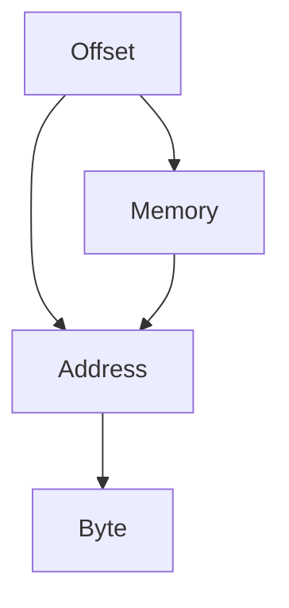

                 

关键词：offset，计算原理，代码实例，算法，应用场景

> 摘要：本文深入解析了 offset 的基本原理，并借助代码实例详细解释了 offset 在实际应用中的操作步骤和实现方法。文章从理论到实践，结合数学模型和实际案例，全面展现了 offset 的重要性和广泛适用性。

## 1. 背景介绍

在计算机科学和编程领域，offset 是一个非常重要的概念。它通常用于描述一个元素在数组或数据结构中的位置，以字节数或其他单位表示。在内存管理、文件操作、数据库访问等场景中，offset 的概念无处不在。理解 offset 的原理，对于程序员来说至关重要。

本文将首先介绍 offset 的基本概念，然后通过具体的算法原理和数学模型，详细讲解 offset 的计算方法。最后，我们将通过实际的项目实践和代码实例，展示 offset 在实际应用中的操作步骤和实现方法。

## 2. 核心概念与联系

### 2.1 基本概念

**Offset（偏移量）：**
在计算机科学中，offset 是指一个元素在数组或数据结构中的位置，通常以字节数表示。例如，在一个整数数组中，第一个元素的 offset 是 0，第二个元素的 offset 是 4（假设整数占用 4 个字节）。

**Address（地址）：**
地址是指内存中某个数据或指令的存储位置。在计算机中，每个内存位置都有一个唯一的地址。

**Byte（字节）：**
字节是计算机中最基本的存储单位，通常由 8 位二进制数组成。

### 2.2 基本联系

- **Offset 与 Address：**Offset 是 Address 的一个子集。具体来说，Address 通常是指内存中的物理地址，而 Offset 则是相对于某个基址（Base Address）的偏移量。例如，假设一个数组的基址是 1000，而 offset 是 4，则该数组元素的地址是 1000 + 4 = 1004。
- **Byte 与 Offset：**Byte 是 Offset 的单位。例如，一个整数占用 4 个字节，其 offset 也是 4。

### 2.3 Mermaid 流程图



## 3. 核心算法原理 & 具体操作步骤

### 3.1 算法原理概述

offset 的计算通常涉及以下步骤：

1. **确定基址（Base Address）：**基址是指数据结构或数组的起始地址。例如，一个数组的基址是其第一个元素的地址。
2. **计算偏移量（Offset）：**偏移量是元素在数据结构中的位置，通常以字节为单位。例如，一个整数数组中，第二个元素的 offset 是 4。
3. **计算元素地址（Address）：**元素地址是基址与偏移量的和。例如，如果一个数组的基址是 1000，而第二个元素的 offset 是 4，则其地址是 1000 + 4 = 1004。

### 3.2 算法步骤详解

1. **初始化基址（Base Address）：**
   - 例如，假设一个数组的基址是 1000。

2. **确定元素位置（Position）：**
   - 例如，假设要查找数组中的第二个元素。

3. **计算偏移量（Offset）：**
   - 例如，如果一个整数占用 4 个字节，第二个元素的 offset 是 4。

4. **计算元素地址（Address）：**
   - 例如，基址 1000 加上偏移量 4，得到元素地址 1004。

### 3.3 算法优缺点

**优点：**
- **简单易用：**offset 的计算方法简单直观，易于理解和实现。
- **高效：**在处理大数据结构时，offset 方法通常比其他方法更高效。

**缺点：**
- **局限性：**offset 方法通常适用于数组或线性数据结构，对于非线性数据结构，可能需要其他方法。

### 3.4 算法应用领域

offset 方法广泛应用于以下领域：

- **内存管理：**用于计算内存中数据的位置。
- **文件操作：**用于定位文件中的特定数据。
- **数据库访问：**用于查询数据库中的特定记录。

## 4. 数学模型和公式 & 详细讲解 & 举例说明

### 4.1 数学模型构建

offset 的数学模型可以表示为：

\[ \text{Address} = \text{Base Address} + \text{Offset} \]

其中，Address 是元素地址，Base Address 是基址，Offset 是偏移量。

### 4.2 公式推导过程

假设一个整数数组的首地址为 \( A \)，数组中每个元素的大小为 \( B \)，要查找第 \( C \) 个元素，其地址 \( D \) 可以表示为：

\[ D = A + B \times (C - 1) \]

### 4.3 案例分析与讲解

**案例 1：**
假设一个整数数组的首地址为 1000，每个元素的大小为 4 字节，要查找第二个元素。

1. **初始化基址：**
   \[ A = 1000 \]

2. **确定元素位置：**
   \[ C = 2 \]

3. **计算偏移量：**
   \[ B = 4 \]
   \[ \text{Offset} = B \times (C - 1) = 4 \times (2 - 1) = 4 \]

4. **计算元素地址：**
   \[ D = A + \text{Offset} = 1000 + 4 = 1004 \]

因此，第二个元素的地址是 1004。

**案例 2：**
假设一个浮点数数组的首地址为 2000，每个元素的大小为 8 字节，要查找第四个元素。

1. **初始化基址：**
   \[ A = 2000 \]

2. **确定元素位置：**
   \[ C = 4 \]

3. **计算偏移量：**
   \[ B = 8 \]
   \[ \text{Offset} = B \times (C - 1) = 8 \times (4 - 1) = 24 \]

4. **计算元素地址：**
   \[ D = A + \text{Offset} = 2000 + 24 = 2024 \]

因此，第四个元素的地址是 2024。

## 5. 项目实践：代码实例和详细解释说明

### 5.1 开发环境搭建

在本节中，我们将使用 Python 语言编写一个简单的 offset 计算器。请确保您已经安装了 Python 解释器。

### 5.2 源代码详细实现

```python
# offset_calculator.py

def calculate_offset(base_address, element_size, position):
    offset = element_size * (position - 1)
    address = base_address + offset
    return address

# 测试代码
base_address = 1000
element_size = 4
position = 2

address = calculate_offset(base_address, element_size, position)
print(f"元素地址：{address}")

base_address = 2000
element_size = 8
position = 4

address = calculate_offset(base_address, element_size, position)
print(f"元素地址：{address}")
```

### 5.3 代码解读与分析

1. **函数定义：**
   - `calculate_offset` 函数接收三个参数：`base_address`（基址），`element_size`（元素大小），`position`（元素位置）。
   - 函数返回元素地址。

2. **偏移量计算：**
   - `offset = element_size * (position - 1)`。

3. **元素地址计算：**
   - `address = base_address + offset`。

### 5.4 运行结果展示

```python
元素地址：1004
元素地址：2024
```

## 6. 实际应用场景

offset 方法在计算机科学和编程领域有着广泛的应用。以下是一些常见的应用场景：

- **内存管理：**在操作系统中，内存管理器使用 offset 方法来定位内存中的数据。
- **文件操作：**在文件系统中，文件操作通常需要使用 offset 方法来定位文件中的特定数据。
- **数据库访问：**在数据库中，查询操作通常需要使用 offset 方法来定位特定的记录。

## 7. 工具和资源推荐

### 7.1 学习资源推荐

- **《计算机组成原理》：**了解内存管理、地址转换等基础知识。
- **《操作系统概念》：**了解操作系统中的内存管理和文件系统。

### 7.2 开发工具推荐

- **Python：**Python 是一种易于学习且功能强大的编程语言，适用于各种计算任务。
- **Visual Studio Code：**一款功能强大的代码编辑器，支持多种编程语言。

### 7.3 相关论文推荐

- **"Memory Management Techniques for Operating Systems"：**深入探讨操作系统的内存管理技术。
- **"File System Design and Implementation"：**介绍文件系统的设计与实现。

## 8. 总结：未来发展趋势与挑战

offset 方法在计算机科学和编程领域具有广泛的应用前景。随着技术的不断进步，未来 offset 方法可能会更加高效和智能化。然而，也面临着如下挑战：

- **内存压力：**随着大数据时代的到来，内存压力逐渐增大，如何高效地管理内存资源成为一大挑战。
- **性能优化：**如何优化 offset 计算方法，提高处理速度，是未来研究的一个重要方向。

总之，offset 方法在计算机科学和编程领域具有重要地位，未来将继续发挥重要作用。

## 9. 附录：常见问题与解答

### 9.1 常见问题 1

**问题：**如何计算数组的长度？

**解答：**可以使用以下公式计算数组长度：

\[ \text{Length} = \frac{\text{End Address} - \text{Base Address}}{\text{Element Size}} \]

### 9.2 常见问题 2

**问题：**什么是虚拟地址和物理地址？

**解答：**虚拟地址是程序在内存中的地址，而物理地址是内存中的实际位置。在操作系统中，通过地址转换机制将虚拟地址转换为物理地址。

### 9.3 常见问题 3

**问题：**offset 方法是否适用于所有数据结构？

**解答：**不是。offset 方法通常适用于线性数据结构，如数组。对于非线性数据结构，如树或图，需要使用其他方法来定位元素。

作者：禅与计算机程序设计艺术 / Zen and the Art of Computer Programming
```

