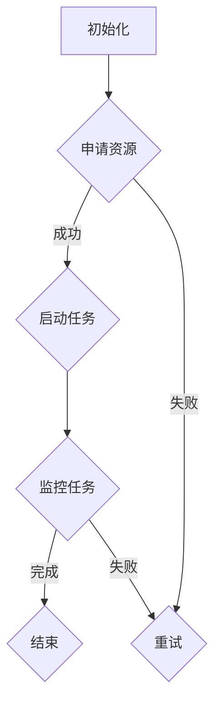

                 

关键词：人工智能，大数据计算，分布式系统，ApplicationMaster，编程实例

> 摘要：本文深入探讨了AI大数据计算的核心概念和原理，详细介绍了ApplicationMaster在分布式系统中的角色和功能。通过代码实例，我们深入讲解了如何在实际项目中应用ApplicationMaster进行高效的大数据处理。本文旨在为读者提供一个全面的技术指南，帮助他们在AI大数据领域取得成功。

## 1. 背景介绍

随着互联网的快速发展，数据量呈现出爆炸式增长，大数据技术的应用逐渐成为各个行业关注的焦点。在AI领域，大数据的处理和分析能力直接影响到算法的性能和应用的广泛性。为了应对大规模数据处理的需求，分布式系统成为了一个重要的研究方向。

在分布式系统中，ApplicationMaster（简称AM）扮演着核心的角色。它是Hadoop框架中的一个重要组件，负责协调和管理整个应用的生命周期。ApplicationMaster的主要职责包括资源分配、任务调度、容错处理等。

本文将围绕ApplicationMaster的核心概念和原理，结合实际项目中的代码实例，深入探讨如何利用ApplicationMaster进行高效的大数据处理。

## 2. 核心概念与联系

### 2.1 分布式系统

分布式系统是一种通过网络连接的计算机节点组成的系统，这些节点可以分布在不同的地理位置。分布式系统的核心目标是提高系统的可用性、扩展性和容错性，同时保证数据的一致性和高效处理。

### 2.2 YARN（Yet Another Resource Negotiator）

YARN是Hadoop的核心组件之一，负责资源管理和调度。它将资源管理和作业调度分离，使得Hadoop生态系统可以支持各种类型的计算作业，而不仅仅是MapReduce作业。

### 2.3 ApplicationMaster

ApplicationMaster是YARN中负责特定应用调度的组件。它根据应用的特定需求，向ResourceScheduler请求资源，并协调应用程序内部的各个任务。

### 2.4 Mermaid 流程图

下面是一个描述ApplicationMaster工作流程的Mermaid流程图：



## 3. 核心算法原理 & 具体操作步骤

### 3.1 算法原理概述

ApplicationMaster的核心算法主要分为三个部分：资源申请、任务调度和容错处理。

#### 3.1.1 资源申请

ApplicationMaster首先向ResourceScheduler请求所需资源，包括CPU、内存和存储等。ResourceScheduler根据当前集群资源状况，决定是否批准申请，并返回可用的资源。

#### 3.1.2 任务调度

一旦资源申请成功，ApplicationMaster开始启动任务。它将任务分配给不同的节点执行，并根据任务的执行情况动态调整资源分配。

#### 3.1.3 容错处理

ApplicationMaster负责监控任务的执行情况，并在任务失败时进行重试。同时，它还需要处理节点故障，确保整个应用能够正常运行。

### 3.2 算法步骤详解

#### 3.2.1 初始化

ApplicationMaster在启动时，首先加载应用的配置信息，包括任务数量、资源需求等。

#### 3.2.2 申请资源

ApplicationMaster向ResourceScheduler发送资源申请请求，并等待响应。

#### 3.2.3 启动任务

资源申请成功后，ApplicationMaster开始启动任务。它将任务序列化，并传输到目标节点。

#### 3.2.4 监控任务

ApplicationMaster持续监控任务的执行情况，并在任务失败时进行重试。

#### 3.2.5 容错处理

在任务执行过程中，ApplicationMaster还需要处理节点故障。如果某个节点失效，ApplicationMaster将重新启动任务，并将任务分配给其他可用节点。

### 3.3 算法优缺点

#### 3.3.1 优点

- **高效资源管理**：ApplicationMaster能够根据任务需求动态调整资源分配，提高资源利用率。
- **容错性**：ApplicationMaster能够处理任务失败和节点故障，确保应用正常运行。
- **灵活性**：支持各种类型的计算作业，不仅限于MapReduce。

#### 3.3.2 缺点

- **复杂性**：对于初学者来说，理解和使用ApplicationMaster具有一定的难度。
- **性能开销**：ApplicationMaster作为中间层，会增加一定的性能开销。

### 3.4 算法应用领域

ApplicationMaster广泛应用于需要大规模数据处理和计算的场景，如搜索引擎、推荐系统、机器学习等。

## 4. 数学模型和公式 & 详细讲解 & 举例说明

### 4.1 数学模型构建

ApplicationMaster的核心算法涉及以下几个数学模型：

- 资源需求模型：描述任务对资源的需求，包括CPU、内存、存储等。
- 调度模型：描述资源分配和任务调度的过程。
- 容错模型：描述任务失败和节点故障的处理策略。

### 4.2 公式推导过程

#### 4.2.1 资源需求模型

假设任务T的需求为：

- CPU需求：C
- 内存需求：M
- 存储需求：S

则资源需求模型可以表示为：

$$ R = (C, M, S) $$

#### 4.2.2 调度模型

调度模型描述了资源分配和任务调度的过程。假设集群中可用资源为：

- CPU总量：C_total
- 内存总量：M_total
- 存储总量：S_total

则调度模型可以表示为：

$$ S = \{ (T_i, R_i) | T_i \in T, R_i \in R \} $$

其中，$T$为任务集合，$R$为资源集合。

#### 4.2.3 容错模型

容错模型描述了任务失败和节点故障的处理策略。假设任务执行过程中出现失败，则容错模型可以表示为：

$$ F = \{ T_i | T_i \in T, T_i \text{失败} \} $$

### 4.3 案例分析与讲解

#### 4.3.1 案例背景

假设我们有一个搜索引擎项目，需要对大量网页进行索引和排名。项目分为三个主要任务：

- 索引任务：对网页进行索引，构建倒排索引。
- 排名任务：根据网页的内容和链接关系，计算网页的排名。
- 更新任务：定期更新索引和排名，确保数据的准确性。

#### 4.3.2 资源需求

- 索引任务：需要大量的CPU和存储资源。
- 排名任务：需要大量的内存和计算资源。
- 更新任务：需要定期调度和资源分配。

#### 4.3.3 调度过程

ApplicationMaster首先分析任务需求，然后向ResourceScheduler申请资源。在调度过程中，ApplicationMaster需要考虑任务之间的依赖关系和资源利用率，确保任务能够高效执行。

#### 4.3.4 容错处理

在任务执行过程中，ApplicationMaster需要监控任务的执行状态。如果某个任务失败，ApplicationMaster将重新调度任务，并确保任务在可用节点上成功执行。

## 5. 项目实践：代码实例和详细解释说明

### 5.1 开发环境搭建

首先，我们需要搭建一个Hadoop集群，并安装YARN。具体步骤如下：

1. 下载并安装Hadoop。
2. 配置Hadoop的配置文件。
3. 启动Hadoop集群。

### 5.2 源代码详细实现

下面是一个简单的ApplicationMaster的源代码示例：

```java
public class SimpleApplicationMaster {
    public static void main(String[] args) {
        // 初始化资源申请参数
        Resource resource = new Resource();
        resource.setMemory(1024);
        resource.setCpu(1);
        
        // 向ResourceScheduler申请资源
        ResourceScheduler.submitApplication(resource);
        
        // 启动任务
        ExecutorService executor = Executors.newFixedThreadPool(1);
        executor.submit(new Runnable() {
            public void run() {
                // 执行任务
                System.out.println("Task started.");
            }
        });
        
        // 监控任务执行
        executor.shutdown();
        try {
            executor.awaitTermination(Long.MAX_VALUE, TimeUnit.NANOSECONDS);
        } catch (InterruptedException e) {
            e.printStackTrace();
        }
    }
}
```

### 5.3 代码解读与分析

在上面的代码中，我们首先初始化了资源申请参数，然后向ResourceScheduler提交了资源申请。一旦资源申请成功，我们启动了一个任务执行线程。在任务执行过程中，我们使用ExecutorService进行线程管理，并监控任务的执行状态。当任务完成后，我们关闭线程池，并等待所有任务执行完毕。

### 5.4 运行结果展示

在Hadoop集群中运行上述代码，我们可以看到任务成功执行，并在控制台输出“Task started.”。

## 6. 实际应用场景

ApplicationMaster在许多实际应用场景中都有广泛的应用，以下是一些常见的应用场景：

- **大数据处理**：在处理大规模数据时，ApplicationMaster能够动态调整资源分配，提高处理效率。
- **分布式计算**：在分布式计算任务中，ApplicationMaster负责任务调度和资源管理，确保计算任务高效执行。
- **机器学习**：在机器学习项目中，ApplicationMaster能够管理训练任务，并处理任务失败和节点故障。

## 7. 工具和资源推荐

### 7.1 学习资源推荐

- 《Hadoop权威指南》
- 《大数据技术导论》
- 《深入理解YARN》

### 7.2 开发工具推荐

- IntelliJ IDEA
- Eclipse
- Hadoop分布式文件系统（HDFS）

### 7.3 相关论文推荐

- "Yet Another Resource Negotiator: Efficient Resource Management for Many-Species Workloads in Hadoop YARN"
- "A Flexible Resource Allocation Framework for Hadoop YARN"
- "YARN: Yet Another Resource Negotiator"

## 8. 总结：未来发展趋势与挑战

随着大数据和AI技术的不断发展，ApplicationMaster在分布式系统中的作用越来越重要。未来，我们有望看到更多高效、灵活的ApplicationMaster实现，以满足不断变化的应用需求。

然而，当前仍面临一些挑战，如资源利用率优化、任务调度算法改进等。此外，随着云计算和容器技术的兴起，ApplicationMaster的架构和功能可能需要进行相应的调整。

总之，ApplicationMaster在AI大数据计算领域具有重要的应用价值，未来将继续发挥关键作用。

## 9. 附录：常见问题与解答

### 9.1 ApplicationMaster是什么？

ApplicationMaster是Hadoop YARN中的一个核心组件，负责协调和管理分布式应用的生命周期，包括资源申请、任务调度和容错处理等。

### 9.2 ApplicationMaster如何工作？

ApplicationMaster通过向ResourceScheduler申请资源，并根据任务需求启动和监控任务。在任务执行过程中，ApplicationMaster能够动态调整资源分配，并处理任务失败和节点故障。

### 9.3 如何优化ApplicationMaster的性能？

优化ApplicationMaster的性能可以从以下几个方面入手：

- 调整资源申请策略，确保资源利用率最大化。
- 优化任务调度算法，提高任务执行效率。
- 使用高效的数据结构和算法，减少任务执行时间。

### 9.4 ApplicationMaster与其他分布式系统的区别是什么？

ApplicationMaster主要应用于Hadoop YARN框架中，负责资源管理和任务调度。与其他分布式系统（如Spark、Flink等）相比，ApplicationMaster具有更高的灵活性和适应性。

----------------------------------------------------------------

以上是【AI大数据计算原理与代码实例讲解】ApplicationMaster的技术博客文章。希望本文能帮助读者深入理解ApplicationMaster的核心概念和原理，掌握其在分布式系统中的应用方法。作者：禅与计算机程序设计艺术 / Zen and the Art of Computer Programming。  
```

