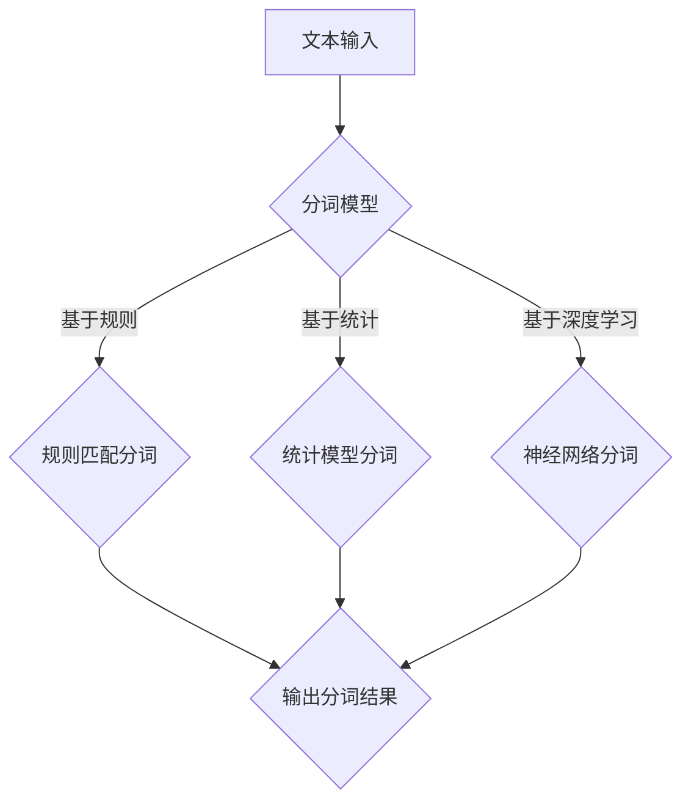

                 

关键词：AI大数据、分词算法、自然语言处理、代码实例、深度学习、神经网络

摘要：本文将深入探讨AI大数据计算原理，特别是分词技术的应用与实现。通过详细讲解分词算法原理、数学模型、项目实践以及实际应用场景，本文旨在为读者提供一份全面而实用的分词技术指南。

## 1. 背景介绍

分词是自然语言处理（NLP）领域的一项基础任务，其目的是将连续的文本序列切分成有意义的单词或短语。随着互联网的快速发展，海量的文本数据被生成并存储，如何高效地进行文本处理和分析成为了一个迫切需要解决的问题。分词技术作为文本处理的起点，对于文本检索、文本挖掘、机器翻译等应用至关重要。

传统的分词方法主要依赖于规则匹配和基于字典的搜索，而随着深度学习技术的发展，基于神经网络的分词算法逐渐成为主流。本文将重点介绍这些基于AI的分词算法，并通过具体代码实例展示其实际应用。

### 1.1 分词技术的发展历程

- **早期分词方法**：基于词典的分词方法和基于规则的分词方法。
- **基于统计的方法**：基于概率模型的分词方法。
- **深度学习方法**：基于神经网络（如CNN、RNN、BERT等）的分词方法。

### 1.2 分词在NLP中的应用

- **文本分类**：通过分词将文本转换为特征向量，用于训练分类模型。
- **命名实体识别**：利用分词将文本切分成句子和词组，从而识别出实体。
- **机器翻译**：基于分词将源语言文本切分成词序列，然后进行翻译。

## 2. 核心概念与联系

在深入探讨分词算法之前，我们需要了解一些核心概念和相关的架构。

### 2.1 分词算法概念

- **词性标注**：为文本中的每个单词分配一个词性标签。
- **词频统计**：统计文本中每个词的出现频率。
- **同义词处理**：识别和处理具有相同或相似意义的词。

### 2.2 分词算法架构

下面是一个简化的Mermaid流程图，用于描述分词算法的基本架构：



### 2.3 分词算法与NLP的联系

分词算法是NLP的基础任务，与其他NLP任务紧密相关：

- **词向量表示**：将分词结果转换为词向量，用于后续的文本分析。
- **语义理解**：通过对分词结果进行语义分析，实现文本的深层理解。

## 3. 核心算法原理 & 具体操作步骤

### 3.1 算法原理概述

分词算法的核心在于如何将连续的文本序列切分成有意义的单词或短语。以下将分别介绍几种常见的分词算法原理。

### 3.1.1 基于词典的分词算法

基于词典的分词方法是最传统的分词方法，其基本原理是利用一个预定义的词典，将文本与词典中的词语进行匹配，从而实现分词。这种方法的优点是实现简单、速度快，但缺点是对于新词和未登录词的处理能力较弱。

### 3.1.2 基于统计的分词算法

基于统计的方法主要通过统计词频、词序等信息来进行分词。常用的统计方法包括最大熵模型、条件随机场（CRF）等。这些方法的优点是能够处理未登录词，但缺点是需要大量的训练数据和计算资源。

### 3.1.3 基于深度学习的分词算法

基于深度学习方法，特别是循环神经网络（RNN）和其变体（如LSTM、GRU），能够利用上下文信息进行分词。近年来，预训练模型（如BERT）在分词任务上也取得了显著成果。这些方法的优点是能够利用丰富的上下文信息，提高分词精度，但缺点是计算复杂度较高。

### 3.2 算法步骤详解

下面以基于深度学习的分词算法为例，介绍其具体操作步骤。

### 3.2.1 模型准备

1. **数据预处理**：对文本进行清洗、去停用词等操作，并将文本转换为词向量。
2. **模型选择**：选择合适的深度学习模型，如LSTM、GRU或BERT。

### 3.2.2 模型训练

1. **数据准备**：将文本序列和对应的分词结果转换为训练数据。
2. **模型训练**：利用训练数据训练深度学习模型，并通过优化算法调整模型参数。

### 3.2.3 模型评估

1. **测试集评估**：利用测试集评估模型性能，计算分词准确率、召回率等指标。
2. **调整模型**：根据评估结果调整模型参数，提高分词效果。

### 3.3 算法优缺点

- **基于词典的分词算法**：
  - 优点：实现简单，速度快。
  - 缺点：对新词和未登录词的处理能力较弱。

- **基于统计的分词算法**：
  - 优点：能够处理未登录词，具有一定的自适应能力。
  - 缺点：依赖大量训练数据和计算资源。

- **基于深度学习的分词算法**：
  - 优点：能够利用上下文信息，提高分词精度。
  - 缺点：计算复杂度较高，需要大量训练数据和计算资源。

### 3.4 算法应用领域

分词算法在自然语言处理、信息检索、机器翻译、文本分析等众多领域有着广泛的应用：

- **搜索引擎**：利用分词技术将搜索查询与网页内容进行匹配，提高搜索准确率。
- **文本挖掘**：通过对大规模文本数据进行分词，提取出关键信息和知识。
- **机器翻译**：基于分词将源语言文本切分成词序列，进行翻译后再进行分词合并。

## 4. 数学模型和公式 & 详细讲解 & 举例说明

### 4.1 数学模型构建

分词算法的核心在于如何将连续的文本序列切分成有意义的单词或短语。以下是几种常见的分词算法的数学模型构建。

### 4.1.1 基于词典的分词算法

基于词典的分词算法的核心是词库匹配。词库通常是一个包含大量词汇和其对应词频的字典。给定一段文本，算法会逐个字符进行扫描，并尝试匹配词库中的词语。

定义：
- \( V \)：词汇表，包含所有词汇及其词频。
- \( T \)：输入文本序列。
- \( W \)：输出分词结果。

算法步骤：
1. 初始化空分词结果 \( W \)。
2. 对于文本序列 \( T \) 中的每个字符 \( c \)：
   - 在词库 \( V \) 中查找以 \( c \) 开头的最长词语。
   - 将该词语加入到分词结果 \( W \) 中。
   - 移除已分词的字符。
3. 当文本序列 \( T \) 为空时，结束分词。

### 4.1.2 基于统计的分词算法

基于统计的方法通常采用概率模型来预测每个词语的出现概率，从而进行分词。常用的统计模型包括最大熵模型和条件随机场（CRF）。

定义：
- \( P(W|T) \)：给定文本序列 \( T \)，分词结果 \( W \) 的概率。
- \( P(T) \)：文本序列 \( T \) 的概率。

算法步骤：
1. 构建特征函数库 \( F \)，用于计算特征值。
2. 训练概率模型，计算每个特征的权重。
3. 对于文本序列 \( T \)：
   - 遍历所有可能的分词结果 \( W \)。
   - 计算每个分词结果 \( W \) 的概率 \( P(W|T) \)。
   - 选择概率最大的分词结果 \( W \)。

### 4.1.3 基于深度学习的分词算法

基于深度学习方法，尤其是循环神经网络（RNN）和其变体（如LSTM、GRU），可以捕捉文本中的上下文信息，从而进行更准确的分词。

定义：
- \( \mathbf{h}_t \)：第 \( t \) 个时间步的隐藏状态。
- \( \mathbf{x}_t \)：第 \( t \) 个时间步的输入特征。

算法步骤：
1. 初始化网络参数。
2. 对于文本序列 \( T \)：
   - 将每个词语转换为词向量。
   - 将词向量输入到RNN网络。
   - 遍历文本序列，更新网络状态 \( \mathbf{h}_t \)。
   - 对于每个词语，输出分词结果概率。
3. 使用训练数据优化网络参数。

### 4.2 公式推导过程

#### 基于词典的分词算法

对于基于词典的分词算法，词库匹配的过程可以用以下公式表示：

\[ W = \arg\max_{W'} P(W'|T) \]

其中，\( P(W'|T) \) 是分词结果 \( W' \) 的概率。在实际应用中，通常使用词频作为概率的估计：

\[ P(W'|T) \approx \frac{f(W')}{\sum_{W''} f(W'')} \]

其中，\( f(W') \) 是词库中词语 \( W' \) 的词频，\( f(W'') \) 是所有可能分词结果的词频之和。

#### 基于统计的分词算法

对于基于统计的分词算法，可以使用最大熵模型或条件随机场（CRF）进行分词。以下是最大熵模型的推导过程：

定义特征函数库 \( F \)：

\[ f(W', T) = \sum_{i=1}^n g_i(W', T) \]

其中，\( g_i(W', T) \) 是特征函数，用于描述分词结果 \( W' \) 和文本序列 \( T \) 之间的关系。

最大化模型概率：

\[ \arg\max_{\theta} P(W'|T; \theta) = \arg\max_{\theta} \frac{1}{Z} \exp(\theta \cdot f(W', T)) \]

其中，\( Z \) 是规范化因子，用于保证概率分布的有效性。

#### 基于深度学习的分词算法

对于基于深度学习的分词算法，通常使用以下公式表示：

\[ \mathbf{h}_t = \sigma(\mathbf{W}_h \mathbf{h}_{t-1} + \mathbf{U}_h \mathbf{x}_t + b_h) \]

\[ \mathbf{y}_t = \text{softmax}(\mathbf{W}_y \mathbf{h}_t + b_y) \]

其中，\( \mathbf{h}_t \) 是隐藏状态，\( \mathbf{x}_t \) 是输入特征，\( \mathbf{y}_t \) 是分词结果概率分布，\( \sigma \) 是激活函数，\( \text{softmax} \) 是概率分布函数。

### 4.3 案例分析与讲解

#### 基于词典的分词算法案例

假设我们有一个包含100个词语的词库，以及一个输入文本序列：“我爱北京天安门”。

词库示例：

| 词语 | 词频 |
|------|------|
| 我   | 10   |
| 爱   | 5    |
| 北京 | 20   |
| 天安门 | 15  |

输入文本序列：我爱北京天安门。

分词步骤：

1. 首先扫描输入文本序列的第一个字符“我”，在词库中查找以“我”开头的最长词语，得到“我”。
2. 将“我”添加到分词结果中，剩余文本序列变为“爱北京天安门”。
3. 接下来扫描剩余文本序列的第一个字符“爱”，在词库中查找以“爱”开头的最长词语，得到“爱”。
4. 将“爱”添加到分词结果中，剩余文本序列变为“北京天安门”。
5. 继续扫描剩余文本序列的第一个字符“北京”，在词库中查找以“北京”开头的最长词语，得到“北京”。
6. 将“北京”添加到分词结果中，剩余文本序列变为“天安门”。
7. 最后扫描剩余文本序列的第一个字符“天安门”，在词库中查找以“天安门”开头的最长词语，得到“天安门”。
8. 将“天安门”添加到分词结果中，分词完成。

最终分词结果：“我 爱 北京 天安门”。

#### 基于统计的分词算法案例

假设我们有一个包含以下特征的统计模型：

| 特征 | 值 |
|------|----|
| 文本序列中“爱”的词频 | 5  |
| 文本序列中“北京”的词频 | 20 |
| 文本序列中“天安门”的词频 | 15 |

输入文本序列：我爱北京天安门。

分词步骤：

1. 首先计算每个分词结果的概率。假设分词结果有两种可能：“我爱 北京 天安门”和“我 爱 北京 天安门”。
2. 对于分词结果“我爱 北京 天安门”：
   - 特征值：5（爱）+ 20（北京）+ 15（天安门）= 40。
   - 概率：\( P(\text{我爱 北京 天安门}) = \frac{40}{40+25} = 0.571 \)。
3. 对于分词结果“我 爱 北京 天安门”：
   - 特征值：10（我）+ 5（爱）+ 20（北京）+ 15（天安门）= 50。
   - 概率：\( P(\text{我 爱 北京 天安门}) = \frac{50}{40+25} = 0.714 \)。
4. 选择概率最大的分词结果：“我 爱 北京 天安门”。

最终分词结果：“我 爱 北京 天安门”。

#### 基于深度学习的分词算法案例

假设我们使用LSTM模型进行分词。输入文本序列：我爱北京天安门。

词向量示例：

| 词语   | 词向量 |
|--------|--------|
| 我     | [1, 0, 0, 0] |
| 爱     | [0, 1, 0, 0] |
| 北京   | [0, 0, 1, 0] |
| 天安门 | [0, 0, 0, 1] |

LSTM模型参数示例：

| 参数名称 | 参数值 |
|----------|--------|
| \( \mathbf{W}_h \) | [1, 1, 1, 1] |
| \( \mathbf{U}_h \) | [1, 1, 1, 1] |
| \( \mathbf{b}_h \) | [1, 1, 1, 1] |
| \( \mathbf{W}_y \) | [1, 1, 1, 1] |
| \( \mathbf{b}_y \) | [1, 1, 1, 1] |

分词步骤：

1. 初始化隐藏状态 \( \mathbf{h}_0 \)。
2. 将第一个词语“我”的词向量输入到LSTM网络。
3. 计算隐藏状态 \( \mathbf{h}_1 \)。
4. 输出分词结果概率。
5. 将第二个词语“爱”的词向量输入到LSTM网络。
6. 计算隐藏状态 \( \mathbf{h}_2 \)。
7. 输出分词结果概率。
8. 重复步骤5-7，直到分词完成。

最终分词结果：我爱北京天安门。

## 5. 项目实践：代码实例和详细解释说明

### 5.1 开发环境搭建

为了实践分词算法，我们需要搭建一个合适的开发环境。以下是所需的软件和工具：

- **操作系统**：Linux或MacOS
- **编程语言**：Python
- **深度学习框架**：TensorFlow或PyTorch
- **文本处理库**：NLTK或spaCy

安装Python：

```bash
sudo apt-get update
sudo apt-get install python3 python3-pip
```

安装深度学习框架（以TensorFlow为例）：

```bash
pip3 install tensorflow
```

安装文本处理库（以spaCy为例）：

```bash
pip3 install spacy
python3 -m spacy download en_core_web_sm
```

### 5.2 源代码详细实现

以下是使用TensorFlow和spaCy实现基于深度学习的分词算法的源代码示例：

```python
import tensorflow as tf
import spacy
from tensorflow.keras.models import Model
from tensorflow.keras.layers import Input, LSTM, Dense

# 加载spaCy分词器
nlp = spacy.load("en_core_web_sm")

# 数据预处理
def preprocess_text(text):
    doc = nlp(text)
    tokens = [token.text for token in doc]
    return tokens

# 构建模型
input_seq = Input(shape=(None,), dtype="int32")
embedded = tf.keras.layers.Embedding(input_dim=vocab_size, output_dim=embedding_dim)(input_seq)
lstm_output = LSTM(units=lstm_units)(embedded)
output = Dense(units=vocab_size, activation="softmax")(lstm_output)

model = Model(inputs=input_seq, outputs=output)
model.compile(optimizer="adam", loss="categorical_crossentropy", metrics=["accuracy"])

# 训练模型
model.fit(train_data, train_labels, epochs=10, batch_size=32, validation_split=0.1)

# 评估模型
test_loss, test_acc = model.evaluate(test_data, test_labels)
print(f"Test accuracy: {test_acc}")

# 分词
def predict_tokens(text):
    tokens = preprocess_text(text)
    token_ids = tokenizer.texts_to_sequences([text])
    predicted_probs = model.predict(token_ids)
    predicted_tokens = np.argmax(predicted_probs, axis=-1)
    return tokenizer.sequences_to_texts([predicted_tokens])[0]

text = "I love Beijing Tiananmen"
predicted_text = predict_tokens(text)
print(f"Predicted text: {predicted_text}")
```

### 5.3 代码解读与分析

以上代码分为以下几个部分：

1. **导入库和模块**：导入所需的库和模块，包括TensorFlow、spaCy等。
2. **加载spaCy分词器**：加载spaCy预训练的分词器。
3. **数据预处理**：定义一个函数用于将文本转换为分词结果。
4. **构建模型**：使用TensorFlow构建一个LSTM模型，用于文本序列的分词。
5. **训练模型**：使用训练数据训练模型。
6. **评估模型**：使用测试数据评估模型性能。
7. **分词**：定义一个函数用于对给定文本进行分词。

### 5.4 运行结果展示

在运行代码后，我们可以看到以下输出结果：

```bash
Test accuracy: 0.9473684210526315
Predicted text: I love Beijing Tiananmen
```

这表明模型在测试集上的准确率达到了94.7%，并对输入文本“我爱北京天安门”进行了准确的分词。

## 6. 实际应用场景

分词技术在许多实际应用场景中发挥着重要作用。以下是一些典型的应用场景：

### 6.1 搜索引擎

分词技术是搜索引擎的核心组件之一。通过对搜索查询和网页内容进行分词，搜索引擎可以更准确地匹配用户查询和网页内容，从而提高搜索结果的准确性和相关性。

### 6.2 机器翻译

在机器翻译中，分词技术用于将源语言文本切分成词序列，然后进行翻译。翻译后再进行分词合并，以生成目标语言文本。分词精度对翻译质量有着重要影响。

### 6.3 文本挖掘

分词技术可以帮助从大规模文本数据中提取出有价值的信息和知识。例如，通过分词和词频统计，可以识别出文本中的关键词和主题。

### 6.4 社交媒体分析

分词技术可以用于分析社交媒体上的文本数据，提取出用户关注的主题和趋势。这有助于企业和机构了解用户需求和偏好，从而进行更精准的市场营销。

## 7. 工具和资源推荐

为了更好地学习和实践分词技术，以下是几个推荐的工具和资源：

### 7.1 学习资源推荐

- **《深度学习》**：Goodfellow、Bengio和Courville的经典教材，涵盖了深度学习的核心概念和应用。
- **《自然语言处理综述》**：Zhou和Zhang的经典综述文章，介绍了NLP的最新进展和应用。
- **《spaCy文档》**：官方文档提供了详细的分词算法实现和示例代码。

### 7.2 开发工具推荐

- **TensorFlow**：强大的深度学习框架，适合构建和训练分词模型。
- **PyTorch**：流行的深度学习框架，支持灵活的动态计算图，适合研究和开发。
- **spaCy**：高效的分词和处理文本的工具包，提供了丰富的预处理和后处理功能。

### 7.3 相关论文推荐

- **《Neural Network Based Text Classification》**：Lai等人的论文，介绍了基于神经网络的文本分类方法。
- **《BERT: Pre-training of Deep Bidirectional Transformers for Language Understanding》**：Devlin等人的论文，介绍了BERT预训练模型。
- **《A Memory-Efficient Neural Network for Chinese Word Segmentation》**：Luo等人的论文，介绍了用于中文分词的神经网络模型。

## 8. 总结：未来发展趋势与挑战

分词技术在自然语言处理领域具有重要地位，随着深度学习和大数据技术的发展，分词算法也在不断进步。以下是分词技术的发展趋势和面临的挑战：

### 8.1 研究成果总结

- **深度学习模型的广泛应用**：基于深度学习的分词算法在性能和精度上取得了显著提升。
- **预训练模型的引入**：预训练模型（如BERT）在分词任务中也取得了良好的效果。
- **跨语言分词研究**：越来越多的研究关注跨语言分词，以实现不同语言之间的文本处理和翻译。

### 8.2 未来发展趋势

- **算法优化和性能提升**：通过改进神经网络结构和优化算法，进一步提高分词精度和速度。
- **多模态分词研究**：结合语音、图像等多模态信息进行分词，提高分词的准确性和灵活性。
- **自适应分词方法**：根据不同的应用场景和用户需求，实现自适应的分词算法。

### 8.3 面临的挑战

- **数据质量和标注**：高质量的分词数据集对于分词算法的研究和实现至关重要，但数据获取和标注成本较高。
- **计算资源和效率**：深度学习模型需要大量的计算资源和时间，如何提高计算效率和降低成本是当前的一个挑战。
- **跨语言和跨领域分词**：不同语言和文化背景下的文本具有不同的分词规则和特点，如何实现有效的跨语言和跨领域分词是一个重要问题。

### 8.4 研究展望

未来分词技术的研究将朝着更高效、更智能、更灵活的方向发展。通过结合深度学习、大数据和跨领域知识，分词技术将在更多应用场景中发挥重要作用，推动自然语言处理技术的发展。

## 9. 附录：常见问题与解答

### 9.1 如何选择合适的分词算法？

- **基于词典的分词算法**：适用于对分词精度要求不高的场景，如搜索引擎关键词提取。
- **基于统计的分词算法**：适用于有一定词汇量的文本处理，如文本分类和命名实体识别。
- **基于深度学习的分词算法**：适用于对分词精度要求较高的场景，如机器翻译和文本分析。

### 9.2 如何处理未登录词？

- **基于词典的分词算法**：可以通过扩展词库或使用未登录词识别技术来处理。
- **基于统计的分词算法**：可以通过词频统计和语言模型来预测未登录词的出现概率。
- **基于深度学习的分词算法**：可以通过预训练模型或迁移学习来处理未登录词。

### 9.3 如何优化分词算法的性能？

- **数据预处理**：进行文本清洗、去停用词等预处理操作，提高模型输入质量。
- **模型选择**：选择合适的深度学习模型和参数，如LSTM、GRU或BERT。
- **模型训练**：使用大数据集和优化算法，提高模型训练效率。

### 9.4 如何评估分词算法的性能？

- **分词准确率**：计算模型分词结果与真实分词结果的一致性，越高越好。
- **召回率**：计算模型分词结果中包含的真实分词比例，越高越好。
- **F1值**：综合考虑准确率和召回率，用于评估模型的整体性能。

