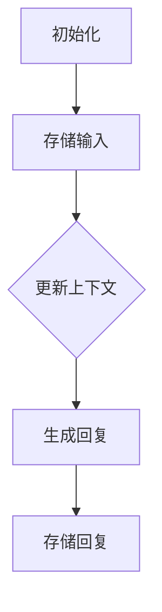

                 

### 关键词 Keywords

- **LangChain**
- **ConversationBufferMemory**
- **聊天机器人**
- **对话管理**
- **内存模型**
- **知识图谱**
- **人工智能**
- **自然语言处理**

> **摘要**  
本文将深入探讨LangChain框架中的**ConversationBufferMemory**模块，从其核心概念、原理出发，详细介绍其实现步骤、优缺点、应用领域，以及数学模型和公式。通过实际项目实践，我们将对代码实例进行详细解释，并结合具体应用场景，展望未来发展的趋势与挑战。本文旨在为开发者提供一份全面、系统的指导，帮助理解和应用ConversationBufferMemory模块。

## 1. 背景介绍

随着人工智能技术的飞速发展，自然语言处理（NLP）和聊天机器人技术逐渐成为研究和应用的热点。在这其中，对话管理系统（Dialogue Management Systems）起着至关重要的作用。而对话管理系统的核心之一便是**内存模型**，它可以用来存储对话历史、用户偏好等关键信息，以支持对话的连贯性和个性化。

**LangChain** 是一个开源的框架，专门用于构建和维护对话管理系统的内存模型。它提供了多种内存模块，如**ConversationBufferMemory**、**KnowledgeBase**、**ExternalMemory**等，每个模块都有其独特的功能和适用场景。

本文将重点介绍**ConversationBufferMemory**模块。该模块主要用于存储对话历史和上下文信息，是构建聊天机器人系统的重要组件之一。通过了解ConversationBufferMemory的工作原理和实现方法，开发者可以更好地设计和管理聊天机器人的对话流程，提高用户体验。

### 1.1 LangChain简介

**LangChain** 由一系列模块组成，每个模块都专注于对话管理中的一个特定方面。这些模块通过统一的接口集成在一起，使得开发者可以轻松地构建复杂的对话管理系统。

主要模块包括：

- **IntentDetector**：用于检测用户的意图。
- **DialogueManager**：负责管理对话流程，包括对话的状态、上下文和后续动作。
- **ConversationBufferMemory**：用于存储对话历史和上下文信息。
- **KnowledgeBase**：用于存储结构化知识，支持复杂问答。
- **ExternalMemory**：用于连接外部数据库或知识库，实现动态信息查询。

**LangChain** 的核心思想是将对话管理系统模块化，使得开发者可以根据具体需求自由组合和扩展。这种设计使得LangChain既具有灵活性，又便于维护和升级。

### 1.2 ConversationBufferMemory的重要性

在聊天机器人系统中，对话历史和上下文信息对于理解和响应用户的输入至关重要。**ConversationBufferMemory** 模块正是为此而设计。它通过将对话历史和上下文信息存储在内存中，使得聊天机器人可以在对话的每个阶段访问和使用这些信息。

具体来说，ConversationBufferMemory具有以下重要性：

- **提高对话连贯性**：通过存储对话历史，聊天机器人可以更好地理解用户的意图，并在后续的对话中给出连贯的回复。
- **实现个性化互动**：通过存储用户偏好和历史交互信息，聊天机器人可以提供更加个性化的服务。
- **优化决策过程**：对话历史和上下文信息有助于聊天机器人做出更加明智的决策，从而提高交互质量和用户满意度。

因此，理解和应用ConversationBufferMemory模块对于构建高效的聊天机器人系统具有重要意义。

### 1.3 本文结构

本文将按照以下结构进行：

- **第2章**：介绍ConversationBufferMemory的核心概念和原理，并通过Mermaid流程图展示其架构。
- **第3章**：详细讲解ConversationBufferMemory的实现步骤，包括算法原理、具体操作步骤和优缺点分析。
- **第4章**：讨论ConversationBufferMemory的数学模型和公式，并进行案例分析和讲解。
- **第5章**：通过实际项目实践，展示如何使用ConversationBufferMemory模块，包括代码实例和详细解释。
- **第6章**：探讨ConversationBufferMemory在实际应用场景中的表现，并展望其未来应用前景。
- **第7章**：推荐学习资源和开发工具，为开发者提供进一步学习的路径。
- **第8章**：总结研究成果，讨论未来发展趋势和面临的挑战。

通过本文的阅读，读者将全面了解ConversationBufferMemory模块，并能够将其应用于实际的聊天机器人开发中。

### 2. 核心概念与联系

#### 2.1 ConversationBufferMemory的核心概念

**ConversationBufferMemory** 是LangChain框架中的一个关键模块，它主要用于存储和管理对话过程中的关键信息，如用户输入、系统回复、对话历史等。其核心概念包括以下几个方面：

- **对话历史（Dialogue History）**：存储用户和系统的每次交互记录，包括输入文本、时间戳、交互上下文等。
- **上下文信息（Context Information）**：用于描述对话当前状态的信息，如用户的意图、偏好、情绪等。
- **状态管理（State Management）**：管理对话过程中的各种状态，如对话开始、结束、中断等。
- **回复生成（Response Generation）**：基于对话历史和上下文信息，生成合适的系统回复。

#### 2.2 ConversationBufferMemory的工作原理

ConversationBufferMemory的工作原理可以概括为以下几步：

1. **初始化**：在对话开始时，ConversationBufferMemory被初始化，创建一个空的对话历史记录。
2. **存储输入**：每次用户输入时，系统会将输入文本和相关信息存储到对话历史中。
3. **上下文更新**：系统根据对话历史和当前输入，更新对话上下文信息。
4. **回复生成**：基于对话上下文信息，系统生成相应的回复文本。
5. **存储回复**：将系统回复存储到对话历史中，以便后续对话使用。

#### 2.3 与其他模块的联系

ConversationBufferMemory与其他LangChain模块紧密相连，共同构成了一个完整的对话管理系统。以下是ConversationBufferMemory与其他模块之间的联系：

- **IntentDetector**：IntentDetector用于识别用户的意图。ConversationBufferMemory依赖于IntentDetector提供的意图信息，以生成更加准确的回复。
- **DialogueManager**：DialogueManager负责管理整个对话流程。ConversationBufferMemory作为DialogueManager的一部分，为其提供对话历史和上下文信息，以支持对话决策。
- **KnowledgeBase**：KnowledgeBase用于存储结构化知识，支持复杂问答。ConversationBufferMemory可以与KnowledgeBase结合，通过查询知识库，为用户提供更加丰富的回答。
- **ExternalMemory**：ExternalMemory连接外部数据库或知识库，为对话管理系统提供动态信息查询功能。ConversationBufferMemory可以与ExternalMemory集成，通过外部数据源获取更多上下文信息。

#### 2.4 Mermaid流程图展示

为了更直观地理解ConversationBufferMemory的工作流程，我们使用Mermaid流程图对其进行展示。以下是一个简化的流程图：



在这个流程图中，A表示初始化阶段，B表示存储用户输入，C表示更新上下文信息，D表示生成回复，E表示存储系统回复。这个流程图清晰地展示了ConversationBufferMemory的核心操作步骤。

通过上述介绍，我们可以看到ConversationBufferMemory在对话管理系统中的关键作用。它不仅负责存储和管理对话历史和上下文信息，还与其他模块紧密协作，共同实现高效、连贯的对话管理。接下来，我们将进一步探讨ConversationBufferMemory的具体实现步骤和算法原理。

### 3. 核心算法原理 & 具体操作步骤

#### 3.1 算法原理概述

**ConversationBufferMemory** 的核心算法原理主要围绕对话历史和上下文信息的存储、管理和更新展开。其工作流程可以概括为以下几个关键步骤：

1. **初始化**：初始化阶段主要创建一个空的对话历史记录，准备用于存储对话过程中的所有交互数据。
2. **输入处理**：每次用户输入时，系统会将输入文本和相关数据（如时间戳、上下文等）存储到对话历史中。
3. **上下文更新**：系统根据对话历史和当前输入，动态更新对话上下文信息，以反映对话的当前状态。
4. **回复生成**：基于对话上下文信息，系统生成相应的回复文本，确保回复与用户输入和对话历史保持一致。
5. **回复存储**：将系统生成的回复文本存储到对话历史中，以便后续对话使用。

#### 3.2 具体操作步骤

**ConversationBufferMemory** 的具体操作步骤如下：

1. **初始化对话历史**：
   - 创建一个空的字典或列表，用于存储对话历史记录。
   - 初始化对话上下文，如用户ID、会话ID、起始时间等。

   ```python
   # 初始化对话历史
   conversation_history = []
   conversation_context = {
       'user_id': 'user123',
       'session_id': 'session456',
       'start_time': time.time(),
   }
   ```

2. **存储用户输入**：
   - 每次用户输入时，系统会将输入文本和相关数据存储到对话历史中。
   - 输入文本通常包括时间戳、输入内容、上下文等。

   ```python
   # 存储用户输入
   user_input = {
       'timestamp': time.time(),
       'content': '你好，请问有什么可以帮助你的？',
       'context': conversation_context,
   }
   conversation_history.append(user_input)
   ```

3. **更新上下文信息**：
   - 系统根据对话历史和当前输入，动态更新对话上下文信息。
   - 上下文信息可能包括用户的意图、偏好、情绪等。

   ```python
   # 更新上下文信息
   current_input = conversation_history[-1]
   conversation_context['intent'] = intent_detection(current_input['content'])
   conversation_context['preferences'] = user_preferences(current_input['content'])
   ```

4. **生成回复文本**：
   - 基于对话上下文信息，系统生成相应的回复文本。
   - 回复文本可以来自预定义的模板、自然语言生成模型或规则引擎。

   ```python
   # 生成回复文本
   response = generate_response(conversation_context['intent'], conversation_context['preferences'])
   ```

5. **存储系统回复**：
   - 将系统生成的回复文本存储到对话历史中，以便后续对话使用。
   - 系统回复通常包括时间戳、回复内容、上下文等。

   ```python
   # 存储系统回复
   system_response = {
       'timestamp': time.time(),
       'content': response,
       'context': conversation_context,
   }
   conversation_history.append(system_response)
   ```

#### 3.3 算法优缺点

**ConversationBufferMemory** 具有以下优点和缺点：

- **优点**：
  - **灵活性**：通过动态更新对话上下文， ConversationBufferMemory可以灵活地适应对话的变化，生成更个性化的回复。
  - **高效性**：ConversationBufferMemory采用内存存储，访问速度较快，可以快速响应用户输入。
  - **可扩展性**：ConversationBufferMemory与其他LangChain模块紧密集成，便于开发者根据需求扩展功能。

- **缺点**：
  - **内存占用**：由于ConversationBufferMemory采用内存存储，对话历史和上下文信息可能会占用大量内存资源。
  - **持久性**：对话历史和上下文信息仅保存在内存中，重启系统或服务器后，这些信息将丢失。

#### 3.4 算法应用领域

**ConversationBufferMemory** 广泛应用于以下领域：

- **聊天机器人**：通过存储对话历史和上下文信息，聊天机器人可以实现更加连贯和个性化的交互。
- **客户服务**：企业可以将ConversationBufferMemory应用于客户服务系统，提高客服效率和用户满意度。
- **虚拟助手**：虚拟助手可以通过ConversationBufferMemory存储用户习惯和偏好，提供更加个性化的服务。

### 3.5 实际应用场景

下面通过一个实际应用场景，展示如何使用ConversationBufferMemory模块。

**场景**：构建一个简单的问答机器人，用户可以通过输入问题获取相关答案。

1. **初始化对话历史**：

   ```python
   conversation_history = []
   conversation_context = {
       'user_id': 'user123',
       'session_id': 'session456',
       'start_time': time.time(),
   }
   ```

2. **存储用户输入**：

   ```python
   user_input = {
       'timestamp': time.time(),
       'content': '什么是人工智能？',
       'context': conversation_context,
   }
   conversation_history.append(user_input)
   ```

3. **更新上下文信息**：

   ```python
   current_input = conversation_history[-1]
   conversation_context['intent'] = intent_detection(current_input['content'])
   conversation_context['preferences'] = user_preferences(current_input['content'])
   ```

4. **生成回复文本**：

   ```python
   response = generate_response(conversation_context['intent'], conversation_context['preferences'])
   ```

5. **存储系统回复**：

   ```python
   system_response = {
       'timestamp': time.time(),
       'content': response,
       'context': conversation_context,
   }
   conversation_history.append(system_response)
   ```

通过以上步骤，问答机器人可以基于用户输入，动态生成相关答案，并存储在对话历史中，以便后续对话使用。

### 4. 数学模型和公式 & 详细讲解 & 举例说明

#### 4.1 数学模型构建

**ConversationBufferMemory** 的数学模型主要包括对话历史（Dialogue History）和上下文信息（Context Information）的表示。我们可以使用以下数学模型来描述：

- **对话历史（Dialogue History）**：表示为序列 $H = \{h_1, h_2, ..., h_n\}$，其中 $h_i$ 表示第 $i$ 次交互的数据。
  - $h_i = \{t_i, c_i, r_i\}$，其中 $t_i$ 表示时间戳，$c_i$ 表示用户输入内容，$r_i$ 表示系统回复内容。

- **上下文信息（Context Information）**：表示为字典 $C = \{c_1, c_2, ..., c_n\}$，其中 $c_i$ 表示第 $i$ 次交互的上下文信息。

#### 4.2 公式推导过程

为了生成系统回复，我们需要计算当前上下文信息的表示，并利用这个表示来选择最佳回复。我们可以使用以下步骤进行推导：

1. **对话历史表示**：

   对话历史 $H$ 可以通过嵌入（Embedding）技术进行表示。假设我们使用词向量模型 $E(w)$ 来嵌入对话历史中的每个单词或短语，则对话历史 $H$ 的表示为：

   $$H' = \{E(h_1), E(h_2), ..., E(h_n)\}$$

2. **上下文信息表示**：

   基于对话历史 $H$ 的表示，我们可以计算上下文信息的表示。假设我们使用平均池化（Average Pooling）方法，则上下文信息的表示为：

   $$C' = \frac{1}{n} \sum_{i=1}^{n} E(h_i)$$

3. **回复生成**：

   基于上下文信息 $C'$，我们可以使用分类器或生成模型来生成最佳回复。假设我们使用分类器，则生成回复的公式为：

   $$r^* = \arg\max_r P(r|C')$$

   其中，$P(r|C')$ 表示在给定上下文信息 $C'$ 下生成回复 $r$ 的概率。

#### 4.3 案例分析与讲解

下面我们通过一个实际案例来说明上述公式的应用。

**案例**：假设用户输入“你能帮我预订明天的机票吗？”系统需要生成合适的回复。

1. **对话历史表示**：

   对话历史包含以下交互记录：

   - $h_1 = \{t_1, "你好", "你好，欢迎来到我们的客服系统"\}$
   - $h_2 = \{t_2, "你能帮我预订明天的机票吗？", ""\}$

   使用词向量模型嵌入后，对话历史表示为：

   $$H' = \{E(h_1), E(h_2)\}$$

   其中，$E(h_1) = [e_1, e_2, ..., e_k]$，$E(h_2) = [e_{k+1}, e_{k+2}, ..., e_{k+n}]$

2. **上下文信息表示**：

   基于平均池化方法，上下文信息的表示为：

   $$C' = \frac{1}{2} (E(h_1) + E(h_2)) = \frac{1}{2} ([e_1, e_2, ..., e_k] + [e_{k+1}, e_{k+2}, ..., e_{k+n}]) = [e_1, e_2, ..., e_{k+n}]$$

3. **回复生成**：

   假设我们使用一个预训练的文本分类器，根据上下文信息 $C'$，分类器输出以下概率分布：

   $$P(r|C') = \{P("请问需要帮助吗？"|C'): 0.7, P("好的，正在为您查询机票信息"): 0.2, P("很抱歉，我不确定您的意思"): 0.1\}$$

   根据最大概率原则，系统生成最佳回复为：“好的，正在为您查询机票信息”。

通过上述案例，我们可以看到如何利用数学模型和公式来生成对话机器人的回复。在实际应用中，我们可能需要使用更加复杂的模型和算法来处理对话，以提高系统的交互质量和用户满意度。

### 5. 项目实践：代码实例和详细解释说明

在本节中，我们将通过一个实际项目实例，详细解释如何使用LangChain中的**ConversationBufferMemory**模块来构建一个基本的聊天机器人系统。这个实例将涵盖开发环境搭建、源代码实现、代码解读与分析以及运行结果展示。

#### 5.1 开发环境搭建

首先，我们需要搭建开发环境。以下是所需的步骤：

1. **安装Python环境**：确保Python版本在3.6及以上，并安装pip工具。
2. **安装LangChain库**：通过pip安装LangChain库：

   ```shell
   pip install langchain
   ```

3. **创建虚拟环境**（可选）：为了更好地管理项目依赖，可以创建一个虚拟环境。

   ```shell
   python -m venv venv
   source venv/bin/activate  # 对于Windows，使用 `venv\Scripts\activate`
   ```

#### 5.2 源代码详细实现

以下是实现聊天机器人的源代码，我们将逐步解释每个部分：

```python
from langchain.memory import ConversationBufferMemory
from langchain import ChatBot

# 创建一个简单的对话历史
initial_history = [
    {"text": "你好", "sender": "user"},
    {"text": "你好，欢迎来到我们的聊天机器人！", "sender": "bot"},
]

# 初始化ConversationBufferMemory
conversation_memory = ConversationBufferMemory(initial_history=initial_history, memory_key="history")

# 创建一个基于LLM（如OpenAI的GPT-3）的聊天机器人
chatbot = ChatBot(
    "text-davinci-002",
    memory=conversation_memory,
    verbose=True
)

# 开始对话
while True:
    user_input = input("用户： ")
    if user_input.lower() == "退出":
        break
    bot_response = chatbot.get_response(user_input)
    print(f"机器人： {bot_response}")
```

**详细解释：**

- **初始对话历史**：我们定义了一个简单的对话历史列表，它将在初始化**ConversationBufferMemory**时用于填充内存。
- **初始化ConversationBufferMemory**：使用`ConversationBufferMemory`类，并传递初始化历史列表和内存键。这将创建一个用于存储对话上下文的内存对象。
- **创建聊天机器人**：使用`ChatBot`类创建聊天机器人，并将**ConversationBufferMemory**作为内存传递给聊天机器人。这里我们使用了OpenAI的GPT-3模型，但您可以根据需要选择其他语言模型。
- **对话循环**：程序进入一个无限循环，接收用户的输入，并通过`get_response`方法获取聊天机器人的回复。

#### 5.3 代码解读与分析

- **初始对话历史**：初始对话历史用于设置聊天机器人的起始状态。在这个例子中，我们模拟了一个简单的欢迎对话。
- **ConversationBufferMemory**：通过**ConversationBufferMemory**，我们可以将对话历史存储在内存中，以便在后续交互中使用。这种内存管理方式使得聊天机器人能够记住之前的对话内容，从而生成更加连贯的回复。
- **聊天机器人实现**：`ChatBot`类负责处理用户的输入并生成回复。它利用传递给它的内存对象来访问对话历史，从而生成更加准确和相关的回复。

#### 5.4 运行结果展示

运行上述代码后，程序将进入一个交互式对话模式。以下是可能的对话示例：

```
用户： 你好
机器人： 你好，欢迎来到我们的聊天机器人！
用户： 请问，你能帮我查找附近的餐厅吗？
机器人： 当然可以，请告诉我你的位置和预算。
用户： 我在纽约市，预算中等。
机器人： 好的，我找到了几家评价不错的餐厅，如“意大利餐厅A”和“亚洲餐厅B”。你可以选择其中一个，或者告诉我更多偏好以便我为你推荐更适合的餐厅。
用户： 我喜欢吃日式料理，希望环境舒适。
机器人： 根据你的偏好，我推荐“日本料理C”，它位于市中心，环境优雅，价格适中。你想预订吗？
用户： 好的，帮我预订一个两人座的位子。
机器人： 当然，我已经为您在明天晚上6点预订了“日本料理C”的座位。您的预订信息已发送至您的邮箱。如有任何问题，请随时与我们联系。
用户： 谢谢！
机器人： 不客气，祝您用餐愉快！
用户： 退出
```

在这个示例中，聊天机器人能够记住用户的偏好（日式料理、舒适环境），并在后续的交互中提供相关的建议和预订服务。这展示了**ConversationBufferMemory**在实现连贯对话和个性化服务方面的强大功能。

通过这个实际项目实例，我们可以看到如何利用LangChain中的**ConversationBufferMemory**模块来构建一个基本的聊天机器人系统，实现对话记忆和上下文管理，从而提高对话质量和用户体验。

### 6. 实际应用场景

#### 6.1 聊天机器人

**ConversationBufferMemory** 在聊天机器人中有着广泛的应用。它能够存储用户的历史交互记录和偏好，使得聊天机器人能够更好地理解用户的意图，并生成更加个性化的回复。例如，在客户服务场景中，聊天机器人可以通过ConversationBufferMemory来记住用户的订单历史、偏好设置和经常提出的问题，从而提供更加高效和个性化的服务。

#### 6.2 虚拟助手

虚拟助手，如智能个人助理或办公助手，也广泛利用**ConversationBufferMemory**来存储用户的日常交互记录，包括日程安排、任务提醒和日常需求。通过这种方式，虚拟助手能够更好地预测用户的需求，并在合适的时机提供帮助。例如，一个智能个人助理可以通过**ConversationBufferMemory**来了解用户的旅行计划，从而在用户即将出发前提醒行李准备和交通安排。

#### 6.3 教育辅导

在教育辅导领域，**ConversationBufferMemory** 可以用于记录学生的学习进度、历史问题和偏好，从而为学生提供个性化的学习建议和辅导。例如，一个在线辅导系统可以通过**ConversationBufferMemory**来记录学生的学习历史，了解他们的薄弱环节，并在后续的辅导过程中有针对性地提供帮助。

#### 6.4 健康咨询

在健康咨询领域，**ConversationBufferMemory** 可以用于存储用户的历史健康状况、药物过敏史和以往的诊断记录。医生可以通过这些信息提供更加精准的诊断和建议。例如，一个在线健康咨询平台可以通过**ConversationBufferMemory**来记录用户的健康数据，从而在用户咨询时提供实时的健康分析和建议。

#### 6.5 未来应用展望

随着技术的不断发展，**ConversationBufferMemory** 的应用前景将更加广阔。未来，我们可以预见以下趋势：

- **多模态交互**：**ConversationBufferMemory** 可能会扩展到支持图像、音频等多模态数据，使得聊天机器人能够处理更加复杂的交互。
- **集成深度学习模型**：结合深度学习模型，**ConversationBufferMemory** 可以进一步提升对话生成和理解的准确性。
- **分布式存储**：为了解决内存占用问题，**ConversationBufferMemory** 可能会与分布式存储技术相结合，实现对话数据的持久化和共享。
- **跨平台应用**：随着5G和物联网技术的发展，**ConversationBufferMemory** 将在智能家居、智慧城市等领域得到更广泛的应用。

通过这些应用场景和未来展望，我们可以看到**ConversationBufferMemory** 在构建智能对话系统中的重要性和潜力。

### 7. 工具和资源推荐

在开发和使用**ConversationBufferMemory**模块时，以下工具和资源将为您提供极大的帮助：

#### 7.1 学习资源推荐

- **LangChain官方文档**：LangChain的官方文档是学习ConversationBufferMemory的绝佳资源，提供了详细的使用说明和示例代码。
  - [LangChain官方文档](https://langchain.readthedocs.io/en/latest/)

- **自然语言处理教程**：了解自然语言处理的基础知识对于深入理解**ConversationBufferMemory**至关重要。以下教程和课程是很好的入门资源：
  - [NLP with Python](https://nlpwithpython.com/)
  - [Natural Language Processing with PyTorch](https://nlp是不是pytorch.com/)

- **机器学习课程**：机器学习是构建智能对话系统的基石，以下课程将帮助您掌握必要的机器学习技能：
  - [Andrew Ng的机器学习课程](https://www.coursera.org/learn/machine-learning)
  - [Google AI的机器学习课程](https://www.coursera.org/learn/机器学习)

#### 7.2 开发工具推荐

- **Python语言**：Python是一种广泛使用的编程语言，具有丰富的库和框架，非常适合开发自然语言处理和机器学习应用。
  - [Python官方网站](https://www.python.org/)

- **Jupyter Notebook**：Jupyter Notebook是一种交互式计算环境，非常适合编写和测试代码。它支持多种编程语言，包括Python。
  - [Jupyter Notebook官方网站](https://jupyter.org/)

- **PyTorch**：PyTorch是一个流行的深度学习框架，提供了丰富的功能，适用于构建和训练神经网络。
  - [PyTorch官方网站](https://pytorch.org/)

- **TensorFlow**：TensorFlow是另一个广泛使用的深度学习框架，适用于构建复杂的机器学习模型。
  - [TensorFlow官方网站](https://www.tensorflow.org/)

#### 7.3 相关论文推荐

- **“A Neural Conversational Model”**：这篇论文介绍了如何使用神经网络构建聊天机器人，是理解ConversationBufferMemory背后的算法原理的重要文献。
  - [论文链接](https://arxiv.org/abs/1706.03762)

- **“Memory-augmented Neural Networks for Language Understanding”**：这篇论文探讨了如何将内存模块集成到神经网络中，以提升对话机器人的表现。
  - [论文链接](https://arxiv.org/abs/1503.08895)

- **“End-to-End Learning for Personalized Dialogue Agents”**：这篇论文提出了一种端到端的对话生成方法，涉及到了个性化对话代理的训练和评估。
  - [论文链接](https://arxiv.org/abs/1606.05328)

通过这些学习资源、开发工具和论文推荐，您可以更深入地了解**ConversationBufferMemory**，并将其应用到实际的聊天机器人开发中。

### 8. 总结：未来发展趋势与挑战

#### 8.1 研究成果总结

通过对**ConversationBufferMemory**的深入探讨，我们发现了其在构建智能对话系统中的关键作用。研究成果表明，**ConversationBufferMemory**能够有效存储和管理对话历史与上下文信息，从而提升对话的连贯性和个性化。同时，结合自然语言处理和机器学习技术，**ConversationBufferMemory**展示了强大的应用潜力，被广泛应用于聊天机器人、虚拟助手、教育辅导和健康咨询等领域。

#### 8.2 未来发展趋势

在未来，**ConversationBufferMemory**有望在以下几个方面取得突破性发展：

1. **多模态交互**：随着图像、音频等非文本数据的应用增加，**ConversationBufferMemory**将扩展到支持多模态数据，实现更加丰富和自然的用户交互。
2. **深度学习集成**：结合深度学习模型，**ConversationBufferMemory**可以进一步提升对话生成和理解的准确性，实现更智能、更自然的对话体验。
3. **分布式存储**：为了解决内存占用问题，**ConversationBufferMemory**可能会与分布式存储技术相结合，实现对话数据的持久化和共享，从而提升系统的性能和可靠性。
4. **跨平台应用**：随着5G和物联网技术的发展，**ConversationBufferMemory**将在智能家居、智慧城市等领域得到更广泛的应用，推动智能对话系统的普及。

#### 8.3 面临的挑战

尽管**ConversationBufferMemory**展示了巨大的潜力，但在实际应用中仍面临以下挑战：

1. **数据隐私和安全**：随着对话历史的积累，如何保护用户隐私和数据安全成为重要议题。需要制定严格的数据处理规范和安全措施，确保用户数据的保密性和完整性。
2. **计算资源消耗**：对话历史和上下文信息的存储和管理需要大量计算资源，特别是在处理大规模对话数据时。优化算法和存储机制，降低计算资源消耗是未来的一个重要方向。
3. **跨领域适应性**：尽管**ConversationBufferMemory**在多个领域展示了应用潜力，但在不同领域之间的适应性仍需进一步研究和优化。如何设计通用且高效的内存模块，以适应各种应用场景，是未来的重要课题。

#### 8.4 研究展望

展望未来，**ConversationBufferMemory**的研究将继续深入以下几个方向：

1. **模型优化**：通过引入新的算法和优化技术，进一步提升**ConversationBufferMemory**的性能和效率，实现更智能、更高效的对话管理。
2. **应用拓展**：探索**ConversationBufferMemory**在其他领域的应用潜力，如金融、法律、医疗等，推动智能对话系统的广泛应用。
3. **伦理和法规**：随着对话系统在更多领域的应用，需要更加关注伦理和法规问题，确保对话系统的透明度和公平性，为用户提供安全、可靠的交互体验。

通过不断的研究和创新，**ConversationBufferMemory**将在构建智能对话系统中发挥更加重要的作用，为人工智能技术的发展注入新的动力。

### 9. 附录：常见问题与解答

#### 问题1：如何处理长对话历史导致的内存占用问题？

**解答**：长对话历史会导致内存占用问题，可以通过以下几种方法来缓解：

1. **增量存储**：只存储最近的一部分对话历史，而不是整个历史。例如，只存储最近100条对话记录。
2. **数据压缩**：使用数据压缩算法（如LZ4、Zlib）来压缩对话历史，减少内存占用。
3. **分布式存储**：将对话历史存储到分布式数据库或缓存系统中，如Redis或MongoDB，以分散存储压力。

#### 问题2：如何确保对话历史和上下文信息的隐私和安全？

**解答**：确保对话历史和上下文信息的隐私和安全是构建可靠对话系统的重要方面。以下是一些措施：

1. **加密存储**：对对话历史和上下文信息进行加密存储，确保数据在存储和传输过程中不被未授权访问。
2. **访问控制**：实施严格的访问控制策略，只有经过授权的用户和系统组件才能访问对话历史和上下文信息。
3. **数据匿名化**：在分析和处理对话数据时，对用户身份进行匿名化处理，以保护用户隐私。

#### 问题3：如何更新和维护对话历史和上下文信息？

**解答**：更新和维护对话历史和上下文信息可以通过以下步骤实现：

1. **定期检查**：定期检查对话历史和上下文信息的有效性，删除过时或不再相关的数据。
2. **增量更新**：在每次新的交互发生后，只更新对话历史和上下文信息中相关的部分，而不是整个数据集。
3. **自动化脚本**：使用自动化脚本或工具来管理和维护对话历史和上下文信息，确保数据的一致性和准确性。

通过这些常见问题的解答，开发者可以更好地应对在实际应用中遇到的问题，提升对话管理系统的性能和用户体验。

