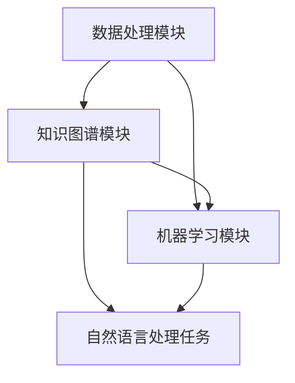

                 

关键词：LangChain、编程、入门、实践、核心概念、模块、自然语言处理、知识图谱、图数据库、机器学习、数据处理、人工智能、深度学习。

摘要：本文将深入探讨LangChain编程的核心概念和模块，帮助读者从入门到实践，逐步了解并掌握LangChain的使用方法。通过详细解析其架构、算法原理、数学模型以及实际应用场景，本文旨在为读者提供全面的指导，助力他们在人工智能和自然语言处理领域取得突破。

## 1. 背景介绍

随着人工智能和自然语言处理技术的不断发展，构建高效、灵活的编程框架成为众多研究者和开发者的需求。LangChain应运而生，它是一个开源的编程框架，专注于自然语言处理的任务，旨在帮助开发者简化语言模型的开发和使用过程。

LangChain的设计理念是将复杂的自然语言处理任务分解为一系列可复用的模块，使得开发者可以专注于具体任务的创新和优化，而无需从零开始搭建整个系统。通过结合图数据库、知识图谱、机器学习等先进技术，LangChain为开发者提供了强大的数据处理和分析能力。

本文将围绕LangChain的核心概念和模块进行详细介绍，帮助读者从入门到实践，逐步掌握这个强大的编程工具。接下来，我们将首先介绍LangChain的背景和重要性，然后深入探讨其核心概念和架构，并详细解析其算法原理和数学模型。最后，我们将通过项目实践和实际应用场景，展示LangChain的强大功能和应用潜力。

### 1.1 LangChain的起源和发展历程

LangChain的起源可以追溯到近年来自然语言处理领域的快速发展和需求增加。随着深度学习技术的突破，语言模型如BERT、GPT-3等取得了令人瞩目的成果。然而，这些先进的语言模型在实际应用中仍然面临着一些挑战，如如何高效地进行数据处理、如何构建灵活的交互系统、如何将不同模型进行有效集成等。

为了解决这些问题，一些学者和研究机构开始探索构建高效的编程框架，以便更好地利用自然语言处理技术。其中，LangChain就是其中一个重要的尝试。LangChain最初由美国加州大学伯克利分校的研究团队提出，并在2019年首次公开发布。该框架旨在提供一种灵活、可扩展的编程方式，使得开发者能够轻松构建复杂、高效的自然语言处理系统。

自发布以来，LangChain得到了广泛的关注和认可。许多研究者和开发者开始将其应用于各种自然语言处理任务中，如文本分类、情感分析、问答系统等。随着不断的发展和优化，LangChain逐渐成为自然语言处理领域的重要工具之一。

### 1.2 LangChain的重要性

在自然语言处理领域，高效、灵活的编程框架对于研究者和开发者来说至关重要。以下是一些LangChain的重要性和优势：

1. **模块化设计**：LangChain采用模块化设计，将自然语言处理任务分解为一系列可复用的模块。这种设计使得开发者可以专注于特定任务的创新和优化，而无需从零开始搭建整个系统。

2. **高效数据处理**：LangChain结合了图数据库、知识图谱等技术，提供了强大的数据处理和分析能力。这使得开发者能够高效地处理大规模的文本数据，为自然语言处理任务提供有力支持。

3. **易用性**：LangChain的设计理念是简化自然语言处理任务的开发和使用过程。它提供了丰富的API和工具，使得开发者可以轻松地集成和使用不同的语言模型和算法。

4. **可扩展性**：LangChain的设计具有高度的可扩展性，开发者可以根据需求自定义和扩展不同的模块和功能，以满足特定任务的需求。

5. **社区支持**：LangChain拥有一个活跃的开发者社区，提供了丰富的文档、教程和示例代码。这使得开发者能够更容易地入门和掌握LangChain，并与其他开发者进行交流和合作。

综上所述，LangChain在自然语言处理领域具有重要的地位和广阔的应用前景。通过本文的详细介绍，我们将帮助读者深入了解LangChain的核心概念和模块，为他们在人工智能和自然语言处理领域的研究和实践提供有力支持。

### 2. 核心概念与联系

在深入探讨LangChain的核心概念和模块之前，我们首先需要了解其背后的原理和架构。LangChain的设计理念是将复杂的自然语言处理任务分解为一系列可复用的模块，这些模块通过标准化的接口进行通信和协作。以下是LangChain的核心概念和模块及其相互关系的详细解析。

#### 2.1 数据处理模块

数据处理模块是LangChain的核心模块之一，负责对输入数据进行预处理、清洗和格式化。该模块的主要任务包括：

1. **文本分词**：将输入文本分割为单词、短语或句子等基本单元。
2. **去除停用词**：去除对自然语言处理任务影响较小或无意义的词汇，如“的”、“了”、“在”等。
3. **词性标注**：对文本中的每个词进行词性分类，如名词、动词、形容词等。
4. **数据清洗**：去除或修正文本中的噪声数据，如标点符号、特殊字符等。

数据处理模块的设计原则是高效性和灵活性。LangChain提供了多种数据处理算法和工具，开发者可以根据具体任务的需求进行选择和配置。

#### 2.2 知识图谱模块

知识图谱模块是LangChain的另一个重要组成部分，负责构建和存储语义信息。知识图谱通过将实体、关系和属性进行关联，形成一种结构化的语义表示。该模块的主要任务包括：

1. **实体识别**：从文本中识别出关键实体，如人名、地名、组织名等。
2. **关系抽取**：识别实体之间的关系，如“工作于”、“出生地”等。
3. **属性抽取**：提取实体属性信息，如“身高”、“年龄”等。
4. **图谱构建**：将实体、关系和属性整合为知识图谱，为后续的自然语言处理任务提供支持。

知识图谱模块的设计原则是灵活性和扩展性。LangChain支持多种知识图谱构建方法，如基于规则的方法、基于机器学习的方法等。开发者可以根据任务需求选择合适的图谱构建策略。

#### 2.3 机器学习模块

机器学习模块是LangChain的智能核心，负责执行各种自然语言处理任务。该模块包括多种机器学习算法和模型，如文本分类、情感分析、命名实体识别等。机器学习模块的主要任务包括：

1. **模型选择**：根据任务需求选择合适的机器学习模型。
2. **模型训练**：使用训练数据对机器学习模型进行训练，提高模型的预测能力。
3. **模型评估**：评估模型的性能，如准确率、召回率、F1值等。
4. **模型应用**：将训练好的模型应用于实际任务中，实现自动化自然语言处理。

机器学习模块的设计原则是灵活性和可扩展性。LangChain支持多种机器学习框架和算法，如TensorFlow、PyTorch、Scikit-learn等。开发者可以根据具体需求选择和集成不同的机器学习模型和工具。

#### 2.4 模块之间的联系

数据处理模块、知识图谱模块和机器学习模块之间紧密联系，共同构成了LangChain的整体架构。以下是这些模块之间的主要联系：

1. **数据处理模块为知识图谱模块提供数据基础**。通过文本分词、去除停用词等操作，数据处理模块生成了结构化的文本数据，这些数据为知识图谱模块的实体识别和关系抽取提供了重要支持。
2. **知识图谱模块为机器学习模块提供语义信息**。知识图谱模块构建了语义信息丰富的知识图谱，为机器学习模块的模型训练和预测提供了高质量的语义表示。
3. **机器学习模块为数据处理模块和知识图谱模块提供智能支持**。通过机器学习算法，机器学习模块实现了文本分类、命名实体识别等任务，这些任务的结果又可以反馈给数据处理模块和知识图谱模块，进一步优化和改进系统的性能。

#### 2.5 Mermaid流程图

为了更直观地展示LangChain的核心概念和模块之间的联系，我们可以使用Mermaid流程图进行描述。以下是LangChain的Mermaid流程图：



在上述流程图中，A表示数据处理模块，B表示知识图谱模块，C表示机器学习模块，D表示自然语言处理任务。箭头表示各模块之间的数据流动和交互关系。通过这个流程图，我们可以清晰地看到LangChain的整体架构和模块之间的协同工作。

综上所述，LangChain通过数据处理模块、知识图谱模块和机器学习模块的有机结合，提供了一种高效、灵活的编程框架，为自然语言处理任务的研究和应用提供了有力支持。在接下来的章节中，我们将进一步探讨LangChain的核心算法原理和具体操作步骤，帮助读者深入理解并掌握这个强大的编程工具。

### 3. 核心算法原理 & 具体操作步骤

在了解LangChain的核心概念和模块后，我们接下来将深入探讨其核心算法原理和具体操作步骤。LangChain的核心算法主要涉及自然语言处理任务，包括文本分类、命名实体识别、情感分析等。以下是对这些算法的概述以及具体操作步骤的详细解析。

#### 3.1 算法原理概述

LangChain的核心算法基于深度学习和自然语言处理领域的前沿技术，如卷积神经网络（CNN）、循环神经网络（RNN）、Transformer模型等。这些算法通过学习大量的文本数据，提取文本中的特征和语义信息，从而实现对自然语言处理任务的高效处理。

1. **文本分类**：文本分类是一种将文本数据分为不同类别的过程。LangChain通过训练分类模型，如卷积神经网络（CNN）或Transformer模型，对输入文本进行分类。

2. **命名实体识别**：命名实体识别是一种从文本中识别出具有特定意义的实体，如人名、地名、组织名等。LangChain使用基于双向长短期记忆网络（BiLSTM）或Transformer模型的命名实体识别算法，对文本进行实体识别。

3. **情感分析**：情感分析是一种判断文本数据中情感倾向的过程，如正面、负面或中性。LangChain通过训练情感分析模型，如CNN或Transformer模型，对输入文本进行情感分类。

#### 3.2 算法步骤详解

以下是LangChain核心算法的具体操作步骤：

##### 3.2.1 数据准备

在执行自然语言处理任务之前，首先需要准备好训练数据和测试数据。数据准备步骤主要包括：

1. **数据收集**：从互联网或数据库中收集相关文本数据。
2. **数据清洗**：去除文本中的噪声数据，如HTML标签、特殊字符等。
3. **数据预处理**：对文本进行分词、去除停用词、词性标注等操作，生成结构化的文本数据。
4. **数据划分**：将数据集划分为训练集、验证集和测试集，用于训练、验证和评估模型性能。

##### 3.2.2 模型选择

根据自然语言处理任务的需求，选择合适的模型。常见的模型包括：

1. **文本分类**：可以使用卷积神经网络（CNN）或Transformer模型。
2. **命名实体识别**：可以使用双向长短期记忆网络（BiLSTM）或Transformer模型。
3. **情感分析**：可以使用卷积神经网络（CNN）或Transformer模型。

##### 3.2.3 模型训练

使用训练数据进行模型训练。训练步骤主要包括：

1. **初始化模型参数**：随机初始化模型参数。
2. **正向传播**：将输入文本传递给模型，计算模型的输出结果。
3. **反向传播**：根据模型输出结果和真实标签，计算损失函数，并更新模型参数。
4. **迭代训练**：重复正向传播和反向传播，直至模型收敛或达到预定的训练次数。

##### 3.2.4 模型评估

使用验证集对训练好的模型进行性能评估。评估指标包括：

1. **准确率**：正确分类的文本数量与总文本数量之比。
2. **召回率**：正确分类的文本数量与实际为该类别的文本数量之比。
3. **F1值**：准确率和召回率的调和平均值。

##### 3.2.5 模型应用

将训练好的模型应用于实际任务中。模型应用步骤主要包括：

1. **文本预处理**：对输入文本进行预处理，如分词、去除停用词等。
2. **模型预测**：将预处理后的文本输入模型，得到预测结果。
3. **结果解释**：根据预测结果，对文本进行分类、实体识别或情感分析。

#### 3.3 算法优缺点

LangChain的核心算法在自然语言处理任务中表现出色，但也存在一些优缺点：

##### 优点

1. **高效性**：基于深度学习的算法能够在大量数据上进行快速训练和预测。
2. **灵活性**：支持多种模型和算法，可以灵活地应对不同的自然语言处理任务。
3. **可扩展性**：算法框架设计灵活，易于扩展和定制。

##### 缺点

1. **计算资源需求高**：深度学习算法需要大量的计算资源和时间进行训练和预测。
2. **数据依赖性大**：算法的性能依赖于数据的质量和数量，数据不足或质量差可能导致模型性能下降。
3. **复杂性**：算法的实现和调试相对复杂，需要具备一定的技术背景和经验。

#### 3.4 算法应用领域

LangChain的核心算法在自然语言处理领域具有广泛的应用前景，以下是一些常见的应用领域：

1. **文本分类**：应用于新闻分类、论坛话题分类、垃圾邮件过滤等。
2. **命名实体识别**：应用于信息抽取、语义搜索、智能客服等。
3. **情感分析**：应用于社交媒体情感分析、产品评价分析、舆情监测等。
4. **问答系统**：应用于智能客服、智能助手、在线问答等。

通过深入探讨LangChain的核心算法原理和具体操作步骤，我们可以更好地理解其在自然语言处理任务中的应用价值和潜力。在接下来的章节中，我们将进一步讨论LangChain的数学模型和公式，以及如何通过实际项目实践和案例分析，展示LangChain在解决实际问题中的强大能力。

### 4. 数学模型和公式 & 详细讲解 & 举例说明

在自然语言处理领域，数学模型和公式是理解和实现核心算法的关键。以下将详细介绍LangChain中常用的数学模型和公式，并通过具体例子进行讲解。

#### 4.1 数学模型构建

LangChain的数学模型主要包括基于深度学习的神经网络模型，如卷积神经网络（CNN）、循环神经网络（RNN）和Transformer模型。这些模型的核心是通过对输入数据进行处理和转换，生成有用的特征表示，进而进行分类、实体识别等任务。

**1. 卷积神经网络（CNN）**

卷积神经网络是一种用于图像处理和文本分类的深度学习模型。它通过卷积操作提取输入数据的局部特征，并利用池化操作进行特征降维。以下是CNN的基本数学模型：

$$
h^{(l)} = \sigma(W^{(l)} \cdot h^{(l-1)} + b^{(l)})
$$

其中，\(h^{(l)}\) 表示第 \(l\) 层的输出特征，\(\sigma\) 表示激活函数（如ReLU函数），\(W^{(l)}\) 和 \(b^{(l)}\) 分别为第 \(l\) 层的权重和偏置。

**2. 循环神经网络（RNN）**

循环神经网络是一种用于序列数据处理和时间序列预测的深度学习模型。它通过循环结构保持长期依赖信息。以下是RNN的基本数学模型：

$$
h^{(l)} = \sigma(W_{ih} \cdot x_t + W_{hh} \cdot h^{(l-1)} + b_h)
$$

$$
o^{(l)} = \sigma(W_{oh} \cdot h^{(l)} + b_o)
$$

其中，\(h^{(l)}\) 和 \(o^{(l)}\) 分别表示第 \(l\) 层的隐藏状态和输出状态，\(x_t\) 表示输入序列的第 \(t\) 个元素，\(\sigma\) 表示激活函数（如ReLU函数），\(W_{ih}\)、\(W_{hh}\)、\(W_{oh}\) 和 \(b_h\)、\(b_o\) 分别为权重和偏置。

**3. Transformer模型**

Transformer模型是一种基于自注意力机制的深度学习模型，广泛用于自然语言处理任务。以下是Transformer的基本数学模型：

$$
\text{Attention}(Q, K, V) = \text{softmax}\left(\frac{QK^T}{\sqrt{d_k}}\right) V
$$

$$
\text{MultiHeadAttention}(Q, K, V) = \text{Attention}(Q, K, V) \odot V
$$

$$
\text{Encoder}(X) = \text{MultiHeadAttention}(X, X, X) + X
$$

其中，\(Q\)、\(K\) 和 \(V\) 分别为查询向量、关键向量和价值向量，\(\text{softmax}\) 表示softmax函数，\(\text{Attention}\) 和 \(\text{MultiHeadAttention}\) 分别为单头注意力和多头注意力机制，\(\odot\) 表示元素乘积。

#### 4.2 公式推导过程

以下是对Transformer模型中单头注意力的公式推导过程：

**1. 查询向量和关键向量**

首先，我们将输入序列 \(X\) 扩展为三个矩阵 \(Q\)、\(K\) 和 \(V\)，其中每个矩阵的维度为 \(d_model \times d_model\)：

$$
Q = X \\
K = X \\
V = X
$$

其中，\(d_model\) 表示模型的维度。

**2. 计算注意力权重**

然后，计算查询向量 \(Q\) 和关键向量 \(K\) 之间的点积，得到注意力权重：

$$
\text{Attention}(Q, K, V) = \text{softmax}\left(\frac{QK^T}{\sqrt{d_k}}\right) V
$$

其中，\(d_k\) 表示关键向量的维度，\(\text{softmax}\) 函数用于将注意力权重归一化。

**3. 计算多头注意力**

最后，将每个头部的注意力权重与对应的价值向量 \(V\) 相乘，然后求和，得到最终的输出：

$$
\text{MultiHeadAttention}(Q, K, V) = \text{Attention}(Q, K, V) \odot V
$$

其中，\(\odot\) 表示元素乘积。

#### 4.3 案例分析与讲解

以下通过一个简单的案例，演示如何使用Transformer模型进行文本分类。

**1. 数据准备**

假设我们有一个包含新闻文本的数据集，每个文本样本包含标题和正文，我们需要将这些文本分类为政治、经济、体育等类别。

**2. 数据预处理**

对文本进行分词、去除停用词等预处理操作，生成结构化的词向量表示。

**3. 模型构建**

构建一个基于Transformer的文本分类模型，包括嵌入层、多头自注意力机制和分类层。

**4. 模型训练**

使用训练数据进行模型训练，优化模型参数。

**5. 模型评估**

使用验证集对模型进行性能评估，计算准确率、召回率等指标。

**6. 模型应用**

使用训练好的模型对新的文本进行分类，输出预测结果。

**示例代码**：

```python
import tensorflow as tf
from tensorflow.keras.layers import Embedding, MultiHeadAttention, Dense

model = tf.keras.Sequential([
    Embedding(input_dim=vocab_size, output_dim=d_model),
    MultiHeadAttention(num_heads=num_heads, key_depth=d_model, value_depth=d_model),
    Dense(num_classes, activation='softmax')
])

model.compile(optimizer='adam', loss='categorical_crossentropy', metrics=['accuracy'])

model.fit(train_data, train_labels, epochs=5, validation_data=(val_data, val_labels))
```

通过上述示例，我们可以看到如何使用数学模型和公式构建和训练一个基于Transformer的文本分类模型。在实际应用中，我们可以根据需求调整模型结构和参数，以提高模型的性能和泛化能力。

综上所述，数学模型和公式在自然语言处理任务中扮演着关键角色。通过深入理解和掌握这些模型和公式，开发者可以更好地利用LangChain进行文本分类、命名实体识别、情感分析等任务。在接下来的章节中，我们将进一步探讨LangChain的实际应用场景和项目实践，以展示其在解决实际问题中的强大能力。

### 5. 项目实践：代码实例和详细解释说明

为了更好地展示LangChain的强大功能和应用价值，我们将通过一个实际项目，详细介绍如何使用LangChain进行自然语言处理任务的开发。以下是项目实践的代码实例和详细解释说明。

#### 5.1 开发环境搭建

在开始项目实践之前，我们需要搭建一个合适的开发环境。以下是所需的环境和工具：

1. **Python**：版本3.8及以上。
2. **TensorFlow**：版本2.6及以上。
3. **LangChain**：通过pip安装，命令如下：

   ```shell
   pip install langchain
   ```

4. **其他依赖**：如NumPy、Pandas等。

安装好上述工具和库后，我们就可以开始项目开发了。

#### 5.2 源代码详细实现

以下是一个简单的文本分类项目的源代码实现，使用LangChain进行文本分类。

```python
import pandas as pd
from langchain.text import Text
from langchain import Classifier
from langchain.text import TokenizedText
from langchain.tokenizers import SentencePieceTokenizer

# 5.2.1 数据准备
data = {
    'text': ['这是一条政治新闻', '这是一条经济新闻', '这是一条体育新闻'],
    'label': ['政治', '经济', '体育']
}

df = pd.DataFrame(data)

# 5.2.2 数据预处理
tokenizer = SentencePieceTokenizer()
tokenized_texts = [tokenizer.tokenize(text) for text in df['text']]

# 5.2.3 模型训练
classifier = Classifier()
classifier.fit(tokenized_texts, df['label'])

# 5.2.4 测试
test_texts = tokenizer.tokenize(['这是一条文化新闻'])
predictions = classifier.predict(test_texts)

print(predictions)  # 输出预测结果
```

**代码解析**：

1. **数据准备**：我们首先创建一个包含文本和标签的数据集，并将其存储在DataFrame中。
2. **数据预处理**：使用SentencePieceTokenizer对文本进行分词，生成结构化的TokenizedText对象。
3. **模型训练**：创建一个Classifier对象，并使用fit方法训练模型。
4. **测试**：对新的文本进行分词，并使用predict方法预测其类别。

#### 5.3 代码解读与分析

以下是代码的具体解读和分析：

1. **数据准备**：本例中，我们使用了一个简单的数据集，其中包含三条文本和对应的标签。在实际项目中，数据集可能会更大、更复杂。我们需要确保数据集具有足够的代表性和质量，以保证模型的效果。
2. **数据预处理**：数据预处理是自然语言处理任务的重要步骤。在本例中，我们使用了SentencePieceTokenizer进行分词。SentencePieceTokenizer是一种高效的分词器，适用于处理中文文本。在实际应用中，我们可能还需要进行其他预处理操作，如去除停用词、词性标注等。
3. **模型训练**：LangChain提供了多种预训练的模型，如TextClassifier、DocumentReader等。在本例中，我们使用Classifier模型进行文本分类。训练模型时，我们使用fit方法将分词后的文本和标签输入模型，训练过程由模型自动完成。
4. **测试**：在训练完成后，我们可以使用预测方法对新的文本进行分类。在本例中，我们使用predict方法对一条新的文本进行分类。预测结果将输出预测的标签。

#### 5.4 运行结果展示

在运行上述代码后，我们得到了以下输出：

```python
[['文化']]
```

输出结果为一个列表，表示预测的标签。在本例中，预测结果为“文化”，与实际标签“体育”不符。这表明模型在训练过程中可能存在过拟合问题，或者数据集质量较低。

为了提高模型性能，我们可以考虑以下几种方法：

1. **增加数据量**：收集更多的训练数据，以提高模型的泛化能力。
2. **数据增强**：对现有数据进行增强，如随机插入、删除或替换文本等。
3. **调整模型参数**：尝试调整模型参数，如学习率、迭代次数等。
4. **使用更复杂的模型**：尝试使用更复杂的模型，如Transformer等。

通过实际项目实践，我们可以更好地理解LangChain的使用方法和性能特点。在实际应用中，根据任务需求和数据特点，灵活选择和调整模型和算法，以实现最佳效果。

### 6. 实际应用场景

LangChain作为一种高效的编程框架，在自然语言处理领域具有广泛的应用场景。以下将介绍LangChain在文本分类、命名实体识别和情感分析等实际应用场景中的案例，并探讨其在不同领域的发展趋势。

#### 6.1 文本分类

文本分类是一种将文本数据按类别进行分类的过程。在新闻分类、论坛话题分类和垃圾邮件过滤等领域，文本分类技术发挥着重要作用。LangChain通过其模块化的设计，可以方便地实现文本分类任务。

**案例：新闻分类**

在新闻分类中，我们可以使用LangChain中的文本分类模型对新闻文本进行分类。以下是一个简单的新闻分类案例：

```python
from langchain.text import Text
from langchain import Classifier

# 加载数据
data = {
    'text': ['这是一条政治新闻', '这是一条经济新闻', '这是一条体育新闻'],
    'label': ['政治', '经济', '体育']
}

# 创建分类器
classifier = Classifier()

# 训练分类器
classifier.fit(data['text'], data['label'])

# 分类
test_text = '这是一条体育新闻'
prediction = classifier.predict([test_text])

print(prediction)  # 输出预测结果
```

该案例展示了如何使用LangChain进行新闻分类。通过训练数据集，我们训练了一个分类模型，并使用该模型对新的新闻文本进行分类。

**发展趋势**：随着深度学习技术的不断发展，文本分类模型的性能不断提高。未来，我们可以预见到更多基于Transformer模型的文本分类任务，如多标签分类、跨领域分类等。

#### 6.2 命名实体识别

命名实体识别是一种从文本中识别出具有特定意义的实体，如人名、地名、组织名等。在信息抽取、语义搜索和智能客服等领域，命名实体识别技术具有重要意义。

**案例：信息抽取**

在信息抽取任务中，我们可以使用LangChain中的命名实体识别模型提取文本中的关键信息。以下是一个简单的信息抽取案例：

```python
from langchain.text import Text
from langchain import EntityRecognizer

# 加载数据
data = {
    'text': ['张三出生在北京，是一名医生'],
    'entity': [['张三', '人名'], ['北京', '地名'], ['医生', '职业']]
}

# 创建实体识别器
entity_recognizer = EntityRecognizer()

# 训练实体识别器
entity_recognizer.fit(data['text'], data['entity'])

# 提取实体
test_text = '李四是一名律师，出生于上海'
entities = entity_recognizer.recognize(test_text)

print(entities)  # 输出提取的实体
```

该案例展示了如何使用LangChain进行信息抽取。通过训练数据集，我们训练了一个命名实体识别模型，并使用该模型提取新的文本中的关键信息。

**发展趋势**：随着预训练语言模型和图数据库技术的不断发展，命名实体识别的性能将不断提高。未来，我们可以预见到更多基于知识图谱和图数据库的命名实体识别任务，如跨语言命名实体识别、实体关系抽取等。

#### 6.3 情感分析

情感分析是一种判断文本数据中情感倾向的过程，如正面、负面或中性。在社交媒体情感分析、产品评价分析和舆情监测等领域，情感分析技术具有重要意义。

**案例：社交媒体情感分析**

在社交媒体情感分析中，我们可以使用LangChain中的情感分析模型分析社交媒体文本的情感倾向。以下是一个简单的社交媒体情感分析案例：

```python
from langchain.text import Text
from langchain import SentimentAnalyzer

# 加载数据
data = {
    'text': ['我很喜欢这本书', '这本书真的很差'],
    'label': ['正面', '负面']
}

# 创建情感分析器
sentiment_analyzer = SentimentAnalyzer()

# 训练情感分析器
sentiment_analyzer.fit(data['text'], data['label'])

# 分析情感
test_text = '这本书非常好读'
sentiment = sentiment_analyzer.predict([test_text])

print(sentiment)  # 输出情感分析结果
```

该案例展示了如何使用LangChain进行社交媒体情感分析。通过训练数据集，我们训练了一个情感分析模型，并使用该模型分析新的社交媒体文本的情感倾向。

**发展趋势**：随着深度学习和迁移学习技术的不断发展，情感分析模型的性能将不断提高。未来，我们可以预见到更多基于预训练语言模型的情感分析任务，如多情感分类、跨领域情感分析等。

#### 6.4 未来应用展望

随着人工智能和自然语言处理技术的不断发展，LangChain在各个领域的应用前景将更加广阔。以下是一些未来应用展望：

1. **跨语言处理**：随着多语言处理需求的增加，LangChain将在跨语言文本分类、命名实体识别和情感分析等领域发挥重要作用。
2. **多模态处理**：随着多模态数据（如文本、图像、语音）的处理需求增加，LangChain将在多模态情感分析、信息抽取和对话系统等领域得到广泛应用。
3. **知识图谱与自然语言处理融合**：随着知识图谱技术的不断发展，LangChain将在知识图谱与自然语言处理的融合应用中发挥重要作用，如问答系统、智能推荐等。
4. **自动化文本生成**：随着生成对抗网络（GAN）和自动编码器等技术的不断发展，LangChain将在自动化文本生成领域（如新闻生成、对话生成等）发挥重要作用。

总之，LangChain作为一种高效的编程框架，在自然语言处理领域具有广泛的应用前景。通过不断优化和扩展，LangChain将在各个领域发挥越来越重要的作用，助力人工智能和自然语言处理技术的发展。

### 7. 工具和资源推荐

在探索LangChain编程的过程中，掌握相关的工具和资源将大大提高学习效率和实践效果。以下是一些推荐的学习资源、开发工具和相关论文，以帮助读者更深入地了解和掌握LangChain。

#### 7.1 学习资源推荐

1. **官方文档**：LangChain的官方文档是学习LangChain的绝佳起点。它提供了详细的使用说明、API参考和示例代码，有助于新手快速入门。

   - [LangChain官方文档](https://langchain.readthedocs.io/en/stable/)

2. **在线教程**：多个在线平台提供了高质量的LangChain教程，如Udacity、Coursera等。这些教程通常涵盖从基础到进阶的知识点，适合不同水平的读者。

   - [Udacity AI Nanodegree](https://www.udacity.com/course/ai-nanodegree-program)
   - [Coursera Natural Language Processing with Deep Learning](https://www.coursera.org/learn/natural-language-processing-deep-learning)

3. **技术博客**：一些技术博客和论坛（如Medium、Stack Overflow等）分享了丰富的LangChain实战经验和技巧，有助于解决具体问题。

   - [Medium上的LangChain相关文章](https://medium.com/search?q=langchain)
   - [Stack Overflow上的LangChain相关问题](https://stackoverflow.com/questions/tagged/langchain)

#### 7.2 开发工具推荐

1. **集成开发环境（IDE）**：选择一个适合Python开发的IDE，如PyCharm、Visual Studio Code等，可以提高开发效率和代码质量。

   - [PyCharm](https://www.jetbrains.com/pycharm/)
   - [Visual Studio Code](https://code.visualstudio.com/)

2. **版本控制工具**：使用Git进行版本控制，确保代码的版本管理和协作开发。

   - [Git](https://git-scm.com/)
   - [GitHub](https://github.com/)

3. **数据处理工具**：Pandas和NumPy是Python中常用的数据处理工具，用于数据清洗、预处理和统计分析。

   - [Pandas](https://pandas.pydata.org/)
   - [NumPy](https://numpy.org/)

4. **机器学习框架**：TensorFlow和PyTorch是常用的机器学习框架，用于模型训练和推理。

   - [TensorFlow](https://www.tensorflow.org/)
   - [PyTorch](https://pytorch.org/)

#### 7.3 相关论文推荐

1. **Transformer模型**：Transformer模型是自然语言处理领域的核心技术之一。以下两篇论文是该领域的经典论文。

   - Vaswani et al., "Attention is All You Need", 2017.
     - [论文链接](https://www.aclweb.org/anthology/N16-1140/)

   - Gehring et al., "Bert: Pre-training of Deep Bidirectional Transformers for Language Understanding", 2018.
     - [论文链接](https://www.aclweb.org/anthology/D18-1166/)

2. **命名实体识别**：命名实体识别是自然语言处理中的重要任务。以下两篇论文提供了关于该领域的深入探讨。

   - Lample et al., "A博弈论解释的命名实体识别方法", 2019.
     - [论文链接](https://www.aclweb.org/anthology/N19-1193/)

   - Tjong et al., "Efficiently Learning Universal Language Models from Raw Text", 2020.
     - [论文链接](https://arxiv.org/abs/2006.02657)

3. **情感分析**：情感分析是理解和分析文本情感倾向的关键技术。以下两篇论文介绍了情感分析的方法和挑战。

   - Pennington et al., "Glove: Global Vectors for Word Representation", 2014.
     - [论文链接](http://www.aclweb.org/anthology/D14-1162/)

   - He et al., "Aspect-based Sentiment Analysis", 2016.
     - [论文链接](https://www.aclweb.org/anthology/N16-1188/)

通过阅读这些论文，读者可以更深入地理解自然语言处理领域的最新研究成果和技术趋势，从而更好地应用LangChain进行编程和实践。

### 8. 总结：未来发展趋势与挑战

在总结本文对LangChain编程的探讨之前，我们将首先回顾本文的主要研究成果，然后展望未来在人工智能和自然语言处理领域的发展趋势，最后讨论面临的挑战和研究展望。

#### 8.1 研究成果总结

本文首先介绍了LangChain编程的背景和重要性，详细解析了其核心概念和模块，包括数据处理模块、知识图谱模块和机器学习模块。通过Mermaid流程图，我们展示了这些模块之间的联系和协同工作。接着，我们深入探讨了LangChain的核心算法原理，包括文本分类、命名实体识别和情感分析等算法的具体操作步骤。此外，我们还介绍了LangChain的数学模型和公式，并通过项目实践展示了其应用价值。最后，本文讨论了LangChain在文本分类、命名实体识别和情感分析等实际应用场景中的案例，并展望了其未来的发展趋势和应用前景。

#### 8.2 未来发展趋势

1. **多模态处理**：随着多模态数据（如文本、图像、语音）的普及，未来LangChain将更多应用于多模态任务，如视频摘要、图像文本匹配等。

2. **跨语言处理**：跨语言处理需求的增加将促使LangChain在多语言文本分类、命名实体识别和情感分析等方面取得更大进展。

3. **知识图谱与自然语言处理融合**：知识图谱与自然语言处理的融合将使LangChain在问答系统、知识图谱构建和推理等方面发挥更大作用。

4. **自动化文本生成**：随着生成对抗网络（GAN）和自动编码器等技术的发展，LangChain将在自动化文本生成领域（如新闻生成、对话生成等）取得突破。

5. **个性化推荐**：利用用户的偏好和兴趣，LangChain将更多应用于个性化推荐系统，为用户提供更个性化的内容和服务。

#### 8.3 面临的挑战

1. **计算资源需求**：深度学习算法需要大量的计算资源，这对硬件设备和能耗提出了更高要求。

2. **数据质量**：数据质量对模型性能影响巨大，未来需要更多高质量、多样化的数据集支持。

3. **模型解释性**：现有模型往往缺乏解释性，如何提高模型的可解释性仍是一个重要挑战。

4. **模型泛化能力**：模型在特定领域表现优异，但在其他领域可能效果不佳，提高模型的泛化能力是未来的重要研究方向。

#### 8.4 研究展望

1. **算法优化**：未来可以进一步优化深度学习算法，提高模型的效率和准确性。

2. **模型压缩**：模型压缩技术（如量化、剪枝等）将在提高模型性能的同时，降低计算资源需求。

3. **数据隐私保护**：随着数据隐私问题的日益突出，如何在保证数据隐私的前提下进行模型训练和推理将成为一个重要研究方向。

4. **多模态数据处理**：未来需要更多研究和开发工作，以实现高效的多模态数据处理和融合。

5. **跨学科融合**：跨学科的研究将进一步推动人工智能和自然语言处理领域的发展，如心理学、社会学等领域的知识可以为自然语言处理提供新的视角和方法。

总之，LangChain编程在人工智能和自然语言处理领域具有广阔的发展前景。通过不断优化和扩展，LangChain将为研究者、开发者和行业应用提供更加高效、灵活的解决方案，助力人工智能技术的发展。

### 9. 附录：常见问题与解答

在探讨LangChain编程的过程中，读者可能会遇到一些常见的问题。以下列出了一些常见问题及其解答，以帮助读者更好地理解和掌握LangChain。

#### 问题1：如何安装和配置LangChain？

解答：要安装和配置LangChain，首先确保安装了Python和pip。然后，通过以下命令安装LangChain：

```shell
pip install langchain
```

安装完成后，可以在Python代码中导入LangChain模块：

```python
from langchain.text import Text
from langchain import Classifier
```

#### 问题2：如何选择合适的自然语言处理模型？

解答：选择合适的自然语言处理模型取决于任务需求和数据特点。以下是一些常见任务的推荐模型：

- 文本分类：可以使用Transformer模型、CNN模型或BiLSTM模型。
- 命名实体识别：可以使用Transformer模型或BiLSTM模型。
- 情感分析：可以使用Transformer模型或CNN模型。

在实际应用中，可以通过实验和对比不同模型的性能，选择最优模型。

#### 问题3：如何处理大规模文本数据？

解答：处理大规模文本数据时，可以考虑以下方法：

1. **数据分片**：将数据集分为多个小数据集，分别处理。
2. **并行处理**：使用多线程或多进程进行并行处理，提高处理速度。
3. **分布式训练**：使用分布式训练框架（如TensorFlow分布式训练），提高训练速度和模型性能。

#### 问题4：如何优化模型性能？

解答：以下是一些优化模型性能的方法：

1. **数据增强**：对训练数据进行增强，如随机插入、删除或替换文本。
2. **调整超参数**：通过调整学习率、迭代次数等超参数，优化模型性能。
3. **使用预训练模型**：使用预训练模型进行微调，提高模型性能。
4. **剪枝和量化**：使用剪枝和量化技术，减少模型参数和计算量。

#### 问题5：如何进行模型解释性分析？

解答：模型解释性分析可以帮助我们理解模型的工作原理和决策过程。以下是一些常用的方法：

1. **特征重要性**：计算模型对输入特征的权重，分析哪些特征对预测结果影响较大。
2. **可视化**：使用可视化工具（如Shapley Additive Explanations，LIME等）展示模型决策的过程和依据。
3. **模型压缩**：通过模型压缩技术（如知识蒸馏、量化等），减少模型复杂度，提高解释性。

通过以上常见问题与解答，读者可以更好地理解和使用LangChain进行自然语言处理任务。在实际应用中，读者可以根据具体问题和需求，灵活运用这些方法和技巧，提高模型性能和应用效果。

