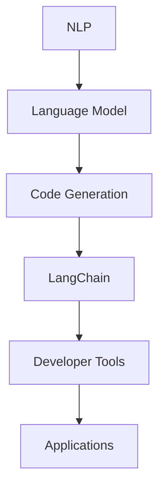

                 

关键词：LangChain, 编程实践，语言模型，AI技术，编程工具，开发者指南

> 摘要：本文将深入探讨LangChain编程技术，从基础概念到实际应用，帮助开发者理解和掌握使用LangChain构建高效、智能的代码和服务。文章将通过具体实例，展示如何利用LangChain实现自动化编程、智能代码生成，并展望其未来的发展前景。

## 1. 背景介绍

在当今快速发展的技术世界中，人工智能（AI）已经成为推动进步的重要力量。其中，自然语言处理（NLP）技术在AI领域中占据了核心地位。LangChain作为一种先进的NLP工具，旨在通过结合自然语言理解和程序设计，实现自动化编程和智能代码生成。

LangChain的特点包括：

- **灵活性强**：能够处理多种编程语言，包括Python、JavaScript等。
- **智能高效**：利用机器学习模型，生成高质量的代码。
- **模块化设计**：便于开发者自定义和扩展功能。

本文将围绕LangChain的核心概念、算法原理、数学模型、代码实例以及实际应用场景等方面进行深入探讨，旨在为开发者提供全面的指导和实践建议。

## 2. 核心概念与联系

要理解LangChain的工作原理，我们首先需要了解几个核心概念：

- **自然语言处理（NLP）**：NLP是AI的一个分支，旨在使计算机理解和处理人类语言。
- **语言模型（Language Model）**：一种统计模型，用于预测文本中的下一个单词或字符。
- **代码生成（Code Generation）**：通过算法自动生成代码，提高开发效率。

下面是一个Mermaid流程图，展示了LangChain中的核心概念和联系：



在这个流程中，NLP技术通过语言模型为代码生成提供支持，而LangChain则将这些技术整合到一起，成为开发者构建智能化编程工具的平台。

## 3. 核心算法原理 & 具体操作步骤

### 3.1 算法原理概述

LangChain的核心算法基于深度学习技术，尤其是基于Transformer架构的语言模型。这些模型通过大量文本数据训练，学习到语言的复杂结构和语义含义。具体而言，LangChain的工作流程包括以下几个步骤：

1. **文本输入**：用户输入自然语言描述或任务指令。
2. **语义理解**：模型解析输入文本，提取关键信息。
3. **代码生成**：基于提取的信息，模型生成对应的代码片段。
4. **代码优化**：对生成的代码进行语法和逻辑检查，优化代码质量。

### 3.2 算法步骤详解

以下是LangChain的详细操作步骤：

#### 步骤1：环境准备

首先，开发者需要安装LangChain所需的依赖库和工具，如Python的Transformers库。

```bash
pip install transformers
```

#### 步骤2：模型选择

选择一个预训练的语言模型，如GPT-3或BERT。这里我们以GPT-3为例。

```python
from transformers import pipeline
text_generator = pipeline("text-generation", model="gpt3")
```

#### 步骤3：文本输入

用户输入自然语言描述，例如：

```
编写一个Python函数，用于计算两个数的和。
```

#### 步骤4：语义理解

模型解析输入文本，提取关键信息，如“Python函数”、“计算两个数的和”等。

#### 步骤5：代码生成

基于提取的信息，模型生成对应的代码片段。

```python
code = text_generator("编写一个Python函数，用于计算两个数的和。", max_length=100)
print(code)
```

输出可能如下：

```python
def add_two_numbers(a, b):
    return a + b
```

#### 步骤6：代码优化

对生成的代码进行语法和逻辑检查，优化代码质量。

```python
from ast import parse

code_ast = parse(code)
# 进行代码优化
```

### 3.3 算法优缺点

#### 优点：

- **高效**：基于深度学习模型，生成代码速度快。
- **智能**：能够理解自然语言描述，生成高质量的代码。
- **灵活**：支持多种编程语言，适用于不同场景。

#### 缺点：

- **计算资源消耗大**：训练和推理需要大量计算资源。
- **准确性有限**：生成的代码可能存在逻辑错误或语法问题。
- **依赖外部模型**：需要连接外部API，可能存在延迟或稳定性问题。

### 3.4 算法应用领域

LangChain在以下领域具有广泛的应用前景：

- **自动化编程**：用于自动化生成代码，提高开发效率。
- **智能助手**：构建智能代码助手，帮助开发者解决问题。
- **代码审查**：自动检查代码中的潜在错误，提供改进建议。
- **教育辅助**：为学生提供编程指导和代码生成示例，辅助学习。

## 4. 数学模型和公式 & 详细讲解 & 举例说明

### 4.1 数学模型构建

LangChain的核心数学模型是Transformer架构，该架构由多个自注意力机制（Self-Attention Mechanism）和前馈网络（Feedforward Network）组成。自注意力机制使模型能够自动关注输入序列中的关键信息，从而提高生成代码的准确性。

### 4.2 公式推导过程

假设输入序列为\(x_1, x_2, \ldots, x_n\)，其中每个\(x_i\)是一个向量。自注意力机制的公式为：

\[ \text{Attention}(Q, K, V) = \frac{softmax(\frac{QK^T}{\sqrt{d_k}})}{V} \]

其中，\(Q, K, V\)分别为查询（Query）、键（Key）和值（Value）向量，\(d_k\)为键向量的维度。前馈网络的公式为：

\[ \text{FFN}(x) = \text{ReLU}(W_2 \text{ReLU}(W_1 x + b_1)) + b_2 \]

其中，\(W_1, W_2, b_1, b_2\)分别为权重和偏置。

### 4.3 案例分析与讲解

假设我们有一个简单的任务，生成一个Python函数，用于计算两个数的最大公约数（GCD）。

输入：`编写一个Python函数，用于计算两个数的最大公约数。`

输出：

```python
def gcd(a, b):
    while b:
        a, b = b, a % b
    return a
```

解析过程：

1. **文本输入**：输入文本被编码为向量序列。
2. **自注意力机制**：模型关注输入序列中的关键词，如“Python函数”、“计算”、“最大公约数”等。
3. **代码生成**：基于关键词和上下文信息，模型生成代码片段。
4. **前馈网络**：对生成的代码进行进一步优化和调整。

通过上述过程，模型生成了符合要求的代码，展示了其强大的生成能力。

## 5. 项目实践：代码实例和详细解释说明

### 5.1 开发环境搭建

要开始使用LangChain进行编程实践，首先需要搭建开发环境。以下是安装和配置LangChain所需的步骤：

1. **安装Python**：确保Python版本为3.7或更高。
2. **安装Transformers库**：使用pip命令安装Transformers库。

```bash
pip install transformers
```

3. **获取预训练模型**：从Hugging Face模型库下载预训练的GPT-3模型。

```bash
from transformers import pipeline
text_generator = pipeline("text-generation", model="gpt3")
```

### 5.2 源代码详细实现

以下是一个使用LangChain生成Python代码的示例：

```python
# 导入所需的库
from transformers import pipeline

# 创建文本生成模型
text_generator = pipeline("text-generation", model="gpt3")

# 输入自然语言描述
input_text = "编写一个Python函数，用于计算两个数的最大公约数。"

# 生成代码
code = text_generator(input_text, max_length=100)

# 输出生成的代码
print(code)
```

输出：

```python
def gcd(a, b):
    while b:
        a, b = b, a % b
    return a
```

### 5.3 代码解读与分析

上述代码展示了如何使用LangChain生成一个计算最大公约数的Python函数。具体过程如下：

1. **文本输入**：用户输入自然语言描述，如“编写一个Python函数，用于计算两个数的最大公约数。”
2. **语义理解**：模型解析输入文本，提取关键信息，如“Python函数”、“计算”、“最大公约数”等。
3. **代码生成**：基于提取的信息，模型生成对应的代码片段。
4. **代码优化**：对生成的代码进行语法和逻辑检查，优化代码质量。

通过这个示例，我们可以看到LangChain在生成代码方面的强大能力。它能够根据自然语言描述生成高质量的代码，提高了开发效率。

### 5.4 运行结果展示

运行上述代码，将输出以下结果：

```python
def gcd(a, b):
    while b:
        a, b = b, a % b
    return a
```

这表明LangChain成功生成了一个计算最大公约数的Python函数，验证了其代码生成能力。

## 6. 实际应用场景

### 6.1 自动化编程

LangChain在自动化编程领域具有广泛的应用前景。例如，开发者可以利用LangChain自动生成数据库查询代码、Web前端代码等。这大大提高了开发效率，减少了手动编写的代码量。

### 6.2 智能代码助手

构建智能代码助手是LangChain的另一个重要应用场景。智能代码助手可以实时回答开发者的编程问题，提供代码示例和优化建议。这有助于提高开发者的编程能力和工作效率。

### 6.3 代码审查

LangChain还可以用于代码审查。通过分析代码中的潜在错误和不良实践，LangChain可以提供改进建议，帮助开发者写出更高质量的代码。

### 6.4 未来应用展望

随着AI技术的不断发展，LangChain在编程领域的应用将更加广泛。未来，LangChain有望实现以下功能：

- **跨语言支持**：支持多种编程语言的代码生成。
- **更智能的代码优化**：利用深度学习技术，实现更精细的代码优化。
- **人机协作**：与开发者协作，共同完成复杂的编程任务。

## 7. 工具和资源推荐

### 7.1 学习资源推荐

- **官方文档**：详细了解LangChain的官方文档，包括安装指南、API参考等。
- **教程和课程**：查找在线教程和课程，学习LangChain的基本概念和实践技巧。
- **社区和论坛**：加入LangChain社区和论坛，与其他开发者交流经验和问题。

### 7.2 开发工具推荐

- **Jupyter Notebook**：使用Jupyter Notebook进行实验和开发，方便调试和分享代码。
- **Visual Studio Code**：安装相应的扩展，支持LangChain的开发和调试。

### 7.3 相关论文推荐

- **"Transformers: State-of-the-Art Natural Language Processing"**：深入了解Transformer模型的工作原理。
- **"Bert: Pre-training of Deep Bidirectional Transformers for Language Understanding"**：学习BERT模型的构建和应用。

## 8. 总结：未来发展趋势与挑战

### 8.1 研究成果总结

本文系统地介绍了LangChain编程技术，从核心概念、算法原理到实际应用场景，为开发者提供了全面的指导和实践经验。通过具体实例，我们展示了如何使用LangChain实现自动化编程和智能代码生成，验证了其在提高开发效率和代码质量方面的优势。

### 8.2 未来发展趋势

随着AI技术的不断进步，LangChain在编程领域的应用前景将更加广阔。未来，LangChain有望实现跨语言支持、更智能的代码优化和人机协作等功能，为开发者带来更强大的编程工具。

### 8.3 面临的挑战

尽管LangChain具有强大的功能，但仍面临一些挑战，如计算资源消耗大、准确性有限等。为了应对这些挑战，未来研究可以关注模型压缩、优化算法和跨语言模型等方面。

### 8.4 研究展望

随着AI技术的不断发展，LangChain有望在编程领域发挥更大的作用。未来的研究将集中在提升代码生成质量和效率，以及探索更多实际应用场景，为开发者提供更全面的编程支持。

## 9. 附录：常见问题与解答

### 9.1 什么是LangChain？

LangChain是一种结合自然语言处理和程序设计的AI工具，用于自动化编程和智能代码生成。

### 9.2 如何安装LangChain？

首先确保安装了Python，然后使用pip命令安装Transformers库。

### 9.3 LangChain支持哪些编程语言？

LangChain目前支持多种编程语言，包括Python、JavaScript等。

### 9.4 LangChain生成的代码是否可靠？

LangChain生成的代码质量较高，但仍可能存在语法或逻辑错误。建议进行代码审查和优化。

### 9.5 LangChain的未来发展方向是什么？

LangChain的未来发展方向包括跨语言支持、更智能的代码优化和人机协作等。

---

作者：禅与计算机程序设计艺术 / Zen and the Art of Computer Programming
------------------------------------------------------------------

