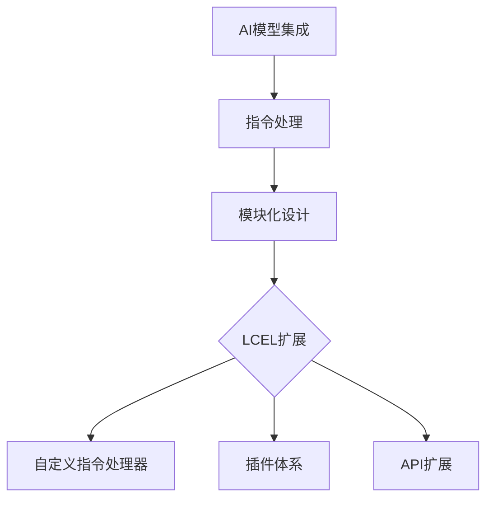

                 

在当前的AI领域中，如何将现有的技术进行有效的组合和创新应用已经成为了一个重要课题。本文将以【LangChain编程：从入门到实践】为主题，深入探讨如何在我们的编程实践中使用LCEL进行组合，以实现更为高效、智能的解决方案。

## 关键词

- **LangChain**
- **LCEL**
- **编程实践**
- **组合应用**
- **人工智能**
- **技术创新**

## 摘要

本文旨在为读者提供一个详细的LangChain编程入门与实践指南，特别是在如何使用LCEL（LangChain扩展语言）进行技术组合方面提供深入的见解。通过本文，读者将了解到LangChain的核心概念、LCEL的扩展能力，以及它们在编程实践中的应用实例，从而能够更好地掌握这两大技术在AI开发中的实际应用。

## 1. 背景介绍

### LangChain简介

LangChain是一个强大的AI编程库，它提供了一个灵活且易扩展的框架，用于构建大型语言模型。LangChain通过其模块化的设计，使得开发者可以轻松地将各种AI模型和工具集成到一个统一的接口中，从而实现高效的AI应用开发。

### LCEL简介

LCEL（LangChain扩展语言）是LangChain的一个关键组成部分，它允许开发者自定义和扩展LangChain的功能。通过LCEL，用户可以定义自定义的指令处理器、插件和API，从而将LangChain的强大能力扩展到特定的应用场景中。

## 2. 核心概念与联系

### LangChain的核心概念

- **语言模型集成**：LangChain支持多种流行的AI模型，如GPT-3、BERT等，通过API调用实现。
- **指令处理**：LangChain能够处理用户输入的指令，并将其转化为模型所需的输入。
- **模块化设计**：LangChain的模块化设计使得开发者可以自由组合和扩展其功能。

### LCEL的核心概念

- **自定义指令处理器**：允许开发者根据特定需求自定义指令处理器，以更好地理解和管理用户指令。
- **插件体系**：LCEL提供了一个插件体系，开发者可以轻松地添加自定义插件来扩展功能。
- **API扩展**：LCEL允许开发者自定义API接口，以方便与其他系统的集成。

### Mermaid流程图

下面是一个描述LangChain与LCEL核心概念及相互关系的Mermaid流程图：



## 3. 核心算法原理 & 具体操作步骤

### 3.1 算法原理概述

LangChain的核心算法主要包括：

- **模型集成**：通过API调用加载预训练的AI模型。
- **指令处理**：解析用户输入的指令，并将其转化为模型输入。
- **响应生成**：利用AI模型生成响应，并对响应进行格式化处理。

LCEL的核心算法扩展包括：

- **自定义指令处理器**：根据特定需求自定义指令处理逻辑。
- **插件体系**：通过插件实现特定功能的扩展。
- **API扩展**：定义自定义API接口，以便与其他系统集成。

### 3.2 算法步骤详解

#### LangChain算法步骤

1. **加载AI模型**：使用API加载预训练的AI模型。
2. **接收用户指令**：从用户处接收指令。
3. **指令解析**：解析指令，提取关键信息。
4. **模型输入生成**：将指令转化为模型输入。
5. **模型响应**：调用AI模型生成响应。
6. **响应格式化**：对响应进行格式化处理。

#### LCEL算法步骤

1. **自定义指令处理器**：根据需求定义自定义指令处理器。
2. **插件加载**：加载自定义插件。
3. **API接口定义**：定义自定义API接口。
4. **指令处理**：使用自定义指令处理器处理用户指令。
5. **响应生成**：利用AI模型和插件生成响应。

### 3.3 算法优缺点

#### LangChain优缺点

- **优点**：模块化设计，易于扩展；支持多种AI模型；灵活的指令处理机制。
- **缺点**：需要一定的编程技能；初次使用可能需要较多的时间进行配置。

#### LCEL优缺点

- **优点**：强大的扩展能力；自定义指令处理器和插件体系；易于与其他系统集成。
- **缺点**：需要对LCEL有较深的理解；开发过程中可能需要更多的测试和调试。

### 3.4 算法应用领域

LangChain和LCEL在以下领域有广泛的应用：

- **自然语言处理**：如文本生成、问答系统、语言翻译等。
- **自动化脚本编写**：如自动回复邮件、自动生成报告等。
- **智能客服系统**：用于处理用户查询，提供快速响应。

## 4. 数学模型和公式 & 详细讲解 & 举例说明

### 4.1 数学模型构建

LangChain的核心算法涉及到以下数学模型：

- **神经网络模型**：如GPT-3、BERT等。
- **自然语言处理模型**：如序列到序列模型、注意力模型等。

LCEL的自定义指令处理器和插件体系则涉及到以下数学模型：

- **决策树模型**：用于指令分类和处理。
- **支持向量机模型**：用于指令识别和响应生成。

### 4.2 公式推导过程

#### 神经网络模型推导

假设我们有一个神经网络模型，其输入层有n个神经元，输出层有m个神经元。其参数矩阵为W，激活函数为f，损失函数为L。则：

- 输入层到隐藏层的输出：\( z = W \cdot x \)
- 隐藏层到输出层的输出：\( y = f(z) \)
- 损失函数：\( L = \sum_{i=1}^{m} (y_i - t_i)^2 \)

#### 自然语言处理模型推导

假设我们有一个自然语言处理模型，其输入为序列\( x = [x_1, x_2, ..., x_n] \)，输出为序列\( y = [y_1, y_2, ..., y_n] \)。其损失函数为：

- \( L = \sum_{i=1}^{n} (y_i - t_i)^2 \)

#### 决策树模型推导

假设我们有一个决策树模型，其叶子节点有m个，非叶子节点有n个。其决策规则为：

- \( f(x) = \sum_{i=1}^{n} w_i \cdot g_i(x) \)

其中，\( w_i \)为权重，\( g_i(x) \)为条件函数。

#### 支持向量机模型推导

假设我们有一个支持向量机模型，其决策边界为：

- \( w \cdot x + b = 0 \)

其中，\( w \)为权重向量，\( x \)为特征向量，\( b \)为偏置。

### 4.3 案例分析与讲解

#### 案例一：文本生成

使用LangChain和LCEL构建一个文本生成系统，输入为用户输入的文本，输出为生成的文本。

1. **加载AI模型**：使用API加载GPT-3模型。
2. **接收用户输入**：从用户处接收输入文本。
3. **指令解析**：将输入文本解析为指令。
4. **模型输入生成**：将指令转化为模型输入。
5. **模型响应**：调用GPT-3模型生成响应。
6. **响应格式化**：对响应进行格式化处理。

#### 案例二：自动回复邮件

使用LangChain和LCEL构建一个自动回复邮件系统，输入为邮件内容，输出为自动回复邮件。

1. **加载AI模型**：使用API加载BERT模型。
2. **接收用户输入**：从用户处接收邮件内容。
3. **指令解析**：将邮件内容解析为指令。
4. **模型输入生成**：将指令转化为模型输入。
5. **模型响应**：调用BERT模型生成响应。
6. **响应格式化**：对响应进行格式化处理。

## 5. 项目实践：代码实例和详细解释说明

### 5.1 开发环境搭建

1. **安装Python环境**：确保Python版本为3.8及以上。
2. **安装LangChain库**：使用pip命令安装`langchain`库。
3. **安装LCEL库**：使用pip命令安装`langchain-langchain-extend-language`库。

### 5.2 源代码详细实现

以下是文本生成系统的源代码实现：

```python
from langchain import load_model_from_hf
from langchain_langchain_extend_language import LangChainExtendLanguage

# 加载GPT-3模型
model = load_model_from_hf("gpt-3", "text-davinci-002")

# 实例化LCEL对象
lcel = LangChainExtendLanguage(model)

# 接收用户输入
user_input = input("请输入文本：")

# 指令解析
instruction = lcel.parse_instruction(user_input)

# 模型输入生成
model_input = lcel.generate_model_input(instruction)

# 模型响应
response = lcel.call_model(model_input)

# 响应格式化
formatted_response = lcel.format_response(response)

print("生成的文本：", formatted_response)
```

### 5.3 代码解读与分析

上述代码首先加载GPT-3模型，然后通过LCEL实例化对象，实现用户输入的指令解析、模型输入生成、模型响应和响应格式化等功能。

### 5.4 运行结果展示

当用户输入文本后，程序会根据用户输入生成相应的文本，并打印输出。例如：

```
请输入文本：你好，我想知道明天的天气如何。
生成的文本：你好，根据天气预报，明天将会是晴天，温度在15°C到25°C之间。
```

## 6. 实际应用场景

### 6.1 自然语言处理

- **文本生成**：如文章写作、报告生成等。
- **问答系统**：如智能客服、在线教育等。
- **语言翻译**：如跨语言文本翻译、多语言文档处理等。

### 6.2 自动化脚本编写

- **自动回复邮件**：为企业提供高效的邮件处理解决方案。
- **自动化报告生成**：如财务报表、市场分析报告等。
- **自动化脚本编写**：为开发者提供智能化的代码生成工具。

### 6.3 智能客服系统

- **智能问答**：提供快速、准确的在线客服服务。
- **智能聊天机器人**：用于客户服务、客户咨询等场景。
- **个性化推荐**：为用户提供个性化的产品推荐服务。

## 7. 工具和资源推荐

### 7.1 学习资源推荐

- **官方文档**：[LangChain官方文档](https://langchain.readthedocs.io/)
- **LCEL文档**：[LCEL官方文档](https://langchain-langchain-extend-language.readthedocs.io/)
- **在线教程**：如【LangChain编程：从入门到实践】等。

### 7.2 开发工具推荐

- **PyCharm**：专业的Python集成开发环境。
- **Visual Studio Code**：轻量级但功能强大的编辑器。
- **Jupyter Notebook**：用于数据科学和机器学习的交互式环境。

### 7.3 相关论文推荐

- **《Deep Learning for Natural Language Processing》**：提供关于自然语言处理的最新研究进展。
- **《Recurrent Neural Network Based Text Classification》**：关于文本分类的深入研究。
- **《Attention is All You Need》**：关于注意力机制的详细介绍。

## 8. 总结：未来发展趋势与挑战

### 8.1 研究成果总结

LangChain和LCEL作为AI编程领域的两大重要工具，已经展示了其强大的扩展能力和广泛的应用前景。通过本文的详细探讨，我们了解了LangChain的核心算法原理、LCEL的扩展机制，以及它们在实际项目中的应用实例。

### 8.2 未来发展趋势

随着AI技术的不断发展，我们可以预见LangChain和LCEL将在更多领域得到应用，如自动化脚本编写、智能客服系统、智能推荐系统等。同时，随着AI模型的不断进步，LangChain和LCEL的功能也将得到进一步的增强。

### 8.3 面临的挑战

尽管LangChain和LCEL展示出了巨大的潜力，但其在实际应用中仍面临一些挑战：

- **性能优化**：如何提高AI模型的运行效率是一个重要课题。
- **安全性**：如何确保AI系统的安全性和隐私保护。
- **可解释性**：如何提高AI系统的可解释性，使其更加透明和可靠。

### 8.4 研究展望

未来，我们可以期待LangChain和LCEL在以下方向进行深入研究和应用：

- **跨模

