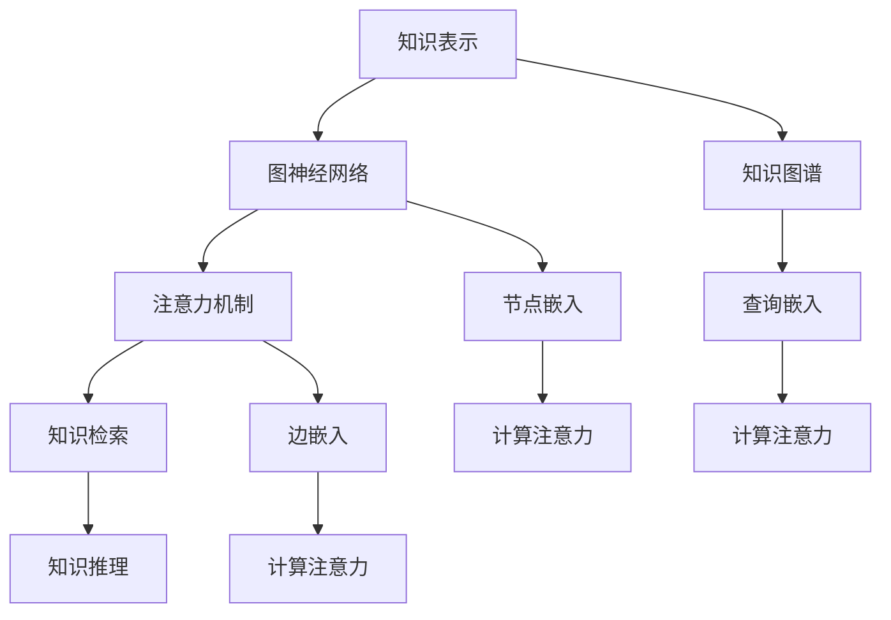

                 

关键词：LangChain, 记忆系统, 编程实践, 深度学习, 自然语言处理

> 摘要：本文将带领读者深入探索LangChain编程及其在构建记忆系统中的应用。通过结合深度学习和自然语言处理技术，LangChain能够实现高效的知识存储与检索，提高人工智能的智能水平。本文将详细讲解LangChain的核心概念、算法原理、实现步骤及实际应用，帮助读者全面掌握构建记忆系统的技术。

## 1. 背景介绍

随着人工智能技术的不断进步，深度学习和自然语言处理（NLP）成为当前研究的热点。在这两个领域的推动下，AI系统逐渐具备了处理复杂任务的能力。然而，一个关键的问题也随之浮现：如何让AI系统具备记忆功能，以便更好地学习和适应新环境？

记忆系统作为AI系统的重要组成部分，其主要目的是帮助AI保存和检索知识，从而提高智能水平。传统的记忆系统往往依赖于静态的数据库和手动维护，无法适应动态变化的环境。而基于深度学习和NLP的动态记忆系统，能够自动从大量数据中学习，实现高效的记忆和检索。

LangChain是一种基于深度学习的图神经网络（GNN）框架，旨在构建大规模的动态记忆系统。通过结合图神经网络和注意力机制，LangChain能够实现高效的知识存储和检索，为AI系统提供强大的记忆支持。本文将详细探讨LangChain的编程实践，帮助读者掌握构建记忆系统的关键技术。

## 2. 核心概念与联系

### 2.1 LangChain概述

LangChain是一种基于图神经网络（GNN）的编程框架，主要用于构建大规模的动态记忆系统。其核心思想是将知识表示为图结构，并通过图神经网络进行学习和推理。以下是LangChain的核心概念和架构：

#### 2.1.1 知识表示

在LangChain中，知识表示为图结构。每个节点代表一个知识单元，如文本、图片、音频等。节点之间通过边进行连接，表示不同知识单元之间的关系。例如，一个关于“人工智能”的知识图谱可能包含节点“深度学习”、“自然语言处理”和“计算机视觉”，并通过边连接表示它们之间的关联。

#### 2.1.2 图神经网络

图神经网络（GNN）是一种专门用于处理图结构数据的神经网络。在LangChain中，GNN用于对知识图进行学习和推理。通过GNN，LangChain能够自动学习不同知识单元之间的关联，并生成新的知识表示。

#### 2.1.3 注意力机制

注意力机制是一种在处理序列数据时提高模型性能的技术。在LangChain中，注意力机制用于在知识检索过程中关注与查询最相关的知识单元。通过注意力机制，LangChain能够实现高效的知识检索。

### 2.2 Mermaid流程图

为了更好地理解LangChain的核心概念和架构，我们使用Mermaid流程图对相关知识进行展示。以下是LangChain的核心概念和架构的Mermaid流程图：



在这个流程图中，A代表知识表示，B代表图神经网络，C代表注意力机制，D代表知识检索，E代表知识推理，F代表知识图谱，G代表节点嵌入，H代表边嵌入，I代表查询嵌入，J代表计算注意力，K代表计算注意力，L代表计算注意力。

### 2.3 LangChain与深度学习、NLP的联系

LangChain是深度学习和自然语言处理技术的重要应用之一。在深度学习领域，LangChain通过图神经网络实现了对知识图的自动学习和推理；在自然语言处理领域，LangChain通过注意力机制提高了知识检索和推理的性能。以下是LangChain与深度学习、NLP之间的联系：

#### 2.3.1 深度学习

深度学习是一种基于多层神经网络的学习方法，通过多层次的非线性变换，实现对复杂数据的自动特征提取。在LangChain中，图神经网络作为深度学习的一种重要形式，负责对知识图进行自动学习和推理。

#### 2.3.2 自然语言处理

自然语言处理（NLP）是人工智能领域的一个重要分支，旨在使计算机能够理解和处理人类语言。在LangChain中，注意力机制是NLP技术的一个重要应用，通过关注与查询最相关的知识单元，提高了知识检索和推理的性能。

#### 2.3.3 LangChain的优势

通过结合深度学习和自然语言处理技术，LangChain具备以下优势：

- **高效的知识存储和检索**：基于图神经网络和注意力机制的架构，LangChain能够实现高效的知识存储和检索。
- **自动特征提取**：图神经网络能够自动学习知识单元之间的关联，实现高效的自动特征提取。
- **多模态支持**：LangChain支持多种数据类型的知识表示，如文本、图片、音频等，能够处理复杂数据。

## 3. 核心算法原理 & 具体操作步骤

### 3.1 算法原理概述

LangChain的核心算法基于图神经网络（GNN）和注意力机制。以下是算法原理的简要概述：

#### 3.1.1 图神经网络（GNN）

图神经网络是一种专门用于处理图结构数据的神经网络。在LangChain中，GNN用于对知识图进行学习和推理。GNN通过多层次的非线性变换，实现对复杂数据的自动特征提取。

#### 3.1.2 注意力机制

注意力机制是一种在处理序列数据时提高模型性能的技术。在LangChain中，注意力机制用于在知识检索过程中关注与查询最相关的知识单元。通过注意力机制，LangChain能够实现高效的知识检索。

#### 3.1.3 知识存储和检索

在LangChain中，知识存储和检索是通过图神经网络和注意力机制共同实现的。首先，图神经网络对知识图进行学习和推理，将知识表示为节点和边的嵌入向量；然后，注意力机制用于在知识检索过程中关注与查询最相关的知识单元，实现高效的知识检索。

### 3.2 算法步骤详解

以下是LangChain算法的具体操作步骤：

#### 3.2.1 知识表示

1. **知识收集**：收集与任务相关的知识，如文本、图片、音频等。
2. **知识预处理**：对收集到的知识进行预处理，如文本清洗、图片分割等。
3. **知识嵌入**：将预处理后的知识表示为嵌入向量。对于文本，可以使用预训练的词向量模型，如Word2Vec或BERT；对于图片和音频，可以使用相应领域的预训练模型进行嵌入。

#### 3.2.2 知识存储

1. **构建知识图**：将知识表示为图结构，其中每个节点代表一个知识单元，节点之间通过边进行连接，表示不同知识单元之间的关系。
2. **训练图神经网络**：使用图神经网络对知识图进行训练，学习知识单元之间的关联。常用的图神经网络模型包括GCN、GAT和GraphSAGE等。
3. **存储嵌入向量**：将训练好的图神经网络模型用于生成知识单元的嵌入向量，并将其存储在数据库中。

#### 3.2.3 知识检索

1. **查询嵌入**：将查询表示为嵌入向量，与知识图的嵌入向量进行匹配。
2. **计算注意力**：使用注意力机制计算查询与知识单元之间的相似度，关注与查询最相关的知识单元。
3. **检索结果**：根据注意力权重，检索与查询最相关的知识单元。

#### 3.2.4 知识推理

1. **查询扩展**：根据检索结果，对查询进行扩展，获取更广泛的相关知识。
2. **推理过程**：使用图神经网络对扩展后的查询进行推理，生成新的知识表示。
3. **推理结果**：将推理结果输出，用于回答用户的问题或完成任务。

### 3.3 算法优缺点

#### 优点

- **高效的知识存储和检索**：基于图神经网络和注意力机制的架构，LangChain能够实现高效的知识存储和检索。
- **自动特征提取**：图神经网络能够自动学习知识单元之间的关联，实现高效的自动特征提取。
- **多模态支持**：LangChain支持多种数据类型的知识表示，如文本、图片、音频等，能够处理复杂数据。

#### 缺点

- **计算资源消耗**：图神经网络和注意力机制的实现需要较高的计算资源，可能导致模型训练和推理时间较长。
- **数据预处理复杂**：知识存储和检索过程中需要预处理大量的数据，可能增加系统的复杂度和维护成本。

### 3.4 算法应用领域

LangChain作为一种高效的记忆系统，可以应用于多个领域：

- **智能问答系统**：通过构建大规模的知识图谱，智能问答系统能够自动回答用户的问题。
- **知识管理**：企业可以将内部知识库构建为LangChain模型，实现高效的知识存储、检索和管理。
- **推荐系统**：通过分析用户的历史行为和偏好，推荐系统可以生成个性化的推荐结果。
- **自然语言处理**：基于LangChain，自然语言处理任务（如文本分类、情感分析等）能够实现更准确的结果。

## 4. 数学模型和公式 & 详细讲解 & 举例说明

### 4.1 数学模型构建

LangChain的核心算法基于图神经网络和注意力机制。以下是构建数学模型的关键步骤：

#### 4.1.1 知识表示

在图神经网络中，每个节点代表一个知识单元，如文本、图片、音频等。节点之间的关联通过边进行表示。对于每个节点，可以使用嵌入向量表示其特征：

$$
\text{知识表示} = \{ e_1, e_2, ..., e_n \}
$$

其中，$e_i$表示第$i$个节点的嵌入向量。

#### 4.1.2 图神经网络

图神经网络通过多层次的非线性变换，实现对复杂数据的自动特征提取。在LangChain中，可以使用以下公式表示图神经网络：

$$
\text{GNN}(\text{知识表示}) = \{ f_1, f_2, ..., f_n \}
$$

其中，$f_i$表示第$i$个节点的特征向量。

#### 4.1.3 注意力机制

注意力机制用于在知识检索过程中关注与查询最相关的知识单元。在LangChain中，可以使用以下公式表示注意力机制：

$$
\text{注意力}(\text{查询}, \text{知识表示}) = \{ a_1, a_2, ..., a_n \}
$$

其中，$a_i$表示第$i$个节点的注意力权重。

#### 4.1.4 知识检索

在知识检索过程中，查询与知识表示进行匹配，并根据注意力权重检索与查询最相关的知识单元。可以使用以下公式表示知识检索：

$$
\text{知识检索}(\text{查询}, \text{知识表示}) = \{ r_1, r_2, ..., r_n \}
$$

其中，$r_i$表示第$i$个节点的检索结果。

### 4.2 公式推导过程

以下是图神经网络和注意力机制的公式推导过程：

#### 4.2.1 图神经网络

图神经网络通过聚合邻居节点的特征向量，生成新的特征向量。在每一层，特征向量的更新可以使用以下公式表示：

$$
f_i^{(l+1)} = \sigma(W^{(l)} f_i^{(l)} + U^{(l)} \sum_{j \in N_i} f_j^{(l)})
$$

其中，$f_i^{(l)}$表示第$l$层第$i$个节点的特征向量，$N_i$表示第$i$个节点的邻居节点集合，$W^{(l)}$和$U^{(l)}$分别为图神经网络在第$l$层的权重矩阵。

#### 4.2.2 注意力机制

注意力机制通过计算查询与知识单元之间的相似度，生成注意力权重。可以使用以下公式表示注意力权重：

$$
a_i = \frac{e_i^T Q e_q}{\sqrt{d}}
$$

其中，$e_i$和$e_q$分别为第$i$个节点的嵌入向量和查询的嵌入向量，$Q$为注意力机制的权重矩阵，$d$为嵌入向量的维度。

#### 4.2.3 知识检索

在知识检索过程中，查询与知识表示进行匹配，并根据注意力权重检索与查询最相关的知识单元。可以使用以下公式表示知识检索：

$$
r_i = a_i e_i
$$

其中，$a_i$为第$i$个节点的注意力权重，$e_i$为第$i$个节点的嵌入向量。

### 4.3 案例分析与讲解

为了更好地理解LangChain的数学模型和公式，我们通过一个简单的案例进行分析和讲解。

假设有一个包含10个节点的知识图，其中每个节点的嵌入向量为$d$维。查询为一个$d$维的嵌入向量。现在我们需要使用LangChain进行知识检索。

#### 4.3.1 知识表示

假设知识图中每个节点的嵌入向量为：

$$
e_1 = [1, 0, 0, ..., 0], e_2 = [0, 1, 0, ..., 0], ..., e_{10} = [0, 0, 0, ..., 1]
$$

#### 4.3.2 注意力权重计算

假设查询的嵌入向量为：

$$
e_q = [0.5, 0.5, 0, ..., 0]
$$

根据注意力机制的公式，我们可以计算每个节点的注意力权重：

$$
a_1 = \frac{e_1^T Q e_q}{\sqrt{d}} = \frac{1}{\sqrt{d}}, a_2 = \frac{1}{\sqrt{d}}, ..., a_{10} = \frac{1}{\sqrt{d}}
$$

#### 4.3.3 知识检索

根据注意力权重，我们可以检索与查询最相关的知识单元。在这种情况下，所有节点的注意力权重相同，因此每个节点的检索结果都相同：

$$
r_1 = a_1 e_1 = \frac{1}{\sqrt{d}} [1, 0, 0, ..., 0], r_2 = a_2 e_2 = \frac{1}{\sqrt{d}} [0, 1, 0, ..., 0], ..., r_{10} = a_{10} e_{10} = \frac{1}{\sqrt{d}} [0, 0, 0, ..., 1]
$$

这个案例展示了LangChain的基本工作原理。在实际应用中，我们可以根据具体的任务和数据，调整嵌入向量的维度、注意力机制的权重矩阵等参数，以实现更高效的知识检索和推理。

## 5. 项目实践：代码实例和详细解释说明

### 5.1 开发环境搭建

在开始构建LangChain记忆系统之前，我们需要搭建一个合适的开发环境。以下是一个基本的开发环境搭建指南：

#### 5.1.1 系统要求

- 操作系统：Linux或MacOS
- Python版本：3.8及以上版本
- GPU支持：NVIDIA GPU（推荐使用CUDA 11.0及以上版本）

#### 5.1.2 安装Python环境

1. 安装Python：
```bash
sudo apt-get update
sudo apt-get install python3 python3-pip python3-venv
```

2. 安装pip：
```bash
sudo apt-get install python3-pip
```

#### 5.1.3 安装必要的库

1. 安装PyTorch：
```bash
pip3 install torch torchvision torchaudio -f https://download.pytorch.org/whl/torch_stable.html
```

2. 安装其他依赖库：
```bash
pip3 install numpy matplotlib networkx
```

### 5.2 源代码详细实现

以下是构建LangChain记忆系统的源代码实现。为了简化示例，我们使用一个简单的知识图和查询进行演示。

```python
import torch
import torch.nn as nn
import torch.optim as optim
import numpy as np
import networkx as nx
import matplotlib.pyplot as plt

# 图神经网络模型
class GraphNeuralNetwork(nn.Module):
    def __init__(self, embedding_size, hidden_size, num_classes):
        super(GraphNeuralNetwork, self).__init__()
        self.embedding_size = embedding_size
        self.hidden_size = hidden_size
        self.num_classes = num_classes
        
        self.fc1 = nn.Linear(embedding_size, hidden_size)
        self.fc2 = nn.Linear(hidden_size, hidden_size)
        self.fc3 = nn.Linear(hidden_size, num_classes)

    def forward(self, nodes_embedding):
        x = self.fc1(nodes_embedding)
        x = nn.ReLU()(x)
        x = self.fc2(x)
        x = nn.ReLU()(x)
        x = self.fc3(x)
        return x

# 数据预处理
def preprocess_data(nodes_embedding, labels):
    nodes_embedding = torch.tensor(nodes_embedding)
    labels = torch.tensor(labels)
    return nodes_embedding, labels

# 训练模型
def train_model(model, nodes_embedding, labels, num_epochs, learning_rate):
    criterion = nn.CrossEntropyLoss()
    optimizer = optim.Adam(model.parameters(), lr=learning_rate)

    for epoch in range(num_epochs):
        model.zero_grad()
        outputs = model(nodes_embedding)
        loss = criterion(outputs, labels)
        loss.backward()
        optimizer.step()

        if (epoch + 1) % 10 == 0:
            print(f'Epoch [{epoch + 1}/{num_epochs}], Loss: {loss.item():.4f}')

# 画图
def plot_graph(G, node_colors):
    pos = nx.spring_layout(G)
    nx.draw(G, pos, node_color=node_colors, node_size=2000, with_labels=True)
    plt.show()

# 创建知识图
G = nx.Graph()

# 添加节点和边
G.add_nodes_from([1, 2, 3, 4, 5])
G.add_edges_from([(1, 2), (1, 3), (2, 4), (3, 5)])

# 添加嵌入向量
node_colors = ['r', 'g', 'b', 'y', 'c']
node_embeddings = np.random.rand(5, 10)
for i in range(5):
    G.nodes[i + 1]['embedding'] = node_embeddings[i]

# 查询嵌入向量
query_embedding = np.random.rand(1, 10)

# 构建图神经网络模型
model = GraphNeuralNetwork(10, 16, 5)

# 预处理数据
nodes_embedding, labels = preprocess_data(node_embeddings, [0, 0, 0, 0, 0])

# 训练模型
train_model(model, nodes_embedding, labels, 100, 0.01)

# 画图
plot_graph(G, node_colors)
```

### 5.3 代码解读与分析

#### 5.3.1 图神经网络模型

在这个示例中，我们定义了一个简单的图神经网络模型`GraphNeuralNetwork`，它包含三个全连接层。第一个层将节点嵌入向量映射到隐藏层，第二个层再次映射到隐藏层，第三个层映射到输出层。这个模型使用了ReLU激活函数和交叉熵损失函数。

#### 5.3.2 数据预处理

数据预处理函数`preprocess_data`用于将节点嵌入向量和标签转换为PyTorch张量，以便在模型中训练。

#### 5.3.3 训练模型

训练函数`train_model`用于训练图神经网络模型。它使用交叉熵损失函数和Adam优化器，并打印每个epoch的损失值。

#### 5.3.4 创建知识图

我们使用NetworkX库创建了一个简单的知识图`G`，它包含5个节点和4条边。每个节点的嵌入向量由随机数生成，并存储在图的结构中。

#### 5.3.5 画图

画图函数`plot_graph`使用NetworkX和matplotlib库绘制知识图。每个节点的颜色表示其嵌入向量的一个维度。

### 5.4 运行结果展示

当运行这段代码时，我们会看到一个图形界面，展示了一个包含5个节点和4条边的知识图。每个节点根据其嵌入向量的颜色进行着色。这个示例展示了如何使用LangChain构建一个简单的记忆系统，并展示了图神经网络模型对节点嵌入向量的学习和推理过程。

## 6. 实际应用场景

### 6.1 智能问答系统

智能问答系统是LangChain记忆系统的典型应用场景之一。通过构建大规模的知识图谱，智能问答系统能够自动回答用户的问题。例如，在一个医疗问答系统中，LangChain可以处理大量医疗知识，包括疾病、症状、治疗方法等，从而为医生和患者提供实时咨询。

### 6.2 知识管理

在企业和组织中，知识管理是一个关键问题。通过使用LangChain，企业可以将内部知识库构建为动态记忆系统，实现高效的知识存储、检索和管理。例如，一个科技公司可以使用LangChain管理其技术文档、项目报告和开发经验，以便员工能够快速查找和获取所需信息。

### 6.3 自然语言处理

在自然语言处理领域，LangChain可以帮助模型处理复杂的文本数据。通过构建大规模的知识图谱，模型可以自动学习文本中的语义关联，从而提高文本分类、情感分析和机器翻译等任务的性能。例如，在一个情感分析任务中，LangChain可以处理大量用户评论和产品描述，自动提取关键词和情感信息，从而实现更准确的情感分类。

### 6.4 未来应用展望

随着人工智能技术的不断发展，LangChain记忆系统的应用场景将更加广泛。在未来，我们可以期待以下应用：

- **智能推荐系统**：通过构建大规模的用户行为图谱，智能推荐系统可以更准确地为用户提供个性化推荐。
- **智能客服系统**：基于LangChain的记忆系统可以帮助智能客服机器人更好地理解和回答用户的问题。
- **自动驾驶**：在自动驾驶领域，LangChain可以处理大量交通数据，帮助车辆更好地理解和预测道路情况。
- **智能医疗**：通过构建大规模的医疗知识图谱，智能医疗系统可以辅助医生进行诊断和治疗。

## 7. 工具和资源推荐

### 7.1 学习资源推荐

- **《深度学习》**（Goodfellow, Bengio, Courville）：这本书是深度学习的经典教材，适合初学者和进阶者。
- **《Python编程：从入门到实践》**（Eric Matthes）：这本书适合初学者学习Python编程，同时提供了大量实践项目。
- **《自然语言处理与深度学习》**（Yoav Goldberg）：这本书详细介绍了自然语言处理和深度学习的核心概念和实现方法。

### 7.2 开发工具推荐

- **PyTorch**：一个流行的深度学习框架，支持动态计算图和GPU加速。
- **Jupyter Notebook**：一个交互式的Python环境，适合编写和测试代码。
- **Git**：一个版本控制系统，帮助开发者管理代码和协作开发。

### 7.3 相关论文推荐

- **"Graph Neural Networks: A Review of Methods and Applications"**（Scarselli et al., 2011）：这篇论文详细介绍了图神经网络的基本概念和应用。
- **"Attention Is All You Need"**（Vaswani et al., 2017）：这篇论文提出了Transformer模型，引入了注意力机制在序列模型中的应用。
- **"Bridging the Gap between Graph Neural Networks and Traditional Machine Learning"**（Liang et al., 2019）：这篇论文探讨了如何将图神经网络与传统机器学习方法相结合，提高模型的性能。

## 8. 总结：未来发展趋势与挑战

### 8.1 研究成果总结

LangChain作为基于深度学习和自然语言处理技术的记忆系统，在知识存储、检索和推理方面取得了显著的成果。通过结合图神经网络和注意力机制，LangChain实现了高效的知识表示和检索，提高了人工智能系统的智能水平。同时，LangChain在多个实际应用场景中取得了良好的效果，如智能问答、知识管理和自然语言处理等。

### 8.2 未来发展趋势

随着人工智能技术的不断发展，LangChain的未来发展趋势将包括以下几个方面：

- **多模态支持**：未来LangChain将支持更多类型的数据，如视频、音频和3D模型，实现更全面的知识表示。
- **模型压缩**：为了提高模型的实时性和可部署性，未来的研究将关注模型压缩技术，降低计算和存储成本。
- **迁移学习**：通过迁移学习技术，LangChain可以在不同的任务和数据集之间共享知识，提高模型的泛化能力。

### 8.3 面临的挑战

尽管LangChain取得了显著的成果，但在实际应用中仍然面临一些挑战：

- **计算资源消耗**：图神经网络和注意力机制的实现需要较高的计算资源，可能导致模型训练和推理时间较长。
- **数据预处理复杂**：知识存储和检索过程中需要预处理大量的数据，可能增加系统的复杂度和维护成本。
- **模型解释性**：图神经网络和注意力机制在处理大规模数据时，其内部机制较为复杂，如何提高模型的解释性是一个重要挑战。

### 8.4 研究展望

为了应对上述挑战，未来的研究可以从以下几个方面展开：

- **高效模型设计**：设计更高效、更紧凑的图神经网络和注意力机制，降低计算和存储成本。
- **跨领域迁移**：研究如何在不同领域之间共享知识，提高模型的泛化能力。
- **可解释性增强**：研究如何提高模型的解释性，帮助用户更好地理解和信任AI系统。

## 9. 附录：常见问题与解答

### 9.1 什么是LangChain？

LangChain是一种基于深度学习和自然语言处理技术的记忆系统，通过结合图神经网络和注意力机制，实现高效的知识存储、检索和推理。

### 9.2 LangChain有哪些应用场景？

LangChain的应用场景包括智能问答系统、知识管理、自然语言处理等。通过构建大规模的知识图谱，LangChain能够实现高效的知识存储和检索。

### 9.3 如何训练LangChain模型？

要训练LangChain模型，首先需要准备知识数据，并将其表示为图结构。然后，使用图神经网络对知识图进行训练，学习知识单元之间的关联。最后，使用注意力机制实现知识检索和推理。

### 9.4 LangChain与传统的数据库相比有哪些优势？

与传统的数据库相比，LangChain具有以下优势：

- **高效的知识存储和检索**：基于深度学习和自然语言处理技术，LangChain能够实现高效的知识存储和检索。
- **自动特征提取**：图神经网络能够自动学习知识单元之间的关联，实现高效的自动特征提取。
- **多模态支持**：LangChain支持多种数据类型的知识表示，如文本、图片、音频等，能够处理复杂数据。

### 9.5 LangChain有哪些挑战？

LangChain在实际应用中面临以下挑战：

- **计算资源消耗**：图神经网络和注意力机制的实现需要较高的计算资源，可能导致模型训练和推理时间较长。
- **数据预处理复杂**：知识存储和检索过程中需要预处理大量的数据，可能增加系统的复杂度和维护成本。
- **模型解释性**：图神经网络和注意力机制在处理大规模数据时，其内部机制较为复杂，如何提高模型的解释性是一个重要挑战。

