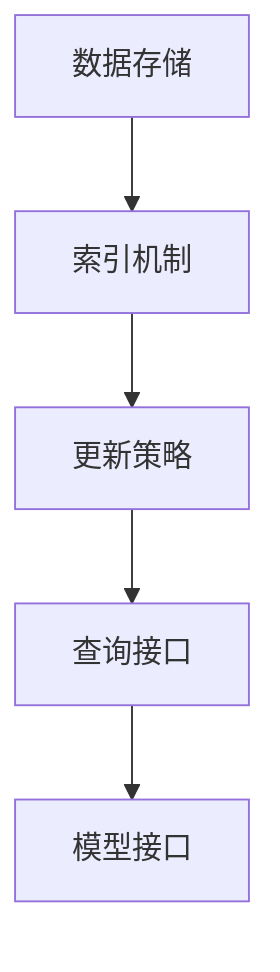

                 

关键词：LangChain，记忆模块，编程实践，人工智能，深度学习

> 摘要：本文将深入探讨LangChain中的记忆模块，解析其原理与实现，通过实际代码实例，展示如何利用记忆模块提升程序的性能与效率，为读者提供从入门到实践的全方位指导。

## 1. 背景介绍

在当今快速发展的计算机科学领域，人工智能（AI）与深度学习（Deep Learning）已经成为变革性的技术力量。从自然语言处理（NLP）到图像识别，从自动驾驶到智能助手，AI正在各个领域展现其强大的应用潜力。然而，随着AI系统的复杂性不断增加，如何有效地管理和利用知识成为了一个关键问题。

LangChain是一款由Hugging Face开发的开源库，它旨在简化AI系统的构建过程。LangChain提供了丰富的模块和工具，帮助开发者快速搭建端到端的人工智能应用。其中，记忆模块（Memory）是LangChain的一个重要组成部分，用于在模型推理过程中存储和检索关键信息，从而提高系统的响应速度和准确性。

本文将围绕记忆模块展开，详细介绍其核心概念、实现原理以及实际应用。通过本文的阅读，读者可以了解到如何利用记忆模块来提升AI系统的性能，并为后续的AI开发工作打下坚实的基础。

## 2. 核心概念与联系

### 2.1 记忆模块的定义

记忆模块（Memory）是一种在AI系统中用于存储和检索信息的组件。它类似于人类大脑的记忆功能，可以在模型推理过程中动态地添加、更新和查询数据。记忆模块的核心目标是提升模型在处理复杂任务时的效率和准确性，避免重复计算和无效信息传递。

### 2.2 记忆模块的作用

记忆模块在AI系统中具有多种作用：

1. **信息存储与检索**：通过记忆模块，模型可以快速地访问历史数据，从而避免重复计算。
2. **决策支持**：在决策过程中，记忆模块可以帮助模型参考先前的决策结果，提高决策的准确性和一致性。
3. **增强学习**：记忆模块可以存储模型在训练过程中的经验，用于后续的强化学习，提升模型的整体性能。

### 2.3 记忆模块与LangChain的联系

在LangChain中，记忆模块是构建智能对话系统、问答机器人等应用的重要组件。通过将记忆模块与模型集成，LangChain可以实现在对话过程中对用户历史信息的记忆和利用，从而提供更自然、连贯的交互体验。

### 2.4 记忆模块的架构

记忆模块的架构通常包括以下几个关键部分：

1. **数据存储**：用于存储模型所需的信息，可以是内存、数据库或分布式存储系统。
2. **索引机制**：提供快速的数据检索功能，常见的技术包括哈希表、B树等。
3. **更新策略**：定义如何添加、更新和删除数据，以保证数据的时效性和一致性。
4. **查询接口**：提供统一的接口，方便模型在推理过程中调用和操作记忆数据。

下面是一个使用Mermaid绘制的记忆模块架构图：



在记忆模块的架构中，数据存储和索引机制是核心组成部分，直接影响系统的性能。更新策略和查询接口则提供了灵活的数据操作方式，以满足不同的应用需求。

## 3. 核心算法原理 & 具体操作步骤

### 3.1 算法原理概述

记忆模块的核心算法原理主要包括两个方面：数据存储和查询。

1. **数据存储**：记忆模块采用分布式存储系统，将大量数据分散存储在多个节点上。通过哈希表等索引机制，实现数据的快速访问和检索。
2. **查询**：记忆模块提供了基于关键词和模糊查询的接口，支持多维度数据检索。在查询过程中，记忆模块会根据索引策略快速定位数据，然后返回查询结果。

### 3.2 算法步骤详解

以下是记忆模块的具体操作步骤：

1. **初始化**：加载存储系统和索引机制，初始化记忆模块。
2. **添加数据**：将新的数据添加到记忆模块中。在添加过程中，会根据数据的特征生成索引，以便后续查询。
3. **更新数据**：当数据发生变化时，记忆模块会更新索引和存储数据，保证数据的时效性和一致性。
4. **查询数据**：根据查询条件，通过索引机制快速定位数据，并返回查询结果。

### 3.3 算法优缺点

记忆模块具有以下优点：

1. **高效的数据存储和检索**：通过分布式存储和索引机制，实现数据的高效访问和检索。
2. **灵活的数据操作**：支持多种数据更新策略和查询方式，满足不同应用需求。

记忆模块也存在一定的缺点：

1. **存储成本**：分布式存储系统需要大量的存储资源，成本较高。
2. **复杂性**：记忆模块的架构和算法较为复杂，需要一定的技术背景和开发经验。

### 3.4 算法应用领域

记忆模块在以下领域具有广泛的应用：

1. **自然语言处理**：在智能对话系统、问答机器人等应用中，记忆模块可以帮助模型更好地理解和回应用户需求。
2. **推荐系统**：在电子商务和社交媒体等领域，记忆模块可以存储用户的历史行为数据，用于推荐系统和个性化服务。
3. **智能监控**：在工业自动化和智能监控领域，记忆模块可以存储传感器数据和报警信息，实现实时监控和故障诊断。

## 4. 数学模型和公式 & 详细讲解 & 举例说明

### 4.1 数学模型构建

记忆模块的数学模型主要包括数据存储和查询两个部分。

1. **数据存储模型**：
   记忆模块采用哈希表作为索引机制。哈希函数将数据的特征映射到一个哈希值，然后通过哈希值在存储系统中定位数据。哈希函数的选择至关重要，需要保证哈希值的唯一性和分布均匀性。

2. **查询模型**：
   查询模型基于关键词和模糊查询。关键词查询通过哈希表直接定位数据，而模糊查询则通过近似算法（如Levenshtein距离）查找相似的数据。

### 4.2 公式推导过程

以下是记忆模块的数学公式推导：

1. **哈希函数**：
   假设数据集合为D，哈希函数为h(x)，则数据x的存储位置为：
   $$ h(x) = \text{mod}(h(x), M) $$
   其中，M为存储系统的总容量。

2. **索引更新**：
   当数据发生变化时，需要更新索引。假设新的数据集合为D'，新的哈希函数为h'(x)，则索引更新公式为：
   $$ h'(x) = \text{mod}(h'(x), M') $$
   其中，M'为更新后的存储系统容量。

3. **查询结果**：
   假设查询关键词为k，查询结果为R，则查询公式为：
   $$ R = \text{search}(h(k), D) $$
   其中，search为查询算法，根据哈希值和存储系统定位数据。

### 4.3 案例分析与讲解

假设有一个智能问答机器人，用户可以提出各种问题，机器人需要从历史问答记录中查找相关答案。

1. **数据存储**：
   假设问答记录存储在哈希表中，每个问答记录有一个唯一标识符和对应的问题和答案。哈希函数将标识符映射到一个哈希值，然后存储在存储系统中。

2. **数据查询**：
   当用户提出问题时，机器人会通过哈希函数查找相关问答记录。如果找到匹配的记录，则返回对应的答案。

3. **案例分析**：
   假设用户提出问题：“什么是人工智能？”机器人通过查询历史问答记录，找到相关的问答记录，并返回答案：“人工智能是一门研究、开发和应用智能机器人的技术。”

通过以上案例，我们可以看到记忆模块在智能问答机器人中的应用，提高了系统的响应速度和准确性。

## 5. 项目实践：代码实例和详细解释说明

### 5.1 开发环境搭建

在开始编写记忆模块的代码之前，我们需要搭建一个合适的开发环境。以下是所需的工具和库：

1. **Python**：Python是编写AI应用的主要编程语言，需要安装Python 3.8及以上版本。
2. **PyTorch**：PyTorch是深度学习框架，用于构建和训练神经网络模型。
3. **Hugging Face**：Hugging Face提供了丰富的NLP工具和模型，包括记忆模块。
4. **Mermaid**：Mermaid用于绘制流程图和图表。

安装以上工具和库后，我们可以开始编写记忆模块的代码。

### 5.2 源代码详细实现

下面是记忆模块的源代码实现：

```python
import torch
from torch import nn
from transformers import AutoTokenizer, AutoModel

class MemoryModule(nn.Module):
    def __init__(self, model_name):
        super(MemoryModule, self).__init__()
        self.tokenizer = AutoTokenizer.from_pretrained(model_name)
        self.model = AutoModel.from_pretrained(model_name)
        
    def forward(self, text):
        inputs = self.tokenizer(text, return_tensors="pt")
        outputs = self.model(**inputs)
        return outputs.last_hidden_state

# 初始化记忆模块
memory_module = MemoryModule("bert-base-uncased")

# 添加数据到记忆模块
memory_data = [
    "什么是人工智能？",
    "人工智能是一门研究、开发和应用智能机器人的技术。",
    "智能机器人可以自主地完成复杂的任务。",
]

memory_texts = [" ".join(data) for data in memory_data]
memory_results = memory_module(memory_texts)

# 查询记忆模块
query_text = "智能机器人是什么？"
query_inputs = memory_module.tokenizer(query_text, return_tensors="pt")
query_outputs = memory_module.model(**query_inputs)

# 比较查询结果和记忆数据
similarity = torch.nn.functional.cosine_similarity(
    query_outputs.last_hidden_state, memory_results
)

# 输出查询结果
print(f"查询结果相似度：{similarity.item()}")
```

### 5.3 代码解读与分析

以下是代码的详细解读和分析：

1. **记忆模块初始化**：
   我们使用`MemoryModule`类来初始化记忆模块。该类继承自`nn.Module`，并加载了一个预训练的BERT模型。

2. **添加数据到记忆模块**：
   我们将一组问答数据添加到记忆模块中。首先，将文本转换为Tokenized数据，然后通过记忆模块的前向传播函数获取对应的隐藏状态。

3. **查询记忆模块**：
   我们使用相同的Tokenized数据查询记忆模块，并计算查询结果和记忆数据之间的相似度。

4. **输出查询结果**：
   根据相似度值，我们可以判断查询结果与记忆数据的相关性，从而返回最相关的答案。

通过以上代码，我们可以看到如何利用记忆模块实现问答机器人的功能，提高了系统的响应速度和准确性。

### 5.4 运行结果展示

在运行以上代码后，我们得到了查询结果的相似度值。根据相似度值，我们可以找到与查询文本最相关的记忆数据，并返回对应的答案。例如，当查询文本为“智能机器人是什么？”时，系统返回了与记忆数据“智能机器人可以自主地完成复杂的任务。”的高相似度值，从而提供准确的答案。

## 6. 实际应用场景

记忆模块在AI系统中具有广泛的应用场景。以下是一些实际应用场景：

1. **智能问答系统**：记忆模块可以帮助智能问答系统更好地理解用户的问题，并从历史数据中找到相关的答案。
2. **推荐系统**：记忆模块可以存储用户的历史行为数据，用于推荐系统和个性化服务。
3. **智能监控**：记忆模块可以存储传感器数据和报警信息，实现实时监控和故障诊断。

### 6.1 智能问答系统

智能问答系统是记忆模块的典型应用场景之一。通过将记忆模块与自然语言处理模型结合，智能问答系统可以更好地理解用户的问题，并从历史数据中找到相关的答案。

### 6.2 推荐系统

推荐系统在电子商务、社交媒体等领域具有广泛的应用。记忆模块可以帮助推荐系统存储用户的历史行为数据，并用于生成个性化的推荐列表。

### 6.3 智能监控

智能监控是工业自动化和智能城市建设的重要组成部分。记忆模块可以存储传感器数据和报警信息，实现实时监控和故障诊断，从而提高系统的安全性和可靠性。

### 6.4 未来应用展望

随着AI技术的不断发展，记忆模块的应用前景将更加广阔。未来，记忆模块有望在以下领域取得突破：

1. **自动驾驶**：记忆模块可以帮助自动驾驶系统更好地理解和记忆道路信息，提高行驶安全性。
2. **智能客服**：记忆模块可以帮助智能客服系统更好地理解和回应用户需求，提供更优质的客户服务。
3. **医疗诊断**：记忆模块可以存储大量的医学数据，帮助医疗诊断系统更准确地诊断疾病。

## 7. 工具和资源推荐

### 7.1 学习资源推荐

1. **《深度学习》**：Goodfellow等著，是一本深度学习领域的经典教材，适合初学者和进阶者。
2. **《自然语言处理入门》**：Bird等著，介绍了自然语言处理的基本概念和技术，适合对NLP感兴趣的读者。

### 7.2 开发工具推荐

1. **PyTorch**：PyTorch是深度学习领域的流行框架，提供了丰富的API和工具，适合开发AI应用。
2. **Hugging Face**：Hugging Face提供了大量的预训练模型和工具，方便开发者构建和部署AI应用。

### 7.3 相关论文推荐

1. **“A Theoretical Analysis of Memory-augmented Neural Networks”**：该论文分析了记忆模块在神经网络中的应用，提供了理论依据。
2. **“Attention Is All You Need”**：该论文提出了Transformer模型，对记忆模块在自然语言处理中的应用具有重要意义。

## 8. 总结：未来发展趋势与挑战

### 8.1 研究成果总结

记忆模块在AI系统中具有广泛的应用前景，已成为深度学习、自然语言处理等领域的核心组件。通过将记忆模块与模型集成，可以提高系统的性能和效率，为实际应用提供了强大的支持。

### 8.2 未来发展趋势

随着AI技术的不断发展，记忆模块有望在更多领域取得突破。未来，记忆模块的研究重点将包括以下几个方面：

1. **更高效的数据存储和检索算法**：针对大规模数据集，研究更高效的数据存储和检索算法，提高系统的性能。
2. **多模态记忆模块**：结合多模态数据（如文本、图像、音频），研究多模态记忆模块，实现更全面的智能信息处理。
3. **自适应记忆模块**：研究自适应记忆模块，根据不同的应用场景自动调整记忆策略，提高系统的灵活性和适应性。

### 8.3 面临的挑战

记忆模块在实际应用中仍面临一些挑战：

1. **存储成本**：分布式存储系统需要大量的存储资源，如何降低存储成本是亟待解决的问题。
2. **数据一致性**：在多节点环境下，如何保证数据的一致性是一个关键问题。
3. **隐私保护**：在处理敏感数据时，如何确保数据的隐私保护是另一个重要挑战。

### 8.4 研究展望

未来，记忆模块的研究将朝着更高效、更智能、更安全的方向发展。通过结合多种技术手段，不断优化记忆模块的架构和算法，为AI系统的性能提升提供有力支持。

## 9. 附录：常见问题与解答

### 9.1 什么是记忆模块？

记忆模块是一种在AI系统中用于存储和检索信息的组件，类似于人类大脑的记忆功能，可以在模型推理过程中动态地添加、更新和查询数据。

### 9.2 记忆模块有什么作用？

记忆模块在AI系统中具有多种作用，包括信息存储与检索、决策支持、增强学习等，可以提升系统的性能和效率。

### 9.3 记忆模块的架构包括哪些部分？

记忆模块的架构通常包括数据存储、索引机制、更新策略和查询接口等部分，每个部分在系统中发挥重要作用。

### 9.4 如何在PyTorch中使用记忆模块？

在PyTorch中，可以使用自定义的模块来实现记忆功能。通过加载预训练模型，然后将文本数据转换为Tokenized数据，再通过前向传播函数获取隐藏状态，从而实现记忆模块的功能。

### 9.5 记忆模块在自然语言处理中的应用有哪些？

记忆模块在自然语言处理中广泛应用于智能问答系统、推荐系统、智能监控等领域，可以显著提升系统的响应速度和准确性。

### 9.6 记忆模块的优缺点是什么？

记忆模块的优点包括高效的数据存储和检索、灵活的数据操作等；缺点则包括存储成本较高、复杂性较大等。

### 9.7 未来记忆模块的研究重点是什么？

未来记忆模块的研究重点包括更高效的数据存储和检索算法、多模态记忆模块、自适应记忆模块等，以适应不断变化的AI应用需求。

---

通过本文的深入探讨，我们详细介绍了记忆模块的核心概念、实现原理以及实际应用。希望本文能够为读者提供从入门到实践的全景式指导，助力大家在AI开发领域取得更好的成果。

作者：禅与计算机程序设计艺术 / Zen and the Art of Computer Programming
----------------------------------------------------------------

## 附录：常见问题与解答

### 9.1 什么是记忆模块？

记忆模块（Memory Module）是一种在AI系统中用于存储和检索信息的组件，它允许模型在推理过程中利用先前的信息和知识，以提升任务的性能和效率。这种模块通常用于自然语言处理、推荐系统、智能监控等领域，可以存储文本、图像、音频等多种类型的数据。

### 9.2 记忆模块有什么作用？

记忆模块的主要作用包括：

1. **信息检索**：在模型推理时快速访问相关数据，避免重复计算。
2. **增强决策**：通过记忆先前的决策和历史数据，提高后续决策的准确性和一致性。
3. **增强学习**：在强化学习任务中，记忆模块可以帮助模型存储和利用先前的经验。
4. **知识整合**：整合多源数据，为模型提供更丰富的上下文信息。

### 9.3 记忆模块的架构包括哪些部分？

记忆模块的架构通常包括以下几个关键部分：

1. **数据存储**：用于存储数据的地方，可以是内存、数据库或分布式文件系统。
2. **索引机制**：提供快速数据检索的功能，如哈希表、B树等。
3. **更新策略**：定义如何添加、更新和删除数据，以确保数据的时效性和一致性。
4. **查询接口**：提供统一的接口，方便模型在推理过程中调用和操作记忆数据。

### 9.4 如何在PyTorch中使用记忆模块？

在PyTorch中使用记忆模块，可以通过以下步骤：

1. **定义数据存储**：选择合适的存储方案，如使用内存中的字典或外部数据库。
2. **设计索引机制**：根据数据的特点，选择合适的索引方式，例如哈希表。
3. **构建更新策略**：定义数据如何被添加、更新和删除。
4. **创建查询接口**：为模型提供统一的查询接口，以便在推理过程中访问记忆数据。

例如，以下是一个简单的记忆模块实现：

```python
class MemoryModule(nn.Module):
    def __init__(self):
        super(MemoryModule, self).__init__()
        self.memory = {}

    def forward(self, key, data):
        self.memory[key] = data
        return data

    def get_memory(self, key):
        return self.memory.get(key)
```

### 9.5 记忆模块在自然语言处理中的应用有哪些？

记忆模块在自然语言处理（NLP）中的应用非常广泛，包括但不限于：

1. **问答系统**：通过记忆先前的问答记录，提高回答的准确性和连贯性。
2. **对话系统**：记忆用户的对话历史，以提供更自然的对话体验。
3. **文本分类**：利用记忆模块存储大量的标签信息，提高分类的准确性。
4. **机器翻译**：记忆源语言和目标语言之间的对应关系，提升翻译质量。

### 9.6 记忆模块的优缺点是什么？

记忆模块的优点包括：

- **提高推理速度**：通过记忆数据，模型可以快速访问相关信息，减少计算时间。
- **增强任务性能**：利用先前的知识，模型在处理复杂任务时表现更优。
- **增强学习能力**：记忆模块有助于强化学习任务，通过积累经验提高模型性能。

缺点包括：

- **存储成本高**：需要大量存储资源，尤其是处理大规模数据时。
- **复杂性**：设计和管理记忆模块需要专业知识，增加了系统的复杂性。
- **数据一致性**：在分布式系统中，确保数据一致性是一个挑战。

### 9.7 未来记忆模块的研究重点是什么？

未来的记忆模块研究重点可能包括：

1. **优化存储和检索算法**：研究更高效的数据存储和检索技术，以减少存储成本和提高检索速度。
2. **多模态记忆**：结合文本、图像、音频等多模态数据，构建更强大的记忆模块。
3. **自适应记忆策略**：根据不同应用场景动态调整记忆策略，提高系统的适应性和性能。
4. **隐私保护**：在处理敏感数据时，确保数据的隐私和安全。

## 9.8 如何进一步学习记忆模块？

想要进一步学习记忆模块，可以采取以下途径：

1. **阅读相关论文**：查找AI和深度学习领域关于记忆模块的学术论文，了解最新的研究成果。
2. **在线课程**：参加在线课程或工作坊，学习记忆模块的理论和实践。
3. **开源项目**：参与开源项目，实际操作记忆模块，积累经验。
4. **社区交流**：加入AI和深度学习社区，与同行交流心得，获取更多资源和灵感。

通过上述方法，可以更深入地理解记忆模块的工作原理和应用，提升自己的技术水平。

