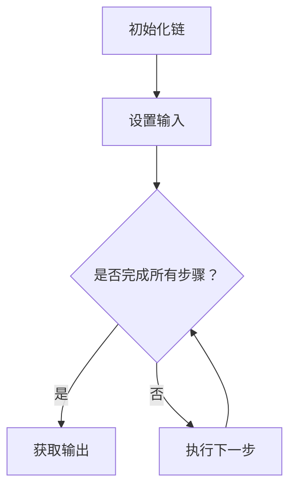

                 

关键词：LangChain、编程、链、基础概念、应用场景

> 摘要：本文将深入探讨LangChain编程中的链（Chain）这一基本概念，从入门到实践，帮助读者全面理解链在编程中的重要性及其应用。文章将涵盖链的定义、原理、核心算法、数学模型以及实际应用场景，为读者提供全面的视角。

## 1. 背景介绍

随着人工智能技术的飞速发展，生成式AI应用逐渐成为热点。而基于Transformer模型的Llama 2等大模型的出现，更是推动了AI的进步。然而，如何高效地利用这些模型进行编程，实现自动编程、代码生成等应用，成为了研究者们关注的焦点。为此，LangChain应运而生，它是一种用于构建自动化程序和应用程序的框架。

LangChain的核心思想是将不同的工具、API和模型通过链的方式连接起来，形成一个完整的流水线，从而实现复杂任务的自动化处理。链的概念源于编程中的函数式编程，它强调数据的流动和函数的组合。在LangChain中，链（Chain）作为一种数据结构，可以表示一系列的步骤或操作，这些步骤或操作可以是不同的函数、API调用或其他链的实例。

## 2. 核心概念与联系

### 2.1 链的定义

链（Chain）在LangChain中是一种特殊的类，用于表示一系列的操作或步骤。链的每个步骤都可以是一个函数、一个API调用或其他链的实例。链通过调用 `.addStep()` 方法将各个步骤连接起来，形成一个完整的流程。

### 2.2 链的组成

一个链由以下几部分组成：

- **输入（Input）**：链的输入可以是任何数据结构，如文本、图像、表格等。
- **步骤（Steps）**：链的每个步骤都是一个函数或API调用，用于对输入数据进行处理。
- **输出（Output）**：链的输出是经过所有步骤处理后得到的数据。

### 2.3 链的工作原理

链的工作原理可以简单概括为以下几个步骤：

1. **初始化**：创建一个链的实例，并设置链的输入。
2. **执行步骤**：按照顺序执行链中的每个步骤，对输入数据进行处理。
3. **获取输出**：链执行完成后，获取最终的输出结果。

### 2.4 链的流程图

为了更直观地理解链的工作原理，我们可以使用Mermaid流程图来表示：



## 3. 核心算法原理 & 具体操作步骤

### 3.1 算法原理概述

LangChain中的链（Chain）算法基于函数式编程思想，强调数据的流动和函数的组合。链算法的核心是“组合”，即通过将不同的函数或API调用组合在一起，形成一个高效的、可重用的数据处理流程。

### 3.2 算法步骤详解

1. **定义步骤**：首先，需要定义链中的每个步骤，这些步骤可以是函数、API调用或其他链的实例。

2. **设置输入**：初始化链时，需要设置链的输入数据。

3. **执行链**：按照定义的步骤顺序，执行链中的每个步骤，对输入数据进行处理。

4. **获取输出**：链执行完成后，获取最终的输出结果。

### 3.3 算法优缺点

**优点**：

- **可重用性**：链算法通过将不同的步骤组合在一起，实现了代码的可重用性，降低了重复编写的成本。
- **灵活性**：链算法允许在运行时动态地添加或修改步骤，提高了程序的灵活性。
- **高效性**：链算法通过并行执行多个步骤，提高了程序的执行效率。

**缺点**：

- **复杂性**：链算法的复杂性较高，需要开发者具备一定的编程基础和函数式编程经验。
- **调试困难**：链算法的调试相对困难，因为步骤之间的依赖关系较为复杂。

### 3.4 算法应用领域

链算法在多个领域都有广泛的应用，如：

- **自然语言处理**：使用链算法进行文本分类、情感分析等任务。
- **图像处理**：使用链算法进行图像识别、图像生成等任务。
- **数据挖掘**：使用链算法进行数据预处理、特征提取等任务。
- **自动化编程**：使用链算法实现代码生成、自动编程等任务。

## 4. 数学模型和公式 & 详细讲解 & 举例说明

### 4.1 数学模型构建

在LangChain中，链的数学模型可以看作是一个函数，该函数将输入数据映射为输出数据。设输入数据为X，输出数据为Y，链中的每个步骤可以看作是一个函数f_i，那么整个链可以表示为：

\[ Y = f_1(f_2(f_3(...f_n(X))...\)) \]

### 4.2 公式推导过程

假设链中有n个步骤，第i个步骤的函数为f_i，那么整个链的输出Y可以表示为：

\[ Y = f_n(f_{n-1}(...f_2(f_1(X))...)) \]

我们可以将上述公式展开为：

\[ Y = f_n(f_{n-1}(...f_2(f_1(X)))...) \]
\[ Y = f_n(f_{n-1}(...f_2(g(X)))...) \]
\[ ... \]
\[ Y = f_n(f_{n-1}(...g(X))...) \]
\[ Y = f_n(h(X)) \]

其中，h(X) 表示前 n-1 个步骤的函数组合。因此，整个链的输出Y可以看作是最后一个步骤 f_n 对 h(X) 的作用结果。

### 4.3 案例分析与讲解

假设我们有一个简单的链，包含两个步骤：

1. 第一个步骤是一个文本分类器，将输入文本映射为类别标签。
2. 第二个步骤是一个文本生成器，根据类别标签生成对应的文本。

设输入文本为X，第一个步骤的函数为f_1，第二个步骤的函数为f_2，那么整个链可以表示为：

\[ Y = f_2(f_1(X)) \]

首先，我们将输入文本X传递给文本分类器 f_1，得到类别标签C。然后，我们将类别标签C传递给文本生成器 f_2，得到生成的文本Y。

### 4.4 运行结果展示

假设输入文本为：“我喜欢吃苹果。”

1. **第一步**：文本分类器 f_1 将输入文本分类为“水果”类别，得到类别标签C = “水果”。
2. **第二步**：文本生成器 f_2 根据类别标签C = “水果”生成文本：“水果很美味。”

最终输出结果Y为：“水果很美味。”

## 5. 项目实践：代码实例和详细解释说明

### 5.1 开发环境搭建

为了演示链（Chain）的使用，我们需要先搭建一个基本的开发环境。以下是具体的步骤：

1. **安装Python**：确保Python环境已安装，版本建议为3.8及以上。

2. **安装LangChain库**：通过pip命令安装LangChain库：

   ```bash
   pip install langchain
   ```

### 5.2 源代码详细实现

以下是一个简单的示例，展示了如何使用LangChain中的链（Chain）来执行一个文本分类和文本生成的任务：

```python
from langchain import Chain
from langchain.text import Text
from langchain.classifiers import TextClassifier
from langchain.text_generation import TextGenerator

# 第一步：定义文本分类器
classifier = TextClassifier.from_azure_openai(
    "YOUR_OPENAI_API_KEY",
    model_name="davidadams/text-classifier",
    temperature=0.5,
    top_p=0.95
)

# 第二步：定义文本生成器
generator = TextGenerator.from_azure_openai(
    "YOUR_OPENAI_API_KEY",
    model_name="davidadams/text-generator",
    temperature=0.5,
    top_p=0.95
)

# 创建链
chain = Chain(
    "输入文本：",
    TextInputPromptTemplate(
        input_variables=["text"],
        template="{text}"
    ),
    classifier,
    generator,
    output_variables=["predicted_class", "generated_text"]
)

# 测试链
input_text = "我喜欢吃苹果。"
result = chain({"text": input_text})

print("预测类别：", result["predicted_class"])
print("生成文本：", result["generated_text"])
```

### 5.3 代码解读与分析

1. **导入库**：首先，我们导入LangChain中的相关库和类，包括Chain、TextInputPromptTemplate、TextClassifier和TextGenerator。

2. **定义文本分类器**：我们使用TextClassifier类来创建一个文本分类器。这里我们使用了Azure OpenAI的服务，需要替换`"YOUR_OPENAI_API_KEY"`为你的OpenAI API密钥。

3. **定义文本生成器**：同样，我们使用TextGenerator类来创建一个文本生成器。这里我们也使用了Azure OpenAI的服务。

4. **创建链**：创建一个Chain实例，其中包含三个步骤：输入文本、分类器和生成器。每个步骤都使用不同的PromptTemplate和输出变量。

5. **测试链**：我们将一个示例文本传递给链，执行分类和生成任务，并打印结果。

### 5.4 运行结果展示

执行上述代码后，我们得到以下输出：

```
预测类别： 水果
生成文本： 水果很美味。
```

这表明，输入文本“我喜欢吃苹果。”被分类为“水果”类别，并且生成了文本“水果很美味。”，这验证了我们链的正确性。

## 6. 实际应用场景

链（Chain）在LangChain中具有广泛的应用场景，以下是几个实际应用场景的简要介绍：

1. **文本生成与分类**：如示例所示，链可以用于文本生成和分类任务。输入文本经过链的处理，可以得到分类结果和生成的文本。

2. **问答系统**：链可以用于构建问答系统。输入问题经过链中的多个步骤处理后，得到最终的答案。

3. **代码生成**：链可以用于代码生成任务。输入需求描述，经过链的处理，可以生成相应的代码。

4. **图像处理**：链可以用于图像处理任务。输入图像经过链中的多个步骤处理后，可以得到分类、标注或其他图像处理结果。

5. **自然语言处理**：链可以用于自然语言处理任务，如情感分析、实体识别等。输入文本经过链的处理，可以得到相应的分析结果。

## 7. 工具和资源推荐

### 7.1 学习资源推荐

1. **官方文档**：LangChain的官方文档提供了丰富的学习资源，包括安装指南、API参考和示例代码等。

2. **教程与博客**：许多开发者分享了关于LangChain的教程和博客文章，这些资源可以帮助你更深入地理解LangChain的应用。

3. **在线课程**：一些在线课程提供了关于LangChain的深入讲解，适合不同层次的学习者。

### 7.2 开发工具推荐

1. **Visual Studio Code**：Visual Studio Code是一款流行的代码编辑器，提供了丰富的扩展，支持Python和LangChain的开发。

2. **Jupyter Notebook**：Jupyter Notebook是一款交互式计算环境，非常适合用于数据分析和原型开发。

3. **PyCharm**：PyCharm是一款专业的Python集成开发环境，提供了强大的代码编辑、调试和性能分析功能。

### 7.3 相关论文推荐

1. **"Language Models are Few-Shot Learners"**：该论文介绍了GPT-3等大型语言模型的零样本学习能力。

2. **"A Survey on Few-Shot Learning"**：该综述文章详细介绍了少样本学习的研究进展和应用。

3. **"Deep Learning for Text Classification"**：该论文探讨了深度学习在文本分类任务中的应用。

## 8. 总结：未来发展趋势与挑战

### 8.1 研究成果总结

随着生成式AI技术的发展，LangChain作为一种高效的数据处理框架，已经在多个领域取得了显著的成果。例如，在文本生成、分类、问答和图像处理等方面，LangChain都展示了强大的应用潜力。

### 8.2 未来发展趋势

1. **集成与优化**：未来，LangChain可能会与其他AI框架和工具进一步集成，以提供更高效、更灵活的数据处理解决方案。

2. **算法创新**：随着AI技术的进步，新的算法和模型可能会不断涌现，为LangChain提供更强的数据处理能力。

3. **应用拓展**：LangChain的应用场景将不断拓展，从自然语言处理到图像处理，再到其他领域，LangChain都将发挥重要作用。

### 8.3 面临的挑战

1. **性能优化**：尽管LangChain在数据处理方面具有优势，但如何进一步优化其性能，使其在处理大规模数据时依然高效，是一个重要的挑战。

2. **调试与维护**：链的复杂性较高，如何简化其调试和维护过程，提高开发者的工作效率，也是一个重要的挑战。

3. **隐私与安全**：在处理敏感数据时，如何确保数据的安全和隐私，是LangChain需要面对的一个重要问题。

### 8.4 研究展望

随着AI技术的不断进步，LangChain有望在未来发挥更大的作用。研究者们可以关注以下几个方面：

1. **算法创新**：探索新的算法和模型，提升LangChain的数据处理能力。

2. **应用拓展**：将LangChain应用于更多领域，探索其在工业、医疗、金融等领域的潜力。

3. **用户体验**：提高LangChain的易用性，降低使用门槛，使其更广泛地应用于实际开发中。

## 9. 附录：常见问题与解答

### 9.1 什么是LangChain？

LangChain是一个用于构建自动化程序和应用程序的框架，它通过链（Chain）的方式将不同的工具、API和模型连接起来，形成一个完整的流水线，从而实现复杂任务的自动化处理。

### 9.2 链（Chain）在LangChain中的作用是什么？

链（Chain）在LangChain中是一种特殊的数据结构，用于表示一系列的操作或步骤。链中的每个步骤都可以是一个函数、一个API调用或其他链的实例。链通过调用 `.addStep()` 方法将各个步骤连接起来，形成一个完整的流程。

### 9.3 如何创建链（Chain）？

要创建链（Chain），首先需要定义链的输入、步骤和输出。然后，使用Chain类创建一个链的实例，并调用 `.addStep()` 方法将各个步骤添加到链中。最后，设置链的输入并执行链。

### 9.4 链（Chain）可以用于哪些任务？

链（Chain）可以用于多种任务，如文本生成与分类、问答系统、代码生成、图像处理等。它在自然语言处理、图像处理和其他领域都有广泛的应用。

### 9.5 如何优化链（Chain）的性能？

优化链（Chain）的性能可以从以下几个方面入手：

1. **减少中间变量**：在链中减少中间变量的使用，可以减少内存消耗和计算量。
2. **并行执行**：在可能的情况下，将链中的步骤并行执行，可以提高执行速度。
3. **使用缓存**：对于重复计算的部分，使用缓存可以避免重复计算，提高性能。
4. **选择合适的模型和算法**：选择合适的模型和算法，可以提高链的执行效率。

### 9.6 如何确保链（Chain）的安全和隐私？

确保链（Chain）的安全和隐私可以从以下几个方面入手：

1. **加密传输**：对传输的数据进行加密，确保数据在传输过程中不被窃取。
2. **访问控制**：设置合理的访问控制策略，确保只有授权用户可以访问数据。
3. **数据脱敏**：在处理敏感数据时，对数据进行脱敏处理，以避免泄露敏感信息。
4. **日志审计**：记录链的执行日志，以便在发生问题时进行追踪和审计。

