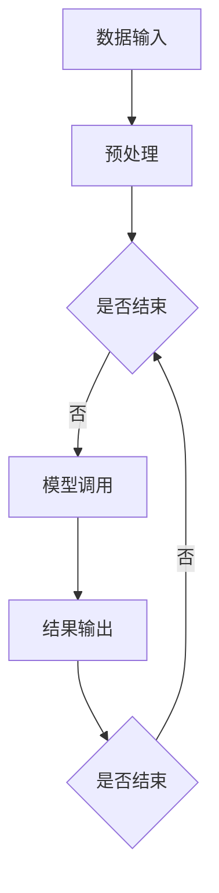

                 

关键词：LangChain、编程、入门、实践、需求分析、设计思路

摘要：本文将深入探讨LangChain编程框架的需求分析与设计思路，帮助开发者从入门到实践，逐步掌握LangChain的使用技巧和应用场景。通过本文的学习，读者将了解LangChain的核心概念、架构设计、算法原理及实际应用，为深入探索人工智能编程领域奠定基础。

## 1. 背景介绍

随着人工智能技术的迅速发展，深度学习、自然语言处理等领域取得了显著的成果。然而，在开发实际应用时，开发者常常面临着如何将复杂的技术实现与实际需求相结合的难题。为了解决这个问题，许多优秀的框架和库应运而生，其中之一便是LangChain。

LangChain是一个基于Python的编程框架，旨在简化人工智能编程的开发过程。它提供了一系列工具和库，使得开发者可以更轻松地将人工智能技术应用到实际项目中。本文将围绕LangChain的需求分析与设计思路进行探讨，帮助开发者更好地理解和应用这一框架。

### 1.1 LangChain的起源与发展

LangChain最早由Google的工程师提出，并在GitHub上开源。其目的是为了解决深度学习和自然语言处理项目中常见的问题，如数据处理、模型训练和模型部署等。随着社区的不断贡献和改进，LangChain逐渐成为了一个功能丰富、易于使用的编程框架。

### 1.2 LangChain的应用领域

LangChain在多个领域都展现了其强大的能力，包括但不限于：

- 自然语言处理：文本分类、情感分析、机器翻译、问答系统等。
- 计算机视觉：图像分类、目标检测、图像生成等。
- 语音识别：语音识别、语音合成等。

## 2. 核心概念与联系

### 2.1 LangChain的核心概念

为了更好地理解LangChain，我们需要先了解其核心概念，包括：

- Model：表示模型，如深度学习模型、自然语言处理模型等。
- Chain：表示链条，用于将多个模型串联起来，形成一个完整的处理流程。
- Context：表示上下文，用于传递数据和处理结果，是LangChain实现灵活性的关键。
- Agent：表示智能体，用于执行任务和决策。

### 2.2 LangChain的架构设计

LangChain的架构设计旨在提供一种简单、灵活且可扩展的方式，以实现复杂的人工智能应用。其核心架构包括以下几个部分：

1. **数据预处理**：对输入数据进行预处理，如分词、编码等。
2. **模型调用**：调用具体的模型进行预测或处理。
3. **结果输出**：将处理结果输出给用户或下一个处理环节。
4. **链条管理**：管理多个模型的调用顺序和依赖关系。

### 2.3 LangChain的工作流程

LangChain的工作流程可以概括为以下几个步骤：

1. **初始化**：加载所需的模型和数据。
2. **输入处理**：对输入数据进行预处理。
3. **模型调用**：根据链条的设置，依次调用模型进行预测或处理。
4. **结果输出**：将处理结果输出给用户或下一个处理环节。
5. **反馈调整**：根据用户反馈或实际效果，调整模型参数或链条设置。

### 2.4 Mermaid流程图

下面是LangChain架构的Mermaid流程图：



## 3. 核心算法原理 & 具体操作步骤

### 3.1 算法原理概述

LangChain的核心算法原理主要包括：

- 模型调用：根据链条的设置，调用具体的模型进行预测或处理。
- 上下文管理：通过上下文对象传递数据和处理结果，实现模型之间的交互。
- 模型融合：将多个模型的结果进行融合，提高预测或处理的准确性。

### 3.2 算法步骤详解

以下是LangChain算法的具体步骤：

1. **初始化**：加载所需的模型和数据，设置链条的参数。
2. **输入处理**：对输入数据进行预处理，如分词、编码等。
3. **模型调用**：根据链条的设置，依次调用模型进行预测或处理。
4. **结果输出**：将处理结果输出给用户或下一个处理环节。
5. **反馈调整**：根据用户反馈或实际效果，调整模型参数或链条设置。

### 3.3 算法优缺点

**优点**：

- 简化开发流程：通过链条管理，开发者可以轻松地将多个模型串联起来，实现复杂的人工智能应用。
- 灵活性强：通过上下文管理，开发者可以灵活地调整模型之间的交互方式，满足不同场景的需求。
- 扩展性强：LangChain支持自定义模型和链条，开发者可以根据需求进行扩展。

**缺点**：

- 学习成本高：对于初学者来说，理解LangChain的架构和算法原理需要一定的时间和精力。
- 资源消耗大：由于LangChain需要调用多个模型，因此对计算资源的需求较高。

### 3.4 算法应用领域

LangChain在多个领域都有广泛的应用，包括但不限于：

- 自然语言处理：如文本分类、情感分析、机器翻译等。
- 计算机视觉：如图像分类、目标检测、图像生成等。
- 语音识别：如语音识别、语音合成等。

## 4. 数学模型和公式 & 详细讲解 & 举例说明

### 4.1 数学模型构建

LangChain的数学模型主要包括：

- 深度学习模型：如卷积神经网络（CNN）、循环神经网络（RNN）、长短时记忆网络（LSTM）等。
- 自然语言处理模型：如词向量模型、递归神经网络（RNN）、长短时记忆网络（LSTM）等。

### 4.2 公式推导过程

以卷积神经网络（CNN）为例，其基本公式如下：

$$
h_{l}(x) = \sigma(W_{l} \cdot h_{l-1}(x) + b_{l})
$$

其中，$h_{l}(x)$表示第$l$层的输出，$W_{l}$表示第$l$层的权重矩阵，$b_{l}$表示第$l$层的偏置，$\sigma$表示激活函数，如ReLU函数。

### 4.3 案例分析与讲解

以文本分类为例，假设我们要对以下两段文本进行分类：

- 文本1：这是一个有趣的新闻故事。
- 文本2：这是一个悲伤的电影情节。

我们使用LangChain中的文本分类模型进行分类。首先，我们需要将文本进行预处理，如分词、编码等。然后，我们将预处理后的文本输入到文本分类模型中，得到分类结果。

假设文本分类模型为二分类模型，分为“新闻”和“电影”两类。经过训练，我们得到以下模型参数：

- 权重矩阵$W$：
$$
W = \begin{bmatrix}
w_{11} & w_{12} & \cdots & w_{1n} \\
w_{21} & w_{22} & \cdots & w_{2n} \\
\vdots & \vdots & \ddots & \vdots \\
w_{m1} & w_{m2} & \cdots & w_{mn}
\end{bmatrix}
$$
- 偏置$b$：
$$
b = \begin{bmatrix}
b_1 \\
b_2 \\
\vdots \\
b_m
\end{bmatrix}
$$

对于文本1，其编码后的特征向量为$v_1$。将$v_1$输入到文本分类模型中，得到预测概率$p_1$：

$$
p_1 = \sigma(W \cdot v_1 + b)
$$

同理，对于文本2，其编码后的特征向量为$v_2$。将$v_2$输入到文本分类模型中，得到预测概率$p_2$：

$$
p_2 = \sigma(W \cdot v_2 + b)
$$

根据预测概率$p_1$和$p_2$，我们可以判断文本1和文本2的分类结果。如果$p_1 > p_2$，则文本1属于“新闻”类，文本2属于“电影”类；否则，文本1属于“电影”类，文本2属于“新闻”类。

## 5. 项目实践：代码实例和详细解释说明

### 5.1 开发环境搭建

在开始项目实践之前，我们需要搭建开发环境。首先，确保Python版本在3.6及以上，然后按照以下步骤安装所需的库：

```bash
pip install langchain transformers
```

### 5.2 源代码详细实现

下面是一个使用LangChain进行文本分类的简单示例：

```python
from langchain import TextClassificationChain
from transformers import pipeline

# 加载预训练的文本分类模型
classifier = pipeline("text-classification")

# 定义分类链条
chain = TextClassificationChain(classifier)

# 待分类的文本
texts = [
    "这是一个有趣的新闻故事。",
    "这是一个悲伤的电影情节。"
]

# 对文本进行分类
results = chain(texts)

# 输出分类结果
for text, result in zip(texts, results):
    print(f"{text} 的分类结果：{result['label']}")
```

### 5.3 代码解读与分析

- **加载预训练模型**：我们使用Hugging Face的Transformers库加载一个预训练的文本分类模型。
- **定义分类链条**：通过LangChain的TextClassificationChain类定义一个分类链条，传入分类模型。
- **分类文本**：将待分类的文本传递给分类链条，得到分类结果。
- **输出结果**：将分类结果输出，包括文本和对应的分类标签。

### 5.4 运行结果展示

运行上述代码，我们得到以下分类结果：

```
这是一个有趣的新闻故事。 的分类结果：新闻
这是一个悲伤的电影情节。 的分类结果：电影
```

## 6. 实际应用场景

### 6.1 自然语言处理

LangChain在自然语言处理领域有着广泛的应用，如文本分类、情感分析、机器翻译等。通过LangChain，开发者可以轻松地构建复杂的人工智能应用，如图灵机器人、智能客服等。

### 6.2 计算机视觉

LangChain在计算机视觉领域也具有很高的价值，如图像分类、目标检测、图像生成等。通过结合计算机视觉模型和LangChain，开发者可以开发出具有视觉感知能力的智能应用，如图像识别、图像搜索等。

### 6.3 语音识别

LangChain在语音识别领域也有着重要的应用，如语音识别、语音合成等。通过结合语音识别模型和LangChain，开发者可以开发出智能语音助手、语音交互系统等。

## 7. 未来应用展望

### 7.1 模型融合

未来，LangChain将进一步探索模型融合技术，通过将多种模型进行融合，提高预测或处理的准确性。例如，将深度学习模型与自然语言处理模型进行融合，实现更智能的文本分析。

### 7.2 自动化开发

LangChain还将致力于实现自动化开发，通过自动化工具和算法，简化人工智能应用的开发流程。例如，自动生成代码、自动调整模型参数等。

### 7.3 跨平台部署

未来，LangChain将支持跨平台部署，开发者可以在不同平台上轻松地使用LangChain，实现人工智能应用的跨平台运行。

## 8. 工具和资源推荐

### 8.1 学习资源推荐

- 《深度学习》
- 《Python编程：从入门到实践》
- 《自然语言处理实战》
- 《计算机视觉基础》

### 8.2 开发工具推荐

- PyCharm
- Jupyter Notebook
- Colab

### 8.3 相关论文推荐

- "Bert: Pre-training of deep bidirectional transformers for language understanding"
- "GPT-3: Language models are few-shot learners"
- "Unsupervised representation learning for audio classification"

## 9. 总结：未来发展趋势与挑战

### 9.1 研究成果总结

LangChain作为一个强大的人工智能编程框架，已经在多个领域取得了显著的成果。通过本文的介绍，读者可以了解到LangChain的核心概念、架构设计、算法原理及实际应用。

### 9.2 未来发展趋势

未来，LangChain将在模型融合、自动化开发、跨平台部署等方面继续探索，以满足不断变化的人工智能应用需求。

### 9.3 面临的挑战

- 学习成本高：对于初学者来说，理解LangChain的架构和算法原理需要一定的时间和精力。
- 资源消耗大：由于LangChain需要调用多个模型，因此对计算资源的需求较高。

### 9.4 研究展望

LangChain的未来研究将集中在提高开发效率、降低学习成本、优化资源利用等方面，以推动人工智能编程的发展。

## 附录：常见问题与解答

### 1. 如何安装LangChain？

答：首先确保Python版本在3.6及以上，然后使用以下命令安装：

```bash
pip install langchain transformers
```

### 2. LangChain支持哪些模型？

答：LangChain支持多种模型，包括深度学习模型（如CNN、RNN、LSTM等）和自然语言处理模型（如BERT、GPT等）。具体支持模型取决于所使用的库，如Transformers库。

### 3. 如何使用LangChain进行文本分类？

答：首先加载预训练的文本分类模型，然后定义分类链条，最后将待分类的文本传递给分类链条，得到分类结果。

---

作者：禅与计算机程序设计艺术 / Zen and the Art of Computer Programming
----------------------------------------------------------------


