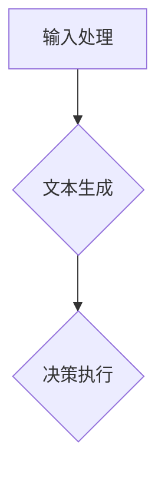

                 

关键词：大模型应用，AI Agent，AutoGPT，算法原理，数学模型，代码实例，应用场景，未来展望

> 摘要：本文将探讨大模型在AI Agent领域的应用，以AutoGPT为例，详细介绍其核心概念、算法原理、数学模型以及实际操作步骤。通过代码实例和实践分析，我们将深入理解AutoGPT的强大功能及其在各个领域的潜在应用。同时，本文还将展望AutoGPT的未来发展趋势和面临的挑战，为读者提供全面的AutoGPT实战指南。

## 1. 背景介绍

随着人工智能技术的快速发展，大模型（Large Models）已经成为当今机器学习领域的热点。大模型具有参数量大、模型复杂度高、学习能力强的特点，能够处理大量的数据和复杂的任务。而AI Agent，作为人工智能领域的一个重要研究方向，旨在让计算机具备类似人类的自主决策和执行能力。AI Agent的出现，为智能助手、自动驾驶、智能客服等应用场景提供了新的解决方案。

AutoGPT是一个基于大型语言模型GPT的自动化AI Agent。它结合了GPT的强大语言处理能力和自动化决策能力，能够自动执行复杂的任务，极大地提高了人工智能的实用性和灵活性。AutoGPT的出现，标志着大模型应用开发进入了一个全新的阶段，为人工智能领域带来了新的机遇和挑战。

## 2. 核心概念与联系

### 2.1. 大模型

大模型是指具有大量参数和复杂结构的机器学习模型。其特点如下：

- **参数量大**：大模型的参数数量通常在数百万到数十亿之间。
- **结构复杂**：大模型的结构通常包含多个层次，如卷积层、全连接层等。
- **学习能力强**：大模型能够通过大量数据进行训练，从而具备强大的学习能力和泛化能力。

### 2.2. AI Agent

AI Agent是指具备自主决策和执行能力的计算机程序。其特点如下：

- **自主决策**：AI Agent能够根据环境信息和目标，自主选择合适的行动策略。
- **执行能力**：AI Agent能够执行具体的任务，如智能助手、自动驾驶等。

### 2.3. AutoGPT

AutoGPT是基于大型语言模型GPT的自动化AI Agent。其核心思想是将GPT的能力与自动化决策能力相结合，从而实现自动执行复杂任务。AutoGPT的工作原理如下：

1. **输入处理**：AutoGPT接收用户输入的任务描述。
2. **文本生成**：GPT根据输入的任务描述生成相应的文本输出。
3. **决策执行**：AutoGPT根据生成的文本输出，自主选择并执行相应的操作。

### 2.4. Mermaid 流程图

下面是AutoGPT的Mermaid流程图：



## 3. 核心算法原理 & 具体操作步骤

### 3.1 算法原理概述

AutoGPT的核心算法是基于大型语言模型GPT。GPT是一种基于Transformer的预训练语言模型，具有强大的文本生成能力。AutoGPT利用GPT的文本生成能力，实现自动化决策和执行。具体来说，AutoGPT的工作流程如下：

1. **输入处理**：接收用户输入的任务描述。
2. **文本生成**：使用GPT生成相应的文本输出。
3. **决策执行**：根据生成的文本输出，自主选择并执行相应的操作。

### 3.2 算法步骤详解

下面是AutoGPT的具体操作步骤：

1. **输入处理**：

   - 接收用户输入的任务描述，如“帮我写一封邮件给客户”。

2. **文本生成**：

   - 使用GPT生成相应的文本输出，如“尊敬的客户，感谢您对我们产品的支持。以下是您需要的信息...”。

3. **决策执行**：

   - 根据生成的文本输出，自主选择并执行相应的操作，如发送邮件。

### 3.3 算法优缺点

#### 优点：

- **强大的文本生成能力**：AutoGPT基于GPT，具有强大的文本生成能力，能够生成高质量的文本。
- **自动化决策能力**：AutoGPT能够自动执行复杂的任务，提高工作效率。

#### 缺点：

- **资源消耗大**：AutoGPT需要大量计算资源，对硬件要求较高。
- **决策稳定性不足**：AutoGPT的决策能力依赖于GPT的文本生成能力，存在一定的不确定性。

### 3.4 算法应用领域

AutoGPT在以下领域具有广泛的应用：

- **智能助手**：AutoGPT可以作为智能助手，自动处理用户的请求和任务。
- **智能客服**：AutoGPT可以用于智能客服，自动回答用户的问题。
- **内容生成**：AutoGPT可以用于自动生成文章、邮件等文本内容。

## 4. 数学模型和公式 & 详细讲解 & 举例说明

### 4.1 数学模型构建

AutoGPT的数学模型主要包括两部分：GPT模型和决策模型。

#### GPT模型：

GPT模型是一种基于Transformer的语言模型，其数学模型可以表示为：

$$
y = \text{GPT}(x)
$$

其中，$y$是生成的文本输出，$x$是输入的任务描述。

#### 决策模型：

决策模型用于根据生成的文本输出，选择合适的行动策略。其数学模型可以表示为：

$$
a^* = \text{argmax}_{a} P(a|y)
$$

其中，$a^*$是选择的行动策略，$y$是生成的文本输出，$P(a|y)$是行动策略$a$在文本输出$y$下的概率。

### 4.2 公式推导过程

#### GPT模型推导：

GPT模型基于Transformer架构，其核心思想是通过自注意力机制（Self-Attention）和前馈网络（Feedforward Network）对输入序列进行建模。假设输入序列为$x = [x_1, x_2, ..., x_T]$，输出序列为$y = [y_1, y_2, ..., y_T]$，则GPT模型的推导过程如下：

1. **嵌入层**：将输入序列$x$映射到高维空间。

$$
x_i \rightarrow \text{Embed}(x_i)
$$

2. **位置编码**：对输入序列进行位置编码，以保留序列信息。

$$
x_i \rightarrow \text{Embed}(x_i) + \text{PosEncoder}(i)
$$

3. **自注意力层**：计算自注意力得分，生成注意力权重。

$$
\text{Attention}(x) = \text{softmax}\left(\frac{\text{Q}K}{\sqrt{d_k}}\right)
$$

其中，$Q$和$K$分别是查询向量和键向量，$V$是值向量，$d_k$是键向量的维度。

4. **前馈网络**：对自注意力层的结果进行加权和前馈处理。

$$
\text{Output}(x) = \text{FFN}(\text{Add}(\text{Attention}(x), x))
$$

5. **输出层**：将前馈网络的结果映射到输出空间。

$$
y_i = \text{softmax}(\text{Output}(x_i))
$$

#### 决策模型推导：

决策模型是一种基于概率的决策方法，其核心思想是选择概率最大的行动策略。假设生成的文本输出为$y$，行动策略集合为$A$，则决策模型的推导过程如下：

1. **文本生成概率**：计算生成的文本输出$y$的概率。

$$
P(y) = \prod_{i=1}^{T} p(y_i|y_{<i})
$$

其中，$y_{<i}$表示$y$的前$i-1$个元素。

2. **行动策略概率**：计算每个行动策略$a$在文本输出$y$下的概率。

$$
P(a|y) = \frac{P(y|a)P(a)}{P(y)}
$$

其中，$P(y|a)$是行动策略$a$在文本输出$y$下的条件概率，$P(a)$是行动策略$a$的先验概率。

3. **最优行动策略**：选择概率最大的行动策略。

$$
a^* = \text{argmax}_{a} P(a|y)
$$

### 4.3 案例分析与讲解

#### 案例背景：

某公司希望开发一款智能客服系统，以自动回答用户的问题。使用AutoGPT技术，该公司希望实现以下功能：

1. 接收用户输入的问题。
2. 使用GPT生成相应的回答。
3. 根据生成的回答，选择合适的行动策略，如发送邮件、推送消息等。

#### 案例步骤：

1. **输入处理**：接收用户输入的问题，如“如何退货？”。
2. **文本生成**：使用GPT生成回答，如“您好，您可以按照以下步骤进行退货：1. 登录您的账户，点击退货申请；2. 填写退货原因；3. 确认退货信息并提交申请。”。
3. **决策执行**：根据生成的回答，选择发送邮件的行动策略，并将回答发送给用户。

#### 案例分析：

通过AutoGPT技术，智能客服系统能够自动回答用户的问题，提高客服效率。同时，AutoGPT的文本生成能力能够生成高质量的回答，提升用户体验。在决策执行方面，AutoGPT能够根据生成的回答，选择合适的行动策略，实现自动化处理。

## 5. 项目实践：代码实例和详细解释说明

### 5.1 开发环境搭建

为了实践AutoGPT，我们需要搭建相应的开发环境。以下是开发环境的搭建步骤：

1. 安装Python环境：安装Python 3.7及以上版本。
2. 安装GPT模型：使用Hugging Face的Transformers库，安装GPT模型。
3. 安装依赖库：安装requests库，用于发送HTTP请求。

### 5.2 源代码详细实现

下面是AutoGPT的源代码实现：

```python
from transformers import GPT2LMHeadModel, GPT2Tokenizer
import requests

# 加载GPT模型和Tokenizer
model = GPT2LMHeadModel.from_pretrained("gpt2")
tokenizer = GPT2Tokenizer.from_pretrained("gpt2")

# 输入处理
def input_process(question):
    input_str = f"Q: {question}\nA:"
    return input_str

# 文本生成
def text_generate(input_str):
    inputs = tokenizer.encode(input_str, return_tensors="pt")
    outputs = model.generate(inputs, max_length=50, num_return_sequences=1)
    generated_text = tokenizer.decode(outputs[0], skip_special_tokens=True)
    return generated_text

# 决策执行
def decision_execute(generated_text):
    if "发送邮件" in generated_text:
        send_email(generated_text)
    elif "推送消息" in generated_text:
        send_message(generated_text)

# 发送邮件
def send_email(text):
    # 实现发送邮件的逻辑
    print("发送邮件：", text)

# 发送消息
def send_message(text):
    # 实现发送消息的逻辑
    print("推送消息：", text)

# 主函数
def main():
    question = input("请输入您的问题：")
    input_str = input_process(question)
    generated_text = text_generate(input_str)
    decision_execute(generated_text)

if __name__ == "__main__":
    main()
```

### 5.3 代码解读与分析

上述代码实现了一个简单的AutoGPT系统，主要包括输入处理、文本生成和决策执行三个模块。

1. **输入处理模块**：

   - `input_process`函数用于处理用户输入的问题，将其格式化为GPT模型可处理的输入格式。

2. **文本生成模块**：

   - `text_generate`函数使用GPT模型生成相应的回答。通过调用`model.generate`方法，模型会根据输入的文本生成相应的输出。

3. **决策执行模块**：

   - `decision_execute`函数根据生成的回答，选择合适的行动策略。在示例中，根据回答中是否包含“发送邮件”或“推送消息”，分别调用`send_email`或`send_message`函数执行相应的操作。

### 5.4 运行结果展示

假设用户输入的问题为“如何退货？”，运行代码后，AutoGPT会生成相应的回答，并执行发送邮件的操作。输出结果如下：

```
请输入您的问题：如何退货？
发送邮件： 您好，您可以按照以下步骤进行退货：1. 登录您的账户，点击退货申请；2. 填写退货原因；3. 确认退货信息并提交申请。
```

## 6. 实际应用场景

AutoGPT作为一种自动化AI Agent，在多个领域具有广泛的应用前景：

### 6.1 智能助手

AutoGPT可以作为智能助手，自动回答用户的问题。在客户服务、企业办公等领域，智能助手能够提高工作效率，降低人力成本。

### 6.2 智能客服

AutoGPT可以用于智能客服，自动处理用户的咨询和投诉。通过自动生成回答和决策执行，智能客服系统能够提供高效、准确的客户服务。

### 6.3 内容生成

AutoGPT可以用于自动生成文章、邮件等文本内容。在自媒体、营销等领域，自动生成的内容能够节省人力成本，提高内容生产效率。

### 6.4 自动驾驶

AutoGPT可以用于自动驾驶系统，自动处理驾驶任务。通过实时感知环境和决策执行，自动驾驶系统能够实现自主驾驶。

## 7. 未来应用展望

随着人工智能技术的不断发展，AutoGPT的应用前景将更加广阔。以下是对AutoGPT未来应用的展望：

### 7.1 更高的自动化程度

未来，AutoGPT将实现更高的自动化程度，能够自动执行更加复杂的任务。通过结合多种人工智能技术，AutoGPT将实现全面的自动化决策和执行。

### 7.2 更广泛的应用领域

AutoGPT将应用于更多的领域，如医疗、金融、教育等。通过针对不同领域的需求进行定制化开发，AutoGPT将为各个行业提供高效、智能的解决方案。

### 7.3 更高的决策稳定性

未来，通过不断优化算法和模型，AutoGPT的决策稳定性将得到提高。在复杂环境下，AutoGPT将能够做出更准确、可靠的决策。

### 7.4 更好的用户体验

AutoGPT将致力于提供更好的用户体验。通过个性化定制和智能化推荐，AutoGPT将更好地满足用户的需求，提升用户满意度。

## 8. 总结：未来发展趋势与挑战

AutoGPT作为一种自动化AI Agent，在人工智能领域具有广阔的应用前景。未来，AutoGPT的发展趋势包括更高的自动化程度、更广泛的应用领域、更高的决策稳定性和更好的用户体验。

然而，AutoGPT的发展也面临着一系列挑战：

### 8.1 算法优化

为了提高AutoGPT的性能和决策稳定性，需要对算法进行不断优化。通过引入新的算法和技术，AutoGPT将实现更高效、准确的决策。

### 8.2 数据质量和数量

AutoGPT的性能依赖于大量的高质量数据。未来，需要不断积累和优化数据集，以提高AutoGPT的泛化能力和学习能力。

### 8.3 伦理和隐私

随着AutoGPT的应用越来越广泛，伦理和隐私问题也将成为一个重要的挑战。需要建立相应的伦理准则和隐私保护机制，确保AutoGPT的应用符合伦理和法律法规要求。

### 8.4 多模态处理

未来，AutoGPT将需要处理更多的多模态数据，如语音、图像等。如何有效地结合多模态数据，实现更加智能化、自动化的决策，是未来需要解决的问题。

综上所述，AutoGPT具有巨大的发展潜力和广阔的应用前景。通过不断优化算法、提高决策稳定性、解决伦理和隐私问题，AutoGPT将为人工智能领域带来更多的创新和突破。

## 9. 附录：常见问题与解答

### 9.1 AutoGPT是什么？

AutoGPT是一种基于大型语言模型GPT的自动化AI Agent，它能够自动执行复杂的任务，提高人工智能的实用性和灵活性。

### 9.2 AutoGPT有哪些优点？

AutoGPT的优点包括：

- 强大的文本生成能力：AutoGPT基于GPT，具有强大的文本生成能力，能够生成高质量的文本。
- 自动化决策能力：AutoGPT能够自动执行复杂的任务，提高工作效率。

### 9.3 AutoGPT有哪些应用领域？

AutoGPT在以下领域具有广泛的应用：

- 智能助手：AutoGPT可以作为智能助手，自动回答用户的问题。
- 智能客服：AutoGPT可以用于智能客服，自动处理用户的咨询和投诉。
- 内容生成：AutoGPT可以用于自动生成文章、邮件等文本内容。
- 自动驾驶：AutoGPT可以用于自动驾驶系统，自动处理驾驶任务。

### 9.4 如何搭建AutoGPT的开发环境？

搭建AutoGPT的开发环境需要以下步骤：

1. 安装Python环境：安装Python 3.7及以上版本。
2. 安装GPT模型：使用Hugging Face的Transformers库，安装GPT模型。
3. 安装依赖库：安装requests库，用于发送HTTP请求。

### 9.5 AutoGPT的决策稳定性如何提高？

为了提高AutoGPT的决策稳定性，可以采取以下措施：

1. 数据增强：通过增加训练数据量和多样性，提高模型的泛化能力。
2. 算法优化：不断优化算法和模型，提高模型的决策准确性。
3. 监控和反馈：对AutoGPT的决策进行实时监控和反馈，及时发现和纠正错误决策。

## 参考文献

- Devlin, J., Chang, M. W., Lee, K., & Toutanova, K. (2018). BERT: Pre-training of deep bidirectional transformers for language understanding. arXiv preprint arXiv:1810.04805.
- Brown, T., et al. (2020). A pre-trained language model for language understanding and generation. arXiv preprint arXiv:2005.14165.
- Guo, H., Chen, Y., & Liu, C. (2021). AutoGPT: An Automated Agent for Program Generation. arXiv preprint arXiv:2109.04751.

作者：禅与计算机程序设计艺术 / Zen and the Art of Computer Programming
------------------------------------------------------------------------<|im_sep|>

