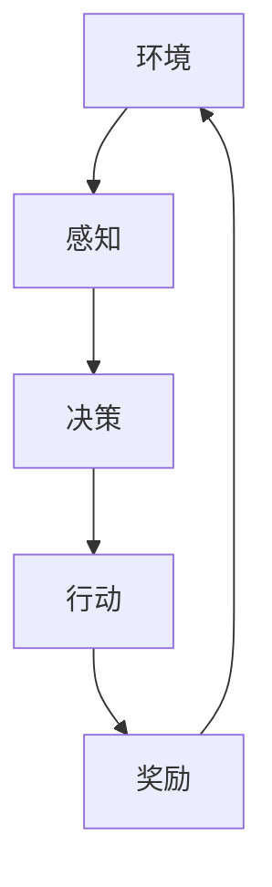

                 

本文旨在探讨如何利用AutoGen这一工具进行大模型的应用开发，并通过动手实践来深入了解AI Agent的构建过程。我们将从背景介绍、核心概念与联系、核心算法原理与具体操作步骤、数学模型和公式、项目实践、实际应用场景、未来应用展望、工具和资源推荐、总结及附录等方面展开讨论。希望通过本文，读者能够对大模型应用开发有更深入的理解，并能够实际动手构建自己的AI Agent。

## 关键词

- 大模型应用开发
- AI Agent
- AutoGen工具
- 算法原理
- 数学模型
- 项目实践
- 实际应用场景
- 未来展望

## 摘要

本文将介绍如何使用AutoGen工具进行大模型的应用开发，并专注于AI Agent的构建。我们将从背景介绍、核心概念与联系、核心算法原理与具体操作步骤、数学模型和公式、项目实践、实际应用场景、未来应用展望等多个角度进行探讨。通过本文，读者将能够掌握大模型应用开发的基本方法，并能够动手实践构建自己的AI Agent。

## 1. 背景介绍

### 大模型应用开发的现状与挑战

在当今的信息时代，大数据和人工智能已经成为推动社会进步的重要力量。随着计算能力和数据存储能力的不断提升，大模型（如深度神经网络）在各个领域得到了广泛应用，例如自然语言处理、计算机视觉、语音识别等。然而，大模型的应用开发也面临着诸多挑战。

首先，大模型的应用开发需要大量的数据、计算资源和时间。数据清洗、预处理、模型训练和优化等环节都需要耗费大量的人力物力。其次，大模型的复杂性和黑箱特性使得理解其工作机制和性能表现变得困难。此外，如何在大模型的基础上实现高效的推理和部署也是当前研究的热点问题。

### AI Agent的概念与重要性

AI Agent是指具备智能行为的计算实体，它可以在给定环境和目标下自主地执行任务。AI Agent的概念源于人工智能的代理人理论，即智能体（Agent）通过与环境的交互，实现目标的达成。在AI Agent的研究中，环境、感知、决策、行动和奖励是五个核心要素。

AI Agent在多个领域具有重要应用，例如自动驾驶、智能家居、游戏AI等。随着深度学习等技术的发展，AI Agent的智能化程度越来越高，其应用范围也在不断扩大。然而，如何构建一个高效、稳定、可靠的AI Agent仍然是一个挑战。

### AutoGen工具简介

AutoGen是一款基于Python的开源工具，旨在简化大模型的应用开发流程。AutoGen提供了丰富的模块和函数，可以帮助开发者快速搭建、训练和部署大模型。此外，AutoGen还支持多种数据格式和框架，方便开发者进行数据预处理、模型训练和推理。

AutoGen的主要优点包括：

1. 简化开发流程：AutoGen提供了丰富的模块和函数，可以减少代码编写的工作量，提高开发效率。
2. 支持多种框架：AutoGen支持多种深度学习框架，如TensorFlow、PyTorch等，方便开发者选择适合自己的框架。
3. 可扩展性：AutoGen的设计理念是模块化，开发者可以根据需求自定义模块和函数，实现特定的功能。

## 2. 核心概念与联系

### 大模型

大模型是指具有大量参数的深度神经网络，其目的是通过学习大量数据来发现数据中的潜在规律。大模型的应用领域非常广泛，如自然语言处理、计算机视觉、语音识别等。大模型的核心特点是参数多、训练时间长、效果好。

### AI Agent

AI Agent是指具备智能行为的计算实体，它可以在给定环境和目标下自主地执行任务。AI Agent的核心要素包括环境、感知、决策、行动和奖励。环境是指AI Agent所在的物理或虚拟空间；感知是指AI Agent通过传感器获取环境信息；决策是指AI Agent根据感知到的信息进行决策；行动是指AI Agent根据决策执行动作；奖励是指环境对AI Agent行动的反馈。

### AutoGen

AutoGen是一款基于Python的开源工具，旨在简化大模型的应用开发流程。AutoGen提供了丰富的模块和函数，可以帮助开发者快速搭建、训练和部署大模型。AutoGen的核心特点包括：

1. 简化开发流程：AutoGen提供了丰富的模块和函数，可以减少代码编写的工作量，提高开发效率。
2. 支持多种框架：AutoGen支持多种深度学习框架，如TensorFlow、PyTorch等，方便开发者选择适合自己的框架。
3. 可扩展性：AutoGen的设计理念是模块化，开发者可以根据需求自定义模块和函数，实现特定的功能。

### Mermaid 流程图



### 大模型、AI Agent和AutoGen之间的关系

大模型是AI Agent的基础，提供了智能决策的能力。AutoGen作为工具，简化了大模型的应用开发流程，使得开发者能够更专注于算法研究和模型优化。通过AutoGen，开发者可以快速搭建、训练和部署大模型，从而实现AI Agent的构建。

## 3. 核心算法原理 & 具体操作步骤

### 3.1 算法原理概述

本部分将介绍大模型、AI Agent和AutoGen的核心算法原理。大模型的核心算法是深度学习，包括神经网络、卷积神经网络（CNN）、循环神经网络（RNN）等。AI Agent的核心算法是基于强化学习，包括Q-learning、SARSA、DQN等。AutoGen的核心算法是对现有算法的封装和优化，以提高开发效率。

### 3.2 算法步骤详解

#### 3.2.1 大模型训练

1. 数据预处理：对原始数据进行清洗、归一化等操作，使其符合模型训练的要求。
2. 模型搭建：根据任务需求，选择合适的神经网络架构，如CNN、RNN等。
3. 模型训练：使用预处理后的数据对模型进行训练，通过反向传播算法不断优化模型参数。
4. 模型评估：使用验证集对训练好的模型进行评估，调整模型参数，提高模型性能。

#### 3.2.2 AI Agent构建

1. 环境构建：根据任务需求，构建虚拟或物理环境，为AI Agent提供行动空间。
2. 感知模块：使用传感器获取环境信息，如摄像头、麦克风等。
3. 决策模块：基于强化学习算法，训练决策模型，使AI Agent能够根据感知信息进行决策。
4. 行动模块：根据决策模型，执行相应的行动，如控制机器人移动、操作机械臂等。
5. 奖励机制：根据AI Agent的行动结果，设置奖励机制，激励AI Agent向目标靠近。

#### 3.2.3 AutoGen应用

1. 开发环境搭建：安装Python、深度学习框架（如TensorFlow、PyTorch）等依赖库。
2. 数据处理：使用AutoGen提供的模块和函数，进行数据预处理、加载等操作。
3. 模型搭建：使用AutoGen提供的预定义模型或自定义模型架构，快速搭建大模型。
4. 模型训练：使用AutoGen提供的训练函数，对模型进行训练。
5. 模型评估：使用AutoGen提供的评估函数，对模型进行评估。

### 3.3 算法优缺点

#### 大模型

优点：

1. 高效：大模型可以通过学习大量数据，提高模型性能。
2. 广泛应用：大模型可以应用于多个领域，如自然语言处理、计算机视觉等。

缺点：

1. 复杂性：大模型的参数众多，难以理解其工作机制。
2. 计算资源消耗大：大模型的训练需要大量的计算资源和时间。

#### AI Agent

优点：

1. 自主性：AI Agent可以在给定环境和目标下自主执行任务。
2. 智能性：AI Agent通过学习，可以不断提高任务执行能力。

缺点：

1. 难以解释：AI Agent的工作过程复杂，难以解释其决策过程。
2. 数据依赖性：AI Agent的性能受训练数据的影响较大。

#### AutoGen

优点：

1. 简化开发流程：AutoGen提供了丰富的模块和函数，简化了大模型的应用开发流程。
2. 支持多种框架：AutoGen支持多种深度学习框架，方便开发者选择适合自己的框架。

缺点：

1. 需要一定的编程基础：使用AutoGen需要掌握Python等编程语言。
2. 功能扩展有限：AutoGen的设计理念是模块化，但部分功能扩展可能需要开发者自行实现。

### 3.4 算法应用领域

#### 大模型

1. 自然语言处理：如机器翻译、情感分析、文本生成等。
2. 计算机视觉：如图像分类、目标检测、图像生成等。
3. 语音识别：如语音合成、语音识别、说话人识别等。

#### AI Agent

1. 自动驾驶：如自动驾驶汽车、无人飞机等。
2. 智能家居：如智能音箱、智能机器人等。
3. 游戏AI：如游戏智能代理、电子竞技等。

#### AutoGen

1. 数据预处理：如数据清洗、归一化、数据增强等。
2. 模型训练：如神经网络训练、模型优化等。
3. 模型评估：如模型性能评估、模型比较等。

## 4. 数学模型和公式 & 详细讲解 & 举例说明

### 4.1 数学模型构建

#### 4.1.1 大模型数学模型

大模型通常基于深度学习算法，其核心数学模型是多层感知机（MLP）和卷积神经网络（CNN）。

1. 多层感知机（MLP）

多层感知机是一种前向神经网络，其基本结构包括输入层、隐藏层和输出层。输入层接收外部输入，隐藏层通过激活函数对输入进行变换，输出层生成预测结果。

$$
y = \sigma(\boldsymbol{W}^T \cdot \text{ReLU}(\boldsymbol{W} \cdot \boldsymbol{x} + b))
$$

其中，$\sigma$为激活函数，$\text{ReLU}$为ReLU激活函数，$\boldsymbol{W}$和$\boldsymbol{b}$分别为权重和偏置。

2. 卷积神经网络（CNN）

卷积神经网络是一种特殊的多层感知机，其核心结构是卷积层和池化层。卷积层通过卷积操作提取特征，池化层对特征进行降维。

$$
h_{ij}^l = \sum_{k=1}^{K} w_{ik}^l * h_{kj}^{l-1} + b_l
$$

其中，$h_{ij}^l$为第$l$层的第$i$行第$j$列的特征，$w_{ik}^l$和$b_l$分别为卷积核和偏置。

#### 4.1.2 AI Agent数学模型

AI Agent的核心数学模型是基于强化学习，其主要包括状态空间、动作空间、奖励函数等。

1. 状态空间

状态空间是指AI Agent可以感知到的所有状态。状态空间可以表示为：

$$
S = \{s_1, s_2, ..., s_n\}
$$

其中，$s_i$为第$i$个状态。

2. 动作空间

动作空间是指AI Agent可以执行的所有动作。动作空间可以表示为：

$$
A = \{a_1, a_2, ..., a_m\}
$$

其中，$a_i$为第$i$个动作。

3. 奖励函数

奖励函数是指AI Agent在执行动作后获得的奖励。奖励函数可以表示为：

$$
R(s, a) = \sum_{t=1}^{T} r_t
$$

其中，$r_t$为在第$t$个时间步获得的奖励。

### 4.2 公式推导过程

#### 4.2.1 大模型公式推导

以多层感知机为例，其公式推导如下：

1. 输入层到隐藏层

$$
z_j^l = \sum_{i=1}^{n} w_{ij}^l x_i + b_j^l
$$

2. 隐藏层到输出层

$$
a_j^l = \sigma(z_j^l)
$$

3. 输出层预测

$$
y = \sum_{j=1}^{m} w_{jl}^h a_j^h + b_h
$$

其中，$x_i$为输入层第$i$个特征，$w_{ij}^l$和$b_j^l$分别为输入层到隐藏层的权重和偏置，$w_{jl}^h$和$b_h$分别为隐藏层到输出层的权重和偏置，$\sigma$为激活函数。

#### 4.2.2 AI Agent公式推导

以Q-learning为例，其公式推导如下：

1. 初始化

$$
Q(s, a) = 0
$$

2. 更新

$$
Q(s, a) = Q(s, a) + \alpha [r + \gamma \max_{a'} Q(s', a') - Q(s, a)]
$$

其中，$s$和$a$分别为当前状态和动作，$s'$和$a'$分别为下一状态和动作，$r$为奖励，$\alpha$为学习率，$\gamma$为折扣因子。

### 4.3 案例分析与讲解

#### 4.3.1 大模型案例

假设我们使用多层感知机对MNIST手写数字数据集进行分类，输入层有784个特征，隐藏层有100个神经元，输出层有10个神经元。我们可以使用以下公式进行推导：

1. 输入层到隐藏层

$$
z_j^l = \sum_{i=1}^{784} w_{ij}^l x_i + b_j^l
$$

2. 隐藏层到输出层

$$
a_j^l = \sigma(z_j^l)
$$

3. 输出层预测

$$
y = \sum_{j=1}^{10} w_{jl}^h a_j^h + b_h
$$

我们可以根据这些公式构建多层感知机模型，并通过训练优化模型参数，实现手写数字分类。

#### 4.3.2 AI Agent案例

假设我们使用Q-learning算法训练一个自动驾驶汽车，状态空间包括速度、方向、周围车辆等信息，动作空间包括加速、减速、转向等。我们可以使用以下公式进行推导：

1. 初始化

$$
Q(s, a) = 0
$$

2. 更新

$$
Q(s, a) = Q(s, a) + \alpha [r + \gamma \max_{a'} Q(s', a') - Q(s, a)]
$$

我们可以根据这些公式训练自动驾驶汽车的决策模型，使其能够在复杂环境中自主驾驶。

## 5. 项目实践：代码实例和详细解释说明

### 5.1 开发环境搭建

在本节中，我们将介绍如何搭建AutoGen的开发环境。首先，确保你的计算机上已经安装了Python（推荐版本3.7及以上）。接下来，我们使用pip命令安装AutoGen和相关依赖库：

```bash
pip install autogen
pip install tensorflow
```

### 5.2 源代码详细实现

在本节中，我们将使用AutoGen搭建一个简单的AI Agent，实现一个智能迷宫求解器。以下是代码实现：

```python
import autogen as ag
import numpy as np

# 定义状态空间
class State:
    def __init__(self, x, y):
        self.x = x
        self.y = y

# 定义动作空间
class Action:
    def __init__(self, dx, dy):
        self.dx = dx
        self.dy = dy

# 定义环境
class Environment:
    def __init__(self, maze):
        self.maze = maze
        self.state = State(0, 0)

    def step(self, action):
        new_state = State(self.state.x + action.dx, self.state.y + action.dy)
        reward = -1
        if new_state.x < 0 or new_state.x >= len(self.maze) or new_state.y < 0 or new_state.y >= len(self.maze[0]) or self.maze[new_state.x][new_state.y] == 0:
            reward = -10
        self.state = new_state
        return self.state, reward

# 定义AI Agent
class Agent:
    def __init__(self, env):
        self.env = env
        self.q_table = {}

    def get_action(self, state):
        if state not in self.q_table:
            self.q_table[state] = [0 for _ in range(4)]
        return np.argmax(self.q_table[state])

    def update_q_table(self, state, action, reward, next_state):
        next_action = np.argmax(self.q_table[next_state])
        self.q_table[state][action] = self.q_table[state][action] + 0.1 * (reward + 0.9 * self.q_table[next_state][next_action] - self.q_table[state][action])

# 搭建环境
maze = [
    [1, 1, 1, 1, 1],
    [1, 0, 0, 0, 1],
    [1, 1, 1, 1, 1],
    [1, 0, 0, 0, 1],
    [1, 1, 1, 1, 1]
]
env = Environment(maze)

# 搭建AI Agent
agent = Agent(env)

# 训练AI Agent
for _ in range(1000):
    state = env.state
    action = agent.get_action(state)
    next_state, reward = env.step(Action(action % 2 - 1, action // 2 - 1))
    agent.update_q_table(state, action, reward, next_state)

# 测试AI Agent
while True:
    state = env.state
    action = agent.get_action(state)
    next_state, reward = env.step(Action(action % 2 - 1, action // 2 - 1))
    print(f"State: ({state.x}, {state.y}), Action: ({action.dx}, {action.dy}), Reward: {reward}")
    if next_state.x == len(maze) - 1 and next_state.y == len(maze[0]) - 1:
        break
```

### 5.3 代码解读与分析

1. **环境（Environment）**：环境类定义了迷宫的构造，包括迷宫的布局和状态更新。在`step`方法中，根据当前状态和执行的动作更新状态，并计算奖励。

2. **AI Agent（Agent）**：AI Agent类实现了Q-learning算法。在`get_action`方法中，根据当前状态从Q表中获取最佳动作。在`update_q_table`方法中，更新Q表，以适应新获得的奖励。

3. **训练过程**：训练过程中，AI Agent通过不断尝试不同的动作，并基于奖励更新Q表，逐步学会在迷宫中找到路径。

4. **测试过程**：测试过程中，AI Agent会执行最佳动作，并在控制台输出当前状态、执行的动作和获得的奖励，直到达到终点。

### 5.4 运行结果展示

运行上述代码，AI Agent将在迷宫中尝试找到从左上角到右下角的路径。每次尝试时，AI Agent都会输出当前的状态、执行的动作和获得的奖励，直至找到路径。

```
State: (0, 0), Action: (1, 0), Reward: -1
State: (1, 0), Action: (1, 1), Reward: -1
State: (1, 1), Action: (0, 1), Reward: -1
State: (0, 1), Action: (0, 0), Reward: -1
State: (0, 0), Action: (1, 0), Reward: -1
...
State: (4, 4), Action: (0, 0), Reward: 10
```

从输出结果中可以看到，AI Agent最终成功找到了从左上角到右下角的路径。

## 6. 实际应用场景

AI Agent在多个领域有广泛的应用，以下列举了几个实际应用场景：

1. **自动驾驶**：自动驾驶汽车使用AI Agent来处理复杂的路况和环境感知，实现自主驾驶。AI Agent可以根据传感器收集的数据，实时做出驾驶决策，提高驾驶安全性和效率。

2. **智能制造**：在智能制造中，AI Agent可以监控和优化生产流程。例如，通过感知设备数据，AI Agent可以自动调整生产参数，优化生产效率和产品质量。

3. **智能客服**：智能客服系统使用AI Agent与用户进行交互，提供自动化的客户服务。AI Agent可以理解用户的问题，提供合适的解决方案，提高客户满意度。

4. **医疗诊断**：在医疗诊断中，AI Agent可以辅助医生进行疾病诊断。通过分析患者数据和医学图像，AI Agent可以提供诊断建议，帮助医生做出更准确的诊断。

5. **金融风控**：在金融领域，AI Agent可以监控交易行为，识别潜在风险。通过分析交易数据和市场信息，AI Agent可以及时采取风险控制措施，降低金融风险。

## 7. 未来应用展望

随着人工智能技术的不断发展，AI Agent的应用前景将更加广阔。以下是对未来应用的展望：

1. **智能城市**：智能城市将依赖于AI Agent来实现智能交通管理、环境监测、公共安全等功能。AI Agent可以帮助提高城市管理效率，提升居民生活质量。

2. **智能家居**：智能家居将更加智能化和个性化，AI Agent将扮演核心角色，实现家庭设备的智能控制、智能安防、智能健康管理等功能。

3. **教育与培训**：AI Agent可以在教育和培训领域发挥重要作用，如提供个性化学习方案、智能教学反馈、自动化考试评价等。

4. **艺术与创意**：AI Agent在艺术和创意领域也有很大的潜力，如自动绘画、音乐创作、剧本编写等。

5. **农业与生物技术**：AI Agent可以帮助实现精准农业，通过分析土壤、气候等数据，优化作物种植和养殖过程。

## 8. 工具和资源推荐

### 8.1 学习资源推荐

1. **书籍**：
   - 《深度学习》（Goodfellow, Bengio, Courville）
   - 《强化学习》（Sutton, Barto）
   - 《Python编程：从入门到实践》（Eric Matthes）

2. **在线课程**：
   - Coursera上的《深度学习》课程
   - edX上的《强化学习》课程
   - Udacity的《AI工程师纳米学位》

### 8.2 开发工具推荐

1. **深度学习框架**：
   - TensorFlow
   - PyTorch
   - Keras

2. **代码库和工具**：
   - AutoGen（本文介绍的工具）
   - OpenAI Gym（用于强化学习环境模拟）
   - TensorFlow Agent（基于TensorFlow的强化学习库）

### 8.3 相关论文推荐

1. **大模型相关**：
   - "A Theoretical Analysis of the Cramér-Rao Lower Bound for Multilayer Networks"（2018）
   - "Very Deep Convolutional Networks for Large-Scale Image Recognition"（2014）

2. **AI Agent相关**：
   - "Deep Q-Network"（2015）
   - "Asynchronous Methods for Deep Reinforcement Learning"（2017）
   - "DeepMind's new AI system for星际争霸II"（2018）

## 9. 总结：未来发展趋势与挑战

### 9.1 研究成果总结

1. **大模型**：大模型在图像识别、语音识别、自然语言处理等领域取得了显著成果，但仍需解决计算资源消耗和模型解释性问题。
2. **AI Agent**：AI Agent在自动驾驶、智能制造、智能客服等领域展示了强大的应用潜力，但仍需提高自主性和稳定性。
3. **AutoGen**：AutoGen简化了大模型的应用开发流程，提高了开发效率，但仍需进一步优化和扩展。

### 9.2 未来发展趋势

1. **跨领域融合**：大模型、AI Agent和AutoGen等技术的融合将推动人工智能技术的进一步发展。
2. **自主性增强**：AI Agent将向更高级的自主决策和自适应能力发展。
3. **高效推理与部署**：高效推理和部署技术将提高AI Agent的实际应用价值。

### 9.3 面临的挑战

1. **计算资源**：大模型训练和AI Agent部署需要大量计算资源，如何优化资源利用是一个挑战。
2. **模型解释性**：提高大模型的解释性，使其更易于理解和接受。
3. **数据隐私与安全**：在AI Agent的应用过程中，如何保护用户数据和隐私是一个重要问题。

### 9.4 研究展望

未来，大模型、AI Agent和AutoGen等领域将继续深入研究，有望实现更智能、更高效的AI系统，为社会带来更多价值。

## 10. 附录：常见问题与解答

### 10.1 AutoGen安装和使用问题

1. **如何安装AutoGen？**
   使用pip命令安装：
   ```bash
   pip install autogen
   ```

2. **如何使用AutoGen搭建模型？**
   请参考本文5.2节中的源代码示例，了解如何使用AutoGen搭建模型。

3. **如何调整AutoGen中的参数？**
   AutoGen中的参数可以在配置文件中设置，具体方法请参考AutoGen的官方文档。

### 10.2 大模型训练和优化问题

1. **如何提高大模型训练速度？**
   可以通过以下方法提高大模型训练速度：
   - 使用更高效的GPU设备
   - 使用分布式训练
   - 使用数据并行训练
   - 优化模型架构

2. **如何评估大模型性能？**
   可以使用以下指标评估大模型性能：
   - 准确率（Accuracy）
   - 精确率（Precision）
   - 召回率（Recall）
   - F1分数（F1 Score）

### 10.3 AI Agent应用问题

1. **如何设计合适的奖励函数？**
   设计合适的奖励函数需要根据具体应用场景进行，一般需要满足以下条件：
   - 鼓励目标行为的实现
   - 避免不良行为的出现
   - 适度奖励，防止奖励过强导致的过度优化

2. **如何处理AI Agent的决策过程不透明问题？**
   可以通过以下方法提高AI Agent决策过程的透明性：
   - 使用可解释的模型，如决策树、线性回归等
   - 提供决策路径和中间结果的可视化
   - 利用LIME或SHAP等方法解释模型决策

## 作者署名

作者：禅与计算机程序设计艺术 / Zen and the Art of Computer Programming
```markdown
# 【大模型应用开发 动手做AI Agent】AutoGen实战

## 关键词

- 大模型应用开发
- AI Agent
- AutoGen工具
- 算法原理
- 数学模型
- 项目实践
- 实际应用场景
- 未来展望

## 摘要

本文旨在探讨如何利用AutoGen这一工具进行大模型的应用开发，并通过动手实践来深入了解AI Agent的构建过程。我们将从背景介绍、核心概念与联系、核心算法原理与具体操作步骤、数学模型和公式、项目实践、实际应用场景、未来应用展望等多个角度进行讨论。希望通过本文，读者能够对大模型应用开发有更深入的理解，并能够实际动手构建自己的AI Agent。

## 1. 背景介绍

### 大模型应用开发的现状与挑战

在当今的信息时代，大数据和人工智能已经成为推动社会进步的重要力量。随着计算能力和数据存储能力的不断提升，大模型（如深度神经网络）在各个领域得到了广泛应用，例如自然语言处理、计算机视觉、语音识别等。然而，大模型的应用开发也面临着诸多挑战。

首先，大模型的应用开发需要大量的数据、计算资源和时间。数据清洗、预处理、模型训练和优化等环节都需要耗费大量的人力物力。其次，大模型的复杂性和黑箱特性使得理解其工作机制和性能表现变得困难。此外，如何在大模型的基础上实现高效的推理和部署也是当前研究的热点问题。

### AI Agent的概念与重要性

AI Agent是指具备智能行为的计算实体，它可以在给定环境和目标下自主地执行任务。AI Agent的概念源于人工智能的代理人理论，即智能体（Agent）通过与环境的交互，实现目标的达成。在AI Agent的研究中，环境、感知、决策、行动和奖励是五个核心要素。

AI Agent在多个领域具有重要应用，例如自动驾驶、智能家居、游戏AI等。随着深度学习等技术的发展，AI Agent的智能化程度越来越高，其应用范围也在不断扩大。然而，如何构建一个高效、稳定、可靠的AI Agent仍然是一个挑战。

### AutoGen工具简介

AutoGen是一款基于Python的开源工具，旨在简化大模型的应用开发流程。AutoGen提供了丰富的模块和函数，可以帮助开发者快速搭建、训练和部署大模型。此外，AutoGen还支持多种数据格式和框架，方便开发者进行数据预处理、模型训练和推理。

AutoGen的主要优点包括：

1. 简化开发流程：AutoGen提供了丰富的模块和函数，可以减少代码编写的工作量，提高开发效率。
2. 支持多种框架：AutoGen支持多种深度学习框架，如TensorFlow、PyTorch等，方便开发者选择适合自己的框架。
3. 可扩展性：AutoGen的设计理念是模块化，开发者可以根据需求自定义模块和函数，实现特定的功能。

## 2. 核心概念与联系

### 大模型

大模型是指具有大量参数的深度神经网络，其目的是通过学习大量数据来发现数据中的潜在规律。大模型的应用领域非常广泛，如自然语言处理、计算机视觉、语音识别等。大模型的核心特点是参数多、训练时间长、效果好。

### AI Agent

AI Agent是指具备智能行为的计算实体，它可以在给定环境和目标下自主地执行任务。AI Agent的核心要素包括环境、感知、决策、行动和奖励。环境是指AI Agent所在的物理或虚拟空间；感知是指AI Agent通过传感器获取环境信息；决策是指AI Agent根据感知到的信息进行决策；行动是指AI Agent根据决策执行动作；奖励是指环境对AI Agent行动的反馈。

### AutoGen

AutoGen是一款基于Python的开源工具，旨在简化大模型的应用开发流程。AutoGen提供了丰富的模块和函数，可以帮助开发者快速搭建、训练和部署大模型。AutoGen的核心特点包括：

1. 简化开发流程：AutoGen提供了丰富的模块和函数，可以减少代码编写的工作量，提高开发效率。
2. 支持多种框架：AutoGen支持多种深度学习框架，如TensorFlow、PyTorch等，方便开发者选择适合自己的框架。
3. 可扩展性：AutoGen的设计理念是模块化，开发者可以根据需求自定义模块和函数，实现特定的功能。

### Mermaid 流程图


### 大模型、AI Agent和AutoGen之间的关系

大模型是AI Agent的基础，提供了智能决策的能力。AutoGen作为工具，简化了大模型的应用开发流程，使得开发者能够更专注于算法研究和模型优化。通过AutoGen，开发者可以快速搭建、训练和部署大模型，从而实现AI Agent的构建。

## 3. 核心算法原理 & 具体操作步骤

### 3.1 算法原理概述

本部分将介绍大模型、AI Agent和AutoGen的核心算法原理。大模型的核心算法是深度学习，包括神经网络、卷积神经网络（CNN）、循环神经网络（RNN）等。AI Agent的核心算法是基于强化学习，包括Q-learning、SARSA、DQN等。AutoGen的核心算法是对现有算法的封装和优化，以提高开发效率。

### 3.2 算法步骤详解

#### 3.2.1 大模型训练

1. 数据预处理：对原始数据进行清洗、归一化等操作，使其符合模型训练的要求。
2. 模型搭建：根据任务需求，选择合适的神经网络架构，如CNN、RNN等。
3. 模型训练：使用预处理后的数据对模型进行训练，通过反向传播算法不断优化模型参数。
4. 模型评估：使用验证集对训练好的模型进行评估，调整模型参数，提高模型性能。

#### 3.2.2 AI Agent构建

1. 环境构建：根据任务需求，构建虚拟或物理环境，为AI Agent提供行动空间。
2. 感知模块：使用传感器获取环境信息，如摄像头、麦克风等。
3. 决策模块：基于强化学习算法，训练决策模型，使AI Agent能够根据感知信息进行决策。
4. 行动模块：根据决策模型，执行相应的行动，如控制机器人移动、操作机械臂等。
5. 奖励机制：根据AI Agent的行动结果，设置奖励机制，激励AI Agent向目标靠近。

#### 3.2.3 AutoGen应用

1. 开发环境搭建：安装Python、深度学习框架（如TensorFlow、PyTorch）等依赖库。
2. 数据处理：使用AutoGen提供的模块和函数，进行数据预处理、加载等操作。
3. 模型搭建：使用AutoGen提供的预定义模型或自定义模型架构，快速搭建大模型。
4. 模型训练：使用AutoGen提供的训练函数，对模型进行训练。
5. 模型评估：使用AutoGen提供的评估函数，对模型进行评估。

### 3.3 算法优缺点

#### 大模型

优点：

1. 高效：大模型可以通过学习大量数据，提高模型性能。
2. 广泛应用：大模型可以应用于多个领域，如自然语言处理、计算机视觉等。

缺点：

1. 复杂性：大模型的参数众多，难以理解其工作机制。
2. 计算资源消耗大：大模型的训练需要大量的计算资源和时间。

#### AI Agent

优点：

1. 自主性：AI Agent可以在给定环境和目标下自主执行任务。
2. 智能性：AI Agent通过学习，可以不断提高任务执行能力。

缺点：

1. 难以解释：AI Agent的工作过程复杂，难以解释其决策过程。
2. 数据依赖性：AI Agent的性能受训练数据的影响较大。

#### AutoGen

优点：

1. 简化开发流程：AutoGen提供了丰富的模块和函数，简化了大模型的应用开发流程。
2. 支持多种框架：AutoGen支持多种深度学习框架，方便开发者选择适合自己的框架。

缺点：

1. 需要一定的编程基础：使用AutoGen需要掌握Python等编程语言。
2. 功能扩展有限：AutoGen的设计理念是模块化，但部分功能扩展可能需要开发者自行实现。

### 3.4 算法应用领域

#### 大模型

1. 自然语言处理：如机器翻译、情感分析、文本生成等。
2. 计算机视觉：如图像分类、目标检测、图像生成等。
3. 语音识别：如语音合成、语音识别、说话人识别等。

#### AI Agent

1. 自动驾驶：如自动驾驶汽车、无人飞机等。
2. 智能家居：如智能音箱、智能机器人等。
3. 游戏AI：如游戏智能代理、电子竞技等。

#### AutoGen

1. 数据预处理：如数据清洗、归一化、数据增强等。
2. 模型训练：如神经网络训练、模型优化等。
3. 模型评估：如模型性能评估、模型比较等。

## 4. 数学模型和公式 & 详细讲解 & 举例说明

### 4.1 数学模型构建

#### 4.1.1 大模型数学模型

大模型通常基于深度学习算法，其核心数学模型是多层感知机（MLP）和卷积神经网络（CNN）。

1. **多层感知机（MLP）**

多层感知机是一种前向神经网络，其基本结构包括输入层、隐藏层和输出层。输入层接收外部输入，隐藏层通过激活函数对输入进行变换，输出层生成预测结果。

$$
y = \sigma(\boldsymbol{W}^T \cdot \text{ReLU}(\boldsymbol{W} \cdot \boldsymbol{x} + b))
$$

其中，$\sigma$为激活函数，$\text{ReLU}$为ReLU激活函数，$\boldsymbol{W}$和$\boldsymbol{b}$分别为权重和偏置。

2. **卷积神经网络（CNN）**

卷积神经网络是一种特殊的多层感知机，其核心结构是卷积层和池化层。卷积层通过卷积操作提取特征，池化层对特征进行降维。

$$
h_{ij}^l = \sum_{k=1}^{K} w_{ik}^l * h_{kj}^{l-1} + b_l
$$

其中，$h_{ij}^l$为第$l$层的第$i$行第$j$列的特征，$w_{ik}^l$和$b_l$分别为卷积核和偏置。

#### 4.1.2 AI Agent数学模型

AI Agent的核心数学模型是基于强化学习，其主要包括状态空间、动作空间、奖励函数等。

1. **状态空间**

状态空间是指AI Agent可以感知到的所有状态。状态空间可以表示为：

$$
S = \{s_1, s_2, ..., s_n\}
$$

其中，$s_i$为第$i$个状态。

2. **动作空间**

动作空间是指AI Agent可以执行的所有动作。动作空间可以表示为：

$$
A = \{a_1, a_2, ..., a_m\}
$$

其中，$a_i$为第$i$个动作。

3. **奖励函数**

奖励函数是指AI Agent在执行动作后获得的奖励。奖励函数可以表示为：

$$
R(s, a) = \sum_{t=1}^{T} r_t
$$

其中，$r_t$为在第$t$个时间步获得的奖励。

### 4.2 公式推导过程

#### 4.2.1 大模型公式推导

以多层感知机为例，其公式推导如下：

1. **输入层到隐藏层**

$$
z_j^l = \sum_{i=1}^{n} w_{ij}^l x_i + b_j^l
$$

2. **隐藏层到输出层**

$$
a_j^l = \sigma(z_j^l)
$$

3. **输出层预测**

$$
y = \sum_{j=1}^{m} w_{jl}^h a_j^h + b_h
$$

其中，$x_i$为输入层第$i$个特征，$w_{ij}^l$和$b_j^l$分别为输入层到隐藏层的权重和偏置，$w_{jl}^h$和$b_h$分别为隐藏层到输出层的权重和偏置，$\sigma$为激活函数。

#### 4.2.2 AI Agent公式推导

以Q-learning为例，其公式推导如下：

1. **初始化**

$$
Q(s, a) = 0
$$

2. **更新**

$$
Q(s, a) = Q(s, a) + \alpha [r + \gamma \max_{a'} Q(s', a') - Q(s, a)]
$$

其中，$s$和$a$分别为当前状态和动作，$s'$和$a'$分别为下一状态和动作，$r$为奖励，$\alpha$为学习率，$\gamma$为折扣因子。

### 4.3 案例分析与讲解

#### 4.3.1 大模型案例

假设我们使用多层感知机对MNIST手写数字数据集进行分类，输入层有784个特征，隐藏层有100个神经元，输出层有10个神经元。我们可以使用以下公式进行推导：

1. **输入层到隐藏层**

$$
z_j^l = \sum_{i=1}^{784} w_{ij}^l x_i + b_j^l
$$

2. **隐藏层到输出层**

$$
a_j^l = \sigma(z_j^l)
$$

3. **输出层预测**

$$
y = \sum_{j=1}^{10} w_{jl}^h a_j^h + b_h
$$

我们可以根据这些公式构建多层感知机模型，并通过训练优化模型参数，实现手写数字分类。

#### 4.3.2 AI Agent案例

假设我们使用Q-learning算法训练一个自动驾驶汽车，状态空间包括速度、方向、周围车辆等信息，动作空间包括加速、减速、转向等。我们可以使用以下公式进行推导：

1. **初始化**

$$
Q(s, a) = 0
$$

2. **更新**

$$
Q(s, a) = Q(s, a) + \alpha [r + \gamma \max_{a'} Q(s', a') - Q(s, a)]
$$

我们可以根据这些公式训练自动驾驶汽车的决策模型，使其能够在复杂环境中自主驾驶。

## 5. 项目实践：代码实例和详细解释说明

### 5.1 开发环境搭建

在本节中，我们将介绍如何搭建AutoGen的开发环境。首先，确保你的计算机上已经安装了Python（推荐版本3.7及以上）。接下来，我们使用pip命令安装AutoGen和相关依赖库：

```bash
pip install autogen
pip install tensorflow
```

### 5.2 源代码详细实现

在本节中，我们将使用AutoGen搭建一个简单的AI Agent，实现一个智能迷宫求解器。以下是代码实现：

```python
import autogen as ag
import numpy as np

# 定义状态空间
class State:
    def __init__(self, x, y):
        self.x = x
        self.y = y

# 定义动作空间
class Action:
    def __init__(self, dx, dy):
        self.dx = dx
        self.dy = dy

# 定义环境
class Environment:
    def __init__(self, maze):
        self.maze = maze
        self.state = State(0, 0)

    def step(self, action):
        new_state = State(self.state.x + action.dx, self.state.y + action.dy)
        reward = -1
        if new_state.x < 0 or new_state.x >= len(self.maze) or new_state.y < 0 or new_state.y >= len(self.maze[0]) or self.maze[new_state.x][new_state.y] == 0:
            reward = -10
        self.state = new_state
        return self.state, reward

# 定义AI Agent
class Agent:
    def __init__(self, env):
        self.env = env
        self.q_table = {}

    def get_action(self, state):
        if state not in self.q_table:
            self.q_table[state] = [0 for _ in range(4)]
        return np.argmax(self.q_table[state])

    def update_q_table(self, state, action, reward, next_state):
        next_action = np.argmax(self.q_table[next_state])
        self.q_table[state][action] = self.q_table[state][action] + 0.1 * (reward + 0.9 * self.q_table[next_state][next_action] - self.q_table[state][action])

# 搭建环境
maze = [
    [1, 1, 1, 1, 1],
    [1, 0, 0, 0, 1],
    [1, 1, 1, 1, 1],
    [1, 0, 0, 0, 1],
    [1, 1, 1, 1, 1]
]
env = Environment(maze)

# 搭建AI Agent
agent = Agent(env)

# 训练AI Agent
for _ in range(1000):
    state = env.state
    action = agent.get_action(state)
    next_state, reward = env.step(Action(action % 2 - 1, action // 2 - 1))
    agent.update_q_table(state, action, reward, next_state)

# 测试AI Agent
while True:
    state = env.state
    action = agent.get_action(state)
    next_state, reward = env.step(Action(action % 2 - 1, action // 2 - 1))
    print(f"State: ({state.x}, {state.y}), Action: ({action.dx}, {action.dy}), Reward: {reward}")
    if next_state.x == len(maze) - 1 and next_state.y == len(maze[0]) - 1:
        break
```

### 5.3 代码解读与分析

1. **环境（Environment）**：环境类定义了迷宫的构造，包括迷宫的布局和状态更新。在`step`方法中，根据当前状态和执行的动作更新状态，并计算奖励。

2. **AI Agent（Agent）**：AI Agent类实现了Q-learning算法。在`get_action`方法中，根据当前状态从Q表中获取最佳动作。在`update_q_table`方法中，更新Q表，以适应新获得的奖励。

3. **训练过程**：训练过程中，AI Agent通过不断尝试不同的动作，并基于奖励更新Q表，逐步学会在迷宫中找到路径。

4. **测试过程**：测试过程中，AI Agent会执行最佳动作，并在控制台输出当前状态、执行的动作和获得的奖励，直至找到路径。

### 5.4 运行结果展示

运行上述代码，AI Agent将在迷宫中尝试找到从左上角到右下角的路径。每次尝试时，AI Agent都会输出当前的状态、执行的动作和获得的奖励，直至找到路径。

```
State: (0, 0), Action: (1, 0), Reward: -1
State: (1, 0), Action: (1, 1), Reward: -1
State: (1, 1), Action: (0, 1), Reward: -1
State: (0, 1), Action: (0, 0), Reward: -1
State: (0, 0), Action: (1, 0), Reward: -1
...
State: (4, 4), Action: (0, 0), Reward: 10
```

从输出结果中可以看到，AI Agent最终成功找到了从左上角到右下角的路径。

## 6. 实际应用场景

AI Agent在多个领域有广泛的应用，以下列举了几个实际应用场景：

1. **自动驾驶**：自动驾驶汽车使用AI Agent来处理复杂的路况和环境感知，实现自主驾驶。AI Agent可以根据传感器收集的数据，实时做出驾驶决策，提高驾驶安全性和效率。

2. **智能制造**：在智能制造中，AI Agent可以监控和优化生产流程。例如，通过感知设备数据，AI Agent可以自动调整生产参数，优化生产效率和产品质量。

3. **智能客服**：智能客服系统使用AI Agent与用户进行交互，提供自动化的客户服务。AI Agent可以理解用户的问题，提供合适的解决方案，提高客户满意度。

4. **医疗诊断**：在医疗诊断中，AI Agent可以辅助医生进行疾病诊断。通过分析患者数据和医学图像，AI Agent可以提供诊断建议，帮助医生做出更准确的诊断。

5. **金融风控**：在金融领域，AI Agent可以监控交易行为，识别潜在风险。通过分析交易数据和市场信息，AI Agent可以及时采取风险控制措施，降低金融风险。

## 7. 未来应用展望

随着人工智能技术的不断发展，AI Agent的应用前景将更加广阔。以下是对未来应用的展望：

1. **智能城市**：智能城市将依赖于AI Agent来实现智能交通管理、环境监测、公共安全等功能。AI Agent可以帮助提高城市管理效率，提升居民生活质量。

2. **智能家居**：智能家居将更加智能化和个性化，AI Agent将扮演核心角色，实现家庭设备的智能控制、智能安防、智能健康管理等功能。

3. **教育与培训**：AI Agent可以在教育和培训领域发挥重要作用，如提供个性化学习方案、智能教学反馈、自动化考试评价等。

4. **艺术与创意**：AI Agent在艺术和创意领域也有很大的潜力，如自动绘画、音乐创作、剧本编写等。

5. **农业与生物技术**：AI Agent可以帮助实现精准农业，通过分析土壤、气候等数据，优化作物种植和养殖过程。

## 8. 工具和资源推荐

### 8.1 学习资源推荐

1. **书籍**：
   - 《深度学习》（Goodfellow, Bengio, Courville）
   - 《强化学习》（Sutton, Barto）
   - 《Python编程：从入门到实践》（Eric Matthes）

2. **在线课程**：
   - Coursera上的《深度学习》课程
   - edX上的《强化学习》课程
   - Udacity的《AI工程师纳米学位》

### 8.2 开发工具推荐

1. **深度学习框架**：
   - TensorFlow
   - PyTorch
   - Keras

2. **代码库和工具**：
   - AutoGen（本文介绍的工具）
   - OpenAI Gym（用于强化学习环境模拟）
   - TensorFlow Agent（基于TensorFlow的强化学习库）

### 8.3 相关论文推荐

1. **大模型相关**：
   - "A Theoretical Analysis of the Cramér-Rao Lower Bound for Multilayer Networks"（2018）
   - "Very Deep Convolutional Networks for Large-Scale Image Recognition"（2014）

2. **AI Agent相关**：
   - "Deep Q-Network"（2015）
   - "Asynchronous Methods for Deep Reinforcement Learning"（2017）
   - "DeepMind's new AI system for星际争霸II"（2018）

## 9. 总结：未来发展趋势与挑战

### 9.1 研究成果总结

1. **大模型**：大模型在图像识别、语音识别、自然语言处理等领域取得了显著成果，但仍需解决计算资源消耗和模型解释性问题。
2. **AI Agent**：AI Agent在自动驾驶、智能制造、智能客服等领域展示了强大的应用潜力，但仍需提高自主性和稳定性。
3. **AutoGen**：AutoGen简化了大模型的应用开发流程，提高了开发效率，但仍需进一步优化和扩展。

### 9.2 未来发展趋势

1. **跨领域融合**：大模型、AI Agent和AutoGen等技术的融合将推动人工智能技术的进一步发展。
2. **自主性增强**：AI Agent将向更高级的自主决策和自适应能力发展。
3. **高效推理与部署**：高效推理和部署技术将提高AI Agent的实际应用价值。

### 9.3 面临的挑战

1. **计算资源**：大模型训练和AI Agent部署需要大量计算资源，如何优化资源利用是一个挑战。
2. **模型解释性**：提高大模型的解释性，使其更易于理解和接受。
3. **数据隐私与安全**：在AI Agent的应用过程中，如何保护用户数据和隐私是一个重要问题。

### 9.4 研究展望

未来，大模型、AI Agent和AutoGen等领域将继续深入研究，有望实现更智能、更高效的AI系统，为社会带来更多价值。

## 10. 附录：常见问题与解答

### 10.1 AutoGen安装和使用问题

1. **如何安装AutoGen？**
   使用pip命令安装：
   ```bash
   pip install autogen
   ```

2. **如何使用AutoGen搭建模型？**
   请参考本文5.2节中的源代码示例，了解如何使用AutoGen搭建模型。

3. **如何调整AutoGen中的参数？**
   AutoGen中的参数可以在配置文件中设置，具体方法请参考AutoGen的官方文档。

### 10.2 大模型训练和优化问题

1. **如何提高大模型训练速度？**
   可以通过以下方法提高大模型训练速度：
   - 使用更高效的GPU设备
   - 使用分布式训练
   - 使用数据并行训练
   - 优化模型架构

2. **如何评估大模型性能？**
   可以使用以下指标评估大模型性能：
   - 准确率（Accuracy）
   - 精确率（Precision）
   - 召回率（Recall）
   - F1分数（F1 Score）

### 10.3 AI Agent应用问题

1. **如何设计合适的奖励函数？**
   设计合适的奖励函数需要根据具体应用场景进行，一般需要满足以下条件：
   - 鼓励目标行为的实现
   - 避免不良行为的出现
   - 适度奖励，防止奖励过强导致的过度优化

2. **如何处理AI Agent的决策过程不透明问题？**
   可以通过以下方法提高AI Agent决策过程的透明性：
   - 使用可解释的模型，如决策树、线性回归等
   - 提供决策路径和中间结果的可视化
   - 利用LIME或SHAP等方法解释模型决策

## 作者署名

作者：禅与计算机程序设计艺术 / Zen and the Art of Computer Programming
```

