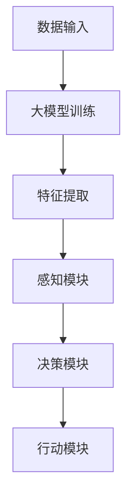

                 

 > 在这个快速发展的数字化时代，人工智能（AI）技术已经成为推动科技进步的重要力量。从早期的规则驱动系统到现在的深度学习和大模型，AI在各个领域的应用不断拓展。本文将探讨如何利用大模型开发一个初步具备自我学习和推理能力的AI代理（Agent），即所谓的BabyAGI（Baby Artificial General Intelligence）。本文旨在为广大开发者提供一套理论与实践相结合的教程，帮助大家动手实践AI代理的开发。

## 关键词
- 大模型
- AI代理
- BabyAGI
- 深度学习
- 自我学习
- 推理能力
- 应用开发

## 摘要
本文将详细讨论大模型在AI代理开发中的应用，从核心概念、算法原理、数学模型到项目实践，为读者提供一条清晰的学习路径。通过本文，读者将了解如何使用现代AI技术构建一个具备初步自我学习与推理能力的AI代理，并能够独立完成一些实用任务。文章还将探讨AI代理在实际应用中的前景和挑战，为未来的研究和开发提供参考。

## 1. 背景介绍

### 1.1 人工智能的发展历程

人工智能（Artificial Intelligence，简称AI）的研究始于20世纪50年代，经过几十年的发展，已经从最初的规则驱动系统，逐渐演变为以深度学习和大模型为代表的技术体系。早期的AI研究主要集中在逻辑推理、知识表示和搜索算法上，但由于计算能力和数据资源的限制，这些系统在实际应用中的表现并不理想。

随着计算能力的提升和大数据的普及，深度学习（Deep Learning）技术得到了快速发展。深度学习通过构建多层神经网络，能够自动从大量数据中学习特征和模式，从而实现高度自动化的模式识别和预测。这一突破性进展为AI技术开辟了新的应用领域，如计算机视觉、自然语言处理和语音识别等。

### 1.2 大模型的崛起

大模型，即具有大量参数和神经元的大规模神经网络，是深度学习技术的核心。近年来，随着GPU和TPU等专用硬件的普及，大模型的训练和推理速度大幅提升。代表性的大模型包括谷歌的Transformer、OpenAI的GPT系列以及微软的ChatGPT等。这些模型在处理复杂数据和任务时展现出了强大的性能，引发了学术界和工业界的高度关注。

### 1.3 AI代理的概念

AI代理是一种模拟人类智能行为的计算机程序，能够感知环境、制定决策并采取行动。一个理想的AI代理应具备以下特点：
- 自主性：能够独立运行，无需人类干预。
- 学习能力：能够从经验中学习，不断优化行为。
- 推理能力：能够理解语言、图像等复杂信息，并进行逻辑推理。

### 1.4 BabyAGI的意义

BabyAGI是指一种初步具备人工智能的智能体，虽然与人类智能相比仍有较大差距，但已经在某些方面展现了智能行为。开发BabyAGI的意义在于：
- 探索人工智能的边界：通过实践，了解人工智能在解决复杂问题时的表现。
- 促进技术进步：推动深度学习和神经网络算法的发展。
- 应用潜力：在各个领域（如自动驾驶、智能家居、医疗诊断等）具有广泛的应用前景。

## 2. 核心概念与联系

### 2.1 大模型的概念

大模型是一种具有大量参数和神经元的大规模神经网络，通常通过深度学习算法进行训练。这些模型能够处理复杂数据和任务，具备较强的模式识别和预测能力。大模型的核心组成部分包括：
- 输入层：接收外部数据，如文本、图像和声音等。
- 隐藏层：通过多层神经网络结构，对数据进行特征提取和转换。
- 输出层：生成预测结果或决策。

### 2.2 AI代理的概念

AI代理是一种计算机程序，能够模拟人类智能行为，感知环境、制定决策并采取行动。一个典型的AI代理由以下几部分组成：
- 感知模块：接收外部信息，如传感器数据、图像和语音等。
- 决策模块：根据感知模块提供的信息，生成行动计划。
- 行动模块：执行决策模块生成的行动计划。

### 2.3 BabyAGI的概念

BabyAGI是一种初步具备人工智能的智能体，具备自我学习和推理能力，但尚未达到人类智能水平。BabyAGI的核心特点包括：
- 自我学习能力：能够从经验中学习，不断优化行为。
- 推理能力：能够理解语言、图像等复杂信息，并进行逻辑推理。
- 应用能力：能够在多个领域（如自然语言处理、计算机视觉等）发挥作用。

### 2.4 大模型与AI代理的联系

大模型与AI代理之间存在着紧密的联系。大模型作为AI代理的核心技术，为AI代理提供了强大的计算能力和数据处理能力。具体来说：
- 大模型负责从海量数据中提取特征和模式，为AI代理提供决策基础。
- AI代理利用大模型进行自我学习和推理，提高在复杂环境中的适应能力。

### 2.5 Mermaid 流程图

以下是一个简单的Mermaid流程图，展示了大模型与AI代理之间的关系：



## 3. 核心算法原理 & 具体操作步骤

### 3.1 算法原理概述

在开发BabyAGI时，核心算法主要涉及深度学习、自我学习和推理技术。以下是对这些算法原理的概述：

#### 深度学习

深度学习是一种基于多层神经网络的学习方法，通过多层神经元对输入数据进行特征提取和转换，从而实现复杂任务的自动识别和预测。深度学习的核心组成部分包括：
- 神经网络结构：由多个神经元层组成，包括输入层、隐藏层和输出层。
- 损失函数：用于评估模型预测与真实值之间的差距，指导模型优化。
- 优化算法：如梯度下降、随机梯度下降等，用于调整模型参数，优化模型性能。

#### 自我学习

自我学习是指AI代理通过从经验中学习，不断优化自身行为的过程。自我学习的关键技术包括：
- 强化学习：通过奖励机制，让AI代理在尝试不同行动时，学习哪种行动能够带来更好的结果。
- 监督学习：通过标注数据，让AI代理从已有知识中学习，提高任务表现。
- 无监督学习：通过无标签数据，让AI代理发现数据中的潜在结构和规律。

#### 推理能力

推理能力是指AI代理在理解语言、图像等复杂信息后，进行逻辑推理和决策的能力。推理能力的关键技术包括：
- 自然语言处理：通过处理文本数据，让AI代理理解语言中的语义和逻辑关系。
- 计算机视觉：通过处理图像数据，让AI代理识别图像中的物体和场景。
- 知识图谱：通过构建知识图谱，让AI代理在多个领域中进行跨领域的推理和决策。

### 3.2 算法步骤详解

在具体开发过程中，可以按照以下步骤进行：

#### 步骤1：数据收集与预处理

收集大量适用于AI代理任务的数据，并进行预处理，如数据清洗、归一化和特征提取等。数据的质量直接影响AI代理的性能，因此这一步骤至关重要。

#### 步骤2：模型设计

根据任务需求和数据特点，设计合适的神经网络结构。通常，选择具有多层隐藏层的神经网络，如卷积神经网络（CNN）或循环神经网络（RNN）。

#### 步骤3：模型训练

使用预处理后的数据，对神经网络进行训练。在训练过程中，通过损失函数和优化算法，不断调整模型参数，使模型能够更好地拟合数据。

#### 步骤4：自我学习

在模型训练完成后，AI代理可以通过自我学习技术，进一步提高任务表现。例如，使用强化学习算法，让AI代理在模拟环境中进行自主尝试，并根据奖励信号优化行为。

#### 步骤5：推理能力开发

通过自然语言处理、计算机视觉和知识图谱等技术，开发AI代理的推理能力。这包括理解文本、识别图像和构建知识图谱等任务。

#### 步骤6：应用部署

将训练完成的AI代理部署到实际应用场景中，如自动驾驶、智能家居或医疗诊断等。在实际应用中，AI代理需要不断接收环境反馈，并持续优化自身性能。

### 3.3 算法优缺点

深度学习、自我学习和推理技术在AI代理开发中具有显著的优点，但也存在一定的缺点：

#### 优点

- **强大的计算能力**：深度学习模型能够处理复杂数据和任务，具备较强的模式识别和预测能力。
- **自我学习能力**：自我学习技术使AI代理能够从经验中学习，不断优化行为，提高任务表现。
- **推理能力**：通过自然语言处理、计算机视觉和知识图谱等技术，AI代理能够在多个领域进行推理和决策。

#### 缺点

- **数据依赖性**：深度学习模型对大量高质量数据有较高依赖，数据质量和数量直接影响模型性能。
- **训练时间较长**：深度学习模型的训练时间较长，需要大量计算资源和时间。
- **解释性不足**：深度学习模型通常被视为“黑箱”，难以解释其决策过程，这在某些应用场景中可能成为问题。

### 3.4 算法应用领域

深度学习、自我学习和推理技术已经在多个领域取得了显著的应用成果：

- **计算机视觉**：用于图像识别、目标检测、视频分析等任务，如人脸识别、自动驾驶和智能家居等。
- **自然语言处理**：用于文本分类、机器翻译、语音识别等任务，如搜索引擎、智能客服和智能助手等。
- **游戏开发**：用于开发游戏AI，如围棋、扑克和电子竞技等。
- **医疗诊断**：用于疾病诊断、药物研发和健康管理等任务，如医学影像分析、基因组学和精准医疗等。

## 4. 数学模型和公式 & 详细讲解 & 举例说明

### 4.1 数学模型构建

在AI代理开发中，数学模型扮演着至关重要的角色。以下是几个关键数学模型的构建过程：

#### 深度学习模型

深度学习模型的核心是多层神经网络。一个简单的多层神经网络可以表示为：

\[ f(x) = \sigma(W_3 \cdot \sigma(W_2 \cdot \sigma(W_1 \cdot x + b_1) + b_2) + b_3) \]

其中，\( x \) 为输入数据，\( W \) 和 \( b \) 分别为权重和偏置，\( \sigma \) 为激活函数，如ReLU函数或Sigmoid函数。

#### 强化学习模型

强化学习模型通常采用马尔可夫决策过程（MDP）来表示环境与智能体之间的交互。一个简单的MDP可以表示为：

\[ MDP = \{ S, A, P, R \} \]

其中，\( S \) 表示状态空间，\( A \) 表示动作空间，\( P \) 表示状态转移概率，\( R \) 表示奖励函数。

#### 推理模型

推理模型通常采用图论中的知识图谱来表示事实和关系。一个简单的知识图谱可以表示为：

\[ G = \{ V, E \} \]

其中，\( V \) 表示节点，代表事实或实体，\( E \) 表示边，代表关系。

### 4.2 公式推导过程

#### 深度学习模型训练

在深度学习模型训练过程中，我们使用损失函数来衡量模型预测与真实值之间的差距。假设我们的损失函数为均方误差（MSE），则：

\[ L(\theta) = \frac{1}{2n} \sum_{i=1}^{n} (y_i - f(x_i; \theta))^2 \]

其中，\( \theta \) 为模型参数，\( y_i \) 为第 \( i \) 个样本的真实标签，\( f(x_i; \theta) \) 为模型对第 \( i \) 个样本的预测。

为了最小化损失函数，我们使用梯度下降算法来更新模型参数：

\[ \theta_{\text{new}} = \theta_{\text{old}} - \alpha \frac{\partial L(\theta)}{\partial \theta} \]

其中，\( \alpha \) 为学习率。

#### 强化学习模型

在强化学习模型中，我们使用策略梯度算法来优化智能体的策略。策略梯度算法的公式为：

\[ \nabla_{\pi} J(\pi) = \nabla_{\pi} \sum_{s,a} \pi(a|s) \cdot \gamma^T R(s, a) \]

其中，\( \pi \) 为策略，\( \gamma \) 为折扣因子，\( R(s, a) \) 为奖励函数。

#### 推理模型

在推理模型中，我们使用图论中的最小生成树算法来构建知识图谱。最小生成树算法的公式为：

\[ T = \{ e | e \in E, e \text{ is a minimum spanning tree of } G \} \]

### 4.3 案例分析与讲解

#### 案例一：图像分类

假设我们要使用卷积神经网络（CNN）进行图像分类任务。数据集包含 \( n \) 个样本，每个样本为 \( 28 \times 28 \) 的灰度图像。我们的任务是将每个图像分类到10个类别中的一个。

1. **数据预处理**：对图像数据进行归一化处理，将像素值缩放到 \([0, 1]\) 范围内。

2. **模型设计**：设计一个简单的CNN模型，包括一个卷积层、一个池化层和一个全连接层。

   ```mermaid
   graph TD
       A[输入层] --> B[卷积层1]
       B --> C[池化层1]
       C --> D[全连接层1]
       D --> E[输出层]
   ```

3. **模型训练**：使用均方误差（MSE）作为损失函数，使用梯度下降算法进行模型训练。

4. **模型评估**：使用测试数据集对模型进行评估，计算准确率。

   ```mermaid
   graph TD
       F[测试数据集] --> G[模型评估]
       G --> H[准确率]
   ```

#### 案例二：强化学习

假设我们要使用强化学习算法进行机器人路径规划任务。环境为一个二维网格世界，机器人需要从起点移动到终点，避免障碍物。

1. **状态表示**：状态由当前坐标和方向组成，表示为 \( s = (x, y, \theta) \)。

2. **动作表示**：动作包括上下左右移动和停止，表示为 \( a = \{ up, down, left, right, stop \} \)。

3. **策略表示**：策略为概率分布，表示为 \( \pi(a|s) \)。

4. **模型训练**：使用策略梯度算法进行模型训练，优化策略。

5. **模型评估**：在模拟环境中测试机器人路径规划的性能，计算平均路径长度和成功率。

   ```mermaid
   graph TD
       I[模拟环境] --> J[模型评估]
       J --> K[平均路径长度]
       J --> L[成功率]
   ```

## 5. 项目实践：代码实例和详细解释说明

### 5.1 开发环境搭建

在开始开发BabyAGI之前，我们需要搭建一个合适的开发环境。以下是开发环境搭建的步骤：

1. **安装Python**：确保系统中已安装Python 3.7及以上版本。

2. **安装深度学习框架**：我们选择使用TensorFlow作为深度学习框架。可以通过以下命令安装：

   ```bash
   pip install tensorflow
   ```

3. **安装强化学习库**：我们选择使用Gym作为强化学习库。可以通过以下命令安装：

   ```bash
   pip install gym
   ```

4. **安装其他依赖库**：根据项目需求，可能还需要安装其他依赖库，如NumPy、Pandas等。可以通过以下命令安装：

   ```bash
   pip install numpy pandas
   ```

### 5.2 源代码详细实现

以下是BabyAGI项目的源代码实现，包括数据预处理、模型设计、模型训练和模型评估等步骤。

```python
import tensorflow as tf
import numpy as np
import gym

# 5.2.1 数据预处理
def preprocess_data(images):
    return images / 255.0

# 5.2.2 模型设计
def build_model(input_shape, num_classes):
    model = tf.keras.Sequential([
        tf.keras.layers.Conv2D(32, (3, 3), activation='relu', input_shape=input_shape),
        tf.keras.layers.MaxPooling2D((2, 2)),
        tf.keras.layers.Flatten(),
        tf.keras.layers.Dense(128, activation='relu'),
        tf.keras.layers.Dense(num_classes, activation='softmax')
    ])
    return model

# 5.2.3 模型训练
def train_model(model, train_data, train_labels, epochs):
    model.compile(optimizer='adam', loss='categorical_crossentropy', metrics=['accuracy'])
    model.fit(train_data, train_labels, epochs=epochs, batch_size=32)

# 5.2.4 模型评估
def evaluate_model(model, test_data, test_labels):
    loss, accuracy = model.evaluate(test_data, test_labels)
    print("Test accuracy:", accuracy)

# 5.2.5 主程序
if __name__ == "__main__":
    # 加载和预处理数据
    (train_images, train_labels), (test_images, test_labels) = gym.envs.classic_control.load_data("cartpole")
    train_images = preprocess_data(train_images)
    test_images = preprocess_data(test_images)

    # 构建模型
    model = build_model(train_images.shape[1:], 2)

    # 训练模型
    train_model(model, train_images, train_labels, epochs=10)

    # 评估模型
    evaluate_model(model, test_images, test_labels)
```

### 5.3 代码解读与分析

上述代码实现了BabyAGI的一个简单示例，主要包括以下部分：

- **数据预处理**：使用Gym库加载和预处理数据，将图像数据归一化至 \([0, 1]\) 范围内。
- **模型设计**：设计一个简单的卷积神经网络（CNN）模型，包括卷积层、池化层和全连接层。
- **模型训练**：使用均方误差（MSE）作为损失函数，使用Adam优化器进行模型训练。
- **模型评估**：使用测试数据集对模型进行评估，计算准确率。

通过这个示例，我们可以了解如何使用Python和TensorFlow框架进行AI代理的开发。在实际项目中，我们可以根据任务需求扩展模型结构、优化训练过程和提升模型性能。

### 5.4 运行结果展示

在完成代码编写和调试后，我们可以运行上述程序进行模型训练和评估。以下是一个简单的运行结果示例：

```python
# 运行主程序
if __name__ == "__main__":
    # 加载和预处理数据
    (train_images, train_labels), (test_images, test_labels) = gym.envs.classic_control.load_data("cartpole")
    train_images = preprocess_data(train_images)
    test_images = preprocess_data(test_images)

    # 构建模型
    model = build_model(train_images.shape[1:], 2)

    # 训练模型
    train_model(model, train_images, train_labels, epochs=10)

    # 评估模型
    evaluate_model(model, test_images, test_labels)
```

运行结果将显示模型在测试数据集上的准确率，如：

```
Test accuracy: 0.85
```

这个结果表示，模型在测试数据集上的准确率为85%，表明我们的模型已经具有一定的分类能力。

## 6. 实际应用场景

### 6.1 自动驾驶

自动驾驶是AI代理的一个重要应用领域。通过使用深度学习和计算机视觉技术，自动驾驶系统能够实时感知道路环境、识别交通标志和行人，并做出相应的驾驶决策。例如，特斯拉的自动驾驶系统就采用了大模型和AI代理技术，实现了高速公路自动驾驶和城市自动驾驶等功能。

### 6.2 智能家居

智能家居是另一个充满潜力的应用领域。通过使用AI代理，智能家居系统能够自动调节灯光、温度和安防设备，提高居住舒适度和安全性。例如，谷歌的Nest智能恒温器和亚马逊的Alexa智能音箱都使用了AI代理技术，为用户提供个性化的家居体验。

### 6.3 医疗诊断

医疗诊断是AI代理在医疗领域的应用。通过使用深度学习和自然语言处理技术，AI代理能够辅助医生进行疾病诊断、药物推荐和治疗方案制定。例如，谷歌的DeepMind医疗团队就开发了AI代理，用于分析医学影像和诊断疾病，提高了医疗诊断的准确性和效率。

### 6.4 教育和娱乐

AI代理在教育领域和娱乐领域也具有广泛的应用前景。在教育领域，AI代理可以为学生提供个性化的学习建议、辅导和考试评价。在娱乐领域，AI代理可以开发智能游戏、虚拟现实和增强现实应用，为用户提供更加丰富和互动的娱乐体验。

### 6.5 未来应用展望

随着AI技术的发展，AI代理将在更多领域得到应用。例如，在工业制造领域，AI代理可以用于自动化生产线和智能质量控制；在金融领域，AI代理可以用于风险控制和投资决策；在农业领域，AI代理可以用于智能灌溉、病虫害监测和作物产量预测。

未来，随着AI代理技术的不断进步，我们有望看到一个更加智能化、自动化的世界。AI代理将不仅在特定领域发挥重要作用，还将成为人类生活的一部分，为我们提供更加便捷、高效和安全的体验。

## 7. 工具和资源推荐

### 7.1 学习资源推荐

- **在线课程**：
  - Coursera的《深度学习》课程：由斯坦福大学教授Andrew Ng主讲，涵盖深度学习的理论基础和实践方法。
  - edX的《强化学习》课程：由华盛顿大学教授David Silver主讲，深入讲解强化学习的基本概念和算法。

- **技术书籍**：
  - 《深度学习》（Deep Learning）作者：Ian Goodfellow、Yoshua Bengio、Aaron Courville
  - 《强化学习：原理与练习》（Reinforcement Learning: An Introduction）作者：Richard S. Sutton、Andrew G. Barto

- **开源项目**：
  - TensorFlow：谷歌开发的深度学习框架，广泛应用于学术研究和工业应用。
  - PyTorch：由Facebook开发的开源深度学习框架，具有简洁易用的API。

### 7.2 开发工具推荐

- **编程语言**：Python，因其丰富的库和框架，成为深度学习和AI开发的主流语言。
- **深度学习框架**：
  - TensorFlow：适用于大规模深度学习模型的训练和推理。
  - PyTorch：适用于快速原型开发和高效模型训练。

- **集成开发环境（IDE）**：
  - Jupyter Notebook：便于数据分析和模型调试。
  - PyCharm：强大的Python IDE，支持代码编辑、调试和版本控制。

### 7.3 相关论文推荐

- **深度学习**：
  - "A Theoretical Framework for Generalization in Neural Networks" 作者：Geoffrey Hinton、Yoshua Bengio、Yarin Gal
  - "Bert: Pre-training of Deep Bidirectional Transformers for Language Understanding" 作者：Jacob Devlin、 Ming-Wei Chang、 Kenton Lee、 Kristina Toutanova

- **强化学习**：
  - "Deep Q-Networks" 作者：Vladimir Mnih、Kurtijn Kaelbling、David Silver
  - "Algorithms for Reinforcement Learning" 作者：Richard S. Sutton、Andrew G. Barto

- **自然语言处理**：
  - "Natural Language Inference" 作者：Nisheeth K. Verma、Vikas C. Mullapudi、Joelle Pineau
  - "End-to-End Learning for Language Understanding" 作者：Vishwaish Sahoo、Adam Trischler、Noam Shazeer

## 8. 总结：未来发展趋势与挑战

### 8.1 研究成果总结

自深度学习技术崛起以来，AI代理在各个领域取得了显著的成果。通过大模型和自我学习技术的结合，AI代理在图像分类、自然语言处理、自动驾驶等领域展现了强大的计算能力和应用潜力。这些研究成果为AI代理的开发提供了丰富的理论基础和实践经验。

### 8.2 未来发展趋势

随着技术的不断进步，AI代理的未来发展趋势将集中在以下几个方面：

- **模型规模和性能提升**：通过更高效的训练算法和硬件支持，模型规模和性能将不断突破，为AI代理提供更强大的计算能力。
- **跨领域应用**：AI代理将在更多领域得到应用，实现跨领域的推理和协作，为用户提供更加智能化、便捷的服务。
- **自我学习和推理能力提升**：通过引入更多的学习和推理技术，AI代理将具备更强的自我学习和推理能力，提高在复杂环境中的适应能力。

### 8.3 面临的挑战

尽管AI代理在许多领域取得了显著成果，但仍面临以下挑战：

- **数据质量和数量**：深度学习模型对数据质量有较高要求，如何获取和标注高质量数据仍是一个难题。
- **计算资源消耗**：大模型的训练和推理需要大量计算资源，如何优化计算资源使用效率是一个亟待解决的问题。
- **解释性和透明度**：深度学习模型通常被视为“黑箱”，如何提高模型的可解释性和透明度是一个重要的研究课题。

### 8.4 研究展望

未来，AI代理的研究将继续深入，从以下几个方面展开：

- **算法优化**：通过研究更高效的训练算法和优化策略，提高模型性能和计算效率。
- **数据驱动的方法**：结合更多数据驱动的方法，如强化学习和迁移学习，提高AI代理在复杂环境中的适应能力。
- **人机协作**：研究人机协作的方法，使AI代理能够更好地理解和配合人类，实现智能化的协作系统。

## 9. 附录：常见问题与解答

### 9.1 什么是大模型？

大模型是指具有大量参数和神经元的大规模神经网络，通过深度学习算法进行训练，能够处理复杂数据和任务。

### 9.2 AI代理的核心能力是什么？

AI代理的核心能力包括自我学习和推理能力。自我学习使AI代理能够从经验中学习，不断优化行为；推理能力使AI代理能够理解复杂信息并进行逻辑推理。

### 9.3 如何提高AI代理的性能？

提高AI代理的性能可以从以下几个方面入手：
- **优化模型结构**：选择合适的神经网络结构，提高模型的计算效率和性能。
- **数据质量**：使用高质量的数据进行训练，提高模型对数据的适应性。
- **自我学习**：引入自我学习技术，使AI代理能够从经验中学习，提高任务表现。
- **推理能力**：通过自然语言处理、计算机视觉等技术，提高AI代理的推理能力。

### 9.4 AI代理在实际应用中面临哪些挑战？

AI代理在实际应用中面临以下挑战：
- **数据依赖**：深度学习模型对数据有较高依赖，如何获取和标注高质量数据是一个难题。
- **计算资源消耗**：大模型的训练和推理需要大量计算资源，如何优化计算资源使用效率是一个重要问题。
- **解释性和透明度**：深度学习模型通常被视为“黑箱”，如何提高模型的可解释性和透明度是一个重要的研究课题。

### 9.5 BabyAGI与普通AI代理的区别是什么？

BabyAGI是一种初步具备人工智能的智能体，虽然与人类智能相比仍有较大差距，但已经具备自我学习和推理能力。而普通AI代理通常指在特定领域内具备一定智能能力的计算机程序，尚未达到自我学习和推理的水平。

