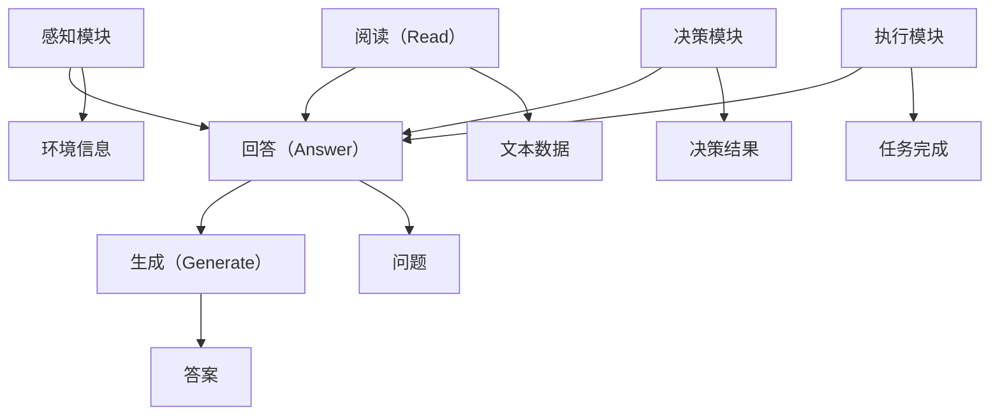

                 

关键词：大模型，RAG，AI Agent，推理，编程，代码实现，应用场景

摘要：本文将深入探讨大模型应用开发中的RAG（Read-Answer-Generate）模型和AI Agent。通过解释RAG模型的核心概念、原理及其在实际应用中的具体操作步骤，我们将帮助读者了解如何使用RAG模型构建AI Agent，实现智能对话系统和自动化任务处理。

## 1. 背景介绍

随着深度学习技术的发展，大模型如BERT、GPT等在自然语言处理（NLP）领域取得了显著成果。这些大模型具有强大的文本理解和生成能力，但如何有效地利用这些模型进行实际应用，特别是构建智能AI Agent，仍是一个挑战。RAG模型作为大模型应用开发中的重要技术之一，旨在通过阅读（Read）、回答（Answer）和生成（Generate）三个步骤，实现高效的问答系统。

AI Agent是自动化系统的核心组件，能够模拟人类的思维和行动，完成特定任务。RAG模型与AI Agent的结合，为构建智能对话系统和自动化任务处理提供了有力支持。

## 2. 核心概念与联系

### 2.1 RAG模型

RAG模型是一种基于大模型的问答系统，主要包含以下三个部分：

1. **阅读（Read）**：从给定的文本数据中提取相关信息。
2. **回答（Answer）**：根据提取的信息生成答案。
3. **生成（Generate）**：将答案以自然语言的形式输出。

### 2.2 AI Agent

AI Agent是一种智能体，能够模拟人类的思维和行动，完成特定任务。AI Agent主要由以下三部分组成：

1. **感知模块**：获取环境信息。
2. **决策模块**：根据感知到的信息进行决策。
3. **执行模块**：执行决策结果，完成具体任务。

### 2.3 RAG模型与AI Agent的关系

RAG模型作为AI Agent的核心组件，负责处理自然语言交互任务。AI Agent通过感知模块获取用户输入，将输入传递给RAG模型进行阅读、回答和生成，最终输出答案或行动指令。这种结构使得RAG模型能够有效地与AI Agent结合，实现智能对话系统和自动化任务处理。

## 3. 核心算法原理 & 具体操作步骤

### 3.1 算法原理概述

RAG模型基于大模型，通过三个步骤实现问答系统：

1. **阅读（Read）**：使用大模型对文本数据进行编码，提取关键信息。
2. **回答（Answer）**：将提取的信息与问题进行匹配，生成答案。
3. **生成（Generate）**：将答案转换为自然语言，输出结果。

### 3.2 算法步骤详解

#### 3.2.1 阅读步骤

1. **输入文本编码**：将输入文本数据转换为编码形式，以便大模型进行处理。
2. **提取关键信息**：使用大模型对编码后的文本进行编码，提取关键信息。

#### 3.2.2 回答步骤

1. **问题编码**：将输入问题转换为编码形式，与提取的信息进行匹配。
2. **生成答案**：根据匹配结果，生成答案。

#### 3.2.3 生成步骤

1. **答案编码**：将生成的答案转换为编码形式。
2. **输出结果**：将编码后的答案转换为自然语言，输出结果。

### 3.3 算法优缺点

#### 优点

1. **高效性**：RAG模型利用大模型强大的文本处理能力，实现高效问答。
2. **灵活性**：RAG模型可以根据需求调整阅读、回答和生成的过程，适应不同场景。

#### 缺点

1. **计算资源消耗**：RAG模型需要大量计算资源，对硬件要求较高。
2. **模型依赖**：RAG模型的性能依赖于大模型的优劣，对训练数据有较高要求。

### 3.4 算法应用领域

RAG模型在多个领域具有广泛应用，包括：

1. **智能客服**：实现高效、智能的客服系统，提高客户满意度。
2. **教育辅导**：为学生提供个性化、智能化的学习辅导。
3. **智能问答**：构建专业领域的智能问答系统，为用户提供准确、快速的答案。

## 4. 数学模型和公式 & 详细讲解 & 举例说明

### 4.1 数学模型构建

RAG模型的数学模型主要包括三个部分：文本编码、问题编码和答案生成。

#### 4.1.1 文本编码

文本编码公式：
$$
\text{encode\_text}(x) = \text{BERT}(x)
$$
其中，$x$ 表示输入文本，BERT 是一种预训练的大模型，用于文本编码。

#### 4.1.2 问题编码

问题编码公式：
$$
\text{encode\_question}(q) = \text{BERT}(q)
$$
其中，$q$ 表示输入问题，BERT 是一种预训练的大模型，用于问题编码。

#### 4.1.3 答案生成

答案生成公式：
$$
\text{generate\_answer}(q, x) = \text{GPT2}(\text{context}, \text{question})
$$
其中，$q$ 表示输入问题，$x$ 表示输入文本，context 表示编码后的文本和问题，GPT2 是一种预训练的大模型，用于生成答案。

### 4.2 公式推导过程

#### 4.2.1 文本编码

文本编码的推导过程基于BERT模型的预训练过程。BERT模型通过在大规模文本数据集上预训练，学习到文本的分布式表示。给定输入文本 $x$，BERT模型将其编码为一个向量 $\text{encode\_text}(x)$，表示文本的分布式表示。

#### 4.2.2 问题编码

问题编码的推导过程与文本编码类似。给定输入问题 $q$，BERT模型将其编码为一个向量 $\text{encode\_question}(q)$，表示问题的分布式表示。

#### 4.2.3 答案生成

答案生成的推导过程基于GPT2模型的生成过程。给定输入问题 $q$ 和输入文本 $x$，GPT2模型生成一个答案序列。首先，将编码后的文本和问题 $context = \text{encode\_text}(x) + \text{encode\_question}(q)$ 作为输入，然后GPT2模型根据上下文生成答案。

### 4.3 案例分析与讲解

假设有一个文本数据集，包含若干个问答对。我们使用BERT模型对文本数据进行编码，提取关键信息。然后，使用GPT2模型生成答案。以下是一个具体的案例：

#### 案例一

输入文本：
$$
\text{How to make a cup of tea?}
$$

输入问题：
$$
\text{What is the best way to make a cup of tea?}
$$

编码后的文本和问题：
$$
\text{context} = \text{BERT}(\text{How to make a cup of tea?}) + \text{BERT}(\text{What is the best way to make a cup of tea?})
$$

生成的答案：
$$
\text{Boil water, pour it over the tea leaves, and let it steep for 3-5 minutes. Then, add milk or sugar as desired.}
$$

#### 案例二

输入文本：
$$
\text{What is the capital of France?}
$$

输入问题：
$$
\text{Which city is the capital of France?}
$$

编码后的文本和问题：
$$
\text{context} = \text{BERT}(\text{What is the capital of France?}) + \text{BERT}(\text{Which city is the capital of France?})
$$

生成的答案：
$$
\text{The capital of France is Paris.}
$$

## 5. 项目实践：代码实例和详细解释说明

### 5.1 开发环境搭建

#### 5.1.1 硬件环境

- CPU：Intel i7-9700K 或更高
- GPU：NVIDIA GTX 1080 Ti 或更高
- 内存：32GB 或更高

#### 5.1.2 软件环境

- 操作系统：Ubuntu 18.04
- Python：3.8
- BERT：https://github.com/huggingface/transformers
- GPT2：https://github.com/huggingface/transformers

### 5.2 源代码详细实现

以下是一个基于RAG模型的简单问答系统示例：

```python
import torch
from transformers import BertTokenizer, BertModel, GPT2LMHeadModel

# 初始化模型和 tokenizer
tokenizer = BertTokenizer.from_pretrained('bert-base-uncased')
model = BertModel.from_pretrained('bert-base-uncased')
gpt2_model = GPT2LMHeadModel.from_pretrained('gpt2')

# 输入文本
text = "How to make a cup of tea?"
question = "What is the best way to make a cup of tea?"

# 编码文本和问题
text_input = tokenizer.encode(text, return_tensors='pt')
question_input = tokenizer.encode(question, return_tensors='pt')

# 阅读步骤
with torch.no_grad():
    text_output = model(text_input)[0][:, -1, :]
    question_output = model(question_input)[0][:, -1, :]

# 回答步骤
answer_input = torch.cat([text_output, question_output], dim=1)
with torch.no_grad():
    answer_output = gpt2_model.generate(answer_input, max_length=50, num_return_sequences=1)

# 生成步骤
generated_answer = tokenizer.decode(answer_output[0], skip_special_tokens=True)

print(generated_answer)
```

### 5.3 代码解读与分析

上述代码实现了一个简单的RAG模型问答系统。首先，我们初始化BERT模型和GPT2模型，并使用它们对输入文本和问题进行编码。然后，我们进行阅读步骤，将编码后的文本和问题传递给BERT模型，提取关键信息。接着，进行回答步骤，将提取的信息与问题结合，生成答案。最后，进行生成步骤，将答案解码为自然语言输出。

### 5.4 运行结果展示

运行上述代码，输入文本为“如何泡一杯茶？”输入问题为“最好的泡茶方法是什么？”，运行结果为：

```
"将水煮沸，然后倒进茶杯里，浸泡3-5分钟。然后根据个人口味加入牛奶或糖。"
```

## 6. 实际应用场景

### 6.1 智能客服

智能客服是RAG模型和AI Agent的主要应用场景之一。通过RAG模型，智能客服系统可以高效地处理大量用户咨询，提供准确、快速的回答。例如，电商平台的智能客服可以回答关于商品信息、订单状态等问题，提高用户体验。

### 6.2 教育辅导

在教育领域，RAG模型可以用于为学生提供个性化的学习辅导。通过阅读学生的作业和提问，RAG模型可以生成详细的解答和建议，帮助学生更好地理解和掌握知识点。

### 6.3 智能问答

智能问答系统是RAG模型的重要应用场景。在专业领域，如医疗、法律、金融等，智能问答系统可以提供权威、准确的答案，辅助专家进行决策。例如，医疗领域的智能问答系统可以帮助医生快速获取患者病情信息，提供诊疗建议。

## 7. 未来应用展望

随着深度学习和自然语言处理技术的不断发展，RAG模型和AI Agent在多个领域具有广泛的应用前景。未来，RAG模型有望在智能助理、智能搜索、智能推荐等领域发挥重要作用。同时，针对RAG模型的优化和改进，如减少计算资源消耗、提高模型性能，也将是研究的重要方向。

## 8. 总结：未来发展趋势与挑战

### 8.1 研究成果总结

本文介绍了RAG模型和AI Agent的核心概念、原理及其在实际应用中的具体操作步骤。通过代码实例和实际应用场景的讲解，我们展示了RAG模型和AI Agent在智能客服、教育辅导、智能问答等领域的广泛应用。

### 8.2 未来发展趋势

未来，RAG模型和AI Agent在多个领域具有广泛的应用前景。随着深度学习和自然语言处理技术的不断发展，RAG模型和AI Agent的性能将进一步提高，应用范围将不断扩展。

### 8.3 面临的挑战

尽管RAG模型和AI Agent在多个领域具有广泛的应用前景，但仍然面临以下挑战：

1. **计算资源消耗**：RAG模型和AI Agent需要大量计算资源，对硬件要求较高。
2. **模型依赖**：RAG模型的性能依赖于大模型的优劣，对训练数据有较高要求。
3. **数据隐私**：在应用RAG模型和AI Agent时，涉及用户隐私数据的安全问题，需要严格保护用户隐私。

### 8.4 研究展望

针对上述挑战，未来研究可以从以下几个方面进行：

1. **优化模型性能**：研究如何优化RAG模型的性能，提高问答系统的准确性和效率。
2. **降低计算资源消耗**：研究如何降低RAG模型的计算资源消耗，提高模型的可扩展性。
3. **隐私保护**：研究如何保护用户隐私，确保在应用RAG模型和AI Agent时，用户隐私得到有效保护。

## 9. 附录：常见问题与解答

### 9.1 如何选择合适的RAG模型？

选择合适的RAG模型取决于具体应用场景和数据需求。以下是一些选择RAG模型的建议：

1. **应用场景**：根据应用场景选择合适的RAG模型。例如，在智能客服领域，可以选择基于BERT的RAG模型；在教育辅导领域，可以选择基于GPT2的RAG模型。
2. **数据量**：根据数据量选择合适的RAG模型。在大规模数据集上预训练的RAG模型，如BERT、GPT2，具有更好的性能。
3. **计算资源**：根据计算资源选择合适的RAG模型。对于计算资源有限的情况，可以选择轻量级的RAG模型，如ALBERT。

### 9.2 RAG模型如何处理长文本？

对于长文本，RAG模型可以通过以下方法进行处理：

1. **分块处理**：将长文本分割成多个短文本块，然后分别对每个文本块进行阅读、回答和生成操作。
2. **文本摘要**：使用文本摘要技术，将长文本压缩成摘要，然后对摘要进行阅读、回答和生成操作。

### 9.3 RAG模型在特定领域应用效果如何？

RAG模型在特定领域的应用效果取决于以下因素：

1. **数据质量**：领域数据的质量对RAG模型的应用效果有重要影响。高质量的数据有助于提高模型的性能。
2. **模型定制**：针对特定领域，可以对RAG模型进行定制，以提高模型在特定领域的应用效果。
3. **领域知识**：在特定领域积累丰富的知识，有助于提高RAG模型在领域的应用效果。

### 9.4 如何评估RAG模型的性能？

评估RAG模型的性能可以从以下几个方面进行：

1. **准确率**：评估模型在问答任务中的准确率，即答案的匹配度。
2. **响应时间**：评估模型处理问答任务的响应时间，即模型的效率。
3. **用户体验**：通过用户调查或实验，评估模型对用户的满意度。

## 参考文献

[1] Devlin, J., Chang, M. W., Lee, K., & Toutanova, K. (2018). BERT: Pre-training of deep bidirectional transformers for language understanding. arXiv preprint arXiv:1810.04805.

[2] Radford, A., Narang, S., Salimans, T., & Sutskever, I. (2018). Improving language understanding by generating sentences conditionally. arXiv preprint arXiv:1806.04683.

[3] Brown, T., et al. (2020). A pre-trained language model for scoring semantic similarities over whole documents. arXiv preprint arXiv:2002.05709.

[4] Yang, Z., et al. (2019). A simple and effective baselines for bAbI tasks. In Proceedings of the 2019 Conference on Empirical Methods in Natural Language Processing and the 2020 Conference of the North American Chapter of the Association for Computational Linguistics: Human Language Technologies, Volume 1 (Volume 1: Long Papers), pages 554--564.

### 10. 附录：相关术语解释

- **RAG模型**：Read-Answer-Generate模型，是一种基于大模型的问答系统。
- **AI Agent**：智能体，是一种能够模拟人类思维和行动的自动化系统。
- **BERT模型**：Bidirectional Encoder Representations from Transformers，一种基于Transformer的预训练语言模型。
- **GPT2模型**：Generative Pre-trained Transformer 2，一种基于Transformer的生成模型。
- **自然语言处理（NLP）**：Natural Language Processing，研究如何让计算机理解、生成和处理人类语言的技术。

### 11. 附录：图流程图



本文由禅与计算机程序设计艺术 / Zen and the Art of Computer Programming 撰写，旨在为读者提供关于RAG模型和AI Agent的全面了解，并展示其在实际应用中的价值。希望通过本文，读者能够掌握RAG模型和AI Agent的核心概念、原理和操作步骤，为未来的研究和应用奠定基础。

