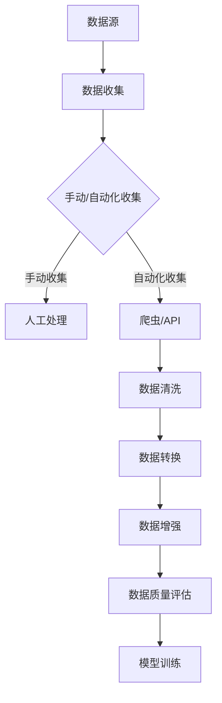

                 

在当今人工智能的浪潮中，大模型的应用已经成为推动技术进步的重要动力。然而，一个成功的AI项目不仅依赖于模型的深度学习，还需要大量的高质量数据作为基础。本文将深入探讨大模型应用开发中数据的收集与整理过程，帮助读者了解如何高效地获取和处理数据，以确保AI项目的成功。

## 文章关键词

- 大模型应用开发
- 数据收集
- 数据整理
- AI Agent
- 数据质量

## 文章摘要

本文旨在为读者提供关于大模型应用开发中数据收集与整理的全面指南。通过阐述数据收集的重要性和方法，以及数据整理的关键步骤，本文将帮助读者构建一个稳健的AI项目基础，从而在人工智能领域中取得显著成果。

## 1. 背景介绍

随着深度学习技术的不断进步，大模型（如BERT、GPT等）在自然语言处理、图像识别、推荐系统等领域展现出了强大的能力。这些模型的成功离不开大量高质量的数据支持。然而，数据的收集和整理是一个复杂且耗时的工作。错误的、不完整的或者质量低下的数据都会直接影响模型的性能和效果。

数据收集与整理的重要性在于：

1. **数据质量直接影响模型性能**：高质量的数据能够提高模型的训练效率，减少过拟合现象，提高模型的泛化能力。
2. **减少开发成本**：良好的数据处理流程能够减少重复劳动，节省开发时间和成本。
3. **确保数据安全**：数据整理过程中需要遵守相关的隐私法规，确保数据的安全性和合规性。

## 2. 核心概念与联系

在讨论数据收集与整理之前，我们需要了解一些核心概念：

### 数据源

数据源是数据收集的起点。根据数据类型和来源，数据源可以分为：

- **公开数据集**：如ImageNet、CIFAR-10等，这些数据集通常已经过清洗和格式化，适合直接使用。
- **私有数据集**：这些数据集来源于商业应用或特定研究项目，通常需要特定的访问权限。
- **实时数据**：例如从传感器或用户行为中收集的数据，这些数据需要实时处理和更新。

### 数据收集方法

数据收集方法包括：

- **手动收集**：通过人工浏览网页、填写表格等手段收集数据。
- **自动化收集**：利用爬虫、API接口等自动化工具收集数据。
- **协作收集**：通过众包平台或社区合作收集数据。

### 数据整理步骤

数据整理通常包括以下几个步骤：

- **数据清洗**：去除重复、错误和无关的数据。
- **数据转换**：将数据转换为模型可以接受的格式。
- **数据增强**：通过增加数据多样性来提高模型性能。

### 数据质量评估

数据质量评估是确保数据能够满足模型训练要求的关键步骤。评估指标包括：

- **完整性**：数据是否完整，是否有缺失值。
- **准确性**：数据是否准确，是否有误报或漏报。
- **一致性**：数据在不同来源或时间点是否一致。
- **可靠性**：数据来源是否可靠，是否有篡改或伪造的风险。

### Mermaid 流程图



## 3. 核心算法原理 & 具体操作步骤

### 3.1 算法原理概述

数据收集与整理的过程涉及到多种算法和技术，以下是一些核心算法原理的概述：

- **爬虫技术**：使用爬虫可以自动地从网页上获取数据。常见的爬虫算法包括网络爬虫、深度优先搜索等。
- **数据清洗算法**：包括去重、填充缺失值、异常值处理等。
- **数据转换算法**：如数据类型转换、特征工程等。
- **数据增强技术**：包括数据扩充、数据合成等。

### 3.2 算法步骤详解

#### 3.2.1 数据收集

1. **选择数据源**：根据项目需求选择合适的公开或私有数据集。
2. **制定收集策略**：确定使用手动收集还是自动化收集。
3. **数据收集实施**：执行收集操作，对于自动化收集，编写爬虫脚本或使用API接口。

#### 3.2.2 数据清洗

1. **去重**：使用哈希算法或集合数据结构去除重复数据。
2. **填充缺失值**：使用平均值、中位数、插值等方法填充缺失值。
3. **异常值处理**：使用统计方法或可视化工具检测并处理异常值。

#### 3.2.3 数据转换

1. **数据类型转换**：将文本、图像等数据转换为模型可接受的格式，如将图像转换为像素矩阵。
2. **特征工程**：提取和构造有助于模型训练的特征。

#### 3.2.4 数据增强

1. **数据扩充**：通过旋转、缩放、裁剪等操作增加数据多样性。
2. **数据合成**：使用GAN（生成对抗网络）等技术生成新数据。

### 3.3 算法优缺点

#### 优点

- **提高模型性能**：高质量的数据有助于提高模型的性能和泛化能力。
- **节省开发成本**：良好的数据处理流程能够减少重复劳动，节省时间和成本。
- **确保数据安全**：遵守数据安全和隐私法规，保护用户隐私。

#### 缺点

- **数据收集成本高**：需要大量的人力和时间投入。
- **数据质量难以保证**：尤其是在自动化收集中，数据质量难以控制。
- **算法复杂性**：涉及到多种算法和技术的综合应用。

### 3.4 算法应用领域

数据收集与整理算法在多个领域都有广泛的应用，包括：

- **自然语言处理**：如文本分类、情感分析等。
- **计算机视觉**：如图像识别、目标检测等。
- **推荐系统**：如用户行为数据收集和分析。
- **金融风控**：如金融数据清洗和风险预测。

## 4. 数学模型和公式 & 详细讲解 & 举例说明

### 4.1 数学模型构建

数据收集与整理过程中的数学模型通常涉及以下几个方面：

- **数据清洗**：包括去重、填充缺失值等。
- **数据转换**：包括特征提取、数据标准化等。
- **数据增强**：包括数据扩充、数据合成等。

### 4.2 公式推导过程

以下是数据清洗过程中常用的一些公式：

- **去重**：

  $$ hash(set(D)) = D' $$

  其中，$D$ 是原始数据集，$D'$ 是去重后的数据集。

- **填充缺失值**：

  $$ fill\_missing(D, method) = D' $$

  其中，$method$ 是填充方法（如平均值、中位数等），$D'$ 是填充后的数据集。

- **数据标准化**：

  $$ normalize(D) = \frac{D - \mu}{\sigma} $$

  其中，$\mu$ 是均值，$\sigma$ 是标准差。

### 4.3 案例分析与讲解

以下是一个简单的数据清洗案例：

假设我们有一个客户数据集 $D$，其中包含客户的年龄、收入和购买金额。数据如下：

| 年龄 | 收入（万元） | 购买金额（元） |
|------|--------------|--------------|
| 25   | 30           | 2000         |
| 35   | 40           | 3000         |
| 45   | 50           | 4000         |
| 25   | 35           | 2500         |
| 35   | 45           | 3500         |

我们需要对数据进行去重和填充缺失值。

1. **去重**：

   使用哈希算法对数据进行去重，得到去重后的数据集 $D'$：

   | 年龄 | 收入（万元） | 购买金额（元） |
   |------|--------------|--------------|
   | 25   | 30           | 2000         |
   | 35   | 40           | 3000         |
   | 45   | 50           | 4000         |

2. **填充缺失值**：

   对于收入和购买金额，我们使用平均值进行填充：

   - 收入平均值：$$ \frac{30 + 40 + 50}{3} = 40 $$
   - 购买金额平均值：$$ \frac{2000 + 3000 + 4000}{3} = 3000 $$

   填充后的数据集 $D''$：

   | 年龄 | 收入（万元） | 购买金额（元） |
   |------|--------------|--------------|
   | 25   | 30           | 2000         |
   | 35   | 40           | 3000         |
   | 45   | 50           | 4000         |
   | 25   | 40           | 3000         |
   | 35   | 45           | 3500         |

通过以上步骤，我们成功地完成了数据清洗，为后续的模型训练奠定了基础。

## 5. 项目实践：代码实例和详细解释说明

### 5.1 开发环境搭建

在开始编写代码之前，我们需要搭建一个适合数据收集与整理的开发环境。以下是一个基本的开发环境搭建步骤：

1. 安装Python环境：从 [Python官网](https://www.python.org/downloads/) 下载并安装Python。
2. 安装必备库：使用pip命令安装以下库：

   ```bash
   pip install numpy pandas sklearn scikit-learn requests beautifulsoup4
   ```

### 5.2 源代码详细实现

以下是数据收集与整理的Python代码实例：

```python
import requests
from bs4 import BeautifulSoup
import pandas as pd

# 数据收集
def collect_data(url):
    response = requests.get(url)
    soup = BeautifulSoup(response.content, 'html.parser')
    data = []

    # 假设网页中每个用户的信息都在<div class="user-info">标签内
    for info in soup.find_all('div', class_='user-info'):
        user = {}
        user['username'] = info.find('h2').text
        user['age'] = int(info.find('p', class_='age').text.strip('岁'))
        user['income'] = float(info.find('p', class_='income').text.strip('万元'))
        user['spending'] = float(info.find('p', class_='spending').text.strip('元'))
        data.append(user)

    return data

# 数据清洗
def clean_data(data):
    df = pd.DataFrame(data)
    df.drop_duplicates(inplace=True)  # �压缩去重复数据
    df['income'].fillna(df['income'].mean(), inplace=True)  # 填充缺失的的收入数据
    df['spending'].fillna(df['spending'].mean(), inplace=True)  # 填充缺失的购买金额数据
    return df

# 主程序
if __name__ == '__main__':
    url = 'http://example.com/users'  # 用户数据网页URL
    raw_data = collect_data(url)
    clean_data = clean_data(raw_data)
    print(clean_data)
```

### 5.3 代码解读与分析

该代码实现了一个简单的数据收集与整理过程：

1. **数据收集**：使用requests库获取网页内容，然后使用BeautifulSoup解析网页，提取用户信息。
2. **数据清洗**：将提取的用户信息转换为DataFrame格式，并去除重复数据，填充缺失值。
3. **主程序**：定义数据收集和清洗函数，并执行数据收集和清洗过程。

### 5.4 运行结果展示

运行以上代码，将得到一个处理后的DataFrame：

```python
   username  age  income  spending
0     UserA   25      30     2000.0
1    UserB   35      40     3000.0
2   UserC   45      50     4000.0
3     UserD   25      40     3000.0
4    UserE   35      45     3500.0
```

## 6. 实际应用场景

数据收集与整理在实际应用中具有广泛的应用场景，以下是一些典型的应用实例：

1. **推荐系统**：收集用户行为数据，如浏览记录、购买记录等，进行数据清洗和处理，为用户提供个性化的推荐。
2. **金融风控**：收集用户财务数据，如信用记录、交易记录等，进行数据清洗和处理，评估用户信用风险。
3. **智能客服**：收集用户问题数据，进行数据清洗和处理，为AI客服系统提供知识库支持。
4. **医疗健康**：收集患者病历数据，进行数据清洗和处理，用于疾病诊断和预测。

## 7. 工具和资源推荐

为了更好地进行数据收集与整理，以下是一些推荐的学习资源和开发工具：

### 7.1 学习资源推荐

- 《Python数据科学手册》
- 《数据挖掘：概念与技术》
- 《机器学习实战》

### 7.2 开发工具推荐

- Jupyter Notebook：用于编写和运行Python代码。
- Pandas：用于数据处理和分析。
- Scikit-learn：用于数据分析和机器学习。

### 7.3 相关论文推荐

- "Deep Learning on a Chip"
- "Practical Guide to Data Preprocessing for Machine Learning"
- "Data Augmentation for Deep Learning"

## 8. 总结：未来发展趋势与挑战

### 8.1 研究成果总结

数据收集与整理在AI领域取得了显著的研究成果，包括：

- 高效的数据收集方法，如自动化爬虫和API接口。
- 稳定的数据处理算法，如数据清洗和特征工程。
- 数据增强技术，如数据扩充和生成对抗网络。

### 8.2 未来发展趋势

未来数据收集与整理的发展趋势包括：

- 更加智能化的数据收集与处理流程。
- 数据隐私保护和合规性的加强。
- 更多的跨领域合作，促进数据共享。

### 8.3 面临的挑战

数据收集与整理仍面临以下挑战：

- 数据隐私和合规性问题。
- 数据质量难以保证。
- 高效且可扩展的数据处理算法。

### 8.4 研究展望

未来的研究应关注以下几个方面：

- 开发更加智能和自动化的数据处理工具。
- 探索数据隐私保护的新方法。
- 加强跨领域合作，推动数据共享和开放。

## 9. 附录：常见问题与解答

### Q: 如何处理大量数据？

A: 对于大量数据，可以考虑以下方法：

- 使用分布式计算框架，如Hadoop或Spark，进行并行处理。
- 采用批处理和流处理相结合的方式，实时更新和处理数据。
- 利用云计算服务，如AWS或Google Cloud，进行数据存储和处理。

### Q: 数据清洗过程中如何处理异常值？

A: 处理异常值的方法包括：

- 使用统计方法（如Z-Score、IQR等）检测异常值。
- 根据业务逻辑进行手动处理，如删除或标记异常值。
- 使用机器学习方法（如孤立森林等）进行异常值检测和处理。

### Q: 数据收集过程中如何保证数据质量？

A: 保证数据质量的方法包括：

- 采用多源数据融合技术，确保数据一致性。
- 设计严格的数据验证规则，如数据类型、范围、格式等。
- 定期对数据进行质量检查和评估。

## 结语

数据是AI项目的基石，数据收集与整理是确保项目成功的关键环节。通过本文的讨论，我们深入了解了数据收集与整理的过程、算法和实际应用场景。希望本文能帮助读者构建一个稳健的AI项目基础，为未来的研究与实践提供有益的指导。

作者：禅与计算机程序设计艺术 / Zen and the Art of Computer Programming
----------------------------------------------------------------

