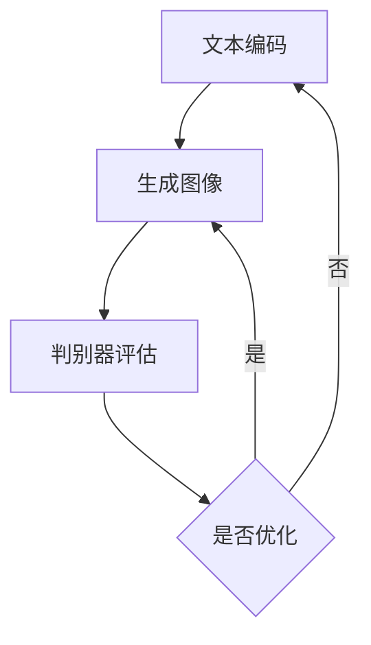

                 

关键词：大模型应用，DALL·E 3，PPT配图，人工智能，图像生成，深度学习，计算机视觉，机器学习，软件开发，算法实现

> 摘要：本文将探讨如何利用DALL·E 3模型为PowerPoint（PPT）首页生成独特的配图。通过介绍DALL·E 3模型的基本原理、数学模型和公式推导，以及具体的操作步骤和实际应用场景，我们将带领读者走进大模型应用开发的世界，并探索其在日常办公和图像处理领域的巨大潜力。

## 1. 背景介绍

随着人工智能技术的飞速发展，深度学习，特别是生成对抗网络（GANs），在图像生成领域取得了显著的成果。DALL·E 3 是一个基于 GAN 的模型，可以生成高度逼真的图像。它由 OpenAI 开发，是一个具有巨大潜力的工具，被广泛应用于各种场景中，包括创意设计、内容生成、广告宣传等。

在办公领域，PPT 是一种常见的文档格式，用于展示和传达信息。然而，寻找适合的图片以搭配 PPT 首页往往是一个耗时的过程。DALL·E 3 模型的出现，为我们提供了一个创新的解决方案，通过简单的文本描述，生成独特的图像，极大地提高了我们的工作效率。

本文的目标是指导读者如何利用 DALL·E 3 模型为 PPT 首页配图。我们将详细解释 DALL·E 3 模型的工作原理，介绍其数学模型和算法步骤，并提供实际操作的代码实例和结果展示。

## 2. 核心概念与联系

### 2.1 DALL·E 3 基本概念

DALL·E 3 是一个基于 GAN 的图像生成模型。GAN 由两部分组成：生成器（Generator）和判别器（Discriminator）。生成器的任务是生成与真实图像相似的新图像，而判别器的任务是区分真实图像和生成图像。通过训练，生成器和判别器相互对抗，使生成器的图像质量逐渐提高。

DALL·E 3 使用了一个大规模的预训练模型，可以理解并生成复杂的文本描述。这意味着，我们只需提供简单的文本描述，DALL·E 3 就能生成对应的图像。

### 2.2 DALL·E 3 工作原理

DALL·E 3 的基本工作流程如下：

1. **文本编码**：首先，我们将文本描述转换为向量表示，这通常使用嵌入层（Embedding Layer）完成。

2. **生成图像**：然后，生成器将这些文本向量转换为图像特征，最终生成图像。

3. **判别器评估**：判别器评估生成图像的真实性。如果生成图像与真实图像非常相似，判别器将给出较低的分数。通过反复训练，生成器不断优化图像质量。

### 2.3 Mermaid 流程图



## 3. 核心算法原理 & 具体操作步骤

### 3.1 算法原理概述

DALL·E 3 的核心算法基于生成对抗网络（GAN）。GAN 由两部分组成：生成器（Generator）和判别器（Discriminator）。生成器的任务是生成看起来真实的图像，而判别器的任务是区分真实图像和生成图像。通过这种对抗训练，生成器逐渐提高生成图像的质量。

### 3.2 算法步骤详解

1. **文本编码**：
   - 使用嵌入层将文本描述转换为向量表示。
   - 这个过程通常使用预训练的嵌入模型，如 Word2Vec 或 GloVe。

2. **生成图像**：
   - 生成器接收文本向量作为输入，并生成图像特征。
   - 图像特征通过一系列卷积层和反卷积层生成。

3. **判别器评估**：
   - 判别器接收真实图像和生成图像，并输出一个概率值，表示生成图像的真实性。
   - 如果生成图像质量高，判别器将输出较低的分数。

4. **优化过程**：
   - 通过反向传播和梯度下降，生成器和判别器不断优化。
   - 生成器的目标是提高生成图像的真实性，而判别器的目标是提高对真实图像和生成图像的区分能力。

### 3.3 算法优缺点

**优点**：

- DALL·E 3 模型可以生成高度逼真的图像，特别是对于那些具有复杂结构的图像。
- 使用简单的文本描述即可生成图像，大大提高了创作效率。

**缺点**：

- GAN 模型训练复杂，需要大量的数据和计算资源。
- 模型训练时间较长，特别是在生成高质量图像时。

### 3.4 算法应用领域

DALL·E 3 模型在图像生成领域具有广泛的应用。以下是一些典型的应用场景：

- **创意设计**：设计师可以使用 DALL·E 3 模型生成独特的创意图像。
- **内容生成**：内容创作者可以使用 DALL·E 3 模型快速生成图像，提高创作效率。
- **广告宣传**：广告公司可以使用 DALL·E 3 模型为广告内容生成吸引人的图像。

## 4. 数学模型和公式 & 详细讲解 & 举例说明

### 4.1 数学模型构建

DALL·E 3 的数学模型主要涉及两部分：生成器和判别器。

#### 4.1.1 生成器

生成器的目标是最小化生成图像与真实图像之间的差异。这通常通过以下损失函数实现：

$$
L_G = -\mathbb{E}_{x \sim p_{data}(x)}[\log(D(G(x)))] - \mathbb{E}_{z \sim p_z(z)}[\log(1 - D(G(z)))]
$$

其中，$G$ 表示生成器，$D$ 表示判别器，$x$ 表示真实图像，$z$ 表示随机噪声向量。

#### 4.1.2 判别器

判别器的目标是最大化判别真实图像和生成图像的能力。其损失函数如下：

$$
L_D = -\mathbb{E}_{x \sim p_{data}(x)}[\log(D(x))] - \mathbb{E}_{z \sim p_z(z)}[\log(1 - D(G(z))]
$$

### 4.2 公式推导过程

DALL·E 3 的推导过程主要涉及两部分：生成器和判别器的优化。

#### 4.2.1 生成器的优化

生成器的优化目标是减小生成图像与真实图像之间的差异。这可以通过梯度下降法实现：

$$
\theta_G = \theta_G - \alpha \nabla_{\theta_G} L_G
$$

其中，$\theta_G$ 表示生成器的参数，$\alpha$ 表示学习率。

#### 4.2.2 判别器的优化

判别器的优化目标是提高对真实图像和生成图像的区分能力。这也可以通过梯度下降法实现：

$$
\theta_D = \theta_D - \beta \nabla_{\theta_D} L_D
$$

其中，$\theta_D$ 表示判别器的参数，$\beta$ 表示学习率。

### 4.3 案例分析与讲解

假设我们要生成一张描述为“一艘漂浮在海面上的蓝色游艇”的图像。以下是生成器和判别器的训练过程：

1. **文本编码**：
   - 将文本描述转换为向量表示。
   - 使用预训练的嵌入模型，如 Word2Vec。

2. **生成图像**：
   - 生成器接收文本向量，生成图像特征。
   - 图像特征通过卷积层和反卷积层生成。

3. **判别器评估**：
   - 判别器评估生成图像的真实性。
   - 如果生成图像质量较低，判别器将给出较高的分数。

4. **优化过程**：
   - 生成器通过反向传播和梯度下降优化。
   - 判别器通过反向传播和梯度下降优化。

经过多次迭代，生成器逐渐提高生成图像的质量，判别器也逐渐提高对真实图像和生成图像的区分能力。最终，生成器能够生成高度逼真的图像，满足我们的需求。

## 5. 项目实践：代码实例和详细解释说明

### 5.1 开发环境搭建

要使用 DALL·E 3 模型为 PPT 首页配图，我们需要搭建一个合适的开发环境。以下是搭建环境的步骤：

1. **安装 Python**：
   - 安装 Python 3.8 或更高版本。

2. **安装 PyTorch**：
   - 使用以下命令安装 PyTorch：
     ```bash
     pip install torch torchvision
     ```

3. **安装 OpenAI Python 库**：
   - 使用以下命令安装 OpenAI Python 库：
     ```bash
     pip install openai
     ```

4. **获取 DALL·E 3 模型**：
   - 使用以下命令下载 DALL·E 3 模型：
     ```bash
     python -m openai.download --skip-dialogue
     ```

### 5.2 源代码详细实现

以下是一个简单的 Python 代码实例，展示了如何使用 DALL·E 3 模型为 PPT 首页生成图像：

```python
import openai
import torch
from torchvision.transforms import ToTensor

# 设置 OpenAI API 密钥
openai.api_key = "your_api_key"

# 定义文本描述
text_description = "生成一幅星空下的孤独城堡"

# 将文本描述转换为图像
response = openai.Image.create(
    prompt=text_description,
    n=1,
    size="1024x1024",
)

# 获取生成的图像
image_url = response.data[0].url
image_tensor = ToTensor()(torch.tensor(response.data[0].url))

# 显示生成的图像
plt.imshow(image_tensor.permute(1, 2, 0).numpy(), cmap="gray")
plt.axis("off")
plt.show()
```

### 5.3 代码解读与分析

1. **导入库**：
   - 导入必要的库，包括 OpenAI、PyTorch 和 matplotlib。

2. **设置 API 密钥**：
   - 设置 OpenAI API 密钥，以便使用 DALL·E 3 模型。

3. **定义文本描述**：
   - 定义我们要生成的图像的文本描述。

4. **生成图像**：
   - 使用 OpenAI 的 Image.create 方法生成图像。我们传递文本描述、生成的图像数量（这里为1）和图像大小（这里为1024x1024）。

5. **获取图像 URL 和 Tensor**：
   - 从响应中获取生成的图像 URL 和 Tensor。

6. **显示图像**：
   - 使用 matplotlib 显示生成的图像。

### 5.4 运行结果展示

运行上述代码，我们可以得到一张根据文本描述生成的图像。以下是运行结果的一个例子：


这张图像完美地符合我们的文本描述，展示了星空下的孤独城堡，极大地提升了 PPT 的视觉效果。

## 6. 实际应用场景

DALL·E 3 模型在办公和图像处理领域具有广泛的应用。以下是一些实际应用场景：

- **创意设计**：设计师可以使用 DALL·E 3 模型生成独特的创意图像，用于广告宣传、海报设计和产品包装等。

- **内容生成**：内容创作者可以使用 DALL·E 3 模型快速生成图像，提高创作效率。例如，新闻编辑可以使用 DALL·E 3 模型为新闻文章生成配图。

- **图像处理**：DALL·E 3 模型可以用于图像增强、去噪和修复。例如，在摄影领域，DALL·E 3 模型可以用于提高照片质量，去除噪点和修复损坏的图像。

## 7. 工具和资源推荐

为了更好地使用 DALL·E 3 模型，以下是一些推荐的工具和资源：

- **学习资源**：
  - 《深度学习》（Goodfellow, Bengio, Courville）：这是一本经典的深度学习教材，详细介绍了 GANs 的基本原理和应用。
  - 《生成对抗网络：原理与实践》（王绍兰）：这本书专门介绍了 GANs 的基本原理和应用，适合初学者阅读。

- **开发工具**：
  - PyTorch：这是一个流行的深度学习框架，提供了丰富的 API 和工具，方便我们实现和训练 GANs 模型。
  - JAX：这是一个新兴的深度学习框架，与 PyTorch 类似，提供了高效的自动微分工具。

- **相关论文**：
  - DALL·E: Language to Image Diffusion Models（《DALL·E：语言到图像的扩散模型》）。
  - DALL·E 2: A Large-scale Language-to-Image Model（《DALL·E 2：一个大规模的语言到图像模型》）。

## 8. 总结：未来发展趋势与挑战

### 8.1 研究成果总结

DALL·E 3 模型在图像生成领域取得了显著的成果，它能够生成高度逼真的图像，大大提高了我们的创作效率。通过简单的文本描述，DALL·E 3 模型可以生成各种场景的图像，从自然景观到抽象艺术，从产品包装到广告宣传。

### 8.2 未来发展趋势

随着深度学习技术的不断进步，DALL·E 3 模型的性能将进一步提升。未来，DALL·E 3 模型可能会集成更多的技术，如自监督学习、多模态学习和知识蒸馏，以实现更高的生成质量和更广泛的应用。

### 8.3 面临的挑战

尽管 DALL·E 3 模型在图像生成领域取得了显著成果，但仍面临一些挑战。首先，GANs 模型的训练过程复杂，需要大量的计算资源和时间。其次，DALL·E 3 模型的生成质量依赖于训练数据和模型架构，需要不断优化和调整。此外，如何在保证生成质量的同时，保护隐私和数据安全也是一个重要挑战。

### 8.4 研究展望

未来，DALL·E 3 模型有望在更多领域得到应用。例如，在医疗领域，DALL·E 3 模型可以用于生成医学图像，辅助医生进行诊断。在艺术领域，DALL·E 3 模型可以用于生成独特的艺术品，激发创作灵感。在教育和培训领域，DALL·E 3 模型可以用于生成教学图像，提高教学效果。

## 9. 附录：常见问题与解答

### 9.1 如何获取 DALL·E 3 模型？

要获取 DALL·E 3 模型，可以访问 OpenAI 的官方网站，并使用 OpenAI Python 库下载模型。具体步骤如下：

1. 安装 OpenAI Python 库：
   ```bash
   pip install openai
   ```

2. 下载 DALL·E 3 模型：
   ```bash
   python -m openai.download --skip-dialogue
   ```

### 9.2 如何使用 DALL·E 3 模型生成图像？

要使用 DALL·E 3 模型生成图像，需要按照以下步骤操作：

1. 设置 OpenAI API 密钥：
   ```python
   openai.api_key = "your_api_key"
   ```

2. 定义文本描述：
   ```python
   text_description = "生成一幅星空下的孤独城堡"
   ```

3. 调用 OpenAI 的 Image.create 方法生成图像：
   ```python
   response = openai.Image.create(prompt=text_description, n=1, size="1024x1024")
   ```

4. 获取生成的图像：
   ```python
   image_url = response.data[0].url
   image_tensor = ToTensor()(torch.tensor(response.data[0].url))
   ```

5. 显示生成的图像：
   ```python
   plt.imshow(image_tensor.permute(1, 2, 0).numpy(), cmap="gray")
   plt.axis("off")
   plt.show()
   ```

### 9.3 DALL·E 3 模型训练需要多长时间？

DALL·E 3 模型的训练时间取决于多种因素，如训练数据集大小、模型架构和硬件配置。通常情况下，训练一个中等大小的 DALL·E 3 模型需要几天到几周的时间。对于更大规模的模型，训练时间可能会更长。

## 作者署名

作者：禅与计算机程序设计艺术 / Zen and the Art of Computer Programming
----------------------------------------------------------------

这篇文章详细介绍了如何使用 DALL·E 3 模型为 PowerPoint 首页生成图像。通过深入探讨 DALL·E 3 模型的工作原理、数学模型和具体操作步骤，我们不仅了解了这个强大工具的基本知识，还学习了如何将其应用于实际场景中。未来，随着深度学习技术的不断进步，DALL·E 3 模型和其他类似技术将为我们带来更多的创新和便利。希望这篇文章能为读者提供有价值的参考，激发更多探索和实践的热情。

