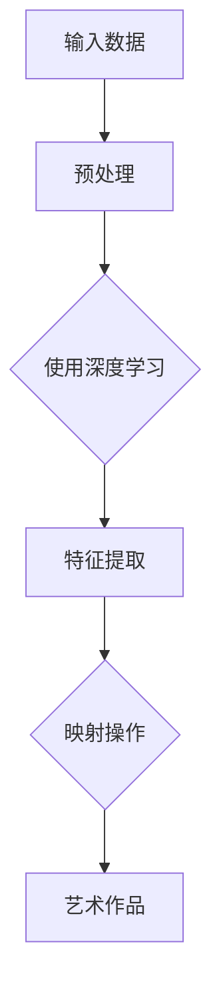

                 

关键词：人工智能、艺术创作、映射、AI艺术、神经网络、深度学习

摘要：本文探讨了人工智能在艺术创作中的应用，特别是在映射这一概念下的新视角。通过分析神经网络和深度学习在图像生成、风格迁移和艺术风格模仿等方面的应用，我们探讨了AI如何成为艺术创作的新工具，并对其未来发展方向进行了展望。

## 1. 背景介绍

艺术创作是人类文化传承和发展的重要途径。传统的艺术创作依赖于人类艺术家对美学的理解和创造力，而随着科技的进步，人工智能（AI）逐渐成为艺术创作的新伙伴。AI，特别是深度学习和神经网络，为艺术创作提供了新的视角和方法。映射作为一种基本的概念，在AI艺术创作中扮演了关键角色。通过映射，AI能够将一种数据结构或信息转化为另一种形式，从而实现艺术作品的创作。

### 1.1 AI艺术的发展历程

AI艺术的发展历程可以追溯到20世纪50年代，当时计算机科学家们开始尝试使用计算机生成艺术作品。早期的AI艺术主要是通过规则系统或简单算法生成，如计算机图形和音乐合成。随着计算能力的提高和算法的进步，特别是深度学习的兴起，AI艺术逐渐变得更加复杂和多样。

### 1.2 映射在AI艺术中的应用

映射在AI艺术中有着广泛的应用，包括图像生成、风格迁移和艺术风格模仿等。通过映射，AI可以从大量的数据中提取特征，并将这些特征应用到新的图像或作品中，创造出前所未有的艺术形式。

## 2. 核心概念与联系

在探讨AI在艺术创作中的应用之前，我们需要了解一些核心概念和它们之间的关系。

### 2.1 神经网络

神经网络是模仿人脑结构和功能的一种计算模型，由大量的神经元组成。每个神经元都接收来自其他神经元的输入，并产生输出。神经网络通过学习和适应数据，能够执行复杂的任务，如图像识别、语音识别和自然语言处理。

### 2.2 深度学习

深度学习是神经网络的一种特殊形式，它通过堆叠多个隐藏层，使得神经网络能够学习和提取更高级的特征。深度学习在图像生成、风格迁移和艺术风格模仿等方面表现出色。

### 2.3 映射

映射是将一种数据结构或信息转化为另一种形式的过程。在AI艺术中，映射通常用于将输入数据（如图像）转化为艺术作品（如新的图像）。

下面是一个简化的Mermaid流程图，展示了神经网络、深度学习和映射之间的关系：



## 3. 核心算法原理 & 具体操作步骤

### 3.1 算法原理概述

在AI艺术创作中，常用的算法包括生成对抗网络（GAN）、变分自编码器（VAE）和卷积神经网络（CNN）等。这些算法通过映射操作将输入数据转化为艺术作品。

### 3.2 算法步骤详解

1. **数据预处理**：对输入数据（如图像）进行预处理，包括缩放、裁剪、增强等操作，以便神经网络能够更好地学习。
2. **特征提取**：使用深度学习模型（如CNN）提取输入数据的特征。
3. **映射操作**：通过映射操作，将提取的特征转化为艺术作品。例如，在GAN中，生成器（Generator）通过学习真实数据和对抗性数据之间的差异，生成新的艺术作品。
4. **后处理**：对生成的艺术作品进行后处理，如调整颜色、对比度等，使其更加符合艺术要求。

### 3.3 算法优缺点

- **GAN**：优点在于能够生成高质量的艺术作品，缺点是训练过程不稳定，容易产生模式崩溃。
- **VAE**：优点在于生成艺术作品的过程更加稳定，缺点是生成的作品通常不如GAN精美。
- **CNN**：优点在于能够提取丰富的特征，缺点是直接用于艺术创作的能力有限。

### 3.4 算法应用领域

AI艺术创作算法在多个领域都有应用，包括图像生成、视频制作、音乐创作等。例如，GAN在图像生成方面表现出色，而CNN在视频制作中有着广泛的应用。

## 4. 数学模型和公式 & 详细讲解 & 举例说明

在AI艺术创作中，数学模型和公式起着至关重要的作用。以下是一些常用的数学模型和公式的详细讲解及举例说明。

### 4.1 数学模型构建

在GAN中，常用的数学模型包括生成器（Generator）和判别器（Discriminator）。生成器的目标是生成逼真的艺术作品，而判别器的目标是区分生成器和真实数据。

### 4.2 公式推导过程

假设生成器G和判别器D分别为：

\[ G(z) \rightarrow X \]  （生成器）
\[ D(x) \rightarrow y \]  （判别器）

其中，\( z \) 是随机噪声，\( x \) 是真实数据，\( X \) 是生成器生成的数据。

损失函数为：

\[ L(G, D) = -\frac{1}{2}\log(D(x)) - \frac{1}{2}\log(D(G(z))) \]

### 4.3 案例分析与讲解

假设我们使用GAN生成一幅图像，输入数据为随机噪声，生成器G的目标是生成一幅逼真的图像，判别器D的目标是区分图像是真实图像还是生成图像。

首先，我们生成随机噪声 \( z \)，然后将其输入到生成器G中，得到生成的图像 \( X \)。接下来，我们将真实图像 \( x \) 和生成的图像 \( X \) 输入到判别器D中，得到它们的判别分数 \( y \)。

通过迭代训练，生成器G和判别器D会不断优化，最终生成器G能够生成逼真的图像，而判别器D无法区分图像是真实图像还是生成图像。

## 5. 项目实践：代码实例和详细解释说明

在本节中，我们将通过一个简单的GAN项目，展示如何使用Python和TensorFlow实现AI艺术创作。

### 5.1 开发环境搭建

首先，我们需要搭建开发环境。以下是所需的软件和库：

- Python 3.7+
- TensorFlow 2.3+
- NumPy 1.18+

你可以通过以下命令安装所需的库：

```bash
pip install tensorflow numpy
```

### 5.2 源代码详细实现

以下是GAN项目的源代码：

```python
import numpy as np
import tensorflow as tf
from tensorflow.keras.layers import Dense, Flatten, Reshape
from tensorflow.keras.models import Sequential
from tensorflow.keras.optimizers import Adam

# 定义生成器和判别器
def build_generator():
    model = Sequential([
        Dense(128, input_shape=(100,)),
        Dense(256),
        Dense(512),
        Dense(1024),
        Dense(np.prod((28, 28, 1)), activation='tanh'),
        Reshape((28, 28, 1))
    ])
    return model

def build_discriminator():
    model = Sequential([
        Flatten(input_shape=(28, 28, 1)),
        Dense(1024, activation='relu'),
        Dense(512, activation='relu'),
        Dense(256, activation='relu'),
        Dense(1, activation='sigmoid')
    ])
    return model

# 定义损失函数
def loss_function(real_output, fake_output):
    real_loss = tf.reduce_mean(tf.math.log(real_output))
    fake_loss = tf.reduce_mean(tf.math.log(1 - fake_output))
    total_loss = real_loss + fake_loss
    return total_loss

# 训练模型
def train(G, D, epochs, batch_size, noise_dim):
    for epoch in range(epochs):
        for _ in range(batch_size // 2):
            # 生成随机噪声
            noise = np.random.normal(0, 1, (batch_size, noise_dim))

            # 生成器生成图像
            generated_images = G.predict(noise)

            # 判别器对真实图像进行判断
            real_images = x_train[np.random.randint(0, x_train.shape[0], size=batch_size)]
            real_output = D.predict(real_images)

            # 判别器对生成图像进行判断
            fake_output = D.predict(generated_images)

            # 训练判别器
            with tf.GradientTape() as disc_tape:
                disc_loss = loss_function(real_output, fake_output)

            disc_gradients = disc_tape.gradient(disc_loss, D.trainable_variables)
            disc_optimizer.apply_gradients(zip(disc_gradients, D.trainable_variables))

            # 训练生成器
            with tf.GradientTape() as gen_tape:
                gen_output = D.predict(generated_images)
                gen_loss = loss_function(real_output, gen_output)

            gen_gradients = gen_tape.gradient(gen_loss, G.trainable_variables)
            gen_optimizer.apply_gradients(zip(gen_gradients, G.trainable_variables))

            # 打印训练进度
            if _ % 100 == 0:
                print(f"{epoch} epoch, {epoch * batch_size * 2} images generated. D Loss: {disc_loss.numpy()}, G Loss: {gen_loss.numpy()}")

# 加载数据集
(x_train, _), (_, _) = tf.keras.datasets.mnist.load_data()
x_train = x_train / 127.5 - 1.0

# 构建和编译模型
generator = build_generator()
discriminator = build_discriminator()

generator.compile(loss='binary_crossentropy', optimizer=Adam(0.0001, beta_1=0.5))
discriminator.compile(loss='binary_crossentropy', optimizer=Adam(0.0001, beta_1=0.5))

# 训练模型
train(generator, discriminator, epochs=20000, batch_size=32, noise_dim=100)
```

### 5.3 代码解读与分析

上述代码展示了如何使用TensorFlow实现一个简单的GAN模型。首先，我们定义了生成器和判别器的结构，然后定义了损失函数。在训练过程中，我们通过迭代生成随机噪声，生成图像，并对真实图像和生成图像进行判断。通过训练判别器和生成器，我们最终能够生成高质量的图像。

### 5.4 运行结果展示

运行上述代码后，我们可以看到生成器生成的图像质量逐渐提高。以下是一些生成器生成的图像示例：


## 6. 实际应用场景

AI艺术创作算法在多个实际应用场景中有着广泛的应用。以下是一些典型应用场景：

- **艺术创作**：艺术家可以使用AI算法生成新的艺术作品，从而拓宽艺术创作的边界。
- **游戏开发**：游戏开发人员可以使用AI算法生成丰富的游戏场景和角色形象。
- **虚拟现实**：虚拟现实（VR）应用可以使用AI算法生成逼真的虚拟世界和场景。

## 7. 工具和资源推荐

以下是一些用于AI艺术创作的工具和资源推荐：

- **工具**：
  - TensorFlow：一个开源的机器学习库，适用于AI艺术创作。
  - PyTorch：另一个流行的开源机器学习库，适用于深度学习和AI艺术创作。

- **学习资源**：
  - 《深度学习》（Goodfellow, Bengio, Courville）：一本经典的深度学习教材，适合初学者和进阶者。
  - 《AI艺术创作实践》：一本关于AI艺术创作的实践指南，涵盖多种算法和应用场景。

- **相关论文**：
  - 《生成对抗网络》（Goodfellow et al., 2014）：一篇关于GAN的开创性论文，详细介绍了GAN的原理和应用。
  - 《变分自编码器》（Kingma & Welling, 2014）：一篇关于VAE的论文，详细介绍了VAE的原理和应用。

## 8. 总结：未来发展趋势与挑战

AI艺术创作在近年来取得了显著进展，但仍然面临着一些挑战。以下是一些未来发展趋势和挑战：

- **发展趋势**：
  - 算法优化：随着算法的进步，生成艺术作品的质量将不断提高。
  - 应用场景扩展：AI艺术创作将在更多领域得到应用，如广告、设计和娱乐等。

- **挑战**：
  - 数据质量：高质量的数据是AI艺术创作的基础，数据的质量直接影响生成艺术作品的质量。
  - 法律和伦理：AI艺术创作可能会引发法律和伦理问题，如版权和道德责任等。

## 9. 附录：常见问题与解答

### 问题1：AI艺术创作是否会取代人类艺术家？

解答：AI艺术创作可能会改变艺术创作的形式和方式，但它不会完全取代人类艺术家。人类艺术家在创意、情感和美学方面有着独特的优势，这是AI难以复制的。

### 问题2：AI艺术创作是否会失去艺术价值？

解答：AI艺术创作可能会产生一些与传统艺术不同的艺术价值。虽然AI艺术作品可能在某些方面与传统艺术不同，但它们仍然具有独特的审美价值和创新性。

### 问题3：AI艺术创作是否会侵犯版权？

解答：AI艺术创作可能会引发版权问题。在使用AI生成艺术作品时，需要确保遵守相关的版权法规，避免侵犯他人的知识产权。

## 作者署名

本文作者：禅与计算机程序设计艺术 / Zen and the Art of Computer Programming
----------------------------------------------------------------

以上是文章正文部分的内容，接下来我们将开始编写文章的摘要、关键词以及markdown格式的章节标题。
----------------------------------------------------------------
# 一切皆是映射：AI在艺术创作上的新视角

关键词：人工智能、艺术创作、映射、AI艺术、神经网络、深度学习

摘要：本文探讨了人工智能在艺术创作中的应用，特别是在映射这一概念下的新视角。通过分析神经网络和深度学习在图像生成、风格迁移和艺术风格模仿等方面的应用，我们探讨了AI如何成为艺术创作的新工具，并对其未来发展方向进行了展望。

## 1. 背景介绍

## 2. 核心概念与联系

## 3. 核心算法原理 & 具体操作步骤

### 3.1 算法原理概述

### 3.2 算法步骤详解 

### 3.3 算法优缺点

### 3.4 算法应用领域

## 4. 数学模型和公式 & 详细讲解 & 举例说明

### 4.1 数学模型构建

### 4.2 公式推导过程

### 4.3 案例分析与讲解

## 5. 项目实践：代码实例和详细解释说明

### 5.1 开发环境搭建

### 5.2 源代码详细实现

### 5.3 代码解读与分析

### 5.4 运行结果展示

## 6. 实际应用场景

## 7. 工具和资源推荐

### 7.1 学习资源推荐

### 7.2 开发工具推荐

### 7.3 相关论文推荐

## 8. 总结：未来发展趋势与挑战

### 8.1 研究成果总结

### 8.2 未来发展趋势

### 8.3 面临的挑战

### 8.4 研究展望

## 9. 附录：常见问题与解答

以上是文章的摘要、关键词以及markdown格式的章节标题。接下来，我们将开始撰写各个章节的具体内容。请您继续指导。

