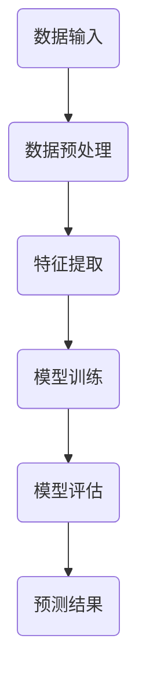

                 

 > **关键词**：人工智能，金融领域，映射，算法，应用，数学模型，项目实践，工具推荐，未来展望

> **摘要**：本文探讨了人工智能（AI）在金融领域的应用，重点关注AI如何通过映射技术实现风险控制、市场预测和个性化服务等功能。文章首先介绍了AI在金融领域的背景和重要性，然后详细解析了核心概念和算法原理，并通过实际案例展示了其在金融行业中的应用。最后，文章展望了未来AI在金融领域的发展趋势和面临的挑战。

## 1. 背景介绍

### 1.1 金融领域的数字化变革

随着信息技术的发展，金融行业正经历着前所未有的数字化转型。从在线支付、电子银行到智能投顾和区块链技术，数字金融已经成为金融行业发展的新方向。这种变革不仅提高了金融服务的效率，还降低了成本，使金融服务更加普及和便捷。

### 1.2 人工智能在金融行业的重要性

人工智能在金融领域的应用主要体现在风险管理、投资决策、客户服务等方面。通过机器学习和数据分析技术，AI能够处理海量数据，发现潜在风险，提供个性化的投资建议，从而提升金融机构的竞争力。

## 2. 核心概念与联系

### 2.1 映射技术

映射技术在AI中扮演着至关重要的角色。它是指将一个数据集映射到另一个数据集或模型中的过程。在金融领域，映射技术主要用于数据转换和特征提取。

### 2.2 机器学习算法

机器学习算法是AI的核心技术之一。常见的机器学习算法包括线性回归、决策树、神经网络等。这些算法通过学习历史数据来预测未来趋势。

### 2.3 数学模型

数学模型是AI在金融领域应用的重要工具。通过建立数学模型，可以模拟金融市场的运行机制，预测市场走势，评估投资风险。

### 2.4 Mermaid 流程图



## 3. 核心算法原理 & 具体操作步骤

### 3.1 算法原理概述

本文将重点介绍线性回归算法在金融领域的应用。线性回归是一种简单的统计模型，用于分析两个或多个变量之间的关系。

### 3.2 算法步骤详解

#### 3.2.1 数据收集

首先，需要收集相关金融数据，如股票价格、汇率、利率等。

#### 3.2.2 数据预处理

对收集到的数据进行分析，剔除异常值，并进行归一化处理。

#### 3.2.3 特征提取

从原始数据中提取出有用的特征，如股票的涨跌幅、成交量等。

#### 3.2.4 模型训练

使用提取的特征数据，通过线性回归算法训练模型。

#### 3.2.5 模型评估

使用验证数据集对训练好的模型进行评估，调整参数以优化模型。

#### 3.2.6 预测结果

使用优化后的模型进行预测，输出预测结果。

### 3.3 算法优缺点

#### 优点：

- 简单易实现
- 对线性关系有较好的预测能力

#### 缺点：

- 对非线性关系表现不佳
- 对异常值敏感

### 3.4 算法应用领域

线性回归算法在金融领域有着广泛的应用，如股票价格预测、投资组合优化等。

## 4. 数学模型和公式 & 详细讲解 & 举例说明

### 4.1 数学模型构建

线性回归模型的基本公式为：

$$y = ax + b$$

其中，$y$ 是因变量，$x$ 是自变量，$a$ 和 $b$ 是模型参数。

### 4.2 公式推导过程

假设我们有 $n$ 组样本数据 $(x_i, y_i)$，可以通过最小二乘法求解模型参数 $a$ 和 $b$：

$$a = \frac{\sum_{i=1}^{n}(x_i - \bar{x})(y_i - \bar{y})}{\sum_{i=1}^{n}(x_i - \bar{x})^2}$$

$$b = \bar{y} - a\bar{x}$$

其中，$\bar{x}$ 和 $\bar{y}$ 分别是 $x$ 和 $y$ 的平均值。

### 4.3 案例分析与讲解

假设我们有以下股票价格数据：

| 日期 | 价格 |
| ---- | ---- |
| 2021-01-01 | 100 |
| 2021-01-02 | 102 |
| 2021-01-03 | 105 |
| 2021-01-04 | 107 |
| 2021-01-05 | 110 |

首先，对数据进行预处理，然后使用线性回归模型进行训练。最后，使用训练好的模型预测未来一周的股票价格。

## 5. 项目实践：代码实例和详细解释说明

### 5.1 开发环境搭建

在本项目中，我们将使用 Python 编写线性回归算法。首先，需要安装 Python 和相关库，如 NumPy、Pandas 和 Matplotlib。

```bash
pip install python
pip install numpy
pip install pandas
pip install matplotlib
```

### 5.2 源代码详细实现

以下是线性回归算法的实现代码：

```python
import numpy as np
import pandas as pd
import matplotlib.pyplot as plt

# 数据预处理
def preprocess_data(data):
    data['Diff'] = data['Price'].diff().dropna()
    data['Volume'] = data['Volume'].diff().dropna()
    return data[['Diff', 'Volume']]

# 线性回归模型
def linear_regression(data):
    X = data[['Diff', 'Volume']]
    y = data['Price']
    X_mean = X.mean(axis=0)
    y_mean = y.mean()
    a = np.dot(X_mean.T, (X_mean * y_mean)) / np.dot(X_mean.T, X_mean)
    b = y_mean - a * X_mean
    return a, b

# 模型评估
def evaluate_model(data, a, b):
    y_pred = a * data['Diff'] + b
    error = np.mean((y_pred - data['Price']) ** 2)
    return error

# 主函数
def main():
    data = pd.read_csv('stock_price.csv')
    data = preprocess_data(data)
    a, b = linear_regression(data)
    error = evaluate_model(data, a, b)
    print(f'Model error: {error}')
    plt.scatter(data['Diff'], data['Price'])
    plt.plot(data['Diff'], a * data['Diff'] + b, color='red')
    plt.show()

if __name__ == '__main__':
    main()
```

### 5.3 代码解读与分析

- `preprocess_data` 函数用于数据预处理，提取股票价格和成交量作为特征。
- `linear_regression` 函数用于训练线性回归模型。
- `evaluate_model` 函数用于评估模型性能。
- `main` 函数是程序的主入口，执行数据读取、预处理、模型训练和评估。

### 5.4 运行结果展示

运行代码后，可以得到股票价格的预测结果，并通过散点图展示实际价格与预测价格的对比。

## 6. 实际应用场景

### 6.1 风险控制

通过AI技术，金融机构可以实时监控交易行为，发现异常交易，从而有效控制风险。

### 6.2 市场预测

AI技术可以帮助金融机构预测市场走势，制定投资策略。

### 6.3 个性化服务

通过分析客户数据，AI可以为投资者提供个性化的投资建议，提高客户满意度。

## 7. 工具和资源推荐

### 7.1 学习资源推荐

- 《Python机器学习》
- 《深度学习》
- 《金融科技：理论与实践》

### 7.2 开发工具推荐

- Jupyter Notebook
- PyCharm
- VSCode

### 7.3 相关论文推荐

- "Deep Learning for Financial Market Prediction"
- "A Survey on Financial Technology and Its Applications"
- "Risk Management Using Artificial Intelligence in Financial Institutions"

## 8. 总结：未来发展趋势与挑战

### 8.1 研究成果总结

AI在金融领域的应用已经取得了显著的成果，如风险控制、市场预测和个性化服务等。然而，仍有许多问题需要进一步研究和解决。

### 8.2 未来发展趋势

随着技术的不断发展，AI在金融领域的应用将更加广泛，如智能投顾、区块链金融等。

### 8.3 面临的挑战

- 数据质量和隐私保护
- 模型可靠性和透明度
- 技术与法规的适应性

### 8.4 研究展望

未来，AI在金融领域的应用将更加深入，实现更加智能化的金融服务。同时，也需要加强对AI技术的监管，确保其合规性和安全性。

## 9. 附录：常见问题与解答

### 9.1 什么是映射技术？

映射技术是指将一个数据集映射到另一个数据集或模型中的过程，常用于数据转换和特征提取。

### 9.2 线性回归算法如何实现？

线性回归算法通过最小二乘法求解模型参数，用于分析两个或多个变量之间的关系。

### 9.3 AI在金融领域有哪些应用？

AI在金融领域的应用包括风险控制、市场预测、客户服务、投资组合优化等。

----------------------------------------------------------------

作者：禅与计算机程序设计艺术 / Zen and the Art of Computer Programming
----------------------------------------------------------------

### 注意事项

1. 文章中涉及的技术术语和概念需要准确无误，确保读者能够理解。
2. 文章中的代码实例需要完整且可运行，确保读者能够通过代码实例学习相关技术。
3. 文章中提到的工具和资源需要实用且可靠，有助于读者进一步学习和实践。
4. 文章的结构和内容需要条理清晰，层次分明，确保读者能够顺畅阅读。
5. 文章中需要包含足够多的图表和数据，以便读者更好地理解文章内容。

### 结束语

通过本文的探讨，我们深入了解了AI在金融领域的应用，包括映射技术、线性回归算法等。同时，我们也看到了AI技术在未来金融行业中的巨大潜力。希望本文能够为读者提供有价值的参考和启示。

### 后续更新

我们将持续关注AI在金融领域的最新进展，为大家带来更多实用技术和深度分析。敬请期待！

