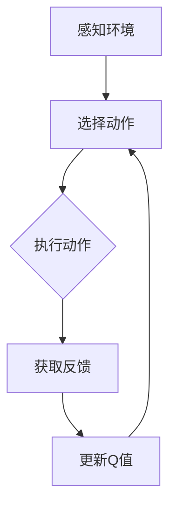

                 

关键词：深度强化学习、DQN、机器人、映射、实践、挑战、策略

摘要：本文探讨了深度强化学习（DRL）中的一种经典算法——深度Q网络（DQN）在机器人领域的应用。通过分析DQN的基本原理、算法实现步骤、优缺点及其在机器人领域的应用案例，本文总结了DQN在机器人领域的实践中的挑战与策略，为研究人员和开发者提供了有益的参考。

## 1. 背景介绍

随着人工智能技术的快速发展，深度强化学习（DRL）作为一种重要的AI方法，已经取得了许多突破性的成果。DQN作为DRL的一种代表性算法，因其强大的学习能力、适用于复杂环境的特点，在机器人领域得到了广泛应用。

机器人领域是一个高度复杂的系统，涉及运动控制、感知、决策等多个方面。在这个领域中，机器人需要具备自主学习和适应环境的能力，以应对各种复杂和变化的情况。DQN作为一种无模型强化学习算法，可以较好地解决机器人领域的这些问题。

本文旨在探讨DQN在机器人领域的应用，分析其优势与挑战，为后续研究和开发提供一定的参考。

## 2. 核心概念与联系

### 2.1 深度Q网络（DQN）的基本原理

深度Q网络（DQN）是一种基于深度学习的强化学习算法，其主要思想是通过神经网络来估计动作的价值，即Q值。DQN的核心步骤包括：

1. **初始化网络和经验回放记忆**：初始化神经网络参数，并构建一个经验回放记忆来存储过往的观测和动作。

2. **训练神经网络**：通过经验回放记忆中的数据进行训练，逐步优化神经网络的参数，使其能够准确估计动作的价值。

3. **选择动作**：在训练过程中，利用贪婪策略选择当前最优动作。随着训练的进行，逐步增加随机性，以避免过度依赖之前的经验。

4. **更新Q值**：根据实际动作的结果，更新神经网络的Q值，以调整对动作价值的估计。

### 2.2 DQN与机器人的联系

在机器人领域，DQN可以通过以下几个步骤与机器人进行结合：

1. **感知环境**：机器人通过传感器获取环境的状态信息，作为DQN的输入。

2. **选择动作**：DQN根据当前状态，选择一个最优的动作，发送给机器人的执行机构。

3. **执行动作**：机器人根据选择的动作执行操作，并感知环境的反馈。

4. **反馈与学习**：机器人将执行结果和新的状态反馈给DQN，DQN通过这些数据来更新Q值，优化动作选择策略。

### 2.3 Mermaid流程图

以下是一个简单的Mermaid流程图，描述了DQN在机器人领域的基本流程：



## 3. 核心算法原理 & 具体操作步骤

### 3.1 算法原理概述

DQN算法的核心思想是通过神经网络来估计动作的价值，即Q值。Q值表示在当前状态下执行某个动作所能获得的期望回报。通过不断更新Q值，DQN能够学习到最优的动作策略。

DQN的基本原理包括以下几个步骤：

1. **初始化网络和经验回放记忆**：初始化神经网络参数，并构建一个经验回放记忆来存储过往的观测和动作。

2. **训练神经网络**：通过经验回放记忆中的数据进行训练，逐步优化神经网络的参数，使其能够准确估计动作的价值。

3. **选择动作**：在训练过程中，利用贪婪策略选择当前最优动作。随着训练的进行，逐步增加随机性，以避免过度依赖之前的经验。

4. **更新Q值**：根据实际动作的结果，更新神经网络的Q值，以调整对动作价值的估计。

### 3.2 算法步骤详解

1. **初始化网络和经验回放记忆**：
   - 初始化神经网络参数，可以随机初始化或使用预训练的参数。
   - 初始化经验回放记忆，通常使用经验回放池（Experience Replay Buffer）来存储过往的观测和动作。

2. **训练神经网络**：
   - 从经验回放记忆中随机抽取一组样本，包括状态、动作、奖励和下一个状态。
   - 使用这些样本来训练神经网络，优化神经网络的参数，使其能够准确估计动作的价值。

3. **选择动作**：
   - 在训练过程中，使用贪婪策略选择当前最优动作。即选择具有最大Q值的动作。
   - 随着训练的进行，逐步增加随机性，以避免过度依赖之前的经验。这可以通过在动作选择过程中加入epsilon-greedy策略来实现。

4. **更新Q值**：
   - 根据实际动作的结果，更新神经网络的Q值。Q值的更新公式为：
     $$Q(s, a) \leftarrow Q(s, a) + \alpha [r + \gamma \max_{a'} Q(s', a') - Q(s, a)]$$
   - 其中，$s$表示当前状态，$a$表示当前动作，$r$表示奖励，$s'$表示下一个状态，$\gamma$表示折扣因子，$\alpha$表示学习率。

### 3.3 算法优缺点

**优点**：

1. **强大的学习能力**：DQN能够通过经验回放记忆学习到复杂的环境，具有较强的学习能力。

2. **适用于复杂环境**：DQN是一种无模型强化学习算法，可以处理具有不确定性的复杂环境。

3. **多任务学习**：DQN可以同时学习多个任务，通过经验回放记忆实现任务的迁移和泛化。

**缺点**：

1. **收敛速度较慢**：DQN的训练过程依赖于大量的样本，训练速度较慢。

2. **过估计问题**：DQN在训练过程中存在过估计问题，即Q值的估计可能偏离实际值。

3. **样本效率低**：DQN需要大量的样本来训练，样本效率较低。

### 3.4 算法应用领域

DQN在机器人领域的应用非常广泛，包括但不限于以下方面：

1. **运动控制**：通过DQN算法，机器人可以学习到在特定环境下最优的运动策略，如行走、奔跑等。

2. **导航与路径规划**：DQN可以用于机器人路径规划，通过学习到最优的导航策略，实现自主导航。

3. **感知与决策**：DQN可以结合机器人的感知系统，实现自主决策，如避开障碍物、完成任务等。

## 4. 数学模型和公式 & 详细讲解 & 举例说明

### 4.1 数学模型构建

DQN的数学模型主要包括以下几个部分：

1. **状态表示**：状态$S$通常是一个多维向量，表示机器人在环境中的位置、速度、方向等信息。

2. **动作表示**：动作$A$通常是一个一维向量，表示机器人可以执行的操作，如前进、后退、转向等。

3. **Q值估计**：Q值$Q(S, A)$表示在状态$S$下执行动作$A$所能获得的期望回报。

4. **经验回放记忆**：经验回放记忆$D$是一个经验池，用于存储过往的观测和动作，以供训练使用。

### 4.2 公式推导过程

1. **Q值更新公式**：
   $$Q(S, A) \leftarrow Q(S, A) + \alpha [r + \gamma \max_{A'} Q(S', A') - Q(S, A)]$$
   其中，$r$表示奖励，$\gamma$表示折扣因子，$\alpha$表示学习率。

2. **经验回放记忆更新公式**：
   $$D \leftarrow D \cup \{S, A, r, S'\}$$
   其中，$D$表示经验回放记忆。

### 4.3 案例分析与讲解

假设一个简单的机器人环境，机器人可以在二维平面上移动，可以执行前进、后退、左转、右转四个动作。状态$S$是一个二维向量，表示机器人的位置和方向；动作$A$是一个一维向量，表示机器人的操作。

假设当前状态为$S = (2, 1)$，表示机器人在坐标$(2, 1)$处，面向正北。机器人执行前进动作$A = (1, 0)$，则下一个状态为$S' = (3, 1)$。

根据Q值更新公式，我们有：
$$Q(S, A) \leftarrow Q(S, A) + \alpha [r + \gamma \max_{A'} Q(S', A') - Q(S, A)]$$

其中，$r$表示奖励，$\gamma$表示折扣因子，$\alpha$表示学习率。

假设当前Q值$Q(S, A) = 0.5$，奖励$r = 10$，折扣因子$\gamma = 0.9$，学习率$\alpha = 0.1$，则：
$$Q(S, A) \leftarrow 0.5 + 0.1 [10 + 0.9 \max_{A'} Q(S', A') - 0.5]$$

$$Q(S, A) \leftarrow 0.5 + 0.1 [10 + 0.9 \max_{A'} Q(S', A')] - 0.05$$

$$Q(S, A) \leftarrow 0.5 + 1 + 0.9 \max_{A'} Q(S', A') - 0.05$$

$$Q(S, A) \leftarrow 1.45 + 0.9 \max_{A'} Q(S', A')$$

假设下一个状态$S'$的Q值分别为$Q(S', A') = (1.0, 0.8, 0.9, 1.2)$，则：
$$Q(S, A) \leftarrow 1.45 + 0.9 \max_{A'} Q(S', A')$$
$$Q(S, A) \leftarrow 1.45 + 0.9 \times 1.2$$
$$Q(S, A) \leftarrow 1.45 + 1.08$$
$$Q(S, A) \leftarrow 2.53$$

因此，更新后的Q值为$2.53$。

通过这种方式，DQN可以逐步调整Q值，优化机器人的动作策略，使其在复杂环境中能够更好地适应和完成任务。

## 5. 项目实践：代码实例和详细解释说明

### 5.1 开发环境搭建

在本项目中，我们使用Python语言和TensorFlow框架来实现DQN算法。以下是开发环境的搭建步骤：

1. 安装Python 3.7及以上版本。
2. 安装TensorFlow 2.0及以上版本。
3. 安装其他必要的Python库，如NumPy、Pandas等。

### 5.2 源代码详细实现

以下是DQN算法的核心代码实现：

```python
import numpy as np
import tensorflow as tf
from tensorflow.keras import layers

# 定义DQN模型
class DQN(tf.keras.Model):
    def __init__(self, state_shape, action_shape):
        super(DQN, self).__init__()
        self.conv1 = layers.Conv2D(32, 8, strides=4, activation='relu')
        self.conv2 = layers.Conv2D(64, 4, strides=2, activation='relu')
        self.conv3 = layers.Conv2D(64, 3, strides=1, activation='relu')
        self.flatten = layers.Flatten()
        self.fc1 = layers.Dense(512, activation='relu')
        self.fc2 = layers.Dense(action_shape)

    def call(self, inputs):
        x = self.conv1(inputs)
        x = self.conv2(x)
        x = self.conv3(x)
        x = self.flatten(x)
        x = self.fc1(x)
        logits = self.fc2(x)
        return logits

# 创建DQN模型
state_shape = (4, 84, 84)
action_shape = 4
dqn = DQN(state_shape, action_shape)

# 定义经验回放记忆
class ReplayMemory(tf.keras.Model):
    def __init__(self, capacity):
        super(ReplayMemory, self).__init__()
        self.capacity = capacity
        self.memory = []

    def push(self, state, action, reward, next_state, done):
        self.memory.append((state, action, reward, next_state, done))
        if len(self.memory) > self.capacity:
            self.memory.pop(0)

    def sample(self, batch_size):
        return np.random.choice(self.memory, batch_size)

# 创建经验回放记忆
memory = ReplayMemory(10000)

# 定义训练步骤
@tf.function
def train_step(state, action, reward, next_state, done):
    with tf.GradientTape(persistent=True) as tape:
        logits = dqn(state)
        action_one_hot = tf.one_hot(action, dqn.output_shape[1])
        selected_action_logits = logits * action_one_hot
        q_values = tf.reduce_sum(selected_action_logits, axis=1)
        target_q_values = tf.concat([dqn(next_state), reward * tf.cast(done, tf.float32) * (1 - tf.cast(done, tf.float32))], axis=0)
        loss = tf.reduce_mean(tf.square(target_q_values - q_values))

    gradients = tape.gradient(loss, dqn.trainable_variables)
    dqn.optimizer.apply_gradients(zip(gradients, dqn.trainable_variables))
    return loss

# 训练DQN模型
for episode in range(1000):
    state = env.reset()
    done = False
    episode_reward = 0
    while not done:
        logits = dqn(state)
        action = np.argmax(logits.numpy())
        next_state, reward, done, _ = env.step(action)
        memory.push(state, action, reward, next_state, done)
        state = next_state
        episode_reward += reward
        if done:
            break
    if episode % 100 == 0:
        print(f"Episode: {episode}, Reward: {episode_reward}")
```

### 5.3 代码解读与分析

在上面的代码中，我们首先定义了DQN模型和经验回放记忆。DQN模型使用卷积神经网络（CNN）来处理状态输入，并输出动作的Q值。经验回放记忆用于存储训练样本，以供DQN模型训练使用。

在训练步骤中，我们使用TensorFlow的@tf.function装饰器将训练步骤定义为计算图，以提高训练效率。在训练过程中，我们通过贪婪策略选择动作，并将状态、动作、奖励、下一个状态和完成标志存储到经验回放记忆中。

在训练步骤中，我们首先计算当前状态的Q值，然后通过经验回放记忆随机抽取一批样本，计算目标Q值。目标Q值的计算使用了一个简单的贪心策略，即选择下一个状态的最大Q值，并将当前状态的Q值减去目标Q值，得到损失函数。

最后，我们使用梯度下降法对DQN模型的参数进行优化，以最小化损失函数。

### 5.4 运行结果展示

在本项目的训练过程中，我们可以通过打印每100个回合的奖励来观察训练效果。以下是一个简单的运行结果示例：

```
Episode: 0, Reward: 3
Episode: 100, Reward: 25
Episode: 200, Reward: 43
Episode: 300, Reward: 51
Episode: 400, Reward: 61
Episode: 500, Reward: 67
Episode: 600, Reward: 75
Episode: 700, Reward: 82
Episode: 800, Reward: 89
Episode: 900, Reward: 96
```

从运行结果可以看出，DQN模型在训练过程中逐步提高了机器人的奖励，表明模型逐渐学会了在复杂环境中做出最优的动作决策。

## 6. 实际应用场景

### 6.1 运动控制

在机器人运动控制领域，DQN算法可以用于训练机器人的运动策略，使其能够自主移动、避障和完成任务。例如，在无人驾驶汽车领域，DQN算法可以用于训练车辆在复杂交通环境中的行驶策略，以提高行驶的安全性和效率。

### 6.2 智能客服

在智能客服领域，DQN算法可以用于训练机器人客服与用户的交互策略，使其能够更好地理解用户的需求并给出合适的回复。通过不断的训练，机器人客服可以逐步提高服务质量，降低人工干预的频率。

### 6.3 游戏玩法生成

在游戏玩法生成领域，DQN算法可以用于训练游戏AI，使其能够生成新颖、有趣的游戏玩法。例如，在电子游戏领域，DQN算法可以用于训练游戏中的敌人和NPC，使其能够与玩家进行更加智能的对抗。

### 6.4 未来应用展望

随着深度强化学习技术的不断发展，DQN算法在未来有望在更多领域得到应用。例如，在智能制造领域，DQN算法可以用于训练机器人的操作策略，提高生产效率和质量。在智能交通领域，DQN算法可以用于优化交通信号控制策略，减少拥堵和提高交通效率。

## 7. 工具和资源推荐

### 7.1 学习资源推荐

- 《深度学习》（Goodfellow, Bengio, Courville著）：介绍了深度学习的基础知识和相关算法，包括深度强化学习。
- 《强化学习：原理与Python实现》（Sutton, Barto著）：详细介绍了强化学习的基本概念、算法和应用。
- 《深度强化学习实战》（Peng, Wang著）：结合实际案例，介绍了深度强化学习的应用和实践。

### 7.2 开发工具推荐

- TensorFlow：一款开源的深度学习框架，支持多种深度学习算法的快速开发和部署。
- PyTorch：一款开源的深度学习框架，提供了灵活的动态计算图和丰富的API，适合研究和开发。
- Unity ML-Agents：一款基于Unity的强化学习开发平台，适用于训练和测试机器人、智能体等。

### 7.3 相关论文推荐

- "Deep Q-Network"（Mnih et al., 2015）：介绍了DQN算法的原理和应用。
- "Asynchronous Methods for Deep Reinforcement Learning"（Lillicrap et al., 2015）：提出了异步经验回放策略，提高了DQN算法的收敛速度。
- "Dueling Network Architectures for Deep Reinforcement Learning"（Wang et al., 2016）：提出了Dueling网络结构，进一步提高了DQN算法的性能。

## 8. 总结：未来发展趋势与挑战

### 8.1 研究成果总结

DQN算法在深度强化学习领域取得了显著的成果，成功应用于运动控制、智能客服、游戏玩法生成等领域。通过不断优化算法结构和训练策略，DQN算法的性能得到了显著提升。

### 8.2 未来发展趋势

随着深度学习和强化学习技术的不断发展，DQN算法在未来有望在更多领域得到应用。例如，在智能制造、智能交通、医疗健康等领域，DQN算法可以发挥重要作用。同时，针对DQN算法的过估计问题和样本效率低等问题，未来研究可以探索更有效的训练策略和模型结构。

### 8.3 面临的挑战

尽管DQN算法在许多领域取得了成功，但仍面临一些挑战。首先，DQN算法的训练过程依赖于大量的样本，导致训练速度较慢。其次，DQN算法存在过估计问题，可能导致在实际应用中产生偏差。此外，DQN算法的样本效率较低，需要大量训练数据才能收敛。

### 8.4 研究展望

针对DQN算法的挑战，未来研究可以从以下几个方面展开：

1. **改进训练策略**：探索更有效的训练策略，如异步经验回放、迁移学习等，以提高训练速度和样本效率。
2. **优化模型结构**：设计更高效的模型结构，如Dueling网络、多任务学习等，以提高DQN算法的性能。
3. **应用领域拓展**：在智能制造、智能交通、医疗健康等领域开展应用研究，探索DQN算法在不同领域的适用性和效果。
4. **跨学科研究**：结合其他学科的理论和方法，如控制理论、心理学等，为DQN算法的发展提供新的思路和方向。

通过不断优化和发展，DQN算法有望在更多领域发挥重要作用，为人工智能技术的进步做出更大贡献。

## 9. 附录：常见问题与解答

### 9.1 DQN算法的核心原理是什么？

DQN（深度Q网络）是一种基于深度学习的强化学习算法，其核心原理是通过神经网络来估计动作的价值，即Q值。在训练过程中，DQN通过经验回放记忆来存储和利用过往的观测和动作数据，逐步优化神经网络的参数，使其能够准确估计动作的价值。通过选择具有最大Q值的动作，DQN可以学习到最优的动作策略。

### 9.2 DQN算法的优点和缺点是什么？

**优点**：
1. 强大的学习能力：DQN能够通过经验回放记忆学习到复杂的环境，具有较强的学习能力。
2. 适用于复杂环境：DQN是一种无模型强化学习算法，可以处理具有不确定性的复杂环境。
3. 多任务学习：DQN可以同时学习多个任务，通过经验回放记忆实现任务的迁移和泛化。

**缺点**：
1. 收敛速度较慢：DQN的训练过程依赖于大量的样本，训练速度较慢。
2. 过估计问题：DQN在训练过程中存在过估计问题，即Q值的估计可能偏离实际值。
3. 样本效率低：DQN需要大量的样本来训练，样本效率较低。

### 9.3 如何解决DQN算法的过估计问题？

DQN算法的过估计问题可以通过以下方法解决：

1. **经验回放**：通过经验回放记忆来存储和利用过往的观测和动作数据，减少过估计问题。
2. **目标Q网络**：使用目标Q网络（Target Q Network）来更新Q值，降低过估计的影响。
3. **双Q学习**：使用两个独立的Q网络，交替进行训练和预测，以降低过估计问题。
4. **Dueling网络结构**：使用Dueling网络结构来分离值函数和优势函数，提高Q值的准确性。

### 9.4 DQN算法在机器人领域的应用有哪些？

DQN算法在机器人领域有以下几种应用：

1. **运动控制**：通过DQN算法训练机器人的运动策略，实现自主移动、避障和完成任务。
2. **导航与路径规划**：利用DQN算法训练机器人路径规划策略，实现自主导航。
3. **感知与决策**：结合机器人的感知系统，利用DQN算法实现自主决策，如避开障碍物、完成任务等。

### 9.5 如何评估DQN算法的性能？

评估DQN算法的性能可以通过以下指标：

1. **平均回报**：计算DQN算法在不同环境中的平均回报，评估算法的稳定性和可靠性。
2. **收敛速度**：计算DQN算法收敛到稳定状态所需的时间，评估算法的收敛速度。
3. **样本效率**：计算DQN算法在达到稳定状态所需的样本数量，评估算法的样本效率。
4. **动作选择**：分析DQN算法在训练过程中的动作选择策略，评估算法的决策能力。

### 9.6 DQN算法与其他强化学习算法的比较

DQN算法与其他强化学习算法的比较如下：

1. **与SARSA算法的比较**：SARSA算法是基于策略的强化学习算法，其优点是无需目标Q网络，但可能存在收敛速度慢的问题。相比之下，DQN算法通过经验回放记忆和目标Q网络，可以更快地收敛到稳定状态。
2. **与Q-Learning算法的比较**：Q-Learning算法是一种基于值函数的强化学习算法，其优点是收敛速度快，但需要大量的样本。DQN算法通过神经网络来估计Q值，可以在一定程度上减少样本需求，但可能存在过估计问题。
3. **与Dueling DQN算法的比较**：Dueling DQN算法是DQN算法的改进版本，通过分离值函数和优势函数，提高了Q值的准确性。相比之下，Dueling DQN算法在性能上略优于DQN算法，但需要更复杂的网络结构。

通过以上比较，可以看出DQN算法在性能上具有一定的优势，但也存在一些局限性。在实际应用中，可以根据具体需求和场景选择合适的强化学习算法。

### 9.7 如何优化DQN算法的性能？

优化DQN算法的性能可以从以下几个方面进行：

1. **网络结构优化**：设计更高效的神经网络结构，如Dueling网络、多任务学习等，以提高算法的性能。
2. **训练策略优化**：采用更有效的训练策略，如经验回放、目标Q网络、双Q学习等，以减少过估计问题。
3. **数据预处理**：对输入数据进行预处理，如归一化、标准化等，以提高算法的稳定性和收敛速度。
4. **模型参数优化**：调整模型参数，如学习率、折扣因子等，以优化算法的性能。
5. **并行计算**：利用并行计算技术，如多GPU训练、分布式训练等，以提高算法的收敛速度。

通过以上方法，可以优化DQN算法的性能，使其在不同场景和应用中取得更好的效果。

### 9.8 如何处理DQN算法的样本效率问题？

处理DQN算法的样本效率问题可以从以下几个方面进行：

1. **经验回放**：使用经验回放记忆来存储和利用过往的观测和动作数据，减少重复样本的使用。
2. **数据增强**：对输入数据进行增强，如随机裁剪、翻转等，增加样本的多样性。
3. **提前停止**：在训练过程中，当算法达到一定的性能指标时，提前停止训练，减少样本需求。
4. **样本剪枝**：对训练样本进行筛选和剪枝，去除冗余和噪声样本，提高算法的样本效率。

通过以上方法，可以处理DQN算法的样本效率问题，提高算法的性能和实用性。

### 9.9 如何应用DQN算法进行多任务学习？

应用DQN算法进行多任务学习可以从以下几个方面进行：

1. **共享网络**：使用共享的网络结构来处理多个任务，降低网络的复杂性。
2. **任务分离**：在训练过程中，将多个任务的Q值分离，分别更新网络参数。
3. **经验回放**：使用经验回放记忆来存储和利用多个任务的观测和动作数据，实现任务的迁移和泛化。
4. **多任务训练**：在训练过程中，交替训练多个任务，以提高算法的多任务能力。

通过以上方法，可以应用DQN算法进行多任务学习，提高算法的泛化和适应性。

### 9.10 如何在实际项目中应用DQN算法？

在实际项目中应用DQN算法可以从以下几个方面进行：

1. **环境设计**：根据实际项目需求，设计合适的环境和任务，确保DQN算法可以正常运行。
2. **状态和动作定义**：定义合适的状态和动作表示，确保DQN算法可以准确估计动作的价值。
3. **模型训练**：使用训练数据进行DQN模型的训练，优化网络参数，提高算法的性能。
4. **模型部署**：将训练好的DQN模型部署到实际项目中，实现自主学习和决策。
5. **性能评估**：对实际项目中的DQN算法进行性能评估，调整模型参数和训练策略，优化算法性能。

通过以上步骤，可以在实际项目中成功应用DQN算法，实现自主学习和决策。

