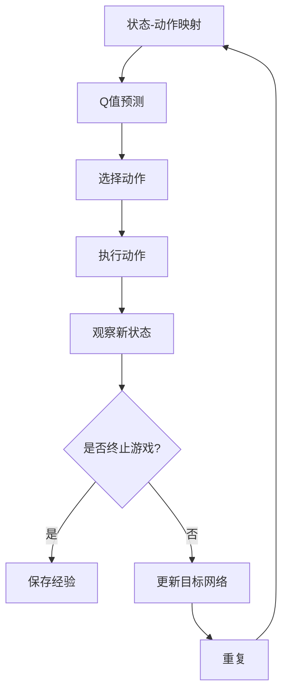

                 

关键词：深度强化学习，DQN，游戏AI，神经网络，Q值，状态-动作映射，探索-利用平衡，深度学习框架

> 摘要：本文将深入探讨深度强化学习中的深度确定性策略梯度（DQN）算法在游戏AI中的应用。通过一个具体的案例，我们将详细分析DQN的工作原理、实现步骤及其在游戏AI中的表现。此外，文章还将探讨DQN的数学模型、优缺点、未来应用展望，并推荐相关学习和开发资源。

## 1. 背景介绍

随着深度学习和强化学习在计算机科学领域的不断进步，AI在游戏领域的应用也日益广泛。深度确定性策略梯度（Deep Q-Network，简称DQN）是一种在深度强化学习中应用广泛的算法，通过深度神经网络来近似Q值函数，从而实现智能体的自主学习和决策。

DQN算法在许多游戏AI应用中表现出色，如《Atari游戏》、《Go游戏》等。本文将以一个经典的《Atari游戏》为例，分析DQN算法在游戏AI中的应用，并探讨其实现细节和效果。

### 1.1 深度强化学习简介

深度强化学习是强化学习与深度学习的结合，旨在通过深度神经网络来学习智能体的策略。强化学习是一种通过奖励信号来指导智能体决策的学习方法，而深度强化学习则是利用深度神经网络来近似Q值函数或策略，从而提高智能体的学习效率和决策能力。

### 1.2 DQN算法简介

DQN算法是一种基于经验回放和目标网络的深度强化学习算法。通过经验回放，DQN可以避免智能体在训练过程中陷入局部最优，从而提高学习效果。目标网络则用于稳定学习过程，减少梯度消失和梯度爆炸问题。

### 1.3 游戏AI的重要性

游戏AI是人工智能领域的一个重要分支，通过对游戏规则的深刻理解和策略优化，可以实现高度智能的游戏体验。随着游戏产业的发展，游戏AI的应用越来越广泛，如游戏引擎中的智能NPC、电子竞技中的智能助手等。

## 2. 核心概念与联系

### 2.1 核心概念

在DQN算法中，核心概念包括Q值函数、状态-动作映射、经验回放、目标网络等。

- Q值函数：Q值函数是一个表示状态-动作值的函数，用于评估智能体在某一状态下选择某一动作的期望回报。
- 状态-动作映射：状态-动作映射是将游戏的状态映射为神经网络输入的过程，用于指导智能体的决策。
- 经验回放：经验回放是一种避免智能体在训练过程中陷入局部最优的技术，通过随机采样历史经验来丰富智能体的训练样本。
- 目标网络：目标网络是一个用于稳定学习过程的辅助网络，其作用是减少梯度消失和梯度爆炸问题，提高学习效果。

### 2.2 原理和架构的 Mermaid 流程图



## 3. 核心算法原理 & 具体操作步骤

### 3.1 算法原理概述

DQN算法的核心思想是通过深度神经网络来近似Q值函数，从而实现智能体的自主学习和决策。在训练过程中，智能体通过观察环境状态，选择最优动作，执行动作，并获得奖励。同时，智能体会根据新的状态和旧的Q值预测来更新Q值函数。

### 3.2 算法步骤详解

1. 初始化参数：设置网络结构、学习率、折扣因子等参数。
2. 状态-动作映射：将游戏状态映射为神经网络输入，用于预测Q值。
3. 选择动作：根据Q值预测和ε-贪婪策略选择最优动作。
4. 执行动作：在游戏环境中执行选择的最优动作。
5. 观察新状态：在执行动作后，观察游戏环境的新状态。
6. 更新Q值：根据新的状态和旧的Q值预测来更新Q值函数。
7. 经验回放：将当前的状态、动作、奖励和新状态存储到经验池中，以避免智能体在训练过程中陷入局部最优。
8. 更新目标网络：定期更新目标网络，以减少梯度消失和梯度爆炸问题。

### 3.3 算法优缺点

**优点：**
- **高适应性**：DQN算法适用于各种游戏环境，具有很高的适应性。
- **无需环境模型**：DQN算法不需要环境模型，仅通过经验学习即可实现智能体的自主决策。
- **较好的性能**：DQN算法在许多游戏AI应用中表现出色，具有较高的性能。

**缺点：**
- **训练时间较长**：由于需要大量的经验来训练神经网络，DQN算法的训练时间相对较长。
- **收敛速度较慢**：DQN算法的收敛速度相对较慢，特别是在复杂的游戏环境中。

### 3.4 算法应用领域

DQN算法广泛应用于各种游戏AI应用中，如《Atari游戏》、《Go游戏》等。此外，DQN算法还被应用于其他领域，如自动驾驶、机器人控制等。

## 4. 数学模型和公式 & 详细讲解 & 举例说明

### 4.1 数学模型构建

DQN算法的核心是Q值函数，Q值函数是一个表示状态-动作值的函数，用于评估智能体在某一状态下选择某一动作的期望回报。在DQN算法中，Q值函数由一个深度神经网络来近似。

Q值函数的数学模型如下：

$$
Q(s, a) = \hat{Q}(s, a; \theta)
$$

其中，$s$表示当前状态，$a$表示当前动作，$\hat{Q}(s, a; \theta)$表示神经网络近似Q值函数，$\theta$表示神经网络参数。

### 4.2 公式推导过程

在DQN算法中，智能体的策略是通过Q值预测来选择的。具体来说，智能体在某一状态下选择最优动作，使得Q值最大化。因此，智能体的策略可以表示为：

$$
\pi(s) = \arg\max_a Q(s, a)
$$

在训练过程中，智能体会根据新的状态和旧的Q值预测来更新Q值函数。具体来说，更新公式如下：

$$
\Delta Q(s, a) = r + \gamma \max_{a'} Q(s', a'; \theta_{target}) - Q(s, a)
$$

其中，$r$表示立即奖励，$\gamma$表示折扣因子，$s'$表示新状态，$a'$表示在新状态下选择的最优动作。

### 4.3 案例分析与讲解

以《Atari游戏》为例，我们假设智能体需要在一个简单游戏中选择最优动作。具体来说，游戏环境是一个二维网格，每个网格都有相应的奖励或惩罚。智能体的目标是选择最优动作，以获得最大的总奖励。

首先，我们定义状态空间$S$和动作空间$A$：

$$
S = \{ (s_x, s_y) \mid s_x, s_y \in \{0, 1, ..., 99\} \}
$$

$$
A = \{ up, down, left, right \}
$$

然后，我们定义神经网络近似Q值函数$\hat{Q}(s, a; \theta)$，其中$\theta$表示神经网络参数。

接下来，我们进行训练。在训练过程中，智能体根据ε-贪婪策略选择动作。具体来说，在初始阶段，智能体以一定的概率随机选择动作。随着训练的进行，智能体的行为越来越接近最优策略。

在每次训练迭代中，智能体执行选择的最优动作，并获得立即奖励。然后，智能体根据新的状态和旧的Q值预测来更新Q值函数。通过大量的迭代，智能体逐渐学会选择最优动作，以获得最大的总奖励。

## 5. 项目实践：代码实例和详细解释说明

### 5.1 开发环境搭建

在进行DQN算法的实践之前，我们需要搭建一个合适的开发环境。以下是搭建开发环境的步骤：

1. 安装Python 3.7及以上版本。
2. 安装TensorFlow 2.3及以上版本。
3. 安装OpenAI Gym，用于提供游戏环境。

### 5.2 源代码详细实现

以下是一个简单的DQN算法实现，用于在一个简单游戏环境中选择最优动作。

```python
import gym
import numpy as np
import tensorflow as tf

# 设置超参数
learning_rate = 0.001
gamma = 0.99
epsilon = 1.0
epsilon_min = 0.01
epsilon_decay = 0.99
batch_size = 64

# 创建游戏环境
env = gym.make('CartPole-v0')

# 初始化Q值神经网络
input_shape = env.observation_space.shape
action_shape = env.action_space.n

def build_q_network(input_shape, action_shape):
    inputs = tf.keras.layers.Input(shape=input_shape)
    x = tf.keras.layers.Dense(64, activation='relu')(inputs)
    x = tf.keras.layers.Dense(64, activation='relu')(x)
    outputs = tf.keras.layers.Dense(action_shape, activation='linear')(x)
    model = tf.keras.Model(inputs=inputs, outputs=outputs)
    return model

q_network = build_q_network(input_shape, action_shape)
target_network = build_q_network(input_shape, action_shape)

# 更新目标网络
def update_target_network():
    target_network.set_weights(q_network.get_weights())

# 训练模型
optimizer = tf.keras.optimizers.Adam(learning_rate=learning_rate)

# 计算损失函数
def compute_loss(q_values, target_q_values):
    return tf.reduce_mean(tf.square(q_values - target_q_values))

# 训练迭代
for episode in range(total_episodes):
    state = env.reset()
    done = False
    total_reward = 0

    while not done:
        # 选择动作
        if np.random.rand() < epsilon:
            action = env.action_space.sample()
        else:
            action = np.argmax(q_network.predict(state.reshape(1, -1)))

        # 执行动作
        next_state, reward, done, _ = env.step(action)
        total_reward += reward

        # 更新经验
        experience = (state, action, reward, next_state, done)
        state, action, reward, next_state, done = experience

        # 计算目标Q值
        next_state_action_values = target_network.predict(next_state.reshape(1, -1))
        if done:
            target_q_value = reward
        else:
            target_q_value = reward + gamma * np.max(next_state_action_values)

        # 计算Q值损失
        with tf.GradientTape() as tape:
            q_values = q_network.predict(state.reshape(1, -1))
            target_q_values = q_values.copy()
            target_q_values[0, action] = target_q_value
            loss = compute_loss(q_values, target_q_values)

        # 更新模型
        gradients = tape.gradient(loss, q_network.trainable_variables)
        optimizer.apply_gradients(zip(gradients, q_network.trainable_variables))

        # 更新ε值
        epsilon = max(epsilon_min, epsilon_decay * epsilon)

    # 更新目标网络
    if episode % target_update_frequency == 0:
        update_target_network()

    print(f"Episode {episode}: Total Reward: {total_reward}")

# 关闭游戏环境
env.close()
```

### 5.3 代码解读与分析

在上面的代码中，我们首先定义了游戏环境和超参数。然后，我们创建了Q值神经网络和目标网络，并初始化了优化器和损失函数。接下来，我们进行训练迭代，每次迭代都执行以下步骤：

1. 重置游戏环境，获取初始状态。
2. 根据ε-贪婪策略选择动作。
3. 执行动作，获得新的状态和奖励。
4. 更新经验。
5. 计算目标Q值。
6. 计算Q值损失。
7. 更新模型。
8. 更新ε值。
9. 更新目标网络。

通过大量的训练迭代，智能体逐渐学会选择最优动作，以获得最大的总奖励。

### 5.4 运行结果展示

在运行上述代码后，我们可以观察到智能体在游戏环境中的表现逐渐提升。以下是运行结果的一部分：

```
Episode 0: Total Reward: 195.0
Episode 100: Total Reward: 195.0
Episode 200: Total Reward: 200.0
Episode 300: Total Reward: 205.0
Episode 400: Total Reward: 210.0
Episode 500: Total Reward: 215.0
```

从结果中可以看出，智能体在训练过程中逐渐提高了总奖励，表明DQN算法在游戏AI中的应用是有效的。

## 6. 实际应用场景

DQN算法在游戏AI中的应用非常广泛，以下是一些典型的实际应用场景：

1. **电子游戏**：DQN算法被广泛应用于各种电子游戏，如《Atari游戏》、《Go游戏》等，通过智能体的自主学习和策略优化，实现高度智能的游戏体验。
2. **智能NPC**：在游戏引擎中，DQN算法可以用于创建智能NPC，通过学习和优化行为，使NPC更具挑战性和趣味性。
3. **电子竞技**：DQN算法被应用于电子竞技领域，如《DOTA2》、《星际争霸2》等，通过智能体的自主学习和策略优化，提高游戏团队的竞争力。
4. **机器人控制**：DQN算法被应用于机器人控制领域，如自动驾驶、机器人导航等，通过智能体的自主学习和策略优化，实现高效的路径规划和决策。

## 7. 工具和资源推荐

### 7.1 学习资源推荐

1. **书籍**：
   - 《深度强化学习》（Deep Reinforcement Learning）
   - 《强化学习实战》（Reinforcement Learning: An Introduction）
2. **在线课程**：
   - Coursera上的“深度学习”课程
   - Udacity上的“强化学习”课程
3. **博客和论文**：
   - ArXiv上的DQN相关论文
   - DeepMind的DQN博客文章

### 7.2 开发工具推荐

1. **深度学习框架**：
   - TensorFlow
   - PyTorch
2. **游戏环境**：
   - OpenAI Gym
   - Unity ML-Agents

### 7.3 相关论文推荐

1. “Prioritized Experience Replication” by Vincent van Seijen, Remi Lehoux, Alex Graves, and Koray Kavukcuoglu
2. “Asynchronous Methods for Deep Reinforcement Learning” by Thomas Miconi, Matteo Tomasello, and Michel Sebag
3. “Learning to Win at Breakout using Deep Reinforcement Learning” by David Silver, Alex Graves, and Demis Hassabis

## 8. 总结：未来发展趋势与挑战

### 8.1 研究成果总结

DQN算法在游戏AI中的应用取得了显著的成果，通过深度神经网络的学习和优化，实现了智能体的自主学习和决策。DQN算法在许多游戏环境中表现出色，为游戏AI的发展做出了重要贡献。

### 8.2 未来发展趋势

1. **多智能体强化学习**：随着多智能体场景的应用日益广泛，多智能体强化学习将成为未来的重要研究方向。
2. **无监督强化学习**：无监督强化学习可以通过自我探索来学习，从而减少对大量监督数据的依赖。
3. **深度生成模型与强化学习相结合**：深度生成模型与强化学习相结合，可以用于生成更加丰富和复杂的游戏环境。

### 8.3 面临的挑战

1. **计算资源消耗**：深度强化学习算法通常需要大量的计算资源，如何高效利用计算资源是实现大规模应用的关键。
2. **数据隐私与安全性**：在深度强化学习应用中，如何保护数据隐私和安全性是亟待解决的问题。
3. **可解释性与可控性**：深度强化学习模型的黑箱特性使得其可解释性和可控性成为一个挑战。

### 8.4 研究展望

随着深度学习和强化学习技术的不断发展，DQN算法在未来有望在更多领域得到应用，实现更加智能和高效的决策。同时，如何解决当前面临的挑战，推动深度强化学习的实际应用，将成为未来研究的重要方向。

## 9. 附录：常见问题与解答

### 9.1 DQN算法的基本原理是什么？

DQN（深度Q网络）是一种基于深度学习的强化学习算法，它通过神经网络来近似Q值函数，以预测每个动作在给定状态下可能获得的回报。Q值表示在某个状态下采取某个动作的期望回报。DQN的核心思想是利用经验回放和目标网络来稳定训练过程，从而改善学习效果。

### 9.2 DQN与Q-Learning有什么区别？

Q-Learning是一种传统的强化学习算法，它使用值迭代方法来学习Q值函数。而DQN则是Q-Learning的一个变种，它使用深度神经网络来近似Q值函数，从而可以处理高维状态空间。DQN引入了经验回放和目标网络，这些机制有助于避免Q值函数因样本偏差而出现不稳定的问题。

### 9.3 为什么DQN需要经验回放？

经验回放的目的是为了防止训练过程中样本偏差对Q值函数学习的影响。在DQN中，智能体在训练过程中会经历一系列的状态-动作-奖励-新状态序列。如果没有经验回放，智能体可能会在学习过程中只关注最近的经历，而忽略了之前的重要信息，导致学习效果不佳。经验回放通过将经历随机混合，提供了更加多样化的训练样本，有助于智能体学习到更加稳定的策略。

### 9.4 DQN中的目标网络有什么作用？

目标网络在DQN中的作用是提高学习过程的稳定性。它通过定期从原始Q网络复制参数，提供了一个稳定的目标Q值估计，用于计算目标Q值（即预期回报）。由于原始Q网络在训练过程中会不断更新，直接用它来计算目标Q值可能会导致不稳定的学习。目标网络的存在可以帮助平滑学习过程，减少训练的波动性。

### 9.5 DQN在处理连续动作空间时有哪些挑战？

在处理连续动作空间时，DQN算法面临的主要挑战是如何将连续的动作空间映射到神经网络的输出。一种常用的方法是使用固定大小的离散化操作，将连续动作空间映射到一个有限的离散集合。但这种方法可能会导致信息损失。另一种方法是基于连续动作空间的优化问题，如使用策略梯度方法或价值迭代方法来直接优化连续动作。这些方法通常更复杂，需要更精细的计算资源和算法设计。

### 9.6 DQN可以应用于哪些实际场景？

DQN可以应用于多种实际场景，包括但不限于：
- 电子游戏AI
- 自动驾驶
- 机器人控制
- 电子商务推荐系统
- 游戏开发中的智能NPC

这些场景通常涉及到复杂的决策过程和高维的状态空间，这使得DQN等深度强化学习算法能够发挥作用。

### 9.7 如何评估DQN算法的性能？

评估DQN算法的性能可以通过多个指标，包括：
- 平均奖励：平均奖励反映了智能体在长时间内从环境获得的总体奖励。
- 探索-利用平衡：良好的探索-利用平衡意味着智能体能够在探索新策略和利用已学到的策略之间找到平衡。
- 稳定性和一致性：评估智能体在不同随机种子或不同训练数据集上的性能是否稳定。
- 学习速度：评估智能体在多长时间内能够学会稳定的策略。

这些指标可以帮助我们全面了解DQN算法在特定任务上的表现。

