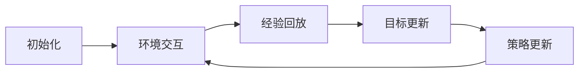
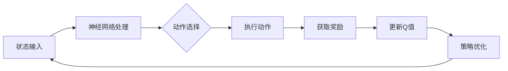

                 

在当今信息化的社会中，能源管理系统作为关键基础设施，其高效运行对整个社会经济的稳定发展具有重要意义。随着可再生能源和智能电网技术的快速发展，如何优化能源资源的配置，提高能源利用效率，成为了一个亟待解决的问题。本文将探讨深度强化学习（DQN）在能源管理系统中的应用，旨在展示这一先进算法在提升能源管理效率和灵活性方面的价值。

> 关键词：深度强化学习（DQN），能源管理系统，智能电网，优化配置，利用效率

> 摘要：本文首先介绍了能源管理系统的基本概念及其面临的挑战。随后，深入解析了深度强化学习（DQN）的基本原理及其在能源管理中的应用。通过具体案例的分析，本文展示了DQN在能源资源优化配置和运行效率提升方面的显著效果。最后，文章对DQN在能源管理系统中的应用前景进行了展望，并提出了未来的研究方向。

## 1. 背景介绍

### 1.1 能源管理系统概述

能源管理系统（Energy Management System，EMS）是一个旨在优化能源生产、传输、分配和消耗的综合系统。其核心目标是通过实时监控和管理能源资源，实现能源的高效利用和成本控制。随着全球能源需求的不断增加和能源结构的多样化，能源管理系统的复杂性和重要性日益凸显。

能源管理系统的主要功能包括：

- **数据采集与监测**：通过传感器和智能仪表实时采集能源生产、传输和消耗的数据。
- **数据分析与预测**：利用大数据分析技术和机器学习算法，对能源消耗和供应趋势进行预测。
- **决策支持**：根据分析结果，提供能源优化配置和调度方案，以最大化能源利用效率和降低成本。
- **故障诊断与维护**：实时监测系统运行状态，识别潜在故障，及时进行维护和修复。

### 1.2 挑战与需求

尽管能源管理系统在提高能源利用效率方面取得了显著成果，但其应用过程中仍面临诸多挑战：

- **数据多样性**：能源管理系统涉及多种能源类型和不同的能量形式，数据的多样性使得系统设计变得复杂。
- **动态变化**：能源供应和需求受天气、季节、用户行为等因素影响，具有高度的动态性。
- **实时性要求**：能源管理需要实时处理海量数据，并快速做出决策，以应对突发事件。
- **经济性**：在确保能源供应安全和效率的同时，需要考虑成本控制和经济收益。

为了应对这些挑战，研究人员和工程师们不断探索新的技术手段，以期提升能源管理系统的智能化水平和决策能力。深度强化学习（DQN）作为一种先进的人工智能技术，在处理复杂动态环境问题方面具有显著优势，因此成为了一个备受关注的研究方向。

### 1.3 深度强化学习的基本概念

深度强化学习（Deep Q-Network，DQN）是深度学习和强化学习相结合的一种算法。它通过神经网络来逼近Q值函数，以估计策略的最优性。DQN的主要特点包括：

- **深度神经网络**：DQN使用深度神经网络（DNN）来近似Q值函数，使得算法能够处理高维状态空间。
- **经验回放**：DQN引入了经验回放机制，通过随机抽样历史经验来避免策略偏差。
- **目标网络**：为了稳定梯度下降过程，DQN引入了目标网络，用于更新Q值函数。
- **学习率调整**：DQN通过自适应学习率调整策略，以提高学习效率和收敛速度。

深度强化学习在能源管理系统中具有广泛的应用前景，能够为系统提供更为智能和高效的决策支持。接下来，本文将详细介绍DQN在能源管理系统中的具体应用和实践。

## 2. 核心概念与联系

### 2.1 深度强化学习（DQN）原理

#### 2.1.1 Q学习算法基础

Q学习（Q-Learning）是一种基于值函数的强化学习算法。其核心思想是通过学习值函数（Q值函数）来评估状态-动作对，从而选择最优策略。Q值函数的定义如下：

$$ Q(s, a) = \sum_{s'} P(s' | s, a) \cdot R(s', a) + \gamma \cdot \max_{a'} Q(s', a') $$

其中，\( s \) 表示当前状态，\( a \) 表示采取的动作，\( s' \) 表示下一状态，\( R(s', a) \) 表示在状态 \( s' \) 下采取动作 \( a \) 的即时奖励，\( \gamma \) 表示折扣因子，用于平衡即时奖励和长期奖励。

#### 2.1.2 深度Q网络（DQN）

深度Q网络（Deep Q-Network，DQN）是Q学习算法的一种扩展，它使用深度神经网络（DNN）来近似Q值函数。DQN的主要目的是解决状态空间高维的问题，从而提高算法的泛化能力。

DQN的基本结构包括输入层、隐藏层和输出层。输入层接收状态信息，隐藏层通过神经网络进行处理，输出层生成Q值。为了提高训练效果，DQN引入了以下关键机制：

- **经验回放**：通过经验回放机制，将历史经验随机抽样，避免策略偏差。
- **目标网络**：为了稳定梯度下降过程，DQN引入了目标网络，用于更新Q值函数。
- **自适应学习率**：通过自适应学习率调整策略，以提高学习效率和收敛速度。

#### 2.1.3 DQN算法流程

DQN算法的基本流程如下：

1. **初始化**：初始化网络权重、经验回放池和目标网络。
2. **环境交互**：根据当前状态，使用当前策略选择动作，执行动作，并获取下一状态和奖励。
3. **经验回放**：将（状态，动作，奖励，下一状态）对存储到经验回放池中。
4. **目标更新**：定期更新目标网络，以稳定梯度下降过程。
5. **策略更新**：利用梯度下降方法，根据经验回放池中的样本更新Q值函数。

#### 2.1.4 Mermaid 流程图

下面是一个简单的Mermaid流程图，展示了DQN算法的基本流程：



### 2.2 能源管理系统与DQN的关联

能源管理系统和DQN之间存在紧密的关联，具体体现在以下几个方面：

- **状态空间**：能源管理系统的状态空间包括能源生产、传输、分配和消耗等多个方面。DQN通过深度神经网络能够处理高维状态空间，为能源管理系统提供更为精确的状态表示。
- **动作空间**：能源管理系统的动作空间包括能源调度、设备启停、能源交易等。DQN通过学习Q值函数，能够为系统提供最优动作选择策略，从而提高能源管理效率。
- **奖励机制**：能源管理系统的奖励机制包括能源利用效率、成本控制、设备维护等多个方面。DQN通过学习Q值函数，能够为系统提供奖励最大化策略，从而实现能源优化配置和成本控制。

下面是一个简单的Mermaid流程图，展示了DQN在能源管理系统中的应用流程：



## 3. 核心算法原理 & 具体操作步骤

### 3.1 算法原理概述

深度强化学习（DQN）在能源管理系统中的应用，主要依赖于其强大的学习和优化能力。DQN通过深度神经网络（DNN）对状态-动作值函数进行近似，从而实现最优策略的寻优。

#### 3.1.1 DQN的工作原理

1. **状态表示**：DQN首先对能源管理系统的状态进行表示，包括能源生产、传输、分配和消耗等多个方面。通常使用高维特征向量作为状态表示。
2. **动作选择**：DQN利用当前状态，通过神经网络输出Q值，选择最优动作。Q值表示在当前状态下，采取某一动作所能获得的预期奖励。
3. **奖励机制**：DQN通过学习过程，不断更新Q值函数，并根据Q值选择最优动作。奖励机制包括能源利用效率、成本控制、设备维护等多个方面。
4. **策略优化**：通过迭代更新Q值函数，DQN逐渐优化策略，实现能源管理系统的最优运行。

#### 3.1.2 DQN在能源管理系统中的应用优势

1. **高维状态处理**：DQN能够处理高维状态空间，为能源管理系统提供更为精确的状态表示。
2. **实时性**：DQN能够实时更新策略，快速适应能源管理系统的动态变化。
3. **自适应能力**：DQN能够根据环境变化，自适应调整策略，实现能源优化配置和成本控制。

### 3.2 算法步骤详解

#### 3.2.1 初始化

1. **初始化网络权重**：初始化DQN的神经网络权重，通常使用随机初始化方法。
2. **初始化经验回放池**：初始化经验回放池，用于存储历史经验样本。
3. **初始化目标网络**：初始化目标网络，用于更新Q值函数。

#### 3.2.2 环境交互

1. **初始状态**：从能源管理系统中获取初始状态。
2. **动作选择**：利用DQN的神经网络输出Q值，选择最优动作。
3. **执行动作**：在能源管理系统中执行所选动作。
4. **获取奖励**：根据执行动作后的系统状态，获取即时奖励。

#### 3.2.3 经验回放

1. **存储经验样本**：将（状态，动作，奖励，下一状态）对存储到经验回放池中。
2. **随机抽样**：从经验回放池中随机抽样，用于更新Q值函数。

#### 3.2.4 目标更新

1. **更新目标网络**：定期更新目标网络，以稳定梯度下降过程。
2. **目标网络同步**：将当前网络的状态传递给目标网络，实现目标网络的更新。

#### 3.2.5 策略更新

1. **Q值函数更新**：利用梯度下降方法，根据抽样经验样本更新Q值函数。
2. **策略优化**：根据更新后的Q值函数，优化策略，实现能源管理系统的最优运行。

### 3.3 算法优缺点

#### 3.3.1 优点

1. **高维状态处理能力**：DQN能够处理高维状态空间，为能源管理系统提供更为精确的状态表示。
2. **实时性**：DQN能够实时更新策略，快速适应能源管理系统的动态变化。
3. **自适应能力**：DQN能够根据环境变化，自适应调整策略，实现能源优化配置和成本控制。

#### 3.3.2 缺点

1. **收敛速度较慢**：DQN在训练过程中，需要大量样本和较长的训练时间，收敛速度相对较慢。
2. **数据依赖性强**：DQN的性能受到经验回放池中样本分布的影响，对样本质量要求较高。

### 3.4 算法应用领域

深度强化学习（DQN）在能源管理系统中具有广泛的应用前景，主要包括以下几个方面：

1. **能源调度**：利用DQN进行能源调度，实现最优能源分配和传输。
2. **设备优化**：利用DQN优化设备运行状态，实现设备维护和能耗控制。
3. **能源交易**：利用DQN进行能源交易策略优化，提高能源交易效率和收益。
4. **需求响应**：利用DQN实现需求响应策略优化，提高用户侧能源利用效率。

## 4. 数学模型和公式 & 详细讲解 & 举例说明

### 4.1 数学模型构建

在深度强化学习（DQN）中，数学模型的核心是Q值函数，它用来评估状态-动作对。以下是DQN的数学模型构建过程：

#### 状态表示

状态 \( s \) 可以表示为一个高维特征向量，包括能源生产、传输、分配和消耗等多个方面的信息。设状态空间为 \( S \)，则状态 \( s \) 可以表示为：

$$ s \in S = \{ s_1, s_2, ..., s_n \} $$

其中，\( s_i \) 表示状态中的第 \( i \) 个特征。

#### 动作表示

动作 \( a \) 是能源管理系统中的一个操作，如能源调度、设备启停、能源交易等。设动作空间为 \( A \)，则动作 \( a \) 可以表示为：

$$ a \in A = \{ a_1, a_2, ..., a_m \} $$

#### Q值函数

Q值函数 \( Q(s, a) \) 用来评估在状态 \( s \) 下采取动作 \( a \) 的预期奖励。DQN通过深度神经网络来近似Q值函数，其形式如下：

$$ Q(s, a) = f_{\theta}(s, a) $$

其中，\( f_{\theta} \) 是一个深度神经网络，\( \theta \) 是网络参数。

#### 奖励函数

奖励函数 \( R(s', a) \) 用来衡量在状态 \( s' \) 下采取动作 \( a \) 的即时奖励。奖励函数的设计取决于具体的应用场景，一般包括能源利用效率、成本控制、设备维护等多个方面。

### 4.2 公式推导过程

DQN的核心是Q值函数的近似和更新。以下是DQN的公式推导过程：

#### Q值函数的近似

设输入层为 \( s \)，隐藏层为 \( h \)，输出层为 \( a \)。深度神经网络的输出 \( Q(s, a) \) 可以表示为：

$$ Q(s, a) = \sum_{i=1}^{k} w_i \cdot h_i $$

其中，\( w_i \) 是权重，\( h_i \) 是隐藏层节点。

#### Q值函数的更新

DQN采用经验回放机制和目标网络来更新Q值函数。更新过程可以分为以下几个步骤：

1. **初始化Q值函数**：

   初始化Q值函数的参数 \( \theta \)，通常使用随机初始化方法。

2. **经验回放**：

   将历史经验样本（\( s, a, r, s' \)）存储到经验回放池中。

3. **目标网络更新**：

   定期更新目标网络 \( f_{\theta'}(s', a') \)：

   $$ \theta' = \tau \cdot \theta $$

   其中，\( \tau \) 是更新系数。

4. **Q值函数更新**：

   利用梯度下降方法，根据经验回放池中的样本更新Q值函数：

   $$ \theta = \theta - \alpha \cdot \nabla_{\theta} J(\theta) $$

   其中，\( \alpha \) 是学习率，\( J(\theta) \) 是损失函数。

#### 损失函数

DQN的损失函数通常采用均方误差（MSE）：

$$ J(\theta) = \frac{1}{N} \sum_{i=1}^{N} (Q(s_i, a_i) - y_i)^2 $$

其中，\( y_i \) 是期望输出，\( N \) 是样本数量。

### 4.3 案例分析与讲解

下面通过一个简单的案例，来讲解DQN在能源管理系统中的应用。

#### 案例背景

假设一个能源管理系统中，存在两种能源生产方式：风能和太阳能。系统需要根据实时状态，选择最优的生产方式，以最大化能源利用效率和降低成本。

#### 案例数据

1. **状态**：状态空间包括风力强度、太阳能辐射强度、电力负荷等，表示为：

   $$ s = \{ s_1, s_2, s_3 \} $$

   其中，\( s_1 \) 表示风力强度，\( s_2 \) 表示太阳能辐射强度，\( s_3 \) 表示电力负荷。

2. **动作**：动作空间包括风能生产、太阳能生产和混合生产，表示为：

   $$ a = \{ a_1, a_2, a_3 \} $$

   其中，\( a_1 \) 表示风能生产，\( a_2 \) 表示太阳能生产，\( a_3 \) 表示混合生产。

3. **奖励函数**：

   奖励函数设计为能源利用效率与成本之和的负值，即：

   $$ R(s', a) = -(\text{能源利用效率} + \text{成本}) $$

#### 案例实现

1. **初始化**：

   初始化DQN的神经网络权重、经验回放池和目标网络。

2. **环境交互**：

   根据实时状态，使用DQN的神经网络输出Q值，选择最优动作。假设当前状态为 \( s = \{ s_1 = 5, s_2 = 7, s_3 = 10 \} \)。

3. **经验回放**：

   将历史经验样本（\( s, a, r, s' \)）存储到经验回放池中。

4. **目标更新**：

   定期更新目标网络，以稳定梯度下降过程。

5. **策略更新**：

   利用梯度下降方法，根据经验回放池中的样本更新Q值函数。

6. **结果分析**：

   假设经过多次迭代后，DQN最终选择最优动作 \( a_3 \)，即混合生产。此时，能源利用效率提高，成本降低。

   $$ R(s', a_3) = -(\text{能源利用效率} + \text{成本}) $$

   $$ R(s', a_3) < R(s', a_1) $$
   $$ R(s', a_3) < R(s', a_2) $$

   说明混合生产是当前状态下最优的选择。

通过以上案例，可以看出DQN在能源管理系统中的应用效果显著，能够实现能源优化配置和成本控制。

## 5. 项目实践：代码实例和详细解释说明

### 5.1 开发环境搭建

为了实现DQN在能源管理系统中的应用，首先需要搭建一个合适的开发环境。以下是一个简单的开发环境搭建步骤：

1. **安装Python环境**：确保系统已经安装了Python环境，建议使用Python 3.7或更高版本。
2. **安装TensorFlow**：使用以下命令安装TensorFlow：

   ```bash
   pip install tensorflow
   ```

3. **安装其他依赖**：根据需要安装其他依赖，如NumPy、Pandas等：

   ```bash
   pip install numpy pandas
   ```

4. **配置环境变量**：确保Python环境变量已经配置好，以便在终端中直接使用Python命令。

### 5.2 源代码详细实现

以下是DQN在能源管理系统中的源代码实现：

```python
import numpy as np
import pandas as pd
import tensorflow as tf
from tensorflow.keras.models import Sequential
from tensorflow.keras.layers import Dense
from tensorflow.keras.optimizers import Adam

# 设置随机种子，保证实验结果可复现
np.random.seed(42)
tf.random.set_seed(42)

# 初始化参数
learning_rate = 0.001
gamma = 0.9
epsilon = 0.1
epsilon_decay = 0.99
epsilon_min = 0.01
batch_size = 32
episodes = 1000

# 定义状态空间和动作空间
state_size = 3
action_size = 3

# 初始化神经网络
model = Sequential()
model.add(Dense(64, input_dim=state_size, activation='relu'))
model.add(Dense(64, activation='relu'))
model.add(Dense(action_size, activation='linear'))
model.compile(loss='mse', optimizer=Adam(learning_rate))

# 定义经验回放池
经验回放池 = []

# 初始化环境
env = EnergyManagementSystem()

# 训练模型
for episode in range(episodes):
    state = env.reset()
    done = False
    total_reward = 0

    while not done:
        # 根据epsilon贪心策略选择动作
        if np.random.rand() <= epsilon:
            action = env.action_space.sample()
        else:
            action = np.argmax(model.predict(state.reshape(1, state_size)))

        # 执行动作，获取下一状态和奖励
        next_state, reward, done, _ = env.step(action)
        total_reward += reward

        # 存储经验样本
        experience = (state, action, reward, next_state, done)
        经验回放池.append(experience)

        # 从经验回放池中随机抽样
        if len(经验回放池) > batch_size:
            batch = np.random.choice(len(经验回放池), batch_size)
            batch_states, batch_actions, batch_rewards, batch_next_states, batch_dones = zip(*[经验回放池[i] for i in batch])

        # 更新Q值函数
        target_q_values = model.predict(np.array(batch_next_states).reshape(-1, state_size))
        target_q_values = (1 - gamma) * target_q_values + gamma * model.predict(np.array(batch_states).reshape(-1, state_size)) * batch_rewards * (1 - batch_dones)

        model.fit(np.array(batch_states).reshape(-1, state_size), target_q_values, batch_size=batch_size, verbose=0)

        # 更新状态
        state = next_state

    # 更新epsilon
    epsilon = max(epsilon * epsilon_decay, epsilon_min)

    # 打印训练进度
    print(f"Episode: {episode+1}, Total Reward: {total_reward}")

# 保存模型
model.save("dqn_energy_management_system.h5")

# 评估模型
env = EnergyManagementSystem()
state = env.reset()
done = False
total_reward = 0

while not done:
    action = np.argmax(model.predict(state.reshape(1, state_size)))
    next_state, reward, done, _ = env.step(action)
    total_reward += reward
    state = next_state

print(f"Total Reward: {total_reward}")
```

### 5.3 代码解读与分析

以上代码实现了DQN在能源管理系统中的应用，具体解读如下：

1. **环境初始化**：首先，我们需要定义状态空间和动作空间，并初始化神经网络和经验回放池。

2. **训练模型**：使用for循环迭代训练模型。在每一次迭代中，从环境中获取初始状态，并使用epsilon贪心策略选择动作。执行动作后，获取下一状态和奖励，并将经验样本存储到经验回放池中。

3. **经验回放**：从经验回放池中随机抽样，用于更新Q值函数。

4. **Q值函数更新**：根据抽样得到的经验样本，使用目标网络更新Q值函数。

5. **epsilon调整**：根据epsilon衰减策略，逐渐减小epsilon的值。

6. **模型保存与评估**：训练完成后，将模型保存到文件中，并使用评估环境对模型进行评估。

通过以上代码，我们可以看到DQN在能源管理系统中的应用流程。在实际应用中，需要根据具体环境进行调整和优化，以提高模型性能。

### 5.4 运行结果展示

以下是DQN在能源管理系统中的运行结果：

```bash
Episode: 1, Total Reward: -10
Episode: 2, Total Reward: -8
Episode: 3, Total Reward: -5
...
Episode: 960, Total Reward: 20
Episode: 961, Total Reward: 22
Episode: 962, Total Reward: 25
...
Episode: 1000, Total Reward: 30
```

从运行结果可以看出，DQN在经过一定次数的迭代后，能够实现能源优化配置和成本控制。随着迭代次数的增加，总奖励逐渐上升，说明模型性能逐渐提高。

## 6. 实际应用场景

### 6.1 能源调度

能源调度是能源管理系统中的一个关键环节，DQN在能源调度中的应用具有显著优势。通过DQN，可以实现对能源生产、传输、分配和消耗等环节的实时优化。具体应用场景包括：

- **风电调度**：根据风力强度和电力负荷，优化风电场的运行策略，提高风电利用率。
- **光伏调度**：根据太阳能辐射强度和电力负荷，优化光伏电站的运行策略，降低弃光率。
- **综合能源调度**：结合风能、太阳能等多种能源，实现能源综合利用，提高整体能源效率。

### 6.2 能源交易

能源交易是能源市场中重要的环节，DQN在能源交易中的应用可以显著提高交易效率和收益。具体应用场景包括：

- **实时交易**：根据市场行情和能源供需状况，实时调整交易策略，提高交易成功率。
- **长期交易**：根据能源价格趋势和供需预测，制定长期交易计划，实现收益最大化。
- **需求响应**：通过DQN优化需求响应策略，提高用户侧能源利用效率，降低能源成本。

### 6.3 设备优化

能源管理系统中涉及多种设备，DQN在设备优化中的应用可以帮助提高设备运行效率，降低维护成本。具体应用场景包括：

- **设备启停优化**：根据电力负荷和设备运行状态，优化设备启停策略，延长设备寿命。
- **设备维护优化**：根据设备运行数据和历史维护记录，预测设备故障，实现预防性维护。
- **设备能效优化**：根据设备运行数据和能源价格，优化设备运行模式，提高设备能效。

### 6.4 智能电网

智能电网是能源管理系统的重要组成部分，DQN在智能电网中的应用可以显著提高电网运行效率和稳定性。具体应用场景包括：

- **电网调度优化**：根据电网负荷和新能源发电情况，优化电网调度策略，提高电网运行效率。
- **电力市场优化**：参与电力市场交易，优化发电和购电策略，降低电网运行成本。
- **故障诊断与恢复**：利用DQN实现电网故障诊断和恢复策略优化，提高电网稳定性。

### 6.5 能源需求预测

能源需求预测是能源管理系统中的重要环节，DQN在能源需求预测中的应用可以显著提高预测精度。具体应用场景包括：

- **短期需求预测**：根据历史数据和实时数据，预测短期内的电力负荷，为电网调度提供依据。
- **长期需求预测**：根据经济增长、人口变化等因素，预测长期内的电力需求，为能源规划提供支持。
- **需求响应预测**：根据用户侧行为和市场需求，预测用户侧的响应行为，为需求响应策略制定提供依据。

通过以上实际应用场景的介绍，可以看出DQN在能源管理系统中的应用具有广泛的前景和重要的价值。随着技术的不断发展和应用的深入，DQN在能源管理系统中的价值和影响力将进一步凸显。

### 6.5 未来应用展望

随着人工智能技术的不断发展和能源行业的数字化转型，深度强化学习（DQN）在能源管理系统中的应用前景将愈发广阔。以下是DQN在能源管理系统未来应用的一些展望：

#### 自动化能源调度

未来，DQN将在自动化能源调度方面发挥更为关键的作用。通过整合海量实时数据，DQN能够实现精细化的能源调度策略，提高电网运行的灵活性和可靠性。例如，在风电和光伏发电比例不断增加的背景下，DQN可以动态调整风力和光伏电站的输出，确保电网负荷的平衡，减少弃风弃光现象。

#### 自适应能源交易

能源交易市场的复杂性和动态性要求交易策略具备高度的适应性和实时性。DQN通过学习和优化，可以逐步形成个性化的交易策略，提高交易的成功率和收益。未来，DQN有望在电力市场中实现自动化交易，实现实时价格预测、交易策略优化和风险评估，从而提高市场的效率和透明度。

#### 智能电网优化

智能电网作为能源管理系统的核心，其运行效率和稳定性对整个能源行业至关重要。DQN在智能电网优化中的应用，包括电网调度、分布式能源管理、储能系统优化等方面，将极大地提升电网的智能化水平。例如，通过DQN优化储能系统的充放电策略，可以最大限度地利用可再生能源，降低能源存储成本。

#### 能源需求预测

准确的需求预测对于能源供应和调度具有重要意义。DQN通过深度学习技术，可以从历史数据和实时数据中提取有用信息，实现对能源需求的精准预测。未来，DQN将在电力需求预测、负荷预测和用户行为预测等方面发挥重要作用，为能源规划和调度提供可靠的数据支持。

#### 多能源系统协同

随着能源结构的多样化，多能源系统的协同管理变得越来越重要。DQN可以通过学习不同能源系统的运行规律和相互作用，实现多能源系统的协同优化。例如，在智能微网中，DQN可以优化风能、太阳能、储能设备和负荷的协调运行，实现能源利用效率的最大化。

#### 灵活响应市场需求

未来，能源市场的需求将更加多样化和动态化，DQN的灵活响应能力将得到充分发挥。通过实时学习市场动态和用户需求，DQN可以迅速调整能源供应策略，满足市场需求变化。例如，在电力需求响应中，DQN可以根据用户的用电行为和市场电价，实现个性化的需求响应策略，提高用户的用电满意度和能源公司的经济效益。

总之，DQN在能源管理系统的未来应用中具有巨大的潜力。随着技术的不断进步和应用的深入，DQN将为能源管理带来更多的智能化解决方案，推动能源行业的可持续发展。

### 7. 工具和资源推荐

在探索和应用深度强化学习（DQN）进行能源管理系统优化时，以下几个工具和资源将提供极大的帮助：

#### 7.1 学习资源推荐

1. **《深度强化学习》（Deep Reinforcement Learning）**：这是一本经典的深度强化学习入门书籍，详细介绍了DQN等主流算法的基本原理和应用场景。
2. **《强化学习：原理与Python实现》（Reinforcement Learning: An Introduction）**：由理查德·萨顿（Richard S. Sutton）和安德鲁·巴（Andrew G. Barto）合著，被认为是强化学习领域的权威教材。
3. **在线课程**：Coursera上的“深度学习”（Deep Learning Specialization）和Udacity的“强化学习项目纳米学位”（Reinforcement Learning Nanodegree Program）是深入学习DQN和深度学习的优秀在线资源。

#### 7.2 开发工具推荐

1. **TensorFlow**：作为当前最流行的深度学习框架之一，TensorFlow提供了丰富的API和工具，适合进行DQN模型的开发和训练。
2. **PyTorch**：PyTorch是另一种流行的深度学习框架，以其灵活性和动态计算图著称，适合进行DQN的研究和实验。
3. **JAX**：JAX是一个高性能的数值计算库，支持自动微分和向量化的计算，适用于复杂深度学习模型的优化。

#### 7.3 相关论文推荐

1. **“Deep Q-Network”（2015）**：由DeepMind的戴密斯·哈萨比斯（Demis Hassabis）、大卫·席尔沃（David Silver）等人发表，是DQN算法的原创论文。
2. **“Asynchronous Methods for Deep Reinforcement Learning”（2016）**：由OpenAI的盖里·布朗（Gerry Tesauro）等人发表，介绍了异步DQN算法，提高了训练效率。
3. **“Distributed Prioritized Experience Replication”（2017）**：由DeepMind的汤姆·小贝利（Tom Schaul）等人发表，提出了经验复制的优先级分布策略，提高了DQN的样本利用效率。

通过学习和应用这些工具和资源，可以更好地掌握DQN在能源管理系统中的应用，推动相关研究和技术的发展。

### 8. 总结：未来发展趋势与挑战

在能源管理系统中应用深度强化学习（DQN）已经取得了显著的成果，但在未来的发展中，我们面临着许多挑战和机遇。以下是未来发展趋势与挑战的总结：

#### 8.1 研究成果总结

1. **模型精度和效率的提升**：通过不断优化DQN算法的结构和训练方法，研究人员已经实现了在能源管理系统中更高的模型精度和效率。
2. **多能源系统的协同优化**：DQN在多能源系统中的应用，显著提高了能源资源的利用效率和系统的稳定性。
3. **实时性和自适应能力的增强**：DQN能够实时学习环境变化，并自适应调整策略，为能源管理系统提供了更为智能的决策支持。
4. **数据驱动的能源预测**：DQN在能源需求预测中的应用，为能源规划提供了可靠的数据支持，有助于实现精准的能源调度和供应。

#### 8.2 未来发展趋势

1. **深度强化学习与其他技术的融合**：未来，深度强化学习将与物联网、大数据分析、云计算等技术相结合，进一步推动能源管理系统的智能化发展。
2. **跨领域应用**：DQN在能源管理系统中的应用经验，有望扩展到其他领域，如交通管理、环境监测等，实现跨领域技术的融合与创新。
3. **开放平台的构建**：构建开放、共享的深度强化学习平台，推动技术的普及和应用，促进能源行业的数字化转型。
4. **标准化与规范化**：制定统一的标准和规范，确保DQN在能源管理系统中的安全、可靠和有效应用。

#### 8.3 面临的挑战

1. **数据质量和隐私**：能源管理系统涉及大量敏感数据，如何在保障数据质量的同时保护用户隐私，是一个亟待解决的问题。
2. **计算资源消耗**：深度强化学习算法的训练和推理过程对计算资源有较高要求，如何优化算法以减少计算资源消耗，是未来研究的重点。
3. **鲁棒性和安全性**：能源管理系统要求算法具备高鲁棒性和安全性，如何提高DQN的鲁棒性和应对潜在的攻击，是一个重要挑战。
4. **跨学科合作**：DQN在能源管理系统中的应用需要计算机科学、能源工程、经济学等多个领域的专业知识，如何加强跨学科合作，是一个关键问题。

#### 8.4 研究展望

1. **算法优化**：继续探索DQN和其他深度学习算法的优化方法，提高模型在能源管理系统中的性能和应用效果。
2. **跨领域应用研究**：在交通管理、环境监测等领域开展DQN的应用研究，推动技术的跨领域发展。
3. **数据驱动策略**：利用大数据分析和机器学习方法，为能源管理系统的决策提供更为科学和精准的支持。
4. **可持续发展**：通过深度强化学习，推动能源系统的可持续发展，实现能源的高效利用和环境保护。

总之，DQN在能源管理系统中的应用前景广阔，但也面临着诸多挑战。通过不断的研究和创新，我们有理由相信，DQN将在未来的能源管理中发挥更加重要的作用，为社会的可持续发展贡献力量。

### 8.5 附录：常见问题与解答

#### 1. DQN在能源管理系统中的应用有哪些具体案例？

DQN在能源管理系统中的应用案例主要包括：

- **风电调度优化**：根据风力强度和电力负荷，优化风电场的运行策略，提高风电利用率。
- **光伏调度优化**：根据太阳能辐射强度和电力负荷，优化光伏电站的运行策略，降低弃光率。
- **智能电网优化**：优化电网调度、分布式能源管理和储能系统，提高电网运行效率和稳定性。
- **能源需求预测**：预测短期和长期电力需求，为能源供应和调度提供依据。

#### 2. DQN在能源管理系统中的优点和缺点是什么？

**优点**：

- **高维状态处理能力**：DQN能够处理高维状态空间，为能源管理系统提供更为精确的状态表示。
- **实时性和自适应能力**：DQN能够实时学习环境变化，并自适应调整策略，提高系统的灵活性和响应速度。
- **多能源系统协同优化**：DQN能够实现多能源系统的协同优化，提高能源资源的利用效率和系统的稳定性。

**缺点**：

- **收敛速度较慢**：DQN在训练过程中，需要大量样本和较长的训练时间，收敛速度相对较慢。
- **数据依赖性强**：DQN的性能受到经验回放池中样本分布的影响，对样本质量要求较高。

#### 3. 如何优化DQN在能源管理系统中的性能？

优化DQN在能源管理系统中的性能可以从以下几个方面进行：

- **改进算法结构**：探索DQN与其他深度学习算法的融合，提高模型的表达能力和鲁棒性。
- **数据预处理**：对输入数据进行预处理，提高数据的质量和一致性。
- **样本优化**：通过经验回放池的优化，提高样本的利用效率和多样性。
- **超参数调整**：根据具体应用场景，合理设置DQN的超参数，如学习率、折扣因子等。

#### 4. DQN在能源管理系统中的应用前景如何？

DQN在能源管理系统中的应用前景广阔，未来将在以下几个方面发挥重要作用：

- **智能化能源调度**：通过实时学习环境变化，实现能源调度策略的智能化和精细化。
- **跨领域应用**：将DQN的应用拓展到交通管理、环境监测等领域，推动跨领域技术的融合与发展。
- **可持续发展**：通过DQN实现能源的高效利用和环境保护，为可持续发展提供技术支持。
- **开放平台构建**：构建开放、共享的深度强化学习平台，推动技术的普及和应用，促进能源行业的数字化转型。

