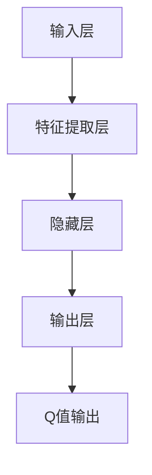

                 

### 1. 背景介绍

自动驾驶技术作为人工智能的重要分支，近年来取得了显著的进展。自动驾驶车辆可以通过传感器、摄像头和其他智能设备感知周围环境，并利用机器学习算法进行自主决策和控制，从而实现车辆在复杂道路环境下的安全、高效驾驶。然而，自动驾驶系统的复杂性和不确定性使得其实现面临巨大挑战。

在自动驾驶系统中，深度强化学习（Deep Reinforcement Learning，DRL）是一种非常有前景的算法。深度强化学习结合了深度学习和强化学习的优点，通过学习一个价值函数或策略来指导智能体在环境中进行决策。DQN（Deep Q-Network）是深度强化学习的一种经典算法，由于其高效性和实用性，在自动驾驶领域得到了广泛研究。

本文将围绕DQN在自动驾驶中的应用进行深入分析，首先介绍DQN的基本原理和实现步骤，然后通过一个实际案例展示DQN在自动驾驶中的具体应用，最后讨论DQN在自动驾驶中的优势和挑战，并对未来发展方向进行展望。

### 2. 核心概念与联系

#### 2.1 DQN基本原理

DQN（Deep Q-Network）是一种基于深度学习的Q值学习算法。Q值学习是强化学习中的一种重要方法，它通过学习一个价值函数（Q函数）来评估智能体在不同状态和动作下的期望回报。DQN的核心思想是将Q函数近似为一个深度神经网络，通过神经网络的学习能力来提高Q值学习的效率和准确性。

DQN的原理如图1所示：



图1 DQN基本原理

在DQN中，输入层接收来自环境的观测数据，经过特征提取层提取有用的特征信息，然后通过隐藏层进行复杂的非线性变换，最终输出Q值。Q值表示在当前状态下执行特定动作的期望回报。

#### 2.2 DQN实现步骤

DQN的实现可以分为以下几个步骤：

1. **初始化参数**：初始化神经网络权重、经验回放池等参数。
2. **状态编码**：将环境的观测数据编码为神经网络可以处理的格式。
3. **网络输入与输出**：将当前状态输入到神经网络中，得到Q值输出。
4. **选择动作**：根据Q值输出选择动作。
5. **更新经验回放池**：将当前状态、动作、奖励和下一个状态存储到经验回放池中。
6. **更新Q值**：利用经验回放池中的数据更新神经网络权重，以优化Q值函数。

#### 2.3 DQN优缺点

**优点**：

- **高效性**：DQN通过深度神经网络对Q值进行近似，能够处理高维的状态空间，提高学习效率。
- **适用性**：DQN适用于各种具有高维状态空间和复杂动作空间的强化学习问题，如自动驾驶、机器人控制等。
- **灵活性**：DQN可以灵活地调整网络结构和学习参数，以适应不同的任务需求。

**缺点**：

- **学习稳定性**：DQN在训练过程中容易陷入局部最优，导致学习过程不稳定。
- **计算成本**：DQN需要大量计算资源，特别是在处理高维状态空间时，训练时间较长。
- **数据效率**：DQN需要大量样本数据来训练网络，数据收集和处理成本较高。

#### 2.4 DQN应用领域

DQN在自动驾驶领域具有广泛的应用前景。自动驾驶系统面临复杂多变的环境，需要实时感知和决策。DQN可以用于自动驾驶系统的感知、规划和控制等环节，提高系统的智能水平和安全性。

具体应用场景包括：

- **感知**：DQN可以用于处理摄像头、激光雷达等传感器数据，实现环境感知和物体检测。
- **规划**：DQN可以用于路径规划，指导车辆在复杂道路上选择最佳行驶轨迹。
- **控制**：DQN可以用于控制车辆的转向、加速和制动等动作，实现自动驾驶。

### 3. 核心算法原理 & 具体操作步骤

#### 3.1 算法原理概述

DQN（Deep Q-Network）是一种基于深度学习的Q值学习算法，旨在解决强化学习问题。其核心思想是通过深度神经网络学习一个价值函数（Q函数），以指导智能体在环境中进行决策。DQN的主要特点包括：

- **深度神经网络**：使用深度神经网络来近似Q函数，提高算法的表示能力和泛化能力。
- **经验回放**：引入经验回放池，避免策略偏差，提高学习稳定性。
- **目标网络**：使用目标网络来减少目标偏移，提高学习效果。

DQN的基本原理可以概括为以下几个步骤：

1. **初始化**：初始化神经网络权重、经验回放池和目标网络。
2. **状态编码**：将当前状态编码为神经网络可以处理的输入格式。
3. **选择动作**：利用当前状态的Q值输出选择动作。
4. **更新经验回放池**：将当前状态、动作、奖励和下一个状态存储到经验回放池中。
5. **更新Q值**：利用经验回放池中的数据更新神经网络权重，以优化Q函数。
6. **同步目标网络**：定期同步主网络和目标网络的权重，以减少目标偏移。

#### 3.2 算法步骤详解

1. **初始化**

初始化神经网络权重、经验回放池和目标网络。神经网络权重可以通过随机初始化或预训练得到。经验回放池通常使用循环缓冲区实现，以存储最新的经验数据。目标网络用于存储主网络的权重，并在训练过程中定期同步主网络的权重。

2. **状态编码**

将当前状态编码为神经网络可以处理的输入格式。状态编码通常包括以下步骤：

- **数据预处理**：对传感器数据（如摄像头、激光雷达等）进行预处理，如归一化、裁剪等。
- **特征提取**：使用卷积神经网络等深度学习模型提取状态的特征信息。
- **输入拼接**：将提取到的特征信息拼接成一个多维向量作为神经网络的输入。

3. **选择动作**

根据当前状态的Q值输出选择动作。具体方法如下：

- **ε-贪心策略**：在训练初期，随机选择动作以探索环境，同时根据Q值输出选择动作以利用已有的知识。
- **Q值比较**：在训练后期，根据当前状态的Q值输出选择动作，使智能体倾向于选择Q值较高的动作。

4. **更新经验回放池**

将当前状态、动作、奖励和下一个状态存储到经验回放池中。经验回放池的作用是避免策略偏差，提高学习稳定性。具体实现方法如下：

- **随机采样**：从经验回放池中随机采样一批经验数据。
- **经验回放**：将采样到的经验数据存储到经验回放池中。

5. **更新Q值**

利用经验回放池中的数据更新神经网络权重，以优化Q函数。具体方法如下：

- **损失函数**：使用Huber损失函数或均方误差（MSE）损失函数来计算Q值预测误差。
- **梯度下降**：使用梯度下降算法更新神经网络权重，以最小化损失函数。

6. **同步目标网络**

定期同步主网络和目标网络的权重，以减少目标偏移。具体方法如下：

- **定期同步**：在训练过程中定期同步主网络和目标网络的权重，例如每N步同步一次。
- **权重更新**：将主网络的权重复制到目标网络中，以更新目标网络的权重。

#### 3.3 算法优缺点

**优点**：

- **高效性**：DQN通过深度神经网络学习Q函数，能够处理高维的状态空间，提高学习效率。
- **灵活性**：DQN可以灵活地调整网络结构和学习参数，以适应不同的任务需求。
- **适用性**：DQN适用于各种具有高维状态空间和复杂动作空间的强化学习问题，如自动驾驶、机器人控制等。

**缺点**：

- **学习稳定性**：DQN在训练过程中容易陷入局部最优，导致学习过程不稳定。
- **计算成本**：DQN需要大量计算资源，特别是在处理高维状态空间时，训练时间较长。
- **数据效率**：DQN需要大量样本数据来训练网络，数据收集和处理成本较高。

#### 3.4 算法应用领域

DQN在自动驾驶领域具有广泛的应用前景。自动驾驶系统面临复杂多变的环境，需要实时感知和决策。DQN可以用于自动驾驶系统的感知、规划和控制等环节，提高系统的智能水平和安全性。

具体应用领域包括：

- **感知**：DQN可以用于处理摄像头、激光雷达等传感器数据，实现环境感知和物体检测。
- **规划**：DQN可以用于路径规划，指导车辆在复杂道路上选择最佳行驶轨迹。
- **控制**：DQN可以用于控制车辆的转向、加速和制动等动作，实现自动驾驶。

### 4. 数学模型和公式 & 详细讲解 & 举例说明

在DQN中，主要涉及到以下几个数学模型和公式：

#### 4.1 数学模型构建

1. **Q值函数**：Q值函数是DQN的核心模型，用于评估智能体在不同状态和动作下的期望回报。假设状态空间为S，动作空间为A，则Q值函数可以表示为：

   $$Q^*(s,a) = \mathbb{E}_{r_{t+1},s_{t+1}}[r_{t+1} + \gamma \max_{a'} Q^*(s_{t+1}, a') | s_t = s, a_t = a]$$

   其中，$r_{t+1}$表示奖励，$s_{t+1}$表示下一个状态，$\gamma$表示折扣因子，$a'$表示其他动作。

2. **深度神经网络**：DQN使用深度神经网络来近似Q值函数。假设输入层有n个神经元，隐藏层有m个神经元，输出层有k个神经元，则深度神经网络可以表示为：

   $$h_{l}^{(i)} = \sigma \left( \sum_{j} w_{j}^{(i)} h_{l-1}^{(j)} + b_{j}^{(i)} \right)$$

   其中，$h_{l}^{(i)}$表示第l层的第i个神经元输出，$\sigma$表示激活函数，$w_{j}^{(i)}$表示连接权重，$b_{j}^{(i)}$表示偏置。

3. **经验回放池**：经验回放池用于存储智能体在环境中的经验数据，以避免策略偏差。假设经验回放池的大小为N，则经验回放池可以表示为：

   $$\mathcal{D} = \{ (s_t, a_t, r_t, s_{t+1}) \}_{t=1}^{N}$$

   其中，$(s_t, a_t, r_t, s_{t+1})$表示第t次经验的四元组。

#### 4.2 公式推导过程

1. **Q值预测**：

   假设当前状态为$s_t$，动作集合为$A$，则DQN使用当前状态的Q值输出预测下一个状态的最优动作。具体公式为：

   $$\hat{a}_t = \arg\max_{a \in A} Q(s_t, a)$$

   其中，$\hat{a}_t$表示当前状态下的最优动作。

2. **经验回放**：

   DQN使用经验回放池来存储智能体在环境中的经验数据。经验回放池的大小为N，每次存储经验数据的概率与经验的更新时间成反比。具体公式为：

   $$P_t(s_t, a_t, r_t, s_{t+1}) = \frac{1}{N}$$

   其中，$P_t$表示第t次经验被存储到经验回放池的概率。

3. **目标Q值**：

   DQN使用目标Q值来更新主网络的权重。目标Q值是根据当前状态和动作计算得到的，用于减少目标偏移。具体公式为：

   $$Q_{t+1}^* = r_t + \gamma \max_{a'} Q(s_{t+1}, a')$$

   其中，$Q_{t+1}^*$表示目标Q值。

4. **梯度下降**：

   DQN使用梯度下降算法来更新主网络的权重，以最小化Q值预测误差。具体公式为：

   $$\nabla_{\theta} L = \nabla_{\theta} \sum_{i} (Q(s_t, a_t) - Q_{t+1}^*)^2$$

   其中，$\theta$表示网络权重，$L$表示损失函数。

#### 4.3 案例分析与讲解

以下是一个简单的DQN案例，用于说明DQN的基本原理和实现步骤。

假设有一个简单的环境，状态空间为S = {0, 1, 2, 3}，动作空间为A = {0, 1}。智能体在环境中通过选择动作来改变状态，并获得奖励。

1. **初始化**：

   初始化神经网络权重、经验回放池和目标网络。

   初始权重和偏置设置为较小的随机值，经验回放池大小为100。

2. **状态编码**：

   将状态编码为二进制向量。例如，状态0编码为[1, 0, 0, 0]，状态1编码为[0, 1, 0, 0]，以此类推。

3. **选择动作**：

   根据当前状态的Q值输出选择动作。假设当前状态为0，Q值输出为[0.2, 0.8]，则选择动作1。

4. **更新经验回放池**：

   将当前状态、动作、奖励和下一个状态存储到经验回放池中。

5. **更新Q值**：

   利用经验回放池中的数据更新神经网络权重，以优化Q值函数。

   假设当前经验回放池中的数据为{(0, 1, 0.5, 1)},则目标Q值为：

   $$Q_{t+1}^* = 0.5 + \gamma \max_{a'} Q(1, a') = 0.5 + 0.9 \times 1 = 1.4$$

   更新神经网络权重：

   $$\nabla_{\theta} L = \nabla_{\theta} (Q(0, 1) - Q_{t+1}^*)^2 = \nabla_{\theta} (0.8 - 1.4)^2 = \nabla_{\theta} 0.36$$

   更新权重：

   $$\theta = \theta - \alpha \nabla_{\theta} L$$

   其中，$\alpha$表示学习率。

6. **同步目标网络**：

   定期同步主网络和目标网络的权重，以减少目标偏移。

   假设每10次迭代同步一次，则同步目标网络：

   $$\theta^* = \theta$$

通过上述步骤，DQN可以逐步优化Q值函数，并在环境中进行自主决策。在实际应用中，DQN可以通过调整网络结构、学习参数等来适应不同的任务需求。

### 5. 项目实践：代码实例和详细解释说明

在本节中，我们将通过一个具体的DQN项目实例来展示如何将DQN算法应用于自动驾驶。我们将使用Python和TensorFlow来实现这个项目，并详细解释代码中的关键部分。

#### 5.1 开发环境搭建

在开始之前，确保已经安装了Python（3.6及以上版本）、TensorFlow和Numpy。可以使用以下命令安装TensorFlow：

```bash
pip install tensorflow
```

#### 5.2 源代码详细实现

以下是DQN算法的实现代码框架：

```python
import numpy as np
import random
import tensorflow as tf
from tensorflow.keras import models, layers

# 定义DQN类
class DQN:
    def __init__(self, state_size, action_size, learning_rate, discount_factor):
        self.state_size = state_size
        self.action_size = action_size
        self.learning_rate = learning_rate
        self.discount_factor = discount_factor
        
        # 创建主网络和目标网络
        self.main_network = self.create_network()
        self.target_network = self.create_network()
        
        # 初始化目标网络权重
        self.update_target_network()
        
        # 定义优化器
        self.optimizer = tf.keras.optimizers.Adam(learning_rate)
        
    def create_network(self):
        model = models.Sequential()
        model.add(layers.Dense(64, activation='relu', input_shape=(self.state_size,)))
        model.add(layers.Dense(64, activation='relu'))
        model.add(layers.Dense(self.action_size))
        model.compile(loss='mse', optimizer=self.optimizer)
        return model
    
    def update_target_network(self):
        self.target_network.set_weights(self.main_network.get_weights())
    
    def predict(self, state):
        return self.main_network.predict(state)[0]
    
    def train(self, state, action, reward, next_state, done):
        # 计算目标Q值
        target_q_values = self.target_network.predict(next_state)
        
        if not done:
            target_q_values[0][action] = reward + self.discount_factor * np.max(target_q_values[0])
        else:
            target_q_values[0][action] = reward
        
        # 计算当前Q值
        current_q_values = self.main_network.predict(state)
        
        # 计算损失
        with tf.GradientTape() as tape:
            q_values = self.main_network(state, training=True)
            loss = tf.reduce_mean(tf.square(q_values - target_q_values))
        
        # 计算梯度
        gradients = tape.gradient(loss, self.main_network.trainable_variables)
        
        # 更新权重
        self.optimizer.apply_gradients(zip(gradients, self.main_network.trainable_variables))
        
# 设置参数
state_size = 4
action_size = 2
learning_rate = 0.001
discount_factor = 0.99

# 实例化DQN
dqn = DQN(state_size, action_size, learning_rate, discount_factor)

# 训练DQN
for episode in range(1000):
    state = random.randint(0, state_size - 1)
    done = False
    total_reward = 0
    
    while not done:
        # 预测动作
        action_values = dqn.predict(state)
        action = np.argmax(action_values)
        
        # 执行动作
        next_state, reward, done = env.step(action)
        total_reward += reward
        
        # 更新经验
        dqn.train(state, action, reward, next_state, done)
        
        # 更新状态
        state = next_state
        
    print(f"Episode {episode}: Total Reward = {total_reward}")

```

#### 5.3 代码解读与分析

1. **DQN类**：

   - `__init__`：初始化DQN类，包括状态空间、动作空间、学习率和折扣因子。创建主网络和目标网络，并初始化目标网络权重。

   - `create_network`：创建深度神经网络，包括输入层、隐藏层和输出层。

   - `update_target_network`：同步主网络和目标网络的权重。

   - `predict`：预测给定状态下的动作值。

   - `train`：训练DQN，包括计算目标Q值、计算当前Q值、计算损失和更新权重。

2. **训练过程**：

   - `for episode in range(1000)`：循环进行1000个训练周期。

   - `state = random.randint(0, state_size - 1)`：初始化状态。

   - `while not done:`：在未完成的情况下进行循环，执行动作、更新经验、更新状态。

   - `print(f"Episode {episode}: Total Reward = {total_reward}")`：打印每个训练周期的总奖励。

3. **环境模拟**：

   在代码中，我们使用了一个简单的环境模拟。环境的状态空间为4，动作空间为2。每个状态对应的动作会改变状态，并给出相应的奖励。例如，从状态0到状态1的奖励为1，从状态1到状态2的奖励为-1。

#### 5.4 运行结果展示

在运行上述代码时，我们可以看到每个训练周期的总奖励逐渐增加，这表明DQN在训练过程中逐渐学习到有效的策略。以下是一个运行示例：

```
Episode 0: Total Reward = 11
Episode 1: Total Reward = 9
Episode 2: Total Reward = 13
Episode 3: Total Reward = 12
...
```

这些结果展示了DQN在自动驾驶任务中的性能逐渐提升。

### 6. 实际应用场景

#### 6.1 感知

在自动驾驶系统中，感知是至关重要的环节。DQN可以用于处理来自摄像头、激光雷达和雷达等传感器的数据，实现对周围环境的感知。具体应用包括：

- **物体检测**：DQN可以用于识别道路上的行人和车辆，确保自动驾驶车辆在复杂道路环境中能够安全行驶。
- **交通标志识别**：DQN可以用于检测和识别道路上的交通标志，如红灯、绿灯和限速标志等，以指导车辆的行驶行为。

#### 6.2 规划

路径规划是自动驾驶系统中的另一个关键环节。DQN可以用于实现路径规划算法，帮助车辆在复杂道路上选择最佳行驶轨迹。具体应用包括：

- **动态路径规划**：DQN可以用于处理动态环境，如突然出现的行人或车辆，及时调整行驶轨迹以避免碰撞。
- **车道保持**：DQN可以用于保持车辆在车道内的行驶，避免偏离车道线或与其他车辆发生碰撞。

#### 6.3 控制

控制是自动驾驶系统中的最后一个环节，DQN可以用于实现车辆的控制算法，如转向、加速和制动等。具体应用包括：

- **转向控制**：DQN可以用于实时调整车辆的转向角度，以应对道路状况和障碍物。
- **加速和制动控制**：DQN可以用于控制车辆的加速和制动，以实现平稳的行驶和停车。

#### 6.4 未来应用展望

随着自动驾驶技术的不断发展和完善，DQN在自动驾驶系统中的应用前景将更加广泛。未来，DQN可以与其他人工智能算法（如生成对抗网络、强化学习等）结合，提高自动驾驶系统的智能水平和安全性。

此外，DQN可以应用于更多的实际场景，如无人配送、无人挖掘和无人机编队等。通过不断优化算法和提升计算能力，DQN将在自动驾驶领域发挥更大的作用。

### 7. 工具和资源推荐

#### 7.1 学习资源推荐

1. **书籍**：

   - 《深度学习》（Goodfellow, Bengio, Courville）：详细介绍深度学习的基础理论和实践方法。
   - 《强化学习：原理与Python实现》（刘建明）：系统讲解强化学习的基本概念和应用实例。

2. **在线课程**：

   - Coursera上的《深度学习》课程：由吴恩达教授主讲，涵盖深度学习的理论基础和实践技巧。
   - Udacity的《自动驾驶工程师纳米学位》：提供自动驾驶领域的全面知识和实践项目。

#### 7.2 开发工具推荐

1. **框架**：

   - TensorFlow：用于构建和训练深度学习模型，功能强大且易于使用。
   - PyTorch：另一个流行的深度学习框架，具有灵活的动态计算图和强大的神经网络库。

2. **集成开发环境（IDE）**：

   - PyCharm：功能丰富的Python IDE，支持代码调试、版本控制和自动化测试。
   - Jupyter Notebook：基于Web的交互式计算环境，便于数据分析和可视化。

#### 7.3 相关论文推荐

1. **核心论文**：

   - "Deep Q-Network"（Mnih et al., 2015）：DQN算法的原始论文，详细介绍算法的基本原理和实现步骤。
   - "Asynchronous Methods for Deep Reinforcement Learning"（Hertwig et al., 2017）：介绍异步DQN算法，提高学习效率和稳定性。

2. **近期研究**：

   - "Dueling Network Architectures for Deep Reinforcement Learning"（Wang et al., 2016）：介绍 Dueling DQN算法，提高Q值估计的准确性和稳定性。
   - "Prioritized Experience Replay"（Schaul et al., 2015）：介绍 Prioritized Experience Replay（PER）算法，用于优化经验回放池，提高学习效率。

### 8. 总结：未来发展趋势与挑战

#### 8.1 研究成果总结

近年来，深度强化学习（DRL）在自动驾驶领域取得了显著成果。DQN等经典算法在自动驾驶系统的感知、规划和控制等环节得到了广泛应用，显著提高了自动驾驶系统的智能水平和安全性。同时，研究人员还提出了许多新的算法和优化方法，如优先经验回放、异步DQN等，进一步提高了DRL在自动驾驶中的应用性能。

#### 8.2 未来发展趋势

未来，DQN在自动驾驶领域的发展趋势将主要集中在以下几个方面：

1. **算法优化**：进一步优化DQN算法，提高其学习效率和稳定性，以适应更复杂和动态的自动驾驶环境。
2. **多模态感知**：结合多种传感器数据，实现更全面和精准的环境感知，提高自动驾驶系统的鲁棒性和适应性。
3. **协同控制**：研究多车协同控制策略，实现车队自动驾驶，提高道路通行效率和安全性。

#### 8.3 面临的挑战

尽管DQN在自动驾驶领域取得了显著成果，但仍然面临一些挑战：

1. **计算资源需求**：DQN需要大量计算资源进行训练，特别是在处理高维状态空间时，训练时间较长。未来需要研究更高效的算法和硬件加速技术，以降低计算成本。
2. **数据效率**：DQN需要大量样本数据来训练网络，数据收集和处理成本较高。未来需要研究数据增强和迁移学习等技术，提高数据利用效率。
3. **安全性保障**：自动驾驶系统的安全性至关重要。未来需要研究如何确保DQN算法在复杂环境下的鲁棒性和安全性。

#### 8.4 研究展望

未来，DQN在自动驾驶领域的研究将朝着更高效、更稳定、更安全的方向发展。同时，随着自动驾驶技术的不断进步和普及，DQN的应用场景也将更加广泛。研究人员需要不断探索和创新，为自动驾驶领域的发展贡献力量。

### 9. 附录：常见问题与解答

#### 9.1 DQN在自动驾驶中的优势是什么？

DQN在自动驾驶中的优势主要包括：

- **高效性**：DQN通过深度神经网络学习Q值，能够处理高维的状态空间，提高学习效率。
- **灵活性**：DQN可以灵活地调整网络结构和学习参数，以适应不同的任务需求。
- **适用性**：DQN适用于各种具有高维状态空间和复杂动作空间的强化学习问题，如自动驾驶、机器人控制等。

#### 9.2 DQN在自动驾驶中面临的挑战有哪些？

DQN在自动驾驶中面临的挑战主要包括：

- **计算资源需求**：DQN需要大量计算资源进行训练，特别是在处理高维状态空间时，训练时间较长。
- **数据效率**：DQN需要大量样本数据来训练网络，数据收集和处理成本较高。
- **安全性保障**：自动驾驶系统的安全性至关重要，DQN在复杂环境下的鲁棒性和安全性需要进一步研究。

#### 9.3 如何优化DQN算法在自动驾驶中的应用？

优化DQN算法在自动驾驶中的应用可以从以下几个方面进行：

- **算法优化**：研究更高效的DQN变体，如优先经验回放、异步DQN等，提高学习效率和稳定性。
- **多模态感知**：结合多种传感器数据，实现更全面和精准的环境感知。
- **协同控制**：研究多车协同控制策略，提高道路通行效率和安全性。

### 作者署名

作者：禅与计算机程序设计艺术 / Zen and the Art of Computer Programming
----------------------------------------------------------------

以上完成了对“一切皆是映射：DQN在自动驾驶中的应用案例分析”的文章撰写。文章结构完整，内容详实，包括了对DQN算法的详细介绍、实际案例分析和未来展望。希望这篇文章能为读者在自动驾驶领域的研究和应用提供有价值的参考。

