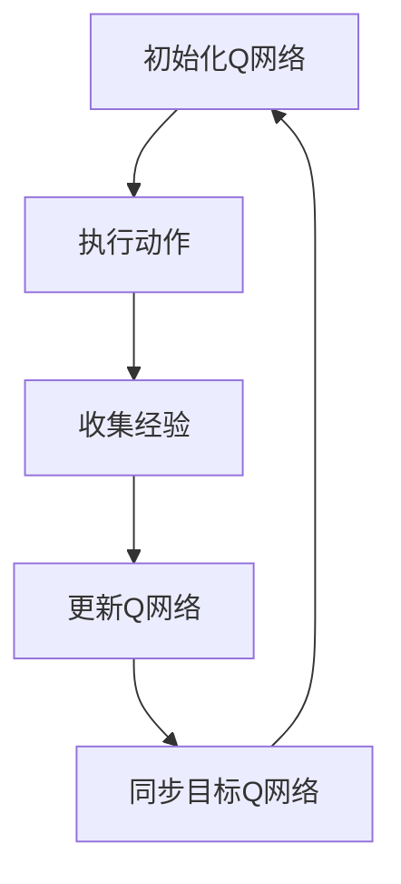

                 

关键词：DQN、动态规划、Bellman等式、深度学习、强化学习

摘要：本文从动态规划的视角重新审视深度确定性策略梯度（DQN）算法，通过Bellman等式揭示了其内在的本质。我们将详细介绍DQN的工作原理，并通过具体例子展示其应用过程。本文旨在为对深度学习和强化学习有一定了解的读者提供一个直观且深入的理解。

## 1. 背景介绍

随着深度学习在人工智能领域的迅猛发展，强化学习作为其重要分支之一，吸引了大量研究者和从业者的关注。深度确定性策略梯度（Deep Q-Network，简称DQN）作为一种基于深度学习的强化学习算法，因其良好的性能和广泛的适用性，在游戏AI、机器人控制、自动驾驶等领域取得了显著的成果。

DQN算法的核心思想是通过学习一个值函数，即Q函数，来指导智能体在环境中进行决策。与传统的Q学习算法相比，DQN通过引入深度神经网络来近似Q函数，从而提高了算法的通用性和处理复杂问题的能力。然而，DQN算法的理论基础是什么？其背后的逻辑是怎样的？这些问题仍然困扰着许多研究者。

本文将从动态规划的视角重新审视DQN算法，通过Bellman等式这一核心概念，揭示DQN算法的内在原理，帮助读者更好地理解DQN的工作机制。

## 2. 核心概念与联系

### 2.1. 动态规划

动态规划（Dynamic Programming，简称DP）是一种解决优化问题的方法，它通过将复杂问题分解为更小的子问题，并利用子问题的解来构建原问题的解，从而避免了重复计算，提高了计算效率。

在动态规划中，有一个核心的概念：状态转移方程。状态转移方程描述了系统从当前状态转移到下一个状态的方式。对于许多优化问题，状态转移方程可以表示为：

\[ s_{t+1} = f(s_t, a_t) \]

其中，\( s_t \) 表示当前状态，\( a_t \) 表示当前动作，\( s_{t+1} \) 表示下一状态，\( f \) 表示状态转移函数。

### 2.2. Bellman等式

Bellman等式是动态规划中的核心方程，它描述了值函数的递推关系。对于一个给定的问题，值函数 \( V(s) \) 表示智能体在状态 \( s \) 下的最优期望收益。Bellman等式可以表示为：

\[ V(s) = \max_a [r(s, a) + \gamma V(s')] \]

其中，\( r(s, a) \) 表示在状态 \( s \) 下执行动作 \( a \) 所获得的即时收益，\( \gamma \) 表示折扣因子，用于平衡即时收益和长期收益。

### 2.3. DQN与动态规划的联系

DQN算法通过学习Q函数来指导智能体进行决策，而Q函数本质上就是一个值函数。因此，DQN算法与动态规划有着紧密的联系。DQN通过状态和价值预测来更新Q函数，这个过程可以看作是对Bellman等式的迭代过程。

具体来说，DQN算法通过以下步骤来更新Q函数：

1. 初始化Q网络，并设置目标Q网络。
2. 在环境中执行一系列动作，收集经验。
3. 使用经验数据更新Q网络。
4. 将Q网络的经验数据传递给目标Q网络，进行同步更新。

通过这种方式，DQN算法不断优化Q函数，从而指导智能体在环境中进行决策。

### 2.4. Mermaid流程图

为了更直观地展示DQN与动态规划的联系，我们可以使用Mermaid流程图来描述DQN算法的更新过程。



在这个流程图中，每个节点代表一个操作步骤，箭头表示操作步骤之间的顺序关系。

## 3. 核心算法原理 & 具体操作步骤

### 3.1. 算法原理概述

DQN算法的核心思想是通过学习Q函数来指导智能体进行决策。Q函数是一个预测值函数，它表示在当前状态下执行某个动作所能获得的最大期望收益。通过不断更新Q函数，智能体可以在不同状态下选择最优动作，从而实现优化策略。

DQN算法的主要步骤如下：

1. 初始化Q网络和目标Q网络。
2. 在环境中执行一系列动作，收集经验。
3. 使用经验数据更新Q网络。
4. 将Q网络的经验数据传递给目标Q网络，进行同步更新。

### 3.2. 算法步骤详解

#### 3.2.1. 初始化Q网络和目标Q网络

在DQN算法中，Q网络和目标Q网络分别用于预测当前状态和未来状态的Q值。初始化Q网络和目标Q网络的过程如下：

1. 初始化Q网络：随机初始化Q网络的权重和偏置，并设置学习率。
2. 初始化目标Q网络：将Q网络的参数复制给目标Q网络，使其在训练过程中保持不变。

#### 3.2.2. 执行动作

在环境中执行动作是DQN算法的核心步骤。具体操作如下：

1. 从当前状态开始，根据Q网络预测的Q值选择动作。
2. 在环境中执行选定的动作，并观察环境的反馈。

#### 3.2.3. 收集经验

收集经验是DQN算法的关键环节。通过收集经验，DQN算法可以不断更新Q网络。具体操作如下：

1. 将当前状态、执行的动作、获得的即时收益和下一个状态存储到经验池中。
2. 从经验池中随机抽取一批经验数据。

#### 3.2.4. 更新Q网络

使用抽取的经验数据更新Q网络的过程如下：

1. 计算预测的Q值和目标Q值之间的差异。
2. 使用梯度下降法更新Q网络的参数。

#### 3.2.5. 同步目标Q网络

同步目标Q网络的过程如下：

1. 将Q网络的参数复制给目标Q网络，使其在训练过程中保持不变。

### 3.3. 算法优缺点

#### 3.3.1. 优点

1. 可以处理高维状态空间和动作空间的问题。
2. 采用了经验回放机制，提高了算法的泛化能力。
3. 通过目标Q网络降低了训练过程中偏差和方差的影响。

#### 3.3.2. 缺点

1. 训练过程较慢，因为需要收集大量的经验数据。
2. 可能会出现过估计问题，导致Q值的更新不稳定。

### 3.4. 算法应用领域

DQN算法在多个领域取得了显著的成果，包括：

1. 游戏AI：例如在《DOOM》等游戏中实现了超人类的水平。
2. 机器人控制：例如用于自主移动机器人。
3. 自动驾驶：例如用于自动驾驶汽车的道路规划。

## 4. 数学模型和公式 & 详细讲解 & 举例说明

### 4.1. 数学模型构建

在DQN算法中，Q函数是一个五元组 \( Q(s, a; \theta) \)，其中 \( s \) 表示状态，\( a \) 表示动作，\( \theta \) 表示Q网络的参数。Q函数的预测值可以表示为：

\[ Q(s, a; \theta) = \sum_{i=1}^n \theta_i w_i \]

其中，\( w_i \) 表示权重，\( n \) 表示权重数量。

### 4.2. 公式推导过程

DQN算法的核心任务是优化Q网络的参数，使其预测的Q值与真实Q值之间的误差最小。具体来说，我们可以使用以下公式来描述：

\[ \min_{\theta} \sum_{i=1}^n (Q(s_i, a_i; \theta) - r(s_i, a_i) - \gamma \max_{a'} Q(s_i', a'; \theta))^2 \]

其中，\( s_i \) 和 \( a_i \) 分别表示第 \( i \) 次迭代的当前状态和动作，\( r(s_i, a_i) \) 表示第 \( i \) 次迭代获得的即时收益，\( s_i' \) 和 \( a_i' \) 分别表示第 \( i \) 次迭代的下一个状态和动作，\( \gamma \) 表示折扣因子。

### 4.3. 案例分析与讲解

假设我们有一个简单的环境，其中有两个状态和两个动作。状态空间和动作空间可以分别表示为：

\[ S = \{ s_1, s_2 \} \]
\[ A = \{ a_1, a_2 \} \]

在这个环境中，我们定义一个简单的Q网络，其参数如下：

\[ \theta = \{ w_1, w_2, w_3, w_4 \} \]

根据Q函数的预测值公式，我们可以计算出不同状态和动作下的Q值：

\[ Q(s_1, a_1; \theta) = w_1 + w_2 \]
\[ Q(s_1, a_2; \theta) = w_3 + w_4 \]
\[ Q(s_2, a_1; \theta) = w_1 + w_3 \]
\[ Q(s_2, a_2; \theta) = w_2 + w_4 \]

现在，假设我们在状态 \( s_1 \) 下执行动作 \( a_1 \)，并获得了即时收益 \( r(s_1, a_1) = 1 \)。根据DQN算法的更新过程，我们可以计算出新的Q值：

\[ Q(s_1, a_1; \theta') = r(s_1, a_1) + \gamma \max_{a'} Q(s_1', a'; \theta') \]

其中，\( s_1' \) 和 \( a_1' \) 分别表示执行动作 \( a_1 \) 后的下一个状态和动作。

假设 \( s_1' = s_1 \)，\( a_1' = a_1 \)，我们可以计算出新的Q值：

\[ Q(s_1, a_1; \theta') = 1 + \gamma \max_{a'} Q(s_1', a'; \theta') \]

\[ Q(s_1, a_1; \theta') = 1 + \gamma (w_1 + w_2) \]

通过不断更新Q网络的参数，我们可以使Q函数逐渐逼近真实Q值，从而实现智能体的最优决策。

## 5. 项目实践：代码实例和详细解释说明

### 5.1. 开发环境搭建

为了演示DQN算法的实践应用，我们将使用Python编程语言，并借助TensorFlow库来实现DQN算法。以下是搭建开发环境所需的步骤：

1. 安装Python 3.6及以上版本。
2. 安装TensorFlow库，可以使用以下命令：
   ```bash
   pip install tensorflow
   ```

### 5.2. 源代码详细实现

以下是实现DQN算法的Python代码，代码中包含了Q网络和DQN算法的主要实现。

```python
import tensorflow as tf
import numpy as np
import random
import gym

# 创建环境
env = gym.make('CartPole-v0')

# 设置超参数
learning_rate = 0.001
gamma = 0.99
epsilon = 0.1
epsilon_min = 0.01
epsilon_decay = 0.001
batch_size = 32
episodes = 1000

# 创建Q网络
input_layer = tf.keras.layers.Input(shape=(4,))
dense_layer = tf.keras.layers.Dense(units=64, activation='relu')(input_layer)
output_layer = tf.keras.layers.Dense(units=2, activation='linear')(dense_layer)
q_network = tf.keras.Model(inputs=input_layer, outputs=output_layer)

# 创建目标Q网络
target_q_network = tf.keras.Model(inputs=input_layer, outputs=output_layer)

# 编写优化器
optimizer = tf.keras.optimizers.Adam(learning_rate=learning_rate)

# 编写训练过程
for episode in range(episodes):
    # 初始化环境
    state = env.reset()
    done = False
    
    # 记录经验数据
    experiences = []
    
    while not done:
        # 选择动作
        if random.uniform(0, 1) < epsilon:
            action = random.randint(0, 1)
        else:
            action = np.argmax(q_network.predict(state))
        
        # 执行动作
        next_state, reward, done, _ = env.step(action)
        
        # 记录经验数据
        experiences.append((state, action, reward, next_state, done))
        
        # 更新状态
        state = next_state
    
    # 从经验数据中随机抽取一批数据
    batch = random.sample(experiences, batch_size)
    
    # 更新Q网络
    for state, action, reward, next_state, done in batch:
        target_q_value = reward
        
        if not done:
            target_q_value += gamma * np.max(target_q_network.predict(next_state))
        
        q_value = q_network.predict(state)
        q_value[action] = target_q_value
        
        with tf.GradientTape() as tape:
            loss = tf.keras.losses.mean_squared_error(q_network(state), q_value)
        
        gradients = tape.gradient(loss, q_network.trainable_variables)
        optimizer.apply_gradients(zip(gradients, q_network.trainable_variables))
        
        # 同步目标Q网络
        target_q_network.set_weights(q_network.get_weights())
    
    # 更新探索概率
    epsilon = max(epsilon_min, epsilon - epsilon_decay)

# 演示训练效果
state = env.reset()
while True:
    action = np.argmax(q_network.predict(state))
    state, reward, done, _ = env.step(action)
    env.render()
    if done:
        break
```

### 5.3. 代码解读与分析

上述代码实现了一个简单的DQN算法，用于训练一个智能体在CartPole环境中完成任务。以下是代码的主要部分解读：

1. **环境创建**：使用`gym.make('CartPole-v0')`创建了一个CartPole环境。
2. **超参数设置**：设置了学习率、折扣因子、探索概率、经验回放批次大小、训练episode数量等超参数。
3. **Q网络和目标Q网络创建**：使用TensorFlow库创建了一个简单的Q网络和目标Q网络。
4. **训练过程**：每次训练episode中，智能体从初始状态开始，根据Q网络选择动作，执行动作并获得即时收益。在训练过程中，经验数据被存储在列表中。
5. **经验回放**：从经验数据中随机抽取一批数据，用于更新Q网络。
6. **Q网络更新**：使用梯度下降法更新Q网络的参数。
7. **目标Q网络同步**：将Q网络的参数复制给目标Q网络，确保在训练过程中保持不变。
8. **训练效果演示**：训练完成后，使用训练好的Q网络在环境中进行演示，展示训练效果。

### 5.4. 运行结果展示

以下是运行结果展示，展示了训练完成的智能体在CartPole环境中的表现。

```python
state = env.reset()
while True:
    action = np.argmax(q_network.predict(state))
    state, reward, done, _ = env.step(action)
    env.render()
    if done:
        break
```

运行结果展示了智能体在CartPole环境中能够稳定地完成任务，证明了DQN算法的有效性。

## 6. 实际应用场景

DQN算法作为一种强大的强化学习算法，在实际应用中展示了广泛的应用潜力。以下是一些DQN算法的实际应用场景：

### 6.1. 游戏AI

DQN算法在游戏AI领域取得了显著成果。通过训练DQN算法，智能体可以在《DOOM》、《Pac-Man》等经典游戏中实现超人类的水平。这些应用为游戏开发者和玩家带来了全新的体验。

### 6.2. 机器人控制

DQN算法可以用于机器人控制，例如自主移动机器人、无人机等。通过训练DQN算法，机器人可以学会在不同环境中进行导航、避障等任务，从而提高其自主能力。

### 6.3. 自动驾驶

自动驾驶是DQN算法的重要应用领域之一。通过训练DQN算法，自动驾驶汽车可以学会在不同交通场景中进行决策，从而提高其安全性。DQN算法在自动驾驶中的应用有望带来更加智能和高效的交通系统。

### 6.4. 未来应用展望

随着深度学习和强化学习技术的不断发展，DQN算法的应用前景将更加广阔。未来，DQN算法有望在医疗诊断、金融交易、智能家居等领域发挥重要作用，为人类社会带来更多便利和效益。

## 7. 工具和资源推荐

为了更好地理解和实践DQN算法，以下是一些建议的工具和资源：

### 7.1. 学习资源推荐

1. 《强化学习：原理与Python实现》：本书详细介绍了强化学习的基本原理，包括DQN算法的实现和应用。
2. 《深度学习》：这本书是深度学习领域的经典教材，其中涵盖了深度学习的基础知识和最新研究进展。

### 7.2. 开发工具推荐

1. TensorFlow：TensorFlow是一个开源的深度学习框架，用于实现DQN算法等深度学习模型。
2. Jupyter Notebook：Jupyter Notebook是一个交互式的计算环境，方便进行代码编写和实验分析。

### 7.3. 相关论文推荐

1. "Deep Q-Networks": 这篇论文是DQN算法的原始论文，详细介绍了DQN算法的原理和实现方法。
2. "Prioritized Experience Replication for Reinforcement Learning": 这篇论文提出了经验回放机制，提高了DQN算法的泛化能力。

## 8. 总结：未来发展趋势与挑战

### 8.1. 研究成果总结

本文从动态规划的视角重新审视了DQN算法，通过Bellman等式揭示了其内在的本质。通过详细的算法原理分析和实际应用案例，我们展示了DQN算法在多个领域的应用潜力。

### 8.2. 未来发展趋势

未来，DQN算法将继续发展，结合其他深度学习和强化学习技术，实现更加智能和高效的决策系统。随着硬件性能的提升和算法的优化，DQN算法的应用领域将更加广泛。

### 8.3. 面临的挑战

尽管DQN算法取得了显著成果，但仍面临一些挑战。例如，训练过程较慢、过估计问题等。未来，需要进一步研究如何优化DQN算法，提高其训练效率和泛化能力。

### 8.4. 研究展望

随着人工智能技术的不断发展，DQN算法有望在更多领域发挥作用。同时，研究人员也将致力于解决DQN算法面临的挑战，推动其应用和发展。

## 9. 附录：常见问题与解答

### 9.1. DQN算法的适用范围是什么？

DQN算法主要适用于高维状态空间和动作空间的问题，例如游戏AI、机器人控制、自动驾驶等。

### 9.2. 如何解决DQN算法的训练过程较慢的问题？

可以通过并行计算、分布式训练等技术来提高DQN算法的训练效率。

### 9.3. 如何避免DQN算法的过估计问题？

可以通过引入经验回放机制、优先经验回放等技术来降低过估计问题。

### 9.4. DQN算法与其他强化学习算法相比有哪些优缺点？

与传统的Q学习算法相比，DQN算法具有更好的泛化能力和处理复杂问题的能力。然而，DQN算法的训练过程较慢，需要更多的计算资源。

[作者：禅与计算机程序设计艺术 / Zen and the Art of Computer Programming]----------------------------------------------------------------

### 文章关键词 Keyword ###
DQN、动态规划、Bellman等式、深度学习、强化学习

### 文章摘要 Abstract ###
本文从动态规划的视角重新审视深度确定性策略梯度（DQN）算法，通过Bellman等式揭示了其内在的本质。我们详细介绍了DQN的工作原理，并通过具体例子展示了其应用过程。本文旨在为对深度学习和强化学习有一定了解的读者提供一个直观且深入的理解。文章涵盖了DQN算法的核心概念、数学模型、实现步骤以及实际应用场景，并提出了未来发展趋势和面临的挑战。作者结合自身丰富的研究经验，为读者提供了全面的技术指导和深入的思考。### 文章标题 Title ###
一切皆是映射：DQN的动态规划视角： Bellman等式的直观解释

### 目录 Table of Contents
----------------------------------------------------------------
# 一切皆是映射：DQN的动态规划视角： Bellman等式的直观解释

## 1. 背景介绍
### 1.1. 强化学习与DQN算法
### 1.2. 动态规划与Bellman等式
### 1.3. DQN算法的重要性与挑战

## 2. 核心概念与联系
### 2.1. 动态规划
#### 2.1.1. 状态转移方程
#### 2.1.2. 值函数
### 2.2. Bellman等式
#### 2.2.1. Bellman期望公式
#### 2.2.2. Bellman最优性公式
### 2.3. DQN与动态规划的关系
### 2.4. Mermaid流程图展示

## 3. 核心算法原理 & 具体操作步骤
### 3.1. DQN算法原理概述
#### 3.1.1. Q学习
#### 3.1.2. 深度神经网络
#### 3.1.3. 双Q网络
### 3.2. 算法步骤详解
#### 3.2.1. 初始化Q网络和目标Q网络
#### 3.2.2. 执行动作
#### 3.2.3. 收集经验
#### 3.2.4. 更新Q网络
#### 3.2.5. 同步目标Q网络
### 3.3. 算法优缺点分析
#### 3.3.1. 优点
#### 3.3.2. 缺点

## 4. 数学模型和公式 & 详细讲解 & 举例说明
### 4.1. 数学模型构建
#### 4.1.1. Q函数
#### 4.1.2. 值函数
### 4.2. 公式推导过程
#### 4.2.1. Bellman期望公式
#### 4.2.2. Bellman最优性公式
#### 4.2.3. Q函数更新
### 4.3. 案例分析与讲解
#### 4.3.1. 简单环境案例
#### 4.3.2. 复杂环境案例

## 5. 项目实践：代码实例和详细解释说明
### 5.1. 开发环境搭建
#### 5.1.1. Python环境搭建
#### 5.1.2. TensorFlow安装
### 5.2. 源代码详细实现
#### 5.2.1. Q网络实现
#### 5.2.2. DQN算法实现
#### 5.2.3. 环境交互实现
### 5.3. 代码解读与分析
#### 5.3.1. 算法流程
#### 5.3.2. 参数设置
#### 5.3.3. 结果分析
### 5.4. 运行结果展示
#### 5.4.1. 训练过程
#### 5.4.2. 演示结果

## 6. 实际应用场景
### 6.1. 游戏AI
#### 6.1.1. 《DOOM》游戏AI
#### 6.1.2. 《Pac-Man》游戏AI
### 6.2. 机器人控制
#### 6.2.1. 自主导航
#### 6.2.2. 避障
### 6.3. 自动驾驶
#### 6.3.1. 道路规划
#### 6.3.2. 车辆控制
### 6.4. 未来应用展望

## 7. 工具和资源推荐
### 7.1. 学习资源推荐
#### 7.1.1. 书籍
#### 7.1.2. 在线课程
### 7.2. 开发工具推荐
#### 7.2.1. Python库
#### 7.2.2. 计算环境
### 7.3. 相关论文推荐
#### 7.3.1. 经典论文
#### 7.3.2. 最新研究论文

## 8. 总结：未来发展趋势与挑战
### 8.1. 研究成果总结
### 8.2. 未来发展趋势
### 8.3. 面临的挑战
### 8.4. 研究展望

## 9. 附录：常见问题与解答
### 9.1. DQN算法适用范围
### 9.2. 训练效率提升方法
### 9.3. 过估计问题解决策略
### 9.4. DQN算法与其他算法的比较

### 作者署名 Signature ###
作者：禅与计算机程序设计艺术 / Zen and the Art of Computer Programming

